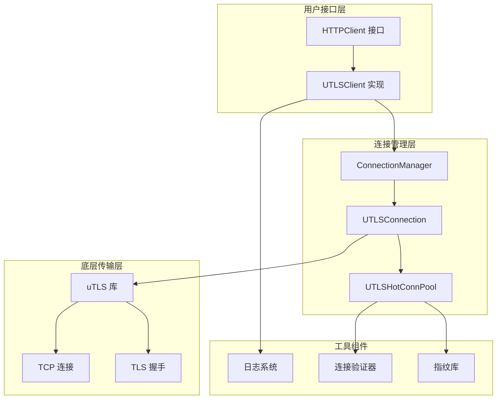
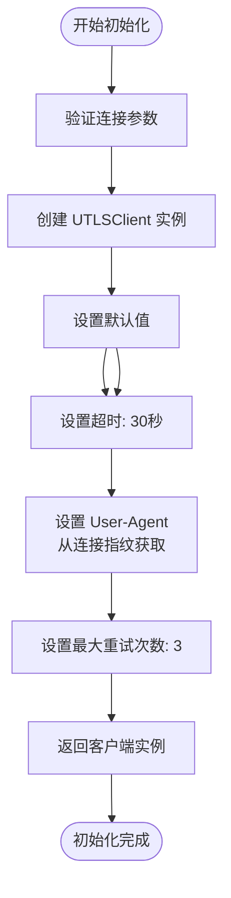
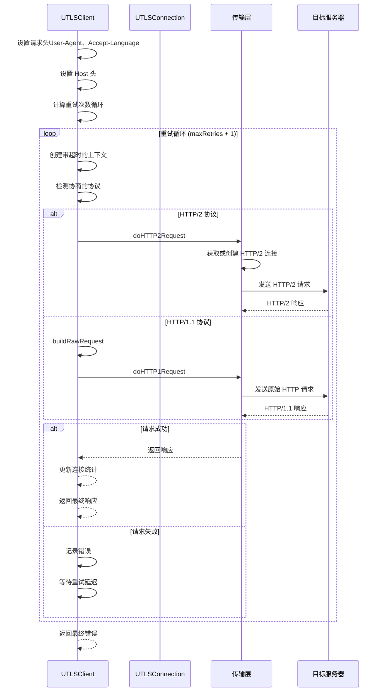
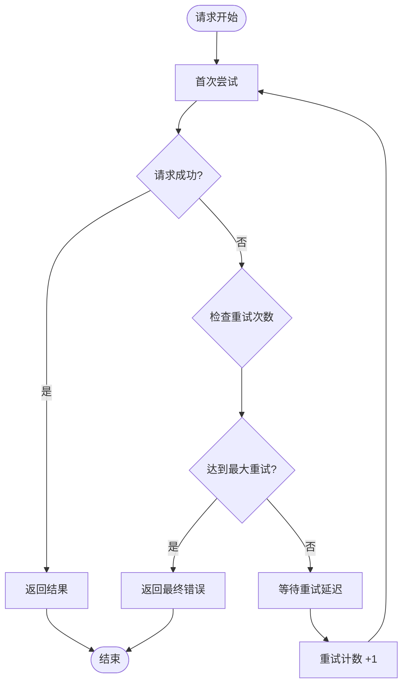
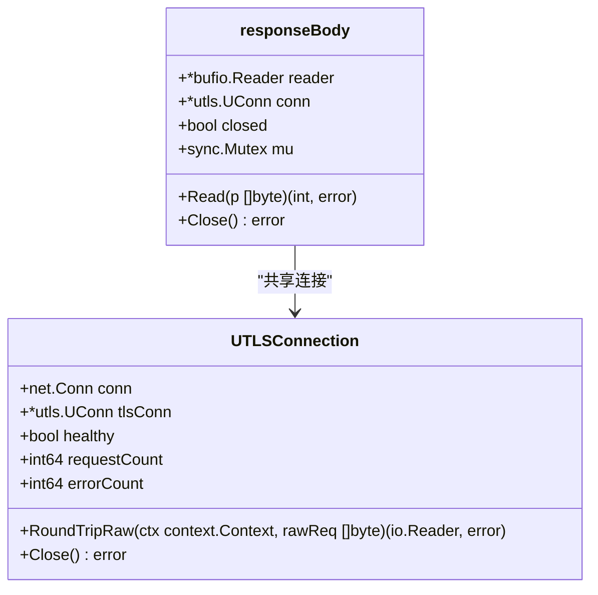
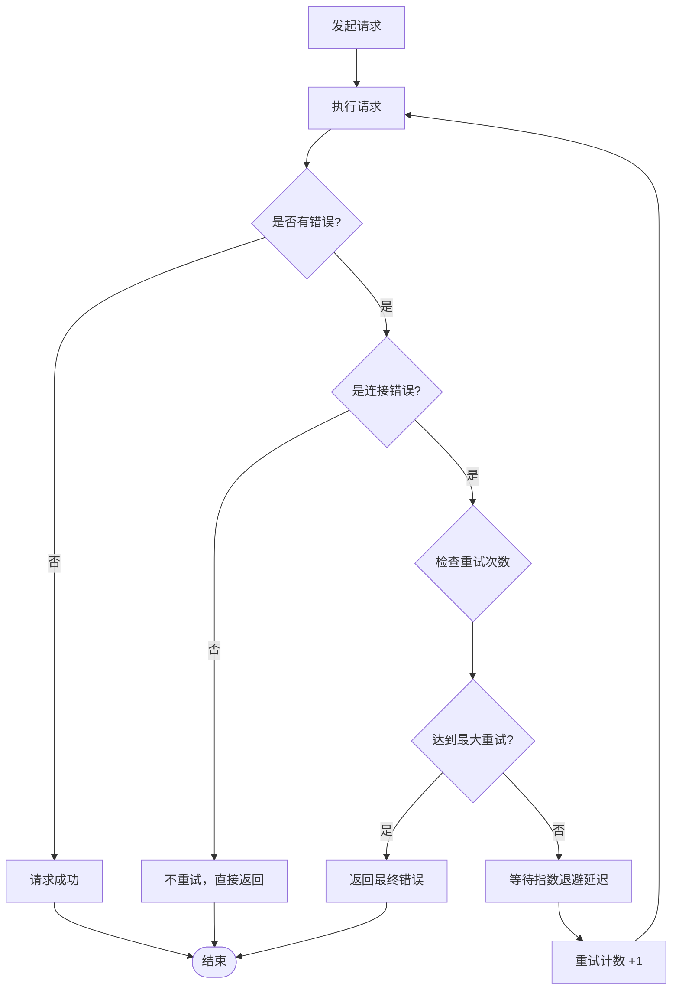

# UTLSClient API 详细文档

<cite>
**本文档引用的文件**
- [utlsclient.go](file://utlsclient/utlsclient.go)
- [interfaces.go](file://utlsclient/interfaces.go)
- [connection_manager.go](file://utlsclient/connection_manager.go)
- [constants.go](file://utlsclient/constants.go)
- [utlshotconnpool.go](file://utlsclient/utlshotconnpool.go)
- [test_helpers.go](file://utlsclient/test_helpers.go)
- [example_basic_usage.go](file://examples/utlsclient/example_basic_usage.go)
- [example_utlsclient_usage.go](file://examples/utlsclient/example_utlsclient_usage.go)
- [main.go](file://cmd/utlsclient/main.go)
- [utlsclient_test.go](file://test/utlsclient/utlsclient_test.go)
</cite>

## 目录
1. [简介](#简介)
2. [项目架构概览](#项目架构概览)
3. [核心组件分析](#核心组件分析)
4. [UTLSClient 构造与初始化](#utlsclient-构造与初始化)
5. [请求执行流程](#请求执行流程)
6. [快捷方法详解](#快捷方法详解)
7. [配置与优化](#配置与优化)
8. [连接管理机制](#连接管理机制)
9. [错误处理与重试](#错误处理与重试)
10. [性能特征与最佳实践](#性能特征与最佳实践)
11. [故障排除指南](#故障排除指南)
12. [总结](#总结)

## 简介

UTLSClient 是一个基于 uTLS（Universal TLS）库的高级 HTTP 客户端，专门设计用于模拟真实浏览器的 TLS 握手行为。它提供了强大的连接池管理、自动协议检测、请求重试和响应体管理等功能，适用于需要高仿真度网络请求的应用场景。

### 主要特性

- **uTLS 集成**：基于 refraction-networking/utls 库，提供真实的浏览器 TLS 指纹
- **智能协议检测**：自动识别并使用 HTTP/1.1 或 HTTP/2 协议
- **连接池管理**：内置高效的热连接池，支持连接复用和负载均衡
- **请求重试机制**：智能重试策略，处理网络不稳定情况
- **响应体包装**：安全的响应体管理，支持连接保持活跃
- **并发安全**：全面的并发控制和线程安全保障

## 项目架构概览



**图表来源**
- [utlsclient.go](file://utlsclient/utlsclient.go#L37-L43)
- [connection_manager.go](file://utlsclient/connection_manager.go#L8-L14)
- [utlshotconnpool.go](file://utlsclient/utlshotconnpool.go#L204-L233)

## 核心组件分析

### UTLSClient 结构体

UTLSClient 是整个系统的核心组件，封装了 uTLS 连接并提供了高级 HTTP 请求功能。

```mermaid
classDiagram
class UTLSClient {
+UTLSConnection conn
+time.Duration timeout
+string userAgent
+int maxRetries
+NewUTLSClient(conn *UTLSConnection) *UTLSClient
+SetTimeout(timeout time.Duration)
+SetUserAgent(userAgent string)
+SetMaxRetries(maxRetries int)
+Do(req *http.Request) (*http.Response, error)
+DoWithContext(ctx context.Context, req *http.Request) (*http.Response, error)
+Get(url string) (*http.Response, error)
+Post(url string, contentType string, body io.Reader) (*http.Response, error)
+Head(url string) (*http.Response, error)
}
class UTLSConnection {
+net.Conn conn
+*utls.UConn tlsConn
+string targetIP
+string targetHost
+Profile fingerprint
+string acceptLanguage
+interface{} h2ClientConn
+sync.Mutex h2Mu
+time.Time created
+time.Time lastUsed
+bool inUse
+bool healthy
+int64 requestCount
+int64 errorCount
+RoundTripRaw(ctx context.Context, rawReq []byte) (io.Reader, error)
+Close() error
+TargetHost() string
+TargetIP() string
+Fingerprint() Profile
+Stats() ConnectionStats
}
class ConnectionManager {
+sync.RWMutex mu
+map[string]*UTLSConnection connections
+map[string][]string hostMapping
+*PoolConfig config
+AddConnection(conn *UTLSConnection)
+GetConnection(ip string) *UTLSConnection
+RemoveConnection(ip string)
+GetConnectionsForHost(host string) []*UTLSConnection
+CleanupIdleConnections() int
+CleanupExpiredConnections(maxLifetime time.Duration) int
}
UTLSClient --> UTLSConnection : "使用"
ConnectionManager --> UTLSConnection : "管理"
UTLSClient --> ConnectionManager : "依赖"
```

**图表来源**
- [utlsclient.go](file://utlsclient/utlsclient.go#L37-L43)
- [utlshotconnpool.go](file://utlsclient/utlshotconnpool.go#L204-L233)
- [connection_manager.go](file://utlsclient/connection_manager.go#L8-L14)

**章节来源**
- [utlsclient.go](file://utlsclient/utlsclient.go#L37-L43)
- [utlshotconnpool.go](file://utlsclient/utlshotconnpool.go#L204-L233)
- [connection_manager.go](file://utlsclient/connection_manager.go#L8-L14)

## UTLSClient 构造与初始化

### NewUTLSClient 构造函数

NewUTLSClient 是创建 UTLSClient 实例的主要入口点，接受一个 UTLSConnection 作为参数。

#### 参数要求

| 参数 | 类型 | 必需 | 描述 |
|------|------|------|------|
| conn | *UTLSConnection | 是 | 已建立的 uTLS 连接对象 |

#### 初始化过程



**图表来源**
- [utlsclient.go](file://utlsclient/utlsclient.go#L46-L52)

#### 默认配置

- **超时时间**：30 秒
- **User-Agent**：从连接的 TLS 指纹中提取
- **最大重试次数**：3 次

**章节来源**
- [utlsclient.go](file://utlsclient/utlsclient.go#L46-L52)

## 请求执行流程

### Do 和 DoWithContext 方法

这两个方法是 UTLSClient 的核心请求执行入口，提供了基础的 HTTP 请求功能。

#### 请求执行流程



**图表来源**
- [utlsclient.go](file://utlsclient/utlsclient.go#L80-L118)
- [utlsclient.go](file://utlsclient/utlsclient.go#L121-L140)

#### 协议自动检测机制

UTLSClient 能够自动检测与服务器协商的协议版本：

1. **HTTP/2 检测**：通过 `ConnectionState().NegotiatedProtocol` 检查是否为 "h2"
2. **HTTP/1.1 回退**：当未协商 HTTP/2 时自动使用 HTTP/1.1
3. **连接复用**：HTTP/2 连接支持多路复用，提高并发性能

**章节来源**
- [utlsclient.go](file://utlsclient/utlsclient.go#L80-L118)
- [utlsclient.go](file://utlsclient/utlsclient.go#L121-L140)

## 快捷方法详解

### Get 方法

执行 HTTP GET 请求的便捷方法。

#### 使用场景
- 获取网页内容
- 下载静态资源
- API 数据查询

#### 实现特点
- 自动设置请求方法为 "GET"
- 支持完整的请求头设置
- 集成重试机制

### Post 方法

执行 HTTP POST 请求的便捷方法。

#### 使用场景
- 表单数据提交
- API 数据上传
- 文件上传

#### 参数说明
| 参数 | 类型 | 描述 |
|------|------|------|
| url | string | 目标 URL |
| contentType | string | 内容类型（如 "application/json"） |
| body | io.Reader | 请求体数据 |

### Head 方法

执行 HTTP HEAD 请求的便捷方法。

#### 使用场景
- 检查资源是否存在
- 获取资源元信息
- 测试连接可用性

#### 性能优势
- 不下载响应体，节省带宽
- 快速检测资源状态
- 减少服务器负载

**章节来源**
- [utlsclient.go](file://utlsclient/utlsclient.go#L365-L391)

## 配置与优化

### SetTimeout 方法

设置请求超时时间，影响整个请求生命周期。

#### 参数配置
- **最小值**：建议设置为 5 秒以上
- **推荐值**：根据网络状况设置 10-30 秒
- **最大值**：不超过 60 秒

#### 性能考虑
- 较短的超时提高响应速度但可能增加失败率
- 较长的超时提高成功率但降低用户体验

### SetUserAgent 方法

自定义 User-Agent 字符串，影响服务器识别。

#### 最佳实践
- 使用真实浏览器 User-Agent
- 避免过于独特的标识
- 考虑反爬虫策略

### SetMaxRetries 方法

配置最大重试次数，影响请求的可靠性。

#### 重试策略


**图表来源**
- [utlsclient.go](file://utlsclient/utlsclient.go#L104-L118)

#### 推荐配置
- **低延迟网络**：2-3 次重试
- **高延迟网络**：3-5 次重试
- **不稳定网络**：5-10 次重试

**章节来源**
- [utlsclient.go](file://utlsclient/utlsclient.go#L55-L67)

## 连接管理机制

### 响应体包装器

UTLSClient 实现了专门的响应体包装器来管理连接生命周期。

#### responseBody 结构



**图表来源**
- [utlsclient.go](file://utlsclient/utlsclient.go#L333-L363)

#### 生命周期管理

1. **创建阶段**：响应体包装器绑定到连接
2. **读取阶段**：并发安全的读取操作
3. **关闭阶段**：标记为已关闭但不关闭底层连接

#### 资源清理机制

- **连接保持**：响应体关闭时不关闭底层连接
- **内存管理**：及时释放缓冲区资源
- **并发安全**：使用互斥锁保护状态变更

**章节来源**
- [utlsclient.go](file://utlsclient/utlsclient.go#L333-L363)

## 错误处理与重试

### 连接错误检测

IsConnectionError 函数提供了智能的连接错误识别。

#### 错误关键词检测
- "connection"
- "broken pipe"
- "connection reset"
- "connection refused"
- "connection closed"

#### 预定义错误类型
- `ErrConnectionBroken`
- `ErrConnectionClosed`

### 重试机制详解



**图表来源**
- [utlsclient.go](file://utlsclient/utlsclient.go#L22-L35)
- [utlsclient.go](file://utlsclient/utlsclient.go#L104-L118)

### 错误分类与处理策略

| 错误类型 | 处理策略 | 重试建议 |
|----------|----------|----------|
| 连接超时 | 重试 | 是 |
| 连接断开 | 重试 | 是 |
| 网络不可达 | 不重试 | 否 |
| 服务器错误 | 不重试 | 否 |
| 协议错误 | 不重试 | 否 |

**章节来源**
- [utlsclient.go](file://utlsclient/utlsclient.go#L22-L35)
- [utlsclient.go](file://utlsclient/utlsclient.go#L104-L118)

## 性能特征与最佳实践

### 并发安全性

UTLSClient 提供了全面的并发安全保障：

#### 锁机制
- **连接级锁**：每个 UTLSConnection 使用独立的互斥锁
- **读写锁**：ConnectionManager 使用读写锁优化并发访问
- **HTTP/2 锁**：单独的锁保护 HTTP/2 连接状态

#### 线程安全保证
- 所有公共方法都是线程安全的
- 内部状态变更使用原子操作
- 条件变量用于连接复用同步

### 资源消耗特征

#### 内存使用
- **连接池**：按需创建连接，支持连接复用
- **响应体**：流式处理，避免大文件内存占用
- **缓冲区**：合理大小的缓冲区减少内存碎片

#### CPU 使用
- **TLS 握手**：一次性计算，后续连接复用
- **协议检测**：轻量级状态检查
- **请求解析**：高效的数据解析算法

### 性能优化建议

#### 连接池配置
```go
// 推荐配置
config := &PoolConfig{
    MaxConnections:         100,      // 总连接数
    MaxConnsPerHost:        10,       // 每主机最大连接
    MaxIdleConns:           20,       // 最大空闲连接
    ConnTimeout:            30 * time.Second,
    IdleTimeout:            60 * time.Second,
    MaxLifetime:            300 * time.Second,
}
```

#### 请求优化
- 使用 HTTP/2 提高并发性能
- 启用连接复用减少握手开销
- 合理设置超时时间平衡性能和可靠性

**章节来源**
- [connection_manager.go](file://utlsclient/connection_manager.go#L8-L14)
- [utlshotconnpool.go](file://utlsclient/utlshotconnpool.go#L170-L200)

## 故障排除指南

### 常见问题与解决方案

#### 连接失败问题

**问题症状**：频繁出现连接超时或连接拒绝错误

**排查步骤**：
1. 检查网络连通性
2. 验证目标服务器状态
3. 检查防火墙设置
4. 调整连接超时配置

**解决方案**：
```go
// 增加超时时间
client.SetTimeout(60 * time.Second)

// 增加重试次数
client.SetMaxRetries(5)
```

#### 协议协商失败

**问题症状**：始终使用 HTTP/1.1 而非 HTTP/2

**排查步骤**：
1. 检查服务器是否支持 HTTP/2
2. 验证 TLS 指纹兼容性
3. 检查协议版本支持

**解决方案**：
- 使用更通用的 TLS 指纹
- 检查服务器配置
- 考虑降级到 HTTP/1.1

#### 内存泄漏问题

**问题症状**：长时间运行后内存持续增长

**排查步骤**：
1. 检查响应体是否正确关闭
2. 验证连接池清理机制
3. 监控连接创建和销毁

**解决方案**：
```go
// 确保正确关闭响应体
resp, err := client.Get(url)
if err == nil {
    defer resp.Body.Close()
    // 处理响应
}
```

### 调试技巧

#### 启用调试日志
```go
// 启用详细日志
client.SetDebug(true)

// 或使用全局日志系统
projlogger.SetGlobalLogger(&projlogger.DefaultLogger{})
```

#### 监控连接状态
```go
// 获取连接统计信息
stats := conn.Stats()
fmt.Printf("请求次数: %d, 错误次数: %d, 健康状态: %v\n", 
    stats.RequestCount, stats.ErrorCount, stats.IsHealthy)
```

**章节来源**
- [utlsclient.go](file://utlsclient/utlsclient.go#L70-L78)
- [utlshotconnpool.go](file://utlsclient/utlshotconnpool.go#L1234-L1245)

## 总结

UTLSClient API 提供了一个功能强大且易于使用的 uTLS 基础 HTTP 客户端解决方案。其主要优势包括：

### 核心优势
- **真实浏览器模拟**：基于 uTLS 提供真实的 TLS 指纹
- **智能协议处理**：自动检测和使用最优协议
- **高性能连接池**：内置高效的连接管理和复用机制
- **健壮的错误处理**：完善的重试和错误恢复机制

### 适用场景
- 网页抓取和数据采集
- API 调用和微服务通信
- 网络监控和健康检查
- 安全测试和渗透测试

### 最佳实践要点
1. **合理配置超时和重试**：根据网络环境调整参数
2. **正确管理资源**：确保响应体和连接的正确关闭
3. **监控连接状态**：定期检查连接池和单个连接的健康状态
4. **遵循并发安全原则**：充分利用内置的并发控制机制

通过遵循本文档的指导原则和最佳实践，开发者可以充分发挥 UTLSClient 的性能优势，构建稳定可靠的网络应用程序。