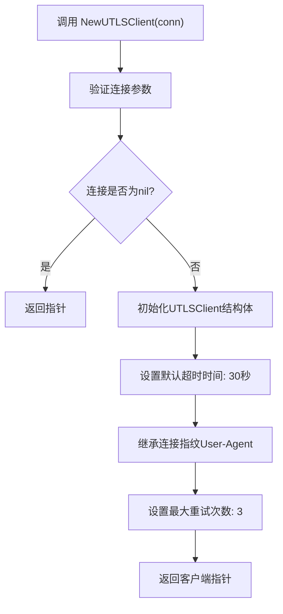
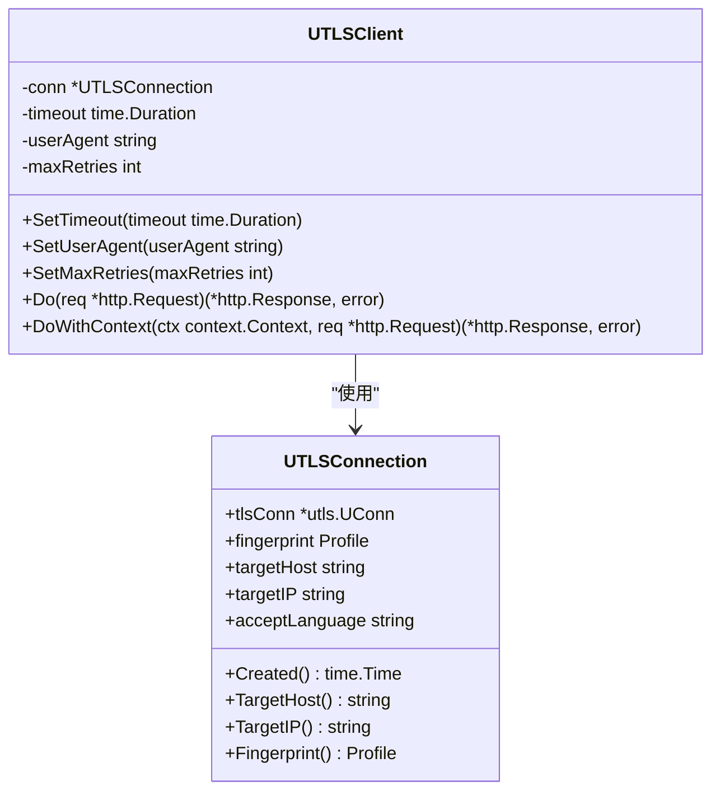
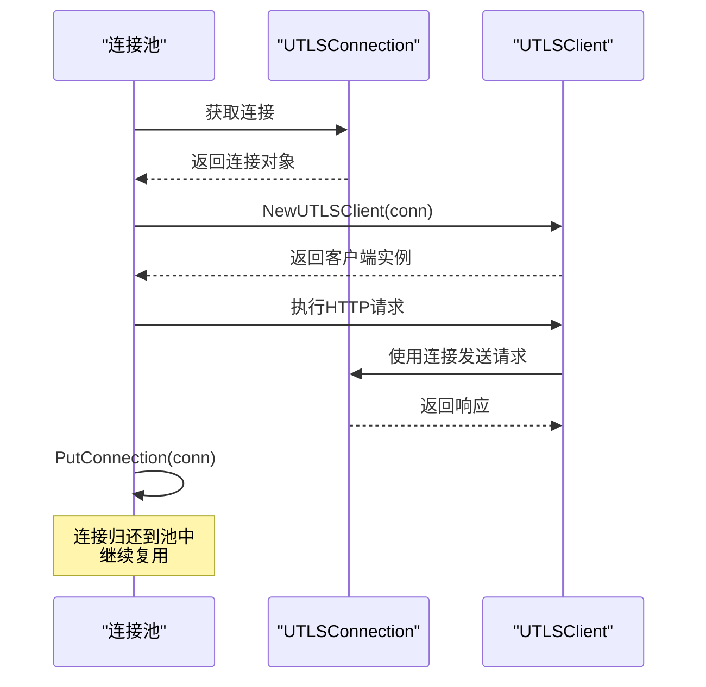
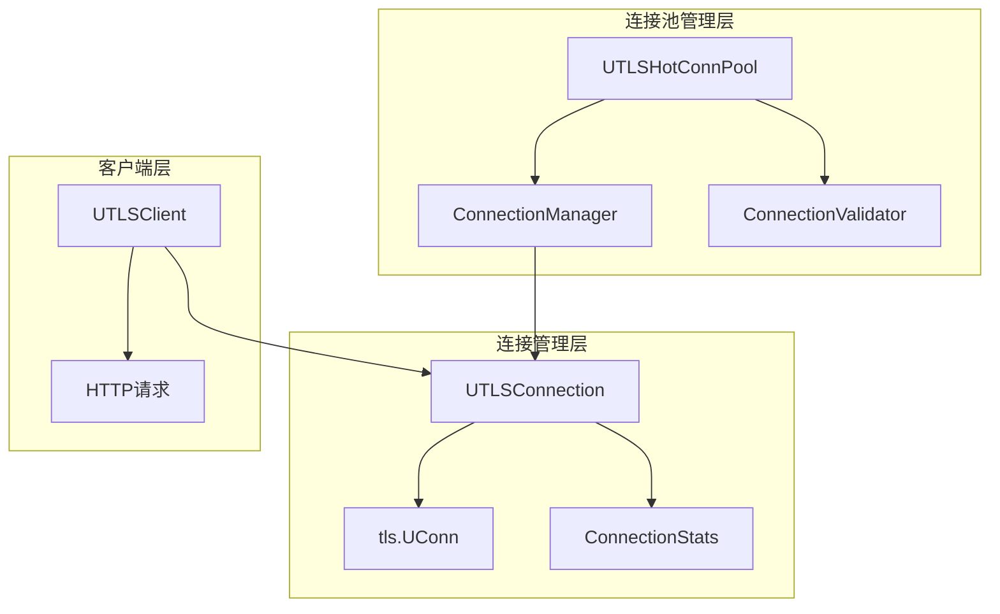

# UTLSClient 构造函数详细文档

<cite>
**本文档中引用的文件**
- [utlsclient.go](file://utlsclient/utlsclient.go)
- [example_utlsclient_usage.go](file://examples/utlsclient/example_utlsclient_usage.go)
- [example_hotconnpool_usage.go](file://examples/utlsclient/example_hotconnpool_usage.go)
- [main.go](file://cmd/utlsclient/main.go)
- [interfaces.go](file://utlsclient/interfaces.go)
- [connection_manager.go](file://utlsclient/connection_manager.go)
- [constants.go](file://utlsclient/constants.go)
- [utlshotconnpool.go](file://utlsclient/utlshotconnpool.go)
- [test_helpers.go](file://utlsclient/test_helpers.go)
</cite>

## 目录
1. [简介](#简介)
2. [NewUTLSClient函数概述](#newutlsclient函数概述)
3. [构造函数实现机制](#构造函数实现机制)
4. [默认配置初始化](#默认配置初始化)
5. [连接对象要求](#连接对象要求)
6. [构造函数返回值](#构造函数返回值)
7. [连接生命周期管理](#连接生命周期管理)
8. [使用示例](#使用示例)
9. [常见错误处理](#常见错误处理)
10. [与连接池的协作关系](#与连接池的协作关系)
11. [最佳实践](#最佳实践)

## 简介

UTLSClient构造函数`NewUTLSClient`是创建基于uTLS的HTTP客户端的核心入口点。该构造函数接受一个已建立的`UTLSConnection`连接对象作为必需参数，为其初始化默认配置并返回一个功能完整的HTTP客户端实例。

## NewUTLSClient函数概述



**图表来源**
- [utlsclient.go](file://utlsclient/utlsclient.go#L45-L53)

**章节来源**
- [utlsclient.go](file://utlsclient/utlsclient.go#L45-L53)

## 构造函数实现机制

### 函数签名

`NewUTLSClient`函数的完整签名如下：

```go
func NewUTLSClient(conn *UTLSConnection) *UTLSClient
```

### 核心实现逻辑

构造函数采用简洁的设计模式，直接将传入的连接对象封装到UTLSClient结构体中：



**图表来源**
- [utlsclient.go](file://utlsclient/utlsclient.go#L37-L43)
- [utlshotconnpool.go](file://utlsclient/utlshotconnpool.go#L204-L233)

**章节来源**
- [utlsclient.go](file://utlsclient/utlsclient.go#L45-L53)

## 默认配置初始化

### 30秒默认超时时间

构造函数为每个UTLSClient实例设置30秒的默认请求超时时间：

```go
timeout: 30 * time.Second
```

这个超时时间适用于所有HTTP请求，包括GET、POST、HEAD等操作。可以通过`SetTimeout`方法动态调整。

### 继承连接指纹User-Agent

客户端自动从传入的`UTLSConnection`对象中提取User-Agent信息：

```go
userAgent: conn.fingerprint.UserAgent
```

这种设计确保了客户端与底层连接的指纹一致性，维持了浏览器模拟的真实性。

### 3次最大重试次数

构造函数设置默认的最大重试次数为3次：

```go
maxRetries: 3
```

重试机制会在请求失败时自动触发，每次重试之间会有1秒的延迟（默认重试延迟）。

**章节来源**
- [utlsclient.go](file://utlsclient/utlsclient.go#L47-L51)
- [constants.go](file://utlsclient/constants.go#L40-L42)

## 连接对象要求

### 必须传入已建立的连接

`NewUTLSClient`函数要求传入一个已经成功建立的`UTLSConnection`对象。这意味着：

1. **连接必须有效**：连接对象不能为`nil`
2. **TLS握手已完成**：底层的TLS连接必须已经完成握手过程
3. **指纹配置就绪**：连接必须包含有效的TLS指纹信息

### 连接状态验证

虽然构造函数本身不进行连接状态验证，但后续的HTTP请求会自动检测连接的健康状态。如果连接不可用，请求会触发重试机制。

### 连接池集成

通常情况下，连接是从连接池中获取的，这确保了连接的质量和可用性。

**章节来源**
- [utlsclient.go](file://utlsclient/utlsclient.go#L45-L53)

## 构造函数返回值

### 返回类型

`NewUTLSClient`函数返回一个指向`UTLSClient`结构体的指针：

```go
return &UTLSClient{
    conn:       conn,
    timeout:    30 * time.Second,
    userAgent:  conn.fingerprint.UserAgent,
    maxRetries: 3,
}
```

### 结构体字段详解

| 字段 | 类型 | 描述 |
|------|------|------|
| `conn` | `*UTLSConnection` | 已建立的TLS连接对象 |
| `timeout` | `time.Duration` | 请求超时时间（默认30秒） |
| `userAgent` | `string` | 从连接指纹继承的User-Agent |
| `maxRetries` | `int` | 最大重试次数（默认3次） |

**章节来源**
- [utlsclient.go](file://utlsclient/utlsclient.go#L47-L51)

## 连接生命周期管理

### 自动连接管理

UTLSClient构造函数的一个重要特性是它不需要调用者手动管理连接的生命周期。这是因为：

1. **连接所有权**：连接对象的所有权完全由连接池管理
2. **自动复用**：连接可以在多个客户端实例间共享复用
3. **资源释放**：连接的关闭和清理由连接池统一处理

### 连接池协作



**图表来源**
- [example_utlsclient_usage.go](file://examples/utlsclient/example_utlsclient_usage.go#L30-L31)
- [example_hotconnpool_usage.go](file://examples/utlsclient/example_hotconnpool_usage.go#L112-L113)

**章节来源**
- [example_utlsclient_usage.go](file://examples/utlsclient/example_utlsclient_usage.go#L30-L31)
- [example_hotconnpool_usage.go](file://examples/utlsclient/example_hotconnpool_usage.go#L112-L113)

## 使用示例

### 基本使用模式

以下展示了正确的使用方式：

```go
// 1. 从连接池获取连接
conn, err := pool.GetConnection("example.com")
if err != nil {
    log.Fatalf("获取连接失败: %v", err)
}
defer pool.PutConnection(conn) // 确保连接归还

// 2. 创建UTLSClient
client := utlsclient.NewUTLSClient(conn)
client.SetTimeout(10 * time.Second)
client.SetDebug(true) // 可选：开启调试模式

// 3. 执行HTTP请求
resp, err := client.Get("https://example.com/api/data")
if err != nil {
    log.Printf("请求失败: %v", err)
} else {
    defer resp.Body.Close()
    // 处理响应...
}
```

### 高级配置示例

```go
// 获取连接
conn, err := pool.GetConnectionWithValidation("https://api.example.com/v1/data")
if err != nil {
    return nil, err
}

// 创建客户端并配置
client := utlsclient.NewUTLSClient(conn)
client.SetTimeout(15 * time.Second)
client.SetMaxRetries(5)
client.SetUserAgent("Custom-User-Agent/1.0")

// 自定义请求头
req, err := http.NewRequest("GET", "https://api.example.com/v1/data", nil)
if err != nil {
    pool.PutConnection(conn)
    return nil, err
}
req.Header.Set("Authorization", "Bearer "+accessToken)
req.Header.Set("Accept", "application/json")

// 执行请求
resp, err := client.Do(req)
if err != nil {
    pool.PutConnection(conn)
    return nil, err
}
```

**章节来源**
- [example_utlsclient_usage.go](file://examples/utlsclient/example_utlsclient_usage.go#L33-L37)
- [example_hotconnpool_usage.go](file://examples/utlsclient/example_hotconnpool_usage.go#L56-L58)
- [main.go](file://cmd/utlsclient/main.go#L63-L67)

## 常见错误处理

### 传入nil连接的运行时错误

如果向`NewUTLSClient`传入`nil`连接，会导致运行时panic：

```go
// ❌ 错误示例：传入nil连接
var conn *UTLSConnection = nil
client := utlsclient.NewUTLSClient(conn) // 运行时panic
```

### 连接状态检查

虽然构造函数不检查连接状态，但建议在使用前验证连接的有效性：

```go
// 检查连接是否健康
if !conn.IsHealthy() {
    log.Println("连接不健康，重新获取")
    // 重新获取连接...
}
```

### 错误恢复策略

```go
func createClientWithRetry(pool HotConnPool, host string) (*utlsclient.UTLSClient, error) {
    var conn *UTLSConnection
    var err error
    
    for i := 0; i < 3; i++ {
        conn, err = pool.GetConnection(host)
        if err == nil && conn.IsHealthy() {
            break
        }
        time.Sleep(time.Duration(i+1) * time.Second)
    }
    
    if err != nil {
        return nil, fmt.Errorf("获取健康连接失败: %w", err)
    }
    
    defer func() {
        if err != nil {
            pool.PutConnection(conn)
        }
    }()
    
    return utlsclient.NewUTLSClient(conn), nil
}
```

**章节来源**
- [test_helpers.go](file://utlsclient/test_helpers.go#L10-L30)

## 与连接池的协作关系

### 连接池的作用

UTLSClient构造函数与`UTLSHotConnPool`紧密协作，形成完整的连接管理生态系统：



**图表来源**
- [utlshotconnpool.go](file://utlsclient/utlshotconnpool.go#L204-L233)
- [connection_manager.go](file://utlsclient/connection_manager.go#L8-L15)

### 连接获取流程

典型的连接获取和客户端创建流程：

1. **从连接池获取连接**：`pool.GetConnection(host)`
2. **验证连接健康状态**：`conn.IsHealthy()`
3. **创建UTLSClient**：`NewUTLSClient(conn)`
4. **执行HTTP请求**：`client.Do(req)`
5. **归还连接**：`pool.PutConnection(conn)`

### 连接复用机制

连接池确保连接的高效复用：

- **空闲连接复用**：未使用的连接可以被其他客户端重用
- **健康检查**：定期验证连接的可用性
- **负载均衡**：在多个连接间分配请求

**章节来源**
- [example_utlsclient_usage.go](file://examples/utlsclient/example_utlsclient_usage.go#L26-L31)
- [example_hotconnpool_usage.go](file://examples/utlsclient/example_hotconnpool_usage.go#L47-L52)

## 最佳实践

### 1. 正确的连接管理

```go
// ✅ 推荐：使用defer确保连接归还
func processRequest(pool HotConnPool, url string) error {
    conn, err := pool.GetConnection(extractHost(url))
    if err != nil {
        return err
    }
    defer pool.PutConnection(conn) // 确保连接归还
    
    client := utlsclient.NewUTLSClient(conn)
    // 执行请求...
    return nil
}
```

### 2. 连接验证

```go
// ✅ 推荐：使用路径验证获取连接
conn, err := pool.GetConnectionWithValidation(url)
if err != nil {
    return err
}

// 确保连接健康后再创建客户端
if !conn.IsHealthy() {
    return errors.New("连接不健康")
}

client := utlsclient.NewUTLSClient(conn)
```

### 3. 配置优化

```go
// ✅ 推荐：根据需求调整超时和重试
client := utlsclient.NewUTLSClient(conn)
client.SetTimeout(30 * time.Second)    // 根据网络状况调整
client.SetMaxRetries(3)               // 根据可靠性要求调整
```

### 4. 错误处理

```go
// ✅ 推荐：完善的错误处理
func createRobustClient(pool HotConnPool, host string) (*utlsclient.UTLSClient, error) {
    // 获取连接
    conn, err := pool.GetConnection(host)
    if err != nil {
        return nil, fmt.Errorf("获取连接失败: %w", err)
    }
    
    // 验证连接
    if !conn.IsHealthy() {
        pool.PutConnection(conn)
        return nil, errors.New("连接不健康")
    }
    
    // 创建客户端
    client := utlsclient.NewUTLSClient(conn)
    
    // 测试连接
    resp, err := client.Get("https://" + host + "/health")
    if err != nil {
        pool.PutConnection(conn)
        return nil, fmt.Errorf("连接测试失败: %w", err)
    }
    resp.Body.Close()
    
    return client, nil
}
```

### 5. 资源清理

```go
// ✅ 推荐：优雅的资源清理
func main() {
    pool := utlsclient.NewUTLSHotConnPool(nil)
    defer pool.Close() // 确保连接池关闭
    
    // 应用逻辑...
}
```

这些最佳实践确保了UTLSClient的正确使用，避免了常见的陷阱和潜在问题。