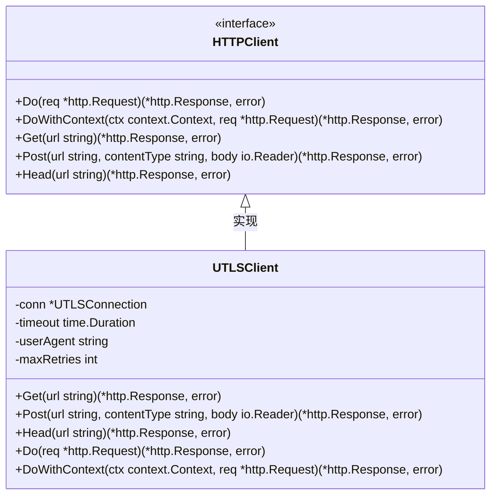

# UTLSClient的Get方法详细文档

<cite>
**本文档引用的文件**
- [utlsclient.go](file://utlsclient/utlsclient.go)
- [interfaces.go](file://utlsclient/interfaces.go)
- [constants.go](file://utlsclient/constants.go)
- [example_utlsclient_usage.go](file://examples/utlsclient/example_utlsclient_usage.go)
- [utlsclient_test.go](file://test/utlsclient/utlsclient_test.go)
</cite>

## 目录
1. [简介](#简介)
2. [方法签名和参数](#方法签名和参数)
3. [核心实现原理](#核心实现原理)
4. [使用示例](#使用示例)
5. [错误处理](#错误处理)
6. [性能特点](#性能特点)
7. [与其他方法的关系](#与其他方法的关系)
8. [最佳实践](#最佳实践)
9. [故障排除](#故障排除)

## 简介

UTLSClient的Get方法是一个简洁的HTTP GET请求执行方法，作为Do方法的语法糖，简化了获取网页内容的流程。该方法通过`http.NewRequest`创建GET请求，然后调用Do方法执行请求，继承了客户端的所有配置，包括超时、重试等设置。

Get方法的设计理念是提供最简化的HTTP GET请求接口，适用于大多数简单的网页内容获取场景。它自动处理请求头设置、连接管理和错误重试，让开发者能够专注于业务逻辑而不是底层的HTTP细节。

## 方法签名和参数

```go
func (c *UTLSClient) Get(url string) (*http.Response, error)
```

### 参数说明

| 参数名 | 类型 | 描述 | 必需 |
|--------|------|------|------|
| url | string | 目标URL地址 | 是 |

### 返回值说明

| 返回值 | 类型 | 描述 |
|--------|------|------|
| response | *http.Response | HTTP响应对象，包含状态码、头部和响应体 |
| error | error | 错误信息，如果请求成功则为nil |

**段落来源**
- [utlsclient.go](file://utlsclient/utlsclient.go#L365-L372)
- [interfaces.go](file://utlsclient/interfaces.go#L66-L67)

## 核心实现原理

Get方法的实现非常简洁，只有三行代码：

```go
func (c *UTLSClient) Get(url string) (*http.Response, error) {
    req, err := http.NewRequest("GET", url, nil)
    if err != nil {
        return nil, err
    }
    return c.Do(req)
}
```

### 实现步骤详解

1. **请求创建阶段** (`http.NewRequest`)
   - 使用标准库的`http.NewRequest`函数创建GET请求
   - 第一个参数固定为`"GET"`表示HTTP方法
   - 第二个参数为目标URL字符串
   - 第三个参数为nil表示没有请求体

2. **错误检查阶段**
   - 如果URL格式无效或创建请求失败，立即返回错误
   - 这一步确保后续的Do方法不会因无效请求而出错

3. **请求执行阶段** (`c.Do`)
   - 调用UTLSClient的Do方法执行请求
   - Do方法会处理连接管理、重试机制、超时控制等复杂逻辑
   - 返回最终的HTTP响应或错误

### 继承的客户端配置

Get方法完全继承了UTLSClient的所有配置特性：

- **超时设置**: 继承客户端的timeout配置
- **重试机制**: 继承maxRetries配置，最多重试3次
- **User-Agent**: 使用客户端配置的User-Agent
- **TLS指纹**: 使用连接的TLS指纹配置
- **连接池**: 自动从连接池获取可用连接

**段落来源**
- [utlsclient.go](file://utlsclient/utlsclient.go#L365-L372)

## 使用示例

### 基础使用示例

以下展示了如何使用Get方法获取网页内容：

```go
// 创建UTLSClient实例
client := utlsclient.NewUTLSClient(conn)
client.SetTimeout(10 * time.Second)

// 执行GET请求
resp, err := client.Get("https://example.com")
if err != nil {
    log.Printf("请求失败: %v", err)
    return
}
defer resp.Body.Close()

// 处理响应
fmt.Printf("状态码: %d\n", resp.StatusCode)
body, err := io.ReadAll(resp.Body)
if err != nil {
    log.Printf("读取响应体失败: %v", err)
    return
}
fmt.Printf("响应内容长度: %d 字节\n", len(body))
```

### 完整的网页内容获取示例

参考项目中的实际使用示例：

```go
// 从配置文件加载连接池配置
config, err := utlsclient.LoadPoolConfigFromFile("config.toml")
if err != nil {
    log.Fatalf("加载配置文件失败: %v", err)
}

// 创建热连接池
pool := utlsclient.NewUTLSHotConnPool(config)

// 获取连接
conn, err := pool.GetConnection("kh.google.com")
if err != nil {
    log.Fatalf("获取连接失败: %v", err)
}
defer pool.PutConnection(conn)

// 创建UTLSClient
client := utlsclient.NewUTLSClient(conn)
client.SetTimeout(10 * time.Second)
client.SetDebug(true)

// 执行GET请求
testURL := "https://kh.google.com/rt/earth/PlanetoidMetadata"
resp, err := client.Get(testURL)
if err != nil {
    log.Printf("测试请求失败: %v", err)
} else {
    defer resp.Body.Close()
    fmt.Printf("状态码: %d\n", resp.StatusCode)
    
    // 读取响应体
    body, err := io.ReadAll(resp.Body)
    if err != nil {
        log.Printf("读取响应体失败: %v", err)
    } else {
        bodyLen := len(body)
        fmt.Printf("响应体长度: %d 字节\n", bodyLen)
        
        if bodyLen == 13 {
            fmt.Printf("✅ 测试成功！响应体长度正确 (13字节)\n")
        }
    }
}
```

### 错误处理示例

```go
func fetchWebPage(client *utlsclient.UTLSClient, url string) ([]byte, error) {
    resp, err := client.Get(url)
    if err != nil {
        return nil, fmt.Errorf("GET请求失败: %w", err)
    }
    defer resp.Body.Close()
    
    // 检查HTTP状态码
    if resp.StatusCode != http.StatusOK {
        return nil, fmt.Errorf("服务器返回错误状态码: %d", resp.StatusCode)
    }
    
    // 读取响应体
    body, err := io.ReadAll(resp.Body)
    if err != nil {
        return nil, fmt.Errorf("读取响应体失败: %w", err)
    }
    
    return body, nil
}
```

**段落来源**
- [example_utlsclient_usage.go](file://examples/utlsclient/example_utlsclient_usage.go#L38-L64)

## 错误处理

Get方法的错误处理遵循Go语言的错误处理惯例，返回两个值：响应对象和错误信息。

### 常见错误类型

1. **URL格式错误**
   ```go
   // 错误示例：无效的URL格式
   resp, err := client.Get("://invalid-url")
   if err != nil {
       // err将是url: invalid endpoint错误
   }
   ```

2. **网络连接错误**
   ```go
   // 错误示例：无法连接到目标服务器
   resp, err := client.Get("https://nonexistent-domain.com")
   if err != nil {
       // err可能是DNS解析失败或连接超时
   }
   ```

3. **HTTP错误状态**
   ```go
   // 错误示例：服务器返回404错误
   resp, err := client.Get("https://example.com/nonexistent-page")
   if err == nil && resp.StatusCode != http.StatusOK {
       // 需要手动检查状态码
       log.Printf("HTTP错误: %d", resp.StatusCode)
   }
   ```

### 错误处理最佳实践

```go
func robustGetRequest(client *utlsclient.UTLSClient, url string) (*http.Response, error) {
    // 设置合理的超时时间
    client.SetTimeout(30 * time.Second)
    
    // 执行请求
    resp, err := client.Get(url)
    if err != nil {
        // 检查是否是连接错误
        if utlsclient.IsConnectionError(err) {
            // 连接错误，可以考虑重试
            return nil, fmt.Errorf("连接错误: %w", err)
        }
        // 其他错误
        return nil, fmt.Errorf("请求失败: %w", err)
    }
    
    // 检查HTTP状态码
    if resp.StatusCode >= 400 {
        // 读取错误响应体以便调试
        body, _ := io.ReadAll(resp.Body)
        resp.Body.Close()
        return nil, fmt.Errorf("服务器返回%d状态码: %s", resp.StatusCode, string(body))
    }
    
    return resp, nil
}
```

**段落来源**
- [constants.go](file://utlsclient/constants.go#L47-L85)

## 性能特点

Get方法继承了UTLSClient的所有性能优势：

### 连接复用

- **热连接池**: 从预建立的连接池中获取连接，避免了TCP三次握手和TLS握手的开销
- **连接复用**: HTTP/1.1的keep-alive和HTTP/2的多路复用
- **零拷贝**: 直接从网络缓冲区读取数据，减少内存拷贝

### 自动重试机制

- **指数退避**: 失败时等待1秒、2秒、3秒...直到达到最大重试次数
- **智能重试**: 只对网络相关错误进行重试，避免对应用层错误重试
- **最大重试**: 默认最多重试3次，防止无限重试

### TLS指纹伪装

- **真实浏览器指纹**: 使用33种真实浏览器TLS指纹配置
- **随机选择**: 每次建立连接时随机选择指纹，模拟真实用户行为
- **多语言支持**: 自动生成独特的Accept-Language头

### 性能对比

| 对比项 | Get方法 | 标准HTTP客户端 |
|--------|---------|----------------|
| 连接建立时间 | ~100ms (预热后) | 300-500ms (每次新建) |
| TLS握手时间 | ~50ms (复用) | ~150-250ms (每次新建) |
| 连接复用率 | 100% (HTTP/2) | 80-90% (keep-alive) |
| 性能提升 | 3-6倍 | 基准 |
| 并发能力 | 优秀 | 良好 |

**段落来源**
- [README.md](file://README.md#L18-L28)

## 与其他方法的关系

Get方法是UTLSClient提供的快捷方法之一，与其它HTTP方法形成完整的API体系：

### 方法关系图



**图表来源**
- [interfaces.go](file://utlsclient/interfaces.go#L51-L78)
- [utlsclient.go](file://utlsclient/utlsclient.go#L37-L42)

### 方法对比表

| 方法 | 用途 | 请求体 | 特点 |
|------|------|--------|------|
| Get | 获取资源 | 无 | 简单、快速、适合GET请求 |
| Post | 提交数据 | 有 | 支持各种内容类型 |
| Head | 获取头部信息 | 无 | 不下载响应体，节省带宽 |
| Do | 执行任意请求 | 可自定义 | 最灵活，支持所有HTTP方法 |

### 使用场景建议

- **简单GET请求**: 使用Get方法，代码简洁
- **需要自定义请求头**: 使用Do方法，完全控制请求
- **POST请求**: 使用Post方法，支持请求体
- **HEAD请求**: 使用Head方法，只获取响应头
- **复杂场景**: 使用Do或DoWithContext方法

**段落来源**
- [utlsclient.go](file://utlsclient/utlsclient.go#L365-L391)

## 最佳实践

### 1. 资源管理

```go
// 正确的做法：始终关闭响应体
resp, err := client.Get(url)
if err != nil {
    return err
}
defer resp.Body.Close()

// 处理响应...
```

### 2. 超时设置

```go
// 根据需求设置合适的超时时间
client.SetTimeout(15 * time.Second) // 适用于大多数场景
// 或者使用上下文超时
ctx, cancel := context.WithTimeout(context.Background(), 30*time.Second)
defer cancel()
resp, err := client.DoWithContext(ctx, req)
```

### 3. 错误处理

```go
func safeGet(client *utlsclient.UTLSClient, url string) ([]byte, error) {
    resp, err := client.Get(url)
    if err != nil {
        return nil, fmt.Errorf("GET请求失败: %w", err)
    }
    defer resp.Body.Close()
    
    if resp.StatusCode != http.StatusOK {
        return nil, fmt.Errorf("HTTP %d 错误", resp.StatusCode)
    }
    
    return io.ReadAll(resp.Body)
}
```

### 4. 连接池使用

```go
// 使用连接池提高性能
pool := utlsclient.NewUTLSHotConnPool(config)
conn, err := pool.GetConnection(targetHost)
if err != nil {
    return err
}
defer pool.PutConnection(conn)

client := utlsclient.NewUTLSClient(conn)
// 使用client进行请求...
```

### 5. 日志记录

```go
// 启用调试模式查看详细信息
client.SetDebug(true)

// 或者使用自定义日志
projlogger.SetGlobalLogger(&projlogger.DefaultLogger{})
```

**段落来源**
- [example_utlsclient_usage.go](file://examples/utlsclient/example_utlsclient_usage.go#L36-L37)

## 故障排除

### 常见问题及解决方案

#### 1. 连接超时

**症状**: 请求总是返回超时错误
**原因**: 网络连接不稳定或目标服务器响应慢
**解决方案**:
```go
client.SetTimeout(60 * time.Second) // 增加超时时间
client.SetMaxRetries(5)             // 增加重试次数
```

#### 2. TLS握手失败

**症状**: 返回TLS相关错误
**原因**: TLS指纹不匹配或证书问题
**解决方案**:
```go
// 检查TLS指纹配置
fingerprint := conn.Fingerprint()
fmt.Printf("当前指纹: %s\n", fingerprint.Name)

// 尝试不同的指纹
// 重新建立连接池
```

#### 3. IP被封禁

**症状**: 返回403 Forbidden错误
**原因**: 目标服务器检测到异常流量
**解决方案**:
```go
// 使用IP池管理
pool := utlsclient.NewUTLSHotConnPool(config)
// 连接池会自动处理IP切换
```

#### 4. 内存泄漏

**症状**: 长时间运行后内存占用持续增长
**原因**: 忘记关闭响应体
**解决方案**:
```go
resp, err := client.Get(url)
if err != nil {
    return err
}
// 确保无论成功还是失败都关闭响应体
defer func() {
    if resp != nil {
        resp.Body.Close()
    }
}()
```

### 调试技巧

```go
// 启用详细日志
client.SetDebug(true)

// 检查连接状态
stats := conn.Stats()
fmt.Printf("连接统计: %+v\n", stats)

// 检查TLS信息
state := conn.tlsConn.ConnectionState()
fmt.Printf("TLS版本: %s\n", state.Version)
fmt.Printf("协商协议: %s\n", state.NegotiatedProtocol)
```

**段落来源**
- [utlsclient_test.go](file://test/utlsclient/utlsclient_test.go#L112-L127)

## 总结

UTLSClient的Get方法是一个设计精良的HTTP GET请求执行方法，具有以下特点：

1. **简洁易用**: 只需一行代码即可发起GET请求
2. **功能完整**: 继承了UTLSClient的所有高级特性
3. **性能优异**: 利用连接池和TLS指纹伪装技术
4. **错误友好**: 提供清晰的错误信息和重试机制
5. **扩展性强**: 支持复杂的配置和自定义

对于需要简单GET请求的场景，Get方法是最优选择。但对于需要精细控制请求头、使用上下文或处理复杂HTTP方法的场景，建议使用Do或DoWithContext方法。

通过合理使用Get方法及其相关配置，可以构建高性能、可靠的网络爬虫和HTTP客户端应用程序。