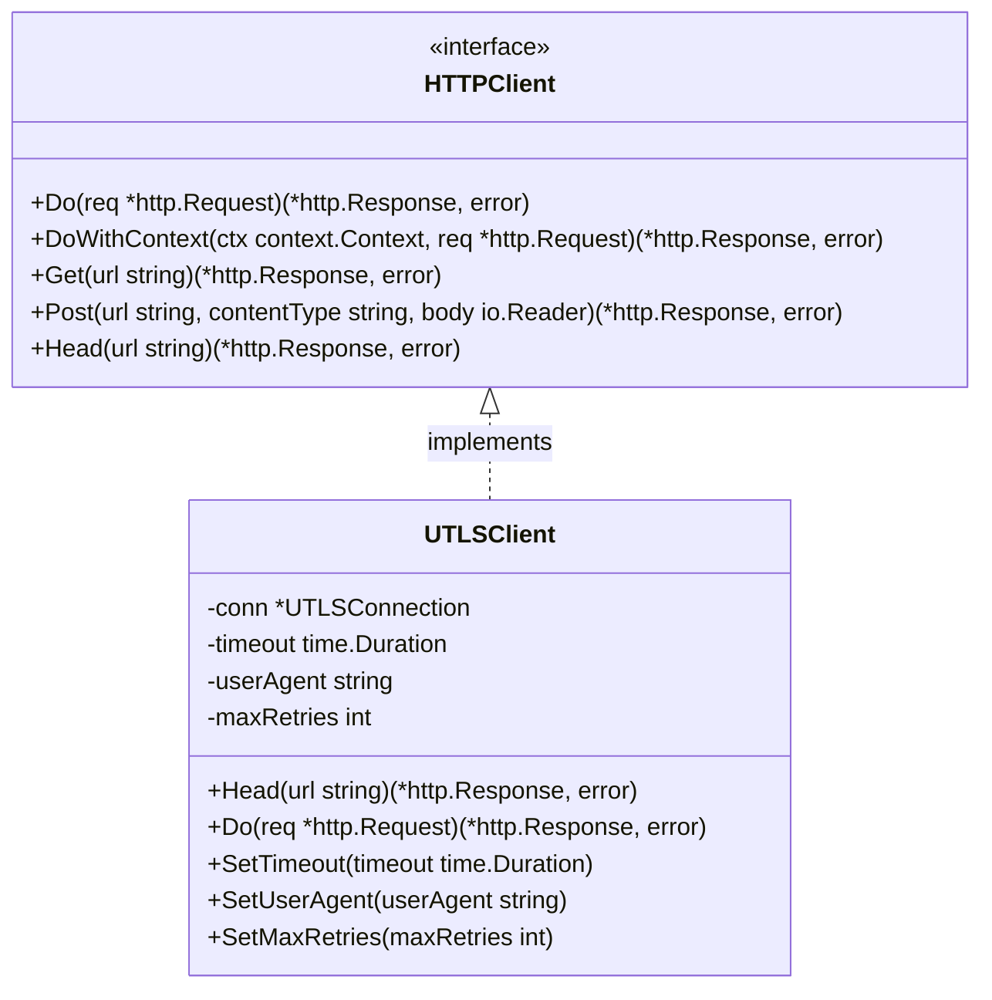
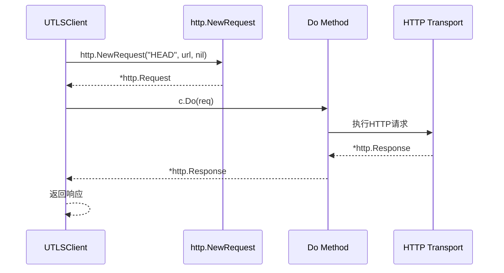
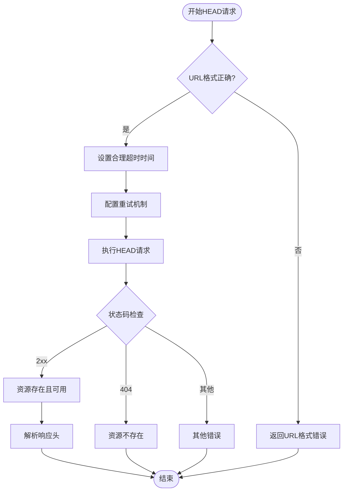
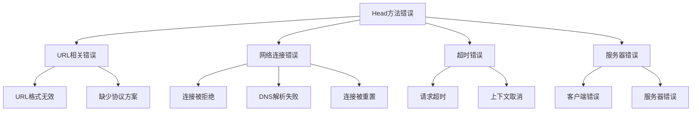
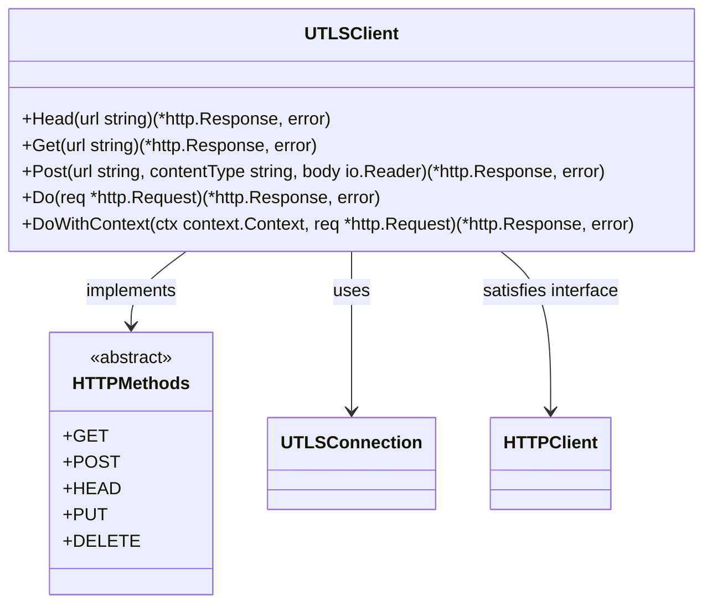

# UTLSClient的Head方法详细文档

<cite>
**本文档引用的文件**
- [utlsclient.go](file://utlsclient/utlsclient.go)
- [interfaces.go](file://utlsclient/interfaces.go)
- [utlsclient_test.go](file://test/utlsclient/utlsclient_test.go)
- [example_utlsclient_usage.go](file://examples/utlsclient/example_utlsclient_usage.go)
- [example_basic_usage.go](file://examples/utlsclient/example_basic_usage.go)
</cite>

## 目录
1. [简介](#简介)
2. [方法签名与接口](#方法签名与接口)
3. [核心实现原理](#核心实现原理)
4. [使用场景与最佳实践](#使用场景与最佳实践)
5. [参数与返回值详解](#参数与返回值详解)
6. [错误处理机制](#错误处理机制)
7. [性能特性](#性能特性)
8. [与其他方法的关系](#与其他方法的关系)
9. [实用示例](#实用示例)
10. [故障排除指南](#故障排除指南)

## 简介

UTLSClient的Head方法是一个专门用于执行HTTP HEAD请求的便捷方法。该方法继承了客户端的所有配置特性，包括超时设置、重试机制和连接管理，为开发者提供了高效获取资源元信息的能力。

HEAD请求是一种特殊的HTTP请求方法，它要求服务器只返回响应头信息而不包含响应体。这种请求方式特别适用于需要检查资源状态、获取资源大小或最后修改时间等元数据信息的场景。

## 方法签名与接口

### 接口定义



**图表来源**
- [interfaces.go](file://utlsclient/interfaces.go#L51-L77)
- [utlsclient.go](file://utlsclient/utlsclient.go#L38-L52)

### 方法签名

```go
func (c *UTLSClient) Head(url string) (*http.Response, error)
```

**章节来源**
- [utlsclient.go](file://utlsclient/utlsclient.go#L384-L391)
- [interfaces.go](file://utlsclient/interfaces.go#L74-L77)

## 核心实现原理

### 实现架构

Head方法的实现采用了简洁的设计模式，直接委托给底层的Do方法执行实际的HTTP请求：



**图表来源**
- [utlsclient.go](file://utlsclient/utlsclient.go#L384-L391)

### 实现细节

Head方法的核心实现非常简洁，只有三行代码：

1. **请求创建**：使用标准库的`http.NewRequest`函数创建HEAD请求
2. **错误处理**：检查请求创建过程中的错误
3. **请求执行**：调用Do方法执行请求并返回结果

这种方法的优势在于：
- **一致性**：与Get、Post等其他方法保持一致的行为模式
- **可靠性**：利用已验证的Do方法实现，减少重复代码
- **可扩展性**：所有客户端配置自动应用到HEAD请求中

**章节来源**
- [utlsclient.go](file://utlsclient/utlsclient.go#L384-L391)

## 使用场景与最佳实践

### 适用场景

HEAD方法特别适用于以下场景：

1. **资源存在性检查**
   - 验证文件或页面是否存在
   - 检查API端点是否可用

2. **元数据获取**
   - 获取文件大小（Content-Length）
   - 获取最后修改时间（Last-Modified）
   - 获取内容类型（Content-Type）

3. **性能优化**
   - 在下载大文件前检查文件大小
   - 避免不必要的完整内容传输

4. **缓存策略**
   - 检查资源是否已被修改
   - 实现条件请求（Conditional Requests）

### 最佳实践



**图表来源**
- [utlsclient.go](file://utlsclient/utlsclient.go#L104-L119)

## 参数与返回值详解

### 参数说明

| 参数 | 类型 | 描述 | 必需 |
|------|------|------|------|
| url | string | 目标资源的URL地址 | 是 |

**参数特性**：
- 支持完整的URL格式（包括协议、主机、路径）
- 自动处理相对路径和绝对路径
- 支持HTTP和HTTPS协议

### 返回值说明

| 返回值 | 类型 | 描述 |
|--------|------|------|
| response | *http.Response | HTTP响应对象，包含状态码和响应头 |
| error | error | 错误信息，无错误时为nil |

**响应对象特性**：
- **StatusCode**：HTTP状态码（如200、404等）
- **Header**：响应头信息（map[string][]string）
- **Body**：空的响应体（*responseBody结构体，但不可读取）
- **Status**：完整的状态行文本

**章节来源**
- [utlsclient.go](file://utlsclient/utlsclient.go#L384-L391)

## 错误处理机制

### 错误类型分类



### 错误处理策略

1. **URL验证**：在请求前验证URL格式
2. **重试机制**：自动重试失败的请求
3. **超时控制**：设置合理的超时时间
4. **优雅降级**：在网络不可用时提供备用方案

**章节来源**
- [utlsclient.go](file://utlsclient/utlsclient.go#L104-L119)

## 性能特性

### 性能优势

1. **零响应体开销**：不传输响应体，节省带宽和内存
2. **快速响应**：服务器只需处理请求头，响应速度更快
3. **连接复用**：支持HTTP/1.1和HTTP/2的连接复用
4. **并发友好**：适合高并发场景下的资源检查

### 性能对比

| 特性 | HEAD请求 | GET请求 |
|------|----------|---------|
| 响应体大小 | 0字节 | 完整内容 |
| 带宽消耗 | 极低 | 较高 |
| 响应时间 | 更快 | 较慢 |
| 服务器负载 | 较低 | 较高 |
| 适用场景 | 元数据检查 | 内容获取 |

### 优化建议

1. **合理设置超时**：根据网络环境调整超时时间
2. **启用连接复用**：利用Keep-Alive机制
3. **批量检查**：对多个资源进行批量HEAD请求
4. **缓存响应**：缓存HEAD请求的结果以提高效率

## 与其他方法的关系

### 方法关系图



**图表来源**
- [utlsclient.go](file://utlsclient/utlsclient.go#L38-L52)
- [interfaces.go](file://utlsclient/interfaces.go#L51-L77)

### 方法选择指南

| 场景 | 推荐方法 | 原因 |
|------|----------|------|
| 获取完整内容 | Get | 需要响应体 |
| 提交数据 | Post | 需要请求体 |
| 检查资源状态 | Head | 只需元数据 |
| 文件存在性检查 | Head | 避免传输文件内容 |
| 缓存验证 | Head | 检查资源是否更新 |

**章节来源**
- [utlsclient.go](file://utlsclient/utlsclient.go#L365-L391)

## 实用示例

### 基础使用示例

以下展示了Head方法的基本使用模式：

```go
// 创建UTLSClient实例
conn := utlsclient.NewUTLSConnection(targetIP, targetHost)
client := utlsclient.NewUTLSClient(conn)

// 设置超时时间
client.SetTimeout(10 * time.Second)

// 执行HEAD请求
resp, err := client.Head("https://example.com/resource")
if err != nil {
    log.Printf("HEAD请求失败: %v", err)
    return
}

// 检查响应状态
fmt.Printf("状态码: %d\n", resp.StatusCode)
fmt.Printf("状态行: %s\n", resp.Status)

// 获取响应头信息
contentLength := resp.Header.Get("Content-Length")
lastModified := resp.Header.Get("Last-Modified")
contentType := resp.Header.Get("Content-Type")

fmt.Printf("内容长度: %s\n", contentLength)
fmt.Printf("最后修改时间: %s\n", lastModified)
fmt.Printf("内容类型: %s\n", contentType)
```

### 实际应用场景示例

#### 1. 文件存在性检查

```go
func checkFileExists(client *utlsclient.UTLSClient, url string) (bool, error) {
    resp, err := client.Head(url)
    if err != nil {
        return false, err
    }
    defer resp.Body.Close()
    
    // 2xx状态码表示文件存在
    return resp.StatusCode >= 200 && resp.StatusCode < 300, nil
}
```

#### 2. 资源大小检查

```go
func getFileSize(client *utlsclient.UTLSClient, url string) (int64, error) {
    resp, err := client.Head(url)
    if err != nil {
        return 0, err
    }
    defer resp.Body.Close()
    
    // 检查Content-Length头
    contentLength := resp.Header.Get("Content-Length")
    if contentLength == "" {
        return 0, fmt.Errorf("无法获取文件大小")
    }
    
    size, err := strconv.ParseInt(contentLength, 10, 64)
    if err != nil {
        return 0, fmt.Errorf("解析文件大小失败: %v", err)
    }
    
    return size, nil
}
```

#### 3. 缓存验证

```go
func isResourceModified(client *utlsclient.UTLSClient, url, etag string) (bool, error) {
    req, err := http.NewRequest("HEAD", url, nil)
    if err != nil {
        return false, err
    }
    
    // 设置If-None-Match头进行条件检查
    if etag != "" {
        req.Header.Set("If-None-Match", etag)
    }
    
    resp, err := client.Do(req)
    if err != nil {
        return false, err
    }
    defer resp.Body.Close()
    
    // 304 Not Modified表示资源未修改
    return resp.StatusCode != 304, nil
}
```

**章节来源**
- [example_utlsclient_usage.go](file://examples/utlsclient/example_utlsclient_usage.go#L38-L63)
- [example_basic_usage.go](file://examples/utlsclient/example_basic_usage.go#L53-L64)

## 故障排除指南

### 常见问题及解决方案

#### 1. 请求超时问题

**症状**：HEAD请求长时间无响应
**原因**：网络延迟、服务器响应慢、防火墙阻拦
**解决方案**：
- 调整超时时间：`client.SetTimeout(30 * time.Second)`
- 检查网络连接
- 验证目标服务器可达性

#### 2. DNS解析失败

**症状**：无法解析域名
**原因**：DNS配置错误、域名不存在
**解决方案**：
- 检查域名拼写
- 验证DNS服务器配置
- 尝试使用IP地址直接访问

#### 3. SSL/TLS握手失败

**症状**：SSL证书错误或握手超时
**原因**：证书过期、证书链不完整、协议不匹配
**解决方案**：
- 更新证书验证逻辑
- 配置正确的TLS版本
- 检查服务器证书配置

#### 4. 响应头信息缺失

**症状**：某些响应头字段为空
**原因**：服务器配置、安全策略限制
**解决方案**：
- 检查服务器配置
- 验证请求头设置
- 考虑使用GET请求作为替代

### 调试技巧

1. **启用调试模式**：
```go
client.SetDebug(true)
```

2. **检查响应详情**：
```go
fmt.Printf("完整响应头:\n")
for key, values := range resp.Header {
    fmt.Printf("  %s: %s\n", key, strings.Join(values, ", "))
}
```

3. **捕获详细错误信息**：
```go
if err != nil {
    if netErr, ok := err.(net.Error); ok && netErr.Timeout() {
        fmt.Println("请求超时")
    } else {
        fmt.Printf("其他错误: %v\n", err)
    }
}
```

**章节来源**
- [utlsclient_test.go](file://test/utlsclient/utlsclient_test.go#L145-L157)

## 总结

UTLSClient的Head方法是一个设计精良的HTTP工具，它通过简洁的实现提供了强大的功能。该方法不仅继承了客户端的所有配置特性，还为开发者提供了高效的资源元信息获取能力。

### 主要优势

1. **简单易用**：三行代码即可完成HEAD请求
2. **性能优异**：零响应体开销，快速响应
3. **功能强大**：支持所有HTTP/1.1和HTTP/2特性
4. **可靠稳定**：完善的错误处理和重试机制

### 使用建议

1. **合理选择方法**：根据需求选择合适的HTTP方法
2. **优化性能**：设置适当的超时和重试参数
3. **错误处理**：完善错误处理逻辑
4. **监控调试**：启用调试模式进行问题排查

通过掌握Head方法的使用技巧，开发者可以构建更加高效和可靠的HTTP客户端应用程序。