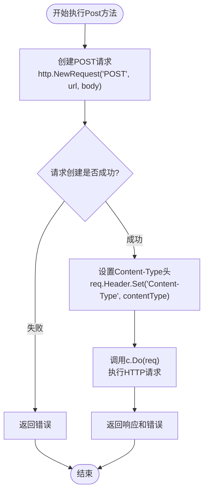
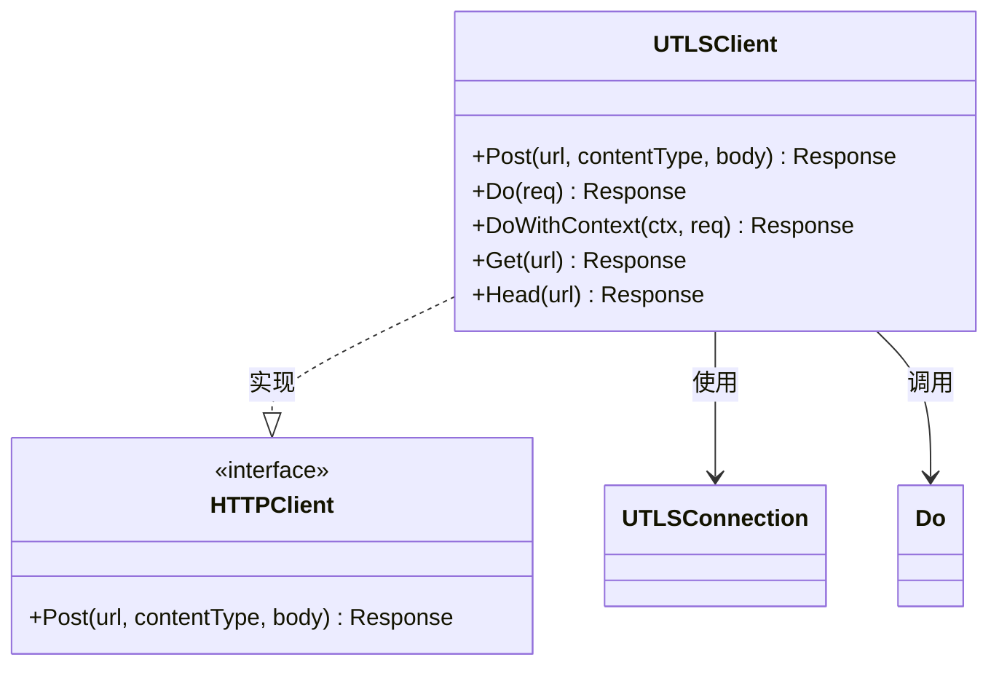

# UTLSClient的Post方法详细文档

<cite>
**本文档中引用的文件**
- [utlsclient.go](file://utlsclient/utlsclient.go)
- [interfaces.go](file://utlsclient/interfaces.go)
- [utlsclient_test.go](file://test/utlsclient/utlsclient_test.go)
- [example_basic_usage.go](file://examples/utlsclient/example_basic_usage.go)
- [example_utlsclient_usage.go](file://examples/utlsclient/example_utlsclient_usage.go)
- [example_hotconnpool_usage.go](file://examples/utlsclient/example_hotconnpool_usage.go)
- [client.go](file://GoogleEarthClient/client.go)
</cite>

## 目录
1. [简介](#简介)
2. [方法签名与参数](#方法签名与参数)
3. [核心实现原理](#核心实现原理)
4. [参数详解](#参数详解)
5. [使用示例](#使用示例)
6. [与其他方法的关系](#与其他方法的关系)
7. [最佳实践](#最佳实践)
8. [注意事项](#注意事项)
9. [故障排除](#故障排除)

## 简介

UTLSClient的Post方法是一个便捷的HTTP POST请求封装，专门设计用于通过uTLS连接发送POST请求。该方法继承了UTLSClient的所有配置特性，包括超时设置、重试机制和连接管理，同时提供了简洁的API来处理常见的POST请求场景。

Post方法是Do方法的高级封装，它自动处理了POST请求的基本设置，使开发者能够专注于业务逻辑而非HTTP请求的底层细节。

## 方法签名与参数

```go
func (c *UTLSClient) Post(url string, contentType string, body io.Reader) (*http.Response, error)
```

**方法特点：**
- 基于标准HTTP库的http.NewRequest创建POST请求
- 自动设置Content-Type头
- 调用Do方法执行请求
- 继承客户端的所有配置特性

**图表来源**
- [utlsclient.go](file://utlsclient/utlsclient.go#L374-L381)

## 核心实现原理

Post方法的核心实现遵循以下流程：



**图表来源**
- [utlsclient.go](file://utlsclient/utlsclient.go#L374-L381)

**章节来源**
- [utlsclient.go](file://utlsclient/utlsclient.go#L374-L381)

## 参数详解

### URL字符串参数

**类型：** `string`
**作用：** 指定目标HTTP服务器的URL地址
**要求：**
- 必须是有效的HTTP/HTTPS URL格式
- 支持相对路径和绝对路径
- 包含完整的协议、主机名和路径信息

**示例：**
```go
// 完整URL
"https://api.example.com/v1/users"

// 相对路径（需要配合Host头使用）
"/users/create"

// 查询参数
"https://api.example.com/search?q=keyword&limit=10"
```

### Content-Type字符串参数

**类型：** `string`
**作用：** 设置HTTP请求的Content-Type头，指示请求体的数据格式
**重要性：** 正确设置Content-Type对于服务器正确解析请求体至关重要

**常用值：**
- `"application/json"` - JSON格式数据
- `"application/x-www-form-urlencoded"` - 表单数据
- `"multipart/form-data"` - 文件上传
- `"text/plain"` - 纯文本数据
- `"application/xml"` - XML格式数据

### 请求体io.Reader参数

**类型：** `io.Reader`
**作用：** 提供HTTP请求的主体内容
**灵活性：**
- 支持任意实现了io.Reader接口的数据源
- 可以是内存中的数据、文件流或网络数据流
- 自动处理数据的读取和传输

**常见实现：**
- `strings.Reader` - 字符串数据
- `bytes.Buffer` - 字节缓冲区
- `os.File` - 文件内容
- `json.NewEncoder` - 结构体序列化

**章节来源**
- [utlsclient.go](file://utlsclient/utlsclient.go#L374-L381)

## 使用示例

### 基础使用示例

#### 提交表单数据

```go
// 创建表单数据
formData := strings.NewReader("username=testuser&password=secret123")

// 设置Content-Type为表单格式
contentType := "application/x-www-form-urlencoded"

// 执行POST请求
resp, err := client.Post("https://api.example.com/login", contentType, formData)
if err != nil {
    log.Printf("登录请求失败: %v", err)
    return
}
defer resp.Body.Close()

// 处理响应
body, _ := io.ReadAll(resp.Body)
fmt.Printf("响应状态: %s\n", resp.Status)
fmt.Printf("响应内容: %s\n", string(body))
```

#### 提交JSON数据

```go
// 定义要发送的结构体
type User struct {
    Username string `json:"username"`
    Password string `json:"password"`
    Email    string `json:"email"`
}

// 创建用户数据
user := User{
    Username: "testuser",
    Password: "securepass123",
    Email:    "user@example.com",
}

// 序列化为JSON
var jsonData bytes.Buffer
encoder := json.NewEncoder(&jsonData)
encoder.Encode(user)

// 设置正确的Content-Type
contentType := "application/json"

// 执行POST请求
resp, err := client.Post("https://api.example.com/users", contentType, &jsonData)
if err != nil {
    log.Printf("用户创建失败: %v", err)
    return
}
defer resp.Body.Close()
```

#### 文件上传示例

```go
// 打开要上传的文件
file, err := os.Open("document.pdf")
if err != nil {
    log.Printf("打开文件失败: %v", err)
    return
}
defer file.Close()

// 设置Content-Type为文件类型
contentType := "application/pdf"

// 执行文件上传
resp, err := client.Post("https://api.example.com/upload", contentType, file)
if err != nil {
    log.Printf("文件上传失败: %v", err)
    return
}
defer resp.Body.Close()

// 处理上传结果
var uploadResult map[string]interface{}
body, _ := io.ReadAll(resp.Body)
json.Unmarshal(body, &uploadResult)

fmt.Printf("上传成功: %+v\n", uploadResult)
```

### 高级使用示例

#### 使用连接池的完整示例

```go
// 加载连接池配置
config, err := utlsclient.LoadPoolConfigFromFile("config.toml")
if err != nil {
    log.Fatalf("加载配置失败: %v", err)
}

// 创建热连接池
pool := utlsclient.NewUTLSHotConnPool(config)
defer pool.Close()

// 获取连接
conn, err := pool.GetConnection("api.example.com")
if err != nil {
    log.Fatalf("获取连接失败: %v", err)
}
defer pool.PutConnection(conn)

// 创建UTLSClient
client := utlsclient.NewUTLSClient(conn)
client.SetTimeout(30 * time.Second)
client.SetMaxRetries(2)

// 构造复杂的请求体
data := map[string]interface{}{
    "action": "process_data",
    "params": map[string]interface{}{
        "id":    12345,
        "batch": true,
        "filters": []string{"active", "verified"},
    },
}

var requestBody bytes.Buffer
json.NewEncoder(&requestBody).Encode(data)

// 执行POST请求
resp, err := client.Post(
    "https://api.example.com/process",
    "application/json",
    &requestBody,
)
if err != nil {
    log.Printf("请求失败: %v", err)
    return
}
defer resp.Body.Close()

// 处理响应
var result map[string]interface{}
if err := json.NewDecoder(resp.Body).Decode(&result); err != nil {
    log.Printf("解析响应失败: %v", err)
    return
}

fmt.Printf("处理结果: %+v\n", result)
```

**章节来源**
- [example_hotconnpool_usage.go](file://examples/utlsclient/example_hotconnpool_usage.go#L198-L253)
- [example_utlsclient_usage.go](file://examples/utlsclient/example_utlsclient_usage.go#L34-L50)

## 与其他方法的关系

### 与Do方法的关系

Post方法是Do方法的便捷封装，其内部实现完全依赖于Do方法：



**图表来源**
- [utlsclient.go](file://utlsclient/utlsclient.go#L374-L381)
- [interfaces.go](file://utlsclient/interfaces.go#L71-L71)

### 与快捷方法的关系

Post方法与Get、Head等其他快捷方法共享相同的模式：

| 方法 | 用途 | 请求类型 | 是否需要请求体 |
|------|------|----------|----------------|
| `Get(url)` | 发送GET请求 | GET | 否 |
| `Post(url, contentType, body)` | 发送POST请求 | POST | 是 |
| `Head(url)` | 发送HEAD请求 | HEAD | 否 |

**章节来源**
- [utlsclient.go](file://utlsclient/utlsclient.go#L365-L391)

## 最佳实践

### 1. 内容类型选择指南

**JSON数据：**
```go
contentType := "application/json"
```

**表单数据：**
```go
contentType := "application/x-www-form-urlencoded"
```

**文件上传：**
```go
contentType := "application/octet-stream"  // 或具体MIME类型
```

### 2. 请求体构建建议

**使用结构化数据：**
```go
// 推荐：使用结构体和JSON编码
type RequestData struct {
    Field1 string `json:"field1"`
    Field2 int    `json:"field2"`
}

data := RequestData{Field1: "value", Field2: 42}
var buffer bytes.Buffer
json.NewEncoder(&buffer).Encode(data)
```

**避免硬编码字符串：**
```go
// 不推荐：硬编码的查询字符串
body := strings.NewReader("field1=value1&field2=value2")

// 推荐：使用结构化数据
data := map[string]string{"field1": "value1", "field2": "value2"}
var buffer bytes.Buffer
encoder := form.NewEncoder(&buffer)
encoder.Encode(data)
```

### 3. 错误处理策略

```go
resp, err := client.Post(url, contentType, body)
if err != nil {
    // 网络错误或连接问题
    return fmt.Errorf("POST请求失败: %w", err)
}

// 检查HTTP状态码
if resp.StatusCode >= 400 {
    // 服务器错误
    body, _ := io.ReadAll(resp.Body)
    resp.Body.Close()
    return fmt.Errorf("服务器返回错误 (%d): %s", resp.StatusCode, string(body))
}

// 正常响应处理
defer resp.Body.Close()
```

### 4. 资源管理

```go
// 确保响应体被正确关闭
resp, err := client.Post(url, contentType, body)
if err != nil {
    return err
}
defer resp.Body.Close()

// 处理响应体
body, err := io.ReadAll(resp.Body)
if err != nil {
    return err
}
```

## 注意事项

### 1. 超时和重试配置

Post方法继承了客户端的超时和重试配置：

```go
// 设置超时时间
client.SetTimeout(30 * time.Second)

// 设置最大重试次数
client.SetMaxRetries(3)
```

### 2. 连接池使用

当使用连接池时，确保正确管理连接的生命周期：

```go
// 获取连接
conn, err := pool.GetConnection(targetHost)
if err != nil {
    return err
}

// 使用完毕后归还连接
defer pool.PutConnection(conn)

// 创建客户端并使用
client := utlsclient.NewUTLSClient(conn)
```

### 3. 内存使用考虑

对于大型请求体，注意内存使用：

```go
// 对于大文件上传，使用文件Reader而不是一次性加载到内存
file, err := os.Open("large_file.zip")
if err != nil {
    return err
}
defer file.Close()

// 直接使用文件Reader，避免内存占用
resp, err := client.Post(uploadURL, "application/zip", file)
```

### 4. 上下文支持

如果需要取消请求或设置截止时间：

```go
// 创建带取消的上下文
ctx, cancel := context.WithTimeout(context.Background(), 30*time.Second)
defer cancel()

// 使用DoWithContext方法
resp, err := client.DoWithContext(ctx, req)
```

**章节来源**
- [utlsclient.go](file://utlsclient/utlsclient.go#L80-L82)

## 故障排除

### 常见问题及解决方案

#### 1. 连接超时

**症状：** Post方法返回超时错误
**原因：** 网络延迟或服务器响应慢
**解决方案：**
```go
// 增加超时时间
client.SetTimeout(60 * time.Second)

// 或者使用更长的上下文超时
ctx, cancel := context.WithTimeout(context.Background(), 60*time.Second)
defer cancel()
```

#### 2. 内容类型不匹配

**症状：** 服务器返回400错误或解析失败
**原因：** Content-Type头与实际数据格式不匹配
**解决方案：**
```go
// 确保Content-Type与数据格式一致
contentType := "application/json"  // JSON数据
contentType := "application/x-www-form-urlencoded"  // 表单数据
contentType := "multipart/form-data"  // 文件上传
```

#### 3. 响应体读取失败

**症状：** 读取响应体时出现错误
**原因：** 连接提前关闭或网络中断
**解决方案：**
```go
// 确保正确关闭响应体
resp, err := client.Post(url, contentType, body)
if err != nil {
    return err
}
defer resp.Body.Close()

// 分块读取大响应体
buf := make([]byte, 8192)
for {
    n, err := resp.Body.Read(buf)
    if n > 0 {
        // 处理数据
    }
    if err == io.EOF {
        break
    }
    if err != nil {
        return err
    }
}
```

#### 4. 证书验证失败

**症状：** TLS握手失败或证书验证错误
**原因：** 服务器证书问题或客户端配置问题
**解决方案：**
```go
// 检查服务器证书有效性
// 确保连接池配置正确
// 验证目标主机名与证书匹配
```

### 调试技巧

#### 启用调试日志

```go
// 启用调试模式查看详细请求信息
client.SetDebug(true)
```

#### 检查连接状态

```go
// 获取连接统计信息
stats := conn.Stats()
fmt.Printf("连接统计: 请求次数=%d, 错误次数=%d, 健康状态=%t\n",
    stats.RequestCount, stats.ErrorCount, stats.IsHealthy)
```

**章节来源**
- [utlsclient_test.go](file://test/utlsclient/utlsclient_test.go#L133-L142)

## 总结

UTLSClient的Post方法提供了一个简洁而强大的HTTP POST请求接口，特别适合需要模拟真实浏览器行为的场景。通过继承客户端的所有配置特性，它能够自动处理超时、重试、连接管理和TLS握手等复杂细节。

**主要优势：**
- 简洁的API设计，减少样板代码
- 自动设置Content-Type头，简化开发流程
- 继承客户端的所有配置特性
- 支持各种数据格式的请求体
- 与连接池完美集成

**适用场景：**
- API客户端开发
- 数据采集和爬虫
- 微服务间通信
- 第三方服务集成

**替代方案：**
对于需要自定义请求头或使用特定上下文的场景，应直接使用Do或DoWithContext方法，获得更大的灵活性。