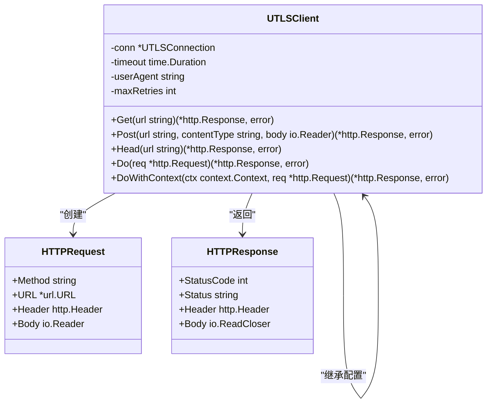
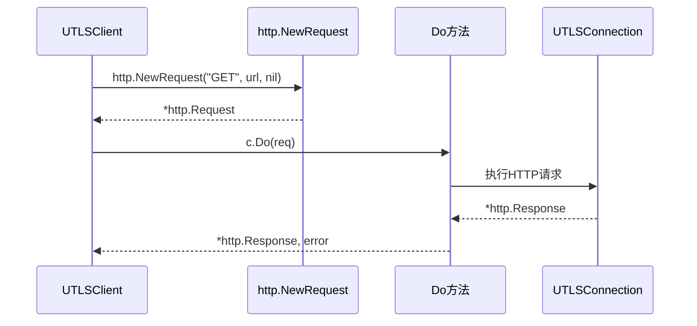
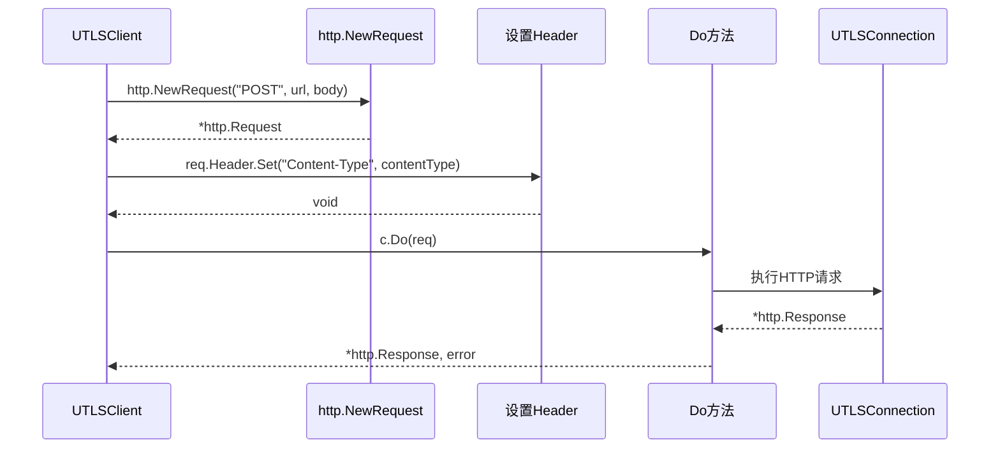
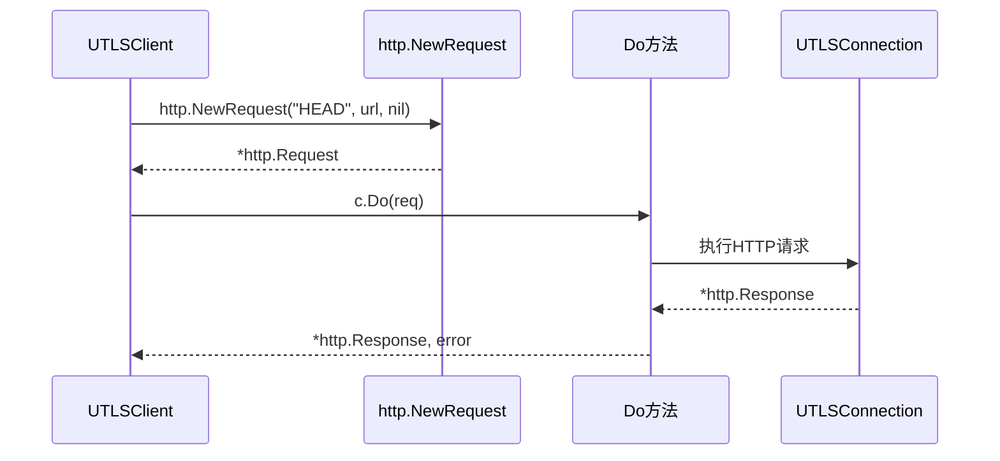
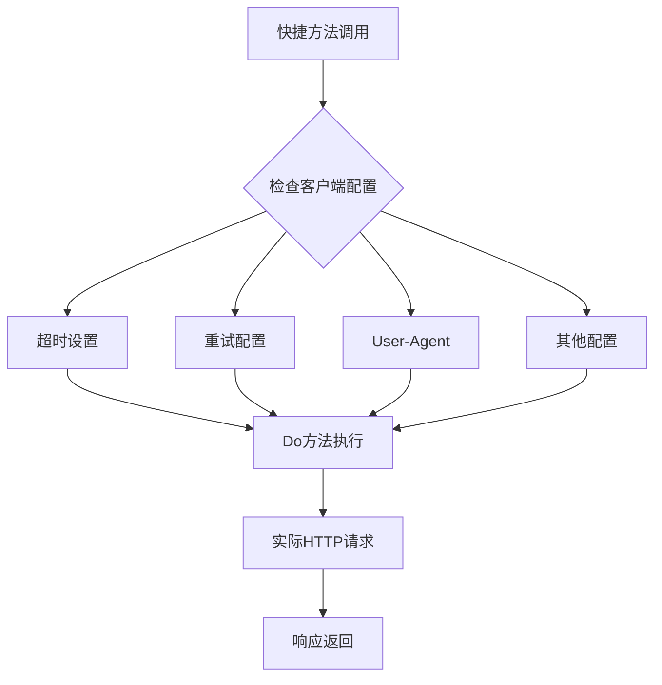

# UTLSClient快捷请求方法详细文档

<cite>
**本文档引用的文件**
- [utlsclient.go](file://utlsclient/utlsclient.go)
- [example_basic_usage.go](file://examples/utlsclient/example_basic_usage.go)
- [example_utlsclient_usage.go](file://examples/utlsclient/example_utlsclient_usage.go)
- [example_hotconnpool_usage.go](file://examples/utlsclient/example_hotconnpool_usage.go)
- [main.go](file://cmd/utlsclient/main.go)
- [utlsclient_test.go](file://test/utlsclient/utlsclient_test.go)
</cite>

## 目录
1. [简介](#简介)
2. [快捷方法概述](#快捷方法概述)
3. [Get方法详解](#get方法详解)
4. [Post方法详解](#post方法详解)
5. [Head方法详解](#head方法详解)
6. [方法继承特性](#方法继承特性)
7. [使用示例](#使用示例)
8. [适用场景分析](#适用场景分析)
9. [最佳实践建议](#最佳实践建议)
10. [总结](#总结)

## 简介

UTLSClient提供了三个便捷的HTTP请求方法：`Get`、`Post`和`Head`。这些方法是对基础`Do`方法的语法糖封装，旨在简化常见的HTTP操作，减少代码量，同时保持与基础方法相同的配置和错误处理机制。

## 快捷方法概述



**图表来源**
- [utlsclient.go](file://utlsclient/utlsclient.go#L365-L391)

**章节来源**
- [utlsclient.go](file://utlsclient/utlsclient.go#L365-L391)

## Get方法详解

### 实现原理

`Get`方法是一个简洁的GET请求封装，它简化了创建和执行GET请求的过程。



**图表来源**
- [utlsclient.go](file://utlsclient/utlsclient.go#L365-L372)

### 方法签名和参数

| 参数 | 类型 | 描述 | 必需 |
|------|------|------|------|
| url | string | 目标URL地址 | 是 |

| 返回值 | 类型 | 描述 |
|--------|------|------|
| response | *http.Response | HTTP响应对象 |
| error | error | 错误信息（如有） |

### 内部实现逻辑

1. **请求创建**：使用标准库`http.NewRequest`创建GET请求
2. **参数验证**：检查URL格式的有效性
3. **方法调用**：委托给`Do`方法执行实际请求
4. **错误传播**：直接返回`Do`方法的错误结果

### 使用特点

- **简单易用**：一行代码即可完成GET请求
- **配置继承**：自动继承客户端的超时、重试等配置
- **错误处理**：与`Do`方法共享相同的错误处理机制
- **资源管理**：响应体需要手动关闭

**章节来源**
- [utlsclient.go](file://utlsclient/utlsclient.go#L365-L372)

## Post方法详解

### 实现原理

`Post`方法专门用于执行POST请求，除了基本的请求创建外，还会自动设置Content-Type头。



**图表来源**
- [utlsclient.go](file://utlsclient/utlsclient.go#L374-L382)

### 方法签名和参数

| 参数 | 类型 | 描述 | 必需 |
|------|------|------|------|
| url | string | 目标URL地址 | 是 |
| contentType | string | 内容类型（如"application/json"） | 是 |
| body | io.Reader | 请求体内容 | 是 |

| 返回值 | 类型 | 描述 |
|--------|------|------|
| response | *http.Response | HTTP响应对象 |
| error | error | 错误信息（如有） |

### 内部实现逻辑

1. **请求创建**：使用标准库`http.NewRequest`创建POST请求
2. **内容类型设置**：自动设置`Content-Type`头
3. **请求体处理**：保留原始请求体的读取能力
4. **方法调用**：委托给`Do`方法执行实际请求

### 使用特点

- **类型安全**：强制指定Content-Type，避免类型错误
- **便捷性**：自动设置必要的请求头
- **灵活性**：支持任意类型的请求体（JSON、表单、文件等）
- **配置继承**：完全继承客户端的所有配置

**章节来源**
- [utlsclient.go](file://utlsclient/utlsclient.go#L374-L382)

## Head方法详解

### 实现原理

`Head`方法用于执行HEAD请求，这种请求只获取响应头而不下载响应体。



**图表来源**
- [utlsclient.go](file://utlsclient/utlsclient.go#L384-L391)

### 方法签名和参数

| 参数 | 类型 | 描述 | 必需 |
|------|------|------|------|
| url | string | 目标URL地址 | 是 |

| 返回值 | 类型 | 描述 |
|--------|------|------|
| response | *http.Response | HTTP响应对象（无响应体） |
| error | error | 错误信息（如有） |

### 内部实现逻辑

1. **请求创建**：使用标准库`http.NewRequest`创建HEAD请求
2. **零体处理**：HEAD请求不需要请求体
3. **方法调用**：委托给`Do`方法执行实际请求
4. **响应处理**：接收完整的响应头信息

### 使用特点

- **性能优化**：避免下载整个响应体，节省带宽
- **元数据获取**：常用于获取文件大小、修改时间等信息
- **快速探测**：可用于快速检测资源是否存在
- **配置继承**：与GET和POST方法共享相同配置

**章节来源**
- [utlsclient.go](file://utlsclient/utlsclient.go#L384-L391)

## 方法继承特性

所有快捷方法都继承了UTLSClient的核心配置和行为特性：

### 配置继承



**图表来源**
- [utlsclient.go](file://utlsclient/utlsclient.go#L85-L119)

### 继承的具体配置

| 配置项 | 继承方式 | 默认值 | 说明 |
|--------|----------|--------|------|
| 超时时间 | 直接继承 | 30秒 | 通过`SetTimeout`设置 |
| 最大重试次数 | 直接继承 | 3次 | 通过`SetMaxRetries`设置 |
| User-Agent | 自动设置 | 来自TLS指纹 | 通过`SetUserAgent`覆盖 |
| Accept-Language | 自动设置 | 来自TLS指纹 | 可被请求头覆盖 |
| 协议协商 | 自动检测 | HTTP/1.1/2 | 基于TLS协商结果 |

### 错误处理一致性

所有快捷方法都遵循与`Do`方法相同的错误处理模式：

1. **连接错误**：自动重试机制
2. **超时错误**：超时上下文管理
3. **协议错误**：HTTP/2和HTTP/1.1统一处理
4. **网络错误**：详细的错误信息和分类

**章节来源**
- [utlsclient.go](file://utlsclient/utlsclient.go#L85-L119)

## 使用示例

### 基本GET请求示例

以下展示了如何使用Get方法获取网页内容：

```go
// 创建热连接池
pool := utlsclient.NewUTLSHotConnPool(nil)
defer pool.Close()

// 获取连接
conn, err := pool.GetConnection("example.com")
if err != nil {
    log.Fatalf("获取连接失败: %v", err)
}
defer pool.PutConnection(conn)

// 创建客户端
client := utlsclient.NewUTLSClient(conn)
client.SetTimeout(10 * time.Second)

// 执行GET请求
resp, err := client.Get("https://example.com")
if err != nil {
    log.Printf("GET请求失败: %v", err)
} else {
    defer resp.Body.Close()
    // 处理响应...
}
```

### 表单数据POST示例

展示如何使用Post方法提交表单数据：

```go
// 准备表单数据
formData := strings.NewReader("username=test&password=secret")
client := utlsclient.NewUTLSClient(conn)

// 执行POST请求
resp, err := client.Post(
    "https://api.example.com/login",
    "application/x-www-form-urlencoded",
    formData,
)
if err != nil {
    log.Printf("POST请求失败: %v", err)
} else {
    defer resp.Body.Close()
    // 处理登录响应...
}
```

### HEAD请求示例

演示如何使用Head方法快速检查资源：

```go
client := utlsclient.NewUTLSClient(conn)
client.SetTimeout(5 * time.Second)

// 检查资源是否存在
resp, err := client.Head("https://example.com/resource.txt")
if err != nil {
    log.Printf("HEAD请求失败: %v", err)
} else {
    defer resp.Body.Close()
    // 检查响应头信息
    contentLength := resp.Header.Get("Content-Length")
    lastModified := resp.Header.Get("Last-Modified")
    log.Printf("文件大小: %s, 最后修改: %s", contentLength, lastModified)
}
```

### 命令行工具示例

展示在命令行工具中使用快捷方法：

```go
// main.go中的使用示例
func main() {
    // ... 配置连接池 ...
    
    // 获取连接
    conn, err := pool.GetConnectionWithValidation(*url)
    if err != nil {
        fmt.Fprintf(os.Stderr, "获取连接失败: %v\n", err)
        os.Exit(1)
    }
    
    // 创建客户端
    client := utlsclient.NewUTLSClient(conn)
    client.SetTimeout(*timeout)
    
    // 执行请求
    var req *http.Request
    if *head {
        req, err = http.NewRequest("HEAD", *url, nil)
    } else {
        req, err = http.NewRequest(*method, *url, nil)
    }
    
    resp, err := client.Do(req)
    if err != nil {
        fmt.Fprintf(os.Stderr, "请求失败: %v\n", err)
        pool.PutConnection(conn)
        os.Exit(1)
    }
    defer resp.Body.Close()
    
    // 处理响应...
}
```

**章节来源**
- [example_utlsclient_usage.go](file://examples/utlsclient/example_utlsclient_usage.go#L34-L54)
- [example_hotconnpool_usage.go](file://examples/utlsclient/example_hotconnpool_usage.go#L55-L94)
- [main.go](file://cmd/utlsclient/main.go#L62-L112)

## 适用场景分析

### 简单请求场景

快捷方法特别适合以下场景：

#### 网页内容获取
- **场景描述**：从网站获取HTML页面内容
- **优势**：Get方法简洁明了，适合一次性请求
- **示例**：爬虫抓取、内容预览

#### API数据查询
- **场景描述**：查询RESTful API的资源数据
- **优势**：Get方法符合REST规范，语义明确
- **示例**：用户信息查询、商品列表获取

#### 文件资源检查
- **场景描述**：检查远程文件的存在性和元数据
- **优势**：Head方法避免下载大文件，提高效率
- **示例**：文件上传前检查、CDN资源验证

#### 表单数据提交
- **场景描述**：向服务器提交表单数据
- **优势**：Post方法强制设置Content-Type，避免类型错误
- **示例**：用户注册、数据提交

### 复杂场景限制

对于需要精细控制的复杂场景，建议使用`Do`或`DoWithContext`方法：

#### 需要自定义请求头
- 场景：需要设置特殊头部（如Authorization、Custom-Header）
- 解决方案：使用`Do`方法手动设置请求头

#### 需要使用上下文控制
- 场景：需要取消请求、设置超时、传递请求ID
- 解决方案：使用`DoWithContext`方法

#### 需要流式处理
- 场景：处理大文件上传、流媒体下载
- 解决方案：使用`Do`方法直接访问响应体

#### 需要错误重试策略
- 场景：需要自定义重试逻辑、指数退避
- 解决方案：使用`DoWithContext`方法实现自定义重试

### 性能考虑

| 方法 | 性能特点 | 适用场景 | 注意事项 |
|------|----------|----------|----------|
| Get | 快速、简洁 | 简单GET请求 | 需要手动关闭响应体 |
| Post | 类似Get，额外设置Content-Type | 表单提交、API调用 | 支持任意请求体类型 |
| Head | 最快，无响应体 | 资源检查、元数据获取 | 无响应体，只能获取头部信息 |

## 最佳实践建议

### 错误处理最佳实践

```go
// 推荐的错误处理模式
func fetchData(client *utlsclient.UTLSClient, url string) ([]byte, error) {
    resp, err := client.Get(url)
    if err != nil {
        return nil, fmt.Errorf("GET请求失败: %w", err)
    }
    defer resp.Body.Close()
    
    // 检查HTTP状态码
    if resp.StatusCode != http.StatusOK {
        return nil, fmt.Errorf("HTTP请求失败，状态码: %d", resp.StatusCode)
    }
    
    // 读取响应体
    body, err := io.ReadAll(resp.Body)
    if err != nil {
        return nil, fmt.Errorf("读取响应体失败: %w", err)
    }
    
    return body, nil
}
```

### 资源管理最佳实践

```go
// 正确的资源管理模式
func processResource(client *utlsclient.UTLSClient, url string) error {
    // 获取连接
    conn, err := pool.GetConnection(host)
    if err != nil {
        return fmt.Errorf("获取连接失败: %w", err)
    }
    defer pool.PutConnection(conn)
    
    // 创建客户端
    cli := utlsclient.NewUTLSClient(conn)
    cli.SetTimeout(30 * time.Second)
    
    // 执行请求
    resp, err := cli.Get(url)
    if err != nil {
        return fmt.Errorf("请求失败: %w", err)
    }
    defer resp.Body.Close()
    
    // 处理响应...
    return nil
}
```

### 配置管理最佳实践

```go
// 配置驱动的方法
func createClient(pool *utlsclient.UTLSHotConnPool, host string) (*utlsclient.UTLSClient, error) {
    conn, err := pool.GetConnection(host)
    if err != nil {
        return nil, err
    }
    
    client := utlsclient.NewUTLSClient(conn)
    client.SetTimeout(10 * time.Second)
    client.SetMaxRetries(2)
    client.SetUserAgent("MyApp/1.0")
    
    return client, nil
}
```

### 测试最佳实践

```go
// 测试中的快捷方法使用
func TestUTLSClientGet(t *testing.T) {
    conn := utlsclient.NewTestConnection("1.2.3.4", "example.com")
    client := utlsclient.NewUTLSClient(conn)
    
    // 跳过需要真实连接的测试
    t.Skip("Skipping test that requires real TLS connection")
    
    _, err := client.Get("https://example.com")
    if err != nil {
        t.Errorf("Get请求失败: %v", err)
    }
}
```

## 总结

UTLSClient的快捷请求方法（Get、Post、Head）为开发者提供了简洁而强大的HTTP请求能力。这些方法作为`Do`方法的语法糖，具有以下核心优势：

### 主要优势

1. **简化代码**：大幅减少重复的请求创建代码
2. **配置继承**：自动应用客户端的所有配置设置
3. **错误处理**：与基础方法共享相同的错误处理机制
4. **性能优化**：利用连接池和协议协商提升性能
5. **类型安全**：Post方法强制设置Content-Type，避免类型错误

### 使用指导原则

- **简单场景**：优先使用快捷方法处理常见的GET、POST、HEAD请求
- **复杂需求**：对于需要自定义头部、上下文控制、流式处理的场景，使用`Do`或`DoWithContext`
- **资源管理**：始终正确关闭响应体，避免资源泄漏
- **错误处理**：检查HTTP状态码和错误信息，实现健壮的错误处理

### 技术特点

- **零依赖**：基于标准库实现，无外部依赖
- **高性能**：充分利用连接池和协议协商
- **可靠性**：内置重试机制和错误恢复
- **可扩展**：保持与基础方法的兼容性

这些快捷方法的设计体现了UTLSClient项目对易用性和性能的平衡，既满足了日常开发的快速需求，又为复杂场景预留了扩展空间。通过合理使用这些方法，开发者可以构建高效、可靠的HTTP客户端应用程序。