# DoWithContext方法深度解析

<cite>
**本文档引用的文件**
- [utlsclient.go](file://utlsclient/utlsclient.go)
- [interfaces.go](file://utlsclient/interfaces.go)
- [constants.go](file://utlsclient/constants.go)
- [example_utlsclient_usage.go](file://examples/utlsclient/example_utlsclient_usage.go)
- [example_basic_usage.go](file://examples/utlsclient/example_basic_usage.go)
- [utlshotconnpool.go](file://utlsclient/utlshotconnpool.go)
</cite>

## 目录
1. [概述](#概述)
2. [方法签名与接口设计](#方法签名与接口设计)
3. [核心工作机制](#核心工作机制)
4. [请求头自动注入机制](#请求头自动注入机制)
5. [重试机制详解](#重试机制详解)
6. [协议自适应路由](#协议自适应路由)
7. [超时上下文管理](#超时上下文管理)
8. [错误处理与返回值](#错误处理与返回值)
9. [使用示例与最佳实践](#使用示例与最佳实践)
10. [性能优化建议](#性能优化建议)

## 概述

`DoWithContext`方法是UTLSClient的核心请求执行引擎，作为HTTP客户端的主要入口点，它提供了完整的请求生命周期管理。该方法不仅负责执行HTTP请求，还实现了智能的重试机制、协议自适应路由、超时控制等关键功能，确保在复杂的网络环境中稳定可靠地完成请求。

## 方法签名与接口设计

### 接口定义

`DoWithContext`方法遵循Go语言的标准HTTP客户端模式，同时扩展了对上下文支持的功能：

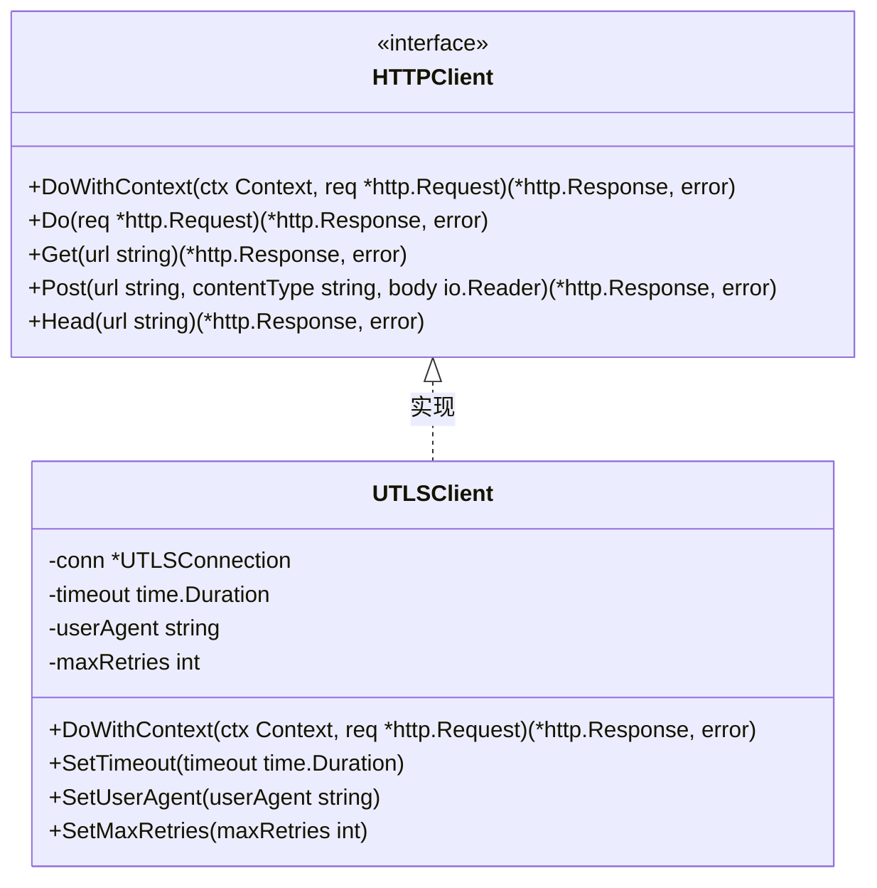

**图表来源**
- [interfaces.go](file://utlsclient/interfaces.go#L51-L80)
- [utlsclient.go](file://utlsclient/utlsclient.go#L37-L52)

### 核心参数说明

| 参数 | 类型 | 描述 | 必需性 |
|------|------|------|--------|
| ctx | context.Context | 控制请求生命周期的上下文 | 必需 |
| req | *http.Request | HTTP请求对象 | 必需 |

**章节来源**
- [interfaces.go](file://utlsclient/interfaces.go#L59-L62)

## 核心工作机制

### 方法执行流程

`DoWithContext`方法采用分阶段处理策略，每个阶段都有明确的职责和错误处理机制：

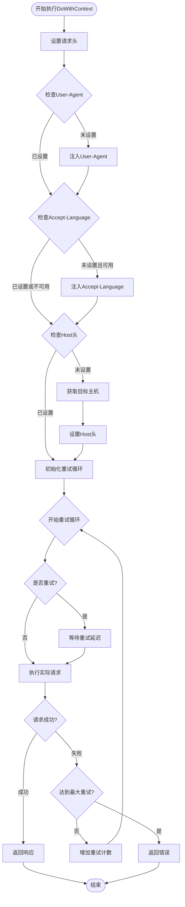

**图表来源**
- [utlsclient.go](file://utlsclient/utlsclient.go#L85-L118)

**章节来源**
- [utlsclient.go](file://utlsclient/utlsclient.go#L85-L118)

## 请求头自动注入机制

### User-Agent自动注入

UTLSClient实现了智能的User-Agent管理机制，只有在请求中未显式设置User-Agent时才会自动注入：

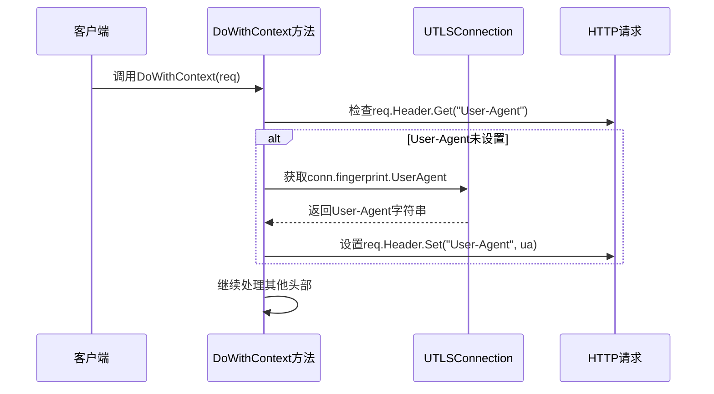

**图表来源**
- [utlsclient.go](file://utlsclient/utlsclient.go#L88-L90)

### Accept-Language自动注入

Accept-Language头部的注入逻辑与User-Agent类似，但增加了对连接可用性的检查：

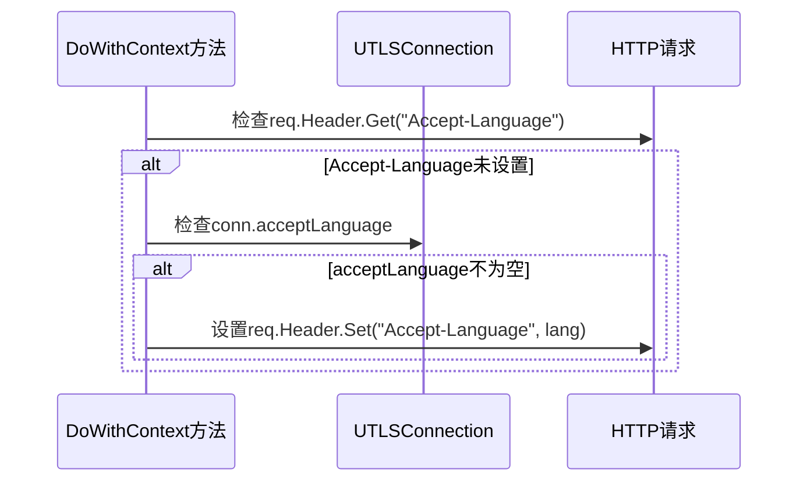

**图表来源**
- [utlsclient.go](file://utlsclient/utlsclient.go#L91-L94)

### Host头补全机制

Host头的设置遵循优先级原则，确保请求能够正确路由：

| 优先级 | 来源 | 描述 |
|--------|------|------|
| 1 | req.Host | 调用方显式设置的Host头 |
| 2 | conn.TargetHost() | 热连接的目标主机 |
| 3 | req.URL.Host | 请求URL中的主机部分 |

**章节来源**
- [utlsclient.go](file://utlsclient/utlsclient.go#L95-L102)

## 重试机制详解

### 重试策略架构

UTLSClient实现了指数退避重试策略，具有以下特点：

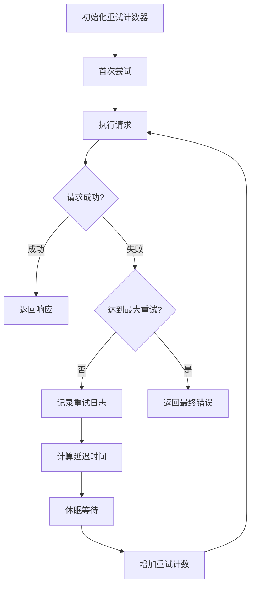

**图表来源**
- [utlsclient.go](file://utlsclient/utlsclient.go#L104-L118)

### 重试参数配置

| 参数 | 默认值 | 配置方法 | 描述 |
|------|--------|----------|------|
| 最大重试次数 | 3 | SetMaxRetries(3) | 最多执行maxRetries次尝试 |
| 初始延迟 | 1秒 | DefaultRetryDelay | 基础重试延迟时间 |
| 退避算法 | 指数增长 | time.Duration(i) * DefaultRetryDelay | 每次重试延迟翻倍 |

### 重试条件判断

重试机制会根据错误类型决定是否触发重试：

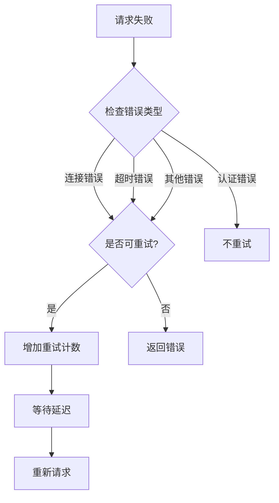

**章节来源**
- [utlsclient.go](file://utlsclient/utlsclient.go#L104-L118)
- [constants.go](file://utlsclient/constants.go#L40-L42)

## 协议自适应路由

### 协议检测机制

UTLSClient能够根据TLS连接协商结果自动选择最优的传输协议：

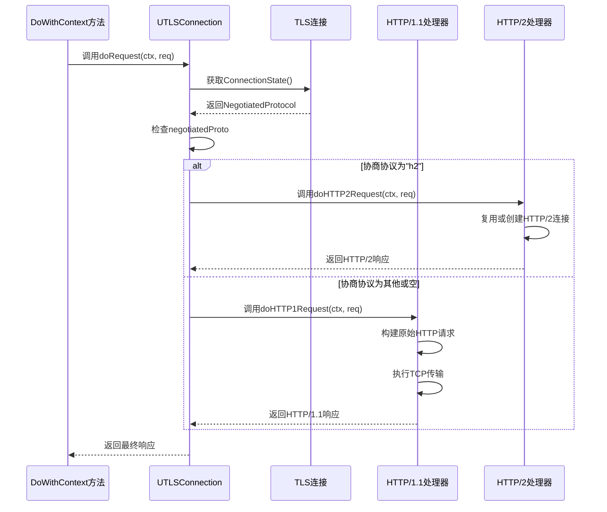

**图表来源**
- [utlsclient.go](file://utlsclient/utlsclient.go#L121-L141)

### HTTP/2处理流程

当检测到HTTP/2协议时，UTLSClient采用专门的处理路径：

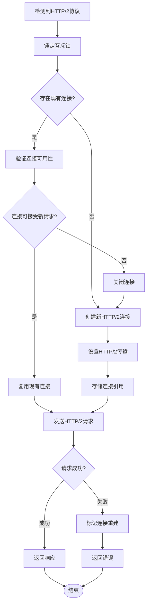

**图表来源**
- [utlsclient.go](file://utlsclient/utlsclient.go#L143-L189)

### HTTP/1.1处理流程

对于HTTP/1.1协议，UTLSClient采用原始请求构建方式：

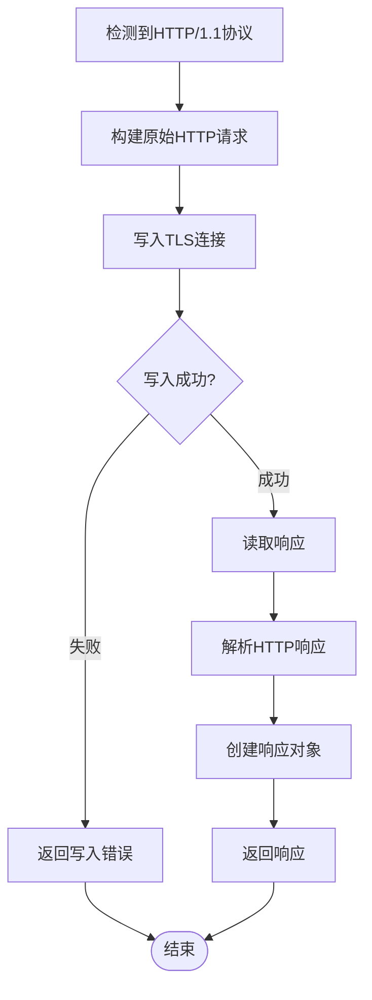

**图表来源**
- [utlsclient.go](file://utlsclient/utlsclient.go#L191-L214)

**章节来源**
- [utlsclient.go](file://utlsclient/utlsclient.go#L121-L141)
- [utlsclient.go](file://utlsclient/utlsclient.go#L143-L189)
- [utlsclient.go](file://utlsclient/utlsclient.go#L191-L214)

## 超时上下文管理

### 动态超时控制

UTLSClient为每次请求创建独立的超时上下文，确保请求不会无限阻塞：

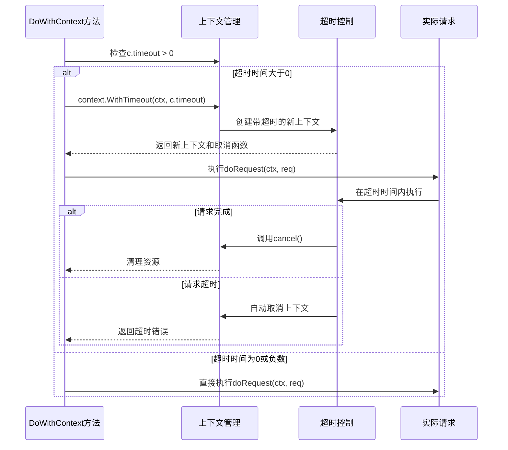

**图表来源**
- [utlsclient.go](file://utlsclient/utlsclient.go#L123-L128)

### 超时参数配置

| 配置项 | 默认值 | 设置方法 | 描述 |
|--------|--------|----------|------|
| 默认超时 | 30秒 | NewUTLSClient() | 创建客户端时的默认超时时间 |
| 可配置超时 | 30秒 | SetTimeout(duration) | 运行时动态调整超时时间 |

**章节来源**
- [utlsclient.go](file://utlsclient/utlsclient.go#L123-L128)

## 错误处理与返回值

### 返回值规范

`DoWithContext`方法严格遵循Go语言的错误处理约定：

| 返回值 | 类型 | 描述 | 场景 |
|--------|------|------|------|
| response | *http.Response | HTTP响应对象 | 请求成功时返回 |
| error | error | 错误信息 | 请求失败时返回 |

### 错误分类处理

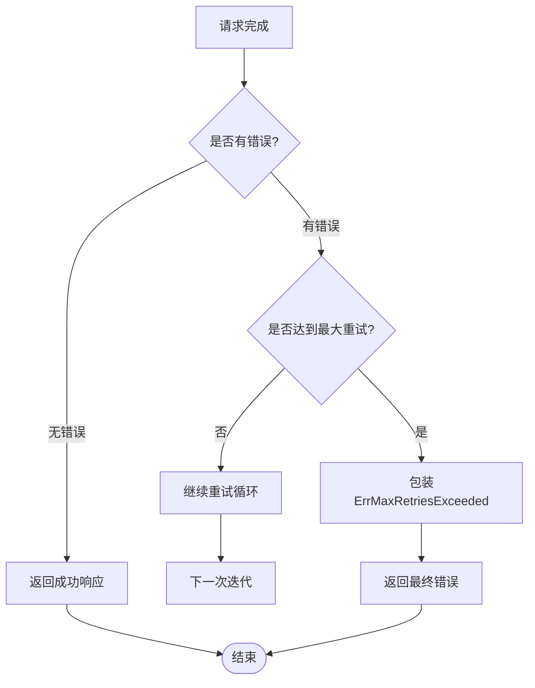

**图表来源**
- [utlsclient.go](file://utlsclient/utlsclient.go#L117-L118)

### 错误信息格式

当达到最大重试次数时，错误信息采用标准的包装格式：
```
max retries exceeded: <最后一次错误详情>
```

**章节来源**
- [utlsclient.go](file://utlsclient/utlsclient.go#L117-L118)

## 使用示例与最佳实践

### 基本使用模式

以下是使用`DoWithContext`方法的标准模式：

```go
// 创建UTLSClient实例
client := utlsclient.NewUTLSClient(connection)
client.SetTimeout(10 * time.Second)
client.SetMaxRetries(3)

// 创建带超时的上下文
ctx, cancel := context.WithTimeout(context.Background(), 30*time.Second)
defer cancel()

// 执行请求
req, err := http.NewRequest("GET", "https://example.com", nil)
if err != nil {
    log.Fatal(err)
}

resp, err := client.DoWithContext(ctx, req)
if err != nil {
    log.Printf("请求失败: %v", err)
    return
}
defer resp.Body.Close()

// 处理响应...
```

### 上下文生命周期管理

正确的上下文管理模式：

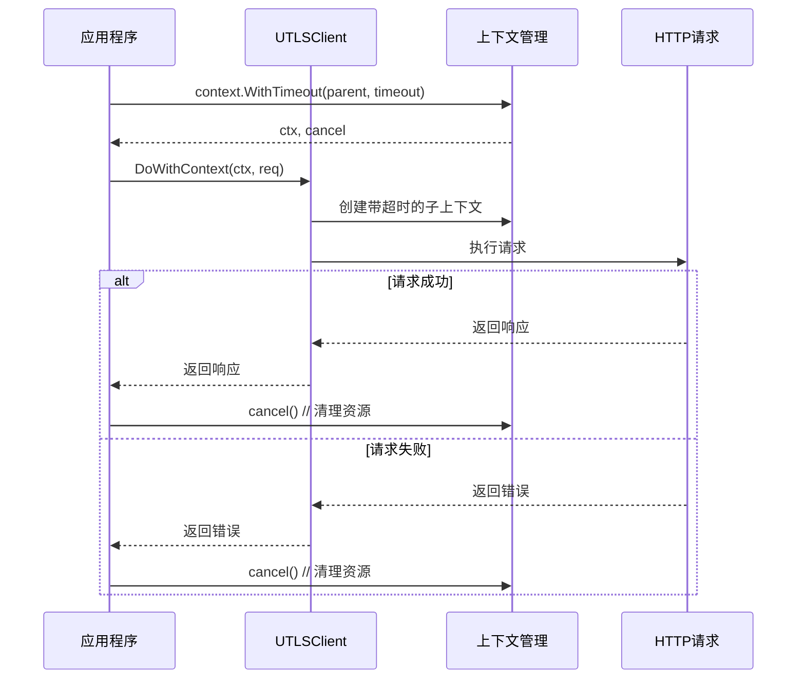

### 资源清理最佳实践

1. **必须关闭响应体**：无论请求成功与否，都应确保调用`resp.Body.Close()`
2. **及时取消上下文**：使用`defer cancel()`确保上下文资源得到清理
3. **合理设置超时时间**：根据业务需求设置合适的超时值

**章节来源**
- [example_utlsclient_usage.go](file://examples/utlsclient/example_utlsclient_usage.go#L45-L56)
- [example_utlsclient_usage.go](file://examples/utlsclient/example_utlsclient_usage.go#L78-L83)

## 性能优化建议

### 重试策略优化

1. **合理设置重试次数**：根据网络环境和业务需求调整`maxRetries`
2. **理解退避算法**：指数退避有助于减少服务器压力
3. **监控重试频率**：观察重试发生的频率，评估网络稳定性

### 超时参数调优

1. **基础超时设置**：根据平均响应时间设置合理的默认超时
2. **动态调整**：根据网络状况动态调整超时参数
3. **避免过短超时**：确保超时时间足够处理正常的网络延迟

### 协议选择策略

1. **优先使用HTTP/2**：现代服务器普遍支持HTTP/2，提供更好的性能
2. **监控协议使用率**：跟踪不同协议的使用情况
3. **协议降级处理**：确保在HTTP/2不可用时能优雅降级到HTTP/1.1

### 内存管理优化

1. **及时释放响应体**：避免长时间持有响应体导致内存泄漏
2. **控制并发请求数**：合理控制同时进行的请求数量
3. **连接池优化**：充分利用连接池机制减少连接建立开销

通过以上分析可以看出，`DoWithContext`方法作为UTLSClient的核心组件，不仅提供了完整的HTTP请求功能，还集成了智能的重试机制、协议自适应路由、超时控制等高级特性，是构建稳定可靠的HTTP客户端的重要基础。