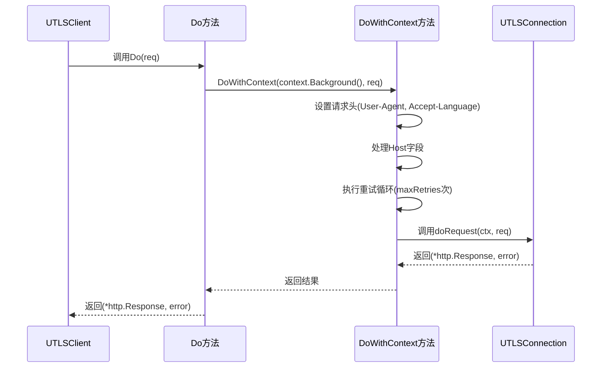
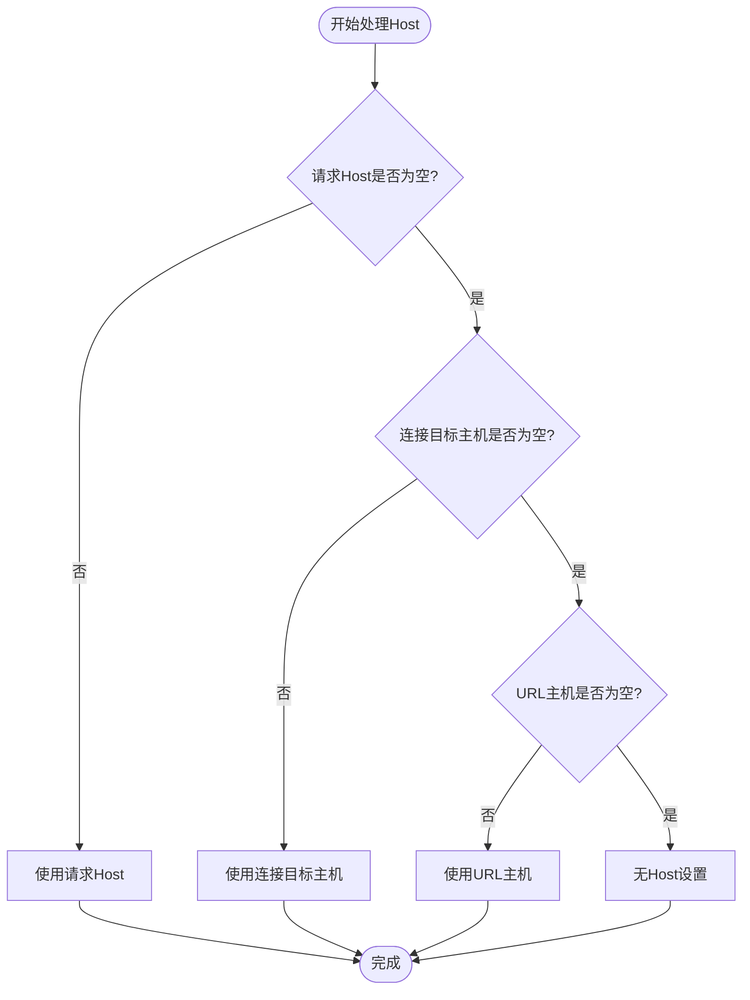
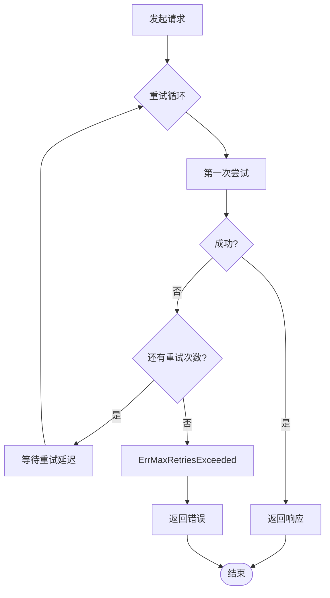
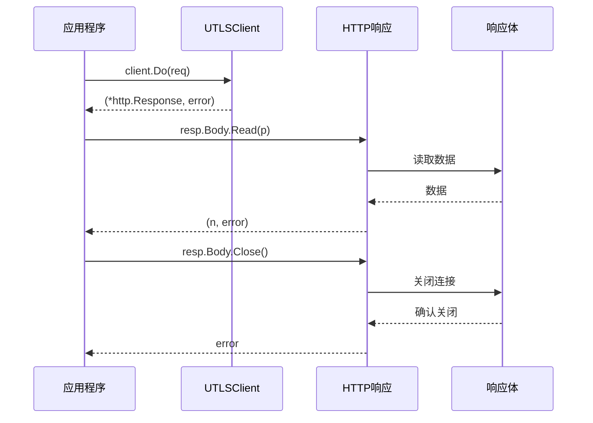
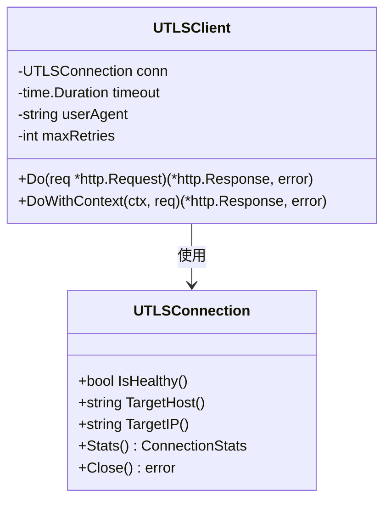

# UTLSClient的Do方法详细文档

<cite>
**本文档引用的文件**
- [utlsclient.go](file://utlsclient/utlsclient.go)
- [interfaces.go](file://utlsclient/interfaces.go)
- [example_utlsclient_usage.go](file://examples/utlsclient/example_utlsclient_usage.go)
- [example_hotconnpool_usage.go](file://examples/utlsclient/example_hotconnpool_usage.go)
- [utlsclient_test.go](file://test/utlsclient/utlsclient_test.go)
</cite>

## 方法概述

`Do`方法是UTLSClient的核心请求执行入口，作为简化版的HTTP请求方法，它为不需要手动管理上下文的场景提供了便捷的调用方式。该方法内部调用`DoWithContext`并传入`context.Background()`作为上下文参数。

### 方法签名

```go
func (c *UTLSClient) Do(req *http.Request) (*http.Response, error)
```

### 设计目的

1. **简化调用**：为不需要显式管理上下文的场景提供便捷接口
2. **继承配置**：自动应用客户端的超时、重试等配置策略
3. **连接状态感知**：受底层连接状态的影响，确保请求在有效连接上执行

## 方法实现原理

### 内部调用机制



**图表来源**
- [utlsclient.go](file://utlsclient/utlsclient.go#L80-L82)
- [utlsclient.go](file://utlsclient/utlsclient.go#L85-L118)

### 参数处理

#### 请求头设置

方法自动处理以下请求头：

1. **User-Agent**：如果请求中未设置，则使用客户端的userAgent
2. **Accept-Language**：如果请求中未设置且连接有acceptLanguage，则自动设置
3. **Host**：优先使用请求中设置的Host，其次使用连接的目标主机，最后使用URL中的主机

#### Host字段处理逻辑



**图表来源**
- [utlsclient.go](file://utlsclient/utlsclient.go#L95-L101)

## 返回值处理

### 返回值结构

方法返回两个值：
- `*http.Response`：HTTP响应对象（成功时为非nil）
- `error`：错误信息（成功时为nil）

### 错误处理机制

#### 成功情况
- `error == nil`
- 返回有效的HTTP响应对象

#### 失败情况
- `error != nil`
- `*http.Response == nil`
- `error`包含具体的错误信息，通常是`ErrMaxRetriesExceeded`加上最后一次尝试的错误

### 错误类型分析



**图表来源**
- [utlsclient.go](file://utlsclient/utlsclient.go#L104-L118)

## 客户端配置继承

### 超时配置

客户端继承以下超时配置：
- 默认超时：30秒（可通过`SetTimeout`方法修改）
- 超时控制：在`doRequest`方法中通过`context.WithTimeout`实现

### 重试策略

客户端配置以下重试参数：
- 默认最大重试次数：3次（可通过`SetMaxRetries`方法修改）
- 重试延迟：每次重试增加的延迟时间（默认1秒）

### 用户代理

- 自动继承连接的User-Agent
- 支持通过`SetUserAgent`方法手动设置

**章节来源**
- [utlsclient.go](file://utlsclient/utlsclient.go#L45-L52)
- [utlsclient.go](file://utlsclient/utlsclient.go#L55-L68)

## 使用示例

### 基本GET请求

```go
// 创建连接池和客户端
pool := utlsclient.NewUTLSHotConnPool(config)
conn, _ := pool.GetConnection("example.com")
client := utlsclient.NewUTLSClient(conn)

// 执行GET请求
resp, err := client.Do(req)
if err != nil {
    log.Printf("请求失败: %v", err)
    return
}
defer resp.Body.Close()

// 处理响应
body, _ := io.ReadAll(resp.Body)
fmt.Printf("响应状态: %s\n", resp.Status)
fmt.Printf("响应内容: %s\n", string(body))
```

### 响应体读取和关闭

完整的响应处理流程：



**图表来源**
- [utlsclient.go](file://utlsclient/utlsclient.go#L333-L363)

### 快捷方法使用

UTLSClient提供了便捷的快捷方法：

```go
// GET请求
resp, err := client.Get("https://example.com")

// POST请求  
resp, err := client.Post("https://example.com/api", "application/json", bodyReader)

// HEAD请求
resp, err := client.Head("https://example.com")
```

**章节来源**
- [example_utlsclient_usage.go](file://examples/utlsclient/example_utlsclient_usage.go#L38-L56)
- [example_hotconnpool_usage.go](file://examples/utlsclient/example_hotconnpool_usage.go#L55-L94)

## 连接状态影响

### 连接有效性检查

Do方法的成功执行依赖于底层连接的有效性：

1. **连接健康状态**：连接必须处于健康状态
2. **连接可用性**：连接必须可以接受新的请求
3. **网络可达性**：目标主机必须可访问

### 连接状态监控



**图表来源**
- [utlsclient.go](file://utlsclient/utlsclient.go#L37-L42)

## 错误处理最佳实践

### 常见错误类型

1. **连接错误**：网络连接失败、超时等
2. **协议错误**：HTTP协议解析错误
3. **认证错误**：TLS握手失败
4. **重试耗尽**：达到最大重试次数

### 错误检查模式

```go
resp, err := client.Do(req)
if err != nil {
    if utlsclient.IsConnectionError(err) {
        // 连接相关错误，可能需要重新获取连接
        log.Printf("连接错误: %v", err)
    } else if errors.Is(err, utlsclient.ErrMaxRetriesExceeded) {
        // 重试耗尽，可能是目标不可达
        log.Printf("请求失败: %v", err)
    } else {
        // 其他错误
        log.Printf("未知错误: %v", err)
    }
    return err
}

// 处理成功响应
defer resp.Body.Close()
```

**章节来源**
- [utlsclient.go](file://utlsclient/utlsclient.go#L22-L35)

## 接口规范

### HTTPClient接口实现

UTLSClient实现了HTTPClient接口：

```go
type HTTPClient interface {
    Do(req *http.Request) (*http.Response, error)
    DoWithContext(ctx context.Context, req *http.Request) (*http.Response, error)
    Get(url string) (*http.Response, error)
    Post(url string, contentType string, body io.Reader) (*http.Response, error)
    Head(url string) (*http.Response, error)
}
```

**章节来源**
- [interfaces.go](file://utlsclient/interfaces.go#L51-L80)

## 性能考虑

### 超时设置

- 默认超时30秒，可根据需求调整
- 建议根据网络环境和目标服务特性设置合适的超时值

### 重试策略

- 默认最多重试3次
- 重试间隔逐渐增加，避免对服务器造成过大压力

### 连接复用

- 利用底层连接池的连接复用机制
- 保持HTTP Keep-Alive连接以提高性能

## 总结

UTLSClient的Do方法是一个设计精良的简化接口，它：

1. **简化了调用**：为不需要上下文管理的场景提供便捷接口
2. **继承了配置**：自动应用客户端的各项配置参数
3. **保证了可靠性**：内置重试机制和错误处理
4. **保持了灵活性**：可以通过其他方法（如SetTimeout、SetMaxRetries）进行配置

该方法特别适合需要快速发起HTTP请求且不需要复杂上下文管理的场景，是UTLSClient包中最重要的入口方法之一。