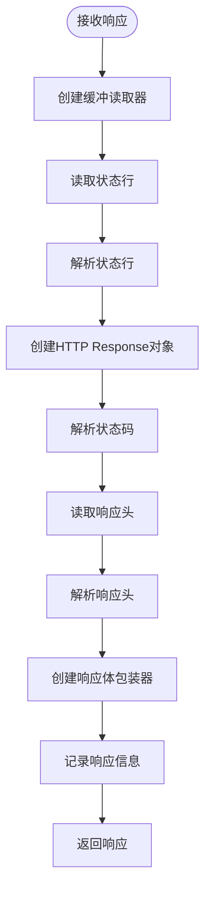

# UTLSClient请求执行方法详细文档

<cite>
**本文档引用的文件**
- [utlsclient.go](file://utlsclient/utlsclient.go)
- [constants.go](file://utlsclient/constants.go)
- [interfaces.go](file://utlsclient/interfaces.go)
- [example_basic_usage.go](file://examples/utlsclient/example_basic_usage.go)
- [example_utlsclient_usage.go](file://examples/utlsclient/example_utlsclient_usage.go)
- [utlsclient_test.go](file://test/utlsclient/utlsclient_test.go)
</cite>

## 目录
1. [简介](#简介)
2. [核心方法概述](#核心方法概述)
3. [Do方法详解](#do方法详解)
4. [DoWithContext方法详解](#do-withcontext方法详解)
5. [请求流程架构](#请求流程架构)
6. [重试机制](#重试机制)
7. [协议协商与路由](#协议协商与路由)
8. [响应处理](#响应处理)
9. [错误处理](#错误处理)
10. [最佳实践](#最佳实践)
11. [总结](#总结)

## 简介

UTLSClient是基于uTLS库构建的高级HTTP客户端，专门设计用于模拟真实浏览器行为。其请求执行方法提供了灵活且强大的HTTP请求能力，支持自动重试、协议协商和完善的错误处理机制。

## 核心方法概述

UTLSClient提供了两个核心的请求执行方法：

- **Do方法**：简化版的请求执行方法，使用`context.Background()`作为默认上下文
- **DoWithContext方法**：完整的带上下文的请求执行方法，提供更精细的控制

这两个方法都实现了统一的请求处理流程，包括自动请求头注入、协议协商、重试机制等核心功能。


**图表来源**
- [utlsclient.go](file://utlsclient/utlsclient.go#L37-L43)
- [interfaces.go](file://utlsclient/interfaces.go#L51-L78)

## Do方法详解

Do方法是DoWithContext方法的简化版本，为不需要特殊上下文控制的简单场景提供便利。

### 方法签名与实现

```go
func (c *UTLSClient) Do(req *http.Request) (*http.Response, error) {
    return c.DoWithContext(context.Background(), req)
}
```

### 工作机制

1. **上下文创建**：使用`context.Background()`创建根上下文
2. **委托执行**：将请求委托给DoWithContext方法处理
3. **透明代理**：Do方法本身不添加任何额外逻辑，完全依赖DoWithContext的实现

### 使用场景

- 简单的HTTP请求场景
- 不需要超时控制或取消机制
- 快速原型开发和测试

**章节来源**
- [utlsclient.go](file://utlsclient/utlsclient.go#L80-L83)

## DoWithContext方法详解

DoWithContext方法是UTLSClient的核心请求执行方法，提供了完整的请求生命周期管理。

### 方法签名

```go
func (c *UTLSClient) DoWithContext(ctx context.Context, req *http.Request) (*http.Response, error)
```

### 请求头自动注入

DoWithContext方法在执行请求前会自动注入必要的HTTP请求头：


**图表来源**
- [utlsclient.go](file://utlsclient/utlsclient.go#L87-L102)

#### User-Agent注入

- **触发条件**：当请求头中未设置User-Agent时
- **来源**：从客户端配置的`c.userAgent`字段获取
- **用途**：模拟特定浏览器的用户代理标识

#### Accept-Language注入

- **触发条件**：当请求头中未设置Accept-Language且连接配置中可用时
- **来源**：从连接的`acceptLanguage`字段获取
- **用途**：指定客户端偏好的语言环境

#### Host头设置

- **优先级**：调用方明确设置的Host > 连接目标主机 > URL主机
- **作用**：确保HTTP请求的Host头正确设置

### 主要处理流程

DoWithContext方法的完整处理流程如下：


**图表来源**
- [utlsclient.go](file://utlsclient/utlsclient.go#L86-L119)
- [utlsclient.go](file://utlsclient/utlsclient.go#L121-L141)

**章节来源**
- [utlsclient.go](file://utlsclient/utlsclient.go#L86-L119)

## 请求流程架构

UTLSClient的请求执行采用分层架构设计，每一层都有明确的职责分工。

### 整体架构图


**图表来源**
- [utlsclient.go](file://utlsclient/utlsclient.go#L121-L141)
- [utlsclient.go](file://utlsclient/utlsclient.go#L143-L214)

### 层次职责

1. **应用层**：负责构造HTTP请求
2. **客户端层**：提供统一的请求接口
3. **处理层**：执行请求预处理和重试逻辑
4. **协议层**：根据协商结果选择合适的传输协议
5. **传输层**：执行实际的数据传输

**章节来源**
- [utlsclient.go](file://utlsclient/utlsclient.go#L121-L141)

## 重试机制

UTLSClient实现了智能的重试机制，能够自动处理临时性故障并提高请求成功率。

### 重试策略


**图表来源**
- [utlsclient.go](file://utlsclient/utlsclient.go#L104-L119)
- [constants.go](file://utlsclient/constants.go#L40-L42)

### 重试配置

| 配置项 | 默认值 | 描述 |
|--------|--------|------|
| maxRetries | 3 | 最大重试次数（实际执行maxRetries+1次） |
| DefaultRetryDelay | 1秒 | 每次重试的延迟时间 |
| 重试间隔计算 | i × DefaultRetryDelay | 第i次重试的延迟时间 |

### 重试条件

重试机制会在以下情况下触发：

1. **连接错误**：如连接被拒绝、连接中断等
2. **协议错误**：如HTTP/2连接失效
3. **超时错误**：请求超时但连接仍可用
4. **其他临时性错误**

### 重试判断函数

UTLSClient提供了`IsConnectionError`函数来判断错误是否适合重试：

```go
func IsConnectionError(err error) bool {
    if err == nil {
        return false
    }
    errStr := err.Error()
    for _, keyword := range ConnectionErrorKeywords {
        if strings.Contains(errStr, keyword) {
            return true
        }
    }
    return errors.Is(err, ErrConnectionBroken) || errors.Is(err, ErrConnectionClosed)
}
```

**章节来源**
- [utlsclient.go](file://utlsclient/utlsclient.go#L22-L35)
- [constants.go](file://utlsclient/constants.go#L40-L57)
- [utlsclient.go](file://utlsclient/utlsclient.go#L104-L119)

## 协议协商与路由

UTLSClient能够根据TLS握手过程中协商的结果自动选择最适合的传输协议。

### 协议检测机制


**图表来源**
- [utlsclient.go](file://utlsclient/utlsclient.go#L130-L141)

### 协议选择逻辑

| 协商协议 | 传输方式 | 适用场景 | 特点 |
|----------|----------|----------|------|
| h2 | HTTP/2 | 支持HTTP/2的服务器 | 多路复用、头部压缩、服务器推送 |
| 其他 | HTTP/1.1 | 所有服务器 | 兼容性强、简单可靠 |

### HTTP/2处理

当检测到协商了HTTP/2协议时，UTLSClient会：

1. **连接复用**：尝试复用现有的HTTP/2连接
2. **连接验证**：检查连接是否还能接受新请求
3. **连接重建**：如果连接不可用，则重新创建
4. **错误处理**：请求失败时自动关闭并标记连接失效

### HTTP/1.1处理

对于HTTP/1.1协议，UTLSClient会：

1. **构建原始请求**：手动构建HTTP/1.1格式的请求字符串
2. **原始传输**：通过TLS连接直接传输原始HTTP数据
3. **响应解析**：手动解析HTTP/1.1响应格式

**章节来源**
- [utlsclient.go](file://utlsclient/utlsclient.go#L130-L141)
- [utlsclient.go](file://utlsclient/utlsclient.go#L143-L214)

## 响应处理

UTLSClient提供了完整的响应处理机制，包括响应解析、响应体管理和错误处理。

### HTTP/1.1响应解析



**图表来源**
- [utlsclient.go](file://utlsclient/utlsclient.go#L259-L331)

### 响应体包装器

UTLSClient使用自定义的`responseBody`结构来包装响应体：

```go
type responseBody struct {
    reader *bufio.Reader
    conn   *utls.UConn
    closed bool
    mu     sync.Mutex
}
```

#### 响应体特性

1. **线程安全**：使用互斥锁保护并发访问
2. **延迟关闭**：关闭响应体时不关闭底层连接
3. **keep-alive保持**：维持连接的持久化特性

#### 响应体方法

- **Read方法**：安全地读取响应数据
- **Close方法**：标记响应体已关闭，但不关闭连接

### 响应处理流程


**图表来源**
- [utlsclient.go](file://utlsclient/utlsclient.go#L333-L363)

**章节来源**
- [utlsclient.go](file://utlsclient/utlsclient.go#L259-L331)
- [utlsclient.go](file://utlsclient/utlsclient.go#L333-L363)

## 错误处理

UTLSClient实现了全面的错误处理机制，能够准确识别和处理各种类型的错误。

### 错误分类体系


**图表来源**
- [constants.go](file://utlsclient/constants.go#L48-L84)

### 错误常量定义

| 错误名称 | 错误描述 | 触发条件 |
|----------|----------|----------|
| ErrConnectionClosed | 连接已关闭 | 连接被主动关闭 |
| ErrConnectionBroken | 连接已断开 | 连接意外中断 |
| ErrConnectionTimeout | 连接超时 | 连接建立超时 |
| ErrMaxRetriesExceeded | 达到最大重试次数 | 重试次数超过限制 |
| ErrInvalidURL | 无效的URL | URL格式错误 |
| ErrInvalidHost | 无效的主机名 | 主机名解析失败 |

### 错误处理策略

#### 重试决策

```go
func IsConnectionError(err error) bool {
    if err == nil {
        return false
    }
    errStr := err.Error()
    for _, keyword := range ConnectionErrorKeywords {
        if strings.Contains(errStr, keyword) {
            return true
        }
    }
    return errors.Is(err, ErrConnectionBroken) || errors.Is(err, ErrConnectionClosed)
}
```

#### 错误包装

UTLSClient使用Go的错误包装机制来提供丰富的错误信息：

```go
return nil, fmt.Errorf("%w: %v", ErrMaxRetriesExceeded, lastErr)
```

这种做法的好处：
1. **保留原始错误**：通过`%w`保留原始错误信息
2. **上下文信息**：添加当前操作的上下文
3. **错误链追踪**：支持错误链的完整追溯

### 错误恢复机制

1. **连接重建**：HTTP/2连接失败时自动重建
2. **协议降级**：HTTP/2失败时回退到HTTP/1.1
3. **重试机制**：自动重试临时性错误

**章节来源**
- [constants.go](file://utlsclient/constants.go#L48-L84)
- [utlsclient.go](file://utlsclient/utlsclient.go#L22-L35)

## 最佳实践

基于UTLSClient的设计特点和使用经验，以下是推荐的最佳实践。

### 请求执行最佳实践

#### 1. 选择合适的请求方法

```go
// 简单请求使用Do方法
resp, err := client.Do(request)

// 需要超时控制使用DoWithContext
ctx, cancel := context.WithTimeout(context.Background(), 30*time.Second)
defer cancel()
resp, err := client.DoWithContext(ctx, request)
```

#### 2. 正确处理响应体

```go
resp, err := client.Do(request)
if err != nil {
    // 处理错误
    return err
}
// 必须关闭响应体
defer resp.Body.Close()

// 读取响应内容
body, err := io.ReadAll(resp.Body)
if err != nil {
    // 处理读取错误
    return err
}
```

#### 3. 设置合理的超时时间

```go
client.SetTimeout(30 * time.Second) // 根据需求调整
```

#### 4. 配置适当的重试次数

```go
client.SetMaxRetries(3) // 平衡可靠性与性能
```

### 错误处理最佳实践

#### 1. 区分可重试和不可重试错误

```go
err := client.Do(request)
if err != nil {
    if utlsclient.IsConnectionError(err) {
        // 可重试的错误，考虑重新尝试
        log.Printf("可重试错误: %v", err)
    } else {
        // 不可重试的错误，直接处理
        log.Printf("不可重试错误: %v", err)
    }
}
```

#### 2. 使用错误包装进行调试

```go
resp, err := client.Do(request)
if err != nil {
    return fmt.Errorf("执行请求失败: %w", err)
}
```

### 性能优化最佳实践

#### 1. 连接复用

```go
// 使用热连接池获取连接
conn, err := pool.GetConnection(targetHost)
if err != nil {
    return err
}
defer pool.PutConnection(conn)

client := utlsclient.NewUTLSClient(conn)
```

#### 2. 配置优化

```go
// 根据网络状况调整超时和重试
client.SetTimeout(10 * time.Second)
client.SetMaxRetries(2)

// 设置合适的User-Agent
client.SetUserAgent("Mozilla/5.0 (Windows NT 10.0; Win64; x64) AppleWebKit/537.36")
```

### 资源管理最佳实践

#### 1. 响应体关闭

```go
// 确保响应体总是被关闭
resp, err := client.Do(request)
if err != nil {
    return err
}
defer func() {
    if resp != nil && resp.Body != nil {
        resp.Body.Close()
    }
}()
```

#### 2. 上下文管理

```go
// 使用带取消的上下文
ctx, cancel := context.WithCancel(context.Background())
defer cancel()

// 在长时间运行的操作中定期检查上下文
select {
case <-ctx.Done():
    return ctx.Err()
default:
    // 继续执行
}
```

## 总结

UTLSClient的请求执行方法体现了现代HTTP客户端设计的最佳实践：

### 核心优势

1. **自动化程度高**：自动处理请求头、协议协商、重试等复杂逻辑
2. **可靠性强**：完善的错误处理和重试机制
3. **性能优化**：智能的协议选择和连接管理
4. **易于使用**：简洁的API设计，支持多种使用场景

### 技术特色

1. **双方法设计**：Do和DoWithContext满足不同复杂度的需求
2. **智能重试**：基于错误类型的智能重试决策
3. **协议自适应**：根据协商结果自动选择最优传输协议
4. **资源安全**：完善的响应体管理和连接资源控制

### 应用价值

UTLSClient的请求执行方法特别适用于：
- 网页爬虫和数据采集
- API客户端开发
- 网络监控和测试
- 需要模拟浏览器行为的应用

通过合理使用这些方法，开发者可以构建稳定、高效且易于维护的HTTP客户端应用。