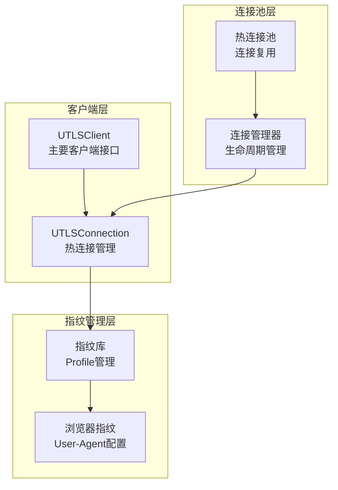
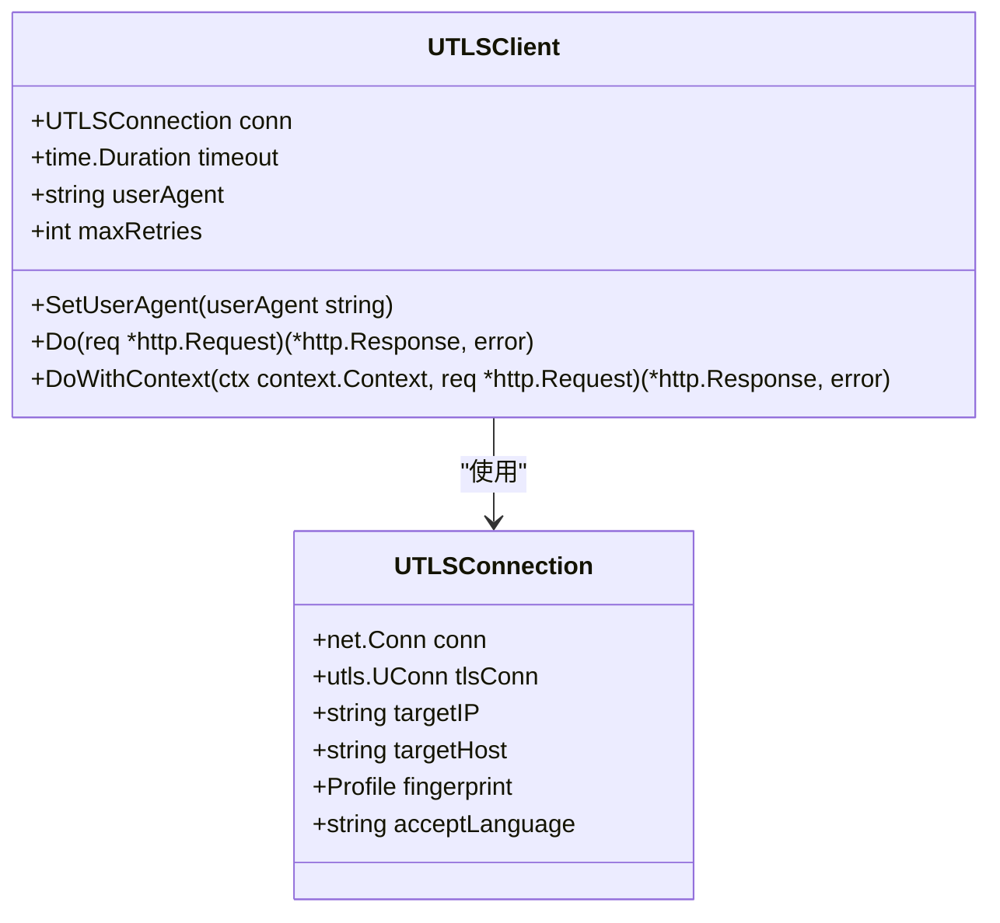
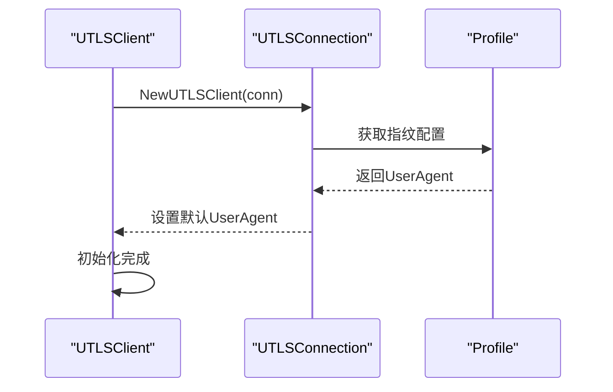
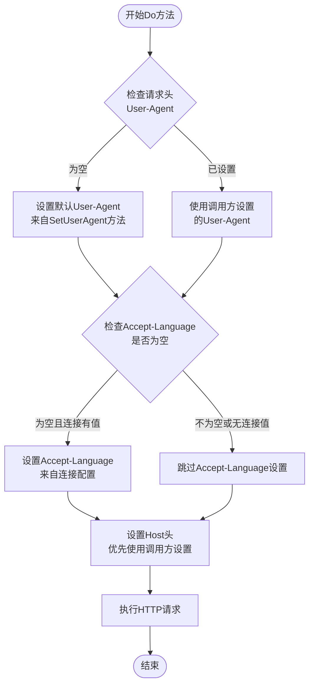
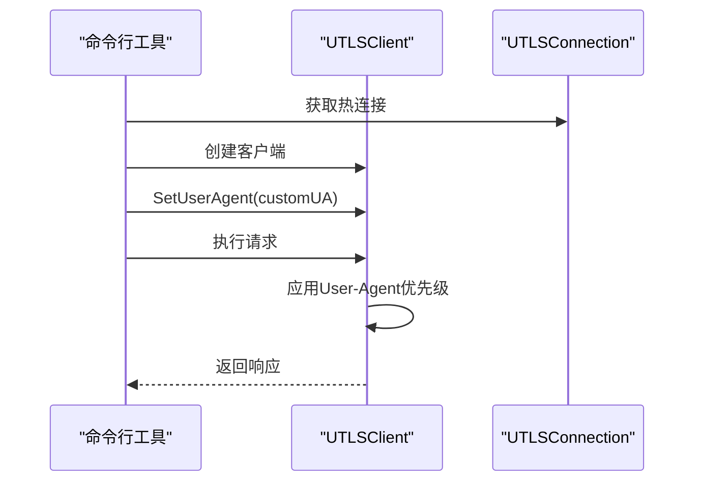
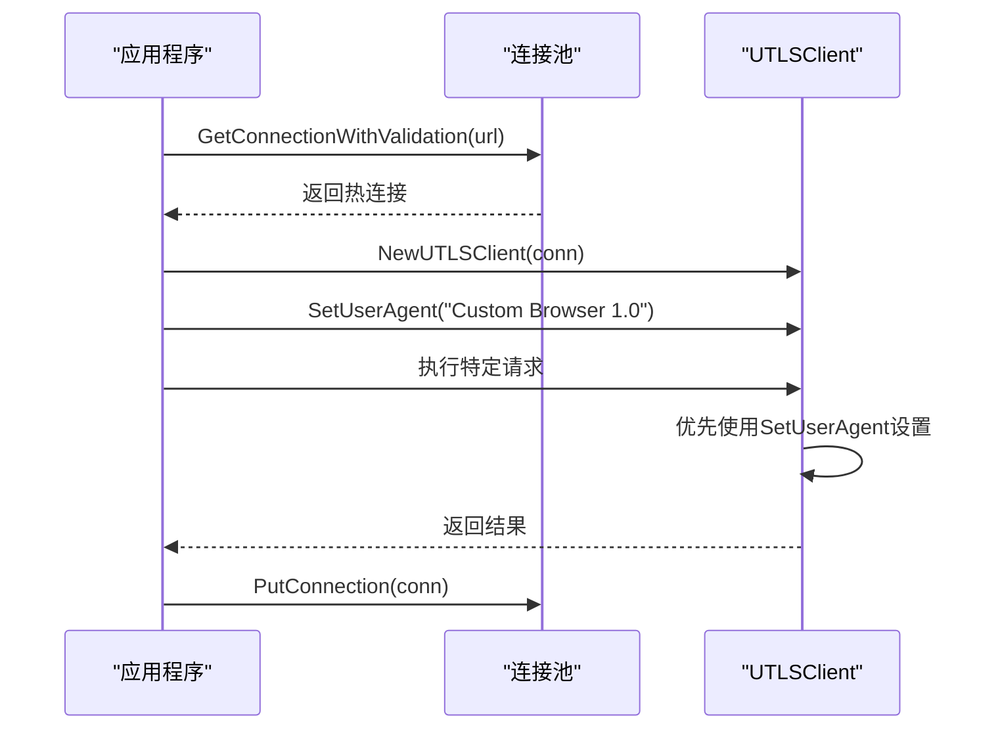
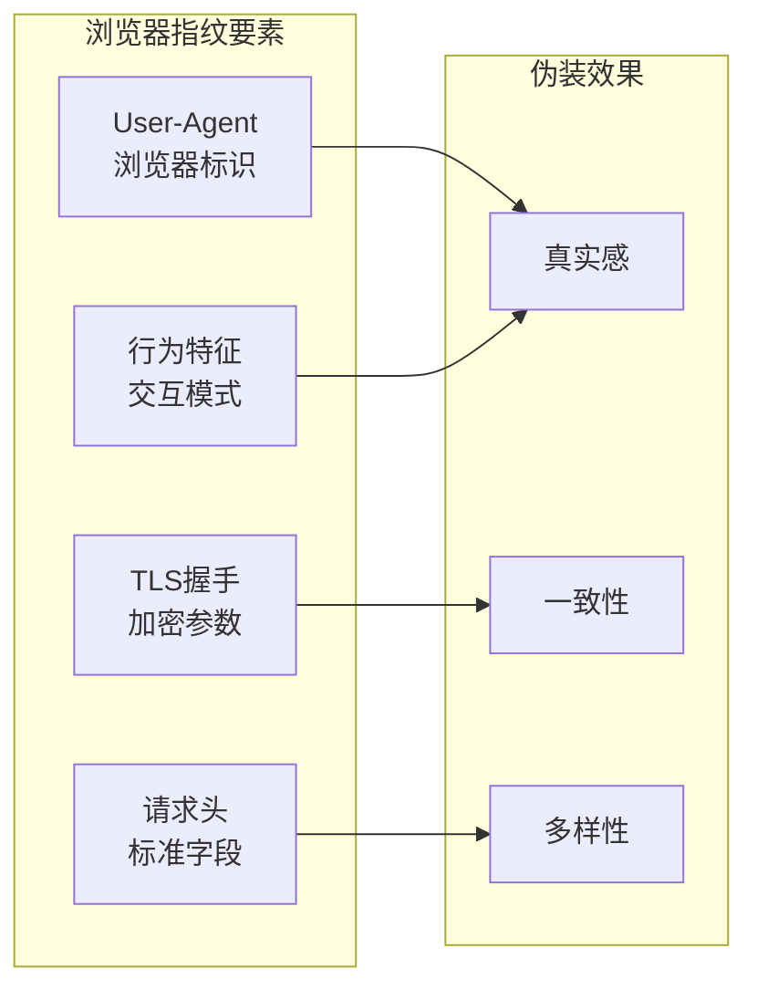

# User-Agent设置

<cite>
**本文档引用的文件**
- [utlsclient.go](file://utlsclient/utlsclient.go)
- [utlsfingerprint.go](file://utlsclient/utlsfingerprint.go)
- [main.go](file://cmd/utlsclient/main.go)
- [example_utlsclient_usage.go](file://examples/utlsclient/example_utlsclient_usage.go)
- [utlshotconnpool.go](file://utlsclient/utlshotconnpool.go)
- [connection_manager.go](file://utlsclient/connection_manager.go)
- [connection_helpers.go](file://utlsclient/connection_helpers.go)
- [utlsclient_test.go](file://test/utlsclient/utlsclient_test.go)
</cite>

## 目录
1. [简介](#简介)
2. [项目架构概览](#项目架构概览)
3. [SetUserAgent方法详解](#setuseragent方法详解)
4. [默认User-Agent行为](#默认user-agent行为)
5. [Do方法中的优先级机制](#do方法中的优先级机制)
6. [实际应用示例](#实际应用示例)
7. [浏览器指纹伪装重要性](#浏览器指纹伪装重要性)
8. [最佳实践与警告](#最佳实践与警告)
9. [总结](#总结)

## 简介

在现代Web爬虫和自动化工具开发中，正确设置User-Agent头对于模拟真实浏览器行为、避免被目标网站识别和阻止至关重要。本文档深入分析crawler-platform项目中User-Agent设置的实现机制，重点讲解`SetUserAgent`方法如何覆盖默认的User-Agent头，以及在Do方法中如何优先使用调用方设置的请求头。

## 项目架构概览

crawler-platform项目采用基于uTLS的HTTP客户端架构，提供了强大的浏览器指纹伪装能力。整个系统的核心组件包括：



**图表来源**
- [utlsclient.go](file://utlsclient/utlsclient.go#L37-L43)
- [utlshotconnpool.go](file://utlsclient/utlshotconnpool.go#L204-L233)
- [utlsfingerprint.go](file://utlsclient/utlsfingerprint.go#L14-L22)

**章节来源**
- [utlsclient.go](file://utlsclient/utlsclient.go#L1-L50)
- [utlsfingerprint.go](file://utlsclient/utlsfingerprint.go#L1-L30)

## SetUserAgent方法详解

### 方法签名与实现

`SetUserAgent`方法是UTLSClient结构体的一个核心方法，用于动态修改客户端的User-Agent头：



**图表来源**
- [utlsclient.go](file://utlsclient/utlsclient.go#L37-L43)
- [utlshotconnpool.go](file://utlsclient/utlshotconnpool.go#L204-L233)

### 实现机制分析

SetUserAgent方法的实现非常简洁，但功能强大：

1. **直接赋值机制**：方法直接将传入的userAgent参数赋值给客户端的userAgent字段
2. **运行时修改**：允许在客户端创建后动态修改User-Agent，无需重新创建客户端实例
3. **即时生效**：修改立即生效，影响后续的所有请求

**章节来源**
- [utlsclient.go](file://utlsclient/utlsclient.go#L59-L63)

## 默认User-Agent行为

### 初始化过程

当创建新的UTLSClient实例时，默认的User-Agent会从连接的指纹配置中继承：



**图表来源**
- [utlsclient.go](file://utlsclient/utlsclient.go#L46-L52)

### 指纹库中的User-Agent配置

UTLSConnection包含一个Profile结构体，其中包含了各种浏览器的User-Agent字符串：

| 浏览器 | 版本 | 平台 | User-Agent示例 |
|--------|------|------|----------------|
| Chrome | 133 | Windows | Mozilla/5.0 (Windows NT 10.0; Win64; x64) AppleWebKit/537.36 (KHTML, like Gecko) Chrome/133.0.0.0 Safari/537.36 |
| Chrome | 131 | macOS | Mozilla/5.0 (Macintosh; Intel Mac OS X 10_15_7) AppleWebKit/537.36 (KHTML, like Gecko) Chrome/131.0.0.0 Safari/537.36 |
| Firefox | 120 | Windows | Mozilla/5.0 (Windows NT 10.0; Win64; x64; rv:120.0) Gecko/20100101 Firefox/120.0 |
| Edge | 106 | Windows | Mozilla/5.0 (Windows NT 10.0; Win64; x64) AppleWebKit/537.36 (KHTML, like Gecko) Chrome/106.0.0.0 Safari/537.36 Edg/106.0.0.0 |

**章节来源**
- [utlsclient.go](file://utlsclient/utlsclient.go#L46-L52)
- [utlsfingerprint.go](file://utlsclient/utlsfingerprint.go#L112-L440)

## Do方法中的优先级机制

### 请求头设置流程

在Do方法中，系统实现了智能的请求头设置机制，确保用户设置的请求头具有最高优先级：



**图表来源**
- [utlsclient.go](file://utlsclient/utlsclient.go#L85-L102)

### 优先级规则详解

1. **最高优先级：调用方设置的请求头**
   - 如果请求对象中已经设置了User-Agent头，则直接使用该值
   - 这允许调用方完全控制请求头内容

2. **中等优先级：SetUserAgent方法设置**
   - 如果请求头中未设置User-Agent，则使用SetUserAgent方法设置的值
   - 这是动态修改User-Agent的主要机制

3. **最低优先级：连接指纹配置**
   - 如果以上两种情况都未设置，则使用连接的默认User-Agent
   - 这是初始化时的默认行为

**章节来源**
- [utlsclient.go](file://utlsclient/utlsclient.go#L85-L102)

## 实际应用示例

### 基本使用示例

以下展示了如何在不同场景中使用SetUserAgent方法：

#### 命令行工具中的使用



**图表来源**
- [main.go](file://cmd/utlsclient/main.go#L64-L67)

#### 程序化使用示例



**图表来源**
- [example_utlsclient_usage.go](file://examples/utlsclient/example_utlsclient_usage.go#L33-L37)

### 针对特定网站的兼容性设置

不同网站可能对User-Agent有不同的要求，以下是常见的应用场景：

| 场景 | User-Agent需求 | 实现方式 |
|------|----------------|----------|
| Google服务 | 需要真实的Chrome/Firefox | 使用对应浏览器的指纹配置 |
| API访问 | 自定义格式的User-Agent | SetUserAgent设置特定值 |
| 反爬虫检测 | 动态变化的User-Agent | 运行时动态修改 |
| 多账户轮换 | 不同的User-Agent池 | 预先配置多个指纹 |

**章节来源**
- [main.go](file://cmd/utlsclient/main.go#L64-L67)
- [example_utlsclient_usage.go](file://examples/utlsclient/example_utlsclient_usage.go#L33-L37)

## 浏览器指纹伪装重要性

### 为什么需要正确的User-Agent

1. **反爬虫防护**：大多数网站通过User-Agent识别爬虫行为
2. **功能适配**：某些网站根据User-Agent提供不同的功能
3. **内容差异化**：移动设备和桌面设备的内容可能不同
4. **统计分析**：网站需要区分真实用户和自动化工具

### 指纹伪装的整体策略

crawler-platform不仅关注User-Agent，还提供了完整的浏览器指纹伪装：



**图表来源**
- [utlsfingerprint.go](file://utlsclient/utlsfingerprint.go#L14-L22)

**章节来源**
- [utlsfingerprint.go](file://utlsclient/utlsfingerprint.go#L1-L30)

## 最佳实践与警告

### 正确设置User-Agent的最佳实践

1. **使用真实的浏览器标识**
   - 避免使用过于明显的爬虫标识
   - 选择主流浏览器的版本组合
   - 确保User-Agent格式符合标准

2. **保持一致性**
   - 在同一会话中使用相同的User-Agent
   - 避免频繁切换不同的User-Agent
   - 与TLS指纹配置保持一致

3. **动态调整策略**
   - 根据目标网站的检测强度调整策略
   - 实现User-Agent轮换机制
   - 监控请求成功率和检测结果

### 避免的常见错误

1. **使用易被识别的非常规值**
   ```go
   // ❌ 不推荐：过于明显的爬虫标识
   client.SetUserAgent("CrawlerBot/1.0")
   
   // ✅ 推荐：真实的浏览器标识
   client.SetUserAgent("Mozilla/5.0 (Windows NT 10.0; Win64; x64) AppleWebKit/537.36 (KHTML, like Gecko) Chrome/133.0.0.0 Safari/537.36")
   ```

2. **忽略TLS指纹的一致性**
   - User-Agent应该与TLS握手参数相匹配
   - 避免User-Agent和TLS指纹不一致的情况

3. **过度频繁的User-Agent切换**
   - 频繁切换可能触发反爬虫机制
   - 建议在合理的间隔内进行轮换

### 性能考虑

1. **连接复用**：SetUserAgent不影响连接复用
2. **内存占用**：User-Agent字符串存储在客户端实例中
3. **并发安全**：SetUserAgent方法是线程安全的

**章节来源**
- [utlsclient.go](file://utlsclient/utlsclient.go#L59-L63)
- [utlsclient_test.go](file://test/utlsclient/utlsclient_test.go#L33-L42)

## 总结

crawler-platform项目中的User-Agent设置机制提供了灵活而强大的功能，通过`SetUserAgent`方法可以动态覆盖默认的User-Agent头。系统采用智能的优先级机制，确保调用方设置的请求头具有最高优先级，同时保留了灵活性和兼容性。

关键特性包括：

1. **动态覆盖能力**：运行时可以随时修改User-Agent
2. **智能优先级**：调用方设置 > SetUserAgent设置 > 默认指纹配置
3. **浏览器指纹集成**：与TLS指纹系统无缝配合
4. **性能优化**：支持连接复用和高效的数据结构

正确使用这些功能可以帮助开发者构建更加隐蔽和高效的Web爬虫系统，同时避免被目标网站识别和阻止。在实际应用中，建议结合具体的业务需求和目标网站的检测策略，制定合适的User-Agent设置和轮换策略。