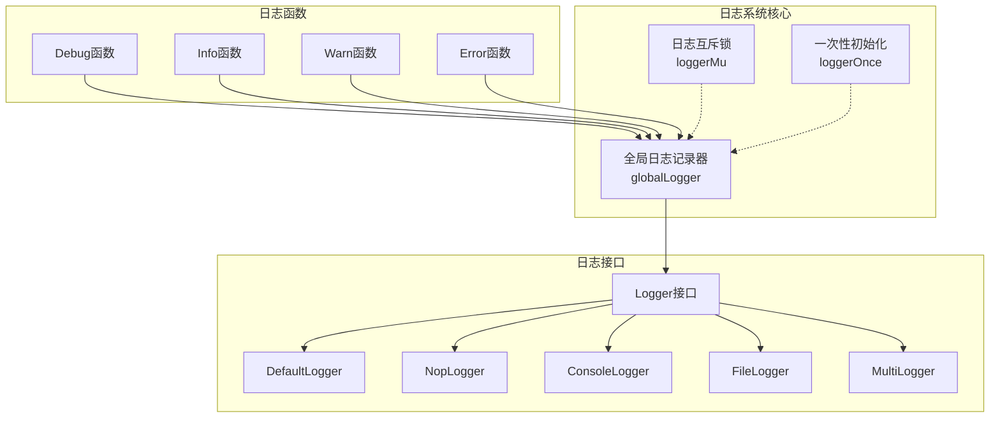
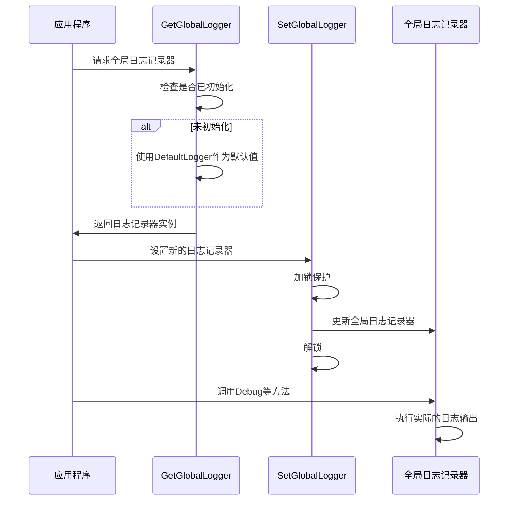
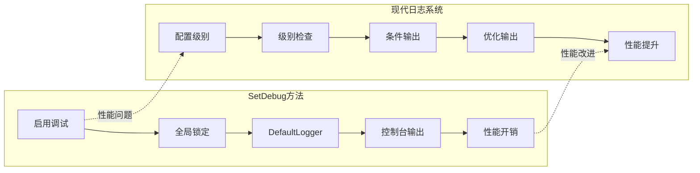

# 调试模式设置

<cite>
**本文档中引用的文件**
- [utlsclient.go](file:/utlsclient/utlsclient.go)
- [logger.go](file:/utlsclient/logger.go)
- [logger.go](file:/logger/logger.go)
- [utlsclient_test.go](file:/test/utlsclient/utlsclient_test.go)
- [example_utlsclient_usage.go](file:/examples/utlsclient/example_utlsclient_usage.go)
- [example_hotconnpool_usage.go](file:/examples/utlsclient/example_hotconnpool_usage.go)
</cite>

## 目录
1. [简介](#简介)
2. [SetDebug方法概述](#setdebug方法概述)
3. [兼容性设计分析](#兼容性设计分析)
4. [已废弃状态说明](#已废弃状态说明)
5. [全局日志系统架构](#全局日志系统架构)
6. [迁移指南](#迁移指南)
7. [最佳实践建议](#最佳实践建议)
8. [性能影响分析](#性能影响分析)
9. [故障排除指南](#故障排除指南)
10. [总结](#总结)

## 简介

SetDebug方法是crawler-platform项目中用于控制调试日志输出的兼容性接口。该方法允许开发者在启用调试模式时激活详细的连接和请求诊断信息输出，主要用于开发和问题排查阶段。然而，随着项目的演进，该方法已被标记为废弃，并推荐使用更现代化的日志控制系统。

## SetDebug方法概述

SetDebug方法位于UTLSClient结构体中，提供了一个简单的布尔开关来控制调试日志的输出。该方法的设计目的是为用户提供一个便捷的方式来启用或禁用调试信息，以便更好地理解客户端的行为和诊断连接问题。

```mermaid
classDiagram
class UTLSClient {
+conn *UTLSConnection
+timeout time.Duration
+userAgent string
+maxRetries int
+SetDebug(debug bool)
+Do(req *http.Request) (*http.Response, error)
+Get(url string) (*http.Response, error)
+Post(url string, contentType string, body io.Reader) (*http.Response, error)
}
class Logger {
<<interface>>
+Debug(format string, args ...interface{})
+Info(format string, args ...interface{})
+Warn(format string, args ...interface{})
+Error(format string, args ...interface{})
}
class DefaultLogger {
+Debug(format string, args ...interface{})
+Info(format string, args ...interface{})
+Warn(format string, args ...interface{})
+Error(format string, args ...interface{})
}
class NopLogger {
+Debug(format string, args ...interface{})
+Info(format string, args ...interface{})
+Warn(format string, args ...interface{})
+Error(format string, args ...interface{})
}
UTLSClient --> Logger : "使用"
DefaultLogger ..|> Logger : "实现"
NopLogger ..|> Logger : "实现"
```

**图表来源**
- [utlsclient.go](file:/utlsclient/utlsclient.go#L37-L42)
- [logger.go](file:/logger/logger.go#L21-L29)
- [logger.go](file:/logger/interfaces.go#L3-L9)

**章节来源**
- [utlsclient.go](file:/utlsclient/utlsclient.go#L70-L78)

## 兼容性设计分析

SetDebug方法的兼容性设计体现了项目在演进过程中对向后兼容性的重视。该方法的核心设计理念是在不影响现有代码的前提下，提供一个简单易用的调试接口。

### 方法实现机制

SetDebug方法采用了一种简洁的设计模式：

1. **条件激活机制**：只有当debug参数为true时才会触发日志系统的变更
2. **全局影响策略**：一旦启用调试模式，会设置全局日志记录器为默认日志记录器
3. **无状态设计**：禁用调试模式时不会执行任何操作，保持当前的全局日志设置不变

### 设计特点

- **简单性**：提供单一布尔参数，易于理解和使用
- **向后兼容**：确保现有使用该方法的代码继续正常工作
- **全局作用域**：影响整个应用程序的调试输出，而非单个客户端实例
- **即时生效**：启用后立即开始输出调试信息

**章节来源**
- [utlsclient.go](file:/utlsclient/utlsclient.go#L71-L77)

## 已废弃状态说明

尽管SetDebug方法提供了便利的调试功能，但它已被明确标记为废弃状态。这种废弃决策基于以下几个关键因素：

### 限制性设计

1. **全局影响**：SetDebug方法影响的是全局日志级别，而不是单个客户端实例的配置
2. **粗粒度控制**：只能启用或禁用调试模式，缺乏细粒度的日志级别控制
3. **资源浪费**：即使在禁用调试模式后，仍可能产生不必要的日志处理开销

### 技术债务

该方法的存在增加了技术债务：
- **维护成本**：需要持续维护向后兼容性
- **复杂性增加**：引入了额外的状态管理逻辑
- **性能隐患**：可能导致不必要的日志处理操作

### 替代方案优势

现代日志系统提供了更强大的功能：
- **多级别支持**：支持DEBUG、INFO、WARN、ERROR等多个日志级别
- **灵活配置**：可以针对不同组件和场景设置不同的日志级别
- **性能优化**：支持日志级别的检查，避免不必要的格式化操作
- **多种输出**：支持控制台、文件、网络等多种输出方式

**章节来源**
- [utlsclient.go](file:/utlsclient/utlsclient.go#L71-L72)

## 全局日志系统架构

项目采用了现代化的全局日志系统架构，提供了更强大和灵活的日志控制能力。

### 核心组件



**图表来源**
- [logger.go](file:/logger/logger.go#L10-L14)
- [logger.go](file:/logger/logger.go#L39-L42)

### 日志记录器类型

| 记录器类型 | 功能描述 | 使用场景 |
|-----------|----------|----------|
| DefaultLogger | 基础日志记录器，使用标准库log | 生产环境基础日志 |
| NopLogger | 空日志记录器，不输出任何内容 | 性能敏感场景 |
| ConsoleLogger | 控制台日志记录器 | 开发调试环境 |
| FileLogger | 文件日志记录器 | 需要持久化日志 |
| MultiLogger | 多重日志记录器 | 组合多种输出 |

### 全局日志控制流程



**图表来源**
- [logger.go](file:/logger/logger.go#L26-L35)
- [logger.go](file:/logger/logger.go#L15-L24)

**章节来源**
- [logger.go](file:/logger/logger.go#L15-L42)

## 迁移指南

从SetDebug方法迁移到现代日志系统是一个相对简单的过程，但需要仔细考虑配置和使用方式。

### 基本迁移步骤

#### 1. 移除SetDebug调用

```go
// 旧代码
client.SetDebug(true)

// 新代码 - 移除SetDebug调用
// 不需要任何操作，使用默认的全局日志记录器
```

#### 2. 配置自定义日志记录器

```go
import "crawler-platform/logger"

// 创建控制台日志记录器，启用调试级别
consoleLogger := logger.NewConsoleLogger(true, true, true, true)
logger.SetGlobalLogger(consoleLogger)

// 或者创建文件日志记录器
fileLogger, err := logger.NewFileLogger("app.log", true, true, true, true)
if err != nil {
    log.Fatalf("创建文件日志记录器失败: %v", err)
}
logger.SetGlobalLogger(fileLogger)
```

#### 3. 使用高级日志功能

```go
// 创建多重日志记录器，同时输出到控制台和文件
consoleLogger := logger.NewConsoleLogger(true, true, true, true)
fileLogger, _ := logger.NewFileLogger("app.log", true, true, true, true)
multiLogger := logger.NewMultiLogger(consoleLogger, fileLogger)
logger.SetGlobalLogger(multiLogger)

// 使用不同的日志级别
logger.Debug("调试信息: %s", "详细内容")
logger.Info("一般信息: %s", "重要事件")
logger.Warn("警告信息: %s", "潜在问题")
logger.Error("错误信息: %s", "严重错误")
```

### 迁移检查清单

- [ ] 移除所有SetDebug调用
- [ ] 引入logger包的导入语句
- [ ] 根据需求选择合适的日志记录器类型
- [ ] 配置适当的日志级别
- [ ] 测试日志输出是否符合预期
- [ ] 更新文档和注释
- [ ] 验证性能影响

**章节来源**
- [logger.go](file:/logger/logger.go#L51-L95)
- [logger.go](file:/logger/logger.go#L108-L130)

## 最佳实践建议

为了充分利用现代日志系统的优势，建议遵循以下最佳实践：

### 日志级别配置

```go
// 开发环境：启用所有级别
devLogger := logger.NewConsoleLogger(true, true, true, true)

// 测试环境：启用调试和信息级别
testLogger := logger.NewConsoleLogger(true, true, false, false)

// 生产环境：仅启用错误级别
prodLogger := logger.NewConsoleLogger(false, false, false, true)
```

### 性能优化策略

1. **条件日志记录**：在生产环境中避免使用复杂的字符串格式化
2. **异步日志**：对于高并发场景，考虑使用异步日志记录器
3. **日志轮转**：配置文件日志的轮转和清理策略

### 错误处理最佳实践

```go
// 使用日志记录错误详情
if err != nil {
    logger.Errorf("操作失败: %v", err)
    return err
}

// 结构化错误日志
logger.Errorf("连接失败 - 目标: %s, 错误: %v", target, err)
```

### 监控和告警集成

```go
// 集成监控系统
logger.Error("服务异常 - 触发告警")
monitoring.IncrementCounter("service_errors")
```

## 性能影响分析

SetDebug方法的使用可能带来以下性能影响：

### 当前性能特征

1. **CPU开销**：每次日志调用都会产生一定的CPU开销
2. **内存分配**：字符串格式化操作可能导致内存分配
3. **I/O操作**：控制台输出可能阻塞主线程
4. **锁竞争**：全局日志系统的互斥锁可能导致竞争

### 现代化改进



### 性能优化建议

1. **级别检查**：现代日志系统支持级别检查，避免不必要的格式化
2. **批量处理**：使用缓冲区减少I/O操作频率
3. **异步处理**：将日志写入与业务逻辑分离
4. **采样策略**：在高负载情况下使用采样日志

## 故障排除指南

### 常见问题及解决方案

#### 1. 调试信息不显示

**问题症状**：设置了SetDebug(true)但没有看到调试输出

**解决方案**：
- 检查全局日志记录器是否被其他代码覆盖
- 确认日志级别配置正确
- 验证日志输出目标（控制台或文件）

#### 2. 性能下降

**问题症状**：启用调试模式后应用性能明显下降

**解决方案**：
- 迁移到现代日志系统，使用级别检查
- 考虑使用NopLogger在生产环境中
- 优化日志输出频率

#### 3. 日志重复输出

**问题症状**：同一消息被多次输出

**解决方案**：
- 检查是否多次调用SetGlobalLogger
- 确认没有多个日志记录器实例
- 使用MultiLogger时注意配置

### 调试技巧

```go
// 使用结构化日志帮助调试
logger.Debug("请求详情: URL=%s, Method=%s, Headers=%v", 
    req.URL.String(), req.Method, req.Header)

// 添加时间戳和上下文信息
logger.Debug("[%s] %s %s", time.Now().Format("15:04:05"), req.Method, req.URL.Path)
```

**章节来源**
- [utlsclient_test.go](file:/test/utlsclient/utlsclient_test.go#L57-L73)

## 总结

SetDebug方法作为crawler-platform项目早期的调试工具，在向后兼容性和易用性方面发挥了重要作用。然而，随着项目的发展和技术的进步，它已经显现出明显的局限性。

### 主要结论

1. **兼容性价值**：SetDebug方法在项目演进过程中保持了向后兼容性，确保了现有代码的正常运行
2. **功能限制**：全局作用域和粗粒度控制限制了其在复杂场景下的适用性
3. **技术债务**：废弃状态反映了项目对现代化、高性能日志系统的需求
4. **迁移价值**：现代日志系统提供了更强大、更灵活的功能，值得全面采用

### 推荐行动

- **短期**：继续使用SetDebug方法直到完成迁移
- **中期**：逐步迁移到现代日志系统
- **长期**：完全采用现代化的日志配置和管理策略

通过合理的迁移计划和最佳实践的应用，可以显著提升应用程序的日志质量和整体性能，同时为未来的扩展和维护奠定坚实的基础。