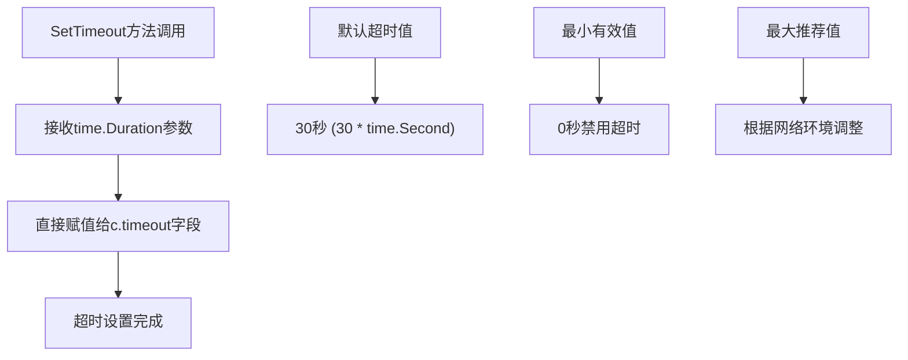
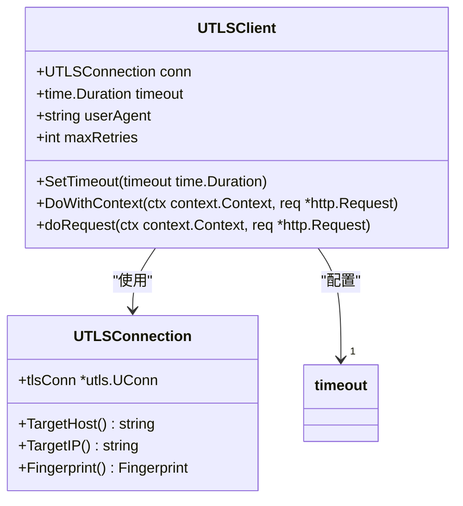
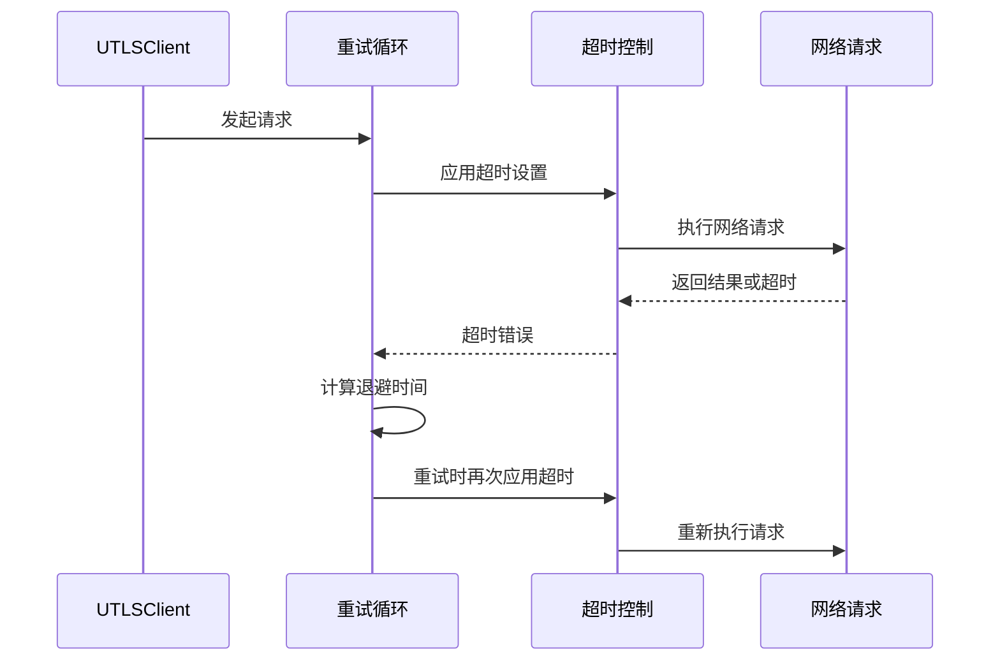
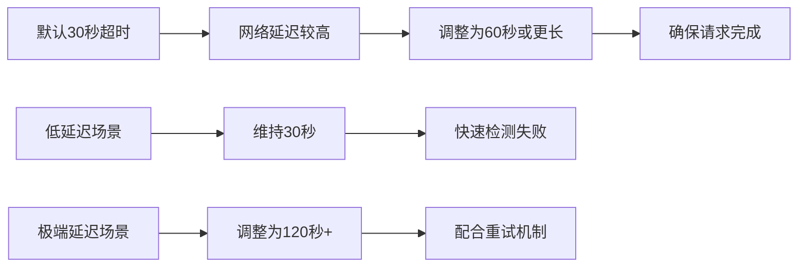
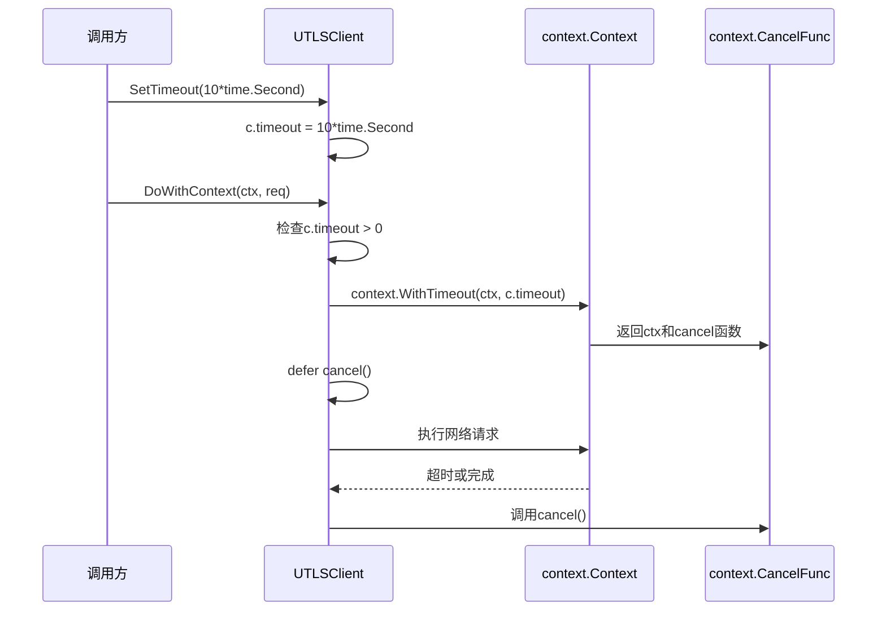
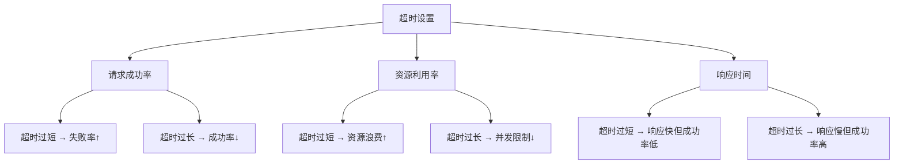

# 超时设置

<cite>
**本文档中引用的文件**
- [utlsclient.go](file://utlsclient/utlsclient.go)
- [constants.go](file://utlsclient/constants.go)
- [example_utlsclient_usage.go](file://examples/utlsclient/example_utlsclient_usage.go)
- [example_basic_usage.go](file://examples/utlsclient/example_basic_usage.go)
- [utlshotconnpool.go](file://utlsclient/utlshotconnpool.go)
- [utlsclient_test.go](file://test/utlsclient/utlsclient_test.go)
</cite>

## 目录
1. [概述](#概述)
2. [SetTimeout方法详解](#settimeout方法详解)
3. [超时配置架构](#超时配置架构)
4. [重试机制中的超时作用](#重试机制中的超时作用)
5. [高延迟场景配置示例](#高延迟场景配置示例)
6. [底层工作原理](#底层工作原理)
7. [最佳实践建议](#最佳实践建议)
8. [故障排除指南](#故障排除指南)

## 概述

UTLSClient的SetTimeout方法是一个关键的配置功能，用于控制每个HTTP请求的最大等待时间。该方法通过修改客户端实例的timeout字段来实现超时控制，确保在网络延迟较高或目标站点响应缓慢的情况下能够及时终止请求，避免长时间等待导致的资源浪费。

## SetTimeout方法详解

### 方法签名与实现

SetTimeout方法的实现非常简洁，直接修改客户端实例的timeout字段：

**图表来源**
- [utlsclient.go](file://utlsclient/utlsclient.go#L55-L57)

### 默认行为

UTLSClient在创建时会设置默认的超时时间为30秒，这是经过优化的平衡点，适用于大多数标准网络环境：

**章节来源**
- [utlsclient.go](file://utlsclient/utlsclient.go#L48-L52)

## 超时配置架构

### 客户端超时配置

UTLSClient的超时配置采用简单直接的设计模式：

**图表来源**
- [utlsclient.go](file://utlsclient/utlsclient.go#L38-L43)

### 配置层次结构

超时配置在系统中有多个层次：

| 配置层级 | 配置项 | 默认值 | 说明 |
|---------|--------|--------|------|
| 客户端级别 | timeout | 30秒 | 单个请求的超时时间 |
| 连接池级别 | ConnTimeout | 可配置 | 连接建立超时 |
| 连接级别 | IdleTimeout | 可配置 | 连接空闲超时 |
| 测试级别 | TestTimeout | 可配置 | 连接测试超时 |

**章节来源**
- [utlshotconnpool.go](file://utlsclient/utlshotconnpool.go#L64-L67)

## 重试机制中的超时作用

### 重试循环中的超时应用

在UTLSClient的重试机制中，每次重试都会重新应用相同的超时设置：

**图表来源**
- [utlsclient.go](file://utlsclient/utlsclient.go#L104-L118)

### 重试延迟计算

重试机制使用指数退避策略，结合默认的1秒延迟：

**章节来源**
- [constants.go](file://utlsclient/constants.go#L40-L42)
- [utlsclient.go](file://utlsclient/utlsclient.go#L107-L108)

## 高延迟场景配置示例

### 标准高延迟场景

对于网络延迟较高的目标站点，建议适当增加超时时间：

### 配置示例代码路径

以下展示了如何在不同场景下配置超时：

**章节来源**
- [example_utlsclient_usage.go](file://examples/utlsclient/example_utlsclient_usage.go#L35-L36)

## 底层工作原理

### context.WithTimeout实现

SetTimeout方法的核心工作原理基于Go的标准库context包：

**图表来源**
- [utlsclient.go](file://utlsclient/utlsclient.go#L124-L127)

### 上下文取消机制

当超时发生时，context.WithTimeout会自动触发上下文取消，这会导致：
- 网络连接立即中断
- 正在进行的I/O操作返回超时错误
- 所有依赖该上下文的操作被清理

**章节来源**
- [utlsclient.go](file://utlsclient/utlsclient.go#L122-L128)

## 最佳实践建议

### 超时时间设置原则

1. **平衡策略**：在请求成功率和资源消耗之间找到平衡
2. **环境适应**：根据网络环境调整超时时间
3. **渐进式调整**：从默认值开始，根据实际表现逐步优化
4. **监控反馈**：通过监控数据指导超时设置

### 推荐配置表

| 网络环境 | 超时时间 | 重试次数 | 说明 |
|---------|----------|----------|------|
| 局域网 | 10-15秒 | 2-3次 | 快速响应 |
| 城域网 | 20-30秒 | 3-4次 | 标准配置 |
| 国际网络 | 30-60秒 | 3-5次 | 考虑时差因素 |
| 移动网络 | 45-90秒 | 4-6次 | 考虑网络不稳定 |

### 性能影响分析

合理的超时设置对系统性能的影响：

## 故障排除指南

### 常见超时问题

1. **频繁超时错误**
   - 检查网络连接质量
   - 调整超时时间
   - 分析目标服务器负载

2. **超时时间设置不当**
   - 监控实际响应时间分布
   - 根据百分位数设置超时
   - 考虑网络抖动因素

3. **重试机制失效**
   - 确认maxRetries设置正确
   - 检查错误类型判断逻辑
   - 验证退避策略效果

### 调试技巧

使用调试模式可以观察超时行为：

**章节来源**
- [utlsclient.go](file://utlsclient/utlsclient.go#L70-L78)

### 监控指标

建议监控以下关键指标来评估超时配置效果：

| 指标名称 | 计算方式 | 目标值 | 说明 |
|---------|----------|--------|------|
| 超时率 | 超时请求数/总请求数 | <10% | 超时比例过高 |
| 平均响应时间 | 所有请求耗时平均值 | <超时时间 | 响应时间分布 |
| 成功率 | 成功请求数/总请求数 | >85% | 整体成功率 |
| 资源利用率 | 并发连接数/最大连接数 | <80% | 避免资源瓶颈 |

**章节来源**
- [utlsclient_test.go](file://test/utlsclient/utlsclient_test.go#L21-L31)

通过合理配置UTLSClient的SetTimeout方法，可以在保证请求成功率的同时，有效控制资源消耗，提升系统的整体性能和稳定性。建议根据具体的网络环境和业务需求，结合监控数据进行持续优化。