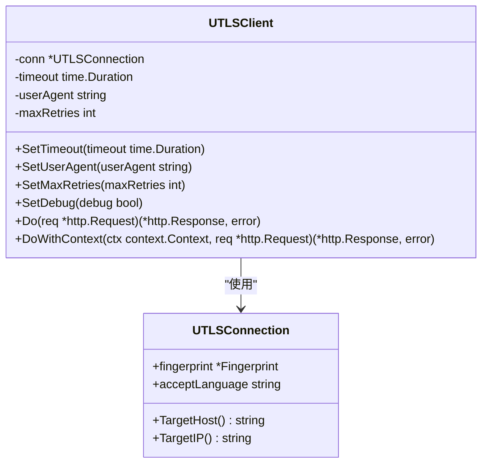
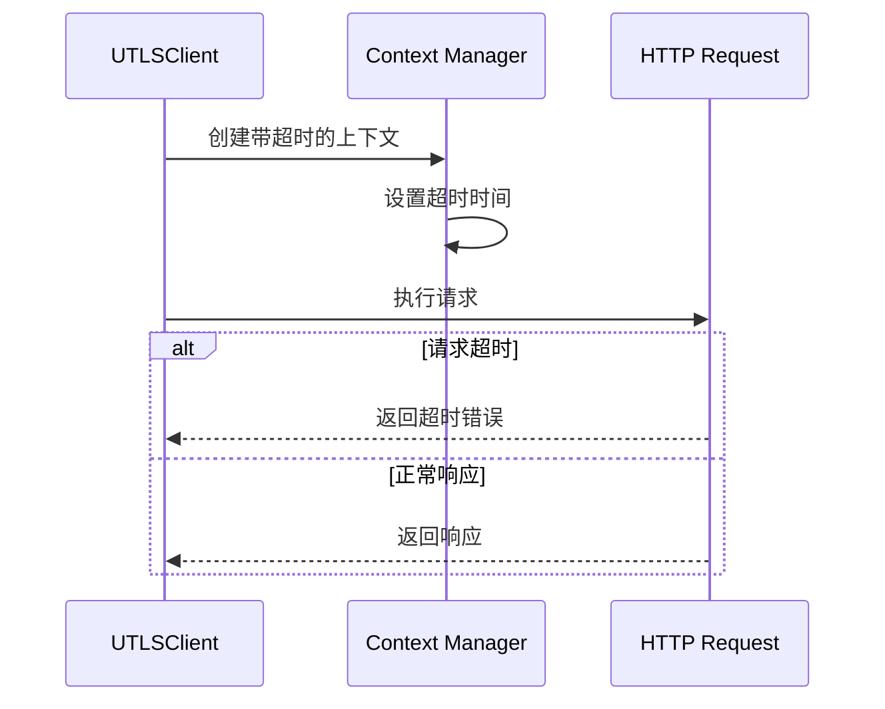
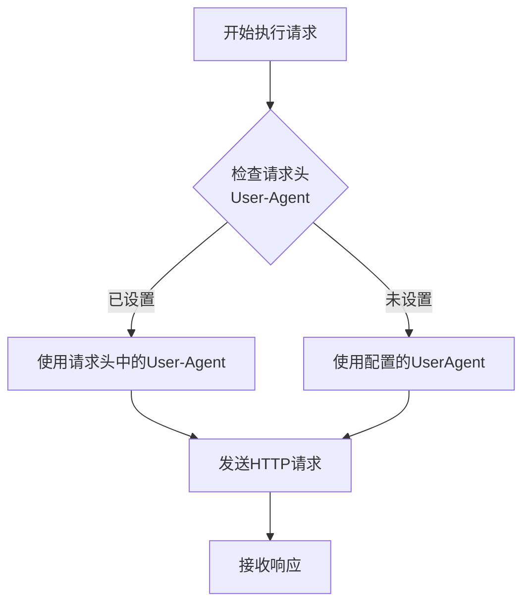
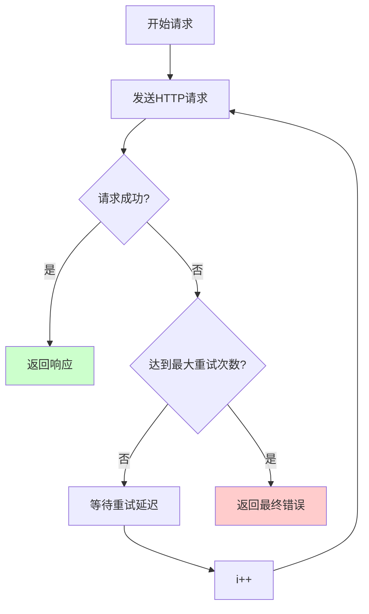
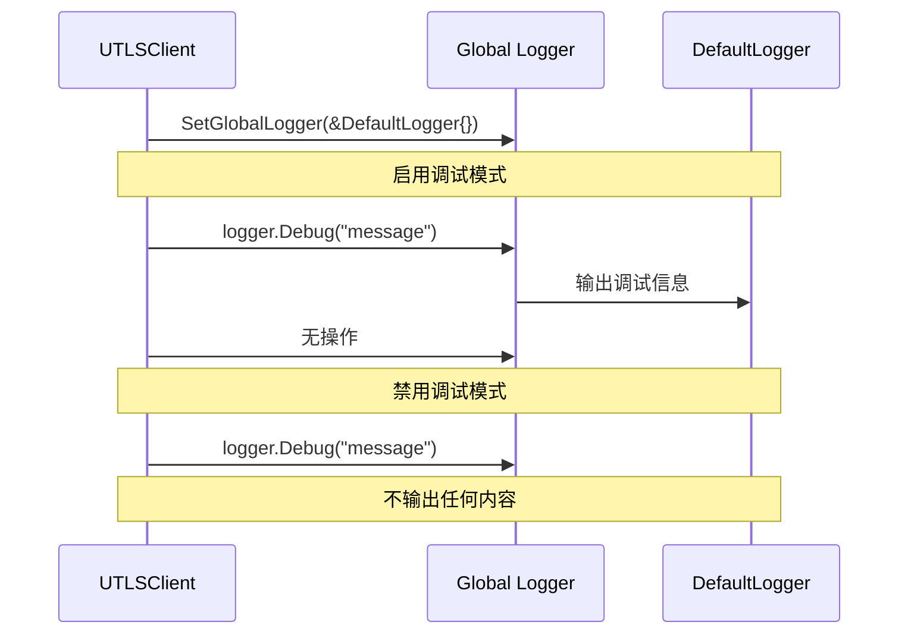
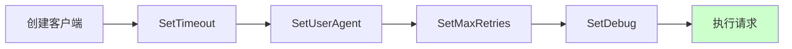
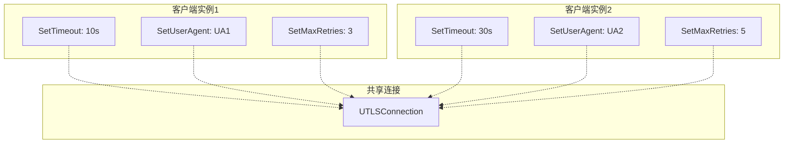

# UTLSClient配置方法详细文档

<cite>
**本文档引用的文件**
- [utlsclient.go](file://utlsclient/utlsclient.go)
- [example_basic_usage.go](file://examples/utlsclient/example_basic_usage.go)
- [example_utlsclient_usage.go](file://examples/utlsclient/example_utlsclient_usage.go)
- [utlsclient_test.go](file://test/utlsclient/utlsclient_test.go)
- [logger.go](file://logger/logger.go)
- [interfaces.go](file://logger/interfaces.go)
</cite>

## 目录
1. [简介](#简介)
2. [配置方法概览](#配置方法概览)
3. [SetTimeout方法详解](#settimeout方法详解)
4. [SetUserAgent方法详解](#setuseragent方法详解)
5. [SetMaxRetries方法详解](#setmaxretries方法详解)
6. [SetDebug方法详解](#setdebug方法详解)
7. [链式调用设计](#链式调用设计)
8. [配置优先级和作用范围](#配置优先级和作用范围)
9. [使用示例](#使用示例)
10. [最佳实践](#最佳实践)

## 简介

UTLSClient是基于uTLS的HTTP客户端，专门用于模拟真实浏览器行为。它提供了四个核心配置方法：`SetTimeout`、`SetUserAgent`、`SetMaxRetries`和`SetDebug`，这些方法采用链式调用设计，允许开发者灵活地调整客户端的行为特性。

## 配置方法概览

UTLSClient的配置方法提供了以下核心功能：

| 方法 | 功能描述 | 默认值 | 参数类型 |
|------|----------|--------|----------|
| `SetTimeout` | 设置请求超时时间 | 30秒 | `time.Duration` |
| `SetUserAgent` | 设置User-Agent字符串 | 从连接指纹继承 | `string` |
| `SetMaxRetries` | 设置最大重试次数 | 3次 | `int` |
| `SetDebug` | 设置调试模式（已废弃） | 无 | `bool` |



**图表来源**
- [utlsclient.go](file://utlsclient/utlsclient.go#L37-L43)

## SetTimeout方法详解

### 功能描述

`SetTimeout`方法用于设置HTTP请求的超时时间，控制客户端在放弃请求前等待响应的最大时间。

### 技术实现

该方法直接修改客户端实例的`timeout`字段，影响所有后续的HTTP请求。



**图表来源**
- [utlsclient.go](file://utlsclient/utlsclient.go#L122-L130)

### 使用场景

- **网络不稳定环境**：设置较短的超时时间（如5秒）以快速失败
- **高延迟服务**：设置较长的超时时间（如60秒）以适应慢速响应
- **批量请求处理**：根据不同API特性设置不同的超时策略

### 配置示例

```go
// 设置10秒超时
client.SetTimeout(10 * time.Second)

// 设置30秒超时（默认值）
client.SetTimeout(30 * time.Second)

// 设置无限超时（谨慎使用）
client.SetTimeout(0)
```

**章节来源**
- [utlsclient.go](file://utlsclient/utlsclient.go#L55-L58)
- [utlsclient_test.go](file://test/utlsclient/utlsclient_test.go#L22-L31)

## SetUserAgent方法详解

### 功能描述

`SetUserAgent`方法用于设置HTTP请求的User-Agent头部，覆盖连接指纹中默认的User-Agent值。

### 工作机制

该方法修改客户端实例的`userAgent`字段，影响所有后续的HTTP请求。当请求执行时，客户端会检查请求头中是否已设置User-Agent，如果未设置，则使用配置的值。



**图表来源**
- [utlsclient.go](file://utlsclient/utlsclient.go#L88-L89)

### 使用场景

- **模拟特定浏览器**：设置特定的User-Agent字符串
- **API访问**：使用符合要求的User-Agent标识应用
- **反爬虫绕过**：使用常见的浏览器User-Agent

### 配置示例

```go
// 设置自定义User-Agent
client.SetUserAgent("Mozilla/5.0 (Windows NT 10.0; Win64; x64) AppleWebKit/537.36")

// 设置移动端User-Agent
client.SetUserAgent("Mozilla/5.0 (iPhone; CPU iPhone OS 14_0 like Mac OS X)")

// 恢复默认User-Agent（从连接指纹继承）
client.SetUserAgent(conn.Fingerprint().UserAgent)
```

**章节来源**
- [utlsclient.go](file://utlsclient/utlsclient.go#L60-L63)
- [utlsclient_test.go](file://test/utlsclient/utlsclient_test.go#L34-L43)

## SetMaxRetries方法详解

### 功能描述

`SetMaxRetries`方法用于设置HTTP请求失败后的最大重试次数，增强请求的可靠性。

### 重试机制

该方法修改客户端实例的`maxRetries`字段，配合内置的重试逻辑实现故障恢复。



**图表来源**
- [utlsclient.go](file://utlsclient/utlsclient.go#L104-L118)

### 重试策略

- **指数退避**：每次重试间隔逐渐增加
- **错误检测**：只对可重试的错误进行重试
- **最大限制**：防止无限重试导致资源浪费

### 使用场景

- **网络不稳定环境**：增加重试次数提高成功率
- **第三方API**：设置合理的重试次数应对临时故障
- **关键业务请求**：设置较高的重试次数确保可靠性

### 配置示例

```go
// 设置最多重试3次（默认值）
client.SetMaxRetries(3)

// 设置最多重试5次
client.SetMaxRetries(5)

// 禁用重试
client.SetMaxRetries(0)

// 设置大量重试（谨慎使用）
client.SetMaxRetries(10)
```

**章节来源**
- [utlsclient.go](file://utlsclient/utlsclient.go#L65-L68)
- [utlsclient_test.go](file://test/utlsclient/utlsclient_test.go#L46-L55)

## SetDebug方法详解

### 特殊性说明

`SetDebug`方法是一个已废弃的兼容性方法，用于设置全局日志记录器以开启调试日志。需要注意的是，这个方法并不推荐使用，而是建议使用更精细的日志控制系统。

### 废弃原因

该方法已被标记为废弃，主要原因是：
- **全局状态管理**：影响整个应用程序的日志输出
- **缺乏灵活性**：只能启用/禁用调试模式，不能精确控制日志级别
- **替代方案**：有更好的日志管理系统可用

### 当前实现



**图表来源**
- [utlsclient.go](file://utlsclient/utlsclient.go#L70-L78)

### 替代方案

推荐使用logger包的`SetGlobalLogger`方法进行更精细的日志控制：

```go
// 推荐的替代方案
import "crawler-platform/logger"

// 设置默认日志记录器
logger.SetGlobalLogger(&logger.DefaultLogger{})

// 设置控制台日志记录器（只显示错误）
consoleLogger := logger.NewConsoleLogger(false, false, false, true)
logger.SetGlobalLogger(consoleLogger)

// 设置文件日志记录器
fileLogger, err := logger.NewFileLogger("app.log", true, true, true, true)
if err == nil {
    logger.SetGlobalLogger(fileLogger)
}
```

### 使用示例

```go
// 已废弃的方法（不推荐）
client.SetDebug(true)  // 开启调试模式
client.SetDebug(false) // 关闭调试模式

// 推荐的替代方法
logger.SetGlobalLogger(&logger.DefaultLogger{}) // 完全启用日志
logger.SetGlobalLogger(&logger.NopLogger{})     // 完全禁用日志
```

**章节来源**
- [utlsclient.go](file://utlsclient/utlsclient.go#L70-L78)
- [utlsclient_test.go](file://test/utlsclient/utlsclient_test.go#L58-L73)

## 链式调用设计

### 设计理念

UTLSClient的配置方法采用链式调用设计，虽然本身不返回客户端实例，但提供了流畅的配置体验。

### 方法签名特点

所有配置方法都遵循相同的签名模式：
```go
func (c *UTLSClient) MethodName(param Type) {
    c.field = param
}
```

### 配置顺序的重要性

虽然链式调用允许灵活的配置顺序，但某些配置可能会影响其他配置的效果：



### 最佳实践

```go
// 推荐的配置顺序
client := utlsclient.NewUTLSClient(conn)
client.SetTimeout(10 * time.Second)    // 1. 设置超时
client.SetUserAgent("Custom Agent")    // 2. 设置User-Agent
client.SetMaxRetries(3)                // 3. 设置重试次数
// client.SetDebug(true)               // 4. 不推荐使用
```

**章节来源**
- [utlsclient.go](file://utlsclient/utlsclient.go#L55-L68)

## 配置优先级和作用范围

### 配置优先级

UTLSClient的配置遵循以下优先级规则：

| 优先级 | 配置项 | 说明 |
|--------|--------|------|
| 最高 | 请求头中的User-Agent | 明确设置的请求头优先于配置 |
| 中等 | SetUserAgent配置 | 覆盖连接指纹的User-Agent |
| 中等 | 连接指纹的User-Agent | 默认从连接指纹继承 |
| 最低 | 系统默认值 | 作为最后的备选方案 |

### 作用范围

- **实例级别**：每个UTLSClient实例拥有独立的配置副本
- **请求级别**：配置仅影响当前客户端实例发起的请求
- **生命周期**：配置在客户端实例存在期间持续有效

### 配置隔离



**图表来源**
- [utlsclient.go](file://utlsclient/utlsclient.go#L37-L43)

**章节来源**
- [utlsclient.go](file://utlsclient/utlsclient.go#L88-L95)

## 使用示例

### 基础配置示例

```go
// 创建客户端并配置基础参数
func createBasicClient(conn *utlsclient.UTLSConnection) *utlsclient.UTLSClient {
    client := utlsclient.NewUTLSClient(conn)
    
    // 设置超时时间为15秒
    client.SetTimeout(15 * time.Second)
    
    // 设置自定义User-Agent
    client.SetUserAgent("MyCrawler/1.0 (+https://mydomain.com)")
    
    // 设置最大重试次数为2次
    client.SetMaxRetries(2)
    
    return client
}
```

### 高级配置示例

```go
// 创建具有复杂配置的客户端
func createAdvancedClient(conn *utlsclient.UTLSConnection) *utlsclient.UTLSClient {
    client := utlsclient.NewUTLSClient(conn)
    
    // 动态配置超时时间
    timeout := calculateOptimalTimeout(conn.TargetHost())
    client.SetTimeout(timeout)
    
    // 根据连接状态设置User-Agent
    if conn.IsHealthy() {
        client.SetUserAgent(getBrowserUserAgent())
    } else {
        client.SetUserAgent(getFallbackUserAgent())
    }
    
    // 根据请求类型调整重试策略
    if isCriticalRequest(conn.TargetHost()) {
        client.SetMaxRetries(5)
    } else {
        client.SetMaxRetries(2)
    }
    
    return client
}
```

### 动态配置示例

```go
// 动态调整客户端配置
func adjustClientConfiguration(client *utlsclient.UTLSClient, host string) {
    switch host {
    case "api.example.com":
        // API请求：短超时，高重试
        client.SetTimeout(5 * time.Second)
        client.SetMaxRetries(5)
    case "download.example.com":
        // 文件下载：长超时，低重试
        client.SetTimeout(60 * time.Second)
        client.SetMaxRetries(1)
    default:
        // 默认配置
        client.SetTimeout(30 * time.Second)
        client.SetMaxRetries(3)
    }
}
```

**章节来源**
- [example_utlsclient_usage.go](file://examples/utlsclient/example_utlsclient_usage.go#L33-L37)
- [example_utlsclient_usage.go](file://examples/utlsclient/example_utlsclient_usage.go#L33-L37)

## 最佳实践

### 配置策略

1. **超时时间设置**
   - 根据网络环境调整：内网使用短超时，外网使用长超时
   - 根据API特性调整：查询类API使用短超时，上传类API使用长超时

2. **User-Agent管理**
   - 使用明确的应用标识符
   - 遵守网站的robots.txt规则
   - 避免使用过于特殊的User-Agent

3. **重试策略优化**
   - 分析错误类型，只对可重试错误进行重试
   - 实现指数退避算法
   - 设置合理的最大重试次数

4. **日志管理**
   - 使用全局日志系统而非SetDebug方法
   - 根据环境配置不同的日志级别
   - 避免在生产环境中输出过多调试信息

### 错误处理

```go
// 健壮的客户端配置示例
func createRobustClient(conn *utlsclient.UTLSConnection) (*utlsclient.UTLSClient, error) {
    client := utlsclient.NewUTLSClient(conn)
    
    // 验证配置参数
    if conn == nil {
        return nil, errors.New("连接不能为空")
    }
    
    // 设置合理的默认配置
    client.SetTimeout(30 * time.Second)
    client.SetUserAgent(conn.Fingerprint().UserAgent)
    client.SetMaxRetries(3)
    
    // 验证配置有效性
    if client.timeout <= 0 {
        return nil, errors.New("超时时间必须大于0")
    }
    
    return client, nil
}
```

### 性能考虑

- **连接复用**：合理设置超时时间以充分利用连接池
- **内存管理**：及时释放不需要的客户端实例
- **并发安全**：确保在并发环境下正确使用配置方法

通过遵循这些最佳实践，可以充分发挥UTLSClient配置方法的优势，构建稳定可靠的HTTP客户端应用。