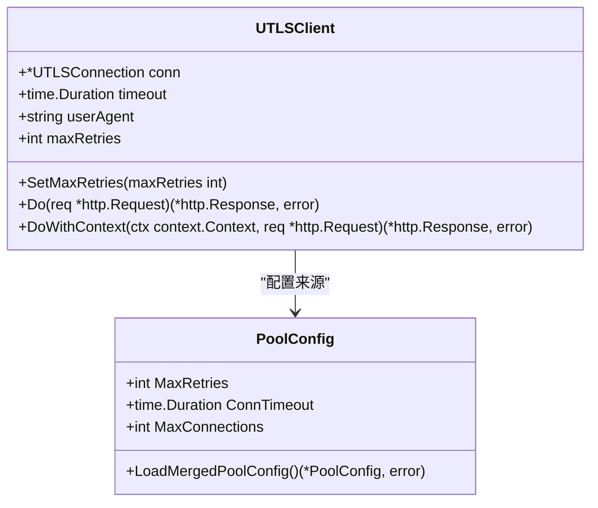
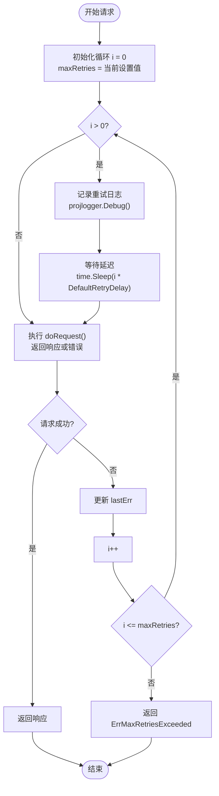
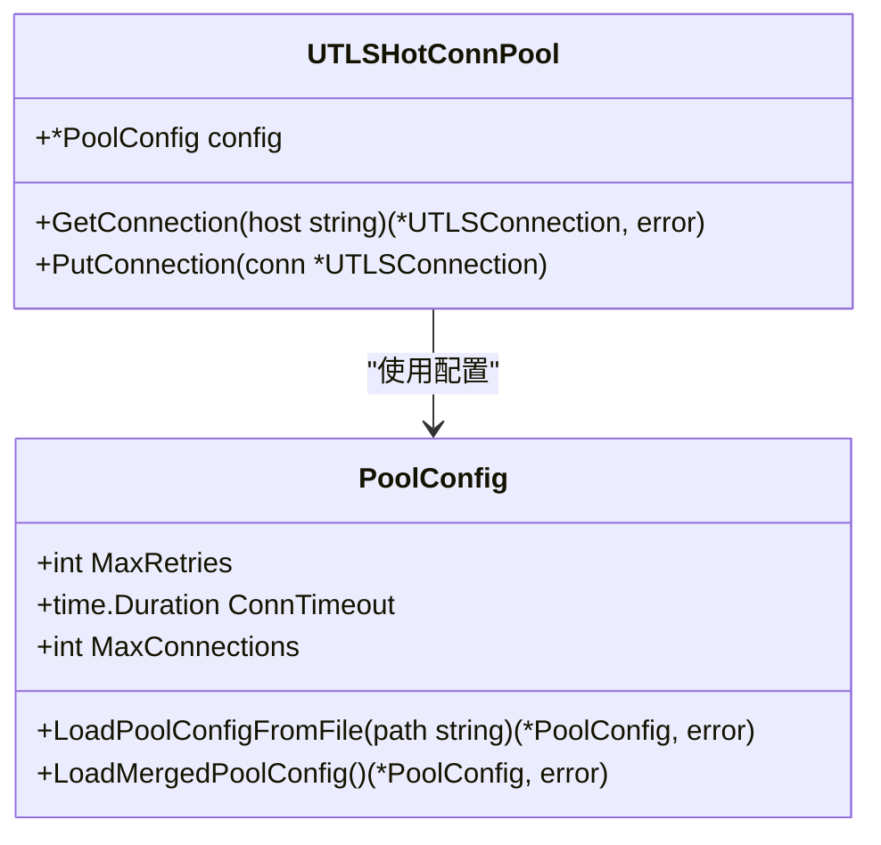
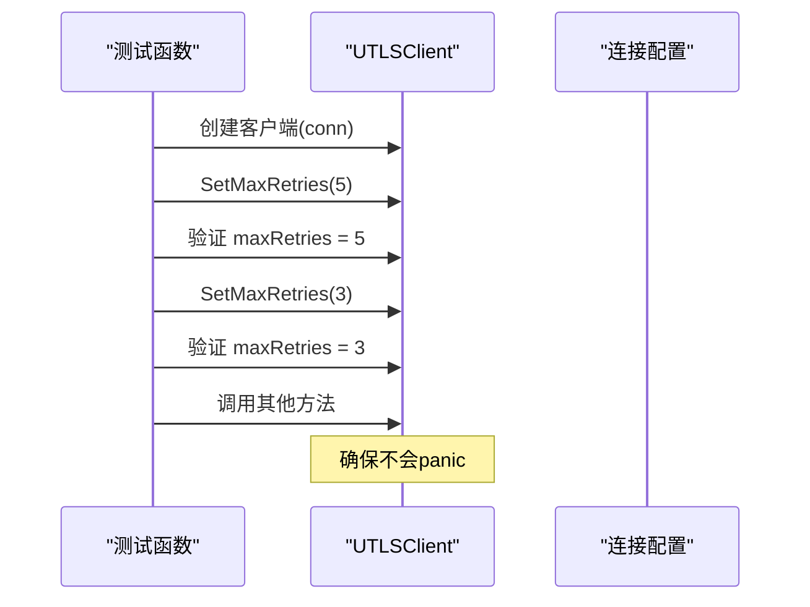
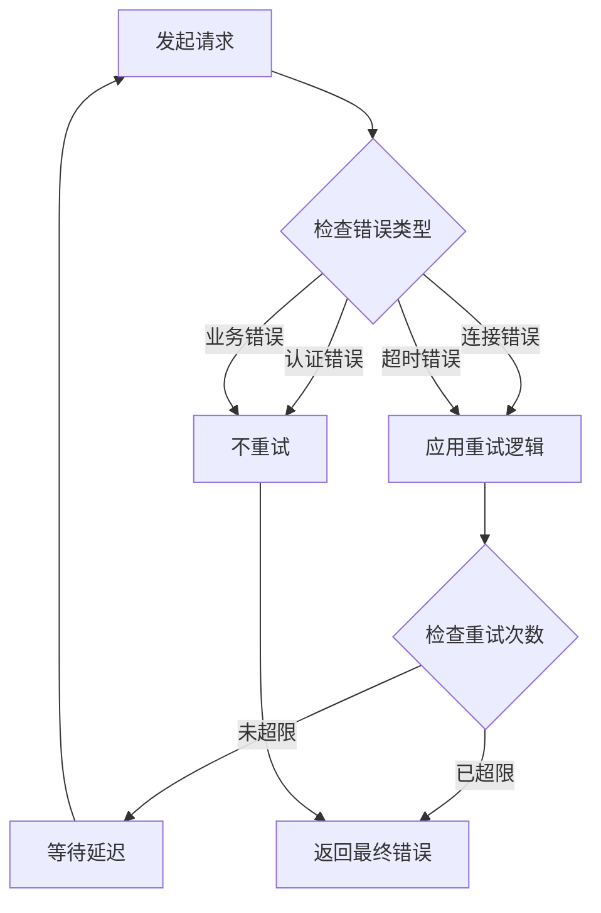

# 重试次数设置

<cite>
**本文档引用的文件**
- [utlsclient.go](file://utlsclient/utlsclient.go)
- [constants.go](file://utlsclient/constants.go)
- [utlshotconnpool.go](file://utlsclient/utlshotconnpool.go)
- [utlsclient_test.go](file://test/utlsclient/utlsclient_test.go)
- [constants_test.go](file://test/utlsclient/constants_test.go)
- [example_utlsclient_usage.go](file://examples/utlsclient/example_utlsclient_usage.go)
- [main.go](file://cmd/utlsclient/main.go)
</cite>

## 目录
1. [概述](#概述)
2. [SetMaxRetries方法详解](#setmaxretries方法详解)
3. [重试机制架构](#重试机制架构)
4. [指数退避策略](#指数退避策略)
5. [性能与可靠性权衡](#性能与可靠性权衡)
6. [配置与使用](#配置与使用)
7. [测试用例分析](#测试用例分析)
8. [最佳实践建议](#最佳实践建议)
9. [总结](#总结)

## 概述

SetMaxRetries方法是UTLSClient的核心重试控制机制，它通过设置maxRetries字段来控制HTTP请求失败后的自动重试行为。该方法直接影响Do方法中的for循环执行次数，其中尝试次数等于最大重试次数加一。

重试机制采用指数退避策略，初始延迟由DefaultRetryDelay常量定义，能够有效应对网络抖动和临时性故障，提高请求的成功率。

## SetMaxRetries方法详解

### 方法签名与实现

SetMaxRetries方法是一个简单的setter方法，用于设置UTLSClient的最大重试次数：



**图表来源**
- [utlsclient.go](file://utlsclient/utlsclient.go#L37-L52)
- [utlshotconnpool.go](file://utlsclient/utlshotconnpool.go#L170-L184)

### 默认值与初始化

UTLSClient在创建时具有以下默认配置：
- 默认最大重试次数：3次
- 默认超时时间：30秒
- 默认用户代理：从连接指纹获取

**章节来源**
- [utlsclient.go](file://utlsclient/utlsclient.go#L46-L52)

## 重试机制架构

### Do方法中的重试逻辑

Do方法实现了完整的重试逻辑，其核心结构如下：



**图表来源**
- [utlsclient.go](file://utlsclient/utlsclient.go#L104-L118)

### 重试条件判断

重试机制的关键在于对请求结果的判断。当doRequest返回非nil错误时，认为请求失败并触发重试：

**章节来源**
- [utlsclient.go](file://utlsclient/utlsclient.go#L104-L118)

## 指数退避策略

### 延迟计算公式

重试间隔采用指数退避策略，延迟时间计算公式为：
```
延迟时间 = i * DefaultRetryDelay
```

其中：
- `i` 是当前重试次数（从1开始）
- `DefaultRetryDelay` 是基础延迟时间，默认为1秒

### 延迟序列示例

| 重试次数 | 延迟时间 | 累计等待时间 |
|---------|---------|------------|
| 第1次 | 1秒 | 1秒 |
| 第2次 | 2秒 | 3秒 |
| 第3次 | 3秒 | 6秒 |
| 第4次 | 4秒 | 10秒 |

这种指数增长的策略能够有效减少网络拥塞，同时给系统恢复预留足够的时间。

**章节来源**
- [constants.go](file://utlsclient/constants.go#L40-L42)
- [utlsclient.go](file://utlsclient/utlsclient.go#L107-L108)

## 性能与可靠性权衡

### 成本分析

重试机制涉及以下性能成本：

1. **网络资源消耗**：每次重试都会产生额外的网络请求
2. **时间延迟**：重试间隔增加了整体响应时间
3. **服务器负载**：重复请求可能增加目标服务器压力

### 收益评估

重试机制带来的可靠性提升包括：

1. **网络抖动应对**：解决临时性网络不稳定问题
2. **服务器短暂故障**：应对目标服务器的临时性故障
3. **连接中断恢复**：在网络连接不稳定时提供恢复机会

### 权衡建议

| 场景类型 | 推荐重试次数 | 理由 |
|---------|-------------|------|
| 高可靠性要求 | 5-10次 | 关键业务，可接受较高延迟 |
| 平衡场景 | 3-5次 | 在可靠性和性能间取得平衡 |
| 高性能要求 | 1-2次 | 优先考虑响应速度 |
| 低可靠性容忍 | 0-1次 | 快速失败，快速重路由 |

## 配置与使用

### 通过PoolConfig配置

可以通过PoolConfig结构体统一配置重试参数：



**图表来源**
- [utlshotconnpool.go](file://utlsclient/utlshotconnpool.go#L170-L184)

### 动态配置示例

```go
// 创建连接池时设置重试次数
config := &PoolConfig{
    MaxRetries: 5,           // 设置最大重试次数
    ConnTimeout: 30*time.Second,
    // 其他配置...
}

pool := NewUTLSHotConnPool(config)
```

**章节来源**
- [utlshotconnpool.go](file://utlsclient/utlshotconnpool.go#L137-L168)

## 测试用例分析

### SetMaxRetries测试验证

测试用例验证了SetMaxRetries方法的基本功能：



**图表来源**
- [utlsclient_test.go](file://test/utlsclient/utlsclient_test.go#L46-L56)

### 常量测试验证

测试用例验证了重试相关常量的正确性：

**章节来源**
- [constants_test.go](file://test/utlsclient/constants_test.go#L40-L42)
- [utlsclient_test.go](file://test/utlsclient/utlsclient_test.go#L46-L56)

## 最佳实践建议

### 参数调优指南

1. **根据服务稳定性调整**
   - 对于稳定的内部服务：设置较低重试次数（1-2次）
   - 对于外部公共API：设置较高重试次数（3-5次）
   - 对于关键业务：设置最高重试次数（5-10次）

2. **考虑网络环境**
   - 内网环境：降低重试次数
   - 外网环境：适当增加重试次数
   - 移动网络：增加重试次数

3. **监控与调优**
   - 监控重试频率和成功率
   - 根据实际效果调整参数
   - 建立动态调整机制

### 错误处理建议



### 配置文件示例

```toml
[pool]
max_connections = 100
max_conns_per_host = 10
max_retries = 5
conn_timeout = 30
test_timeout = 10
```

**章节来源**
- [example_utlsclient_usage.go](file://examples/utlsclient/example_utlsclient_usage.go#L18-L25)
- [main.go](file://cmd/utlsclient/main.go#L63-L67)

## 总结

SetMaxRetries方法是UTLSClient重试机制的核心控制点，通过设置maxRetries字段来调节请求失败后的重试行为。该机制采用指数退避策略，能够在保证可靠性的同时最小化性能损失。

关键要点：
1. **简单易用**：SetMaxRetries方法提供了直观的重试次数控制
2. **灵活配置**：支持运行时动态调整和配置文件静态配置
3. **智能退避**：指数退避策略有效应对网络抖动
4. **性能平衡**：可根据具体场景调整重试策略

合理配置重试参数能够显著提高系统的稳定性和用户体验，特别是在面对不可靠网络环境时。建议根据具体的业务需求、网络环境和服务特性来确定最优的重试策略。