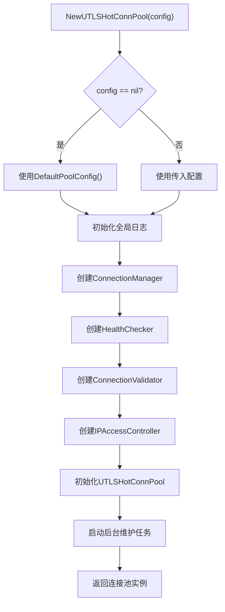
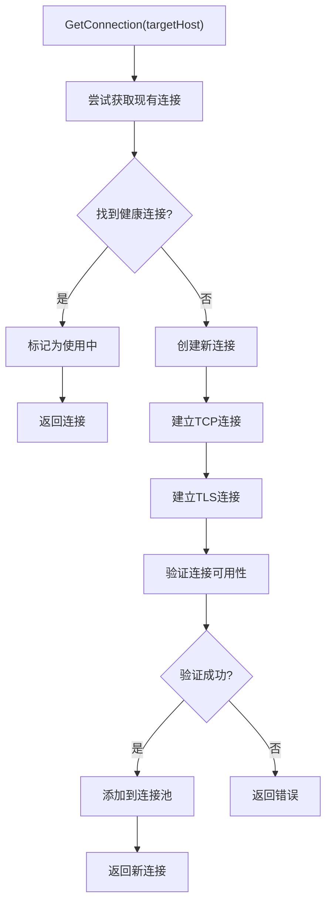
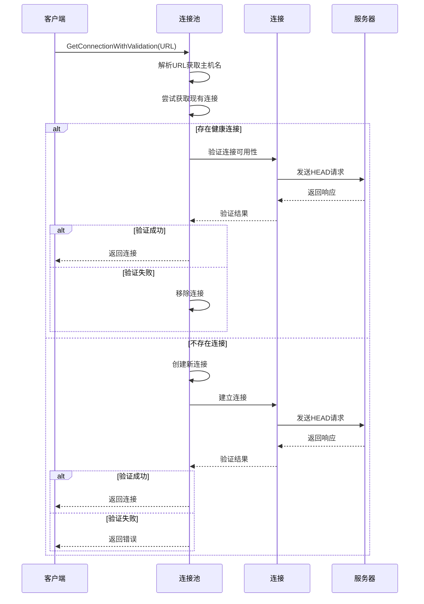
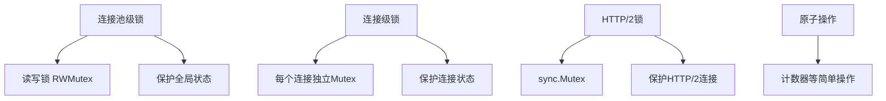
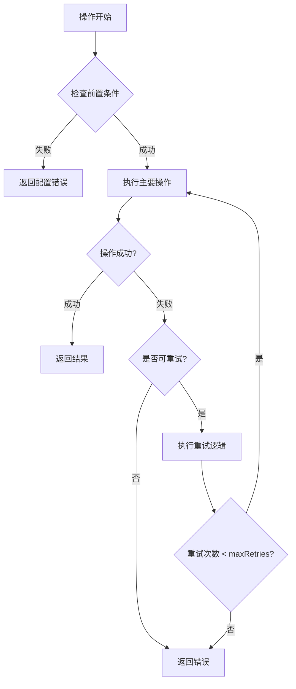

# UTLSHotConnPool API 详细文档

<cite>
**本文档引用的文件**
- [utlshotconnpool.go](file://utlsclient/utlshotconnpool.go)
- [interfaces.go](file://utlsclient/interfaces.go)
- [example_hotconnpool_usage.go](file://examples/utlsclient/example_hotconnpool_usage.go)
- [utlshotconnpool_public_test.go](file://test/utlsclient/utlshotconnpool_public_test.go)
- [utlshotconnpool_test.go](file://test/utlsclient/utlshotconnpool_test.go)
</cite>

## 目录
1. [概述](#概述)
2. [核心接口](#核心接口)
3. [连接池配置](#连接池配置)
4. [核心功能详解](#核心功能详解)
5. [API详细说明](#api详细说明)
6. [高级功能](#高级功能)
7. [性能特征](#性能特征)
8. [错误处理](#错误处理)
9. [使用示例](#使用示例)
10. [最佳实践](#最佳实践)

## 概述

UTLSHotConnPool 是一个高性能的uTLS热连接池管理系统，专为爬虫平台设计。该模块通过维护预建立的热连接、智能连接复用、动态黑白名单管理和自动健康检查，为后续的HTTP请求提供稳定、高效的连接基础。

### 核心特性

- **热连接管理**: 维护IP到uTLS连接的映射池
- **智能连接复用**: 支持多goroutine安全访问连接池
- **动态黑白名单**: 基于HTTP响应状态码自动分类IP
- **DNS热更新**: 定时获取域名的最新IP解析结果
- **TLS指纹模拟**: 支持多种主流浏览器的TLS指纹
- **健康检查**: 后台定期检查连接健康状态
- **并发安全**: 多级锁机制保证线程安全

## 核心接口

### HotConnPool 接口

HotConnPool 是连接池的主要接口，定义了所有核心操作：

```mermaid
classDiagram
class HotConnPool {
<<interface>>
+GetConnection(targetHost string) (*UTLSConnection, error)
+GetConnectionWithValidation(fullURL string) (*UTLSConnection, error)
+GetConnectionToIP(fullURL, targetIP string) (*UTLSConnection, error)
+PutConnection(conn *UTLSConnection)
+GetStats() PoolStats
+IsHealthy() bool
+Close() error
}
class UTLSHotConnPool {
-connManager *ConnectionManager
-healthChecker *HealthChecker
-validator *ConnectionValidator
-ipAccessCtrl *IPAccessController
-config PoolConfig
-fingerprintLib *Library
-ipPool IPPoolProvider
-stats PoolStats
-mu sync.RWMutex
-done chan struct{}
-wg sync.WaitGroup
}
HotConnPool <|-- UTLSHotConnPool : implements
```

**图表来源**
- [utlshotconnpool.go](file://utlsclient/utlshotconnpool.go#L24-L50)
- [utlshotconnpool.go](file://utlsclient/utlshotconnpool.go#L236-L257)

### UTLSConnection 接口

单个uTLS连接的包装器，提供连接的基本信息和操作：

```mermaid
classDiagram
class UTLSConnection {
-conn net.Conn
-tlsConn *utls.UConn
-targetIP string
-targetHost string
-fingerprint Profile
-acceptLanguage string
-h2ClientConn interface{}
-h2Mu sync.Mutex
-created time.Time
-lastUsed time.Time
-lastChecked time.Time
-inUse bool
-healthy bool
-requestCount int64
-errorCount int64
-mu sync.Mutex
-cond *sync.Cond
+TargetHost() string
+TargetIP() string
+Fingerprint() Profile
+AcceptLanguage() string
+Created() time.Time
+LastUsed() time.Time
+RequestCount() int64
+ErrorCount() int64
+IsHealthy() bool
+Stats() ConnectionStats
+Close() error
+RoundTripRaw(ctx context.Context, rawReq []byte) (io.Reader, error)
+WaitForAvailable(timeout time.Duration) error
}
```

**图表来源**
- [utlshotconnpool.go](file://utlsclient/utlshotconnpool.go#L204-L233)

**章节来源**
- [utlshotconnpool.go](file://utlsclient/utlshotconnpool.go#L24-L50)
- [utlshotconnpool.go](file://utlsclient/utlshotconnpool.go#L204-L233)

## 连接池配置

### PoolConfig 结构

连接池配置包含所有可配置参数：

| 参数 | 类型 | 默认值 | 描述 |
|------|------|--------|------|
| MaxConnections | int | 100 | 最大连接数 |
| MaxConnsPerHost | int | 10 | 每个主机最大连接数 |
| MaxIdleConns | int | 20 | 最大空闲连接数 |
| ConnTimeout | time.Duration | 30s | 连接超时 |
| IdleTimeout | time.Duration | 60s | 空闲超时 |
| MaxLifetime | time.Duration | 300s | 连接最大生命周期 |
| TestTimeout | time.Duration | 10s | 测试请求超时 |
| HealthCheckInterval | time.Duration | 30s | 健康检查间隔 |
| CleanupInterval | time.Duration | 60s | 清理间隔 |
| BlacklistCheckInterval | time.Duration | 300s | 黑名单检查间隔 |
| DNSUpdateInterval | time.Duration | 1800s | DNS更新间隔 |
| MaxRetries | int | 3 | 最大重试次数 |

### 默认配置

```go
func DefaultPoolConfig() *PoolConfig {
    return &PoolConfig{
        MaxConnections:         100,
        MaxConnsPerHost:        10,
        MaxIdleConns:           20,
        ConnTimeout:            30 * time.Second,
        IdleTimeout:            60 * time.Second,
        MaxLifetime:            300 * time.Second,
        TestTimeout:            10 * time.Second,
        HealthCheckInterval:    30 * time.Second,
        CleanupInterval:        60 * time.Second,
        BlacklistCheckInterval: 300 * time.Second,
        DNSUpdateInterval:      1800 * time.Second,
        MaxRetries:             3,
    }
}
```

**章节来源**
- [utlshotconnpool.go](file://utlsclient/utlshotconnpool.go#L170-L201)
- [utlshotconnpool.go](file://utlsclient/utlshotconnpool.go#L170-L183)

## 核心功能详解

### 连接池初始化

NewUTLSHotConnPool 函数负责创建新的热连接池：



**图表来源**
- [utlshotconnpool.go](file://utlsclient/utlshotconnpool.go#L291-L318)

### 连接获取机制

连接获取采用智能策略，优先复用现有连接：



**图表来源**
- [utlshotconnpool.go](file://utlsclient/utlshotconnpool.go#L351-L360)
- [utlshotconnpool.go](file://utlsclient/utlshotconnpool.go#L441-L480)

### 连接验证流程

连接验证确保连接的可用性和正确性：



**图表来源**
- [utlshotconnpool.go](file://utlsclient/utlshotconnpool.go#L362-L395)
- [utlshotconnpool.go](file://utlsclient/utlshotconnpool.go#L618-L744)

**章节来源**
- [utlshotconnpool.go](file://utlsclient/utlshotconnpool.go#L291-L318)
- [utlshotconnpool.go](file://utlsclient/utlshotconnpool.go#L351-L395)

## API详细说明

### NewUTLSHotConnPool

**函数签名**
```go
func NewUTLSHotConnPool(config *PoolConfig) *UTLSHotConnPool
```

**参数**
- `config`: 连接池配置，如果为nil则使用默认配置

**返回值**
- `*UTLSHotConnPool`: 新创建的连接池实例

**功能描述**
创建新的热连接池实例，初始化所有核心组件并启动后台维护任务。

**时间复杂度**: O(1)
**并发安全性**: 安全，但需要确保配置正确

**章节来源**
- [utlshotconnpool.go](file://utlsclient/utlshotconnpool.go#L291-L318)

### GetConnection

**函数签名**
```go
func (p *UTLSHotConnPool) GetConnection(targetHost string) (*UTLSConnection, error)
```

**参数**
- `targetHost`: 目标主机域名

**返回值**
- `*UTLSConnection`: 获取到的热连接对象
- `error`: 错误信息

**功能描述**
获取到目标主机的热连接，优先从连接池中获取现有连接，如果没有可用连接则创建新的热连接。

**使用场景**
- 一般用途的HTTP请求
- 不需要验证特定路径可用性的场景

**时间复杂度**: O(n)，其中n为连接池中该主机的连接数
**并发安全性**: 完全安全，使用多级锁机制

**章节来源**
- [utlshotconnpool.go](file://utlsclient/utlshotconnpool.go#L351-L360)

### GetConnectionWithValidation

**函数签名**
```go
func (p *UTLSHotConnPool) GetConnectionWithValidation(fullURL string) (*UTLSConnection, error)
```

**参数**
- `fullURL`: 完整的URL (https://domain/path)

**返回值**
- `*UTLSConnection`: 获取到的热连接对象
- `error`: 错误信息

**功能描述**
获取热连接并验证指定路径的可用性，确保连接能够正确访问目标路径。

**使用场景**
- 需要确保连接能够访问特定API端点的场景
- 验证连接的完整性和可用性

**时间复杂度**: O(n)，其中n为连接池中该主机的连接数
**并发安全性**: 安全，但验证过程可能增加额外开销

**章节来源**
- [utlshotconnpool.go](file://utlsclient/utlshotconnpool.go#L362-L395)

### GetConnectionToIP

**函数签名**
```go
func (p *UTLSHotConnPool) GetConnectionToIP(fullURL, targetIP string) (*UTLSConnection, error)
```

**参数**
- `fullURL`: 完整的URL
- `targetIP`: 目标IP地址

**返回值**
- `*UTLSConnection`: 获取到的热连接对象
- `error`: 错误信息

**功能描述**
获取到指定IP的连接，主要用于IP池测试和特殊场景下的连接管理。

**使用场景**
- IP池测试和验证
- 特殊网络环境下的连接管理
- 故障排查和调试

**时间复杂度**: O(n)，其中n为连接池中该主机的连接数
**并发安全性**: 安全

**章节来源**
- [utlshotconnpool.go](file://utlsclient/utlshotconnpool.go#L398-L438)

### PutConnection

**函数签名**
```go
func (p *UTLSHotConnPool) PutConnection(conn *UTLSConnection)
```

**参数**
- `conn`: 要归还的连接

**功能描述**
将连接归还到连接池中，更新连接状态并唤醒等待的goroutine。

**使用场景**
- HTTP请求完成后归还连接
- 连接不再需要时的清理操作

**时间复杂度**: O(1)
**并发安全性**: 安全，使用连接级锁

**章节来源**
- [utlshotconnpool.go](file://utlsclient/utlshotconnpool.go#L760-L784)

### GetStats

**函数签名**
```go
func (p *UTLSHotConnPool) GetStats() PoolStats
```

**返回值**
- `PoolStats`: 连接池统计信息

**功能描述**
获取连接池的详细统计信息，包括连接数量、健康状态、成功率等指标。

**返回的数据结构**:

| 字段 | 类型 | 描述 |
|------|------|------|
| TotalConnections | int | 总连接数 |
| ActiveConnections | int | 活跃连接数 |
| IdleConnections | int | 空闲连接数 |
| HealthyConnections | int | 健康连接数 |
| WhitelistIPs | int | 白名单IP数 |
| BlacklistIPs | int | 黑名单IP数 |
| TotalRequests | int64 | 总请求数 |
| SuccessfulRequests | int64 | 成功请求数 |
| FailedRequests | int64 | 失败请求数 |
| SuccessRate | float64 | 成功率 |
| AvgResponseTime | time.Duration | 平均响应时间 |
| ConnReuseRate | float64 | 连接复用率 |
| WhitelistMoves | int64 | 黑名单移到白名单数量 |
| NewConnectionsFromDNS | int64 | DNS更新新增连接数 |
| LastUpdateTime | time.Time | 最后更新时间 |

**使用场景**
- 监控连接池状态
- 性能分析和优化
- 故障诊断和调试

**时间复杂度**: O(n)，其中n为连接池中的连接数
**并发安全性**: 安全，使用读写锁

**章节来源**
- [utlshotconnpool.go](file://utlsclient/utlshotconnpool.go#L1122-L1173)

### IsHealthy

**函数签名**
```go
func (p *UTLSHotConnPool) IsHealthy() bool
```

**返回值**
- `bool`: 连接池是否健康

**功能描述**
检查连接池的整体健康状态，基于连接数量、健康连接数和成功率等指标。

**健康检查标准**:
- 总连接数 > 0
- 健康连接数 > 0  
- 成功率 >= 最小成功率阈值

**使用场景**
- 连接池状态监控
- 业务决策依据
- 故障预警

**时间复杂度**: O(1)
**并发安全性**: 安全

**章节来源**
- [utlshotconnpool.go](file://utlsclient/utlshotconnpool.go#L1377-L1383)

### Close

**函数签名**
```go
func (p *UTLSHotConnPool) Close() error
```

**返回值**
- `error`: 错误信息

**功能描述**
优雅关闭连接池，停止所有后台维护任务并关闭所有连接。

**关闭流程**:
1. 关闭done通道
2. 等待所有后台任务完成
3. 关闭ConnectionManager
4. 清理所有连接资源

**使用场景**
- 应用程序退出时的资源清理
- 连接池的生命周期管理

**时间复杂度**: O(n)，其中n为连接池中的连接数
**并发安全性**: 安全，但关闭后不能再使用连接池

**章节来源**
- [utlshotconnpool.go](file://utlsclient/utlshotconnpool.go#L1176-L1184)

## 高级功能

### PreWarmConnections

**函数签名**
```go
func (p *UTLSHotConnPool) PreWarmConnections(host string, count int) error
```

**参数**
- `host`: 目标域名
- `count`: 预热连接数量

**返回值**
- `error`: 错误信息

**功能描述**
预热连接到指定域名，提前建立指定数量的连接以减少首次请求的延迟。

**使用场景**
- 预期会有大量请求的场景
- 关键业务的性能优化
- 缓存预热

**实现原理**:
1. 创建指定数量的连接
2. 验证所有连接的有效性
3. 将连接标记为空闲状态

**时间复杂度**: O(count × n)，其中n为连接建立的时间复杂度
**并发安全性**: 安全

**章节来源**
- [utlshotconnpool.go](file://utlsclient/utlshotconnpool.go#L1396-L1421)

### UpdateConfig

**函数签名**
```go
func (p *UTLSHotConnPool) UpdateConfig(newConfig *PoolConfig)
```

**参数**
- `newConfig`: 新的配置

**功能描述**
动态更新连接池配置，在运行时调整连接池的行为参数。

**使用场景**
- 运行时性能调优
- 动态资源配置
- A/B测试支持

**注意事项**:
- 配置更新不会影响正在使用的连接
- 新的配置仅影响后续的操作
- 需要确保新配置的有效性

**时间复杂度**: O(1)
**并发安全性**: 安全，使用互斥锁保护

**章节来源**
- [utlshotconnpool.go](file://utlsclient/utlshotconnpool.go#L1424-L1429)

### GetConnectionInfo

**函数签名**
```go
func (p *UTLSHotConnPool) GetConnectionInfo(ip string) map[string]interface{}
```

**参数**
- `ip`: 目标IP地址

**返回值**
- `map[string]interface{}`: 连接详细信息

**功能描述**
获取指定连接的详细信息，包括连接状态、统计数据、指纹信息等。

**返回的信息**:
- `target_ip`: 目标IP
- `target_host`: 目标主机
- `created`: 创建时间
- `last_used`: 最后使用时间
- `last_checked`: 最后检查时间
- `in_use`: 是否正在使用
- `healthy`: 健康状态
- `request_count`: 请求次数
- `error_count`: 错误次数
- `fingerprint`: 使用的TLS指纹名称

**使用场景**
- 连接状态监控
- 故障排查
- 详细统计分析

**时间复杂度**: O(1)
**并发安全性**: 安全

**章节来源**
- [utlshotconnpool.go](file://utlsclient/utlshotconnpool.go#L1432-L1453)

### ForceCleanup

**函数签名**
```go
func (p *UTLSHotConnPool) ForceCleanup()
```

**功能描述**
强制清理所有连接，无论连接的状态如何。

**使用场景**
- 内存压力过大时的紧急清理
- 连接池状态异常时的重置
- 调试和测试环境的快速清理

**时间复杂度**: O(n)，其中n为连接池中的连接数
**并发安全性**: 安全

**章节来源**
- [utlshotconnpool.go](file://utlsclient/utlshotconnpool.go#L1385-L1393)

## 性能特征

### 时间复杂度分析

| 操作 | 时间复杂度 | 说明 |
|------|------------|------|
| GetConnection | O(n) | n为连接池中该主机的连接数 |
| GetConnectionWithValidation | O(n) | 包含额外的验证开销 |
| PutConnection | O(1) | 常数时间操作 |
| GetStats | O(n) | 需要遍历所有连接 |
| IsHealthy | O(1) | 常数时间检查 |
| Close | O(n) | 需要关闭所有连接 |
| PreWarmConnections | O(m×n) | m为预热数量，n为连接建立时间 |
| UpdateConfig | O(1) | 常数时间配置更新 |

### 并发安全性

连接池采用多级锁机制确保并发安全：



**图表来源**
- [utlshotconnpool.go](file://utlsclient/utlshotconnpool.go#L236-L257)

### 内存使用

- **连接池内存**: 基于MaxConnections参数，每个连接约占用几KB内存
- **统计信息内存**: PoolStats结构体占用固定内存
- **后台任务内存**: 每个后台任务占用少量内存

### 性能优化策略

1. **连接复用**: 最大化连接复用率减少握手开销
2. **预热机制**: 提前建立连接减少首次请求延迟
3. **智能选择**: 优先选择空闲的健康连接
4. **批量操作**: 后台任务批量处理维护操作

**章节来源**
- [utlshotconnpool.go](file://utlsclient/utlshotconnpool.go#L351-L395)
- [utlshotconnpool.go](file://utlsclient/utlshotconnpool.go#L1122-L1173)

## 错误处理

### 常见错误类型

| 错误类型 | 描述 | 处理建议 |
|----------|------|----------|
| 连接超时 | TCP或TLS握手超时 | 增加超时时间或检查网络 |
| 连接失败 | 无法建立TCP连接 | 检查目标IP可达性 |
| 验证失败 | 连接验证不通过 | 检查目标服务状态 |
| 配置错误 | 配置参数无效 | 验证配置参数范围 |
| 资源不足 | 连接数达到上限 | 增加MaxConnections或优化使用 |
| 黑名单限制 | IP被加入黑名单 | 检查IP使用频率和合法性 |

### 错误处理策略



### 错误恢复机制

1. **自动重试**: 对于临时性错误自动重试
2. **连接替换**: 失效连接自动替换为新的连接
3. **黑名单管理**: 自动管理IP黑白名单
4. **健康检查**: 定期检查和恢复连接

**章节来源**
- [utlshotconnpool.go](file://utlsclient/utlshotconnpool.go#L618-L744)
- [utlshotconnpool.go](file://utlsclient/utlshotconnpool.go#L1396-L1421)

## 使用示例

### 基本使用示例

```go
// 创建连接池
config := utlsclient.DefaultPoolConfig()
config.MaxConnections = 50
pool := utlsclient.NewUTLSHotConnPool(config)

// 设置依赖模块（可选）
pool.SetDependencies(fingerprintLib, ipPool, accessControl)

// 获取连接
conn, err := pool.GetConnection("example.com")
if err != nil {
    log.Fatalf("获取连接失败: %v", err)
}

// 使用连接发送HTTP请求
client := utlsclient.NewUTLSClient(conn)
resp, err := client.Get("https://example.com/api")
if err != nil {
    log.Fatalf("请求失败: %v", err)
}
defer resp.Body.Close()

// 归还连接
pool.PutConnection(conn)

// 获取统计信息
stats := pool.GetStats()
fmt.Printf("连接池统计: 总连接数=%d, 健康连接数=%d\n", 
           stats.TotalConnections, stats.HealthyConnections)
```

### 带路径验证的使用示例

```go
// 获取带验证的连接
conn, err := pool.GetConnectionWithValidation("https://api.example.com/specific/path")
if err != nil {
    log.Fatalf("获取验证连接失败: %v", err)
}

// 连接已经验证过指定路径，可以直接使用
client := utlsclient.NewUTLSClient(conn)
resp, err := client.Get("https://api.example.com/specific/path")
if err != nil {
    log.Fatalf("验证路径请求失败: %v", err)
}
defer resp.Body.Close()

// 归还连接
pool.PutConnection(conn)
```

### 预热连接示例

```go
// 预热连接到目标域名
err := pool.PreWarmConnections("target-site.com", 10)
if err != nil {
    log.Printf("预热失败: %v", err)
}

// 预热后连接池会有10个可用连接
stats := pool.GetStats()
log.Printf("预热后连接数: %d", stats.IdleConnections)
```

### 监控和健康检查示例

```go
// 定期检查连接池健康状态
go func() {
    ticker := time.NewTicker(30 * time.Second)
    defer ticker.Stop()
    
    for range ticker.C {
        if !pool.IsHealthy() {
            log.Printf("连接池状态异常")
            stats := pool.GetStats()
            log.Printf("统计信息: %+v", stats)
        }
    }
}()

// 获取连接详细信息
info := pool.GetConnectionInfo("192.168.1.1")
if info != nil {
    log.Printf("连接信息: %v", info)
}
```

**章节来源**
- [example_hotconnpool_usage.go](file://examples/utlsclient/example_hotconnpool_usage.go#L18-L134)
- [example_hotconnpool_usage.go](file://examples/utlsclient/example_hotconnpool_usage.go#L137-L150)

## 最佳实践

### 配置优化

1. **合理设置连接数**
   ```go
   config := utlsclient.DefaultPoolConfig()
   config.MaxConnections = runtime.NumCPU() * 10  // 根据CPU核心数调整
   config.MaxConnsPerHost = 5                     // 控制单主机连接数
   ```

2. **超时参数调优**
   ```go
   config.ConnTimeout = 10 * time.Second          // 连接超时
   config.TestTimeout = 5 * time.Second           // 测试超时
   config.IdleTimeout = 30 * time.Second          // 空闲超时
   ```

3. **检查间隔优化**
   ```go
   config.HealthCheckInterval = 15 * time.Second  // 健康检查间隔
   config.CleanupInterval = 30 * time.Second      // 清理间隔
   ```

### 使用模式

1. **连接池生命周期管理**
   ```go
   pool := utlsclient.NewUTLSHotConnPool(config)
   defer pool.Close()  // 确保连接池正确关闭
   ```

2. **连接获取和归还**
   ```go
   conn, err := pool.GetConnection(host)
   if err != nil {
       return err
   }
   defer pool.PutConnection(conn)  // 确保连接归还
   ```

3. **健康检查集成**
   ```go
   if !pool.IsHealthy() {
       // 处理连接池不健康的情况
       return fmt.Errorf("连接池不健康")
   }
   ```

### 性能监控

1. **关键指标监控**
   ```go
   stats := pool.GetStats()
   log.Printf("连接池性能指标:")
   log.Printf("- 连接命中率: %.2f%%", float64(stats.ActiveConnections)/float64(stats.TotalConnections)*100)
   log.Printf("- 成功率: %.2f%%", stats.SuccessRate*100)
   log.Printf("- 平均响应时间: %v", stats.AvgResponseTime)
   ```

2. **异常处理**
   ```go
   if stats.FailedRequests > stats.TotalRequests * 0.1 {
       log.Printf("失败率过高，需要检查")
   }
   ```

### 错误处理

1. **重试机制**
   ```go
   const maxRetries = 3
   for i := 0; i < maxRetries; i++ {
       conn, err := pool.GetConnection(host)
       if err == nil {
           break
       }
       log.Printf("获取连接失败，重试 %d/%d", i+1, maxRetries)
       time.Sleep(time.Duration(i+1) * time.Second)
   }
   ```

2. **优雅降级**
   ```go
   if !pool.IsHealthy() {
       // 连接池不可用时使用备用方案
       return fallbackRequest()
   }
   ```

### 安全考虑

1. **IP白名单管理**
   ```go
   whitelist := pool.GetWhitelist()
   // 定期检查和更新白名单
   ```

2. **黑名单监控**
   ```go
   blacklist := pool.GetBlacklist()
   if len(blacklist) > 0 {
       log.Printf("发现黑名单IP: %v", blacklist)
   }
   ```

**章节来源**
- [example_hotconnpool_usage.go](file://examples/utlsclient/example_hotconnpool_usage.go#L137-L277)
- [utlshotconnpool_public_test.go](file://test/utlsclient/utlshotconnpool_public_test.go#L9-L79)