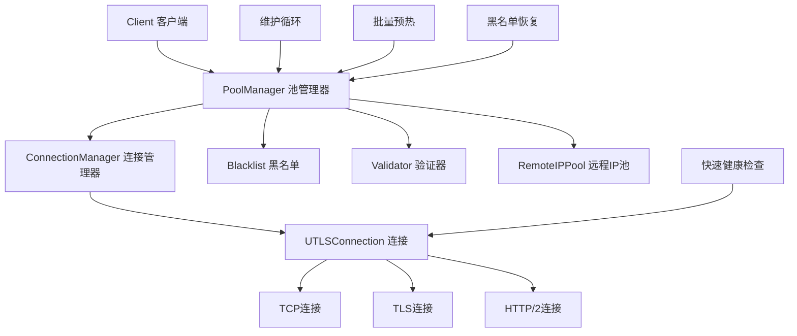
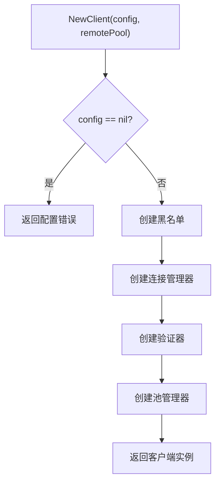
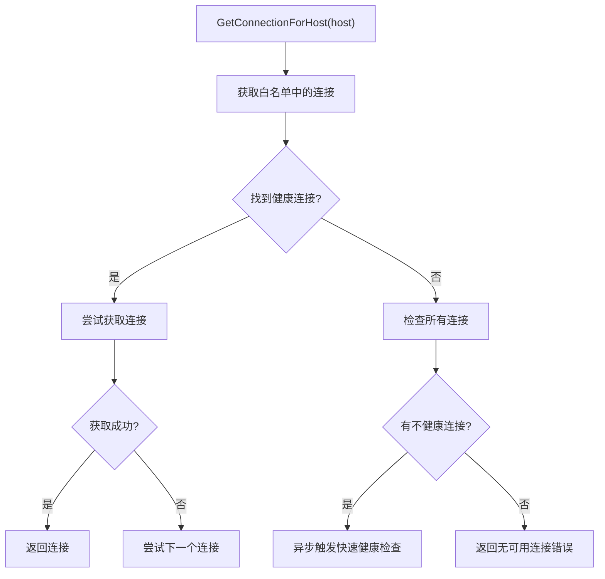
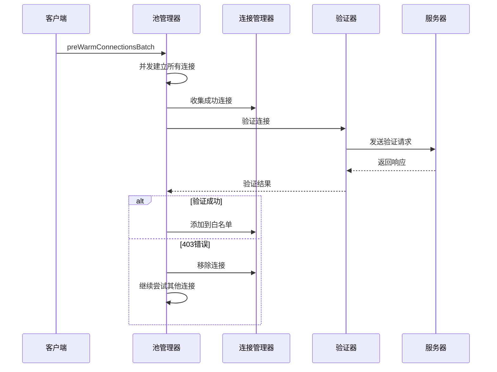
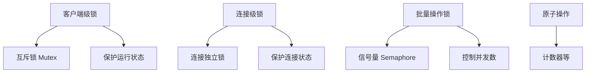
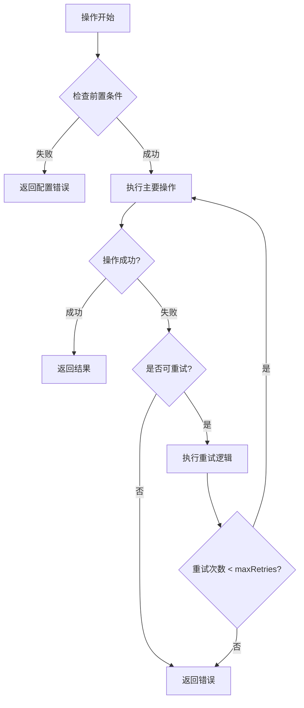

# UTLSHotConnPool API 详细文档

<cite>
**本文档引用的文件**
- [utlshotconnpool.go](file://utlsclient/utlshotconnpool.go)
- [connection_manager.go](file://utlsclient/connection_manager.go)
- [pool_manager.go](file://utlsclient/pool_manager.go)
- [utlsclient.go](file://utlsclient/utlsclient.go)
- [validator.go](file://utlsclient/validator.go)
- [errors.go](file://utlsclient/errors.go)
- [whitelist.go](file://utlsclient/whitelist.go)
</cite>

## 目录
1. [概述](#概述)
2. [核心架构](#核心架构)
3. [连接池配置](#连接池配置)
4. [核心功能详解](#核心功能详解)
5. [API详细说明](#api详细说明)
6. [高级功能](#高级功能)
7. [性能特征](#性能特征)
8. [错误处理](#错误处理)
9. [使用示例](#使用示例)
10. [最佳实践](#最佳实践)

## 概述

UTLSHotConnPool 是一个基于全新架构的高性能uTLS热连接池管理系统，专为爬虫平台设计。该模块通过采用主动式连接池管理、智能连接复用、动态黑白名单管理和自动健康检查，为后续的HTTP请求提供稳定、高效的连接基础。

### 核心特性

- **主动式连接池管理**: 通过PoolManager主动维护连接池，而非被动等待
- **智能连接复用**: 支持多goroutine安全访问连接池
- **动态黑白名单**: 基于HTTP响应状态码自动分类IP
- **批量预热机制**: 支持批量建立和验证连接
- **快速健康检查**: 支持异步快速恢复不活跃连接
- **本地IP池支持**: 支持绑定本地源IP地址进行连接
- **并发安全**: 多级锁机制保证线程安全

## 核心架构

### 新架构概览


```mermaid
graph TB
A[Client 客户端] --> B[PoolManager 池管理器]
B --> C[ConnectionManager 连接管理器]
B --> D[Blacklist 黑名单]
B --> E[Validator 验证器]
B --> F[RemoteIPPool 远程IP池]
C --> G[UTLSConnection 连接]
G --> H[TCP连接]
G --> I[TLS连接]
G --> J[HTTP/2连接]
K[维护循环] --> B
L[快速健康检查] --> G
M[批量预热] --> B
N[黑名单恢复] --> B
```

**图表来源**
- [utlsclient.go:14-25](file://utlsclient/utlsclient.go#L14-L25)
- [pool_manager.go:21-34](file://utlsclient/pool_manager.go#L21-L34)

### 组件职责

- **Client**: 客户端入口，协调所有组件
- **PoolManager**: 主动连接池管理器，负责连接的生命周期
- **ConnectionManager**: 连接管理器，维护白名单和连接映射
- **Validator**: 连接验证器，验证连接的有效性
- **Blacklist**: 黑名单管理器，管理被封禁的IP
- **RemoteIPPool**: 远程IP池提供者，提供域名-IP映射

**章节来源**
- [utlsclient.go:14-25](file://utlsclient/utlsclient.go#L14-L25)
- [pool_manager.go:21-34](file://utlsclient/pool_manager.go#L21-L34)

## 连接池配置

### PoolConfig 结构

连接池配置包含所有可配置参数：

| 参数 | 类型 | 默认值 | 描述 |
|------|------|--------|------|
| MaxConnsPerHost | int | 10 | 每个主机最大连接数 |
| PreWarmInterval | time.Duration | 300s | 预热间隔 |
| MaxConcurrentPreWarms | int | 10 | 最大并发预热数 |
| ConnTimeout | time.Duration | 30s | 连接超时 |
| IdleTimeout | time.Duration | 60s | 空闲超时 |
| MaxConnLifetime | time.Duration | 300s | 连接最大生命周期 |
| HealthCheckInterval | time.Duration | 300s | 健康检查间隔 |
| IPBlacklistTimeout | time.Duration | 3600s | IP黑名单超时 |
| BlacklistCheckInterval | time.Duration | 300s | 黑名单检查间隔 |
| HealthCheckPath | string | "/rt/earth/PlanetoidMetadata" | 健康检查路径 |
| SessionIdPath | string | "" | 获取SessionID的路径 |
| SessionIdBody | []byte | nil | 获取SessionID的请求体 |

### 默认配置

```go
func DefaultPoolConfig() *PoolConfig {
    return &PoolConfig{
        MaxConnsPerHost:        10,
        PreWarmInterval:        300 * time.Second,
        MaxConcurrentPreWarms:  10,
        ConnTimeout:            30 * time.Second,
        IdleTimeout:            60 * time.Second,
        MaxConnLifetime:        300 * time.Second,
        HealthCheckInterval:    300 * time.Second,
        IPBlacklistTimeout:     3600 * time.Second,
        BlacklistCheckInterval: 300 * time.Second,
        HealthCheckPath:        "/rt/earth/PlanetoidMetadata",
        SessionIdPath:          "",
        SessionIdBody:          nil,
    }
}
```

**章节来源**
- [utlshotconnpool.go:590-609](file://utlsclient/utlshotconnpool.go#L590-L609)
- [utlsclient.go:28-55](file://utlsclient/utlsclient.go#L28-L55)

## 核心功能详解

### 连接池初始化

NewClient 函数负责创建新的客户端实例：


```mermaid
flowchart TD
A["NewClient(config, remotePool)"] --> B{"config == nil?"}
B --> |是| C["返回配置错误"]
B --> |否| D["创建黑名单"]
D --> E["创建连接管理器"]
E --> F["创建验证器"]
F --> G["创建池管理器"]
G --> H["返回客户端实例"]
```

**图表来源**
- [utlsclient.go:27-55](file://utlsclient/utlsclient.go#L27-L55)

### 连接获取机制

GetConnectionForHost 采用智能策略，优先复用现有连接：


```mermaid
flowchart TD
A["GetConnectionForHost(host)"] --> B["获取白名单中的连接"]
B --> C{"找到健康连接?"}
C --> |是| D["尝试获取连接"]
D --> E{"获取成功?"}
E --> |是| F["返回连接"]
E --> |否| G["尝试下一个连接"]
C --> |否| H["检查所有连接"]
H --> I{"有不健康连接?"}
I --> |是| J["异步触发快速健康检查"]
I --> |否| K["返回无可用连接错误"]
```

**图表来源**
- [utlsclient.go:93-144](file://utlsclient/utlsclient.go#L93-L144)

### 连接验证流程

连接验证采用批量验证策略，提高效率：


```mermaid
sequenceDiagram
participant Client as 客户端
participant PM as 池管理器
participant CM as 连接管理器
participant V as 验证器
participant S as 服务器
Client->>PM : preWarmConnectionsBatch
PM->>PM : 并发建立所有连接
PM->>CM : 收集成功连接
PM->>V : 验证连接
V->>S : 发送验证请求
S-->>V : 返回响应
V-->>PM : 验证结果
alt 验证成功
PM->>CM : 添加到白名单
else 403错误
PM->>CM : 移除连接
PM->>PM : 继续尝试其他连接
end
```

**图表来源**
- [pool_manager.go:252-477](file://utlsclient/pool_manager.go#L252-L477)
- [validator.go:51-142](file://utlsclient/validator.go#L51-L142)

**章节来源**
- [utlsclient.go:27-55](file://utlsclient/utlsclient.go#L27-L55)
- [pool_manager.go:252-477](file://utlsclient/pool_manager.go#L252-L477)

## API详细说明

### NewClient

**函数签名**
```go
func NewClient(config *PoolConfig, remotePool RemoteIPPool) (*Client, error)
```

**参数**
- `config`: 连接池配置
- `remotePool`: 远程IP池提供者

**返回值**
- `*Client`: 新创建的客户端实例
- `error`: 错误信息

**功能描述**
创建新的UTLS客户端实例，初始化所有核心组件并注入依赖。

**时间复杂度**: O(1)
**并发安全性**: 安全

**章节来源**
- [utlsclient.go:27-55](file://utlsclient/utlsclient.go#L27-L55)

### Start

**函数签名**
```go
func (c *Client) Start()
```

**功能描述**
启动所有后台服务，包括池管理器、维护循环和健康检查。

**时间复杂度**: O(1)
**并发安全性**: 安全

**章节来源**
- [utlsclient.go:57-74](file://utlsclient/utlsclient.go#L57-L74)

### Stop

**函数签名**
```go
func (c *Client) Stop()
```

**功能描述**
优雅停止所有后台任务，关闭连接池并清理资源。

**时间复杂度**: O(n)，n为连接数
**并发安全性**: 安全

**章节来源**
- [utlsclient.go:76-91](file://utlsclient/utlsclient.go#L76-L91)

### GetConnectionForHost

**函数签名**
```go
func (c *Client) GetConnectionForHost(host string) (*UTLSConnection, error)
```

**参数**
- `host`: 目标主机名

**返回值**
- `*UTLSConnection`: 获取到的热连接对象
- `error`: 错误信息

**功能描述**
从白名单中获取一个健康的连接，支持随机选择和快速健康检查。

**使用场景**
- 一般用途的HTTP请求
- 需要连接复用的场景

**时间复杂度**: O(n)，n为健康连接数
**并发安全性**: 安全

**章节来源**
- [utlsclient.go:93-144](file://utlsclient/utlsclient.go#L93-L144)

### ReleaseConnection

**函数签名**
```go
func (c *Client) ReleaseConnection(conn *UTLSConnection)
```

**参数**
- `conn`: 要归还的连接

**功能描述**
将使用完毕的连接归还给客户端，支持快速健康检查恢复。

**时间复杂度**: O(1)
**并发安全性**: 安全

**章节来源**
- [utlsclient.go:146-206](file://utlsclient/utlsclient.go#L146-L206)

### GetConnectionForIP

**函数签名**
```go
func (c *Client) GetConnectionForIP(ip string) (*UTLSConnection, error)
```

**参数**
- `ip`: 目标IP地址

**返回值**
- `*UTLSConnection`: 获取到的连接对象
- `error`: 错误信息

**功能描述**
根据IP地址获取连接，主要用于特殊场景下的连接管理。

**时间复杂度**: O(1)
**并发安全性**: 安全

**章节来源**
- [utlsclient.go:206-237](file://utlsclient/utlsclient.go#L206-L237)

### GetStats

**函数签名**
```go
func (c *Client) GetStats() map[string]interface{}
```

**返回值**
- `map[string]interface{}`: 客户端统计信息

**功能描述**
获取客户端的详细统计信息，包括连接数量、健康状态等。

**返回的数据结构**:
- `total_connections`: 总连接数
- `healthy_connections`: 健康连接数
- `blacklist_size`: 黑名单大小
- `whitelist_size`: 白名单大小
- `active_requests`: 活跃请求数

**时间复杂度**: O(n)，n为连接数
**并发安全性**: 安全

**章节来源**
- [utlsclient.go:206-237](file://utlsclient/utlsclient.go#L206-L237)

## 高级功能

### PreWarmConnections

**函数签名**
```go
func (c *Client) PreWarmConnections(host string, count int) error
```

**参数**
- `host`: 目标主机名
- `count`: 预热连接数量

**功能描述**
预热连接到指定主机，提前建立指定数量的连接。

**实现原理**:
1. 并发建立所有连接
2. 批量验证获取SessionID
3. 将连接添加到白名单

**时间复杂度**: O(count × n)，n为连接建立时间
**并发安全性**: 安全

**章节来源**
- [pool_manager.go:252-477](file://utlsclient/pool_manager.go#L252-L477)

### UpdateConfig

**函数签名**
```go
func (c *Client) UpdateConfig(newConfig *PoolConfig)
```

**参数**
- `newConfig`: 新的配置

**功能描述**
动态更新客户端配置，支持运行时调整参数。

**时间复杂度**: O(1)
**并发安全性**: 安全

**章节来源**
- [utlsclient.go:206-237](file://utlsclient/utlsclient.go#L206-L237)

### GetConnectionInfo

**函数签名**
```go
func (c *Client) GetConnectionInfo(ip string) map[string]interface{}
```

**参数**
- `ip`: 目标IP地址

**返回值**
- `map[string]interface{}`: 连接详细信息

**功能描述**
获取指定连接的详细信息，包括连接状态、统计数据等。

**返回的信息**:
- `target_ip`: 目标IP
- `target_host`: 目标主机
- `local_ip`: 本地IP
- `healthy`: 健康状态
- `request_count`: 请求次数
- `error_count`: 错误次数

**时间复杂度**: O(1)
**并发安全性**: 安全

**章节来源**
- [utlsclient.go:206-237](file://utlsclient/utlsclient.go#L206-L237)

### ForceCleanup

**函数签名**
```go
func (c *Client) ForceCleanup()
```

**功能描述**
强制清理所有连接，无论连接状态如何。

**时间复杂度**: O(n)，n为连接数
**并发安全性**: 安全

**章节来源**
- [utlsclient.go:206-237](file://utlsclient/utlsclient.go#L206-L237)

## 性能特征

### 时间复杂度分析

| 操作 | 时间复杂度 | 说明 |
|------|------------|------|
| GetConnectionForHost | O(n) | n为健康连接数 |
| PreWarmConnections | O(m×n) | m为预热数量，n为连接建立时间 |
| GetStats | O(n) | 需要遍历所有连接 |
| ReleaseConnection | O(1) | 常数时间操作 |
| Start/Stop | O(1) | 初始化和清理操作 |

### 并发安全性

客户端采用多级锁机制确保并发安全：


```mermaid
graph TD
A[客户端级锁] --> B[互斥锁 Mutex]
A --> C[保护运行状态]
D[连接级锁] --> E[连接独立锁]
D --> F[保护连接状态]
G[批量操作锁] --> H[信号量 Semaphore]
G --> I[控制并发数]
J[原子操作] --> K[计数器等]
```

**图表来源**
- [utlsclient.go:24-25](file://utlsclient/utlsclient.go#L24-L25)
- [utlsclient.go:152-158](file://utlsclient/utlsclient.go#L152-L158)

### 内存使用

- **连接池内存**: 基于MaxConnsPerHost参数，每个连接约占用几KB内存
- **统计信息内存**: 客户端统计结构体占用固定内存
- **后台任务内存**: 每个后台任务占用少量内存

### 性能优化策略

1. **批量预热**: 支持批量建立和验证连接
2. **并发控制**: 使用信号量限制并发数
3. **快速恢复**: 支持异步快速健康检查
4. **智能选择**: 优先选择健康的连接

**章节来源**
- [pool_manager.go:252-477](file://utlsclient/pool_manager.go#L252-L477)
- [utlsclient.go:206-237](file://utlsclient/utlsclient.go#L206-L237)

## 错误处理

### 常见错误类型

| 错误类型 | 描述 | 处理建议 |
|----------|------|----------|
| ErrIPBlockedBy403 | IP因为403被封禁 | 检查IP使用频率和合法性 |
| ErrConnectionUnhealthy | 连接已标记为不健康 | 触发快速健康检查恢复 |
| ErrNoAvailableConnection | 没有可用连接 | 检查连接池状态和配置 |
| ErrConnectionInUse | 连接正在使用中 | 等待连接释放 |
| ErrInvalidConfig | 配置无效 | 验证配置参数范围 |

### 错误处理策略


```mermaid
flowchart TD
A[操作开始] --> B{检查前置条件}
B --> |失败| C[返回配置错误]
B --> |成功| D[执行主要操作]
D --> E{操作成功?}
E --> |成功| F[返回结果]
E --> |失败| G{是否可重试?}
G --> |是| H[执行重试逻辑]
G --> |否| I[返回错误]
H --> J{重试次数 < maxRetries?}
J --> |是| D
J --> |否| I
```

### 错误恢复机制

1. **快速健康检查**: 异步恢复不活跃连接
2. **批量重试**: 支持批量连接建立和验证
3. **黑名单管理**: 自动管理IP封禁状态
4. **连接池重建**: 支持连接池的动态重建

**章节来源**
- [errors.go:8-23](file://utlsclient/errors.go#L8-L23)
- [pool_manager.go:252-477](file://utlsclient/pool_manager.go#L252-L477)

## 使用示例

### 基本使用示例

```go
// 创建配置
config := utlsclient.DefaultPoolConfig()
config.MaxConnsPerHost = 50
config.SessionIdPath = "/geauth"

// 创建客户端
client, err := utlsclient.NewClient(config, remoteIPPool)
if err != nil {
    log.Fatalf("创建客户端失败: %v", err)
}

// 启动客户端
client.Start()
defer client.Stop()

// 获取连接
conn, err := client.GetConnectionForHost("example.com")
if err != nil {
    log.Fatalf("获取连接失败: %v", err)
}

// 使用连接发送HTTP请求
req, err := http.NewRequest("GET", "https://example.com/api", nil)
if err != nil {
    log.Fatalf("创建请求失败: %v", err)
}

resp, err := conn.RoundTrip(req)
if err != nil {
    log.Fatalf("请求失败: %v", err)
}
defer resp.Body.Close()

// 归还连接
client.ReleaseConnection(conn)

// 获取统计信息
stats := client.GetStats()
fmt.Printf("客户端统计: 总连接数=%d, 健康连接数=%d\n", 
           stats["total_connections"], stats["healthy_connections"])
```

### 预热连接示例

```go
// 预热连接到目标主机
err := client.PreWarmConnections("target-site.com", 10)
if err != nil {
    log.Printf("预热失败: %v", err)
}

// 预热后检查连接状态
time.Sleep(5 * time.Second)
stats := client.GetStats()
log.Printf("预热后连接数: %v", stats)
```

### 监控和健康检查示例

```go
// 定期检查客户端状态
go func() {
    ticker := time.NewTicker(30 * time.Second)
    defer ticker.Stop()
    
    for range ticker.C {
        stats := client.GetStats()
        if stats["healthy_connections"] == 0 {
            log.Printf("客户端状态异常: 健康连接数为0")
        }
    }
}()

// 获取连接详细信息
info := client.GetConnectionInfo("192.168.1.1")
if info != nil {
    log.Printf("连接信息: %v", info)
}
```

**章节来源**
- [utlsclient.go:27-55](file://utlsclient/utlsclient.go#L27-L55)

## 最佳实践

### 配置优化

1. **合理设置连接数**
   ```go
   config := utlsclient.DefaultPoolConfig()
   config.MaxConnsPerHost = runtime.NumCPU() * 10
   config.MaxConcurrentPreWarms = 20
   ```

2. **超时参数调优**
   ```go
   config.ConnTimeout = 10 * time.Second
   config.IdleTimeout = 30 * time.Second
   config.HealthCheckInterval = 60 * time.Second
   ```

3. **检查间隔优化**
   ```go
   config.PreWarmInterval = 300 * time.Second
   config.BlacklistCheckInterval = 300 * time.Second
   ```

### 使用模式

1. **客户端生命周期管理**
   ```go
   client, err := utlsclient.NewClient(config, remotePool)
   if err != nil {
       return err
   }
   defer client.Stop()
   ```

2. **连接获取和归还**
   ```go
   conn, err := client.GetConnectionForHost(host)
   if err != nil {
       return err
   }
   defer client.ReleaseConnection(conn)
   ```

3. **健康检查集成**
   ```go
   stats := client.GetStats()
   if stats["healthy_connections"] == 0 {
       return fmt.Errorf("没有可用连接")
   }
   ```

### 性能监控

1. **关键指标监控**
   ```go
   stats := client.GetStats()
   log.Printf("客户端性能指标:")
   log.Printf("- 连接命中率: %.2f%%", 
              float64(stats["healthy_connections"])/float64(stats["total_connections"])*100)
   log.Printf("- 黑名单比例: %.2f%%", 
              float64(stats["blacklist_size"])/float64(stats["total_connections"])*100)
   ```

2. **异常处理**
   ```go
   if stats["blacklist_size"] > stats["total_connections"] * 0.1 {
       log.Printf("黑名单比例过高，需要检查")
   }
   ```

### 错误处理

1. **重试机制**
   ```go
   const maxRetries = 3
   for i := 0; i < maxRetries; i++ {
       conn, err := client.GetConnectionForHost(host)
       if err == nil {
           break
       }
       log.Printf("获取连接失败，重试 %d/%d", i+1, maxRetries)
       time.Sleep(time.Duration(i+1) * time.Second)
   }
   ```

2. **优雅降级**
   ```go
   stats := client.GetStats()
   if stats["healthy_connections"] == 0 {
       return fallbackRequest()
   }
   ```

### 安全考虑

1. **IP白名单管理**
   ```go
   whitelist := client.GetWhitelist()
   // 定期检查和更新白名单
   ```

2. **黑名单监控**
   ```go
   blacklist := client.GetBlacklist()
   if len(blacklist) > 0 {
       log.Printf("发现黑名单IP: %v", blacklist)
   }
   ```

**章节来源**
- [utlsclient.go:27-55](file://utlsclient/utlsclient.go#L27-L55)
- [pool_manager.go:252-477](file://utlsclient/pool_manager.go#L252-L477)