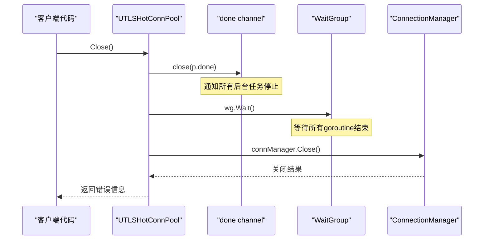
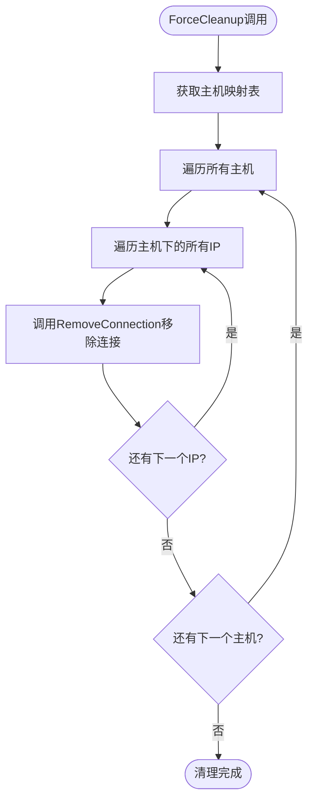
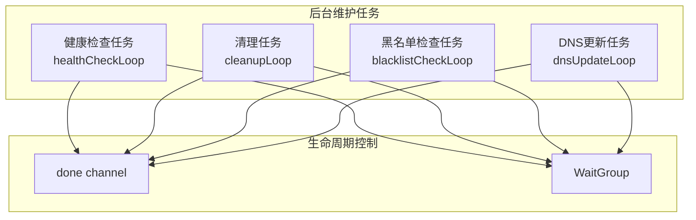
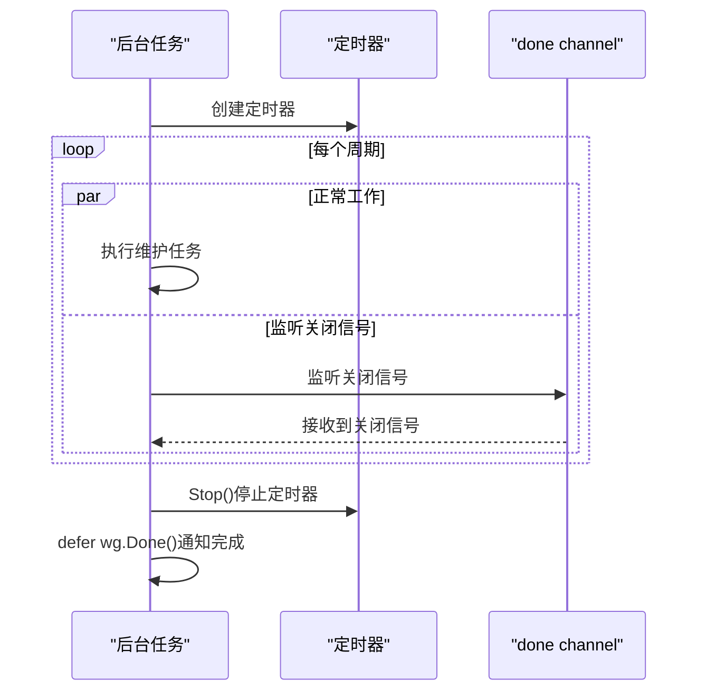
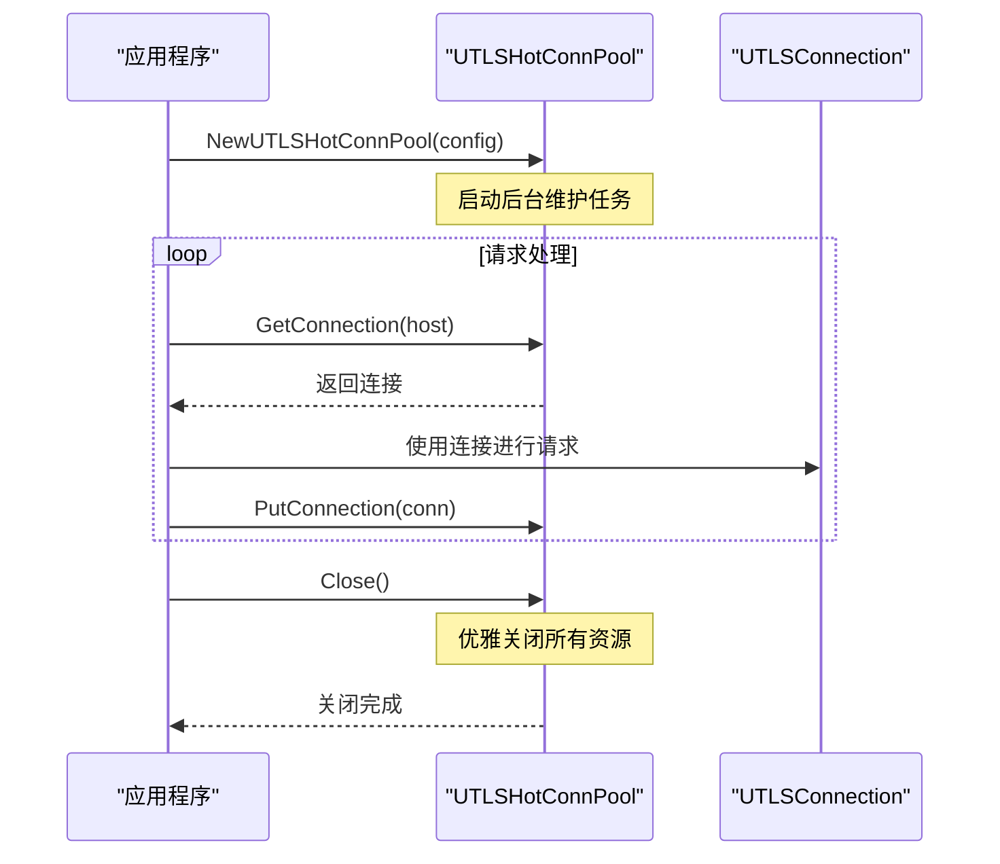
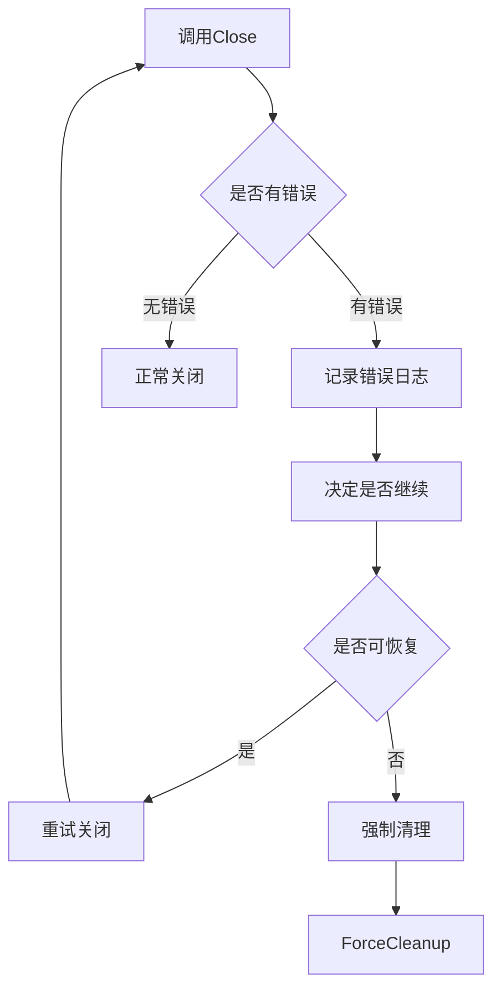
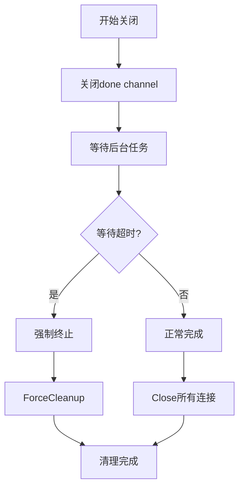

# UTLSHotConnPool API生命周期管理功能详细文档

<cite>
**本文档引用的文件**
- [utlshotconnpool.go](file://utlsclient/utlshotconnpool.go)
- [example_hotconnpool_usage.go](file://examples/utlsclient/example_hotconnpool_usage.go)
- [health_checker.go](file://utlsclient/health_checker.go)
- [connection_manager_test.go](file://test/utlsclient/connection_manager_test.go)
- [utlshotconnpool_public_test.go](file://test/utlsclient/utlshotconnpool_public_test.go)
</cite>

## 目录
1. [概述](#概述)
2. [Close方法优雅关闭机制](#close方法优雅关闭机制)
3. [ForceCleanup方法强制清理机制](#forcecleanup方法强制清理机制)
4. [后台维护任务生命周期管理](#后台维护任务生命周期管理)
5. [WaitGroup同步机制](#waitgroup同步机制)
6. [最佳实践使用示例](#最佳实践使用示例)
7. [错误处理和资源清理](#错误处理和资源清理)
8. [总结](#总结)

## 概述

UTLSHotConnPool是一个高性能的热连接池实现，提供了完整的生命周期管理功能。该连接池通过优雅的关闭机制、强制清理功能以及后台维护任务，确保资源的正确管理和释放。

## Close方法优雅关闭机制

### 关闭流程详解

Close方法实现了优雅关闭机制，确保所有资源得到妥善处理：



**图表来源**
- [utlshotconnpool.go](file://utlsclient/utlshotconnpool.go#L1176-L1185)

### 关闭步骤分析

1. **关闭done channel** (`p.done`)
   - 调用`close(p.done)`通知所有后台任务停止
   - 这是优雅关闭的第一步，确保后续goroutine能够检测到关闭信号

2. **等待后台任务结束** (`p.wg.Wait()`)
   - 使用WaitGroup等待所有启动的goroutine完成
   - 确保没有正在运行的任务在关闭过程中产生竞争条件

3. **关闭所有连接** (`p.connManager.Close()`)
   - 调用ConnectionManager的Close方法关闭所有连接
   - 确保底层网络连接得到正确释放

**章节来源**
- [utlshotconnpool.go](file://utlsclient/utlshotconnpool.go#L1176-L1185)

## ForceCleanup方法强制清理机制

### 强制清理流程

ForceCleanup方法提供了强制清理所有连接的功能：



**图表来源**
- [utlshotconnpool.go](file://utlsclient/utlshotconnpool.go#L1385-L1394)

### 强制清理实现细节

ForceCleanup方法通过以下步骤实现强制清理：

1. **获取主机映射**：调用`p.connManager.GetHostMapping()`获取所有主机和IP的映射关系
2. **遍历所有主机和IP**：双重循环遍历所有主机及其对应的IP地址
3. **移除连接**：对每个IP调用`p.connManager.RemoveConnection(ip)`移除连接
4. **自动关闭**：RemoveConnection内部会调用连接的Close方法

**章节来源**
- [utlshotconnpool.go](file://utlsclient/utlshotconnpool.go#L1385-L1394)

## 后台维护任务生命周期管理

### 后台任务架构

UTLSHotConnPool启动四个主要的后台维护任务：



**图表来源**
- [utlshotconnpool.go](file://utlsclient/utlshotconnpool.go#L809-L826)

### 各后台任务功能

#### 1. 健康检查任务 (healthCheckLoop)
- **功能**：定期检查连接的健康状态
- **触发频率**：由`config.HealthCheckInterval`控制
- **实现**：每间隔时间调用`performHealthCheck()`执行检查

#### 2. 清理任务 (cleanupLoop)
- **功能**：清理过期连接
- **触发频率**：由`config.CleanupInterval`控制
- **实现**：每间隔时间调用`performCleanup()`清理过期连接

#### 3. 黑名单检查任务 (blacklistCheckLoop)
- **功能**：检查并清理黑名单中的连接
- **触发频率**：由`config.BlacklistCheckInterval`控制
- **实现**：每间隔时间调用`performBlacklistCheck()`检查黑名单

#### 4. DNS更新任务 (dnsUpdateLoop)
- **功能**：定期更新域名解析的IP地址
- **触发频率**：由`config.DNSUpdateInterval`控制
- **实现**：每间隔时间调用`performDNSUpdate()`更新DNS

**章节来源**
- [utlshotconnpool.go](file://utlsclient/utlshotconnpool.go#L828-L1013)

### 后台任务关闭机制

所有后台任务都遵循相同的关闭模式：



**图表来源**
- [utlshotconnpool.go](file://utlsclient/utlshotconnpool.go#L828-L906)

**章节来源**
- [utlshotconnpool.go](file://utlsclient/utlshotconnpool.go#L828-L906)

## WaitGroup同步机制

### WaitGroup的作用

WaitGroup用于确保所有后台任务在连接池关闭前完成：

| 功能 | 实现方式 | 作用 |
|------|----------|------|
| 增加计数 | `p.wg.Add(1)` | 在启动每个goroutine前增加计数 |
| 等待完成 | `p.wg.Wait()` | 在关闭时等待所有goroutine完成 |
| 减少计数 | `defer p.wg.Done()` | 在goroutine结束时减少计数 |

### WaitGroup使用模式

```mermaid
graph LR
subgraph "启动阶段"
A[创建Pool] --> B[启动后台任务]
B --> C[p.wg.Add(1)]
C --> D[启动goroutine]
end
subgraph "运行阶段"
E[正常运行]
end
subgraph "关闭阶段"
F[调用Close] --> G[p.wg.Wait]
G --> H[等待所有goroutine完成]
H --> I[关闭连接池]
end
D --> E
E --> F
```

**图表来源**
- [utlshotconnpool.go](file://utlsclient/utlshotconnpool.go#L809-L826)

**章节来源**
- [utlshotconnpool.go](file://utlsclient/utlshotconnpool.go#L809-L826)

## 最佳实践使用示例

### 基本使用模式

以下是正确的连接池使用模式：



**图表来源**
- [example_hotconnpool_usage.go](file://examples/utlsclient/example_hotconnpool_usage.go#L130-L135)

### 推荐的关闭时机

1. **程序退出前**：在main函数结束前调用Close()
2. **服务停止时**：在接收到SIGTERM等信号时调用
3. **资源不足时**：当系统资源不足时主动清理

### 错误处理建议



**章节来源**
- [example_hotconnpool_usage.go](file://examples/utlsclient/example_hotconnpool_usage.go#L130-L135)

## 错误处理和资源清理

### 连接关闭错误处理

连接池在关闭过程中可能遇到各种错误：

| 错误类型 | 处理方式 | 示例场景 |
|----------|----------|----------|
| 网络连接断开 | 忽略，继续关闭其他连接 | 远程服务器主动断开 |
| 资源竞争 | 重试或记录日志 | 多个goroutine同时访问 |
| 超时错误 | 记录并继续 | 网络延迟过高 |
| 系统资源不足 | 返回错误给调用者 | 文件描述符耗尽 |

### 资源清理策略



### 日志记录最佳实践

1. **关键事件记录**：记录连接池的启动、关闭和异常事件
2. **性能指标监控**：记录连接池的统计信息
3. **错误追踪**：记录详细的错误信息和堆栈跟踪

**章节来源**
- [utlshotconnpool.go](file://utlsclient/utlshotconnpool.go#L1176-L1185)

## 总结

UTLSHotConnPool的生命周期管理功能提供了完整的资源管理解决方案：

1. **优雅关闭**：通过Close方法实现渐进式资源释放
2. **强制清理**：通过ForceCleanup方法提供紧急清理能力
3. **后台维护**：通过多个后台任务确保连接池的健康运行
4. **同步机制**：通过WaitGroup确保关闭过程的线程安全
5. **错误处理**：完善的错误处理和资源清理机制

这些功能共同确保了UTLSHotConnPool能够在各种使用场景下稳定运行，并在需要时能够安全地释放所有资源。开发者应该遵循推荐的使用模式，在适当的时机调用Close方法，并妥善处理可能出现的错误情况。