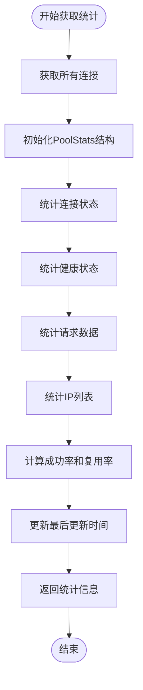
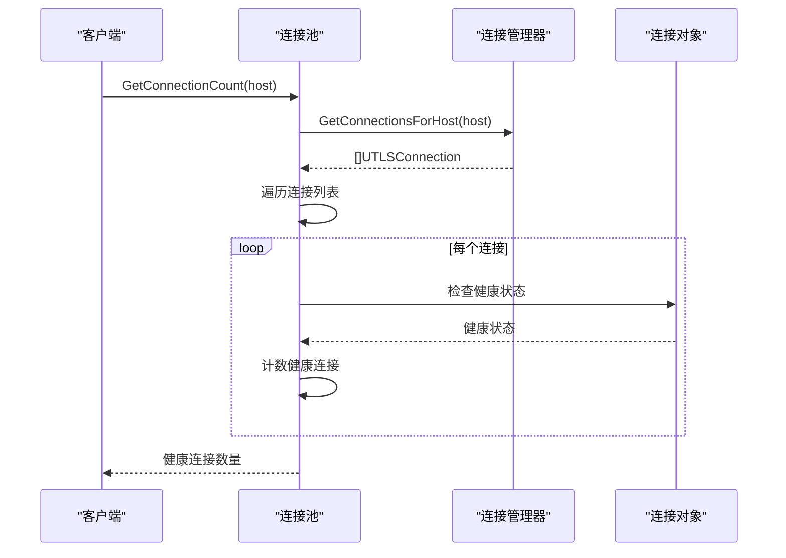
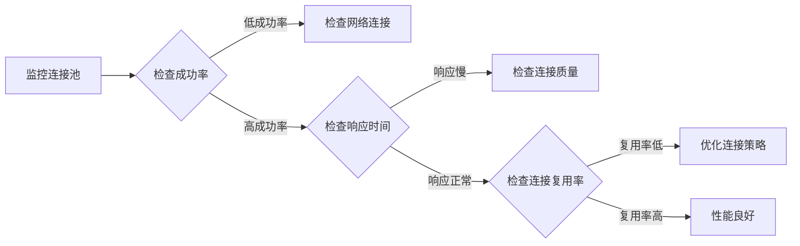

# 监控与统计

<cite>
**本文档引用的文件**
- [utlshotconnpool.go](file://utlsclient/utlshotconnpool.go)
- [connection_manager.go](file://utlsclient/connection_manager.go)
- [ip_access_controller.go](file://utlsclient/ip_access_controller.go)
- [example_hotconnpool_usage.go](file://examples/utlsclient/example_hotconnpool_usage.go)
- [example_basic_usage.go](file://examples/utlsclient/example_basic_usage.go)
- [utlshotconnpool_public_test.go](file://test/utlsclient/utlshotconnpool_public_test.go)
</cite>

## 目录
1. [概述](#概述)
2. [PoolStats 结构体详解](#poolstats-结构体详解)
3. [GetStats 方法详解](#getstats-方法详解)
4. [GetConnectionInfo 方法详解](#getconnectioninfo-方法详解)
5. [GetConnectionCount 方法详解](#getconnectioncount-方法详解)
6. [监控数据使用场景](#监控数据使用场景)
7. [示例代码](#示例代码)
8. [最佳实践](#最佳实践)

## 概述

UTLSHotConnPool API 提供了完整的监控与统计功能，帮助开发者实时了解连接池的运行状态和性能指标。通过 `GetStats()`、`GetConnectionInfo()` 和 `GetConnectionCount()` 等方法，可以获取连接池的全面统计信息，包括连接状态、健康状况、成功率、响应时间等关键指标。

## PoolStats 结构体详解

`PoolStats` 结构体包含了连接池的完整统计信息，每个字段都经过精心设计以提供准确的监控数据。

```mermaid
classDiagram
class PoolStats {
+int TotalConnections
+int ActiveConnections
+int IdleConnections
+int HealthyConnections
+int WhitelistIPs
+int BlacklistIPs
+int64 TotalRequests
+int64 SuccessfulRequests
+int64 FailedRequests
+float64 SuccessRate
+time.Duration AvgResponseTime
+float64 ConnReuseRate
+int64 WhitelistMoves
+int64 NewConnectionsFromDNS
+time.Time LastUpdateTime
}
class UTLSHotConnPool {
+GetStats() PoolStats
+GetConnectionInfo(ip string) map[string]interface{}
+GetConnectionCount(host string) int
}
UTLSHotConnPool --> PoolStats : "生成"
```

**图表来源**
- [utlshotconnpool.go](file://utlsclient/utlshotconnpool.go#L260-L276)

### 核心字段说明

| 字段名 | 类型 | 描述 | 计算方式 |
|--------|------|------|----------|
| `TotalConnections` | `int` | 总连接数 | 连接池中所有连接的数量 |
| `ActiveConnections` | `int` | 活跃连接数 | 正在使用的连接数量 |
| `IdleConnections` | `int` | 空闲连接数 | 可用但未被使用的连接数量 |
| `HealthyConnections` | `int` | 健康连接数 | 通过健康检查的连接数量 |
| `WhitelistIPs` | `int` | 白名单IP数 | 白名单中的IP地址数量 |
| `BlacklistIPs` | `int` | 黑名单IP数 | 黑名单中的IP地址数量 |
| `TotalRequests` | `int64` | 总请求数 | 连接池处理的总请求数 |
| `SuccessfulRequests` | `int64` | 成功请求数 | 成功处理的请求数 |
| `FailedRequests` | `int64` | 失败请求数 | 处理失败的请求数 |
| `SuccessRate` | `float64` | 成功率 | 成功请求占比（0-1） |
| `AvgResponseTime` | `time.Duration` | 平均响应时间 | 所有请求的平均响应时间 |
| `ConnReuseRate` | `float64` | 连接复用率 | 连接复用的频率 |
| `WhitelistMoves` | `int64` | 黑名单移到白名单数量 | 自动从黑名单移动到白名单的IP数量 |
| `NewConnectionsFromDNS` | `int64` | DNS更新新增连接数 | 通过DNS更新新增的连接数量 |
| `LastUpdateTime` | `time.Time` | 最后更新时间 | 统计信息的最后更新时间 |

**章节来源**
- [utlshotconnpool.go](file://utlsclient/utlshotconnpool.go#L260-L276)

## GetStats 方法详解

`GetStats()` 方法是连接池监控的核心入口，它收集和计算连接池的全面统计信息。

### 方法签名
```go
func (p *UTLSHotConnPool) GetStats() PoolStats
```

### 执行流程



**图表来源**
- [utlshotconnpool.go](file://utlsclient/utlshotconnpool.go#L1122-L1173)

### 统计过程详解

1. **连接收集**：遍历连接管理器中的所有连接
2. **状态统计**：分别统计活跃、空闲和健康连接
3. **请求统计**：汇总所有连接的请求和错误计数
4. **IP统计**：获取白名单和黑名单中的IP数量
5. **指标计算**：计算成功率、复用率等衍生指标

### 关键实现细节

- **并发安全**：使用读写锁确保统计过程的线程安全
- **原子操作**：对计数器使用原子操作避免数据竞争
- **性能优化**：只在必要时才进行昂贵的操作（如IP列表获取）

**章节来源**
- [utlshotconnpool.go](file://utlsclient/utlshotconnpool.go#L1122-L1173)

## GetConnectionInfo 方法详解

`GetConnectionInfo()` 方法提供指定IP连接的详细信息，用于诊断和故障排查。

### 方法签名
```go
func (p *UTLSHotConnPool) GetConnectionInfo(ip string) map[string]interface{}
```

### 返回信息

该方法返回包含以下信息的映射：

| 字段名 | 类型 | 描述 |
|--------|------|------|
| `target_ip` | `string` | 目标IP地址 |
| `target_host` | `string` | 目标主机名 |
| `created` | `time.Time` | 连接创建时间 |
| `last_used` | `time.Time` | 最后使用时间 |
| `last_checked` | `time.Time` | 最后检查时间 |
| `in_use` | `bool` | 是否正在使用 |
| `healthy` | `bool` | 健康状态 |
| `request_count` | `int64` | 请求次数 |
| `error_count` | `int64` | 错误次数 |
| `fingerprint` | `string` | 使用的TLS指纹名称 |

### 使用场景

- **连接诊断**：检查特定连接的状态和使用情况
- **故障排查**：定位连接问题的根本原因
- **性能分析**：分析连接的使用模式和性能特征

**章节来源**
- [utlshotconnpool.go](file://utlsclient/utlshotconnpool.go#L1432-L1453)

## GetConnectionCount 方法详解

`GetConnectionCount()` 方法统计特定主机的健康连接数量，用于容量规划和负载评估。

### 方法签名
```go
func (p *UTLSHotConnPool) GetConnectionCount(host string) int
```

### 实现原理



**图表来源**
- [utlshotconnpool.go](file://utlsclient/utlshotconnpool.go#L1361-L1374)

### 应用场景

- **容量规划**：评估特定主机的连接承载能力
- **负载均衡**：根据连接数量分配请求
- **性能监控**：监控连接池的使用趋势

**章节来源**
- [utlshotconnpool.go](file://utlsclient/utlshotconnpool.go#L1361-L1374)

## 监控数据使用场景

### 性能调优

通过监控数据可以识别性能瓶颈并进行优化：



### 容量规划

利用历史统计数据进行容量预测：

- **连接增长趋势**：监控总连接数的增长速度
- **峰值负载**：分析高峰期的连接使用情况
- **资源利用率**：评估连接池的资源使用效率

### 故障排查

系统故障时的诊断流程：

1. **检查连接池状态**：使用 `GetStats()` 获取整体状态
2. **定位问题连接**：使用 `GetConnectionInfo()` 检查特定连接
3. **分析错误模式**：观察错误计数和健康状态的变化
4. **验证配置**：确认黑白名单和配置参数的正确性

## 示例代码

### 基础统计监控

```go
// 定期采集连接池统计信息
func monitorConnectionPool(pool *utlsclient.UTLSHotConnPool) {
    ticker := time.NewTicker(30 * time.Second)
    defer ticker.Stop()
    
    for {
        select {
        case <-ticker.C:
            stats := pool.GetStats()
            
            fmt.Printf("连接池统计:\n")
            fmt.Printf("  总连接数: %d\n", stats.TotalConnections)
            fmt.Printf("  活跃连接: %d\n", stats.ActiveConnections)
            fmt.Printf("  健康连接: %d\n", stats.HealthyConnections)
            fmt.Printf("  成功率: %.2f%%\n", stats.SuccessRate * 100)
            fmt.Printf("  白名单IP: %d\n", stats.WhitelistIPs)
            fmt.Printf("  黑名单IP: %d\n", stats.BlacklistIPs)
            
            // 性能告警
            if stats.SuccessRate < 0.8 {
                fmt.Println("⚠️  连接池成功率低于80%")
            }
            if stats.HealthyConnections < stats.TotalConnections * 0.9 {
                fmt.Println("⚠️  健康连接数低于总连接数的90%")
            }
        }
    }
}
```

### 连接状态监控

```go
// 监控特定主机的连接状态
func monitorHostConnections(pool *utlsclient.UTLSHotConnPool, host string) {
    for {
        time.Sleep(10 * time.Second)
        
        // 获取健康连接数
        healthyCount := pool.GetConnectionCount(host)
        
        // 获取连接池统计
        stats := pool.GetStats()
        
        fmt.Printf("[%s] 健康连接数: %d/%d\n", 
            host, healthyCount, stats.TotalConnections)
        
        // 检查连接分布
        if healthyCount == 0 {
            fmt.Printf("❌ %s 没有可用的健康连接\n", host)
        } else if healthyCount < stats.HealthyConnections * 0.1 {
            fmt.Printf("⚠️ %s 的连接数较少，可能需要扩容\n", host)
        }
    }
}
```

### 连接详情诊断

```go
// 诊断连接问题
func diagnoseConnectionIssues(pool *utlsclient.UTLSHotConnPool, targetIP string) {
    info := pool.GetConnectionInfo(targetIP)
    if info == nil {
        fmt.Printf("无法找到IP为 %s 的连接\n", targetIP)
        return
    }
    
    fmt.Printf("连接诊断报告 (%s):\n", targetIP)
    fmt.Printf("  目标主机: %s\n", info["target_host"])
    fmt.Printf("  创建时间: %s\n", info["created"])
    fmt.Printf("  最后使用: %s\n", info["last_used"])
    fmt.Printf("  健康状态: %v\n", info["healthy"])
    fmt.Printf("  使用中: %v\n", info["in_use"])
    fmt.Printf("  请求次数: %d\n", info["request_count"])
    fmt.Printf("  错误次数: %d\n", info["error_count"])
    
    // 分析问题
    if info["error_count"].(int64) > 10 {
        fmt.Println("⚠️  错误次数较多，可能存在连接质量问题")
    }
    
    if !info["healthy"].(bool) {
        fmt.Println("❌ 连接不健康，需要重新建立")
    }
}
```

**章节来源**
- [example_hotconnpool_usage.go](file://examples/utlsclient/example_hotconnpool_usage.go#L118-L128)
- [example_basic_usage.go](file://examples/utlsclient/example_basic_usage.go#L66-L82)

## 最佳实践

### 监控频率建议

- **关键指标**：每30秒采集一次
- **详细诊断**：每2分钟检查一次
- **长期趋势**：每小时记录一次

### 告警阈值设置

```go
const (
    SUCCESS_RATE_THRESHOLD = 0.95    // 成功率低于95%告警
    HEALTHY_RATIO_THRESHOLD = 0.90   // 健康连接比例低于90%告警
    CONNECTION_COUNT_THRESHOLD = 100 // 连接数超过100个告警
)
```

### 数据持久化

```go
// 将监控数据保存到数据库
func saveMetricsToDatabase(stats PoolStats) {
    metric := Metric{
        Timestamp:          time.Now(),
        TotalConnections:   stats.TotalConnections,
        HealthyConnections: stats.HealthyConnections,
        SuccessRate:        stats.SuccessRate,
        // ... 其他指标
    }
    
    // 保存到数据库
    db.Save(&metric)
}
```

### 性能优化

- **批量采集**：避免频繁调用GetStats()
- **缓存机制**：对静态数据进行缓存
- **异步处理**：将统计计算放在单独的goroutine中

通过合理使用UTLSHotConnPool的监控与统计功能，可以构建一个健壮、高效的连接池监控系统，及时发现和解决潜在问题，确保系统的稳定运行。