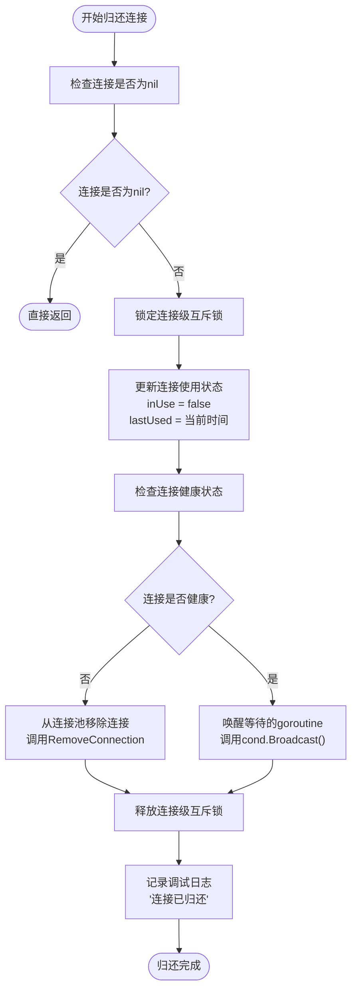
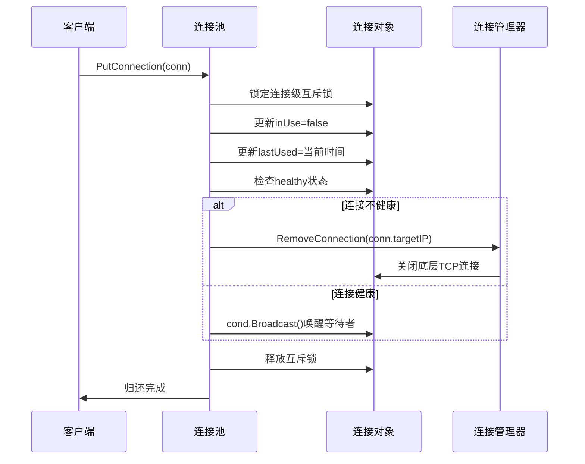
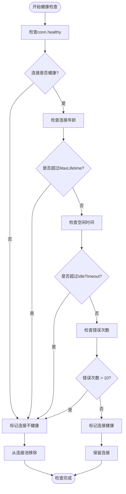
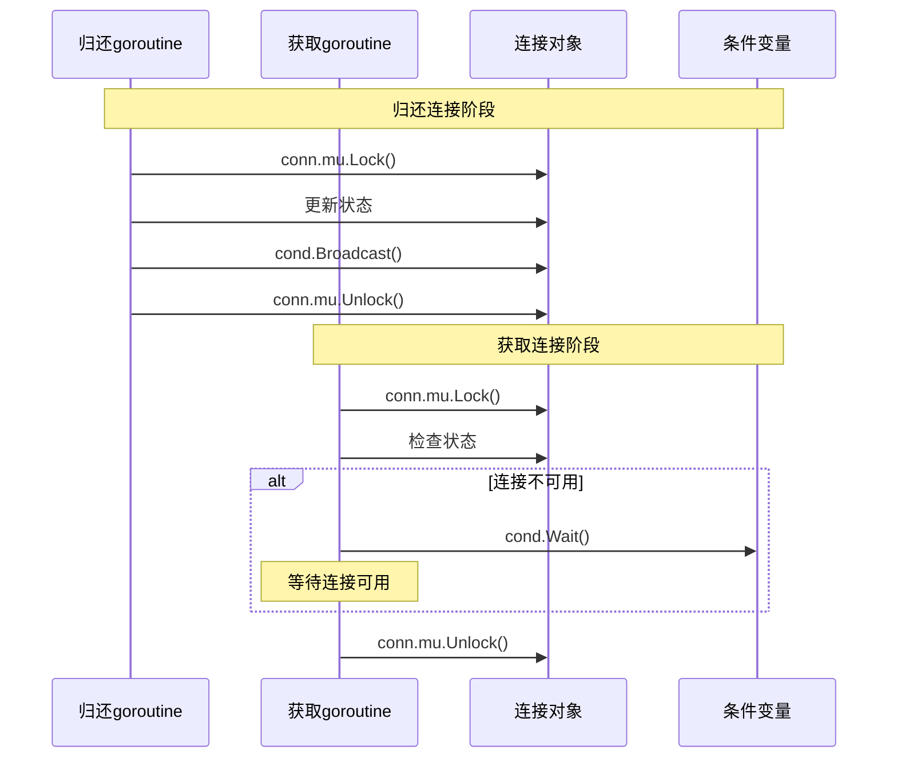
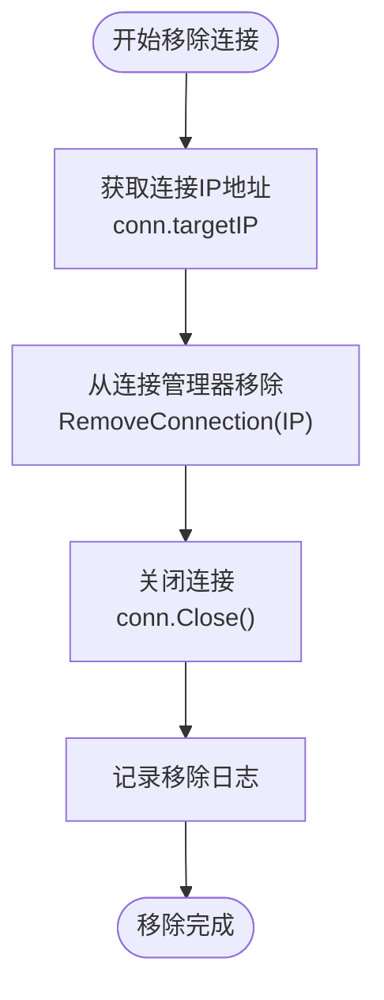
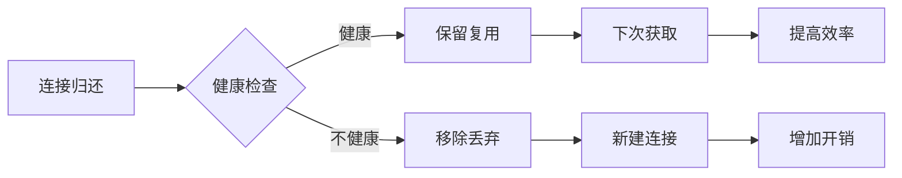

# 连接归还

<cite>
**本文档中引用的文件**
- [utlshotconnpool.go](file://utlsclient/utlshotconnpool.go)
- [connection_manager.go](file://utlsclient/connection_manager.go)
- [example_hotconnpool_usage.go](file://examples/utlsclient/example_hotconnpool_usage.go)
- [connection_validator.go](file://utlsclient/connection_validator.go)
- [health_checker.go](file://utlsclient/health_checker.go)
- [test_helpers.go](file://utlsclient/test_helpers.go)
</cite>

## 目录
1. [概述](#概述)
2. [PutConnection方法实现](#putconnection方法实现)
3. [连接状态管理](#连接状态管理)
4. [健康检查机制](#健康检查机制)
5. [并发安全设计](#并发安全设计)
6. [连接移除机制](#连接移除机制)
7. [使用示例](#使用示例)
8. [性能考虑](#性能考虑)
9. [最佳实践](#最佳实践)

## 概述

UTLSHotConnPool API中的连接归还功能是连接池管理的核心组件，负责将使用完毕的连接安全地返回到连接池中。PutConnection方法作为这一过程的主要入口点，实现了复杂的连接状态更新、健康检查和并发控制机制。

连接归还功能的关键特性包括：
- **原子性状态更新**：确保连接使用状态的线程安全更新
- **智能健康检查**：根据连接状态决定是否保留或移除连接
- **并发唤醒机制**：通过条件变量唤醒等待的goroutine
- **资源清理**：自动关闭不健康连接的底层TCP连接

## PutConnection方法实现

PutConnection方法是连接归还功能的核心实现，其执行流程如下：



**图表来源**
- [utlshotconnpool.go](file://utlsclient/utlshotconnpool.go#L760-L785)

### 方法签名和参数

PutConnection方法的定义如下：

```go
func (p *UTLSHotConnPool) PutConnection(conn *UTLSConnection)
```

- **接收者**：UTLSHotConnPool实例
- **参数**：要归还的UTLSConnection指针
- **返回值**：无

### 核心实现逻辑

方法的核心实现包含以下关键步骤：

1. **空值检查**：防止对nil连接进行操作
2. **连接级锁定**：确保状态更新的原子性
3. **状态更新**：将连接标记为空闲状态并更新最后使用时间
4. **健康检查**：评估连接当前的健康状态
5. **条件唤醒**：通知等待的goroutine连接可用
6. **日志记录**：提供调试信息

**章节来源**
- [utlshotconnpool.go](file://utlsclient/utlshotconnpool.go#L760-L785)

## 连接状态管理

连接状态管理是连接归还功能的基础，涉及多个关键状态字段的协调更新：

### 状态字段详解

| 字段 | 类型 | 描述 | 更新时机 |
|------|------|------|----------|
| `inUse` | bool | 连接当前使用状态 | 归还时设为false |
| `lastUsed` | time.Time | 最后使用时间 | 归还时更新为当前时间 |
| `healthy` | bool | 连接健康状态 | 归还时检查 |
| `requestCount` | int64 | 请求次数统计 | 归还时不更新 |
| `errorCount` | int64 | 错误次数统计 | 归还时不更新 |

### 状态更新流程



**图表来源**
- [utlshotconnpool.go](file://utlsclient/utlshotconnpool.go#L760-L785)
- [connection_manager.go](file://utlsclient/connection_manager.go#L49-L74)

**章节来源**
- [utlshotconnpool.go](file://utlsclient/utlshotconnpool.go#L204-L234)

## 健康检查机制

连接健康检查是确保连接池质量的重要机制，在连接归还过程中发挥关键作用：

### 健康检查触发条件

连接归还时的健康检查主要基于以下条件：

1. **显式健康状态**：检查`conn.healthy`标志位
2. **连接年龄**：验证是否超过最大生命周期
3. **空闲时间**：检查是否超过空闲超时时间
4. **错误累积**：统计并检查错误次数阈值

### 健康检查流程



**图表来源**
- [health_checker.go](file://utlsclient/health_checker.go#L25-L60)

### 连接验证机制

对于HTTP/1.1连接，系统会执行更严格的验证：

- **发送HEAD请求**：验证指定路径的可达性
- **状态码检查**：确认响应状态码在200-399范围内
- **响应头解析**：验证响应格式的正确性

**章节来源**
- [health_checker.go](file://utlsclient/health_checker.go#L25-L60)
- [connection_validator.go](file://utlsclient/connection_validator.go#L65-L109)

## 并发安全设计

连接归还功能采用了多层次的并发安全设计，确保在高并发环境下的数据一致性：

### 连接级Mutex设计

每个UTLSConnection实例都配备独立的互斥锁：

```go
type UTLSConnection struct {
    // ... 其他字段 ...
    mu   sync.Mutex // 连接级锁
    cond *sync.Cond // 等待条件（用于连接复用）
}
```

这种设计的优势：
- **细粒度控制**：每个连接独立锁定，减少锁竞争
- **原子操作**：确保状态更新的完整性
- **条件变量支持**：支持高效的等待/通知机制

### 锁定策略



**图表来源**
- [utlshotconnpool.go](file://utlsclient/utlshotconnpool.go#L1297-L1324)

### 死锁预防

系统采用多种策略预防死锁：

1. **锁定顺序**：始终先获取连接级锁再获取其他资源
2. **解锁优先**：在持有锁的情况下避免调用外部函数
3. **条件变量**：使用Wait/Signal模式避免忙等待

**章节来源**
- [utlshotconnpool.go](file://utlsclient/utlshotconnpool.go#L231-L234)
- [utlshotconnpool.go](file://utlsclient/utlshotconnpool.go#L1297-L1324)

## 连接移除机制

当连接被判定为不健康时，系统会执行RemoveFromPool操作，彻底从连接池中移除该连接：

### removeFromPool方法实现



**图表来源**
- [utlshotconnpool.go](file://utlsclient/utlshotconnpool.go#L787-L791)

### 移除操作的详细步骤

1. **IP提取**：从连接对象获取目标IP地址
2. **管理器移除**：调用ConnectionManager.RemoveConnection()
3. **资源关闭**：调用连接的Close()方法
4. **映射更新**：清理域名到IP的映射关系
5. **统计更新**：更新连接池统计信息

### 底层TCP连接关闭

Close方法确保所有底层资源得到正确释放：

```go
func (conn *UTLSConnection) Close() error {
    conn.mu.Lock()
    defer conn.mu.Unlock()
    
    // 关闭HTTP/2客户端连接
    conn.h2Mu.Lock()
    if conn.h2ClientConn != nil {
        if cc, ok := conn.h2ClientConn.(interface{ Close() error }); ok {
            cc.Close()
        }
        conn.h2ClientConn = nil
    }
    conn.h2Mu.Unlock()
    
    // 关闭TLS连接
    if conn.tlsConn != nil {
        conn.tlsConn.Close()
    }
    
    // 关闭基础TCP连接
    if conn.conn != nil {
        conn.conn.Close()
    }
    
    conn.healthy = false
    return nil
}
```

**章节来源**
- [utlshotconnpool.go](file://utlsclient/utlshotconnpool.go#L787-L791)
- [utlshotconnpool.go](file://utlsclient/utlshotconnpool.go#L1248-L1271)

## 使用示例

以下是连接归还功能的正确使用模式：

### 基本使用模式

```go
// 获取连接
conn, err := pool.GetConnection("example.com")
if err != nil {
    log.Fatalf("获取连接失败: %v", err)
}

// 使用连接进行HTTP请求
client := utlsclient.NewUTLSClient(conn)
resp, err := client.Get("https://example.com/api/data")
if err != nil {
    log.Printf("请求失败: %v", err)
} else {
    // 处理响应
    resp.Body.Close()
}

// 归还连接
pool.PutConnection(conn)
```

### defer语句的最佳实践

```go
// 推荐的使用模式
func fetchData(pool HotConnPool, url string) ([]byte, error) {
    conn, err := pool.GetConnection("example.com")
    if err != nil {
        return nil, err
    }
    // 确保连接总是被归还
    defer pool.PutConnection(conn)
    
    client := utlsclient.NewUTLSClient(conn)
    resp, err := client.Get(url)
    if err != nil {
        return nil, err
    }
    defer resp.Body.Close()
    
    return io.ReadAll(resp.Body)
}
```

### 路径验证示例

```go
// 获取带路径验证的连接
conn, err := pool.GetConnectionWithValidation("https://api.example.com/specific-endpoint")
if err != nil {
    return err
}

defer pool.PutConnection(conn)

// 使用验证过的连接
client := utlsclient.NewUTLSClient(conn)
resp, err := client.Get("https://api.example.com/specific-endpoint")
```

**章节来源**
- [example_hotconnpool_usage.go](file://examples/utlsclient/example_hotconnpool_usage.go#L46-L117)

## 性能考虑

连接归还功能的性能特征和优化建议：

### 归还操作的开销

连接归还操作的典型性能特征：

| 操作 | 时间复杂度 | 主要开销 |
|------|------------|----------|
| 空值检查 | O(1) | 指针比较 |
| 互斥锁获取 | O(1) | 系统调用开销 |
| 状态更新 | O(1) | 内存写入 |
| 健康检查 | O(1) | 简单条件判断 |
| 条件广播 | O(n) | 唤醒等待的goroutine |

### 连接复用率影响

连接归还直接影响连接池的复用效率：



### 性能优化建议

1. **合理设置超时参数**：
   - `IdleTimeout`：平衡内存使用和连接复用
   - `MaxLifetime`：避免使用过时的连接

2. **监控连接统计**：
   ```go
   stats := pool.GetStats()
   reuseRate := float64(stats.HealthyConnections) / float64(stats.TotalConnections)
   ```

3. **避免频繁的健康检查**：
   - 调整`HealthCheckInterval`参数
   - 在低负载时减少检查频率

4. **优化并发模型**：
   - 使用适当的连接池大小
   - 避免过度的goroutine创建

**章节来源**
- [utlshotconnpool.go](file://utlsclient/utlshotconnpool.go#L170-L202)

## 最佳实践

### 连接归还的最佳实践

1. **始终使用defer语句**：
   ```go
   conn, err := pool.GetConnection(host)
   if err != nil {
       return err
   }
   defer pool.PutConnection(conn)
   ```

2. **及时处理错误**：
   ```go
   if err != nil {
       // 记录错误但不要归还连接
       return err
   }
   // 正常使用后归还
   pool.PutConnection(conn)
   ```

3. **避免长时间持有连接**：
   ```go
   // 不推荐：长时间持有连接
   conn, _ := pool.GetConnection("example.com")
   // 执行大量操作
   pool.PutConnection(conn)  // 很晚才归还
   
   // 推荐：分段使用
   conn, _ := pool.GetConnection("example.com")
   // 执行部分操作
   pool.PutConnection(conn)
   
   conn, _ = pool.GetConnection("example.com")
   // 执行剩余操作
   pool.PutConnection(conn)
   ```

4. **监控连接池状态**：
   ```go
   stats := pool.GetStats()
   if stats.HealthyConnections == 0 {
       log.Warn("连接池健康连接数为零")
   }
   ```

### 故障排除指南

常见问题及解决方案：

1. **连接泄漏**：
   - 症状：连接池中的连接数持续增长
   - 原因：忘记归还连接或异常情况下未归还
   - 解决：使用defer语句确保归还

2. **连接池空闲**：
   - 症状：大量连接被标记为空闲但未被复用
   - 原因：IdleTimeout设置过短或健康检查过于严格
   - 解决：调整超时参数或检查健康检查逻辑

3. **性能下降**：
   - 症状：连接获取和归还操作变慢
   - 原因：锁竞争或健康检查过于频繁
   - 解决：优化并发参数或调整检查频率

**章节来源**
- [example_hotconnpool_usage.go](file://examples/utlsclient/example_hotconnpool_usage.go#L202-L259)