# UTLSHotConnPool连接池创建功能详细文档

<cite>
**本文档引用的文件**
- [utlshotconnpool.go](file://utlsclient/utlshotconnpool.go)
- [interfaces.go](file://utlsclient/interfaces.go)
- [connection_manager.go](file://utlsclient/connection_manager.go)
- [health_checker.go](file://utlsclient/health_checker.go)
- [ip_access_controller.go](file://utlsclient/ip_access_controller.go)
- [example_hotconnpool_usage.go](file://examples/utlsclient/example_hotconnpool_usage.go)
</cite>

## 目录
1. [简介](#简介)
2. [核心架构概览](#核心架构概览)
3. [NewUTLSHotConnPool函数详解](#newutlhotconnpool函数详解)
4. [配置参数处理机制](#配置参数处理机制)
5. [核心组件初始化](#核心组件初始化)
6. [后台维护任务启动](#后台维护任务启动)
7. [SetDependencies方法详解](#setdependencies方法详解)
8. [并发安全设计](#并发安全设计)
9. [错误处理机制](#错误处理机制)
10. [使用示例](#使用示例)
11. [最佳实践建议](#最佳实践建议)

## 简介

UTLSHotConnPool是crawler-platform项目中的核心连接池组件，专门用于管理TLS连接的生命周期。它提供了高性能、高可用的连接复用机制，支持多种TLS指纹、智能健康检查和动态IP池管理。

本文档重点介绍`NewUTLSHotConnPool`函数的实现机制，包括配置参数处理、核心组件初始化和后台维护任务的启动过程。

## 核心架构概览

UTLSHotConnPool采用组件化设计，主要由以下核心组件构成：

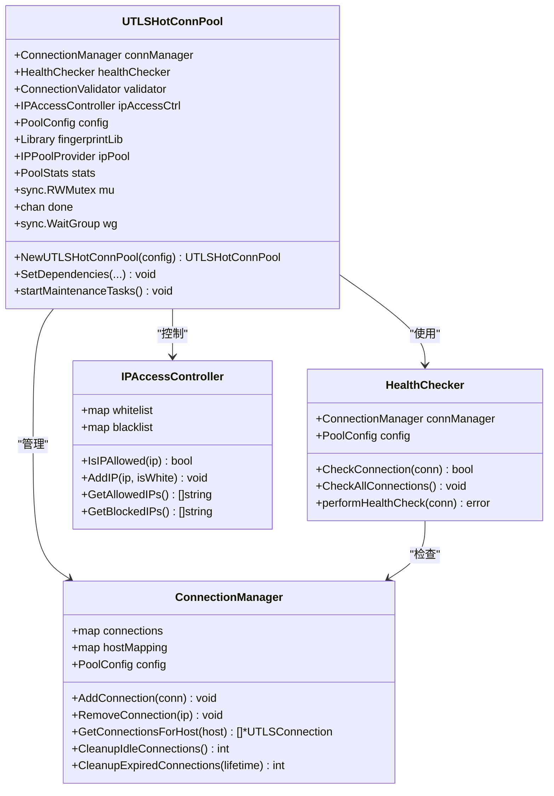

**图表来源**
- [utlshotconnpool.go](file://utlsclient/utlshotconnpool.go#L237-L258)
- [connection_manager.go](file://utlsclient/connection_manager.go#L8-L14)
- [health_checker.go](file://utlsclient/health_checker.go#L9-L13)
- [ip_access_controller.go](file://utlsclient/ip_access_controller.go#L7-L12)

## NewUTLSHotConnPool函数详解

`NewUTLSHotConnPool`是连接池的主要构造函数，负责创建和初始化整个连接池实例。

### 函数签名与基本流程

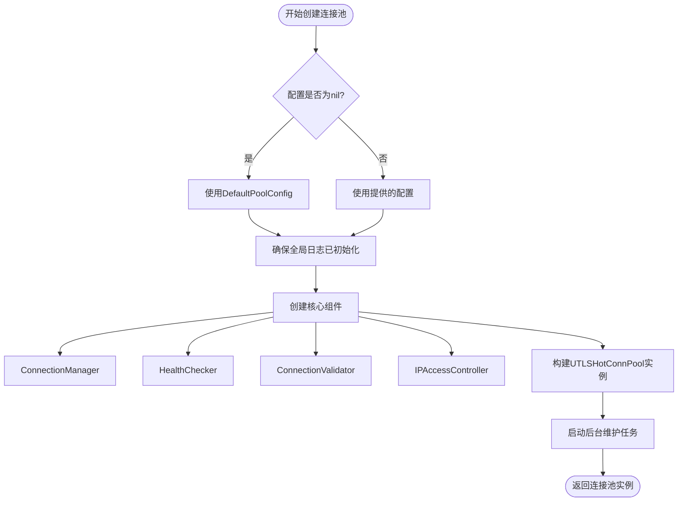

**图表来源**
- [utlshotconnpool.go](file://utlsclient/utlshotconnpool.go#L291-L318)

### 核心实现步骤

1. **配置参数检查与处理**
   - 检查传入的配置参数是否为nil
   - 如果为nil，自动使用`DefaultPoolConfig()`提供默认配置

2. **全局日志初始化**
   - 确保项目级全局日志记录器已初始化
   - 为后续的日志记录做好准备

3. **核心组件创建**
   - 创建ConnectionManager：负责连接的生命周期管理
   - 创建HealthChecker：负责连接健康状态检查
   - 创建ConnectionValidator：负责连接有效性验证
   - 创建IPAccessController：负责IP访问控制

4. **连接池实例构建**
   - 初始化UTLSHotConnPool结构体
   - 设置配置参数
   - 创建done通道用于优雅关闭

5. **后台任务启动**
   - 启动健康检查循环
   - 启动清理循环
   - 启动黑名单检查循环
   - 启动DNS更新循环

**章节来源**
- [utlshotconnpool.go](file://utlsclient/utlshotconnpool.go#L291-L318)

## 配置参数处理机制

### DefaultPoolConfig默认配置策略

当传入的配置参数为nil时，系统会自动使用`DefaultPoolConfig()`函数提供的一套默认配置：

| 配置项 | 默认值 | 说明 |
|--------|--------|------|
| MaxConnections | 100 | 最大连接数限制 |
| MaxConnsPerHost | 10 | 每个主机最大连接数 |
| MaxIdleConns | 20 | 最大空闲连接数 |
| ConnTimeout | 30s | 连接超时时间 |
| IdleTimeout | 60s | 空闲连接超时时间 |
| MaxLifetime | 300s | 连接最大生命周期 |
| TestTimeout | 10s | 测试请求超时时间 |
| HealthCheckInterval | 30s | 健康检查间隔 |
| CleanupInterval | 60s | 清理间隔 |
| BlacklistCheckInterval | 300s | 黑名单检查间隔 |
| DNSUpdateInterval | 1800s | DNS更新间隔 |
| MaxRetries | 3 | 最大重试次数 |

### 配置验证机制

系统在创建连接池时会对配置参数进行严格验证：

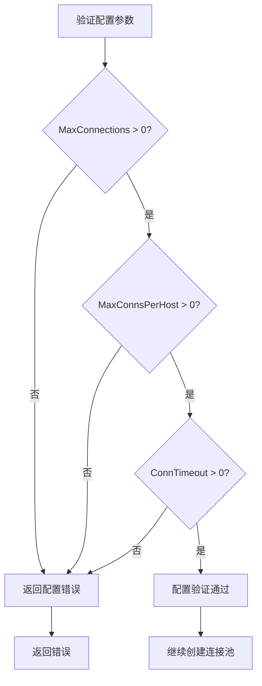

**图表来源**
- [utlshotconnpool.go](file://utlsclient/utlshotconnpool.go#L117-L135)

**章节来源**
- [utlshotconnpool.go](file://utlsclient/utlshotconnpool.go#L186-L202)
- [utlshotconnpool.go](file://utlsclient/utlshotconnpool.go#L117-L135)

## 核心组件初始化

### ConnectionManager初始化

ConnectionManager是连接池的核心管理组件，负责连接的存储、检索和生命周期管理：

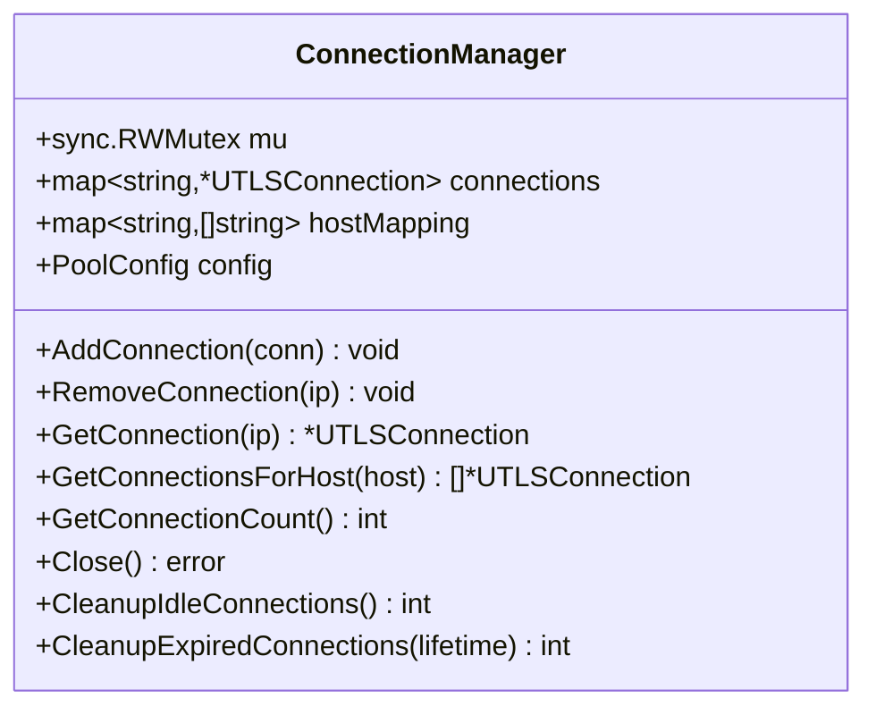

**图表来源**
- [connection_manager.go](file://utlsclient/connection_manager.go#L8-L14)

### HealthChecker初始化

HealthChecker负责定期检查连接的健康状态，确保连接池中只有健康的连接：

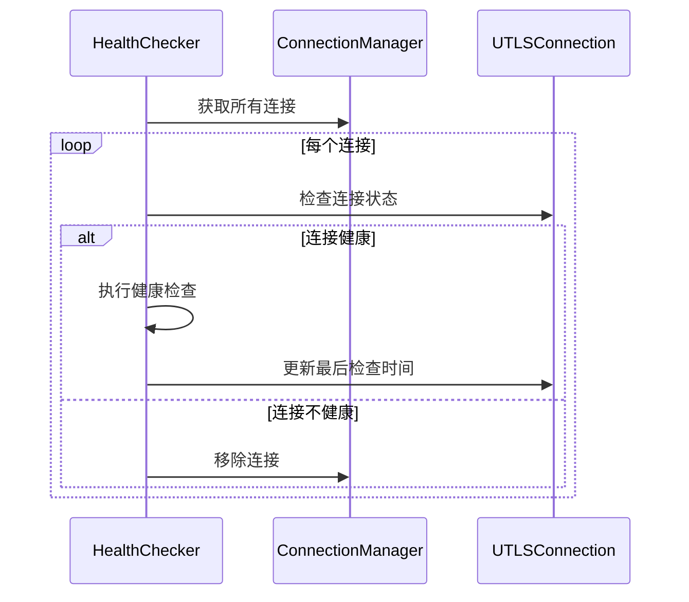

**图表来源**
- [health_checker.go](file://utlsclient/health_checker.go#L91-L111)

### IPAccessController初始化

IPAccessController管理IP白名单和黑名单，提供访问控制功能：

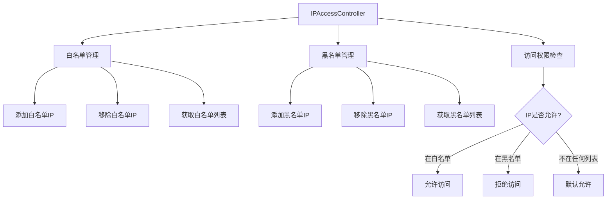

**图表来源**
- [ip_access_controller.go](file://utlsclient/ip_access_controller.go#L7-L12)

**章节来源**
- [connection_manager.go](file://utlsclient/connection_manager.go#L16-L22)
- [health_checker.go](file://utlsclient/health_checker.go#L15-L20)
- [ip_access_controller.go](file://utlsclient/ip_access_controller.go#L14-L19)

## 后台维护任务启动

`startMaintenanceTasks`方法负责启动连接池的各种后台维护任务，这些任务通过独立的goroutine运行，确保连接池的持续健康运行。

### 后台任务架构

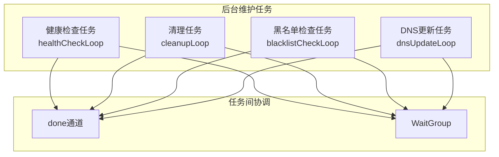

**图表来源**
- [utlshotconnpool.go](file://utlsclient/utlshotconnpool.go#L808-L826)

### 各任务详细说明

1. **健康检查循环 (healthCheckLoop)**
   - 定期检查连接池中所有连接的健康状态
   - 默认间隔：`HealthCheckInterval`（30秒）
   - 检查内容：连接状态、响应时间、错误次数等

2. **清理循环 (cleanupLoop)**
   - 清理空闲时间过长的连接
   - 清理生命周期超过限制的连接
   - 默认间隔：`CleanupInterval`（60秒）

3. **黑名单检查循环 (blacklistCheckLoop)**
   - 检查黑名单中的IP是否可以重新加入白名单
   - 默认间隔：`BlacklistCheckInterval`（300秒）

4. **DNS更新循环 (dnsUpdateLoop)**
   - 定期更新域名对应的IP地址
   - 默认间隔：`DNSUpdateInterval`（1800秒）

### 任务启动流程

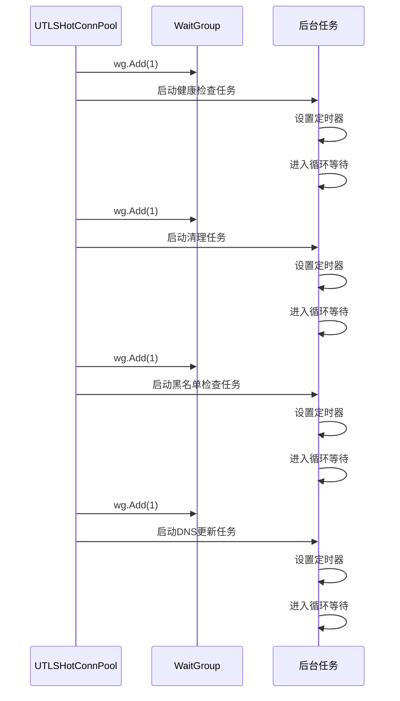

**图表来源**
- [utlshotconnpool.go](file://utlsclient/utlshotconnpool.go#L811-L825)

**章节来源**
- [utlshotconnpool.go](file://utlsclient/utlshotconnpool.go#L808-L826)
- [utlshotconnpool.go](file://utlsclient/utlshotconnpool.go#L827-L859)
- [utlshotconnpool.go](file://utlsclient/utlshotconnpool.go#L844-L859)
- [utlshotconnpool.go](file://utlsclient/utlshotconnpool.go#L889-L906)
- [utlshotconnpool.go](file://utlsclient/utlshotconnpool.go#L997-L1013)

## SetDependencies方法详解

`SetDependencies`方法允许动态设置连接池的依赖模块，包括指纹库、IP池提供者、访问控制器和日志记录器。

### 方法签名与参数

```go
func (p *UTLSHotConnPool) SetDependencies(
    fingerprintLib *Library,
    ipPool IPPoolProvider,
    accessControl AccessController,
    logger projlogger.Logger,
)
```

### 依赖模块说明

| 依赖模块 | 接口类型 | 功能描述 |
|----------|----------|----------|
| fingerprintLib | Library | TLS指纹库，提供各种TLS客户端指纹 |
| ipPool | IPPoolProvider | IP池提供者，负责IP地址的获取和管理 |
| accessControl | AccessController | 访问控制器，管理IP黑白名单 |
| logger | projlogger.Logger | 日志记录器，提供统一的日志输出 |

### 依赖设置流程

```mermaid
flowchart TD
Start([开始设置依赖]) --> SetLogger{是否提供日志记录器?}
SetLogger --> |是| SetGlobalLogger[设置全局日志记录器]
SetLogger --> |否| SkipLogger[跳过日志设置]
SetGlobalLogger --> LogInfo[记录日志："已设置全局日志记录器"]
SkipLogger --> ReCreateComponents[重新创建核心组件]
LogInfo --> ReCreateComponents
ReCreateComponents --> CreateConnMgr[创建新的ConnectionManager]
ReCreateComponents --> CreateHealthChk[创建新的HealthChecker]
ReCreateComponents --> CreateValidator[创建新的ConnectionValidator]
ReCreateComponents --> CreateIPAccess[创建新的IPAccessController]
CreateIPAccess --> AdaptAccessControl{是否提供访问控制器?}
AdaptAccessControl --> |是| LogAdapter[记录日志：使用内置IPAccessController]
AdaptAccessControl --> |否| Complete[完成依赖设置]
LogAdapter --> Complete
```

**图表来源**
- [utlshotconnpool.go](file://utlsclient/utlshotconnpool.go#L321-L349)

### 重新创建核心组件

当设置新的依赖时，系统会重新创建所有核心组件以应用新的配置：

1. **ConnectionManager**：使用新的配置参数创建
2. **HealthChecker**：使用新的ConnectionManager和配置创建
3. **ConnectionValidator**：使用新的配置参数创建
4. **IPAccessController**：重新创建（目前不支持外部访问控制器）

### 依赖模块的作用

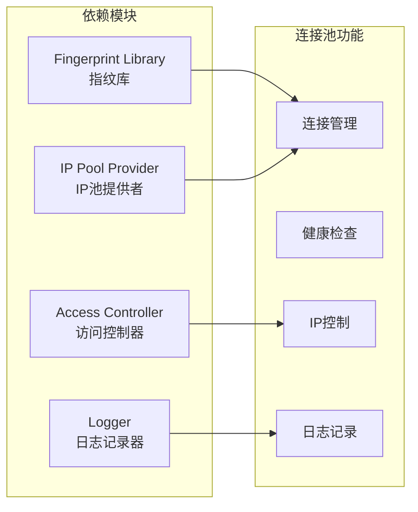

**章节来源**
- [utlshotconnpool.go](file://utlsclient/utlshotconnpool.go#L321-L349)

## 并发安全设计

UTLSHotConnPool采用了多层次的并发安全设计，确保在高并发场景下的稳定运行。

### RWMutex读写锁机制

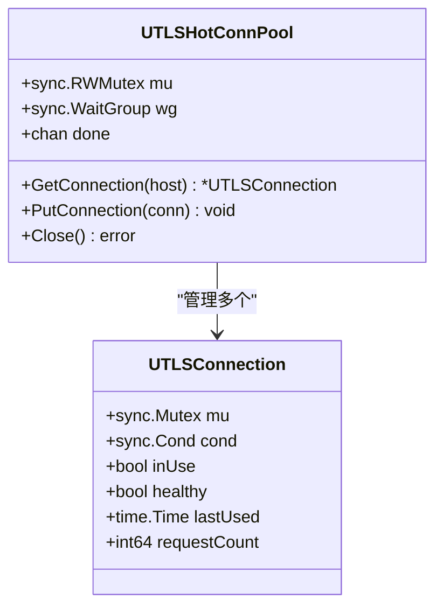

**图表来源**
- [utlshotconnpool.go](file://utlsclient/utlshotconnpool.go#L254-L258)
- [utlshotconnpool.go](file://utlsclient/utlshotconnpool.go#L231-L234)

### 并发安全层次

1. **连接池级别锁**
   - 使用`sync.RWMutex`保护连接池的共享状态
   - 读操作使用读锁，写操作使用写锁
   - 提高并发读取性能

2. **连接级别锁**
   - 每个UTLSConnection都有自己的`sync.Mutex`
   - 保护连接的独占访问
   - 防止并发修改连接状态

3. **条件变量同步**
   - 使用`sync.Cond`实现连接复用的等待机制
   - 当连接不可用时，等待连接释放
   - 提高连接复用效率

### done通道设计

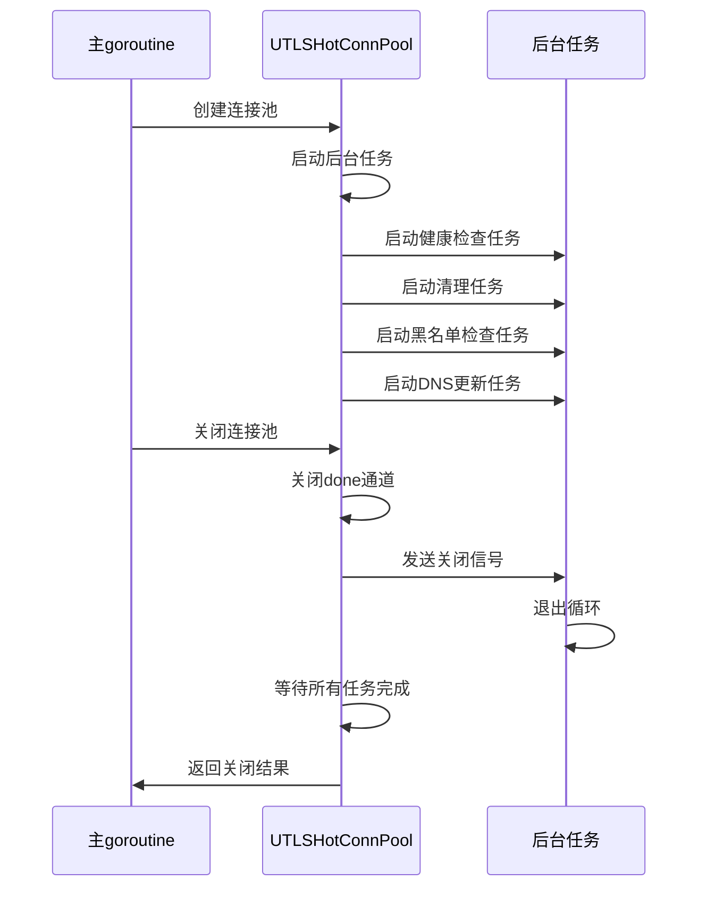

**图表来源**
- [utlshotconnpool.go](file://utlsclient/utlshotconnpool.go#L808-L826)

### 并发安全最佳实践

1. **锁的粒度控制**
   - 连接池使用粗粒度锁保护整体状态
   - 连接使用细粒度锁保护个体状态
   - 平衡并发性能和数据一致性

2. **无锁设计**
   - 使用原子操作处理计数器
   - 使用channel进行任务间的通信
   - 减少锁的竞争

3. **优雅关闭**
   - 使用done通道实现优雅关闭
   - 等待所有后台任务完成
   - 避免资源泄漏

**章节来源**
- [utlshotconnpool.go](file://utlsclient/utlshotconnpool.go#L254-L258)
- [utlshotconnpool.go](file://utlsclient/utlshotconnpool.go#L779-L785)

## 错误处理机制

UTLSHotConnPool实现了完善的错误处理机制，涵盖配置验证、连接创建、健康检查等各个环节。

### 配置验证错误

```mermaid
flowchart TD
ConfigLoad[加载配置] --> Validate{配置验证}
Validate --> |MaxConnections ≤ 0| MaxConnError[返回："max_connections 必须大于0"]
Validate --> |MaxConnsPerHost ≤ 0| MaxHostError[返回："max_conns_per_host 必须大于0"]
Validate --> |ConnTimeout ≤ 0| TimeoutError[返回："conn_timeout 必须大于0"]
Validate --> |验证通过| ConfigOK[配置有效]
MaxConnError --> ErrorReturn[返回错误]
MaxHostError --> ErrorReturn
TimeoutError --> ErrorReturn
ConfigOK --> Continue[继续创建]
```

**图表来源**
- [utlshotconnpool.go](file://utlsclient/utlshotconnpool.go#L117-L135)

### 连接创建错误处理

连接创建过程中可能遇到的错误类型：

| 错误类型 | 错误描述 | 处理方式 |
|----------|----------|----------|
| 地址解析失败 | 无法解析目标域名 | 尝试下一个IP |
| TCP连接失败 | 建立TCP连接失败 | 标记IP不可用，重试 |
| TLS握手失败 | TLS握手过程出错 | 记录错误，放弃连接 |
| 连接超时 | 连接建立超时 | 重试或放弃 |
| 验证失败 | 连接验证不通过 | 标记连接不健康 |

### 健康检查错误处理

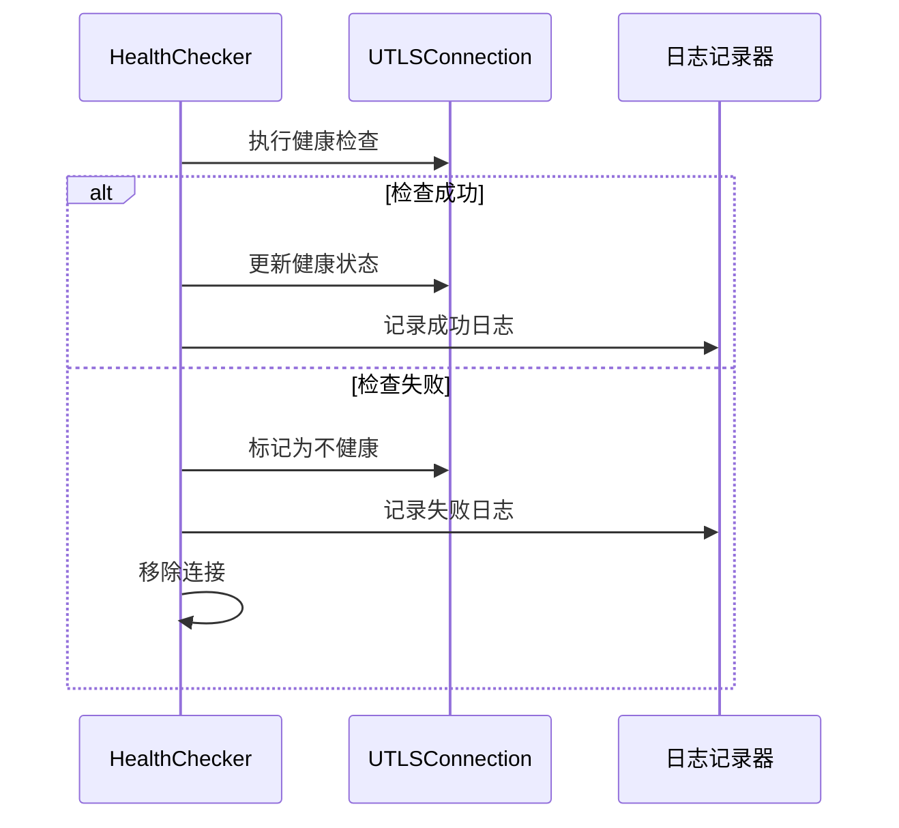

**图表来源**
- [health_checker.go](file://utlsclient/health_checker.go#L36-L60)

### 错误恢复机制

1. **自动重试**
   - 连接创建失败时自动重试
   - 重试次数受MaxRetries限制
   - 重试间隔递增

2. **连接替换**
   - 健康检查失败时自动移除连接
   - 创建新的连接替换失败连接
   - 维持连接池容量

3. **IP黑名单管理**
   - 连续失败的IP自动加入黑名单
   - 定期检查黑名单中的IP是否恢复
   - 自动移除可恢复的IP

### 错误分类与处理策略

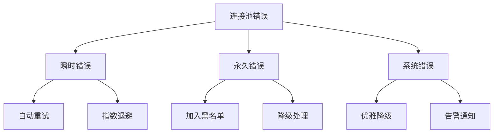

**章节来源**
- [utlshotconnpool.go](file://utlsclient/utlshotconnpool.go#L117-L135)
- [health_checker.go](file://utlsclient/health_checker.go#L36-L60)

## 使用示例

以下是完整的UTLSHotConnPool连接池创建和使用示例：

### 基础使用示例

```go
// 创建连接池（使用默认配置）
pool := utlsclient.NewUTLSHotConnPool(nil)

// 设置依赖模块
pool.SetDependencies(
    fingerprintLib,    // TLS指纹库
    ipPool,            // IP池提供者
    accessController,  // 访问控制器
    logger,            // 日志记录器
)

// 获取连接
conn, err := pool.GetConnection("example.com")
if err != nil {
    log.Fatalf("获取连接失败: %v", err)
}

// 使用连接进行HTTP请求
client := utlsclient.NewUTLSClient(conn)
resp, err := client.Get("https://example.com")
// 处理响应...

// 归还连接
pool.PutConnection(conn)

// 关闭连接池
pool.Close()
```

### 配置文件加载示例

```go
// 从配置文件加载配置
config, whitelist, blacklist, err := utlsclient.LoadConfigFromTOML("config.toml")
if err != nil {
    log.Fatalf("加载配置失败: %v", err)
}

// 创建连接池
pool := utlsclient.NewUTLSHotConnPool(config)

// 设置白名单
if len(whitelist) > 0 {
    // 这里需要实现设置白名单的逻辑
    fmt.Printf("设置白名单: %v\n", whitelist)
}

// 设置黑名单
if len(blacklist) > 0 {
    // 这里需要实现设置黑名单的逻辑
    fmt.Printf("设置黑名单: %v\n", blacklist)
}
```

### 高级使用示例

```go
// 创建连接池
pool := utlsclient.NewUTLSHotConnPool(nil)

// 获取带路径验证的连接（推荐）
conn, err := pool.GetConnectionWithValidation("https://api.example.com/v1/data")
if err != nil {
    log.Fatalf("获取验证连接失败: %v", err)
}

// 使用连接进行复杂请求
req := &http.Request{
    Method: "POST",
    URL: &url.URL{
        Scheme: "https",
        Host:   "api.example.com",
        Path:   "/v1/data",
    },
    Header: make(http.Header),
    Body:   ioutil.NopCloser(strings.NewReader(`{"key":"value"}`)),
}

client := utlsclient.NewUTLSClient(conn)
resp, err := client.Do(req)
// 处理响应...

// 查看连接池统计信息
stats := pool.GetStats()
fmt.Printf("连接池统计: 总连接数=%d, 健康连接数=%d\n",
    stats.TotalConnections, stats.HealthyConnections)

// 检查连接池健康状态
if pool.IsHealthy() {
    fmt.Println("连接池状态健康")
} else {
    fmt.Println("连接池状态不健康")
}

// 关闭连接池
pool.Close()
```

**章节来源**
- [example_hotconnpool_usage.go](file://examples/utlsclient/example_hotconnpool_usage.go#L18-L135)
- [example_hotconnpool_usage.go](file://examples/utlsclient/example_hotconnpool_usage.go#L137-L150)
- [example_hotconnpool_usage.go](file://examples/utlsclient/example_hotconnpool_usage.go#L152-L277)

## 最佳实践建议

### 配置优化建议

1. **合理设置连接池大小**
   - MaxConnections：根据并发需求设置，通常为CPU核心数的2-4倍
   - MaxConnsPerHost：避免对单一主机造成过大压力
   - MaxIdleConns：保持适量的空闲连接

2. **调整超时参数**
   - ConnTimeout：根据网络状况设置合适的连接超时
   - IdleTimeout：平衡内存使用和连接复用
   - TestTimeout：确保足够的时间进行连接验证

3. **监控关键指标**
   - 连接池利用率
   - 连接健康率
   - 错误率和重试率
   - DNS更新频率

### 性能优化建议

1. **连接复用策略**
   - 优先使用`GetConnectionWithValidation`获取经过验证的连接
   - 合理设置健康检查间隔
   - 及时归还不再使用的连接

2. **并发控制**
   - 使用适当的并发数访问连接池
   - 避免过度竞争导致的性能下降
   - 考虑使用连接池的统计信息进行动态调整

3. **资源管理**
   - 及时关闭不再使用的连接池
   - 监控内存使用情况
   - 定期清理无用的连接

### 故障排查建议

1. **常见问题诊断**
   - 连接创建失败：检查网络连通性和DNS解析
   - 连接频繁断开：检查防火墙设置和负载均衡
   - 性能下降：检查连接池配置和资源使用

2. **日志分析**
   - 启用详细日志记录
   - 关注连接创建、验证和销毁的关键事件
   - 分析错误模式和趋势

3. **监控指标**
   - 连接池健康状态
   - 连接成功率和响应时间
   - 错误分布和频率

### 安全考虑

1. **IP访问控制**
   - 合理配置白名单和黑名单
   - 定期审查访问权限
   - 监控异常访问行为

2. **TLS配置**
   - 使用最新的TLS版本
   - 配置适当的密码套件
   - 启用证书验证

3. **网络安全**
   - 限制连接池的暴露范围
   - 使用适当的防火墙规则
   - 定期更新安全配置

通过遵循这些最佳实践，可以充分发挥UTLSHotConnPool连接池的优势，构建高性能、高可用的网络应用程序。