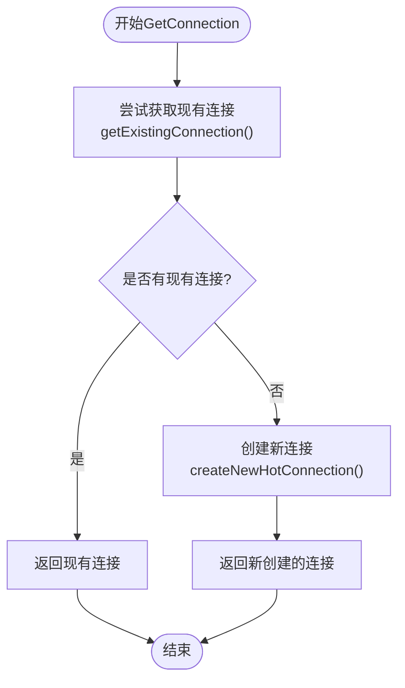
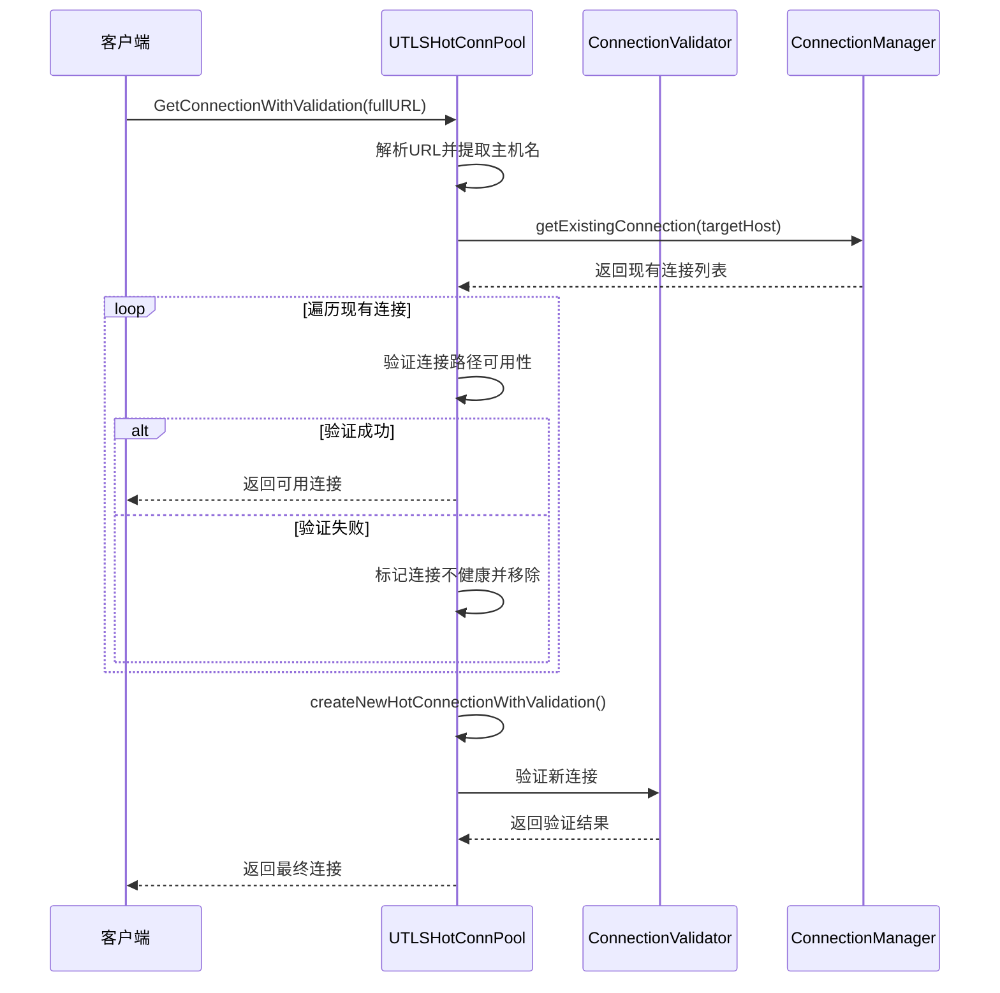
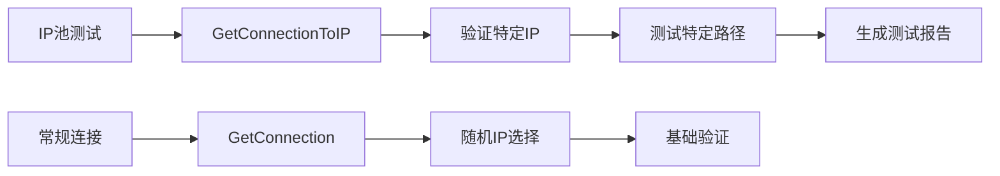
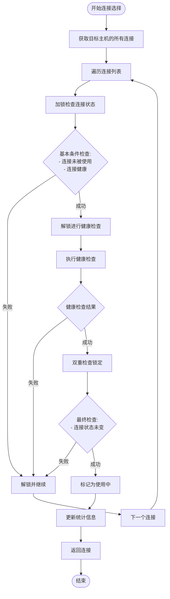
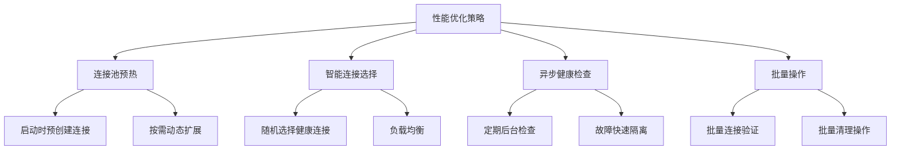
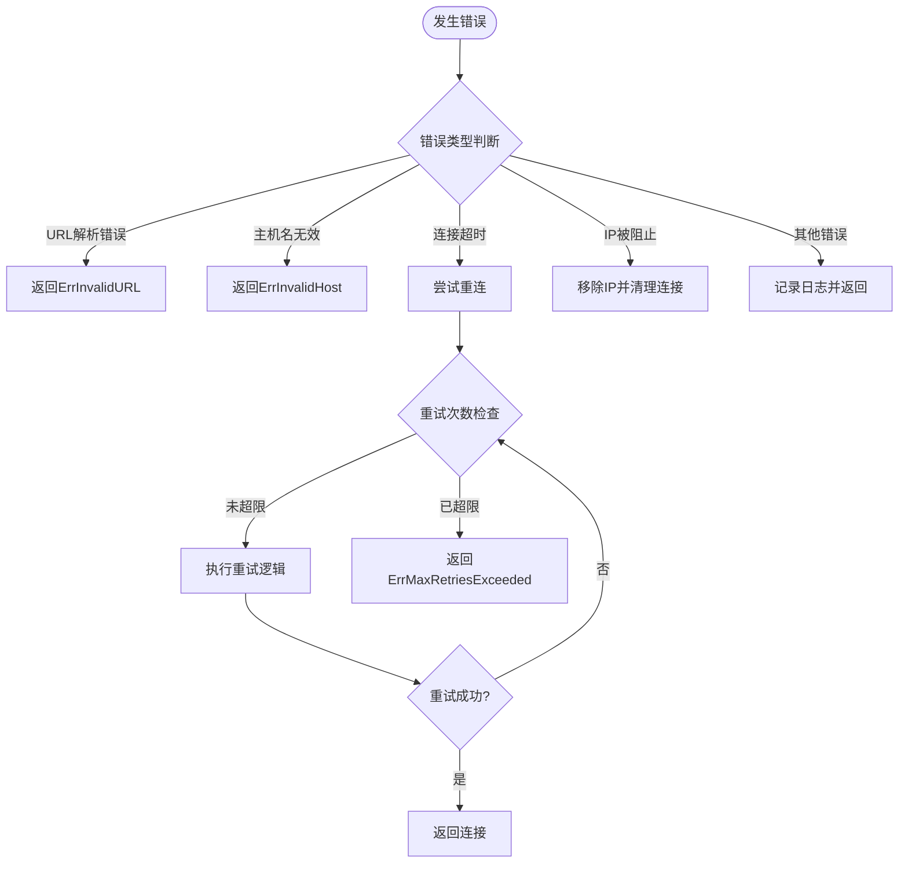
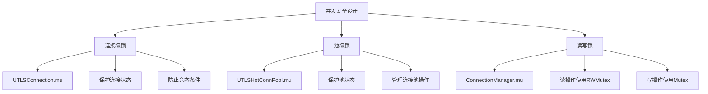

# 连接获取

<cite>
**本文档引用的文件**
- [utlshotconnpool.go](file://utlsclient/utlshotconnpool.go)
- [connection_manager.go](file://utlsclient/connection_manager.go)
- [connection_validator.go](file://utlsclient/connection_validator.go)
- [example_hotconnpool_usage.go](file://examples/utlsclient/example_hotconnpool_usage.go)
- [utlshotconnpool_test.go](file://test/utlsclient/utlshotconnpool_test.go)
- [constants.go](file://utlsclient/constants.go)
</cite>

## 目录
1. [概述](#概述)
2. [核心接口](#核心接口)
3. [GetConnection方法详解](#getconnection方法详解)
4. [GetConnectionWithValidation方法详解](#getconnectionwithvalidation方法详解)
5. [GetConnectionToIP方法详解](#getconnectiontoip方法详解)
6. [内部连接选择机制](#内部连接选择机制)
7. [性能特征分析](#性能特征分析)
8. [错误处理机制](#错误处理机制)
9. [并发安全设计](#并发安全设计)
10. [最佳实践指南](#最佳实践指南)

## 概述

UTLSHotConnPool API提供了三种主要的连接获取方法，每种方法针对不同的使用场景进行了优化。这些方法共同构成了一个智能的连接管理系统，能够根据当前可用连接的状态动态选择最优的连接策略。

## 核心接口

HotConnPool接口定义了连接池的核心功能：

```mermaid
classDiagram
class HotConnPool {
<<interface>>
+GetConnection(targetHost string) (*UTLSConnection, error)
+GetConnectionWithValidation(fullURL string) (*UTLSConnection, error)
+GetConnectionToIP(fullURL, targetIP string) (*UTLSConnection, error)
+PutConnection(conn *UTLSConnection)
+GetStats() PoolStats
+IsHealthy() bool
+Close() error
}
class UTLSHotConnPool {
-connManager *ConnectionManager
-healthChecker *HealthChecker
-validator *ConnectionValidator
-ipAccessCtrl *IPAccessController
-config PoolConfig
-stats PoolStats
-mu sync.RWMutex
-done chan struct{}
-wg sync.WaitGroup
}
HotConnPool <|-- UTLSHotConnPool : 实现
```

**图表来源**
- [utlshotconnpool.go](file://utlsclient/utlshotconnpool.go#L24-L50)

## GetConnection方法详解

GetConnection方法采用两步策略来获取连接：优先尝试获取现有热连接，如果失败则创建新的热连接。

### 方法流程图



**图表来源**
- [utlshotconnpool.go](file://utlsclient/utlshotconnpool.go#L351-L360)

### 实现逻辑分析

GetConnection方法的核心实现遵循以下步骤：

1. **现有连接查找**：调用`getExistingConnection()`方法尝试从连接池中获取可用的热连接
2. **连接有效性验证**：系统自动验证连接的健康状态和可用性
3. **负载均衡**：当存在多个可用连接时，系统会随机选择一个健康的连接
4. **连接复用**：成功获取的连接会被标记为正在使用状态

**章节来源**
- [utlshotconnpool.go](file://utlsclient/utlshotconnpool.go#L351-L360)

## GetConnectionWithValidation方法详解

GetConnectionWithValidation方法提供了最严格的连接验证机制，确保连接不仅可用而且能够正确响应指定路径的请求。

### 方法架构



**图表来源**
- [utlshotconnpool.go](file://utlsclient/utlshotconnpool.go#L362-L396)

### URL解析与验证流程

该方法的验证过程包括：

1. **URL完整性检查**：验证输入的完整URL格式正确性
2. **协议验证**：确保使用HTTPS协议
3. **主机名提取**：从URL中提取目标主机名
4. **现有连接验证**：对现有连接进行路径级别的可用性验证
5. **新连接创建**：如果现有连接不可用，则创建并验证新连接

**章节来源**
- [utlshotconnpool.go](file://utlsclient/utlshotconnpool.go#L362-L396)

## GetConnectionToIP方法详解

GetConnectionToIP方法专门用于IP池测试场景，允许直接连接到指定的IP地址并验证其特定路径的可用性。

### 特殊用途设计

该方法的主要特点：

- **直接IP连接**：绕过DNS解析，直接连接到指定IP地址
- **精确路径验证**：验证指定IP上的特定路径是否可访问
- **IP专用管理**：专门为IP池测试和监控设计
- **严格验证**：执行与GetConnectionWithValidation相同的验证流程

### 使用场景



**图表来源**
- [utlshotconnpool.go](file://utlsclient/utlshotconnpool.go#L398-L439)

**章节来源**
- [utlshotconnpool.go](file://utlsclient/utlshotconnpool.go#L398-L439)

## 内部连接选择机制

getExistingConnection内部方法实现了复杂的连接选择策略，确保在高并发环境下能够高效地选择最优连接。

### 连接选择算法



**图表来源**
- [utlshotconnpool.go](file://utlsclient/utlshotconnpool.go#L441-L479)

### 双重检查锁定机制

系统采用了双重检查锁定（Double-Check Locking）模式来防止竞态条件：

1. **第一次检查**：在解锁状态下快速检查连接的基本状态
2. **健康检查**：在解锁状态下执行耗时的健康检查
3. **第二次检查**：重新加锁后进行最终的状态确认
4. **原子操作**：确保连接状态的一致性

**章节来源**
- [utlshotconnpool.go](file://utlsclient/utlshotconnpool.go#L441-L479)

## 性能特征分析

### 时间复杂度分析

| 方法 | 时间复杂度 | 空间复杂度 | 说明 |
|------|------------|------------|------|
| GetConnection | O(n) | O(1) | n为该主机的连接数量 |
| GetConnectionWithValidation | O(n) | O(1) | 包含额外的路径验证开销 |
| GetConnectionToIP | O(m) | O(1) | m为该主机的连接数量，但需匹配特定IP |
| getExistingConnection | O(n) | O(1) | 遍历连接列表进行筛选 |

### 高并发性能特性

1. **读写分离**：使用读写锁实现高效的并发访问
2. **无锁读取**：大部分查询操作使用读锁，减少锁竞争
3. **连接复用**：最大化连接复用率，减少连接建立开销
4. **异步维护**：后台任务独立运行，不影响主线程性能

### 性能优化策略



## 错误处理机制

### 错误类型分类

系统定义了多种错误类型来处理不同的异常情况：

| 错误类型 | 描述 | 处理策略 |
|----------|------|----------|
| ErrInvalidURL | 无效的URL格式 | 返回解析失败错误 |
| ErrInvalidHost | 无效的主机名 | 拒绝连接请求 |
| ErrConnectionTimeout | 连接超时 | 尝试重连或返回错误 |
| ErrIPBlocked | IP被阻止访问 | 移除IP并尝试其他IP |
| ErrMaxRetriesExceeded | 超过最大重试次数 | 返回最终错误 |

### 错误处理流程



**图表来源**
- [constants.go](file://utlsclient/constants.go#L73-L84)

### 主机名验证

系统对主机名进行严格的验证：

1. **格式检查**：确保主机名符合DNS规范
2. **协议支持**：只支持HTTPS协议
3. **空值检查**：防止空主机名导致的连接问题
4. **字符编码**：处理国际化域名和特殊字符

**章节来源**
- [constants.go](file://utlsclient/constants.go#L73-L84)

## 并发安全设计

### 锁机制设计

系统采用了多层次的锁机制来保证并发安全：



**图表来源**
- [utlshotconnpool.go](file://utlsclient/utlshotconnpool.go#L231-L234)
- [connection_manager.go](file://utlsclient/connection_manager.go#L10-L11)

### 双重检查锁定实现

系统在连接选择过程中实现了双重检查锁定模式：

1. **第一次检查**：在解锁状态下快速检查连接状态
2. **健康检查**：在解锁状态下执行耗时的健康检查
3. **第二次检查**：重新加锁后进行最终的状态确认

这种设计避免了长时间持有锁，提高了并发性能。

**章节来源**
- [utlshotconnpool.go](file://utlsclient/utlshotconnpool.go#L455-L479)

## 最佳实践指南

### 使用建议

1. **优先使用GetConnection**：对于大多数场景，GetConnection提供了良好的性能和可靠性平衡
2. **路径验证场景使用GetConnectionWithValidation**：当需要确保特定路径可用时使用此方法
3. **IP池测试使用GetConnectionToIP**：专门用于IP池的监控和测试
4. **连接复用**：及时调用PutConnection归还连接，提高连接复用率

### 性能优化建议

1. **合理配置连接池参数**：根据应用负载调整最大连接数和超时设置
2. **启用健康检查**：定期执行健康检查以维持连接池质量
3. **监控连接统计**：关注连接池的使用情况和成功率指标
4. **预热连接池**：在高负载前预先创建必要的连接

### 故障排除指南

1. **连接失败排查**：
   - 检查网络连接状态
   - 验证目标服务器可达性
   - 确认TLS证书有效性

2. **性能问题诊断**：
   - 监控连接池统计信息
   - 分析连接创建和销毁频率
   - 检查健康检查配置

3. **内存泄漏预防**：
   - 确保正确归还连接
   - 定期清理过期连接
   - 监控连接池大小增长

**章节来源**
- [example_hotconnpool_usage.go](file://examples/utlsclient/example_hotconnpool_usage.go#L46-L116)