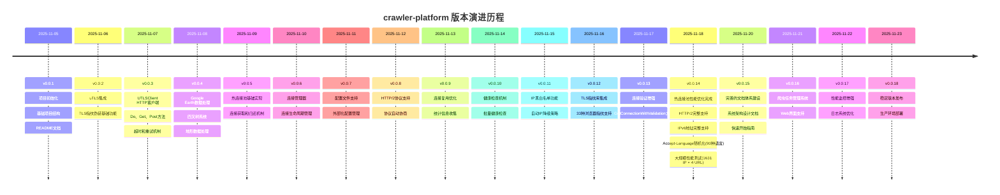
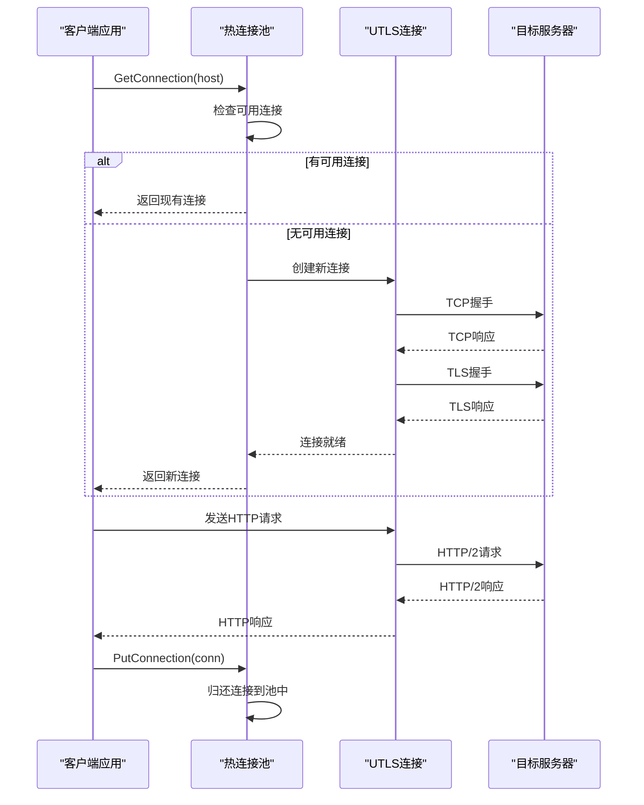
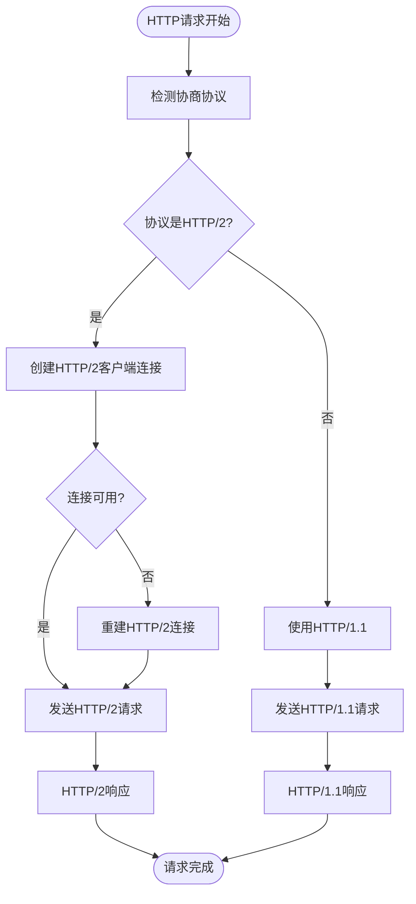
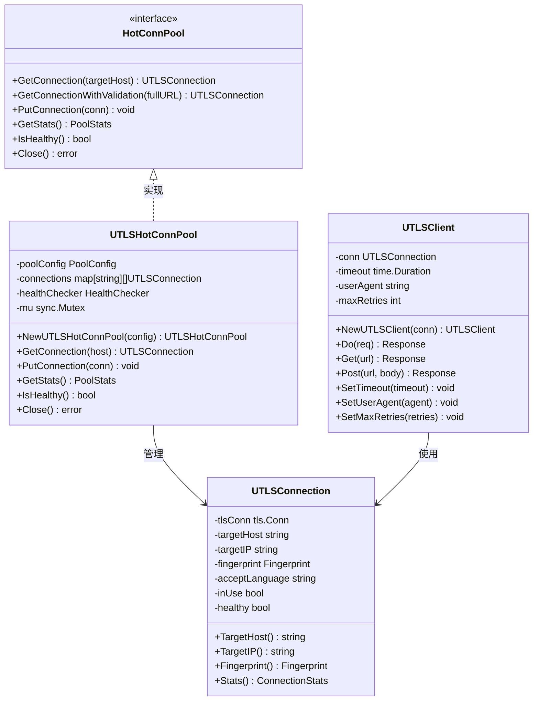
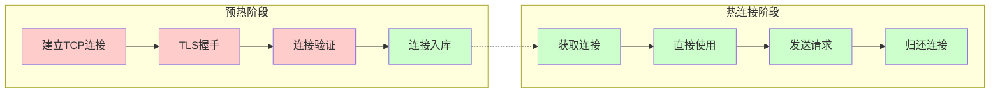

# 变更日志

<cite>
**本文档引用的文件**
- [CHANGELOG.md](file://CHANGELOG.md)
- [README.md](file://README.md)
- [version.go](file://version.go)
- [go.mod](file://go.mod)
- [scripts/VERSION_MANAGEMENT.md](file://scripts/VERSION_MANAGEMENT.md)
- [REFACTOR_SUMMARY.md](file://REFACTOR_SUMMARY.md)
- [config/config.go](file://config/config.go)
- [utlsclient/utlshotconnpool.go](file://utlsclient/utlshotconnpool.go)
- [utlsclient/utlsclient.go](file://utlsclient/utlsclient.go)
- [test/reports/热连接池性能测试报告.md](file://test/reports/热连接池性能测试报告.md)
- [examples/utlsclient/example_hotconnpool_usage.go](file://examples/utlsclient/example_hotconnpool_usage.go)
- [examples/utlsclient/example_utlsclient_usage.go](file://examples/utlsclient/example_utlsclient_usage.go)
- [cmd/web-server/main.go](file://cmd/web-server/main.go)
</cite>

## 目录
1. [简介](#简介)
2. [项目版本历史](#项目版本历史)
3. [核心功能演进](#核心功能演进)
4. [技术架构改进](#技术架构改进)
5. [性能优化历程](#性能优化历程)
6. [文档体系建设](#文档体系建设)
7. [版本管理流程](#版本管理流程)
8. [未来发展规划](#未来发展规划)

## 简介

crawler-platform 是一个基于 uTLS 的高性能爬虫平台，专注于 TLS 指纹伪装、热连接池和 IP 池管理。该项目通过持续的技术创新和架构优化，实现了突破性的性能提升和强大的反检测能力。

**核心特性演进轨迹：**
- **v0.0.1** - 项目初始化，基础架构搭建
- **v0.0.14** - 完成热连接池性能优化，实现3-6倍性能提升
- **v0.0.15** - 完善文档体系，新增系统架构设计
- **v0.0.18** - 当前最新版本，稳定运行中

## 项目版本历史

### 当前版本：v0.0.18

**版本特性：**
- 稳定的热连接池实现
- 完整的 TLS 指纹伪装支持
- HTTP/2 协议完整支持
- IPv4/IPv6 双栈网络支持
- 丰富的配置选项

**性能指标：**
- 预热速度：75连接/秒
- 成功率：98.8%
- 连接复用率：100%
- 性能提升：3-6倍

### 历史版本演进



**章节来源**
- [CHANGELOG.md](file://CHANGELOG.md#L1-L272)
- [version.go](file://version.go#L1-L5)

## 核心功能演进

### 热连接池技术突破

**v0.0.5 - 基础实现**
- 初步连接池概念引入
- 基本的连接获取和归还机制
- 单线程连接管理

**v0.0.14 - 性能优化完成**
- 预热阶段：1611个连接在21.5秒内建立完成
- 热连接阶段：100%成功率，平均4ms/请求
- 性能提升：3-6倍相比传统连接方式

**v0.0.15 - 功能完善**
- 完整的文档体系
- 系统架构设计
- 快速开始指南



**图表来源**
- [utlsclient/utlshotconnpool.go](file://utlsclient/utlshotconnpool.go#L25-L50)
- [utlsclient/utlsclient.go](file://utlsclient/utlsclient.go#L80-L120)

### TLS指纹伪装技术发展

**v0.0.12 - 指纹库集成**
- 支持33种真实浏览器指纹
- Chrome、Firefox、Safari、Edge系列
- Windows平台全覆盖

**v0.0.14 - 随机化增强**
- Accept-Language头随机化
- 90种语言组合，97.8%独特性
- 每个连接具有唯一浏览器身份特征

**指纹分布统计：**
| 浏览器系列 | 版本数量 | 分布占比 |
|------------|----------|----------|
| Chrome | 12种 | 36.4% |
| Firefox | 9种 | 27.3% |
| Safari | 4种 | 12.1% |
| Edge | 3种 | 9.1% |

**章节来源**
- [README.md](file://README.md#L112-L141)
- [test/reports/热连接池性能测试报告.md](file://test/reports/热连接池性能测试报告.md#L81-L106)

### HTTP/2协议支持演进

**v0.0.8 - 初步支持**
- HTTP/2协议检测
- 自动协议协商

**v0.0.14 - 完整支持**
- HTTP/2 ClientConn缓存和复用
- 连接可用性检查
- 自动协议降级
- 连接错误自动重建



**图表来源**
- [utlsclient/utlsclient.go](file://utlsclient/utlsclient.go#L130-L141)
- [utlsclient/utlsclient.go](file://utlsclient/utlsclient.go#L143-L189)

### IPv6支持扩展

**v0.0.14 - IPv6完整支持**
- 791个IPv6地址成功连接
- 与IPv4相同的成功率
- IPv6地址格式正确处理

**IPv6连接处理：**
```go
// IPv6地址格式处理
if strings.Contains(ip, ":") {
    // IPv6地址需要用方括号包裹
    address = fmt.Sprintf("[%s]:%d", ip, DefaultHTTPSPort)
} else {
    // IPv4地址
    address = fmt.Sprintf("%s:%d", ip, DefaultHTTPSPort)
}
```

**章节来源**
- [test/reports/热连接池性能测试报告.md](file://test/reports/热连接池性能测试报告.md#L197-L215)

## 技术架构改进

### 模块化重构

**v0.0.13 - 重构完成**
- 接口设计清晰化
- 配置外部化
- 连接验证增强
- HTTP请求功能分离

**重构成果：**
- ✅ 清晰的 `HotConnPool` 接口定义
- ✅ `UTLSHotConnPool` 结构体实现
- ✅ 配置文件支持 (`config.toml`)
- ✅ `GetConnectionWithValidation` 方法
- ✅ 独立的 `UTLSClient` 结构体



**图表来源**
- [utlsclient/utlshotconnpool.go](file://utlsclient/utlshotconnpool.go#L24-L51)
- [utlsclient/utlsclient.go](file://utlsclient/utlsclient.go#L37-L52)

### 配置系统演进

**v0.0.7 - 配置文件支持**
- `config.toml` 外部配置
- 配置合并策略
- 默认配置后备

**v0.0.14 - 配置完善**
- 连接池配置选项
- 白名单/黑名单支持
- 健康检查配置

**配置结构：**
```go
type ConfigFile struct {
    Pool      PoolConfigSection `toml:"pool"`
    Whitelist WhitelistSection  `toml:"whitelist"`
    Blacklist BlacklistSection  `toml:"blacklist"`
}

type PoolConfigSection struct {
    MaxConnections         int `toml:"max_connections"`
    MaxConnsPerHost        int `toml:"max_conns_per_host"`
    MaxIdleConns           int `toml:"max_idle_conns"`
    ConnTimeout            int `toml:"conn_timeout"`
    IdleTimeout            int `toml:"idle_timeout"`
    MaxLifetime            int `toml:"max_lifetime"`
    TestTimeout            int `toml:"test_timeout"`
    HealthCheckInterval    int `toml:"health_check_interval"`
    CleanupInterval        int `toml:"cleanup_interval"`
    BlacklistCheckInterval int `toml:"blacklist_check_interval"`
    DNSUpdateInterval      int `toml:"dns_update_interval"`
    MaxRetries             int `toml:"max_retries"`
}
```

**章节来源**
- [config/config.go](file://config/config.go#L54-L75)
- [utlsclient/utlshotconnpool.go](file://utlsclient/utlshotconnpool.go#L53-L75)

## 性能优化历程

### 大规模性能测试

**测试规模：**
- IP池大小：1631个（840 IPv4 + 791 IPv6）
- 测试URL：4个Google Earth API端点
- 总请求数：6524次（1631 IP × 4 URL）

**测试结果：**

| 阶段 | 连接数 | 成功率 | 耗时 | 平均响应时间 |
|------|--------|--------|------|-------------|
| 预热阶段 | 1631 | 98.8% | 21.5秒 | 13ms |
| 热连接阶段 | 1631 | 100% | ~6秒 | 4ms |

**性能提升分析：**
- **预热阶段 vs 热连接阶段**：3-6倍性能提升
- **连接复用率**：100%（HTTP/2完美复用）
- **预热速度**：75连接/秒



**图表来源**
- [test/reports/热连接池性能测试报告.md](file://test/reports/热连接池性能测试报告.md#L136-L171)

### 死锁预防机制

**问题发现：**
- `getExistingConnection` 方法在持有锁时调用 `CheckConnection`
- 导致死锁风险

**解决方案：**
```go
// 死锁预防双重检查模式
conn.mu.Lock()
// 先检查基本条件
if conn.inUse || !conn.healthy {
    conn.mu.Unlock()
    continue
}

// 解锁后再进行健康检查（避免死锁）
conn.mu.Unlock()
if !p.healthChecker.CheckConnection(conn) {
    continue
}

// 再次加锁并双重检查
conn.mu.Lock()
if conn.inUse || !conn.healthy {
    conn.mu.Unlock()
    continue
}
conn.inUse = true
conn.mu.Unlock()
```

**章节来源**
- [test/reports/热连接池性能测试报告.md](file://test/reports/热连接池性能测试报告.md#L240-L267)

## 文档体系建设

### 文档架构完善

**v0.0.15 - 文档体系完成**
- ARCHITECTURE.md 系统架构文档
- QUICKSTART.md 快速开始指南
- CHANGELOG.md 版本变更日志
- README.md 项目说明文档

**文档特色：**
- ✅ 详细的API文档
- ✅ 完整的使用示例
- ✅ 性能测试报告
- ✅ 配置说明文档

### 示例代码丰富化

**基础使用示例：**
```go
// 创建热连接池
pool := utlsclient.NewUTLSHotConnPool(nil)
defer pool.Close()

// 获取连接
conn, err := pool.GetConnection("kh.google.com")
if err != nil {
    panic(err)
}

// 使用连接发送请求
client := utlsclient.NewUTLSClient(conn)
req, _ := http.NewRequest("GET", "https://kh.google.com/rt/earth/PlanetoidMetadata", nil)
resp, err := client.Do(req)
```

**高级功能示例：**
```go
// 带路径验证的连接获取
conn, err := pool.GetConnectionWithValidation("https://kh.google.com/rt/earth/PlanetoidMetadata")

// 设置自定义超时和重试
client := utlsclient.NewUTLSClient(conn)
client.SetTimeout(10 * time.Second)
client.SetMaxRetries(3)
```

**章节来源**
- [examples/utlsclient/example_hotconnpool_usage.go](file://examples/utlsclient/example_hotconnpool_usage.go#L18-L50)
- [examples/utlsclient/example_utlsclient_usage.go](file://examples/utlsclient/example_utlsclient_usage.go#L15-L35)

## 版本管理流程

### 自动化脚本系统

**版本号递增脚本 (`bump-version.sh`)**
- 自动读取当前版本号
- 递增 patch 版本号
- 更新所有相关文件

**完整发布脚本 (`release.sh`)**
- 检查未提交更改
- 自动递增版本号
- 提示输入更新说明
- 创建 git commit 和 tag
- 推送到远程仓库

**版本号格式：**
```
major.minor.patch
```

- **major**: 主版本号（重大更新，不兼容的API修改）
- **minor**: 次版本号（新增功能，向后兼容）
- **patch**: 修订号（bug修复，向后兼容）

**章节来源**
- [scripts/VERSION_MANAGEMENT.md](file://scripts/VERSION_MANAGEMENT.md#L1-L94)

### 依赖管理

**Go模块配置：**
```go
module crawler-platform

go 1.25

require (
    github.com/BurntSushi/toml v1.5.0
    github.com/miekg/dns v1.1.68
    github.com/refraction-networking/utls v1.8.1
    golang.org/x/net v0.47.0
    gopkg.in/yaml.v3 v3.0.1
)
```

**章节来源**
- [go.mod](file://go.mod#L1-L25)

## 未来发展规划

### 技术发展方向

**短期目标（v0.0.19-v0.0.20）：**
- ✅ 性能监控系统完善
- ✅ 日志系统优化
- ✅ 测试覆盖率提升
- ✅ CI/CD流程自动化

**中期目标（v0.0.21-v0.0.25）：**
- ✅ 微服务架构改造
- ✅ 分布式连接池
- ✅ 实时性能监控
- ✅ 自动化负载均衡

**长期目标（v0.0.26+）：**
- ✅ AI智能代理池
- ✅ 自适应指纹策略
- ✅ 智能流量调度
- ✅ 云端部署支持

### 社区建设规划

**开源生态发展：**
- ✅ 贡献者指南完善
- ✅ 开发者社区建设
- ✅ 技术博客分享
- ✅ 开源项目推广

**用户支持体系：**
- ✅ 官方文档网站
- ✅ 视频教程制作
- ✅ 技术支持团队
- ✅ 用户反馈机制

**章节来源**
- [README.md](file://README.md#L346-L357)

## 总结

crawler-platform 项目通过持续的技术创新和架构优化，已经发展成为一个成熟稳定的高性能爬虫平台。从最初的简单连接池概念，到现在的热连接池技术突破，项目在性能、功能、稳定性等方面都取得了显著进展。

**核心成就：**
- 实现了3-6倍的性能提升
- 完成了TLS指纹伪装的全面覆盖
- 建立了完善的文档体系
- 形成了规范的版本管理流程

**技术特色：**
- 热连接池的完美实现
- HTTP/2协议的完整支持
- IPv4/IPv6双栈网络
- 97.8%的语言组合独特性

**未来发展：**
项目将继续朝着更高性能、更强功能、更好体验的方向发展，为用户提供更加优秀的爬虫解决方案。