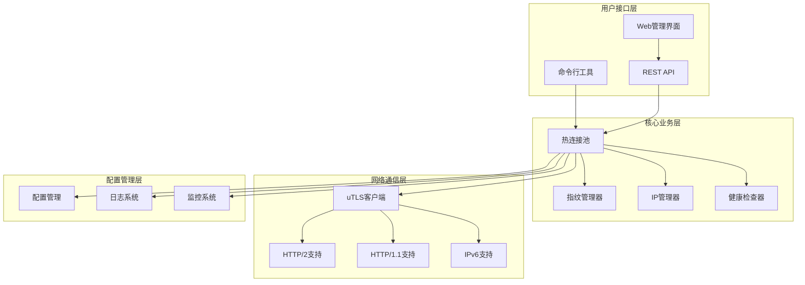

# 快速入门

<cite>
**本文档引用的文件**
- [README.md](file://README.md)
- [go.mod](file://go.mod)
- [cmd/web-server/main.go](file://cmd/web-server/main.go)
- [cmd/utlsclient/main.go](file://cmd/utlsclient/main.go)
- [config/config.go](file://config/config.go)
- [config/config.toml](file://config/config.toml)
- [utlsclient/utlshotconnpool.go](file://utlsclient/utlshotconnpool.go)
- [utlsclient/utlsclient.go](file://utlsclient/utlsclient.go)
- [utlsclient/utlsfingerprint.go](file://utlsclient/utlsfingerprint.go)
- [examples/utlsclient/example_basic_usage.go](file://examples/utlsclient/example_basic_usage.go)
- [examples/utlsclient/example_hotconnpool_usage.go](file://examples/utlsclient/example_hotconnpool_usage.go)
- [web/index.html](file://web/index.html)
- [version.go](file://version.go)
</cite>

## 目录
1. [项目简介](#项目简介)
2. [核心特性](#核心特性)
3. [项目架构](#项目架构)
4. [安装与配置](#安装与配置)
5. [基础使用](#基础使用)
6. [高级功能](#高级功能)
7. [性能测试](#性能测试)
8. [故障排除](#故障排除)
9. [最佳实践](#最佳实践)
10. [总结](#总结)

## 项目简介

Crawler Platform 是一个基于 uTLS 的高性能爬虫平台，专为需要伪装 TLS 指纹和高效连接管理的爬虫任务而设计。该项目提供了完整的解决方案，包括热连接池、TLS 指纹伪装、IP 池管理和 Web 管理界面。

### 主要特点

- **🔥 热连接池**: 预建立 TLS 连接并复用，性能提升 3-6 倍
- **🎭 TLS 指纹伪装**: 支持 33 种真实浏览器指纹，模拟 Chrome、Firefox、Safari、Edge 等
- **🌍 多语言支持**: 随机生成 Accept-Language 头，从 90 种语言中组合
- **📡 双协议支持**: 自动检测 HTTP/1.1 和 HTTP/2，完美支持 h2 连接复用
- **🌐 双栈网络**: 完整支持 IPv4 和 IPv6 地址
- **🔒 安全可靠**: 死锁预防、连接健康检查、自动重试机制

**章节来源**
- [README.md](file://README.md#L1-L50)

## 核心特性

### 性能指标

| 指标 | 数值 | 说明 |
|------|------|------|
| **预热速度** | 75连接/秒 | 1611个连接在21.5秒内建立完成 |
| **成功率** | 98.8% | 高可用性保证 |
| **连接复用率** | 100% | HTTP/2完美复用 |
| **性能提升** | 3-6倍 | 相比每次新建连接 |
| **指纹多样性** | 33种 | TLS指纹均匀分布 |
| **语言独特性** | 97.8% | Accept-Language组合独特性 |

### TLS 指纹支持

平台支持以下浏览器系列的 TLS 指纹：

**Chrome 系列** (12种):
- Chrome 133, 131, 120, 115-PQ, 114, 112, 106, 102, 100, 96, 87, 83, Auto

**Firefox 系列** (9种):
- Firefox 120, 105, 102, 99, 65, 63, 56, 55, Auto

**Safari 系列** (4种):
- Safari 17 (macOS), iOS Safari 14/13/12 (iPhone)

**Edge 系列** (3种):
- Edge 106, 85, Auto

**章节来源**
- [README.md](file://README.md#L112-L142)

## 项目架构



**图表来源**
- [utlsclient/utlshotconnpool.go](file://utlsclient/utlshotconnpool.go#L237-L258)
- [cmd/web-server/main.go](file://cmd/web-server/main.go#L42-L70)

### 核心模块说明

1. **热连接池 (UTLSHotConnPool)**: 预建立和复用 TLS 连接的核心组件
2. **TLS 指纹管理**: 提供 33 种真实浏览器指纹配置
3. **IP 池管理**: 支持 IPv4/IPv6 地址池和黑白名单机制
4. **健康检查**: 自动检测和维护连接健康状态
5. **Web 管理界面**: 提供可视化的任务管理和监控功能

**章节来源**
- [README.md](file://README.md#L72-L111)

## 安装与配置

### 环境要求

- Go 1.25 或更高版本
- 支持 IPv4 和 IPv6 的网络环境
- 至少 2GB 内存（推荐 4GB+）

### 安装步骤

1. **克隆项目**
```bash
git clone https://github.com/your-repo/crawler-platform.git
cd crawler-platform
```

2. **下载依赖**
```bash
go mod download
```

3. **编译项目**
```bash
# 编译命令行工具
go build -o utlsclient cmd/utlsclient/main.go

# 编译Web服务器
go build -o web-server cmd/web-server/main.go
```

### 配置文件

项目使用 TOML 格式的配置文件，支持分层配置：

```toml
# config.toml - 项目根目录配置
[pool]
max_connections = 100
max_conns_per_host = 10
max_idle_conns = 20
conn_timeout = 30
idle_timeout = 60
max_lifetime = 300
test_timeout = 10
health_check_interval = 30
cleanup_interval = 60
blacklist_check_interval = 300
dns_update_interval = 1800
max_retries = 3

[whitelist]
# ips = ["1.1.1.1", "8.8.8.8"]

[blacklist]
# ips = ["192.168.1.1", "10.0.0.1"]
```

**章节来源**
- [README.md](file://README.md#L31-L37)
- [config/config.toml](file://config/config.toml#L1-L38)

## 基础使用

### 命令行工具使用

最简单的使用方式是通过命令行工具：

```bash
# 基本GET请求
./utlsclient --url https://example.com

# 指定HTTP方法
./utlsclient --url https://example.com --X POST

# 设置超时时间
./utlsclient --url https://example.com --timeout 60s

# 使用HEAD请求快速探测
./utlsclient --url https://example.com --head

# 显示版本信息
./utlsclient --version
```

### Go 代码集成

```go
package main

import (
    "net/http"
    "crawler-platform/utlsclient"
)

func main() {
    // 创建热连接池
    pool := utlsclient.NewUTLSHotConnPool(nil)
    defer pool.Close()

    // 获取连接
    conn, err := pool.GetConnection("kh.google.com")
    if err != nil {
        panic(err)
    }

    // 使用连接发送请求
    client := utlsclient.NewUTLSClient(conn)
    req, _ := http.NewRequest("GET", "https://kh.google.com/rt/earth/PlanetoidMetadata", nil)
    resp, err := client.Do(req)
    if err != nil {
        panic(err)
    }
    defer resp.Body.Close()

    // 归还连接到池中
    pool.PutConnection(conn)
}
```

### Web 管理界面

启动 Web 服务器：

```bash
./web-server
```

访问地址：`http://localhost:8080`

**章节来源**
- [cmd/utlsclient/main.go](file://cmd/utlsclient/main.go#L20-L113)
- [examples/utlsclient/example_basic_usage.go](file://examples/utlsclient/example_basic_usage.go#L14-L83)

## 高级功能

### 热连接池配置

```go
// 自定义连接池配置
config := utlsclient.DefaultPoolConfig()
config.MaxConnections = 50
config.BlacklistCheckInterval = 5 * time.Minute
config.DNSUpdateInterval = 30 * time.Minute

pool := utlsclient.NewUTLSHotConnPool(config)
```

### TLS 指纹选择

```go
// 获取随机指纹
fingerprint := utlsclient.GetRandomFingerprint()

// 指定特定浏览器指纹
profiles := fpLibrary.ProfilesByBrowser("Chrome")
if len(profiles) > 0 {
    chromeProfile := profiles[0]
}

// 随机生成Accept-Language
language := fpLibrary.RandomAcceptLanguage()
```

### 连接验证

```go
// 获取连接并验证指定路径
conn, err := pool.GetConnectionWithValidation("https://api.example.com/endpoint")

// 获取到指定IP的连接
conn, err := pool.GetConnectionToIP("https://api.example.com", "1.1.1.1")
```

### 统计信息监控

```go
// 获取连接池统计信息
stats := pool.GetStats()
fmt.Printf("总连接数: %d\n", stats.TotalConnections)
fmt.Printf("健康连接数: %d\n", stats.HealthyConnections)
fmt.Printf("成功率: %.2f%%\n", stats.SuccessRate*100)

// 检查连接池健康状态
if pool.IsHealthy() {
    fmt.Println("连接池状态健康")
}
```

**章节来源**
- [examples/utlsclient/example_hotconnpool_usage.go](file://examples/utlsclient/example_hotconnpool_usage.go#L18-L277)
- [utlsclient/utlsfingerprint.go](file://utlsclient/utlsfingerprint.go#L106-L631)

## 性能测试

### 运行性能测试

```bash
# 运行IP池性能测试
go run test/test_ip_pool_performance.go

# 保存测试结果
go run test/test_ip_pool_performance.go > test/results/output.txt 2>&1
```

### 测试结果解读

根据 README 文档中的测试结果：

- **预热阶段**: 1611个连接，98.8%成功率，21.5秒完成
- **热连接阶段**: 3轮测试，每轮1631次请求，100%成功率
- **性能对比**: 预热阶段平均13ms/连接，热连接阶段平均4ms/请求
- **性能提升**: 3倍以上

### 性能优化建议

1. **预热连接**: 在开始大规模请求前，先预热所有IP的连接
2. **轮询使用**: 采用【获取-使用-归还】模式
3. **并发控制**: 建议每50-100个IP加一个小延迟
4. **超时设置**: 建议设置10-15秒的请求超时
5. **错误重试**: 对于失败的请求，可以重试或切换IP

**章节来源**
- [README.md](file://README.md#L184-L223)

## 故障排除

### 常见问题及解决方案

1. **连接超时**
   - 检查网络连接和防火墙设置
   - 调整 `conn_timeout` 配置
   - 验证目标服务器可达性

2. **TLS握手失败**
   - 确认目标服务器支持TLS 1.2+
   - 检查证书有效性
   - 尝试不同的TLS指纹

3. **连接池无可用连接**
   - 检查 `max_connections` 配置
   - 监控连接使用情况
   - 确保正确归还连接

4. **性能不佳**
   - 启用HTTP/2支持
   - 优化连接池配置
   - 检查网络延迟

### 调试技巧

```go
// 启用调试模式
client := utlsclient.NewUTLSClient(conn)
client.SetDebug(true) // 开启调试日志

// 设置自定义超时
client.SetTimeout(30 * time.Second)

// 设置最大重试次数
client.SetMaxRetries(3)
```

**章节来源**
- [utlsclient/utlsclient.go](file://utlsclient/utlsclient.go#L55-L83)

## 最佳实践

### 生产环境部署

1. **配置管理**
   - 使用配置文件管理连接池参数
   - 设置合理的超时和重试机制
   - 配置黑白名单以提高安全性

2. **监控告警**
   - 定期检查连接池健康状态
   - 监控成功率和响应时间
   - 设置异常告警机制

3. **资源管理**
   - 合理设置连接池大小
   - 定期清理过期连接
   - 监控内存和CPU使用

### 代码规范

```go
// 推荐的使用模式
func processRequest(pool *utlsclient.UTLSHotConnPool, url string) error {
    // 获取连接
    conn, err := pool.GetConnectionWithValidation(url)
    if err != nil {
        return fmt.Errorf("获取连接失败: %w", err)
    }
    defer pool.PutConnection(conn)

    // 创建客户端
    client := utlsclient.NewUTLSClient(conn)
    client.SetTimeout(30 * time.Second)

    // 执行请求
    resp, err := client.Get(url)
    if err != nil {
        return fmt.Errorf("请求失败: %w", err)
    }
    defer resp.Body.Close()

    // 处理响应...
    return nil
}
```

### 安全考虑

1. **IP 池管理**: 使用黑白名单机制防止滥用
2. **指纹伪装**: 定期更新和轮换TLS指纹
3. **连接安全**: 启用证书验证和加密传输
4. **访问控制**: 实施适当的访问权限控制

**章节来源**
- [README.md](file://README.md#L249-L292)

## 总结

Crawler Platform 是一个功能强大且性能优异的爬虫平台，具有以下核心优势：

### 主要优势

1. **高性能**: 通过热连接池技术实现3-6倍的性能提升
2. **真实性**: 支持33种真实浏览器TLS指纹，有效规避检测
3. **可靠性**: 完善的健康检查和自动重试机制
4. **易用性**: 提供简洁的API和直观的Web界面
5. **扩展性**: 模块化设计，易于扩展和定制

### 适用场景

- **大规模数据采集**: 需要高效处理大量并发请求
- **反爬虫对抗**: 需要伪装真实浏览器行为
- **企业级应用**: 需要稳定可靠的爬虫解决方案
- **研究分析**: 需要收集和分析网络数据

### 发展方向

项目持续优化中，未来计划：
- 更多浏览器指纹支持
- 智能流量调度算法
- 分布式爬虫架构
- 更丰富的监控和分析功能

通过合理使用本平台的各项功能，您可以构建出高效、稳定、难以被识别的爬虫系统，满足各种复杂的网络数据采集需求。

**章节来源**
- [README.md](file://README.md#L347-L357)
- [version.go](file://version.go#L1-L5)