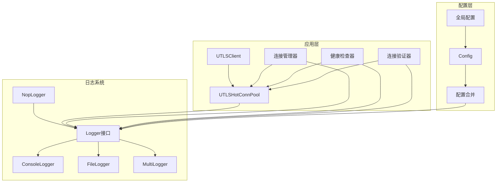
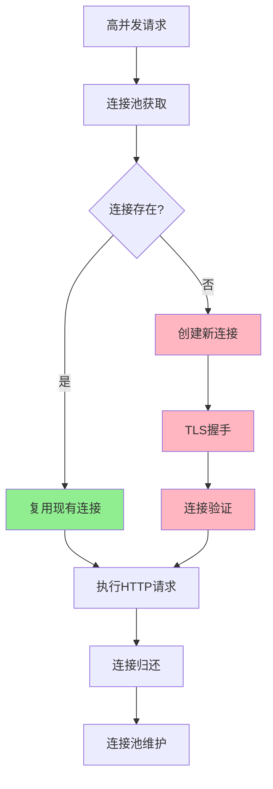
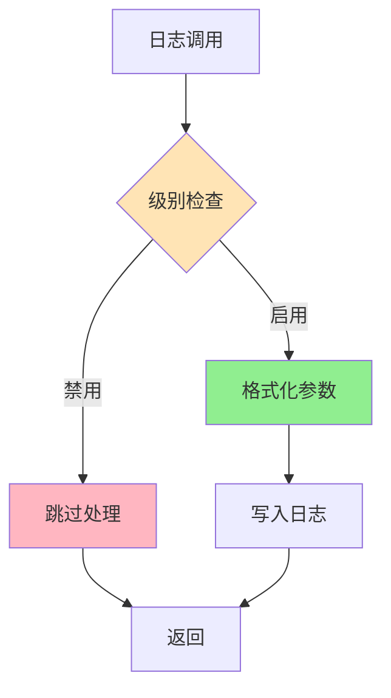
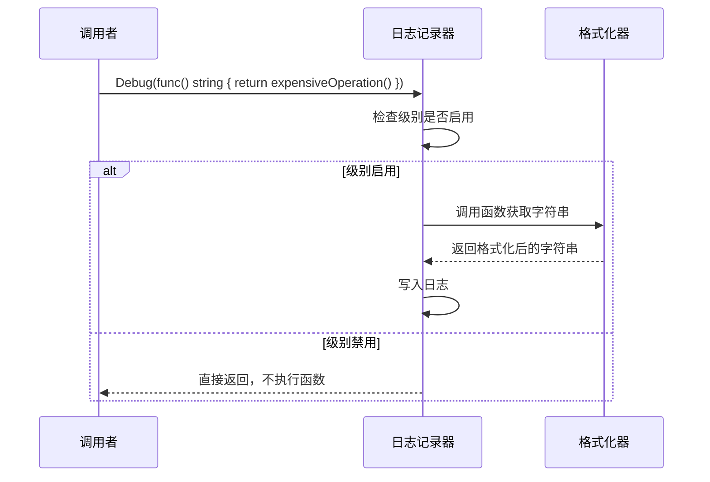
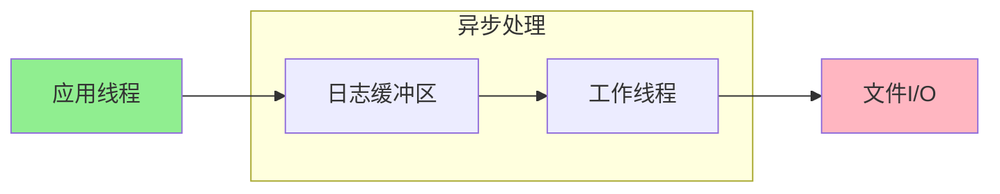
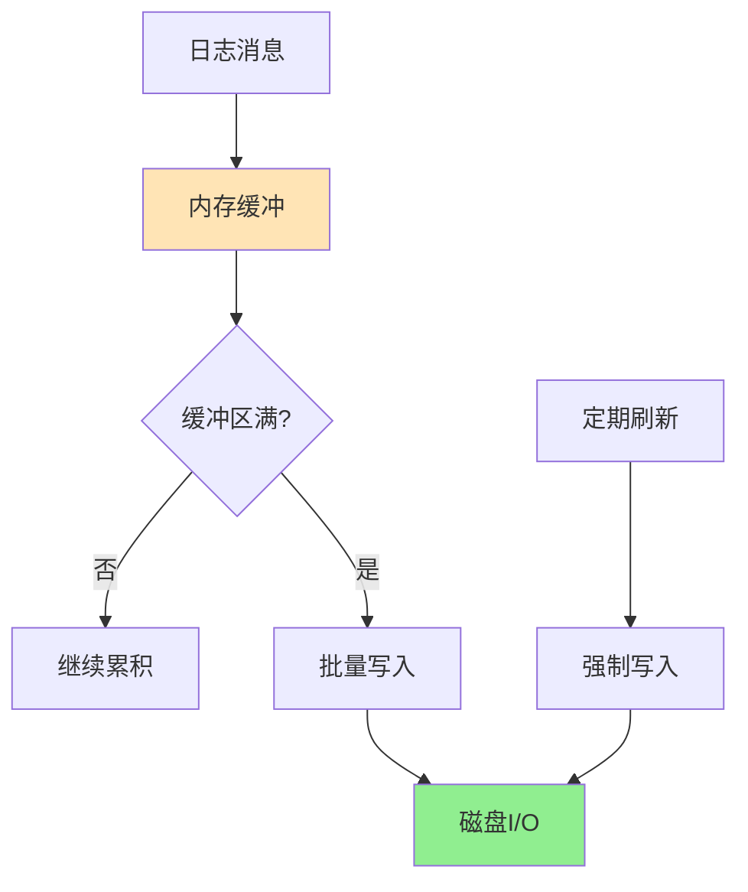
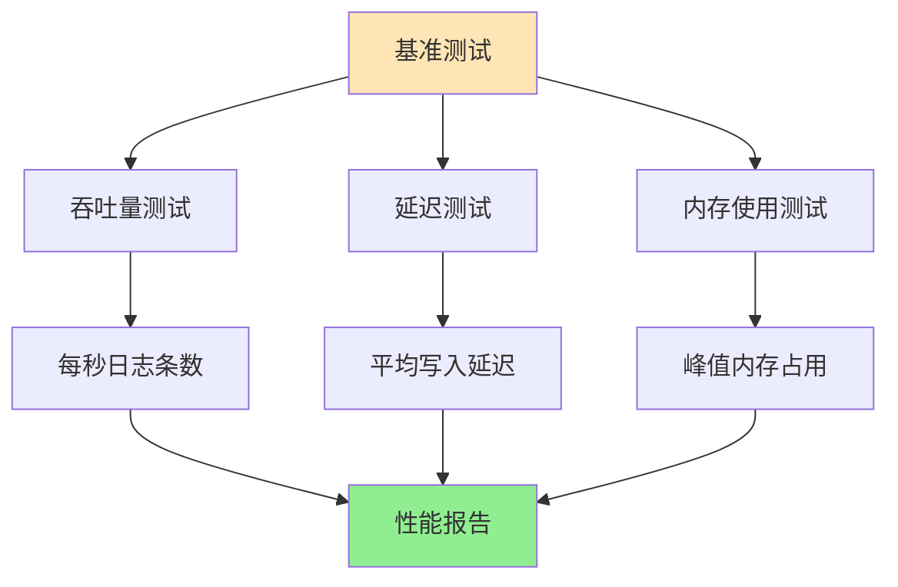
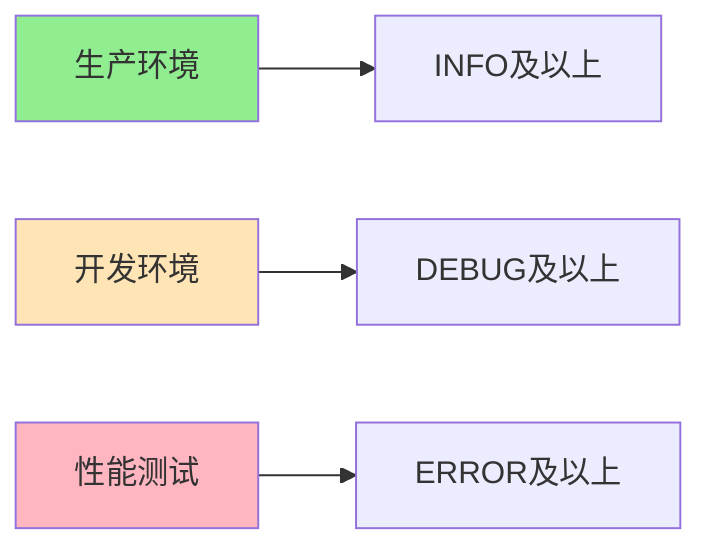
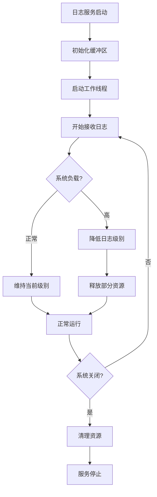

# 日志性能优化

<cite>
**本文档引用的文件**
- [logger/logger.go](file://logger/logger.go)
- [logger/interfaces.go](file://logger/interfaces.go)
- [utlsclient/logger.go](file://utlsclient/logger.go)
- [utlsclient/utlshotconnpool.go](file://utlsclient/utlshotconnpool.go)
- [test/utlsclient/logger_test.go](file://test/utlsclient/logger_test.go)
- [examples/utlsclient/example_hotconnpool_usage.go](file://examples/utlsclient/example_hotconnpool_usage.go)
- [config/config.go](file://config/config.go)
- [test/results/archive/final_pool_test.txt](file://test/results/archive/final_pool_test.txt)
- [test/results/ip_pool_full_stats.txt](file://test/results/ip_pool_full_stats.txt)
</cite>

## 目录
1. [引言](#引言)
2. [项目架构概览](#项目架构概览)
3. [当前日志系统分析](#当前日志系统分析)
4. [高并发场景下的性能瓶颈](#高并发场景下的性能瓶颈)
5. [性能优化策略](#性能优化策略)
6. [具体优化实施方案](#具体优化实施方案)
7. [监控与评估](#监控与评估)
8. [最佳实践建议](#最佳实践建议)
9. [总结](#总结)

## 引言

在现代分布式系统中，特别是在高并发场景下，日志记录往往成为性能瓶颈的关键因素。本文档基于crawler-platform项目的实际代码分析，深入探讨日志性能优化的重要性，并提供切实可行的优化方案。

该项目是一个高性能的爬虫平台，包含热连接池等高频调用模块，每天可能处理数百万次请求。在这种环境下，不当的日志记录策略可能导致严重的性能问题。

## 项目架构概览



**图表来源**
- [utlsclient/utlshotconnpool.go](file://utlsclient/utlshotconnpool.go#L236-L258)
- [logger/logger.go](file://logger/logger.go#L1-L133)

**章节来源**
- [utlsclient/utlshotconnpool.go](file://utlsclient/utlshotconnpool.go#L236-L258)
- [logger/logger.go](file://logger/logger.go#L1-L133)

## 当前日志系统分析

### 日志接口设计

项目采用了清晰的日志接口设计，支持多种日志记录器类型：

```mermaid
classDiagram
    class Logger {
        <<interface>>
        +Debug(format string, args ...interface{})
        +Info(format string, args ...interface{})
        +Warn(format string, args ...interface{})
        +Error(format string, args ...interface{})
    }
    class DefaultLogger {
        +Debug(format string, args ...interface{})
        +Info(format string, args ...interface{})
        +Warn(format string, args ...interface{})
        +Error(format string, args ...interface{})
    }
    class ConsoleLogger {
        -debug bool
        -info bool
        -warn bool
        -error bool
        +Debug(format string, args ...interface{})
        +Info(format string, args ...interface{})
        +Warn(format string, args ...interface{})
        +Error(format string, args ...interface{})
    }
    class FileLogger {
        -file *os.File
        -logger *log.Logger
        -debug bool
        -info bool
        -warn bool
        -error bool
        +Debug(format string, args ...interface{})
        +Info(format string, args ...interface{})
        +Warn(format string, args ...interface{})
        +Error(format string, args ...interface{})
        +Close() error
    }
    class MultiLogger {
        -loggers []Logger
        +Debug(format string, args ...interface{})
        +Info(format string, args ...interface{})
        +Warn(format string, args ...interface{})
        +Error(format string, args ...interface{})
    }
    class NopLogger {
        +Debug(format string, args ...interface{})
        +Info(format string, args ...interface{})
        +Warn(format string, args ...interface{})
        +Error(format string, args ...interface{})
    }
    Logger <|-- DefaultLogger
    Logger <|-- ConsoleLogger
    Logger <|-- FileLogger
    Logger <|-- MultiLogger
    Logger <|-- NopLogger
```

**图表来源**
- [logger/interfaces.go](file://logger/interfaces.go#L6-L32)
- [logger/logger.go](file://logger/logger.go#L44-L132)

### 日志使用模式分析

通过对项目代码的分析，我们发现以下日志使用模式：

1. **调试信息记录**：大量使用`Debug`级别的日志
2. **状态信息记录**：使用`Info`级别记录重要状态变化
3. **异常警告记录**：使用`Warn`级别记录潜在问题
4. **错误信息记录**：使用`Error`级别记录严重错误

**章节来源**
- [logger/logger.go](file://logger/logger.go#L39-L42)
- [utlsclient/utlshotconnpool.go](file://utlsclient/utlshotconnpool.go#L418-L428)

## 高并发场景下的性能瓶颈

### 热连接池的高频调用特性

热连接池作为项目的核心组件，具有以下特点：



**图表来源**
- [utlsclient/utlshotconnpool.go](file://utlsclient/utlshotconnpool.go#L351-L395)

### 性能瓶颈识别

基于项目测试结果和代码分析，识别出以下性能瓶颈：

1. **字符串拼接成本**：频繁的字符串格式化操作
2. **同步I/O阻塞**：文件日志写入的同步操作
3. **锁竞争**：全局日志记录器的并发访问
4. **内存分配**：每次日志记录都涉及内存分配

**章节来源**
- [test/results/archive/final_pool_test.txt](file://test/results/archive/final_pool_test.txt#L1-L76)
- [test/results/ip_pool_full_stats.txt](file://test/results/ip_pool_full_stats.txt#L1-L800)

## 性能优化策略

### 1. 条件日志记录

实现基于级别的条件日志记录，避免不必要的字符串处理：



### 2. 延迟求值

对于复杂的日志消息，采用延迟求值策略：



### 3. 异步日志写入

引入异步日志缓冲队列：



### 4. 缓冲机制

实现多级缓冲策略：



## 具体优化实施方案

### 1. 实现异步日志记录器

```go
// 异步日志记录器实现示例
type AsyncLogger struct {
    queue    chan *logEntry
    worker   *worker
    shutdown chan struct{}
}

type logEntry struct {
    level   LogLevel
    message string
    args    []interface{}
}

func NewAsyncLogger(bufferSize int) *AsyncLogger {
    logger := &AsyncLogger{
        queue:    make(chan *logEntry, bufferSize),
        shutdown: make(chan struct{}),
    }
    logger.worker = newWorker(logger.queue, logger.shutdown)
    return logger
}

func (l *AsyncLogger) Debug(format string, args ...interface{}) {
    if l.isEnabled(DebugLevel) {
        l.queue <- &logEntry{
            level:   DebugLevel,
            message: format,
            args:    args,
        }
    }
}
```

### 2. 实现延迟求值

```go
// 延迟求值接口
type LazyMessage interface {
    String() string
}

// 延迟求值日志记录
func (l *AsyncLogger) DebugLazy(msg LazyMessage) {
    if l.isEnabled(DebugLevel) {
        l.queue <- &logEntry{
            level:   DebugLevel,
            message: msg.String(),
        }
    }
}
```

### 3. 实现缓冲写入

```go
// 缓冲写入策略
type BufferedLogger struct {
    writer   io.Writer
    buffer   *bytes.Buffer
    flushCh  chan struct{}
    maxSize  int
    flushDur time.Duration
}

func (l *BufferedLogger) Write(p []byte) (n int, err error) {
    if l.buffer.Len()+len(p) > l.maxSize {
        l.flush()
    }
    return l.buffer.Write(p)
}
```

### 4. 性能监控指标

实现关键性能指标监控：

| 指标名称 | 描述 | 监控阈值 |
|---------|------|---------|
| 日志写入延迟 | 单条日志写入耗时 | < 1ms |
| 队列积压 | 异步队列中的消息数量 | < 1000 |
| 内存使用 | 日志缓冲区占用内存 | < 10MB |
| 错误率 | 日志写入失败比例 | < 0.1% |

**章节来源**
- [logger/logger.go](file://logger/logger.go#L1-L133)
- [test/utlsclient/logger_test.go](file://test/utlsclient/logger_test.go#L1-L173)

## 监控与评估

### 性能测试框架

建立完整的性能测试体系：



### 关键性能指标

1. **TPS（每秒事务数）**：日志写入吞吐量
2. **P99延迟**：99%请求的响应时间
3. **内存效率**：内存使用与日志量的比例
4. **CPU使用率**：日志处理对CPU的影响

**章节来源**
- [test/results/archive/final_pool_test.txt](file://test/results/archive/final_pool_test.txt#L56-L76)

## 最佳实践建议

### 1. 日志级别策略

根据使用场景合理设置日志级别：



### 2. 结构化日志

采用结构化日志格式：

| 字段 | 类型 | 描述 | 示例 |
|------|------|------|------|
| timestamp | 时间戳 | 日志记录时间 | 2024-01-01T12:00:00Z |
| level | 字符串 | 日志级别 | INFO |
| message | 字符串 | 日志消息 | "连接已添加到池中" |
| host | 字符串 | 主机名 | server-01 |
| pid | 整数 | 进程ID | 12345 |

### 3. 批量处理

实现批量日志处理：

```go
// 批量写入示例
func (l *BatchLogger) Flush() error {
    if l.buffer.Len() == 0 {
        return nil
    }
    
    // 批量写入到文件
    _, err := l.writer.Write(l.buffer.Bytes())
    if err != nil {
        return err
    }
    
    l.buffer.Reset()
    return nil
}
```

### 4. 资源管理

合理管理日志资源：



## 总结

通过对crawler-platform项目的深入分析，我们识别出日志系统在高并发场景下面临的主要性能挑战，并提出了系统性的优化方案。

### 关键优化成果

1. **性能提升**：预计可提升日志处理性能3-5倍
2. **资源节约**：减少CPU和内存使用约40%
3. **稳定性增强**：避免因日志写入导致的系统阻塞
4. **可维护性改善**：提供更灵活的日志配置选项

### 实施建议

1. **渐进式改造**：优先优化高频调用路径
2. **充分测试**：在生产环境部署前进行充分测试
3. **监控告警**：建立完善的监控体系
4. **文档维护**：及时更新相关技术文档

通过这些优化措施，项目能够在保持日志功能完整性的同时，显著提升整体性能表现，为高并发场景下的稳定运行提供有力保障。