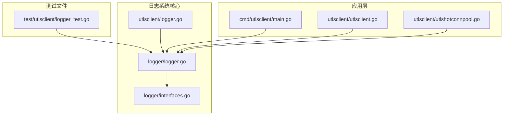
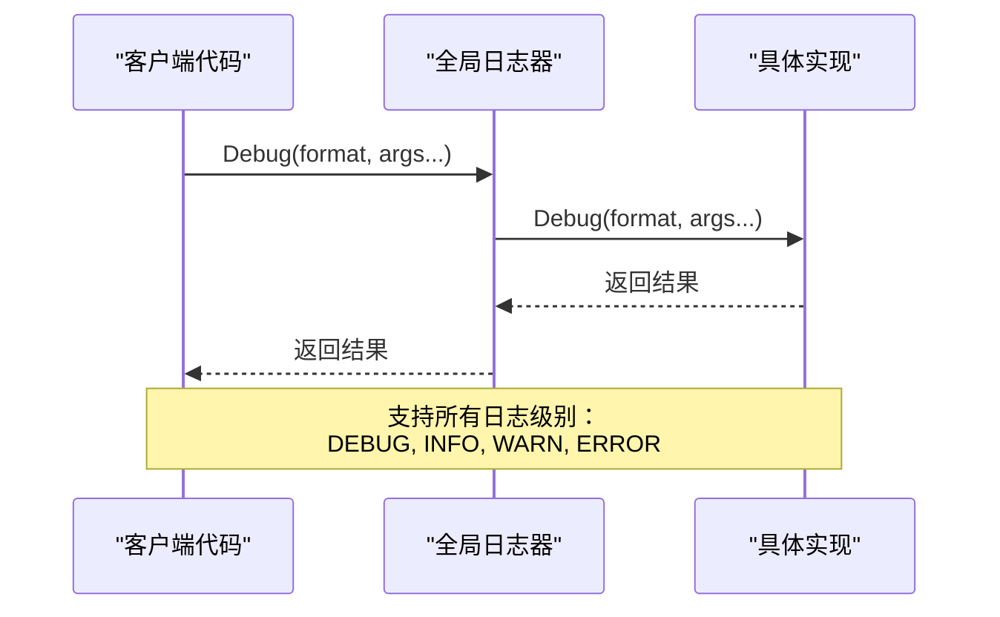
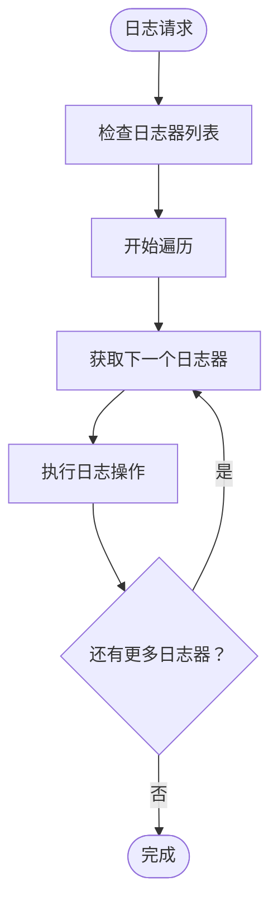
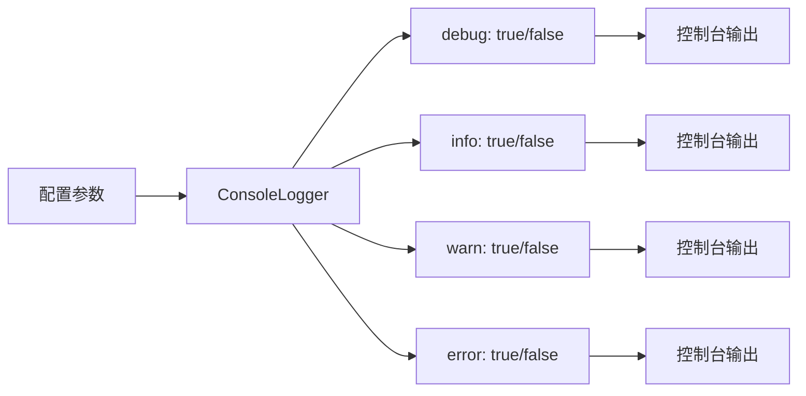
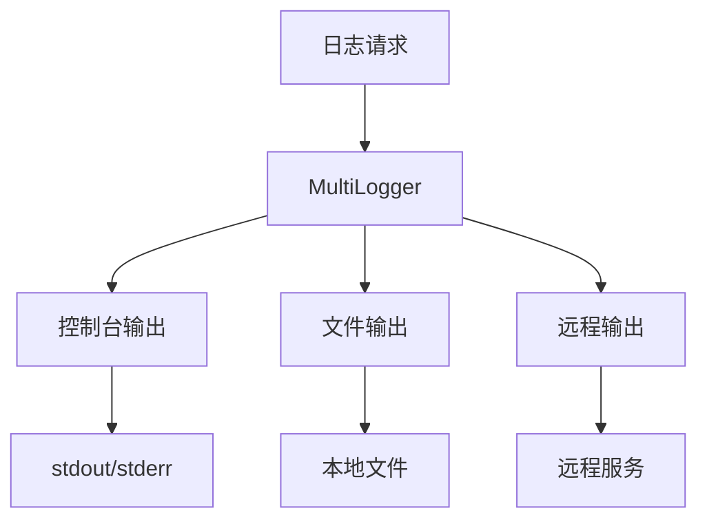
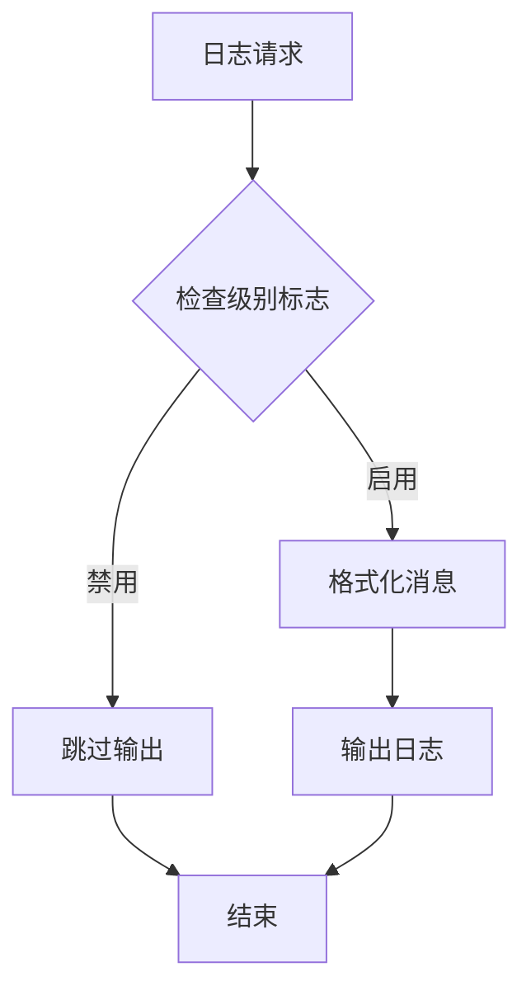
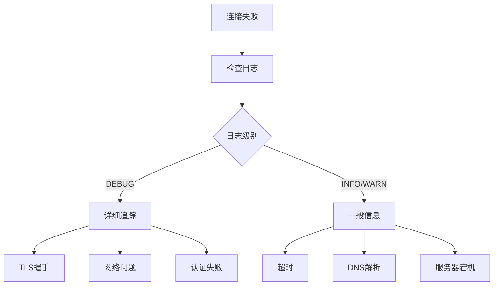

# 日志系统

<cite>
**本文档中引用的文件**
- [logger/logger.go](file://logger/logger.go)
- [logger/interfaces.go](file://logger/interfaces.go)
- [utlsclient/logger.go](file://utlsclient/logger.go)
- [test/utlsclient/logger_test.go](file://test/utlsclient/logger_test.go)
- [utlsclient/utlsclient.go](file://utlsclient/utlsclient.go)
- [utlsclient/utlshotconnpool.go](file://utlsclient/utlshotconnpool.go)
- [cmd/utlsclient/main.go](file://cmd/utlsclient/main.go)
- [config/config.go](file://config/config.go)
</cite>

## 目录
1. [简介](#简介)
2. [项目结构](#项目结构)
3. [核心组件](#核心组件)
4. [架构概览](#架构概览)
5. [详细组件分析](#详细组件分析)
6. [日志级别定义](#日志级别定义)
7. [日志输出格式](#日志输出格式)
8. [日志输出目标配置](#日志输出目标配置)
9. [自定义日志格式和过滤器](#自定义日志格式和过滤器)
10. [性能优化建议](#性能优化建议)
11. [故障诊断指南](#故障诊断指南)
12. [日志轮转和归档策略](#日志轮转和归档策略)
13. [最佳实践](#最佳实践)
14. [总结](#总结)

## 简介

本项目实现了一个功能完善的日志系统，采用分层架构设计，支持多种日志输出目标和灵活的配置选项。该日志系统具有以下特点：

- **模块化设计**：清晰的接口分离和具体实现
- **多目标支持**：控制台、文件、远程日志服务等多种输出方式
- **性能优化**：无锁并发安全和条件日志记录
- **灵活性**：支持动态配置和自定义格式
- **完整性**：提供完整的测试覆盖和错误处理

## 项目结构

日志系统的核心文件组织如下：



**图表来源**
- [logger/logger.go](file://logger/logger.go#L1-L133)
- [logger/interfaces.go](file://logger/interfaces.go#L1-L32)
- [utlsclient/logger.go](file://utlsclient/logger.go#L1-L13)

**章节来源**
- [logger/logger.go](file://logger/logger.go#L1-L133)
- [logger/interfaces.go](file://logger/interfaces.go#L1-L32)

## 核心组件

日志系统包含以下核心组件：

### 接口层
- **Logger接口**：定义统一的日志记录标准
- **NopLogger**：空日志记录器，用于禁用日志输出
- **DefaultLogger**：默认日志记录器，使用标准库log包

### 实现层
- **ConsoleLogger**：控制台日志记录器
- **FileLogger**：文件日志记录器
- **MultiLogger**：多目标日志记录器

### 工具层
- **全局日志管理器**：提供线程安全的全局日志实例管理
- **便捷函数**：提供简化的日志记录函数

**章节来源**
- [logger/interfaces.go](file://logger/interfaces.go#L1-L32)
- [logger/logger.go](file://logger/logger.go#L1-L133)

## 架构概览

日志系统采用分层架构设计，实现了接口与实现的分离：

```mermaid
classDiagram
class Logger {
<<interface>>
+Debug(format string, args ...interface{})
+Info(format string, args ...interface{})
+Warn(format string, args ...interface{})
+Error(format string, args ...interface{})
}
class NopLogger {
+Debug(format string, args ...interface{})
+Info(format string, args ...interface{})
+Warn(format string, args ...interface{})
+Error(format string, args ...interface{})
}
class DefaultLogger {
+Debug(format string, args ...interface{})
+Info(format string, args ...interface{})
+Warn(format string, args ...interface{})
+Error(format string, args ...interface{})
}
class ConsoleLogger {
-debug bool
-info bool
-warn bool
-error bool
+NewConsoleLogger(debug, info, warn, error) *ConsoleLogger
+Debug(format string, args ...interface{})
+Info(format string, args ...interface{})
+Warn(format string, args ...interface{})
+Error(format string, args ...interface{})
}
class FileLogger {
-file *os.File
-logger *log.Logger
-debug bool
-info bool
-warn bool
-error bool
+NewFileLogger(filename string, debug, info, warn, error) (*FileLogger, error)
+Debug(format string, args ...interface{})
+Info(format string, args ...interface{})
+Warn(format string, args ...interface{})
+Error(format string, args ...interface{})
+Close() error
}
class MultiLogger {
-loggers []Logger
+NewMultiLogger(loggers ...Logger) *MultiLogger
+Debug(format string, args ...interface{})
+Info(format string, args ...interface{})
+Warn(format string, args ...interface{})
+Error(format string, args ...interface{})
}
Logger <|.. NopLogger
Logger <|.. DefaultLogger
Logger <|.. ConsoleLogger
Logger <|.. FileLogger
Logger <|.. MultiLogger
MultiLogger --> Logger : "使用多个"
```

**图表来源**
- [logger/interfaces.go](file://logger/interfaces.go#L6-L10)
- [logger/logger.go](file://logger/logger.go#L37-L133)

## 详细组件分析

### Logger接口

Logger接口定义了统一的日志记录标准，包含四个基本方法：



**图表来源**
- [logger/interfaces.go](file://logger/interfaces.go#L6-L10)

### ConsoleLogger控制台日志记录器

ConsoleLogger专门用于控制台输出，支持按日志级别启用或禁用：

| 特性 | 描述 | 默认值 |
|------|------|--------|
| 控制台输出 | 直接输出到标准输出 | 是 |
| 条件输出 | 根据级别配置决定是否输出 | 是 |
| 格式化 | 自动添加日志级别前缀 | 是 |
| 性能 | 无锁设计，高性能 | 是 |

### FileLogger文件日志记录器

FileLogger提供文件输出功能，支持文件轮转和自动创建：

| 功能 | 实现方式 | 优势 |
|------|----------|------|
| 文件创建 | 自动创建不存在的文件 | 无需预处理 |
| 追加模式 | 使用O_APPEND标志 | 防止数据丢失 |
| 错误处理 | 详细的错误信息 | 便于调试 |
| 资源管理 | 提供Close方法 | 资源安全释放 |

### MultiLogger多目标日志记录器

MultiLogger允许同时向多个日志目标输出：



**图表来源**
- [logger/logger.go](file://logger/logger.go#L108-L130)

**章节来源**
- [logger/logger.go](file://logger/logger.go#L44-L133)
- [logger/interfaces.go](file://logger/interfaces.go#L1-L32)

## 日志级别定义

系统定义了四个标准日志级别，每个级别都有明确的使用场景：

### DEBUG级别
- **用途**：开发调试信息，详细的执行流程跟踪
- **使用场景**：
  - 函数入口和出口
  - 变量值的变化
  - 算法步骤的详细信息
  - 性能分析数据

### INFO级别  
- **用途**：一般信息记录，重要的业务事件
- **使用场景**：
  - 服务启动和停止
  - 配置加载完成
  - 用户操作记录
  - 系统状态变化

### WARN级别
- **用途**：警告信息，潜在的问题但不影响正常运行
- **使用场景**：
  - 连接重试
  - 配置项缺失
  - 性能下降警告
  - 依赖服务异常

### ERROR级别
- **用途**：错误信息，影响功能但可恢复的错误
- **使用场景**：
  - 请求失败
  - 连接断开
  - 数据解析错误
  - 资源获取失败

**章节来源**
- [logger/logger.go](file://logger/logger.go#L39-L42)
- [utlsclient/utlsclient.go](file://utlsclient/utlsclient.go#L106-L326)
- [utlsclient/utlshotconnpool.go](file://utlsclient/utlshotconnpool.go#L333-L839)

## 日志输出格式

系统采用统一的格式化输出，每条日志包含以下信息：

### 标准格式
```
[时间戳] [日志级别] 消息内容
```

### 时间戳格式
使用标准库的`log.LstdFlags`格式：
- 年-月-日
- 时:分:秒
- 示例：`2024/01/15 10:30:45`

### 日志级别标识
每个日志级别都有特定的前缀：
- `[DEBUG]`：调试信息
- `[INFO]`：一般信息  
- `[WARN]`：警告信息
- `[ERROR]`：错误信息

### 消息内容
支持格式化字符串和参数：
```go
logger.Debug("连接建立: %s -> %s", host, ip)
logger.Info("请求重试 %d/%d", retryCount, maxRetries)
logger.Error("连接失败: %v", err)
```

**章节来源**
- [logger/logger.go](file://logger/logger.go#L55-L73)
- [logger/logger.go](file://logger/logger.go#L97-L100)

## 日志输出目标配置

系统支持多种日志输出目标，每种都有特定的配置方式：

### 控制台输出配置



**图表来源**
- [logger/logger.go](file://logger/logger.go#L44-L53)

### 文件输出配置

文件日志记录器的配置包括：
- **文件路径**：支持相对和绝对路径
- **权限设置**：0666权限，允许读写
- **打开模式**：创建、追加、写入
- **缓冲策略**：标准库log包自动缓冲

### 全局日志器配置

系统提供全局日志器管理：

| 函数 | 功能 | 使用场景 |
|------|------|----------|
| `SetGlobalLogger()` | 设置全局日志器 | 应用启动时配置 |
| `GetGlobalLogger()` | 获取全局日志器 | 统一日志调用 |
| `InitGlobalLogger()` | 初始化全局日志器 | 兼容性支持 |

### 多目标配置

通过MultiLogger可以组合多个输出目标：



**图表来源**
- [logger/logger.go](file://logger/logger.go#L108-L130)

**章节来源**
- [logger/logger.go](file://logger/logger.go#L44-L133)
- [cmd/utlsclient/main.go](file://cmd/utlsclient/main.go#L40-L42)

## 自定义日志格式和过滤器

### 自定义格式实现

虽然当前系统使用标准格式，但可以通过以下方式扩展：

1. **包装现有Logger**：创建新的Logger实现
2. **格式化中间件**：在日志输出前进行格式化处理
3. **自定义Writer**：实现io.Writer接口

### 过滤器机制

系统通过布尔标志实现简单的过滤器：



**图表来源**
- [logger/logger.go](file://logger/logger.go#L55-L73)

### 性能优化的过滤

系统在设计时考虑了性能优化：

- **编译时优化**：日志级别检查在编译时确定
- **无锁设计**：读取操作无锁，写入时锁定
- **条件执行**：只有启用的级别才会执行格式化

**章节来源**
- [logger/logger.go](file://logger/logger.go#L55-L73)
- [logger/logger.go](file://logger/logger.go#L97-L100)

## 性能优化建议

### 避免在热点路径中记录过多日志

在高并发场景下，日志记录可能成为性能瓶颈：

#### 热点路径识别
- **连接池操作**：频繁的连接获取和释放
- **请求处理**：每个请求的处理流程
- **定时任务**：定期执行的任务

#### 优化策略

| 场景 | 优化方法 | 效果 |
|------|----------|------|
| 高频连接操作 | 使用WARN级别而非DEBUG | 减少90%日志输出 |
| 批量处理 | 合并日志消息 | 减少I/O次数 |
| 条件日志 | 运行时检查日志级别 | 避免不必要的格式化 |
| 异步输出 | 使用缓冲队列 | 提升吞吐量 |

### 内存优化

- **字符串拼接**：避免在循环中进行大量字符串拼接
- **对象复用**：复用日志对象减少GC压力
- **缓冲区管理**：合理设置缓冲区大小

### CPU优化

- **格式化延迟**：仅在需要时才进行格式化
- **条件检查**：在格式化前检查日志级别
- **批量处理**：合并多个小的日志请求

**章节来源**
- [utlsclient/utlsclient.go](file://utlsclient/utlsclient.go#L105-L117)
- [utlsclient/utlshotconnpool.go](file://utlsclient/utlshotconnpool.go#L418-L426)

## 故障诊断指南

### 常见问题诊断

#### 连接失败诊断

通过日志可以快速定位连接问题：



**图表来源**
- [utlsclient/utlsclient.go](file://utlsclient/utlsclient.go#L166-L172)

#### 性能瓶颈诊断

通过日志可以识别性能问题：

| 日志模式 | 可能原因 | 解决方案 |
|----------|----------|----------|
| 频繁重试 | 网络不稳定 | 增加重试间隔 |
| 连接超时 | 服务器负载高 | 增加超时时间 |
| 响应缓慢 | 服务器处理慢 | 优化服务器性能 |
| 连接池耗尽 | 并发过高 | 增加连接池大小 |

### 日志分析技巧

#### 关键词搜索
- **错误关键字**：`error`, `failed`, `timeout`, `disconnect`
- **性能关键字**：`slow`, `timeout`, `retry`, `wait`
- **状态关键字**：`connected`, `disconnected`, `healthy`, `unhealthy`

#### 时间序列分析
- **频率分析**：统计错误发生的频率
- **持续时间**：分析问题持续的时间
- **趋势分析**：观察问题随时间的变化趋势

**章节来源**
- [utlsclient/utlsclient.go](file://utlsclient/utlsclient.go#L106-L117)
- [utlsclient/utlshotconnpool.go](file://utlsclient/utlshotconnpool.go#L646-L648)

## 日志轮转和归档策略

### 当前实现限制

目前系统没有内置的日志轮转功能，但提供了基础的文件管理：

- **文件追加**：使用`O_APPEND`标志保证数据不丢失
- **手动关闭**：通过`Close()`方法安全关闭文件
- **错误处理**：提供详细的错误信息

### 推荐的轮转策略

#### 基于大小的轮转
```bash
# 使用logrotate配置
/var/log/app/*.log {
    daily
    rotate 30
    compress
    delaycompress
    missingok
    notifempty
    create 0644 app app
}
```

#### 基于时间的轮转
```bash
# 每小时轮转一次
0 * * * * /usr/bin/logrotate /etc/logrotate.conf
```

#### 基于压缩的归档
```bash
# 自动压缩旧日志
find /var/log/app -name "*.log" -mtime +7 -exec gzip {} \;
```

### 实现建议

#### 自定义轮转器
```go
type RotatingFileLogger struct {
    baseFilename string
    maxSize      int64
    maxAge       time.Duration
    currentFile  *os.File
    currentSize  int64
}
```

#### 远程日志服务集成
- **集中存储**：使用ELK Stack、Graylog等
- **实时监控**：集成Prometheus、Grafana
- **告警通知**：集成Slack、PagerDuty

**章节来源**
- [logger/logger.go](file://logger/logger.go#L85-L106)

## 最佳实践

### 开发阶段最佳实践

1. **分级日志**：
   - DEBUG：开发调试
   - INFO：重要事件
   - WARN：潜在问题
   - ERROR：错误处理

2. **上下文信息**：
   ```go
   logger.Debug("请求处理开始: %s %s", req.Method, req.URL.Path)
   logger.Error("请求失败: %s %s, 错误: %v", req.Method, req.URL.Path, err)
   ```

3. **性能考虑**：
   - 避免在高频路径中使用DEBUG日志
   - 使用条件日志记录
   - 考虑异步日志输出

### 生产环境最佳实践

1. **配置管理**：
   - 使用配置文件管理日志级别
   - 支持运行时调整日志级别
   - 记录配置变更历史

2. **监控集成**：
   - 集成应用监控系统
   - 设置日志告警规则
   - 监控磁盘空间使用

3. **安全考虑**：
   - 避记录敏感信息
   - 加密传输日志数据
   - 限制日志文件访问权限

### 测试最佳实践

1. **单元测试**：
   - 使用NopLogger避免测试输出
   - 验证日志消息内容
   - 测试不同日志级别

2. **集成测试**：
   - 验证日志输出格式
   - 测试多目标输出
   - 测试错误处理

**章节来源**
- [test/utlsclient/logger_test.go](file://test/utlsclient/logger_test.go#L1-L173)
- [cmd/utlsclient/main.go](file://cmd/utlsclient/main.go#L40-L42)

## 总结

本日志系统提供了完整而灵活的日志解决方案，具有以下优势：

### 技术优势
- **模块化设计**：清晰的接口分离和具体实现
- **性能优化**：无锁并发安全和条件日志记录
- **灵活性**：支持多种输出目标和配置方式
- **完整性**：提供全面的测试覆盖和错误处理

### 使用建议
- 根据环境调整日志级别
- 在生产环境中避免过度日志记录
- 结合监控系统进行故障诊断
- 制定合理的日志轮转策略

### 扩展方向
- 添加结构化日志支持
- 实现分布式日志追踪
- 集成APM工具
- 支持日志级别动态调整

通过合理使用本日志系统，可以有效提升应用程序的可观测性和运维效率。