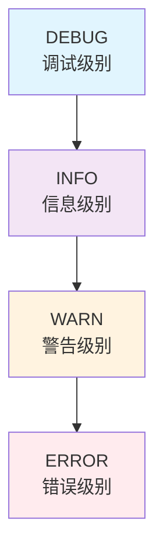
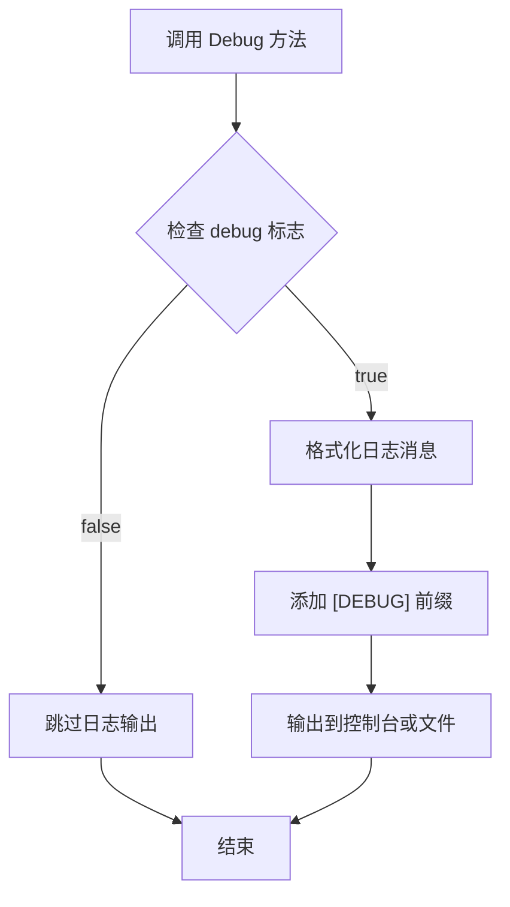
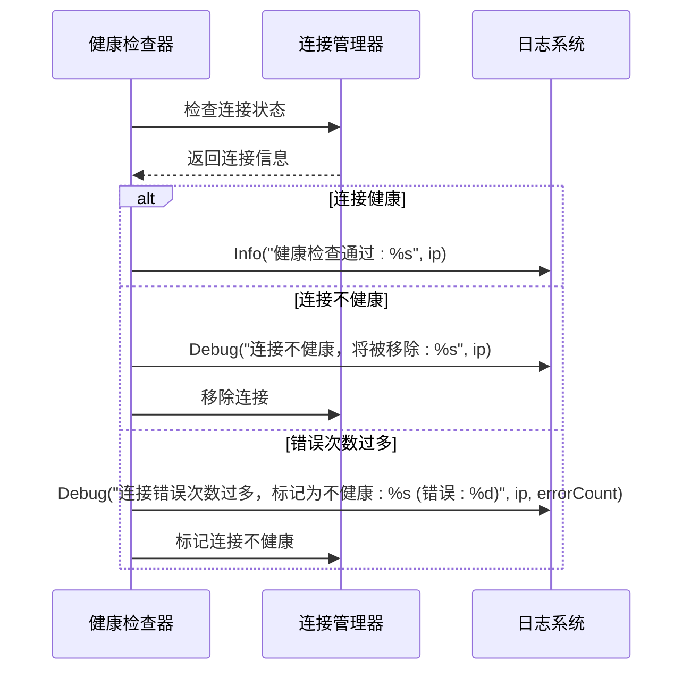
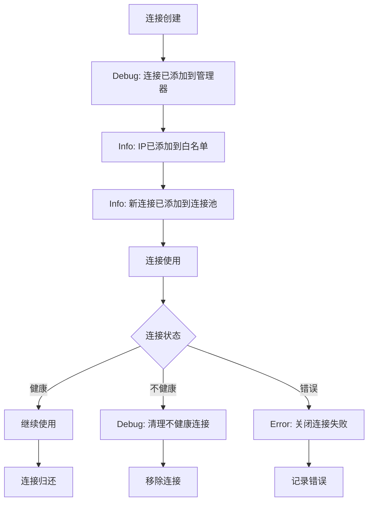

# 日志级别

<cite>
**本文档引用的文件**
- [logger/logger.go](file://logger/logger.go)
- [logger/interfaces.go](file://logger/interfaces.go)
- [utlsclient/logger.go](file://utlsclient/logger.go)
- [utlsclient/health_checker.go](file://utlsclient/health_checker.go)
- [utlsclient/connection_manager.go](file://utlsclient/connection_manager.go)
- [test/utlsclient/logger_test.go](file://test/utlsclient/logger_test.go)
</cite>

## 目录
1. [简介](#简介)
2. [日志级别概述](#日志级别概述)
3. [核心日志接口](#核心日志接口)
4. [日志级别详解](#日志级别详解)
5. [日志记录器类型](#日志记录器类型)
6. [实际应用场景](#实际应用场景)
7. [最佳实践指南](#最佳实践指南)
8. [故障排除](#故障排除)
9. [总结](#总结)

## 简介

本文档详细介绍了爬虫平台项目中定义的日志系统及其各个日志级别的语义和使用场景。该日志系统采用分层架构设计，提供了灵活的配置选项和多种日志记录器实现，支持不同环境下的日志需求。

## 日志级别概述

日志系统定义了四个核心级别，按照严重程度从低到高排列：



**图表来源**
- [logger/interfaces.go](file://logger/interfaces.go#L6-L10)
- [logger/logger.go](file://logger/logger.go#L39-L42)

## 核心日志接口

### Logger 接口定义

日志系统的核心是一个简洁的接口，定义了四个基本的日志记录方法：

```mermaid
classDiagram
class Logger {
<<interface>>
+Debug(format string, args ...interface{})
+Info(format string, args ...interface{})
+Warn(format string, args ...interface{})
+Error(format string, args ...interface{})
}
class DefaultLogger {
+Debug(format string, args ...interface{})
+Info(format string, args ...interface{})
+Warn(format string, args ...interface{})
+Error(format string, args ...interface{})
}
class NopLogger {
+Debug(format string, args ...interface{})
+Info(format string, args ...interface{})
+Warn(format string, args ...interface{})
+Error(format string, args ...interface{})
}
Logger <|.. DefaultLogger
Logger <|.. NopLogger
```

**图表来源**
- [logger/interfaces.go](file://logger/interfaces.go#L6-L30)

**章节来源**
- [logger/interfaces.go](file://logger/interfaces.go#L1-L32)

## 日志级别详解

### DEBUG 级别（调试级别）

**语义含义：**
DEBUG 级别用于记录最详细的执行信息，主要用于开发和调试阶段。这些信息对理解程序运行流程至关重要，但在生产环境中通常会被禁用以减少性能开销。

**触发条件：**
- 开发调试阶段
- 详细的函数调用跟踪
- 变量值和中间结果
- 程序执行路径分析

**实现机制：**


**图表来源**
- [logger/logger.go](file://logger/logger.go#L55-L58)

**实际应用示例：**
在连接池管理中，DEBUG 级别常用于记录连接的详细状态变化：
- 连接创建和销毁过程
- 连接状态变更详情
- 健康检查的详细结果

### INFO 级别（信息级别）

**语义含义：**
INFO 级别用于记录重要的程序运行事件和状态变化。这些信息对于监控系统运行状况和理解业务流程非常有用。

**触发条件：**
- 系统启动和停止
- 重要业务操作完成
- 资源分配和释放
- 性能指标收集

**实现机制：**
INFO 级别的日志记录器同样遵循条件输出模式，只有当对应的标志位为 true 时才会输出日志。

**实际应用示例：**
在健康检查系统中，INFO 级别用于记录关键的状态变化：
- 连接池大小调整
- 白名单 IP 添加
- 连接池统计数据

### WARN 级别（警告级别）

**语义含义：**
WARN 级别表示潜在的问题或异常情况，这些问题不会立即影响系统功能，但需要关注和处理。这是预防性维护的重要信号。

**触发条件：**
- 连接质量下降
- 性能指标接近阈值
- 配置参数不合理
- 资源使用率较高

**实现机制：**
警告级别的日志记录器会在检测到异常情况时输出详细信息，帮助运维人员及时发现问题。

**实际应用示例：**
在连接管理中，WARN 级别常用于记录：
- 连接超时警告
- 错误率上升
- 资源使用接近限制

### ERROR 级别（错误级别）

**语义含义：**
ERROR 级别表示严重的错误情况，这些错误已经影响了系统的正常功能，需要立即关注和处理。这是系统监控和告警的关键指标。

**触发条件：**
- 连接完全失败
- 系统组件崩溃
- 数据完整性问题
- 安全相关事件

**实现机制：**
错误级别的日志记录器总是输出，因为它们包含紧急信息。系统通常会同时触发其他通知机制。

**实际应用示例：**
在连接池管理中，ERROR 级别用于记录：
- 连接池关闭失败
- 无法创建新连接
- 系统资源耗尽

**章节来源**
- [logger/logger.go](file://logger/logger.go#L39-L42)
- [logger/interfaces.go](file://logger/interfaces.go#L24-L29)

## 日志记录器类型

### ConsoleLogger 控制台日志记录器

**特点：**
- 直接输出到标准控制台
- 支持按级别启用/禁用
- 适用于开发和测试环境

**配置示例：**
```mermaid
classDiagram
class ConsoleLogger {
-bool debug
-bool info
-bool warn
-bool error
+NewConsoleLogger(debug, info, warn, error) ConsoleLogger
+Debug(format string, args ...interface{})
+Info(format string, args ...interface{})
+Warn(format string, args ...interface{})
+Error(format string, args ...interface{})
}
```

**图表来源**
- [logger/logger.go](file://logger/logger.go#L44-L73)

### FileLogger 文件日志记录器

**特点：**
- 输出到指定文件
- 支持文件轮转
- 适用于生产环境

**配置示例：**
- 自动创建日志文件
- 支持追加写入模式
- 可配置日志格式

### MultiLogger 多重日志记录器

**特点：**
- 同时使用多个日志记录器
- 支持组合不同的输出目标
- 提供灵活的日志路由

**章节来源**
- [logger/logger.go](file://logger/logger.go#L44-L133)

## 实际应用场景

### 连接池健康检查场景

在连接池的健康检查过程中，不同级别的日志发挥着重要作用：



**图表来源**
- [utlsclient/health_checker.go](file://utlsclient/health_checker.go#L24-L60)

### 连接管理场景

连接的生命周期管理中，各级别日志的应用：



**图表来源**
- [utlsclient/connection_manager.go](file://utlsclient/connection_manager.go#L26-L72)

**章节来源**
- [utlsclient/health_checker.go](file://utlsclient/health_checker.go#L24-L165)
- [utlsclient/connection_manager.go](file://utlsclient/connection_manager.go#L26-L200)

## 最佳实践指南

### 日志级别选择原则

1. **DEBUG 级别使用原则**
   - 仅在开发和调试阶段启用
   - 记录详细的执行路径和变量状态
   - 避免在生产环境中启用，以免影响性能

2. **INFO 级别使用原则**
   - 记录重要的业务事件
   - 系统状态变化的关键节点
   - 性能指标和统计数据

3. **WARN 级别使用原则**
   - 预警潜在问题
   - 资源使用接近限制
   - 配置参数异常

4. **ERROR 级别使用原则**
   - 记录严重错误
   - 影响系统功能的异常
   - 需要立即处理的问题

### 配置建议

1. **开发环境配置**
   ```go
   logger.SetGlobalLogger(logger.NewConsoleLogger(true, true, true, true))
   ```

2. **测试环境配置**
   ```go
   logger.SetGlobalLogger(logger.NewConsoleLogger(true, true, true, true))
   ```

3. **生产环境配置**
   ```go
   fileLogger, _ := logger.NewFileLogger("app.log", false, true, true, true)
   logger.SetGlobalLogger(fileLogger)
   ```

### 性能优化建议

1. **条件检查优化**
   - 在调用日志方法前进行级别检查
   - 避免不必要的字符串拼接

2. **批量日志处理**
   - 使用 MultiLogger 同时输出到多个目标
   - 考虑异步日志处理

3. **日志文件管理**
   - 实施日志轮转策略
   - 设置合理的日志保留期限

## 故障排除

### 常见问题及解决方案

1. **日志不输出问题**
   - 检查日志级别配置
   - 验证日志记录器初始化
   - 确认文件权限设置

2. **性能问题**
   - 减少 DEBUG 级别日志输出
   - 使用异步日志处理
   - 优化日志格式化

3. **日志丢失问题**
   - 检查文件写入权限
   - 验证日志缓冲区设置
   - 实施日志备份策略

**章节来源**
- [test/utlsclient/logger_test.go](file://test/utlsclient/logger_test.go#L1-L173)

## 总结

爬虫平台的日志系统提供了完整而灵活的日志记录解决方案。通过合理使用 DEBUG、INFO、WARN 和 ERROR 四个级别，开发者可以在不同环境下获得适当的信息量，既保证了开发效率，又确保了生产环境的稳定性。

关键要点：
- 明确各级别的语义和使用场景
- 根据环境需求选择合适的日志记录器
- 遵循最佳实践，平衡信息量和性能
- 建立完善的日志监控和告警机制

通过正确理解和使用这个日志系统，开发团队能够更好地监控系统运行状态，快速定位和解决问题，提高整体系统的可靠性和可维护性。