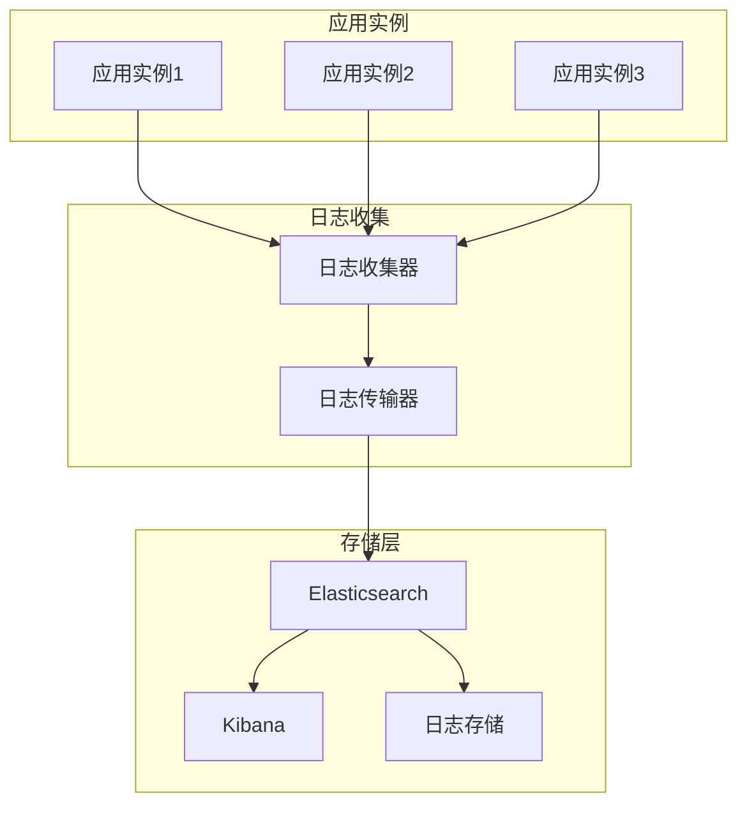

# 日志轮转与归档

<cite>
**本文档引用的文件**
- [logger/logger.go](file://logger/logger.go)
- [logger/interfaces.go](file://logger/interfaces.go)
- [logger/logger.go](file://logger/logger.go)
- [test/utlsclient/logger_test.go](file://test/utlsclient/logger_test.go)
- [cmd/utlsclient/main.go](file://cmd/utlsclient/main.go)
- [config/config.toml](file://config/config.toml)
- [README.md](file://README.md)
</cite>

## 目录
1. [简介](#简介)
2. [当前日志系统架构](#当前日志系统架构)
3. [日志轮转需求分析](#日志轮转需求分析)
4. [外部工具集成方案](#外部工具集成方案)
5. [第三方库集成方案](#第三方库集成方案)
6. [系统级集成配置](#系统级集成配置)
7. [最佳实践建议](#最佳实践建议)
8. [未来扩展规划](#未来扩展规划)
9. [故障排除指南](#故障排除指南)
10. [总结](#总结)

## 简介

在Crawler Platform项目中，日志系统是监控和维护应用程序运行状态的重要组件。随着应用的持续运行，日志文件可能会无限增长，最终导致磁盘空间耗尽，影响系统稳定性和性能。因此，实现有效的日志轮转（log rotation）和归档策略对于确保系统的长期稳定运行至关重要。

本文档将指导您如何配置和实现日志文件的轮转与归档策略，包括结合外部工具（如logrotate）或集成第三方库的解决方案，并提供系统级集成建议。

## 当前日志系统架构

### 日志接口设计

项目采用接口驱动的设计模式，定义了统一的Logger接口：

```mermaid
classDiagram
    class Logger {
        <<interface>>
        +Debug(format string, args ...interface{})
        +Info(format string, args ...interface{})
        +Warn(format string, args ...interface{})
        +Error(format string, args ...interface{})
    }
    class DefaultLogger {
        +Debug(format string, args ...interface{})
        +Info(format string, args ...interface{})
        +Warn(format string, args ...interface{})
        +Error(format string, args ...interface{})
    }
    class ConsoleLogger {
        -debug bool
        -info bool
        -warn bool
        -error bool
        +NewConsoleLogger(debug bool, info bool, warn bool, error bool) *ConsoleLogger
        +Debug(format string, args ...interface{})
        +Info(format string, args ...interface{})
        +Warn(format string, args ...interface{})
        +Error(format string, args ...interface{})
    }
    class FileLogger {
        -file *os.File
        -logger *log.Logger
        -debug bool
        -info bool
        -warn bool
        -error bool
        +NewFileLogger(filename string, debug bool, info bool, warn bool, error bool) (*FileLogger, error)
        +Debug(format string, args ...interface{})
        +Info(format string, args ...interface{})
        +Warn(format string, args ...interface{})
        +Error(format string, args ...interface{})
        +Close() error
    }
    class MultiLogger {
        -loggers []Logger
        +NewMultiLogger(loggers ...Logger) *MultiLogger
        +Debug(format string, args ...interface{})
        +Info(format string, args ...interface{})
        +Warn(format string, args ...interface{})
        +Error(format string, args ...interface{})
    }
    class NopLogger {
        +Debug(format string, args ...interface{})
        +Info(format string, args ...interface{})
        +Warn(format string, args ...interface{})
        +Error(format string, args ...interface{})
    }
    Logger <|.. DefaultLogger
    Logger <|.. ConsoleLogger
    Logger <|.. FileLogger
    Logger <|.. MultiLogger
    Logger <|.. NopLogger
```

**图表来源**
- [logger/interfaces.go](file://logger/interfaces.go#L6-L10)
- [logger/logger.go](file://logger/logger.go#L44-L130)

### 核心日志组件

当前系统提供了以下几种日志记录器：

1. **DefaultLogger**: 使用标准库log的默认实现
2. **ConsoleLogger**: 控制台输出的日志记录器
3. **FileLogger**: 文件输出的日志记录器
4. **MultiLogger**: 多重日志记录器，支持同时输出到多个目标
5. **NopLogger**: 空日志记录器，用于禁用日志输出

**章节来源**
- [logger/interfaces.go](file://logger/interfaces.go#L1-L32)
- [logger/logger.go](file://logger/logger.go#L44-L130)

## 日志轮转需求分析

### 磁盘空间管理

当前FileLogger实现存在以下问题：
- 单个日志文件持续增长，没有自动轮转机制
- 缺乏文件大小限制和时间限制
- 没有自动清理旧日志的功能
- 不支持压缩存储以节省空间

### 性能考虑

日志轮转需要考虑以下性能因素：
- 轮转过程不应阻塞应用程序正常运行
- 大型日志文件的处理效率
- 磁盘I/O操作的优化
- 内存使用的最小化

### 数据完整性

确保日志数据完整性的要求：
- 轮转过程中不丢失任何日志消息
- 原子性操作，避免部分写入
- 错误恢复机制
- 日志文件的校验和验证

## 外部工具集成方案

### Logrotate集成

#### 配置文件示例

创建 `/etc/logrotate.d/crawler-platform` 文件：

```bash
/var/log/crawler-platform/*.log {
    daily
    rotate 30
    compress
    delaycompress
    missingok
    notifempty
    create 644 crawler-platform crawler-platform
    postrotate
        systemctl reload crawler-platform
    endscript
}
```

#### 配置说明表

| 配置项 | 说明 | 推荐值 | 注意事项 |
|--------|------|--------|----------|
| `daily` | 按天轮转 | daily | 根据日志产生量调整 |
| `rotate 30` | 保留30天日志 | 7-30天 | 平衡存储空间和历史查询 |
| `compress` | 压缩旧日志 | yes | 节省磁盘空间 |
| `delaycompress` | 延迟压缩 | yes | 确保日志写入完成 |
| `missingok` | 文件不存在时忽略 | yes | 防止轮转失败 |
| `notifempty` | 空文件不轮转 | yes | 避免不必要的轮转 |

#### 系统服务集成

创建systemd服务文件 `/etc/systemd/system/logrotate.timer`：

```ini
[Unit]
Description=Daily log rotation
Wants=logrotate.service

[Timer]
OnCalendar=daily
Persistent=true

[Install]
WantedBy=timers.target
```

### Logrotate命令行工具

#### 手动轮转脚本

创建 `/usr/local/bin/manual-logrotate.sh`：

```bash
#!/bin/bash
# 手动轮转脚本

LOG_DIR="/var/log/crawler-platform"
PID_FILE="/var/run/crawler-platform.pid"

# 停止应用程序
if [ -f "$PID_FILE" ]; then
    kill -USR1 $(cat $PID_FILE)
fi

# 执行logrotate
logrotate -f /etc/logrotate.d/crawler-platform

# 重启应用程序
if [ -f "$PID_FILE" ]; then
    kill -USR2 $(cat $PID_FILE)
fi
```

**章节来源**
- [logger/logger.go](file://logger/logger.go#L76-L106)

## 第三方库集成方案

### Logrus集成

#### 基础配置

```go
import (
    "github.com/sirupsen/logrus"
    "github.com/natefinch/lumberjack"
)

func setupLogrusLogging() {
    // 创建lumberjack日志轮转器
    logHook := &lumberjack.Logger{
        Filename:   "/var/log/crawler-platform/app.log",
        MaxSize:    100,    // MB
        MaxBackups: 10,     // 保留的旧文件数量
        MaxAge:     30,     // days
        Compress:   true,   // 是否压缩
    }
    
    // 设置全局日志记录器
    logger := logrus.New()
    logger.SetOutput(logHook)
    logger.SetLevel(logrus.InfoLevel)
    
    // 设置全局日志记录器
    projlogger.SetGlobalLogger(&LogrusLogger{logger})
}
```

#### Logrus适配器实现

```go
type LogrusLogger struct {
    *logrus.Logger
}

func (l *LogrusLogger) Debug(format string, args ...interface{}) {
    l.Logger.Debugf(format, args...)
}

func (l *LogrusLogger) Info(format string, args ...interface{}) {
    l.Logger.Infof(format, args...)
}

func (l *LogrusLogger) Warn(format string, args ...interface{}) {
    l.Logger.Warnf(format, args...)
}

func (l *LogrusLogger) Error(format string, args ...interface{}) {
    l.Logger.Errorf(format, args...)
}
```

### Zap集成

#### 配置示例

```go
import (
    "go.uber.org/zap"
    "go.uber.org/zap/zapcore"
    "gopkg.in/natefinch/lumberjack.v2"
)

func setupZapLogging() {
    // 配置日志轮转
    lumberjackLogger := &lumberjack.Logger{
        Filename:   "/var/log/crawler-platform/app.log",
        MaxSize:    100,    // MB
        MaxBackups: 10,
        MaxAge:     30,     // days
        Compress:   true,
    }
    
    // 配置编码器
    encoderConfig := zap.NewProductionEncoderConfig()
    encoderConfig.EncodeTime = zapcore.ISO8601TimeEncoder
    encoderConfig.EncodeLevel = zapcore.CapitalLevelEncoder
    
    // 创建日志核心
    core := zapcore.NewCore(
        zapcore.NewJSONEncoder(encoderConfig),
        zapcore.AddSync(lumberjackLogger),
        zapcore.InfoLevel,
    )
    
    // 创建logger
    logger := zap.New(core, zap.AddCaller())
    defer logger.Sync()
    
    // 替换全局logger
    zap.ReplaceGlobals(logger)
}
```

**章节来源**
- [logger/logger.go](file://logger/logger.go#L76-L106)

## 系统级集成配置

### Docker容器环境

#### Dockerfile配置

```dockerfile
FROM golang:1.20-alpine

# 安装logrotate
RUN apk add --no-cache logrotate

# 创建日志目录
RUN mkdir -p /var/log/crawler-platform

# 复制配置文件
COPY logrotate.conf /etc/logrotate.conf
COPY crawler-platform-logrotate /etc/logrotate.d/crawler-platform

# 创建启动脚本
COPY entrypoint.sh /entrypoint.sh
RUN chmod +x /entrypoint.sh

ENTRYPOINT ["/entrypoint.sh"]
```

#### Docker Compose配置

```yaml
version: '3.8'
services:
  crawler-platform:
    build: .
    volumes:
      - ./logs:/var/log/crawler-platform:rw
      - ./logrotate:/etc/logrotate.d:ro
    restart: unless-stopped
    logging:
      driver: "json-file"
      options:
        max-size: "100m"
        max-file: "3"
```

### Kubernetes环境

#### ConfigMap配置

```yaml
apiVersion: v1
kind: ConfigMap
metadata:
  name: crawler-platform-logging
data:
  logrotate.conf: |
    /var/log/crawler-platform/*.log {
        daily
        rotate 30
        compress
        delaycompress
        missingok
        notifempty
        create 644 crawler-platform crawler-platform
    }
```

#### DaemonSet配置

```yaml
apiVersion: apps/v1
kind: DaemonSet
metadata:
  name: crawler-platform-logrotate
spec:
  selector:
    matchLabels:
      app: crawler-platform-logrotate
  template:
    metadata:
      labels:
        app: crawler-platform-logrotate
    spec:
      containers:
      - name: logrotate
        image: alpine:latest
        command: ["/bin/sh", "-c"]
        args:
        - while true; do sleep 86400; logrotate /etc/logrotate.conf; done
        volumeMounts:
        - name: logs
          mountPath: /var/log/crawler-platform
        - name: config
          mountPath: /etc/logrotate.conf
          subPath: logrotate.conf
      volumes:
      - name: logs
        hostPath:
          path: /var/log/crawler-platform
      - name: config
        configMap:
          name: crawler-platform-logging
```

**章节来源**
- [cmd/utlsclient/main.go](file://cmd/utlsclient/main.go#L40-L42)

## 最佳实践建议

### 日志级别配置

根据不同的运行环境配置合适的日志级别：

```go
func configureLogger(environment string) {
    var logger logger.Logger
    
    switch environment {
    case "development":
        logger = logger.NewConsoleLogger(true, true, true, true)
    case "staging":
        logger = logger.NewFileLogger("/var/log/crawler-platform/staging.log", 
                                     true, true, true, true)
    case "production":
        logger = logger.NewFileLogger("/var/log/crawler-platform/production.log", 
                                     false, true, true, true)
    default:
        logger = logger.NewConsoleLogger(false, true, true, true)
    }
    
    logger.SetGlobalLogger(logger)
}
```

### 日志轮转策略表

| 应用场景 | 轮转频率 | 保留期限 | 压缩策略 | 特殊要求 |
|----------|----------|----------|----------|----------|
| 开发环境 | 每小时 | 1天 | 否 | 便于调试 |
| 测试环境 | 每天 | 7天 | 是 | 平衡存储和调试 |
| 生产环境 | 每天 | 30天 | 是 | 最小化存储占用 |
| 高流量环境 | 每小时 | 7天 | 是 | 快速释放空间 |
| 移动设备 | 每天 | 3天 | 是 | 严格控制存储 |

### 监控和告警

#### 日志文件监控脚本

```bash
#!/bin/bash
# 日志文件监控脚本

LOG_DIR="/var/log/crawler-platform"
MAX_SIZE_GB=10
ALERT_EMAIL="admin@example.com"

# 检查日志文件大小
check_log_size() {
    total_size=$(du -sh $LOG_DIR | cut -f1)
    echo "当前日志目录大小: $total_size"
    
    if [[ $total_size =~ ^([0-9]+)G ]]; then
        size_gb=${BASH_REMATCH[1]}
        if [ $size_gb -gt $MAX_SIZE_GB ]; then
            echo "警告: 日志目录大小超过${MAX_SIZE_GB}GB" | mail -s "日志空间警告" $ALERT_EMAIL
        fi
    fi
}

# 检查轮转状态
check_rotation_status() {
    # 检查logrotate进程
    if pgrep -f logrotate > /dev/null; then
        echo "logrotate正在运行"
    else
        echo "logrotate未运行"
    fi
}

# 主执行函数
main() {
    check_log_size
    check_rotation_status
}

main
```

**章节来源**
- [test/utlsclient/logger_test.go](file://test/utlsclient/logger_test.go#L93-L127)

## 未来扩展规划

### 内置轮转能力

计划在未来版本中扩展logger模块，内置轮转功能：

```go
type RotatingFileLogger struct {
    baseLogger *FileLogger
    maxSize    int64
    maxFiles   int
    compress   bool
    rotateTime time.Time
}

func NewRotatingFileLogger(filename string, maxSizeMB int, maxFiles int, compress bool) (*RotatingFileLogger, error) {
    // 实现轮转逻辑
}
```

### 分布式日志系统

考虑集成分布式日志收集系统：



### 云原生集成

支持云原生环境的集成方案：
- AWS CloudWatch Logs
- Google Cloud Logging
- Azure Monitor
- Prometheus + Grafana

**章节来源**
- [logger/logger.go](file://logger/logger.go#L1-L133)

## 故障排除指南

### 常见问题及解决方案

#### 问题1：日志文件过大

**症状**：磁盘空间不足，系统运行缓慢

**解决方案**：
1. 检查当前日志文件大小
2. 调整logrotate配置
3. 手动触发轮转
4. 清理不必要的日志文件

```bash
# 检查磁盘使用情况
df -h /var/log/

# 检查日志文件大小
du -sh /var/log/crawler-platform/*

# 手动轮转
logrotate -f /etc/logrotate.d/crawler-platform
```

#### 问题2：轮转失败

**症状**：日志文件继续增长，轮转配置无效

**解决方案**：
1. 检查logrotate配置语法
2. 验证权限设置
3. 查看系统日志
4. 测试配置文件

```bash
# 测试配置文件
logrotate -d /etc/logrotate.d/crawler-platform

# 查看系统日志
journalctl -u logrotate
```

#### 问题3：日志丢失

**症状**：重要日志信息丢失

**解决方案**：
1. 检查文件权限
2. 验证磁盘空间
3. 检查应用程序日志配置
4. 实施备份策略

### 性能优化建议

#### 日志写入优化

```go
// 使用缓冲的文件写入
func NewBufferedFileLogger(filename string, bufferSize int) (*FileLogger, error) {
    file, err := os.OpenFile(filename, os.O_CREATE|os.O_WRONLY|os.O_APPEND, 0666)
    if err != nil {
        return nil, err
    }
    
    // 创建带缓冲的writer
    writer := bufio.NewWriterSize(file, bufferSize)
    
    return &FileLogger{
        file:   file,
        logger: log.New(writer, "", log.LstdFlags),
    }, nil
}
```

#### 异步日志处理

```go
type AsyncLogger struct {
    queue chan *logEntry
    wg    sync.WaitGroup
}

func NewAsyncLogger(bufferSize int) *AsyncLogger {
    logger := &AsyncLogger{
        queue: make(chan *logEntry, bufferSize),
    }
    
    // 启动后台处理goroutine
    logger.wg.Add(1)
    go logger.processQueue()
    
    return logger
}
```

**章节来源**
- [test/utlsclient/logger_test.go](file://test/utlsclient/logger_test.go#L146-L171)

## 总结

日志轮转与归档是确保Crawler Platform长期稳定运行的关键措施。通过本文档提供的多种解决方案，您可以根据具体需求选择最适合的实施方案：

1. **外部工具集成**：使用logrotate等成熟工具，配置简单，维护成本低
2. **第三方库集成**：通过Logrus、Zap等库实现内置轮转功能，灵活性高
3. **系统级集成**：在Docker、Kubernetes等环境中实现自动化管理
4. **最佳实践**：遵循配置规范，建立监控和告警机制

建议在生产环境中采用多层次的日志管理策略，结合外部工具和内置功能，确保日志系统的可靠性、可维护性和性能表现。同时，应定期评估和调整日志策略，以适应业务发展和系统变化的需求。

未来的版本中，我们将继续完善内置的轮转功能，提供更多灵活的配置选项，并增强与其他日志系统的集成能力，为用户提供更加完善的日志管理解决方案。