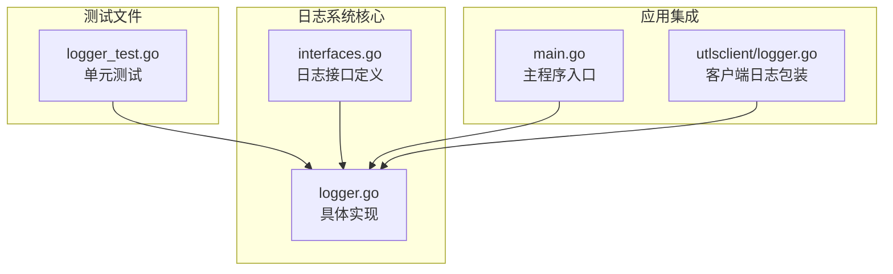
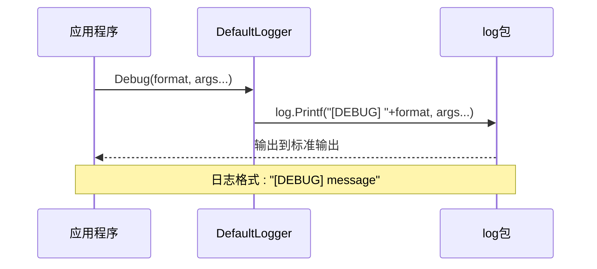
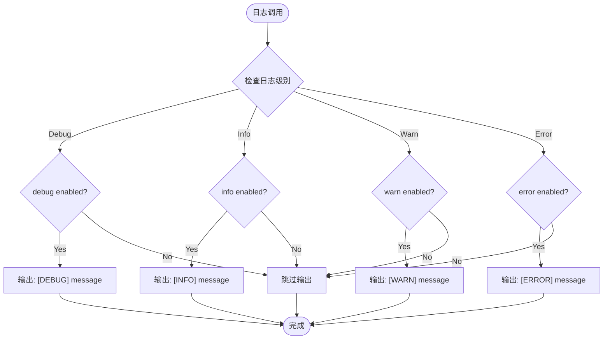
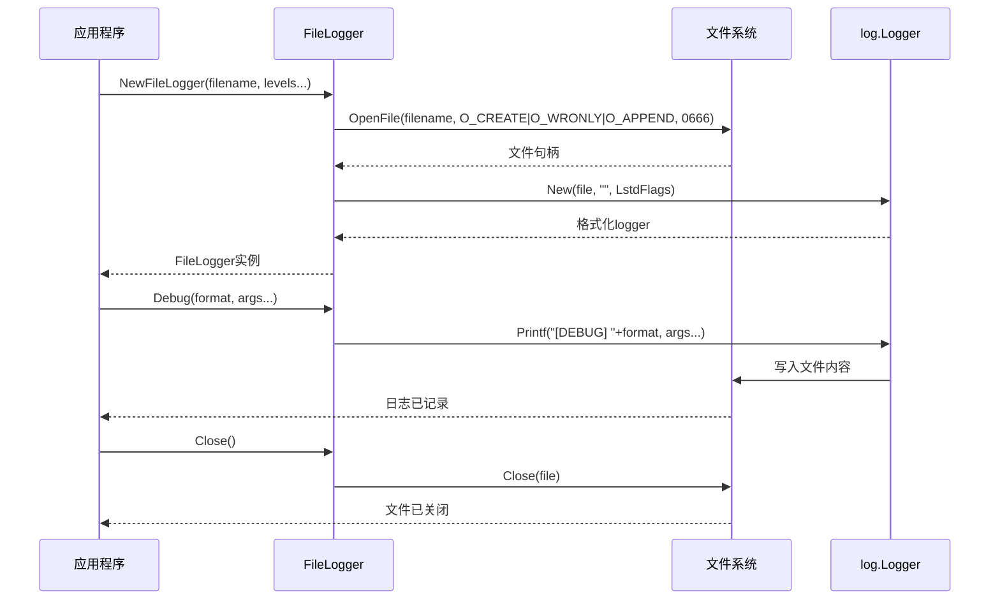
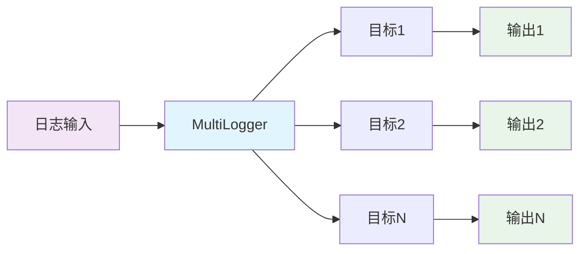
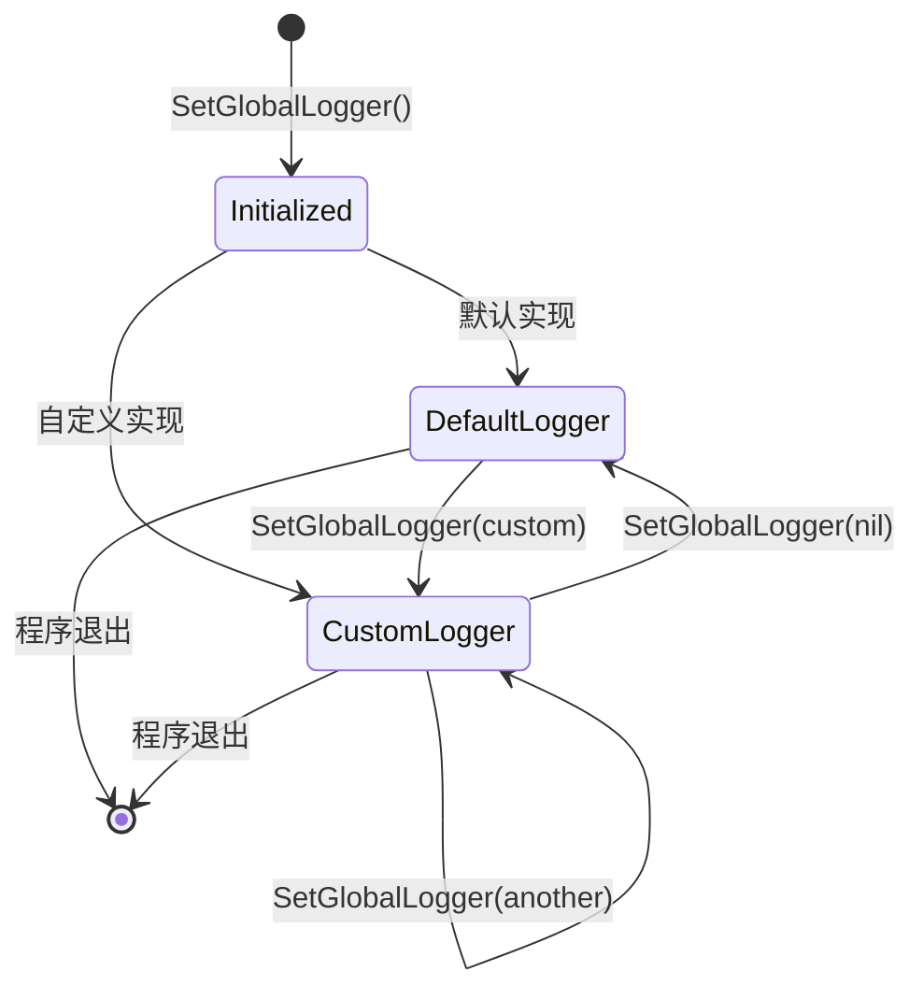
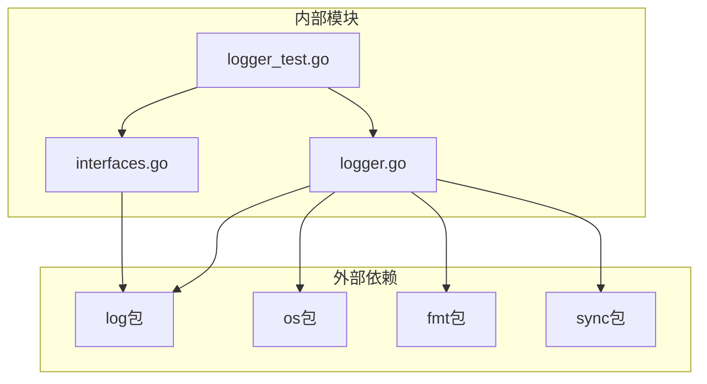

# 日志输出配置

<cite>
**本文档引用的文件**
- [logger.go](file://logger/logger.go)
- [interfaces.go](file://logger/interfaces.go)
- [logger_test.go](file://test/utlsclient/logger_test.go)
- [main.go](file://cmd/utlsclient/main.go)
- [logger.go](file://utlsclient/logger.go)
</cite>

## 目录
1. [简介](#简介)
2. [项目结构](#项目结构)
3. [核心组件](#核心组件)
4. [架构概览](#架构概览)
5. [详细组件分析](#详细组件分析)
6. [依赖关系分析](#依赖关系分析)
7. [性能考虑](#性能考虑)
8. [故障排除指南](#故障排除指南)
9. [结论](#结论)

## 简介

本日志系统是一个灵活且可扩展的日志框架，提供了多种输出目标和配置选项。系统采用接口驱动的设计模式，支持控制台输出、文件输出和自定义目标输出，并具备多目标同时输出的能力。通过统一的Logger接口，系统实现了日志功能的解耦和可插拔性。

## 项目结构

日志系统的核心文件位于`logger/`目录下，包含以下关键组件：



**图表来源**
- [interfaces.go](file://logger/interfaces.go#L1-L32)
- [logger.go](file://logger/logger.go#L1-L133)

**章节来源**
- [logger.go](file://logger/logger.go#L1-L133)
- [interfaces.go](file://logger/interfaces.go#L1-L32)

## 核心组件

### Logger接口

Logger接口定义了日志记录器的基本契约，包含四个级别的日志方法：

| 方法 | 描述 | 参数 |
|------|------|------|
| Debug | 调试级别日志 | format string, args ...interface{} |
| Info | 信息级别日志 | format string, args ...interface{} |
| Warn | 警告级别日志 | format string, args ...interface{} |
| Error | 错误级别日志 | format string, args ...interface{} |

### 内置日志记录器类型

系统提供了四种内置的日志记录器实现：

1. **DefaultLogger** - 使用标准库log包的默认实现
2. **ConsoleLogger** - 控制台输出记录器
3. **FileLogger** - 文件输出记录器
4. **MultiLogger** - 多目标组合记录器

**章节来源**
- [interfaces.go](file://logger/interfaces.go#L6-L11)
- [logger.go](file://logger/logger.go#L44-L106)

## 架构概览

日志系统采用分层架构设计，通过接口抽象实现不同输出目标的统一管理：

```mermaid
classDiagram
class Logger {
<<interface>>
+Debug(format string, args ...interface{})
+Info(format string, args ...interface{})
+Warn(format string, args ...interface{})
+Error(format string, args ...interface{})
}
class DefaultLogger {
+Debug(format string, args ...interface{})
+Info(format string, args ...interface{})
+Warn(format string, args ...interface{})
+Error(format string, args ...interface{})
}
class ConsoleLogger {
-debug bool
-info bool
-warn bool
-error bool
+NewConsoleLogger(debug, info, warn, error bool) *ConsoleLogger
+Debug(format string, args ...interface{})
+Info(format string, args ...interface{})
+Warn(format string, args ...interface{})
+Error(format string, args ...interface{})
}
class FileLogger {
-file *os.File
-logger *log.Logger
-debug bool
-info bool
-warn bool
-error bool
+NewFileLogger(filename string, debug, info, warn, error bool) (*FileLogger, error)
+Debug(format string, args ...interface{})
+Info(format string, args ...interface{})
+Warn(format string, args ...interface{})
+Error(format string, args ...interface{})
+Close() error
}
class MultiLogger {
-loggers []Logger
+NewMultiLogger(loggers ...Logger) *MultiLogger
+Debug(format string, args ...interface{})
+Info(format string, args ...interface{})
+Warn(format string, args ...interface{})
+Error(format string, args ...interface{})
}
class NopLogger {
+Debug(format string, args ...interface{})
+Info(format string, args ...interface{})
+Warn(format string, args ...interface{})
+Error(format string, args ...interface{})
}
Logger <|.. DefaultLogger
Logger <|.. ConsoleLogger
Logger <|.. FileLogger
Logger <|.. MultiLogger
Logger <|.. NopLogger
```

**图表来源**
- [interfaces.go](file://logger/interfaces.go#L6-L11)
- [logger.go](file://logger/logger.go#L44-L106)

## 详细组件分析

### DefaultLogger - 默认日志记录器

DefaultLogger是最基础的实现，直接使用Go标准库的log包进行日志输出：



**图表来源**
- [interfaces.go](file://logger/interfaces.go#L21-L30)

### ConsoleLogger - 控制台日志记录器

ConsoleLogger允许对不同日志级别进行独立控制，通过布尔参数决定是否启用相应级别的输出：



**图表来源**
- [logger.go](file://logger/logger.go#L55-L74)

### FileLogger - 文件日志记录器

FileLogger提供了持久化日志存储功能，支持文件自动创建、追加写入和格式化配置：



**图表来源**
- [logger.go](file://logger/logger.go#L85-L106)

### MultiLogger - 多目标日志记录器

MultiLogger实现了日志的广播功能，可以同时将日志输出到多个目标：



**图表来源**
- [logger.go](file://logger/logger.go#L108-L130)

### 全局日志管理

系统提供了全局日志记录器的管理功能，支持运行时切换不同的日志实现：



**章节来源**
- [logger.go](file://logger/logger.go#L16-L35)

## 依赖关系分析

日志系统的依赖关系相对简单，主要依赖于Go标准库：



**图表来源**
- [logger.go](file://logger/logger.go#L3-L8)
- [interfaces.go](file://logger/interfaces.go#L3)

**章节来源**
- [logger.go](file://logger/logger.go#L1-L133)
- [interfaces.go](file://logger/interfaces.go#L1-L32)

## 性能考虑

### 异步处理
- 使用sync.Once确保全局日志记录器的线程安全初始化
- 读写锁保护全局日志记录器的并发访问

### 资源管理
- FileLogger提供Close方法确保文件资源正确释放
- 支持文件追加模式避免覆盖现有日志

### 条件输出
- ConsoleLogger和FileLogger都实现了条件输出机制
- 只有在对应级别启用时才执行实际的日志输出操作

## 故障排除指南

### 常见问题及解决方案

| 问题 | 可能原因 | 解决方案 |
|------|----------|----------|
| 文件日志无法写入 | 文件权限不足 | 检查文件路径权限，确保程序有写入权限 |
| 多次关闭文件 | 重复调用Close() | 确保每个FileLogger实例只调用一次Close() |
| 日志输出为空 | 日志级别未启用 | 检查ConsoleLogger或FileLogger的级别配置 |
| 全局日志记录器无效 | 未正确初始化 | 使用SetGlobalLogger()设置有效的Logger实例 |

### 调试技巧

1. **使用NopLogger进行静默测试**：在测试环境中使用空日志记录器避免输出干扰
2. **验证日志级别配置**：通过测试确认各级别的输出行为符合预期
3. **检查文件路径**：确保文件日志记录器能够正确访问指定的文件路径

**章节来源**
- [logger_test.go](file://test/utlsclient/logger_test.go#L1-L173)

## 结论

本日志系统通过精心设计的接口和实现分离，提供了灵活而强大的日志输出配置能力。系统的主要优势包括：

1. **统一接口**：Logger接口确保了不同实现之间的互换性
2. **多样化输出**：支持控制台、文件和自定义目标输出
3. **多目标广播**：MultiLogger实现了一次写入多处输出的功能
4. **运行时配置**：支持动态切换日志实现
5. **资源管理**：提供文件资源的正确管理机制

该系统为应用程序提供了可靠的基础日志功能，同时保持了良好的扩展性和维护性。通过合理的配置和使用，可以满足各种场景下的日志需求。