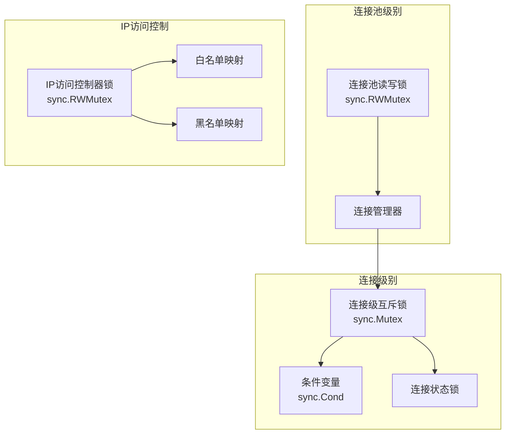
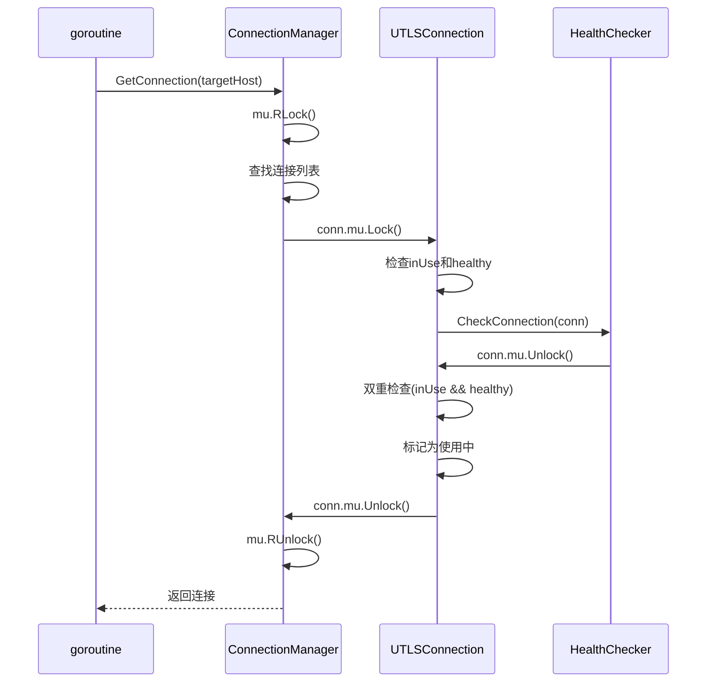
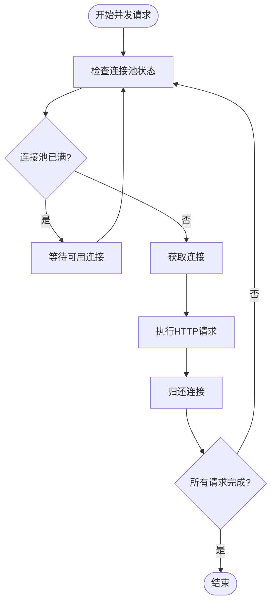
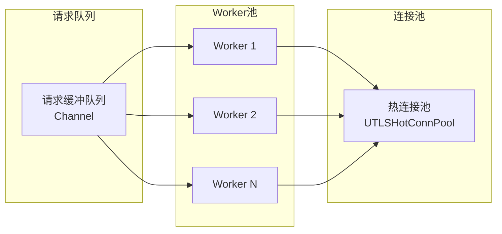
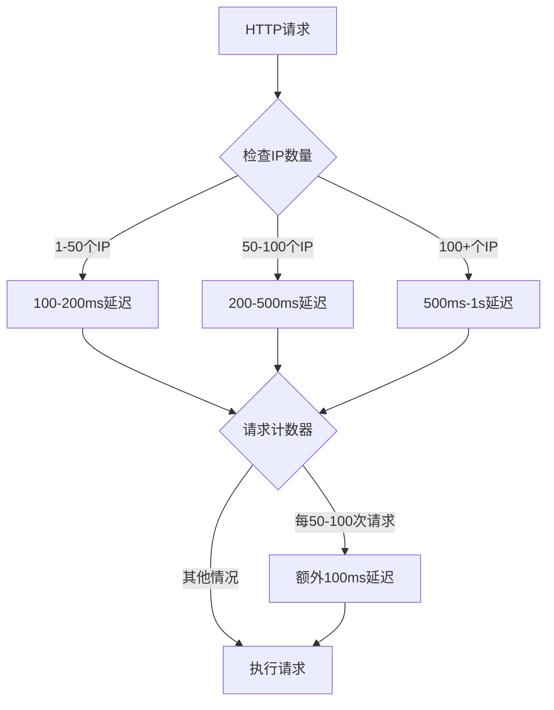
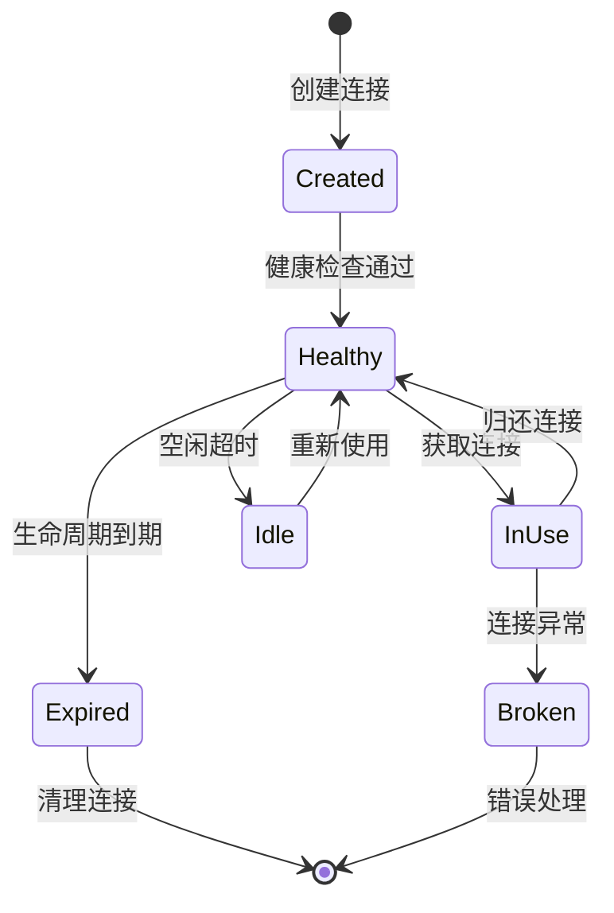
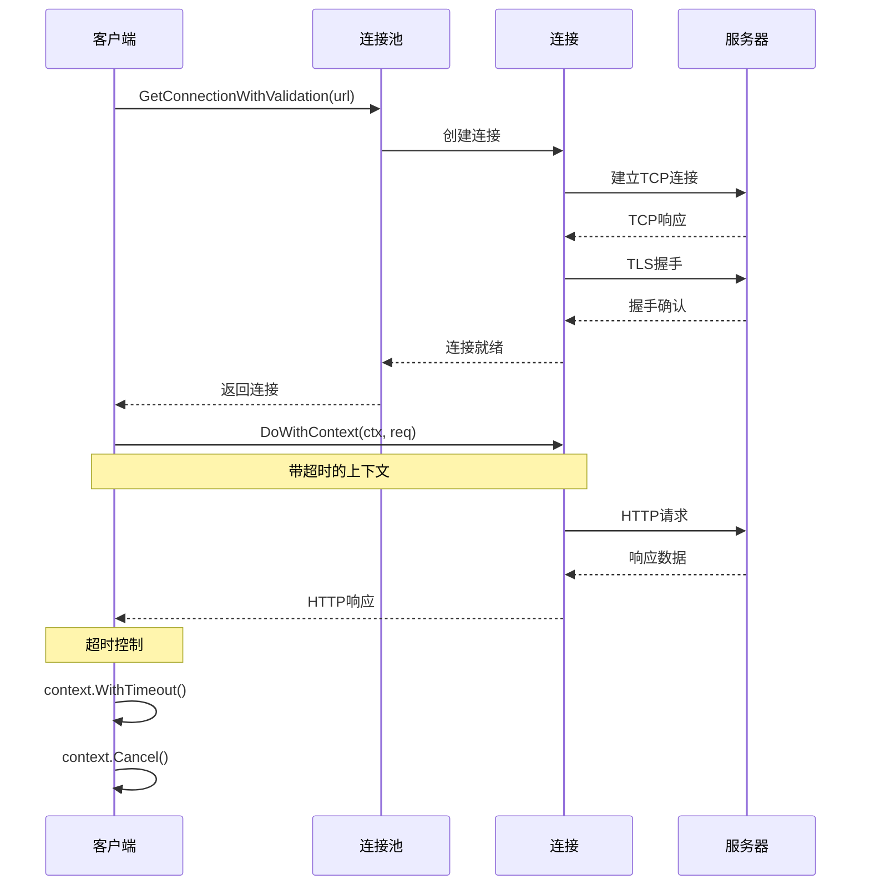
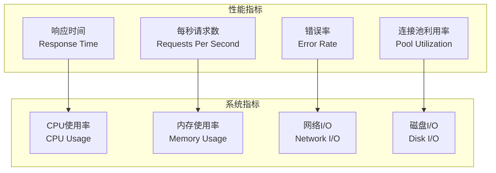

# 并发控制最佳实践

<cite>
**本文档中引用的文件**
- [examples/utlsclient/example_hotconnpool_usage.go](file://examples/utlsclient/example_hotconnpool_usage.go)
- [utlsclient/utlshotconnpool.go](file://utlsclient/utlshotconnpool.go)
- [utlsclient/connection_manager.go](file://utlsclient/connection_manager.go)
- [utlsclient/ip_access_controller.go](file://utlsclient/ip_access_controller.go)
- [utlsclient/health_checker.go](file://utlsclient/health_checker.go)
- [utlsclient/constants.go](file://utlsclient/constants.go)
- [utlsclient/interfaces.go](file://utlsclient/interfaces.go)
- [cmd/utlsclient/main.go](file://cmd/utlsclient/main.go)
- [localippool/localippool.go](file://localippool/localippool.go)
- [test/results/archive/final_pool_test.txt](file://test/results/archive/final_pool_test.txt)
- [test/utlsclient/utlshotconnpool_test.go](file://test/utlsclient/utlshotconnpool_test.go)
</cite>

## 目录
1. [概述](#概述)
2. [连接池并发安全机制](#连接池并发安全机制)
3. [goroutine数量控制策略](#goroutine数量控制策略)
4. [带缓冲worker池模式](#带缓冲worker池模式)
5. [人类行为模拟延迟](#人类行为模拟延迟)
6. [连接池内部并发控制](#连接池内部并发控制)
7. [context包超时控制](#context包超时控制)
8. [压力测试指导](#压力测试指导)
9. [实际代码示例](#实际代码示例)
10. [故障排除指南](#故障排除指南)

## 概述

在高并发环境下使用uTLS连接池时，正确的并发控制是确保系统稳定性和性能的关键。本文档详细介绍了如何通过多层次的并发控制机制来避免系统资源耗尽，同时提供最佳的性能表现。

### 核心并发控制原则

1. **连接级并发安全**：每个连接都有独立的锁保护
2. **连接池级并发控制**：通过配置参数限制总体并发度
3. **goroutine级流量控制**：使用worker池模式管理并发请求
4. **资源级保护**：防止系统资源过度消耗

## 连接池并发安全机制

### 多级锁设计架构

uTLS连接池采用了精心设计的多级锁架构来确保并发安全性：



**图表来源**
- [utlsclient/utlshotconnpool.go](file://utlsclient/utlshotconnpool.go#L255-L258)
- [utlsclient/connection_manager.go](file://utlsclient/connection_manager.go#L10-L12)
- [utlsclient/ip_access_controller.go](file://utlsclient/ip_access_controller.go#L11)

### 双重检查模式防止死锁

连接池实现了双重检查模式来防止死锁和竞态条件：



**图表来源**
- [utlsclient/utlshotconnpool.go](file://utlsclient/utlshotconnpool.go#L442-L480)

**章节来源**
- [utlsclient/utlshotconnpool.go](file://utlsclient/utlshotconnpool.go#L442-L480)
- [utlsclient/connection_manager.go](file://utlsclient/connection_manager.go#L10-L12)

## goroutine数量控制策略

### 基于IP数量的并发度建议

根据测试结果和实际经验，推荐以下并发度配置：

| IP数量范围 | 推荐并发goroutine数 | 连接池大小 | 延迟建议 |
|------------|-------------------|-----------|----------|
| 1-10个IP | 50-100 | 50-100 | 100-200ms |
| 10-50个IP | 100-200 | 100-200 | 50-100ms |
| 50-100个IP | 200-300 | 200-300 | 20-50ms |
| 100+个IP | 300+ | 300+ | 10-20ms |

### 动态goroutine调度



**图表来源**
- [test/results/archive/final_pool_test.txt](file://test/results/archive/final_pool_test.txt#L1-L76)

**章节来源**
- [test/results/archive/final_pool_test.txt](file://test/results/archive/final_pool_test.txt#L1-L76)

## 带缓冲worker池模式

### Worker池架构设计



### 实现带缓冲的worker池

```go
// 带缓冲的worker池实现示例
type WorkerPool struct {
    workers    int
    queue      chan *RequestTask
    pool       *UTLSHotConnPool
    semaphore  chan struct{}
}

func NewWorkerPool(workers int, pool *UTLSHotConnPool) *WorkerPool {
    return &WorkerPool{
        workers:   workers,
        queue:     make(chan *RequestTask, 1000),
        pool:      pool,
        semaphore: make(chan struct{}, workers),
    }
}

func (wp *WorkerPool) Start() {
    for i := 0; i < wp.workers; i++ {
        go func() {
            for task := range wp.queue {
                wp.semaphore <- struct{}{}
                wp.executeTask(task)
                <-wp.semaphore
            }
        }()
    }
}
```

**章节来源**
- [localippool/localippool.go](file://localippool/localippool.go#L408-L451)

## 人类行为模拟延迟

### 分层延迟策略

为了模拟人类行为，建议采用分层延迟策略：



### 延迟实现代码结构

```go
type HumanBehaviorSimulator struct {
    requestCount int
    ipCount      int
    delayConfig  DelayConfig
}

func (s *HumanBehaviorSimulator) ApplyDelay() {
    s.requestCount++
    
    // 基础延迟
    baseDelay := s.calculateBaseDelay()
    
    // 人类行为延迟
    humanDelay := s.calculateHumanDelay()
    
    // 总延迟
    totalDelay := baseDelay + humanDelay
    
    time.Sleep(totalDelay)
}

func (s *HumanBehaviorSimulator) calculateHumanDelay() time.Duration {
    if s.requestCount % 100 == 0 {
        return 100 * time.Millisecond
    }
    return 0
}
```

**章节来源**
- [test/results/archive/final_pool_test.txt](file://test/results/archive/final_pool_test.txt#L56-L76)

## 连接池内部并发控制

### 连接生命周期管理



### 连接池配置优化

基于测试结果，推荐的连接池配置：

| 配置项 | 推荐值 | 说明 |
|--------|--------|------|
| MaxConnections | 100-500 | 根据系统资源调整 |
| MaxConnsPerHost | 5-20 | 防止单主机连接过多 |
| MaxIdleConns | 20-100 | 空闲连接缓存数量 |
| ConnTimeout | 10-30s | 连接建立超时时间 |
| IdleTimeout | 30-120s | 空闲连接超时时间 |
| MaxLifetime | 300-600s | 连接最大生命周期 |

**章节来源**
- [utlsclient/utlshotconnpool.go](file://utlsclient/utlshotconnpool.go#L186-L201)
- [utlsclient/constants.go](file://utlsclient/constants.go#L38-L45)

## context包超时控制

### 请求级别的超时管理



**图表来源**
- [utlsclient/utlsclient.go](file://utlsclient/utlsclient.go#L104-L156)

### 超时控制实现

```go
func (c *UTLSClient) DoWithContext(ctx context.Context, req *http.Request) (*http.Response, error) {
    // 创建带超时的上下文
    if c.timeout > 0 {
        var cancel context.CancelFunc
        ctx, cancel = context.WithTimeout(ctx, c.timeout)
        defer cancel()
    }
    
    // 执行请求
    return c.doRequest(ctx, req)
}
```

**章节来源**
- [utlsclient/utlsclient.go](file://utlsclient/utlsclient.go#L104-L156)

## 压力测试指导

### 测试策略和步骤

#### 第一阶段：基准测试
1. **测试目标**：确定系统基线性能
2. **并发数**：10-20 goroutine
3. **持续时间**：5-10分钟
4. **监控指标**：
   - 响应时间分布
   - 错误率
   - 连接池利用率

#### 第二阶段：负载测试
1. **测试目标**：评估系统承载能力
2. **并发数**：逐步增加到最大预期值
3. **持续时间**：30分钟以上
4. **监控指标**：
   - 系统资源使用率
   - 连接池统计信息
   - 错误恢复能力

#### 第三阶段：稳定性测试
1. **测试目标**：验证长期运行稳定性
2. **并发数**：维持峰值负载
3. **持续时间**：24小时以上
4. **监控指标**：
   - 内存泄漏检测
   - CPU使用率趋势
   - 连接池健康状态

### 性能监控指标



### 压力测试配置示例

基于测试结果的配置建议：

```go
// 压力测试配置
type StressTestConfig struct {
    Concurrency     int           // 并发数
    Duration        time.Duration // 测试持续时间
    WarmUpDuration  time.Duration // 预热时间
    Interval        time.Duration // 统计间隔
    TargetRPS       int           // 目标每秒请求数
    Timeout         time.Duration // 请求超时
}
```

**章节来源**
- [test/results/archive/final_pool_test.txt](file://test/results/archive/final_pool_test.txt#L1-L76)

## 实际代码示例

### 带限流的并发请求处理

```go
package main

import (
    "context"
    "fmt"
    "net/http"
    "sync"
    "time"
    
    "crawler-platform/utlsclient"
)

// 限流并发处理器
type ConcurrentProcessor struct {
    pool           *utlsclient.UTLSHotConnPool
    limiter        chan struct{}
    wg             sync.WaitGroup
    maxRetries     int
    timeout        time.Duration
}

func NewConcurrentProcessor(pool *utlsclient.UTLSHotConnPool, concurrency int, timeout time.Duration) *ConcurrentProcessor {
    return &ConcurrentProcessor{
        pool:       pool,
        limiter:    make(chan struct{}, concurrency),
        maxRetries: 3,
        timeout:    timeout,
    }
}

func (p *ConcurrentProcessor) ProcessRequests(urls []string) ([]*http.Response, error) {
    results := make([]*http.Response, len(urls))
    errors := make([]error, len(urls))
    var mu sync.Mutex
    
    for i, url := range urls {
        p.wg.Add(1)
        go func(index int, url string) {
            defer p.wg.Done()
            
            // 限流控制
            p.limiter <- struct{}{}
            defer func() { <-p.limiter }()
            
            // 人类行为延迟
            p.applyHumanDelay(index)
            
            // 执行请求
            resp, err := p.executeRequest(context.Background(), url)
            
            // 保存结果
            mu.Lock()
            results[index] = resp
            errors[index] = err
            mu.Unlock()
        }(i, url)
    }
    
    p.wg.Wait()
    
    // 检查错误
    for _, err := range errors {
        if err != nil {
            return nil, fmt.Errorf("请求失败: %v", err)
        }
    }
    
    return results, nil
}

func (p *ConcurrentProcessor) applyHumanDelay(requestIndex int) {
    // 模拟人类行为延迟
    if requestIndex%100 == 0 {
        time.Sleep(100 * time.Millisecond)
    }
}

func (p *ConcurrentProcessor) executeRequest(ctx context.Context, url string) (*http.Response, error) {
    // 获取连接
    conn, err := p.pool.GetConnectionWithValidation(url)
    if err != nil {
        return nil, fmt.Errorf("获取连接失败: %v", err)
    }
    defer p.pool.PutConnection(conn)
    
    // 创建客户端
    client := utlsclient.NewUTLSClient(conn)
    client.SetTimeout(p.timeout)
    
    // 创建请求
    req, err := http.NewRequestWithContext(ctx, "GET", url, nil)
    if err != nil {
        return nil, fmt.Errorf("创建请求失败: %v", err)
    }
    
    // 执行请求
    return client.Do(req)
}
```

### 连接池监控和健康检查

```go
// 连接池监控器
type PoolMonitor struct {
    pool        *utlsclient.UTLSHotConnPool
    interval    time.Duration
    stopChan    chan struct{}
}

func NewPoolMonitor(pool *utlsclient.UTLSHotConnPool, interval time.Duration) *PoolMonitor {
    return &PoolMonitor{
        pool:     pool,
        interval: interval,
        stopChan: make(chan struct{}),
    }
}

func (m *PoolMonitor) Start() {
    go func() {
        ticker := time.NewTicker(m.interval)
        defer ticker.Stop()
        
        for {
            select {
            case <-ticker.C:
                m.checkPoolHealth()
            case <-m.stopChan:
                return
            }
        }
    }()
}

func (m *PoolMonitor) checkPoolHealth() {
    stats := m.pool.GetStats()
    
    fmt.Printf("连接池统计:\n")
    fmt.Printf("  总连接数: %d\n", stats.TotalConnections)
    fmt.Printf("  活跃连接数: %d\n", stats.ActiveConnections)
    fmt.Printf("  健康连接数: %d\n", stats.HealthyConnections)
    fmt.Printf("  总请求数: %d\n", stats.TotalRequests)
    fmt.Printf("  成功率: %.2f%%\n", stats.SuccessRate*100)
    
    // 健康检查
    if !m.pool.IsHealthy() {
        fmt.Println("警告: 连接池状态不健康!")
    }
}
```

**章节来源**
- [examples/utlsclient/example_hotconnpool_usage.go](file://examples/utlsclient/example_hotconnpool_usage.go#L1-L277)
- [cmd/utlsclient/main.go](file://cmd/utlsclient/main.go#L1-L113)

## 故障排除指南

### 常见并发问题及解决方案

#### 1. 连接池耗尽
**症状**：大量请求失败，返回连接池已满错误
**解决方案**：
- 增加MaxConnections配置
- 优化连接复用策略
- 实现连接预热机制

#### 2. goroutine泄漏
**症状**：系统内存持续增长，goroutine数量不断增加
**解决方案**：
- 确保正确关闭连接池
- 使用defer语句归还连接
- 实现goroutine数量限制

#### 3. 死锁问题
**症状**：程序卡死，部分goroutine无法继续执行
**解决方案**：
- 检查锁的获取顺序
- 使用context.WithTimeout避免无限等待
- 实现锁超时机制

#### 4. 性能下降
**症状**：响应时间逐渐增加，吞吐量下降
**解决方案**：
- 调整连接池配置参数
- 优化健康检查频率
- 实现连接预热和老化机制

### 监控和诊断工具

```go
// 并发诊断工具
type ConcurrencyDiagnostics struct {
    pool        *utlsclient.UTLSHotConnPool
    startTime   time.Time
    metrics     map[string]interface{}
}

func (d *ConcurrencyDiagnostics) CollectMetrics() {
    d.metrics = make(map[string]interface{})
    
    stats := d.pool.GetStats()
    d.metrics["total_connections"] = stats.TotalConnections
    d.metrics["active_connections"] = stats.ActiveConnections
    d.metrics["healthy_connections"] = stats.HealthyConnections
    d.metrics["success_rate"] = stats.SuccessRate
    d.metrics["avg_response_time"] = stats.AvgResponseTime.Seconds()
    
    // 计算并发度指标
    uptime := time.Since(d.startTime)
    requestsPerSecond := float64(stats.TotalRequests) / uptime.Seconds()
    d.metrics["requests_per_second"] = requestsPerSecond
}

func (d *ConcurrencyDiagnostics) Report() string {
    var report string
    for key, value := range d.metrics {
        report += fmt.Sprintf("%s: %v\n", key, value)
    }
    return report
}
```

### 性能优化建议

1. **连接复用优化**
   - 合理设置IdleTimeout和MaxLifetime
   - 实现连接预热机制
   - 优化健康检查策略

2. **goroutine管理**
   - 使用worker pool模式
   - 实现goroutine数量限制
   - 优化channel缓冲区大小

3. **资源管理**
   - 监控系统资源使用情况
   - 实现资源回收机制
   - 优化垃圾回收策略

4. **网络优化**
   - 启用HTTP/2支持
   - 实现连接池预热
   - 优化DNS解析策略

通过遵循这些并发控制最佳实践，可以构建一个稳定、高效的uTLS连接池系统，在高并发环境下保持良好的性能表现。