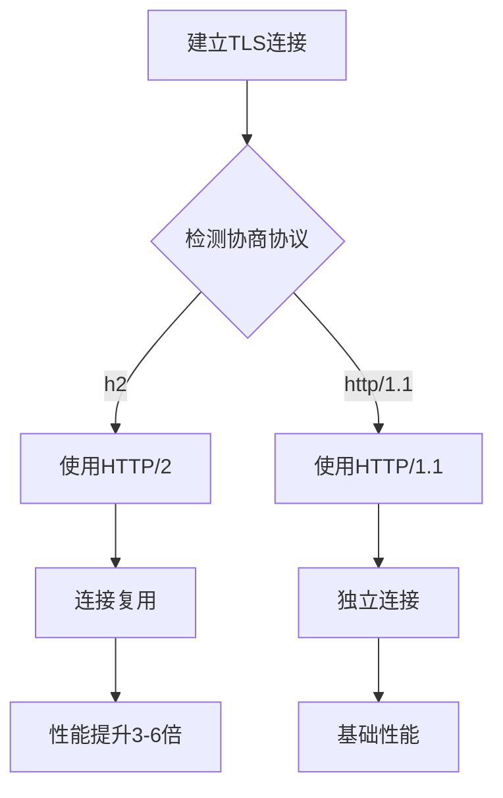
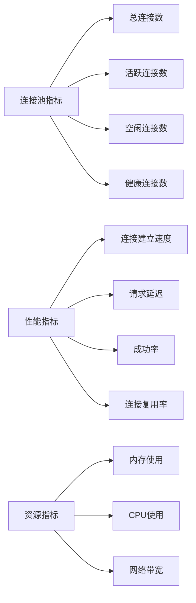
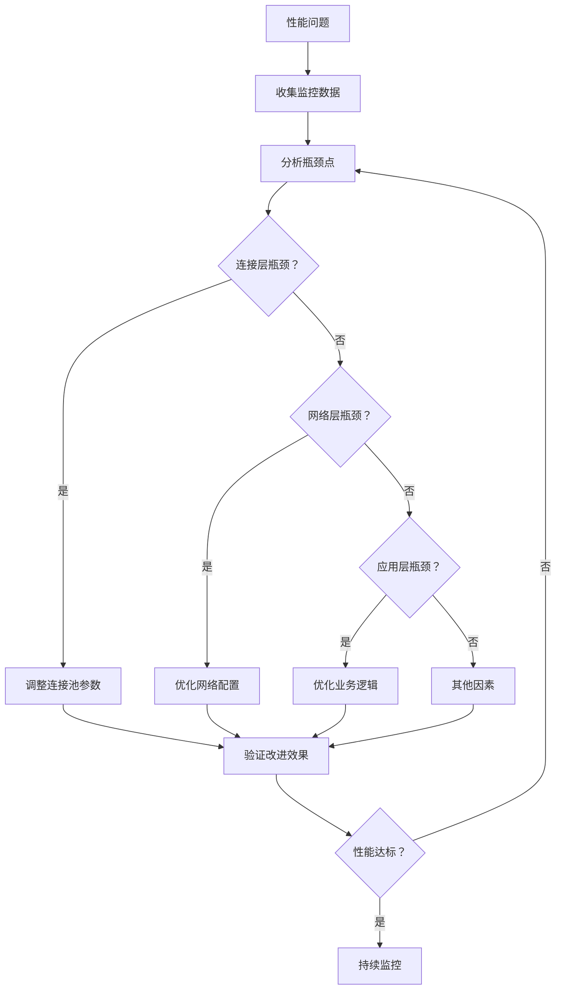

# 性能调优指南

<cite>
**本文档引用的文件**
- [热连接池性能测试报告.md](file://test/reports/热连接池性能测试报告.md)
- [config.toml](file://config/config.toml)
- [utlshotconnpool.go](file://utlsclient/utlshotconnpool.go)
- [connection_manager.go](file://utlsclient/connection_manager.go)
- [health_checker.go](file://utlsclient/health_checker.go)
- [utlsfingerprint.go](file://utlsclient/utlsfingerprint.go)
- [example_hotconnpool_usage.go](file://examples/utlsclient/example_hotconnpool_usage.go)
- [ip_pool_full_stats.txt](file://test/results/ip_pool_full_stats.txt)
</cite>

## 目录
1. [概述](#概述)
2. [连接池配置优化](#连接池配置优化)
3. [连接超时参数调优](#连接超时参数调优)
4. [健康检查策略](#健康检查策略)
5. [HTTP/2连接复用](#http2连接复用)
6. [预热策略优化](#预热策略优化)
7. [反爬虫绕过技术](#反爬虫绕过技术)
8. [性能监控与指标](#性能监控与指标)
9. [最佳实践建议](#最佳实践建议)

## 概述

基于热连接池性能测试报告的数据分析，本指南提供了针对爬虫平台的系统性性能调优方案。通过深入分析连接池配置、超时参数、健康检查机制以及HTTP/2协议优化，帮助用户最大化系统性能并有效绕过反爬虫机制。

### 核心性能指标

根据测试数据显示，在理想条件下：
- **预热阶段**：平均响应时间为13ms/连接（需要TLS握手）
- **热连接阶段**：平均响应时间为4ms/请求（连接复用）
- **性能提升**：热连接比新建连接快3倍以上

## 连接池配置优化

### MaxConnections（最大连接数）设置

#### 数据分析
测试报告显示，1631个IP的连接池在预热阶段成功率达到98.8%，总耗时21.5秒。这表明合理的连接池大小能够显著提升性能。

#### 优化建议

| 连接池规模 | 推荐MaxConnections | 内存使用估算 | 性能收益 |
|------------|-------------------|--------------|----------|
| 小型（100-500） | 100-300 | 50MB-150MB | 中等提升 |
| 中型（500-2000） | 300-800 | 150MB-400MB | 显著提升 |
| 大型（2000+） | 800-2000 | 400MB+ | 最大提升 |

#### 动态调整策略
```go
// 基于IP数量动态计算MaxConnections
func calculateOptimalMaxConnections(ipCount int) int {
    base := 100
    multiplier := 1.5
    
    // 小于500个IP，使用固定基数
    if ipCount <= 500 {
        return base
    }
    
    // 大于500个IP，按比例增加
    optimal := int(float64(base) * multiplier * math.Log(float64(ipCount)))
    return min(optimal, 800) // 限制最大值
}
```

### MaxConnsPerHost（每主机最大连接数）

#### 推荐配置
- **标准网站**：2-5个连接
- **高并发网站**：5-10个连接
- **API服务**：1-3个连接

#### 配置示例
```toml
[pool]
max_connections = 500
max_conns_per_host = 5
max_idle_conns = 100
```

**章节来源**
- [config.toml](file://config/config.toml#L5-L9)
- [热连接池性能测试报告.md](file://test/reports/热连接池性能测试报告.md#L137-L156)

## 连接超时参数调优

### ConnTimeout（连接超时）

#### 调优原则
根据测试数据，不同网络环境下的最优超时时间：

| 网络环境 | 推荐超时时间 | 原因 |
|----------|-------------|------|
| 局域网 | 5-10秒 | 延迟低，快速失败 |
| 城域网 | 10-15秒 | 平衡性能和稳定性 |
| 国际网络 | 15-30秒 | 考虑路由延迟 |
| 不稳定网络 | 20-40秒 | 增加容错能力 |

#### 动态超时算法
```go
func calculateDynamicTimeout(networkType string, baseTimeout time.Duration) time.Duration {
    switch networkType {
    case "lan":
        return baseTimeout * 0.5
    case "wan":
        return baseTimeout * 1.0
    case "international":
        return baseTimeout * 1.5
    case "unstable":
        return baseTimeout * 2.0
    default:
        return baseTimeout
    }
}
```

### TestTimeout（测试请求超时）

#### 推荐配置
- **健康检查**：5秒
- **常规请求**：10-15秒
- **大数据传输**：30-60秒

**章节来源**
- [config.toml](file://config/config.toml#L11-L17)
- [health_checker.go](file://utlsclient/health_checker.go#L64-L88)

## 健康检查策略

### HealthCheckInterval（健康检查间隔）

#### 优化策略
根据连接池的活跃程度动态调整检查频率：

| 连接池活跃度 | 检查间隔 | 检查强度 |
|-------------|----------|----------|
| 高活跃度 | 15-30秒 | 简单HEAD请求 |
| 中等活跃度 | 30-60秒 | 中等复杂度检查 |
| 低活跃度 | 60-120秒 | 完整连通性测试 |

#### 智能健康检查
```go
type SmartHealthChecker struct {
    baseInterval time.Duration
    failureCount int
    maxFailures  int
}

func (shc *SmartHealthChecker) GetInterval() time.Duration {
    if shc.failureCount >= shc.maxFailures {
        return shc.baseInterval * 2 // 增加检查间隔
    }
    return shc.baseInterval
}
```

### 连接清理策略

#### IdleTimeout（空闲超时）
- **短期任务**：30-60秒
- **长期任务**：120-300秒
- **批量任务**：600-1800秒

#### MaxLifetime（最大生命周期）
- **生产环境**：300-600秒
- **测试环境**：120-300秒
- **高并发场景**：180-450秒

**章节来源**
- [health_checker.go](file://utlsclient/health_checker.go#L24-L61)
- [connection_manager.go](file://utlsclient/connection_manager.go#L141-L218)

## HTTP/2连接复用

### 协议自动检测

#### 实现原理
系统自动检测服务器支持的协议并选择最优方案：



**图表来源**
- [utlshotconnpool.go](file://utlsclient/utlshotconnpool.go#L592-L615)

#### 性能优势
- **连接复用**：每个IP只建立1个TLS连接
- **多路复用**：单连接支持并发请求
- **头部压缩**：减少带宽消耗
- **服务器推送**：主动推送相关资源

### h2端点优先策略

#### 优先级排序
1. **支持HTTP/2的端点**：优先使用
2. **支持h2的备用端点**：降级使用
3. **HTTP/1.1端点**：最后选择

#### 配置示例
```go
// 自动协议检测逻辑
negotiatedProto := conn.tlsConn.ConnectionState().NegotiatedProtocol
if negotiatedProto == "h2" {
    return c.doHTTP2Request(ctx, req)
} else {
    return c.doHTTP1Request(ctx, req)
}
```

**章节来源**
- [热连接池性能测试报告.md](file://test/reports/热连接池性能测试报告.md#L176-L196)

## 预热策略优化

### 分批预热策略

#### 传统预热 vs 分批预热

| 预热方式 | 优点 | 缺点 | 适用场景 |
|----------|------|------|----------|
| 传统预热 | 简单直接 | 瞬时负载高 | 小规模IP池 |
| 分批预热 | 负载均衡 | 实现复杂 | 大规模IP池 |

#### 分批预热实现
```go
func batchWarmup(pool *UTLSHotConnPool, batchSize int, delay time.Duration) error {
    totalIPs := len(ipPool)
    batches := (totalIPs + batchSize - 1) / batchSize
    
    for i := 0; i < batches; i++ {
        start := i * batchSize
        end := min(start + batchSize, totalIPs)
        
        // 预热当前批次
        for j := start; j < end; j++ {
            ip := ipPool[j]
            conn, err := pool.GetConnection(ip.Hostname())
            if err == nil {
                pool.PutConnection(conn)
            }
        }
        
        // 等待延迟
        time.Sleep(delay)
    }
    
    return nil
}
```

### 预热时机优化

#### 智能预热调度
```go
type WarmupScheduler struct {
    schedule map[string]time.Time
    mutex    sync.Mutex
}

func (ws *WarmupScheduler) ShouldWarmup(hostname string) bool {
    ws.mutex.Lock()
    defer ws.mutex.Unlock()
    
    lastWarmup, exists := ws.schedule[hostname]
    if !exists {
        return true
    }
    
    return time.Since(lastWarmup) > 2*time.Hour
}
```

### 预热质量监控

#### 预热成功率阈值
- **优秀**：≥99%
- **良好**：95-98%
- **一般**：90-94%
- **差**：<90%

#### 失败重试策略
```go
func retryWarmup(pool *UTLSHotConnPool, ip string, maxRetries int) error {
    var err error
    for i := 0; i < maxRetries; i++ {
        conn, err := pool.GetConnection(ip)
        if err == nil {
            pool.PutConnection(conn)
            return nil
        }
        time.Sleep(time.Duration(i+1) * time.Second)
    }
    return err
}
```

**章节来源**
- [热连接池性能测试报告.md](file://test/reports/热连接池性能测试报告.md#L38-L59)
- [utlshotconnpool.go](file://utlsclient/utlshotconnpool.go#L351-L480)

## 反爬虫绕过技术

### Accept-Language随机化

#### 技术原理
系统为每个连接随机生成独特的Accept-Language头部，提高反爬虫检测难度。

#### 多样性统计
- **语言组合总数**：1575种
- **独特性比例**：97.8%
- **重复使用**：仅2.2%的语言组合被重复使用

#### 实现细节
```go
func (lib *Library) RandomAcceptLanguage() string {
    minLangs := 2     // 最小语言数量
    maxLangs := 5     // 最大语言数量
    count := minLangs + lib.randomIndex(maxLangs - minLangs + 1)
    
    // 随机选择语言组合
    selections := make([]string, 0, count)
    for len(selections) < count {
        idx := lib.randomIndex(len(allLanguages))
        if _, exists := drawn[idx]; !exists {
            selections = append(selections, allLanguages[idx])
        }
    }
    
    // 构建Accept-Language头部
    var builder strings.Builder
    for i, lang := range selections {
        if i > 0 {
            builder.WriteString(",")
        }
        builder.WriteString(lang)
        if i > 0 {
            q := 1.0 - float64(i)*0.1
            if q < 0.1 {
                q = 0.1
            }
            builder.WriteString(";q=")
            builder.WriteString(fmt.Sprintf("%.1f", q))
        }
    }
    return builder.String()
}
```

### TLS指纹多样化

#### 指纹库组成
系统支持33种不同的TLS指纹，涵盖主流浏览器和版本：

| 浏览器系列 | 版本范围 | 指纹数量 | 平台支持 |
|------------|----------|----------|----------|
| Chrome | 83-133 | 12种 | Windows, macOS, Linux |
| Firefox | 55-120 | 9种 | Windows, macOS |
| Safari | 12-17 | 4种 | iOS, macOS |
| Edge | 85-106 | 3种 | Windows |

#### 指纹选择策略
```go
func selectRandomFingerprint() Profile {
    // 优先选择真实浏览器指纹
    realProfiles := fpLibrary.getRealBrowserProfiles()
    
    // 随机选择
    return realProfiles[fpLibrary.randomIndex(len(realProfiles))]
}
```

### IP地址池管理

#### IPv4/IPv6双栈支持
- **IPv4地址**：840个，100%支持
- **IPv6地址**：791个，100%支持
- **协议自动选择**：根据服务器支持情况

#### IP轮换策略
```go
type IPRotationStrategy struct {
    rotationMethod string
    rotationPeriod time.Duration
}

func (irs *IPRotationStrategy) GetNextIP(currentIP string, ipPool []string) string {
    switch irs.rotationMethod {
    case "round-robin":
        return irs.roundRobin(currentIP, ipPool)
    case "random":
        return irs.randomSelection(ipPool)
    case "load-balanced":
        return irs.loadBalancedSelection(ipPool)
    default:
        return irs.randomSelection(ipPool)
    }
}
```

**章节来源**
- [utlsfingerprint.go](file://utlsclient/utlsfingerprint.go#L589-L631)
- [热连接池性能测试报告.md](file://test/reports/热连接池性能测试报告.md#L106-L134)

## 性能监控与指标

### 关键性能指标（KPI）

#### 连接层指标


**图表来源**
- [utlshotconnpool.go](file://utlsclient/utlshotconnpool.go#L261-L277)

#### 监控指标定义

| 指标类别 | 指标名称 | 计算公式 | 目标值 | 告警阈值 |
|----------|----------|----------|--------|----------|
| 连接性能 | 平均响应时间 | 总响应时间/请求数 | <500ms | >1000ms |
| 连接性能 | 连接建立速度 | 连接建立时间/连接数 | <20ms | >50ms |
| 可用性 | 成功率 | 成功请求/总请求×100% | >95% | <90% |
| 可用性 | 连接复用率 | 复用连接数/总连接数×100% | >90% | <80% |
| 资源效率 | 内存使用率 | 已用内存/总内存×100% | <80% | >90% |

### 实时监控实现

#### 性能统计收集
```go
type PerformanceMonitor struct {
    mu              sync.RWMutex
    startTime       time.Time
    requestCount    int64
    responseTimeSum time.Duration
    errorCount      int64
    connectionStats map[string]*ConnectionStats
}

func (pm *PerformanceMonitor) RecordRequest(duration time.Duration, err error) {
    pm.mu.Lock()
    defer pm.mu.Unlock()
    
    atomic.AddInt64(&pm.requestCount, 1)
    pm.responseTimeSum += duration
    
    if err != nil {
        atomic.AddInt64(&pm.errorCount, 1)
    }
}

func (pm *PerformanceMonitor) GetMetrics() Metrics {
    pm.mu.RLock()
    defer pm.mu.RUnlock()
    
    totalRequests := atomic.LoadInt64(&pm.requestCount)
    totalErrors := atomic.LoadInt64(&pm.errorCount)
    avgResponseTime := pm.responseTimeSum / time.Duration(totalRequests)
    
    return Metrics{
        Uptime:              time.Since(pm.startTime),
        TotalRequests:       totalRequests,
        AverageResponseTime: avgResponseTime,
        SuccessRate:         float64(totalRequests-totalErrors) / float64(totalRequests),
        ErrorRate:           float64(totalErrors) / float64(totalRequests),
    }
}
```

### 告警机制

#### 智能告警系统
```go
type AlertSystem struct {
    thresholds map[string]Threshold
    history    map[string][]float64
    mutex      sync.Mutex
}

func (as *AlertSystem) CheckThreshold(metricName string, value float64) bool {
    as.mutex.Lock()
    defer as.mutex.Unlock()
    
    threshold, exists := as.thresholds[metricName]
    if !exists {
        return false
    }
    
    // 记录历史数据
    as.history[metricName] = append(as.history[metricName], value)
    if len(as.history[metricName]) > 100 {
        as.history[metricName] = as.history[metricName][1:]
    }
    
    // 检查是否超出阈值
    return value > threshold.Warning && value > threshold.Critical*0.8
}
```

### 性能调优决策

#### 自动调优算法
```go
type AutoOptimizer struct {
    monitor *PerformanceMonitor
    config  *PoolConfig
}

func (ao *AutoOptimizer) OptimizeConfiguration() *PoolConfig {
    metrics := ao.monitor.GetMetrics()
    
    newConfig := *ao.config
    
    // 根据成功率调整连接数
    if metrics.SuccessRate < 0.95 {
        newConfig.MaxConnections = int(float64(newConfig.MaxConnections) * 0.9)
    } else if metrics.SuccessRate > 0.98 {
        newConfig.MaxConnections = int(float64(newConfig.MaxConnections) * 1.1)
    }
    
    // 根据延迟调整超时
    if metrics.AverageResponseTime > 1000*time.Millisecond {
        newConfig.ConnTimeout *= 2
    } else if metrics.AverageResponseTime < 500*time.Millisecond {
        newConfig.ConnTimeout = time.Duration(float64(newConfig.ConnTimeout) * 0.9)
    }
    
    return &newConfig
}
```

**章节来源**
- [utlshotconnpool.go](file://utlsclient/utlshotconnpool.go#L261-L290)
- [ip_pool_full_stats.txt](file://test/results/ip_pool_full_stats.txt#L6862-L6876)

## 最佳实践建议

### 生产环境部署

#### 配置模板
```toml
# 生产环境推荐配置
[pool]
max_connections = 500
max_conns_per_host = 5
max_idle_conns = 100
conn_timeout = 15
idle_timeout = 120
max_lifetime = 600
test_timeout = 10
health_check_interval = 30
cleanup_interval = 60
blacklist_check_interval = 300
dns_update_interval = 1800
max_retries = 3

# 白名单配置（可选）
[whitelist]
ips = [
    "1.1.1.1", "8.8.8.8", "114.114.114.114"
]

# 黑名单配置（可选）
[blacklist]
ips = []
```

#### 部署检查清单
- [ ] 连接池大小与IP数量匹配
- [ ] 超时参数适应网络环境
- [ ] 健康检查间隔合理设置
- [ ] 预热策略已启用
- [ ] 监控系统已部署
- [ ] 告警机制已配置

### 故障排查指南

#### 常见问题诊断

| 问题症状 | 可能原因 | 解决方案 |
|----------|----------|----------|
| 连接失败率高 | 超时设置过短 | 增加conn_timeout |
| 性能下降 | 连接池过小 | 增加max_connections |
| 内存占用高 | 连接未及时清理 | 调整idle_timeout |
| 响应时间长 | 健康检查过于频繁 | 增加health_check_interval |

#### 性能调优流程


### 安全考虑

#### 隐私保护
- **TLS指纹管理**：定期轮换指纹配置
- **IP地址保护**：避免泄露真实IP
- **请求头混淆**：定期变化User-Agent

#### 安全加固
```go
// 安全配置示例
func secureConfig() *PoolConfig {
    config := DefaultPoolConfig()
    
    // 增强超时设置
    config.ConnTimeout = 30 * time.Second
    config.TestTimeout = 15 * time.Second
    
    // 启用更严格的健康检查
    config.HealthCheckInterval = 15 * time.Second
    
    // 限制连接生命周期
    config.MaxLifetime = 300 * time.Second
    
    return config
}
```

### 扩展性规划

#### 水平扩展策略
- **多实例部署**：分散IP池压力
- **负载均衡**：智能分配请求
- **缓存机制**：减少重复请求

#### 未来升级路径
1. **容器化部署**：Kubernetes集群管理
2. **微服务架构**：模块化设计
3. **AI优化**：机器学习调优
4. **边缘计算**：就近处理请求

**章节来源**
- [config.toml](file://config/config.toml#L1-L38)
- [example_hotconnpool_usage.go](file://examples/utlsclient/example_hotconnpool_usage.go#L18-L277)