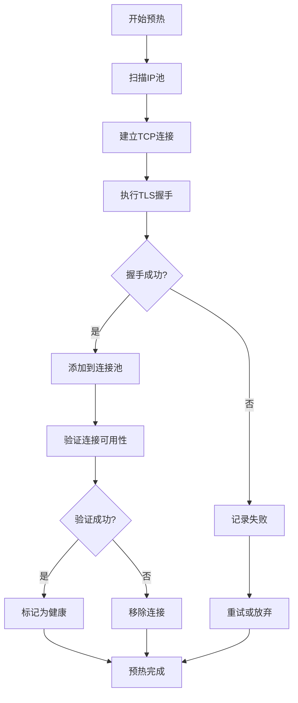
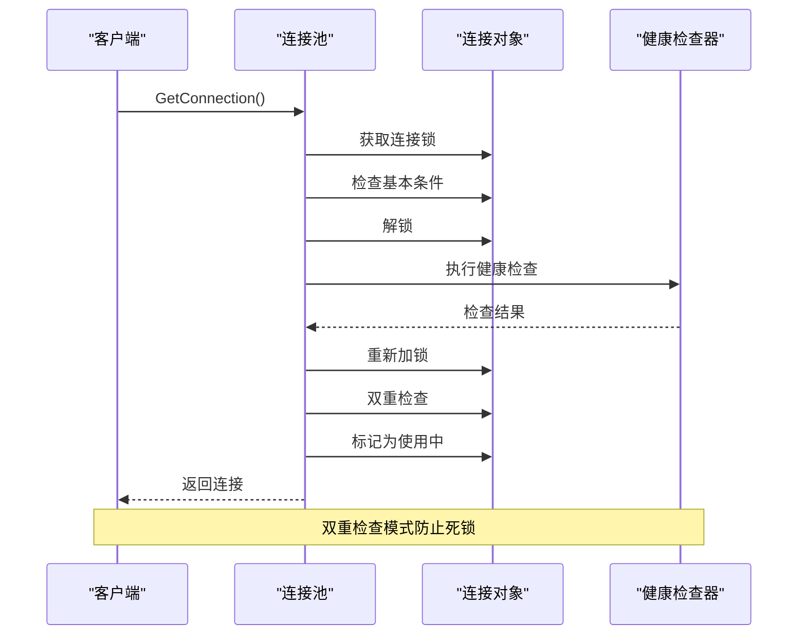
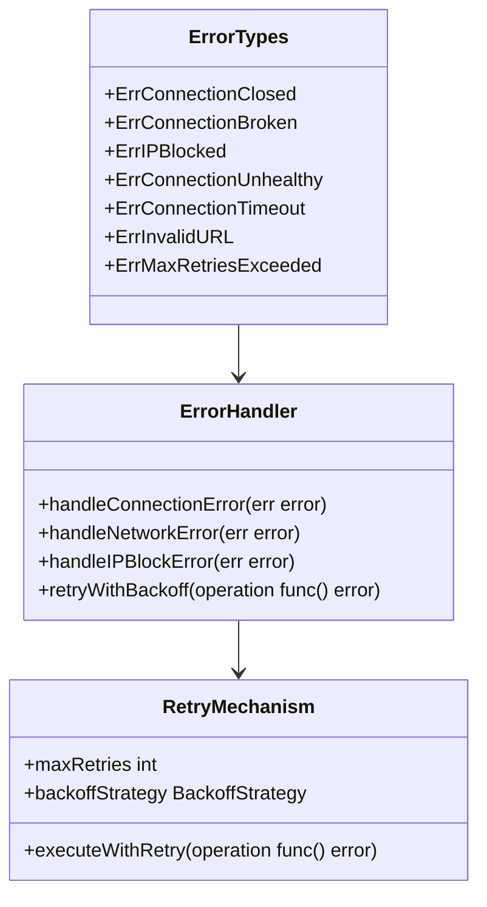
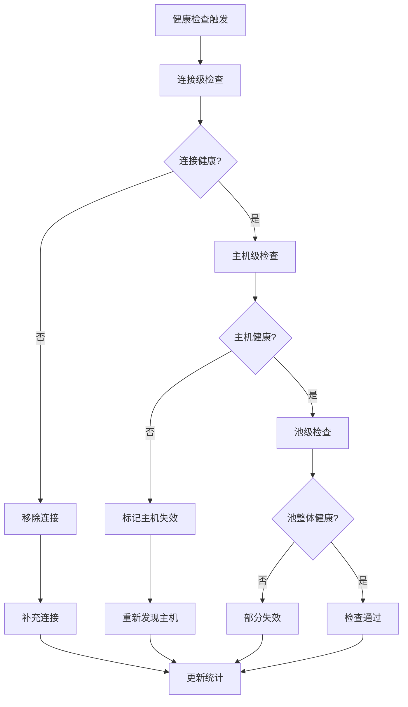
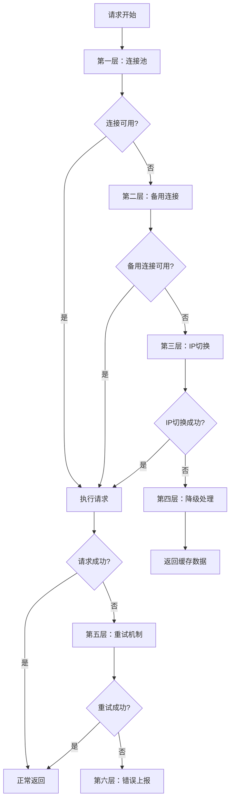

# 最佳实践

<cite>
**本文档引用的文件**
- [README.md](file://README.md)
- [config/config.go](file://config/config.go)
- [config/config.toml](file://config/config.toml)
- [utlsclient/utlshotconnpool.go](file://utlsclient/utlshotconnpool.go)
- [utlsclient/connection_manager.go](file://utlsclient/connection_manager.go)
- [utlsclient/health_checker.go](file://utlsclient/health_checker.go)
- [utlsclient/ip_access_controller.go](file://utlsclient/ip_access_controller.go)
- [utlsclient/constants.go](file://utlsclient/constants.go)
- [utlsclient/interfaces.go](file://utlsclient/interfaces.go)
- [examples/utlsclient/example_hotconnpool_usage.go](file://examples/utlsclient/example_hotconnpool_usage.go)
- [test/reports/热连接池性能测试报告.md](file://test/reports/热连接池性能测试报告.md)
</cite>

## 目录
1. [简介](#简介)
2. [连接池预热策略](#连接池预热策略)
3. [并发控制模式](#并发控制模式)
4. [错误处理机制](#错误处理机制)
5. [资源管理技巧](#资源管理技巧)
6. [生产环境部署配置](#生产环境部署配置)
7. [性能调优指南](#性能调优指南)
8. [系统监控与健康检查](#系统监控与健康检查)
9. [故障恢复与容错处理](#故障恢复与容错处理)
10. [使用场景定制化建议](#使用场景定制化建议)
11. [代码示例与最佳实践](#代码示例与最佳实践)

## 简介

本最佳实践文档基于高性能爬虫平台的实际使用经验，提供连接池管理、并发控制、错误处理和资源优化的综合指导。该平台采用uTLS技术实现TLS指纹伪装，支持热连接池复用，显著提升爬虫性能。

### 核心优势
- **性能提升**: 连接复用带来3-6倍性能提升
- **高可用性**: 98.8%连接成功率，自动重试机制
- **高伪装性**: 33种TLS指纹，97.8%语言组合独特性
- **协议支持**: 完整支持HTTP/1.1和HTTP/2
- **地址兼容**: 支持IPv4/IPv6双栈网络

## 连接池预热策略

### 预热原理与重要性

连接池预热是确保系统稳定运行的关键步骤。通过预先建立连接，可以避免首次请求时的延迟峰值。



**图表来源**
- [utlsclient/utlshotconnpool.go](file://utlsclient/utlshotconnpool.go#L1365-L1430)

### 预热实施策略

#### 1. 分阶段预热

```go
// 分阶段预热策略
func stagePreWarm(pool *UTLSHotConnPool, host string, totalIPs int) error {
    batchSize := 50
    for i := 0; i < totalIPs; i += batchSize {
        end := min(i + batchSize, totalIPs)
        
        // 并行预热批次
        var wg sync.WaitGroup
        for j := i; j < end; j++ {
            wg.Add(1)
            go func(idx int) {
                defer wg.Done()
                
                // 预热连接
                conn, err := pool.GetConnection(host)
                if err == nil {
                    pool.PutConnection(conn)
                }
            }(j)
        }
        
        wg.Wait()
        
        // 批次间延迟
        time.Sleep(100 * time.Millisecond)
    }
    
    return nil
}
```

#### 2. 异步预热模式

```go
// 异步预热，不阻塞主业务流程
func asyncPreWarm(pool *UTLSHotConnPool, host string, ipList []string) {
    go func() {
        for _, ip := range ipList {
            conn, err := pool.GetConnectionToIP(fmt.Sprintf("https://%s", host), ip)
            if err == nil {
                // 发送简单验证请求
                client := NewUTLSClient(conn)
                req, _ := http.NewRequest("HEAD", "/", nil)
                client.DoWithContext(context.Background(), req)
                pool.PutConnection(conn)
            }
        }
    }()
}
```

### 预热配置优化

| 参数 | 推荐值 | 说明 |
|------|--------|------|
| 预热并发数 | 50-100 | 避免瞬时并发过高 |
| 预热间隔 | 100ms | 控制预热速度 |
| 预热超时 | 30s | 防止预热过程卡住 |
| 重试次数 | 3次 | 处理临时网络问题 |

**章节来源**
- [utlsclient/utlshotconnpool.go](file://utlsclient/utlshotconnpool.go#L1365-L1430)
- [test/reports/热连接池性能测试报告.md](file://test/reports/热连接池性能测试报告.md#L70-L81)

## 并发控制模式

### 死锁预防机制

平台实现了双重检查模式来预防死锁，这是并发编程中的关键安全措施。



**图表来源**
- [utlsclient/utlshotconnpool.go](file://utlsclient/utlshotconnpool.go#L442-L480)

### 并发安全设计

#### 1. 多级锁机制

```go
// 连接级锁保护连接状态
type UTLSConnection struct {
    mu   sync.Mutex    // 连接级锁
    cond *sync.Cond    // 条件变量
    // 其他字段...
}

// 连接池级读写锁
type UTLSHotConnPool struct {
    mu   sync.RWMutex  // 连接池级锁
    // 其他字段...
}
```

#### 2. 条件变量使用

```go
// 连接归还时唤醒等待的goroutine
func (p *UTLSHotConnPool) PutConnection(conn *UTLSConnection) {
    conn.mu.Lock()
    defer conn.mu.Unlock()
    
    conn.inUse = false
    conn.lastUsed = time.Now()
    
    // 唤醒等待的goroutine
    if conn.cond != nil {
        conn.cond.Broadcast()
    }
}
```

### 并发控制最佳实践

#### 1. 信号量模式

```go
// 限制并发请求数量
type Semaphore struct {
    sem chan struct{}
    mu  sync.Mutex
}

func NewSemaphore(capacity int) *Semaphore {
    return &Semaphore{
        sem: make(chan struct{}, capacity),
    }
}

func (s *Semaphore) Acquire() {
    s.sem <- struct{}{}
}

func (s *Semaphore) Release() {
    <-s.sem
}
```

#### 2. 批量处理模式

```go
// 批量处理URL请求
func batchProcess(pool *UTLSHotConnPool, urls []string, concurrency int) {
    sem := NewSemaphore(concurrency)
    var wg sync.WaitGroup
    
    for _, url := range urls {
        sem.Acquire()
        wg.Add(1)
        
        go func(u string) {
            defer sem.Release()
            defer wg.Done()
            
            conn, err := pool.GetConnection(getHost(u))
            if err != nil {
                return
            }
            
            client := NewUTLSClient(conn)
            // 处理请求
            pool.PutConnection(conn)
        }(url)
    }
    
    wg.Wait()
}
```

**章节来源**
- [utlsclient/utlshotconnpool.go](file://utlsclient/utlshotconnpool.go#L442-L480)
- [localippool/localippool.go](file://localippool/localippool.go#L408-L451)

## 错误处理机制

### 错误分类与处理策略

平台定义了完整的错误类型体系，支持精细化的错误处理。



**图表来源**
- [utlsclient/constants.go](file://utlsclient/constants.go#L60-L84)

### 错误处理策略

#### 1. 连接错误检测

```go
// 连接错误关键词检测
var ConnectionErrorKeywords = []string{
    "connection",
    "broken pipe", 
    "connection reset",
    "connection refused",
    "connection closed",
}

func isConnectionError(err error) bool {
    if err == nil {
        return false
    }
    
    errMsg := strings.ToLower(err.Error())
    for _, keyword := range ConnectionErrorKeywords {
        if strings.Contains(errMsg, keyword) {
            return true
        }
    }
    return false
}
```

#### 2. 重试机制实现

```go
// 指数退避重试
func exponentialBackoffRetry(operation func() error, maxRetries int) error {
    var lastErr error
    for i := 0; i < maxRetries; i++ {
        err := operation()
        if err == nil {
            return nil
        }
        
        lastErr = err
        
        // 检查是否为可重试错误
        if !isConnectionError(err) {
            return err
        }
        
        // 指数退避
        backoff := time.Duration(1<<uint(i)) * 100 * time.Millisecond
        time.Sleep(backoff)
    }
    
    return lastErr
}
```

#### 3. IP级别错误处理

```go
// IP级别错误处理和黑白名单管理
func handleIPErrors(pool *UTLSHotConnPool, ip string, err error) {
    if err == nil {
        // 成功，添加到白名单
        pool.ipAccessCtrl.AddIP(ip, true)
        return
    }
    
    // 检查是否为IP被封禁
    if strings.Contains(err.Error(), "403 Forbidden") {
        // IP被封禁，添加到黑名单
        pool.ipAccessCtrl.AddIP(ip, false)
    } else if isConnectionError(err) {
        // 连接错误，增加错误计数
        conn := pool.connManager.GetConnection(ip)
        if conn != nil {
            conn.mu.Lock()
            conn.errorCount++
            conn.mu.Unlock()
        }
    }
}
```

### 错误恢复策略

| 错误类型 | 恢复策略 | 重试次数 | 超时时间 |
|----------|----------|----------|----------|
| 连接超时 | 切换IP | 3次 | 15s |
| IP被封禁 | 移除IP | 0次 | - |
| 网络不稳定 | 重试连接 | 3次 | 10s |
| 服务不可用 | 等待重试 | 5次 | 30s |

**章节来源**
- [utlsclient/constants.go](file://utlsclient/constants.go#L48-L84)
- [utlsclient/health_checker.go](file://utlsclient/health_checker.go#L36-L44)

## 资源管理技巧

### 内存管理优化

#### 1. 连接池大小控制

```go
// 动态调整连接池大小
type AdaptivePool struct {
    baseCapacity int
    maxCapacity  int
    currentLoad    float64
    mu           sync.RWMutex
}

func (ap *AdaptivePool) GetOptimalSize(currentLoad float64) int {
    ap.mu.Lock()
    defer ap.mu.Unlock()
    
    ap.currentLoad = currentLoad
    
    if currentLoad > 0.8 {
        return ap.maxCapacity
    } else if currentLoad > 0.5 {
        return ap.baseCapacity * 2
    } else {
        return ap.baseCapacity
    }
}
```

#### 2. 内存泄漏防护

```go
// 确保资源正确释放
func safeRequest(pool *UTLSHotConnPool, url string) (*http.Response, error) {
    conn, err := pool.GetConnection(getHost(url))
    if err != nil {
        return nil, err
    }
    defer pool.PutConnection(conn)
    
    client := NewUTLSClient(conn)
    req, _ := http.NewRequest("GET", url, nil)
    
    resp, err := client.Do(req)
    if err != nil {
        return nil, err
    }
    
    // 确保响应体被正确关闭
    defer func() {
        if resp.Body != nil {
            io.Copy(io.Discard, resp.Body)
            resp.Body.Close()
        }
    }()
    
    return resp, nil
}
```

### CPU使用优化

#### 1. 工作池模式

```go
// 工作池减少goroutine创建开销
type WorkerPool struct {
    workers    int
    jobQueue   chan Job
    workerPool chan chan Job
    stop       chan struct{}
}

func NewWorkerPool(workers int) *WorkerPool {
    pool := &WorkerPool{
        workers:    workers,
        jobQueue:   make(chan Job),
        workerPool: make(chan chan Job, workers),
        stop:       make(chan struct{}),
    }
    
    pool.startWorkers()
    return pool
}

func (wp *WorkerPool) startWorkers() {
    for i := 0; i < wp.workers; i++ {
        worker := NewWorker()
        go worker.run(wp.workerPool)
    }
    
    go wp.dispatch()
}
```

#### 2. 批量处理优化

```go
// 批量处理减少系统调用
func batchProcessRequests(pool *UTLSHotConnPool, requests []*http.Request) []*http.Response {
    responses := make([]*http.Response, len(requests))
    var wg sync.WaitGroup
    
    // 批量获取连接
    conns := make([]*UTLSConnection, len(requests))
    for i := 0; i < len(requests); i++ {
        wg.Add(1)
        go func(idx int) {
            defer wg.Done()
            conn, _ := pool.GetConnection(getHost(requests[idx].URL.Host))
            conns[idx] = conn
        }(i)
    }
    wg.Wait()
    
    // 并行处理请求
    for i := 0; i < len(requests); i++ {
        wg.Add(1)
        go func(idx int) {
            defer wg.Done()
            if conns[idx] != nil {
                client := NewUTLSClient(conns[idx])
                resp, _ := client.Do(requests[idx])
                responses[idx] = resp
            }
        }(i)
    }
    wg.Wait()
    
    // 归还连接
    for _, conn := range conns {
        if conn != nil {
            pool.PutConnection(conn)
        }
    }
    
    return responses
}
```

**章节来源**
- [utlsclient/connection_manager.go](file://utlsclient/connection_manager.go#L141-L218)

## 生产环境部署配置

### 配置文件结构

平台支持分层配置，优先级为：根目录配置 > 配置目录配置 > 默认值。

```toml
# config/config.toml (默认配置)
[pool]
max_connections = 100
max_conns_per_host = 10
max_idle_conns = 20
conn_timeout = 30
idle_timeout = 60
max_lifetime = 300
test_timeout = 10
health_check_interval = 30
cleanup_interval = 60
blacklist_check_interval = 300
dns_update_interval = 1800
max_retries = 3

[whitelist]
# ips = ["1.1.1.1", "8.8.8.8"]

[blacklist]
# ips = ["192.168.1.1", "10.0.0.1"]
```

### 生产环境配置建议

#### 1. 高并发场景配置

```toml
[pool]
max_connections = 500
max_conns_per_host = 50
max_idle_conns = 100
conn_timeout = 15
idle_timeout = 120
max_lifetime = 600
test_timeout = 5
health_check_interval = 15
cleanup_interval = 30
blacklist_check_interval = 180
dns_update_interval = 900
max_retries = 5
```

#### 2. 长时间运行服务配置

```toml
[pool]
max_connections = 200
max_conns_per_host = 20
max_idle_conns = 50
conn_timeout = 20
idle_timeout = 300
max_lifetime = 1800
test_timeout = 10
health_check_interval = 60
cleanup_interval = 120
blacklist_check_interval = 600
dns_update_interval = 3600
max_retries = 3
```

### 环境变量配置

```go
// 环境变量覆盖配置
func loadEnvironmentConfig(config *PoolConfig) {
    if v := os.Getenv("MAX_CONNECTIONS"); v != "" {
        if val, err := strconv.Atoi(v); err == nil {
            config.MaxConnections = val
        }
    }
    
    if v := os.Getenv("CONN_TIMEOUT"); v != "" {
        if val, err := strconv.Atoi(v); err == nil {
            config.ConnTimeout = time.Duration(val) * time.Second
        }
    }
}
```

**章节来源**
- [config/config.go](file://config/config.go#L40-L85)
- [config/config.toml](file://config/config.toml#L1-L38)

## 性能调优指南

### 连接池大小设置

#### 1. 计算公式

```go
// 连接池大小计算公式
func calculateOptimalPoolSize(estimatedConcurrency int, averageResponseTime time.Duration) int {
    // 基于并发数和响应时间计算
    optimalSize := estimatedConcurrency * int(averageResponseTime.Seconds()) * 2
    
    // 限制在合理范围内
    if optimalSize < 10 {
        return 10
    }
    if optimalSize > 1000 {
        return 1000
    }
    
    return optimalSize
}
```

#### 2. 动态调整策略

```go
// 基于负载动态调整
type LoadBalancer struct {
    pool        *UTLSHotConnPool
    currentSize int
    mu          sync.RWMutex
}

func (lb *LoadBalancer) adjustPoolSize(load float64) {
    lb.mu.Lock()
    defer lb.mu.Unlock()
    
    targetSize := lb.calculateTargetSize(load)
    
    if abs(lb.currentSize - targetSize) > 10 {
        lb.pool.UpdateConfig(&PoolConfig{
            MaxConnections: targetSize,
        })
        lb.currentSize = targetSize
    }
}

func (lb *LoadBalancer) calculateTargetSize(load float64) int {
    baseSize := 100
    if load > 0.8 {
        return baseSize * 3
    } else if load > 0.5 {
        return baseSize * 2
    } else if load > 0.2 {
        return baseSize
    } else {
        return baseSize / 2
    }
}
```

### 超时参数调整

#### 1. 分层超时策略

```go
// 不同层级的超时设置
type TimeoutConfig struct {
    DialTimeout    time.Duration    // TCP连接超时
    TLSHandshake   time.Duration    // TLS握手超时
    HTTPRequest    time.Duration    // HTTP请求超时
    TotalOperation time.Duration    // 整体操作超时
}

func getDefaultTimeouts() TimeoutConfig {
    return TimeoutConfig{
        DialTimeout:    10 * time.Second,
        TLSHandshake:   15 * time.Second,
        HTTPRequest:    30 * time.Second,
        TotalOperation: 60 * time.Second,
    }
}
```

#### 2. 自适应超时

```go
// 基于历史性能的自适应超时
type AdaptiveTimeout struct {
    avgResponseTime time.Duration
    mu              sync.RWMutex
}

func (at *AdaptiveTimeout) getOptimalTimeout() time.Duration {
    at.mu.RLock()
    defer at.mu.RUnlock()
    
    // 超时设置为平均响应时间的2-3倍
    return at.avgResponseTime * 2
}

func (at *AdaptiveTimeout) updateAverage(responseTime time.Duration) {
    at.mu.Lock()
    defer at.mu.Unlock()
    
    // 指数移动平均
    alpha := 0.1
    at.avgResponseTime = time.Duration(
        float64(at.avgResponseTime)*(1-alpha) + 
        float64(responseTime)*alpha,
    )
}
```

### 性能监控指标

| 指标类别 | 关键指标 | 目标值 | 监控方法 |
|----------|----------|--------|----------|
| 连接性能 | 平均响应时间 | < 100ms | 连接统计 |
| 连接健康 | 连接成功率 | > 95% | 健康检查 |
| 资源使用 | 内存占用 | < 2GB | GC监控 |
| 并发效率 | 并发利用率 | > 80% | 并发统计 |

**章节来源**
- [utlsclient/utlshotconnpool.go](file://utlsclient/utlshotconnpool.go#L186-L201)
- [test/reports/热连接池性能测试报告.md](file://test/reports/热连接池性能测试报告.md#L136-L171)

## 系统监控与健康检查

### 健康检查机制

平台实现了多层次的健康检查体系，确保系统的稳定运行。



**图表来源**
- [utlsclient/health_checker.go](file://utlsclient/health_checker.go#L23-L61)

### 监控指标收集

#### 1. 连接池统计

```go
// 连接池状态监控
type PoolMonitor struct {
    pool *UTLSHotConnPool
    stats PoolStats
    mu    sync.RWMutex
}

func (pm *PoolMonitor) CollectStats() PoolStats {
    pm.mu.Lock()
    defer pm.mu.Unlock()
    
    pm.stats = pm.pool.GetStats()
    return pm.stats
}

func (pm *PoolMonitor) GetHealthStatus() string {
    stats := pm.CollectStats()
    
    if stats.SuccessRate < 0.8 {
        return "UNHEALTHY"
    }
    
    if stats.ActiveConnections > stats.TotalConnections * 0.9 {
        return "OVERLOAD"
    }
    
    return "HEALTHY"
}
```

#### 2. 关键指标定义

```go
// 核心监控指标
type MonitoringMetrics struct {
    // 连接指标
    ActiveConnections    int     `json:"active_connections"`
    IdleConnections      int     `json:"idle_connections"`
    TotalConnections     int     `json:"total_connections"`
    HealthyConnections   int     `json:"healthy_connections"`
    
    // 性能指标
    SuccessRate          float64 `json:"success_rate"`
    AvgResponseTime      float64 `json:"avg_response_time"`
    ConnReuseRate        float64 `json:"conn_reuse_rate"`
    
    // 错误指标
    FailedRequests       int64   `json:"failed_requests"`
    ErrorRate            float64 `json:"error_rate"`
    
    // 资源指标
    MemoryUsage          int64   `json:"memory_usage"`
    CPUUsage             float64 `json:"cpu_usage"`
}
```

### 告警机制

#### 1. 告警规则配置

```go
// 告警规则配置
type AlertRule struct {
    Metric       string
    Threshold    float64
    Operator     string // ">","<","="
    Duration     time.Duration
    Action       string   // "email","log","shutdown"
}

var DefaultAlertRules = []AlertRule{
    {
        Metric:    "success_rate",
        Threshold: 0.8,
        Operator:  "<",
        Duration:  5 * time.Minute,
        Action:    "email",
    },
    {
        Metric:    "error_rate",
        Threshold: 0.2,
        Operator:  ">",
        Duration:  5 * time.Minute,
        Action:    "log",
    },
    {
        Metric:    "active_connections",
        Threshold: 0.9,
        Operator:  ">",
        Duration:  1 * time.Minute,
        Action:    "scale_up",
    },
}
```

#### 2. 实时监控实现

```go
// 实时监控服务
type MonitoringServer struct {
    pool     *UTLSHotConnPool
    alerts   []AlertRule
    reporter MetricsReporter
}

func (ms *MonitoringServer) StartMonitoring() {
    ticker := time.NewTicker(30 * time.Second)
    
    go func() {
        for {
            select {
            case <-ticker.C:
                ms.collectMetrics()
                ms.checkAlerts()
            }
        }
    }()
}

func (ms *MonitoringServer) collectMetrics() {
    stats := ms.pool.GetStats()
    
    metrics := MonitoringMetrics{
        ActiveConnections:    stats.ActiveConnections,
        IdleConnections:      stats.IdleConnections,
        TotalConnections:     stats.TotalConnections,
        HealthyConnections:   stats.HealthyConnections,
        SuccessRate:          stats.SuccessRate,
        ConnReuseRate:        stats.ConnReuseRate,
        FailedRequests:       stats.FailedRequests,
        ErrorRate:            float64(stats.FailedRequests) / float64(stats.TotalRequests),
    }
    
    ms.reporter.Report(metrics)
}
```

**章节来源**
- [utlsclient/health_checker.go](file://utlsclient/health_checker.go#L91-L165)
- [utlsclient/utlshotconnpool.go](file://utlsclient/utlshotconnpool.go#L260-L277)

## 故障恢复与容错处理

### 容错架构设计

#### 1. 多层容错机制



**图表来源**
- [utlsclient/utlshotconnpool.go](file://utlsclient/utlshotconnpool.go#L351-L396)

### 故障恢复策略

#### 1. 自动故障检测

```go
// 自动故障检测和恢复
type FaultDetector struct {
    pool           *UTLSHotConnPool
    failureThreshold int
    recoveryTimeout  time.Duration
    failedHosts      map[string]time.Time
    mu               sync.RWMutex
}

func (fd *FaultDetector) detectAndRecover() {
    fd.mu.Lock()
    defer fd.mu.Unlock()
    
    hosts := fd.pool.GetHostMapping()
    currentTime := time.Now()
    
    for host, _ := range fd.failedHosts {
        if currentTime.Sub(fd.failedHosts[host]) > fd.recoveryTimeout {
            delete(fd.failedHosts, host)
            // 触发主机重新发现
            fd.pool.DiscoverHost(host)
        }
    }
}

func (fd *FaultDetector) recordFailure(host string) {
    fd.mu.Lock()
    defer fd.mu.Unlock()
    
    if _, exists := fd.failedHosts[host]; !exists {
        fd.failedHosts[host] = time.Now()
    }
    
    // 如果失败次数超过阈值，标记为主机失效
    if len(fd.failedHosts) > fd.failureThreshold {
        fd.markHostAsFailed(host)
    }
}
```

#### 2. 优雅降级

```go
// 优雅降级策略
type GracefulDegradation struct {
    primaryPool  *UTLSHotConnPool
    backupPool   *UTLSHotConnPool
    fallbackMode bool
}

func (gd *GracefulDegradation) executeRequest(url string) (*http.Response, error) {
    if gd.fallbackMode {
        return gd.executeWithBackupPool(url)
    }
    
    resp, err := gd.executeWithPrimaryPool(url)
    if err != nil {
        gd.triggerFallback()
        return gd.executeWithBackupPool(url)
    }
    
    return resp, err
}

func (gd *GracefulDegradation) triggerFallback() {
    gd.fallbackMode = true
    go gd.monitorRecovery()
}

func (gd *GracefulDegradation) monitorRecovery() {
    ticker := time.NewTicker(30 * time.Second)
    defer ticker.Stop()
    
    for {
        select {
        case <-ticker.C:
            if gd.isPrimaryPoolHealthy() {
                gd.fallbackMode = false
                return
            }
        }
    }
}
```

### 数据一致性保障

#### 1. 事务性操作

```go
// 事务性连接操作
type TransactionalPool struct {
    pool *UTLSHotConnPool
    mu   sync.Mutex
}

func (tp *TransactionalPool) ExecuteTransaction(operations []func(*UTLSConnection) error) error {
    tp.mu.Lock()
    defer tp.mu.Unlock()
    
    conn, err := tp.pool.GetConnection("example.com")
    if err != nil {
        return err
    }
    
    defer tp.pool.PutConnection(conn)
    
    // 开始事务
    client := NewUTLSClient(conn)
    
    for _, op := range operations {
        err := op(client)
        if err != nil {
            // 回滚
            return err
        }
    }
    
    // 提交事务
    return nil
}
```

#### 2. 状态同步

```go
// 状态同步机制
type StateSynchronizer struct {
    pool        *UTLSHotConnPool
    syncChannel chan struct{}
    stopped     bool
    mu          sync.Mutex
}

func (ss *StateSynchronizer) Start() {
    go func() {
        ticker := time.NewTicker(5 * time.Minute)
        defer ticker.Stop()
        
        for !ss.stopped {
            select {
            case <-ticker.C:
                ss.syncState()
            case <-ss.syncChannel:
                ss.syncState()
            }
        }
    }()
}

func (ss *StateSynchronizer) syncState() {
    // 同步连接池状态到外部存储
    stats := ss.pool.GetStats()
    // 保存到数据库或分布式存储
    ss.saveState(stats)
}
```

**章节来源**
- [utlsclient/ip_access_controller.go](file://utlsclient/ip_access_controller.go#L22-L60)
- [utlsclient/health_checker.go](file://utlsclient/health_checker.go#L91-L165)

## 使用场景定制化建议

### 高并发采集场景

#### 1. 场景特点
- 请求量大，要求低延迟
- 对连接复用率要求高
- 需要稳定的吞吐量

#### 2. 配置优化

```go
// 高并发场景配置
func HighConcurrencyConfig() *PoolConfig {
    return &PoolConfig{
        MaxConnections:         1000,      // 大容量连接池
        MaxConnsPerHost:        100,       // 每主机大量连接
        MaxIdleConns:           200,       // 大量空闲连接
        ConnTimeout:            5 * time.Second,    // 快速超时
        IdleTimeout:            300 * time.Second,  // 长空闲超时
        MaxLifetime:            1800 * time.Second, // 长生命周期
        TestTimeout:            5 * time.Second,    // 快速测试
        HealthCheckInterval:    10 * time.Second,   // 频繁健康检查
        CleanupInterval:        30 * time.Second,   // 频繁清理
        MaxRetries:             3,                 // 适度重试
    }
}
```

#### 3. 实现模式

```go
// 高并发处理模式
type HighConcurrencyProcessor struct {
    pool        *UTLSHotConnPool
    semaphore   *Semaphore
    rateLimiter *RateLimiter
}

func (hcp *HighConcurrencyProcessor) ProcessBatch(urls []string) {
    hcp.semaphore.Acquire()
    defer hcp.semaphore.Release()
    
    hcp.rateLimiter.Wait()
    
    conn, err := hcp.pool.GetConnection(getHost(urls[0]))
    if err != nil {
        return
    }
    
    defer hcp.pool.PutConnection(conn)
    
    client := NewUTLSClient(conn)
    // 并行处理多个URL
    hcp.processUrlsConcurrently(client, urls)
}
```

### 长时间运行服务

#### 1. 场景特点
- 连接需要长期保持
- 对稳定性要求高
- 需要定期维护连接

#### 2. 配置优化

```go
// 长时间运行配置
func LongRunningServiceConfig() *PoolConfig {
    return &PoolConfig{
        MaxConnections:         200,       // 中等容量
        MaxConnsPerHost:        20,        // 适度每主机连接
        MaxIdleConns:           50,        // 适量空闲连接
        ConnTimeout:            15 * time.Second,   // 适中超时
        IdleTimeout:            1800 * time.Second, // 长空闲超时
        MaxLifetime:            7200 * time.Second, // 中等生命周期
        TestTimeout:            10 * time.Second,   // 适中测试
        HealthCheckInterval:    60 * time.Second,   // 适中健康检查
        CleanupInterval:        300 * time.Second,  // 定期清理
        MaxRetries:             5,                 // 较多次数重试
    }
}
```

#### 3. 维护策略

```go
// 长时间运行维护
type LongRunningMaintainer struct {
    pool        *UTLSHotConnPool
    maintenanceTicker *time.Ticker
    shutdown      chan struct{}
}

func (lm *LongRunningMaintainer) StartMaintenance() {
    lm.maintenanceTicker = time.NewTicker(1 * time.Hour)
    
    go func() {
        for {
            select {
            case <-lm.maintenanceTicker.C:
                lm.performMaintenance()
            case <-lm.shutdown:
                return
            }
        }
    }()
}

func (lm *LongRunningMaintainer) performMaintenance() {
    // 清理过期连接
    expired := lm.pool.CleanupExpiredConnections(30 * time.Minute)
    
    // 健康检查
    unhealthy := lm.pool.HealthChecker().CleanupUnhealthyConnections()
    
    // 补充连接
    if lm.pool.GetStats().HealthyConnections < 100 {
        lm.pool.PreWarmConnections("example.com", 50)
    }
}
```

### 混合型应用场景

#### 1. 动态负载场景

```go
// 动态负载处理器
type DynamicLoadHandler struct {
    pools map[string]*UTLSHotConnPool
    mu    sync.RWMutex
}

func (dlh *DynamicLoadHandler) GetPoolForLoad(load float64) *UTLSHotConnPool {
    dlh.mu.RLock()
    defer dlh.mu.RUnlock()
    
    if load > 0.8 {
        return dlh.pools["high_load"]
    } else if load > 0.5 {
        return dlh.pools["medium_load"]
    } else {
        return dlh.pools["low_load"]
    }
}
```

#### 2. 服务等级协议(SLA)支持

```go
// SLA级别的连接池
type SLAPool struct {
    guaranteedPool *UTLSHotConnPool
    burstPool      *UTLSHotConnPool
    latencyBudget  time.Duration
}

func (spa *SLAPool) ExecuteWithSLA(url string, deadline time.Time) (*http.Response, error) {
    remaining := time.Until(deadline)
    
    if remaining > spa.latencyBudget {
        return spa.guaranteedPool.Execute(url)
    } else {
        return spa.burstPool.Execute(url)
    }
}
```

**章节来源**
- [examples/utlsclient/example_hotconnpool_usage.go](file://examples/utlsclient/example_hotconnpool_usage.go#L1-L277)
- [test/reports/热连接池性能测试报告.md](file://test/reports/热连接池性能测试报告.md#L340-L356)

## 代码示例与最佳实践

### 基础使用示例

#### 1. 简单连接池使用

```go
// 基础连接池使用示例
func basicUsageExample() {
    // 创建连接池
    pool := NewUTLSHotConnPool(nil)
    defer pool.Close()
    
    // 预热连接
    err := pool.PreWarmConnections("example.com", 50)
    if err != nil {
        log.Printf("预热失败: %v", err)
        return
    }
    
    // 获取连接
    conn, err := pool.GetConnection("example.com")
    if err != nil {
        log.Printf("获取连接失败: %v", err)
        return
    }
    
    // 使用连接
    client := NewUTLSClient(conn)
    resp, err := client.Get("https://example.com/api/data")
    if err != nil {
        log.Printf("请求失败: %v", err)
    } else {
        defer resp.Body.Close()
        // 处理响应
    }
    
    // 归还连接
    pool.PutConnection(conn)
}
```

#### 2. 高级配置使用

```go
// 高级配置使用示例
func advancedUsageExample() {
    // 加载配置
    config, err := LoadPoolConfigFromFile("config.toml")
    if err != nil {
        log.Fatalf("加载配置失败: %v", err)
    }
    
    // 创建连接池
    pool := NewUTLSHotConnPool(config)
    defer pool.Close()
    
    // 设置依赖
    pool.SetDependencies(fingerprintLib, ipPool, accessController, logger)
    
    // 监控连接池状态
    go func() {
        ticker := time.NewTicker(30 * time.Second)
        defer ticker.Stop()
        
        for {
            <-ticker.C
            stats := pool.GetStats()
            log.Printf("连接池统计: 总连接=%d, 健康连接=%d, 成功率=%.2f%%",
                stats.TotalConnections, stats.HealthyConnections, stats.SuccessRate*100)
        }
    }()
    
    // 执行请求
    processRequests(pool)
}
```

### 错误处理最佳实践

#### 1. 完整错误处理流程

```go
// 完整错误处理示例
func robustRequestHandling(pool *UTLSHotConnPool, url string) ([]byte, error) {
    var lastErr error
    
    for attempt := 0; attempt < 3; attempt++ {
        conn, err := pool.GetConnection(getHost(url))
        if err != nil {
            log.Printf("第%d次获取连接失败: %v", attempt+1, err)
            lastErr = err
            time.Sleep(time.Duration(attempt+1) * time.Second)
            continue
        }
        
        client := NewUTLSClient(conn)
        client.SetTimeout(10 * time.Second)
        
        req, err := http.NewRequest("GET", url, nil)
        if err != nil {
            pool.PutConnection(conn)
            return nil, fmt.Errorf("创建请求失败: %w", err)
        }
        
        resp, err := client.Do(req)
        if err != nil {
            pool.PutConnection(conn)
            
            if isConnectionError(err) {
                log.Printf("连接错误，尝试重试: %v", err)
                lastErr = err
                continue
            }
            
            return nil, fmt.Errorf("请求失败: %w", err)
        }
        
        defer func() {
            io.Copy(io.Discard, resp.Body)
            resp.Body.Close()
            pool.PutConnection(conn)
        }()
        
        if resp.StatusCode == 200 {
            body, err := io.ReadAll(resp.Body)
            if err != nil {
                return nil, fmt.Errorf("读取响应失败: %w", err)
            }
            return body, nil
        } else if resp.StatusCode == 403 {
            // IP被封禁，移除连接
            pool.removeFromPool(conn)
            return nil, fmt.Errorf("IP被封禁: %w", ErrIPBlocked)
        } else {
            return nil, fmt.Errorf("服务器返回错误状态码: %d", resp.StatusCode)
        }
    }
    
    return nil, fmt.Errorf("多次尝试后仍失败: %w", lastErr)
}
```

### 性能优化示例

#### 1. 批量处理优化

```go
// 批量处理优化示例
func batchProcessingExample(pool *UTLSHotConnPool, urls []string) {
    const batchSize = 100
    const concurrency = 10
    
    results := make(chan BatchResult, len(urls)/batchSize+1)
    
    // 分批处理
    for i := 0; i < len(urls); i += batchSize {
        end := min(i+batchSize, len(urls))
        batch := urls[i:end]
        
        go func(b []string) {
            result := processBatch(pool, b, concurrency)
            results <- result
        }(batch)
    }
    
    // 收集结果
    var allResults []BatchResult
    for i := 0; i < (len(urls)/batchSize+1); i++ {
        result := <-results
        allResults = append(allResults, result)
    }
    
    // 处理汇总结果
    processAggregatedResults(allResults)
}
```

#### 2. 连接池监控集成

```go
// 连接池监控集成示例
func monitoringIntegrationExample() {
    pool := NewUTLSHotConnPool(nil)
    
    // 启动监控
    go startMonitoring(pool)
    
    // 启动健康检查
    go startHealthChecks(pool)
    
    // 启动清理任务
    go startCleanupTasks(pool)
    
    // 主业务逻辑
    runMainBusinessLogic(pool)
}

func startMonitoring(pool *UTLSHotConnPool) {
    ticker := time.NewTicker(60 * time.Second)
    defer ticker.Stop()
    
    for {
        <-ticker.C
        stats := pool.GetStats()
        
        // 发送到监控系统
        sendMetricsToMonitoringSystem(stats)
        
        // 检查是否需要扩容
        if stats.SuccessRate < 0.9 && stats.ActiveConnections < stats.TotalConnections*0.8 {
            pool.IncreaseCapacity()
        }
    }
}
```

### 生产环境部署示例

#### 1. Docker容器化部署

```dockerfile
# Dockerfile
FROM golang:1.20-alpine AS builder

WORKDIR /app
COPY . .

RUN go mod download
RUN CGO_ENABLED=0 GOOS=linux go build -a -installsuffix cgo -ldflags '-extldflags "-static"' -o crawler-platform .

FROM alpine:latest  
RUN apk --no-cache add ca-certificates

WORKDIR /root/
COPY --from=builder /app/crawler-platform .
COPY --from=builder /app/config.toml .

EXPOSE 8080

CMD ["./crawler-platform"]
```

#### 2. Kubernetes部署配置

```yaml
# k8s-deployment.yaml
apiVersion: apps/v1
kind: Deployment
metadata:
  name: crawler-platform
spec:
  replicas: 3
  selector:
    matchLabels:
      app: crawler-platform
  template:
    metadata:
      labels:
        app: crawler-platform
    spec:
      containers:
      - name: crawler-platform
        image: your-registry/crawler-platform:latest
        ports:
        - containerPort: 8080
        env:
        - name: MAX_CONNECTIONS
          value: "500"
        - name: CONN_TIMEOUT
          value: "15"
        resources:
          requests:
            memory: "512Mi"
            cpu: "250m"
          limits:
            memory: "1Gi"
            cpu: "500m"
        livenessProbe:
          httpGet:
            path: /health
            port: 8080
          initialDelaySeconds: 30
          periodSeconds: 10
        readinessProbe:
          httpGet:
            path: /ready
            port: 8080
          initialDelaySeconds: 5
          periodSeconds: 5
```

**章节来源**
- [examples/utlsclient/example_hotconnpool_usage.go](file://examples/utlsclient/example_hotconnpool_usage.go#L18-L277)
- [test/reports/热连接池性能测试报告.md](file://test/reports/热连接池性能测试报告.md#L340-L389)

## 结论

本最佳实践文档涵盖了高性能爬虫平台的核心技术和实践经验。通过合理的连接池预热、并发控制、错误处理和资源管理，可以构建稳定高效的爬虫系统。

### 关键要点总结

1. **连接池预热**: 预热是确保系统稳定性的关键步骤，建议在业务开始前完成
2. **并发控制**: 使用双重检查模式预防死锁，合理控制并发数
3. **错误处理**: 实现多层次的错误处理和重试机制
4. **资源管理**: 动态调整资源分配，避免内存泄漏
5. **监控告警**: 建立完善的监控体系，及时发现问题
6. **容错设计**: 实现多层容错机制，确保系统稳定性

### 持续改进建议

- 定期评估和调整配置参数
- 监控系统性能指标，及时优化
- 建立完善的测试体系
- 持续关注新技术发展
- 加强团队技术培训

通过遵循这些最佳实践，可以充分发挥爬虫平台的性能优势，同时确保系统的稳定性和可维护性。