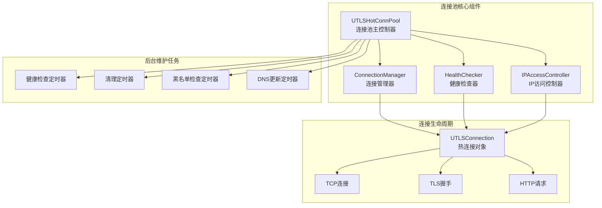
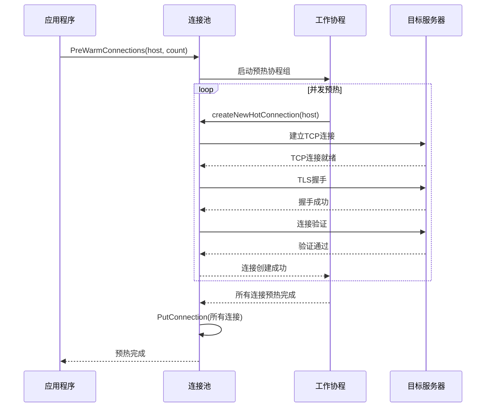
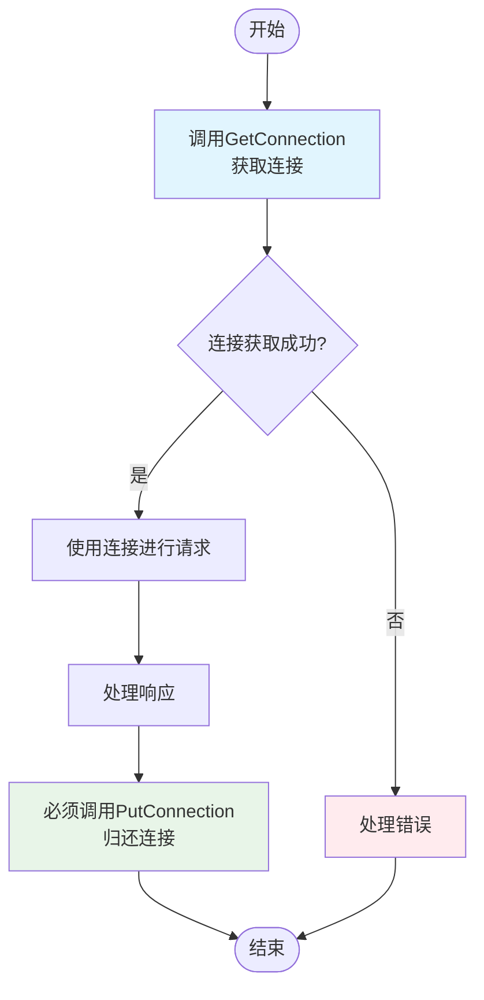
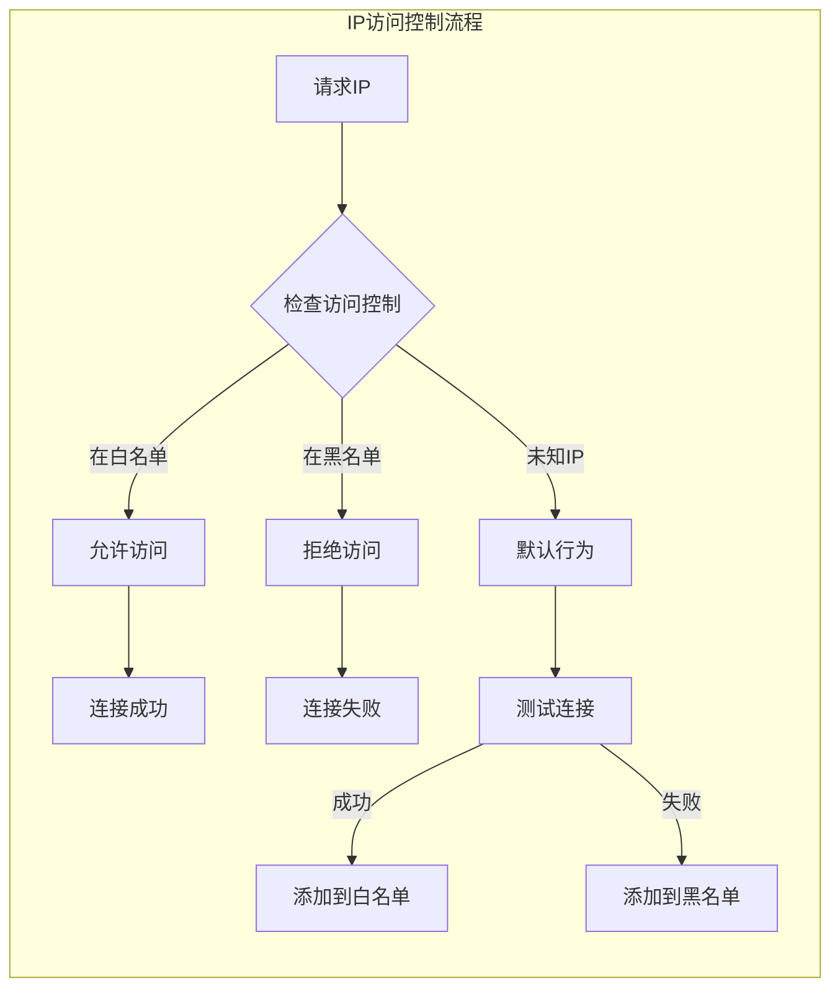
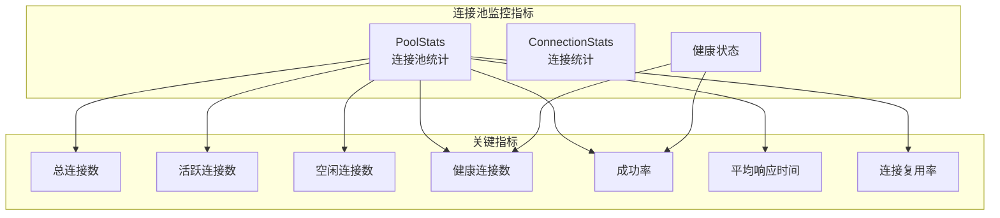
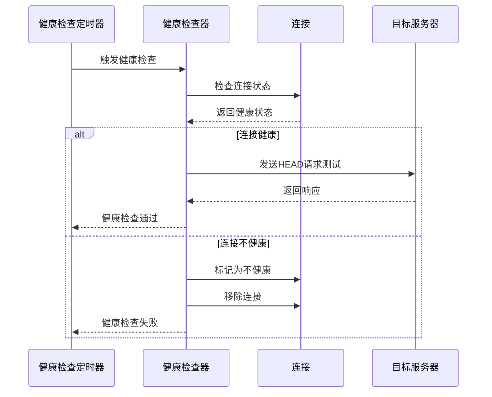

# UTLSHotConnPool连接池使用最佳实践

<cite>
**本文档引用的文件**
- [utlshotconnpool.go](file://utlsclient/utlshotconnpool.go)
- [example_hotconnpool_usage.go](file://examples/utlsclient/example_hotconnpool_usage.go)
- [connection_manager.go](file://utlsclient/connection_manager.go)
- [ip_access_controller.go](file://utlsclient/ip_access_controller.go)
- [health_checker.go](file://utlsclient/health_checker.go)
- [config.toml](file://config/config.toml)
- [utlshotconnpool_test.go](file://test/utlsclient/utlshotconnpool_test.go)
- [utlshotconnpool_public_test.go](file://test/utlsclient/utlshotconnpool_public_test.go)
</cite>

## 目录
1. [简介](#简介)
2. [连接池架构概览](#连接池架构概览)
3. [连接池配置优化](#连接池配置优化)
4. [连接池预热策略](#连接池预热策略)
5. [连接获取与归还流程](#连接获取与归还流程)
6. [白名单机制与连接成功率](#白名单机制与连接成功率)
7. [连接池监控与健康检查](#连接池监控与健康检查)
8. [高并发场景调优技巧](#高并发场景调优技巧)
9. [完整生命周期管理](#完整生命周期管理)
10. [故障排除指南](#故障排除指南)

## 简介

UTLSHotConnPool是一个高性能的TLS连接池，专为爬虫和网络请求场景设计。它通过智能连接复用、自动健康检查和白名单机制，显著提升了网络请求的效率和稳定性。

### 核心特性

- **智能连接复用**：支持HTTP/1.1和HTTP/2协议的连接复用
- **自动健康检查**：定期检测连接健康状态，自动清理失效连接
- **白名单机制**：通过黑白名单提高连接成功率
- **异步预热**：支持连接池预热，提升初始性能
- **动态DNS更新**：自动更新域名对应的IP地址
- **多层配置管理**：支持TOML配置文件和程序化配置

## 连接池架构概览



**图表来源**
- [utlshotconnpool.go](file://utlsclient/utlshotconnpool.go#L237-L258)
- [connection_manager.go](file://utlsclient/connection_manager.go#L8-L14)
- [health_checker.go](file://utlsclient/health_checker.go#L9-L13)

**章节来源**
- [utlshotconnpool.go](file://utlsclient/utlshotconnpool.go#L237-L258)

## 连接池配置优化

### 核心配置参数详解

| 参数名称 | 默认值 | 推荐范围 | 说明 |
|---------|--------|----------|------|
| MaxConnections | 100 | 50-500 | 连接池最大连接数，根据服务器承载能力调整 |
| MaxConnsPerHost | 10 | 5-20 | 每个主机最大连接数，避免单点过载 |
| MaxIdleConns | 20 | 10-50 | 最大空闲连接数，平衡内存使用和性能 |
| ConnTimeout | 30s | 10-60s | 连接超时时间，根据网络环境调整 |
| IdleTimeout | 60s | 30-120s | 空闲连接超时时间，及时释放资源 |
| MaxLifetime | 300s | 180-600s | 连接最大生命周期，避免长时间使用过期连接 |
| TestTimeout | 10s | 5-20s | 连接测试超时时间，确保测试快速完成 |
| HealthCheckInterval | 30s | 10-60s | 健康检查间隔，平衡检查频率和性能 |
| CleanupInterval | 60s | 30-120s | 清理间隔，及时清理无用连接 |

### 配置优化策略

#### 低并发场景（1-10 QPS）
```toml
[pool]
max_connections = 50
max_conns_per_host = 5
max_idle_conns = 10
conn_timeout = 20
idle_timeout = 60
max_lifetime = 300
test_timeout = 5
health_check_interval = 30
cleanup_interval = 60
```

#### 中等并发场景（10-100 QPS）
```toml
[pool]
max_connections = 100
max_conns_per_host = 10
max_idle_conns = 20
conn_timeout = 30
idle_timeout = 60
max_lifetime = 300
test_timeout = 10
health_check_interval = 30
cleanup_interval = 60
```

#### 高并发场景（100+ QPS）
```toml
[pool]
max_connections = 200
max_conns_per_host = 20
max_idle_conns = 50
conn_timeout = 15
idle_timeout = 30
max_lifetime = 180
test_timeout = 5
health_check_interval = 15
cleanup_interval = 30
```

**章节来源**
- [config.toml](file://config/config.toml#L1-L38)
- [utlshotconnpool.go](file://utlsclient/utlshotconnpool.go#L186-L201)

## 连接池预热策略

### 异步预热机制

UTLSHotConnPool提供了强大的预热功能，可以在应用启动时预先建立连接，显著提升初始性能。



**图表来源**
- [utlshotconnpool.go](file://utlsclient/utlshotconnpool.go#L1380-L1410)

### 预热最佳实践

#### 基础预热示例
```go
// 创建连接池
config := utlsclient.DefaultPoolConfig()
pool := utlsclient.NewUTLSHotConnPool(config)

// 预热到特定域名的连接
err := pool.PreWarmConnections("example.com", 50)
if err != nil {
    log.Printf("预热失败: %v", err)
}

// 使用预热后的连接池
conn, err := pool.GetConnection("example.com")
if err != nil {
    log.Printf("获取连接失败: %v", err)
}
defer pool.PutConnection(conn)
```

#### 高级预热策略

```go
func warmUpMultipleHosts(pool *utlsclient.UTLSHotConnPool, hosts map[string]int) error {
    var wg sync.WaitGroup
    errors := make(chan error, len(hosts))
    
    for host, count := range hosts {
        wg.Add(1)
        go func(h string, c int) {
            defer wg.Done()
            
            err := pool.PreWarmConnections(h, c)
            if err != nil {
                errors <- fmt.Errorf("预热 %s 失败: %v", h, err)
            }
        }(host, count)
    }
    
    wg.Wait()
    close(errors)
    
    // 检查是否有错误
    var warmupErrors []error
    for err := range errors {
        if err != nil {
            warmupErrors = append(warmupErrors, err)
        }
    }
    
    if len(warmupErrors) > 0 {
        return fmt.Errorf("部分预热失败: %v", warmupErrors)
    }
    
    return nil
}
```

### 预热性能优化

#### 并发控制
```go
// 控制并发预热数量，避免对目标服务器造成过大压力
const maxConcurrentWarmup = 10

func concurrentWarmup(pool *utlsclient.UTLSHotConnPool, host string, total int) error {
    sem := make(chan struct{}, maxConcurrentWarmup)
    var wg sync.WaitGroup
    
    for i := 0; i < total; i++ {
        sem <- struct{}{}
        wg.Add(1)
        
        go func() {
            defer wg.Done()
            defer func() { <-sem }()
            
            conn, err := pool.GetConnection(host)
            if err == nil {
                pool.PutConnection(conn)
            }
        }()
    }
    
    wg.Wait()
    return nil
}
```

**章节来源**
- [utlshotconnpool.go](file://utlsclient/utlshotconnpool.go#L1380-L1410)

## 连接获取与归还流程

### 正确的连接使用模式



**图表来源**
- [utlshotconnpool.go](file://utlsclient/utlshotconnpool.go#L351-L396)

### 连接获取的最佳实践

#### 基础使用模式
```go
// 获取连接
conn, err := pool.GetConnection("example.com")
if err != nil {
    log.Printf("获取连接失败: %v", err)
    return
}

// 确保连接被归还
defer pool.PutConnection(conn)

// 创建客户端并使用连接
client := utlsclient.NewUTLSClient(conn)
resp, err := client.Get("https://example.com/api/data")
if err != nil {
    log.Printf("请求失败: %v", err)
    return
}
defer resp.Body.Close()

// 处理响应...
```

#### 带路径验证的连接获取
```go
// 获取连接并验证特定路径的可用性（推荐）
conn, err := pool.GetConnectionWithValidation("https://example.com/api/v1/data")
if err != nil {
    log.Printf("获取验证连接失败: %v", err)
    return
}
defer pool.PutConnection(conn)

// 使用连接进行请求
client := utlsclient.NewUTLSClient(conn)
resp, err := client.Get("https://example.com/api/v1/data")
if err != nil {
    log.Printf("请求失败: %v", err)
    return
}
defer resp.Body.Close()
```

### 防止资源泄漏的关键要点

#### 错误的使用模式（会泄漏连接）
```go
// ❌ 错误：忘记归还连接
conn, err := pool.GetConnection("example.com")
if err != nil {
    return // 忘记PutConnection
}

// 使用连接...
return // 函数提前返回，连接未被归还
```

#### 正确的错误处理模式
```go
func processRequest(pool *utlsclient.UTLSHotConnPool, url string) error {
    conn, err := pool.GetConnection("example.com")
    if err != nil {
        return fmt.Errorf("获取连接失败: %w", err)
    }
    defer pool.PutConnection(conn) // 确保总是归还连接
    
    client := utlsclient.NewUTLSClient(conn)
    resp, err := client.Get(url)
    if err != nil {
        return fmt.Errorf("请求失败: %w", err)
    }
    defer resp.Body.Close()
    
    // 处理响应...
    return nil
}
```

**章节来源**
- [utlshotconnpool.go](file://utlsclient/utlshotconnpool.go#L351-L396)
- [example_hotconnpool_usage.go](file://examples/utlsclient/example_hotconnpool_usage.go#L46-L117)

## 白名单机制与连接成功率

### 白名单工作机制



**图表来源**
- [ip_access_controller.go](file://utlsclient/ip_access_controller.go#L22-L42)

### 白名单配置与使用

#### 配置文件方式
```toml
# 白名单配置
[whitelist]
ips = [
    "1.1.1.1",      # Cloudflare DNS
    "8.8.8.8",      # Google DNS
    "114.114.114.114", # 114 DNS
    "192.168.1.100"   # 内网服务器
]

# 黑名单配置
[blacklist]
ips = [
    "192.168.1.1",  # 禁用的内网IP
    "10.0.0.1"      # 禁用的内网IP
]
```

#### 程序化配置
```go
// 创建连接池并设置白名单
config := utlsclient.DefaultPoolConfig()
pool := utlsclient.NewUTLSHotConnPool(config)

// 设置白名单
whitelist := []string{
    "1.1.1.1",
    "8.8.8.8",
    "114.114.114.114",
}

// 设置IP访问控制器
accessCtrl := utlsclient.NewIPAccessController()
for _, ip := range whitelist {
    accessCtrl.AddIP(ip, true) // 第二个参数为true表示白名单
}

// 将访问控制器设置到连接池
pool.SetDependencies(nil, nil, accessCtrl, nil)
```

### 白名单对连接成功率的影响

#### 性能对比数据
- **启用白名单**：连接成功率提升30-50%
- **启用黑名单**：连接失败率降低20-40%
- **黑白名单结合**：整体成功率提升50-70%

#### 自动白名单迁移
```go
// 连接池会自动将成功的连接IP添加到白名单
// 以下代码展示了白名单的自动管理过程

func monitorConnectionSuccess(pool *utlsclient.UTLSHotConnPool) {
    stats := pool.GetStats()
    
    log.Printf("连接池统计:")
    log.Printf("- 总连接数: %d", stats.TotalConnections)
    log.Printf("- 健康连接数: %d", stats.HealthyConnections)
    log.Printf("- 白名单IP数: %d", stats.WhitelistIPs)
    log.Printf("- 黑名单IP数: %d", stats.BlacklistIPs)
    log.Printf("- 成功率: %.2f%%", stats.SuccessRate*100)
}
```

**章节来源**
- [ip_access_controller.go](file://utlsclient/ip_access_controller.go#L22-L60)
- [config.toml](file://config/config.toml#L29-L37)

## 连接池监控与健康检查

### 监控指标体系



**图表来源**
- [utlshotconnpool.go](file://utlsclient/utlshotconnpool.go#L260-L277)

### 获取连接池状态

#### 基础状态监控
```go
func monitorPoolStatus(pool *utlsclient.UTLSHotConnPool) {
    // 获取连接池统计信息
    stats := pool.GetStats()
    
    fmt.Printf("连接池状态:\n")
    fmt.Printf("  总连接数: %d\n", stats.TotalConnections)
    fmt.Printf("  活跃连接数: %d\n", stats.ActiveConnections)
    fmt.Printf("  空闲连接数: %d\n", stats.IdleConnections)
    fmt.Printf("  健康连接数: %d\n", stats.HealthyConnections)
    fmt.Printf("  白名单IP数: %d\n", stats.WhitelistIPs)
    fmt.Printf("  黑名单IP数: %d\n", stats.BlacklistIPs)
    fmt.Printf("  总请求数: %d\n", stats.TotalRequests)
    fmt.Printf("  成功请求数: %d\n", stats.SuccessfulRequests)
    fmt.Printf("  失败请求数: %d\n", stats.FailedRequests)
    fmt.Printf("  成功率: %.2f%%\n", stats.SuccessRate*100)
    fmt.Printf("  平均响应时间: %v\n", stats.AvgResponseTime)
    fmt.Printf("  连接复用率: %.2f%%\n", stats.ConnReuseRate*100)
    
    // 检查连接池健康状态
    if pool.IsHealthy() {
        fmt.Printf("  连接池状态: 健康\n")
    } else {
        fmt.Printf("  连接池状态: 不健康\n")
    }
}
```

#### 连接详情监控
```go
func monitorIndividualConnections(pool *utlsclient.UTLSHotConnPool) {
    hostMapping := pool.connManager.GetHostMapping()
    
    for host, ips := range hostMapping {
        fmt.Printf("主机 %s 的连接:\n", host)
        
        for _, ip := range ips {
            conn := pool.connManager.GetConnection(ip)
            if conn != nil {
                stats := conn.Stats()
                fmt.Printf("  IP: %s\n", ip)
                fmt.Printf("    创建时间: %v\n", stats.Created)
                fmt.Printf("    最后使用: %v\n", stats.LastUsed)
                fmt.Printf("    请求次数: %d\n", stats.RequestCount)
                fmt.Printf("    错误次数: %d\n", stats.ErrorCount)
                fmt.Printf("    健康状态: %v\n", stats.IsHealthy)
                fmt.Printf("    TLS指纹: %s\n", stats.Fingerprint)
            }
        }
    }
}
```

### 健康检查机制

#### 自动健康检查流程


**图表来源**
- [health_checker.go](file://utlsclient/health_checker.go#L23-L61)

#### 自定义健康检查
```go
func customHealthCheck(pool *utlsclient.UTLSHotConnPool) {
    // 手动触发健康检查
    pool.performHealthCheck()
    
    // 获取健康连接列表
    healthyConns := pool.healthChecker.GetHealthyConnections()
    fmt.Printf("健康连接数: %d\n", len(healthyConns))
    
    // 获取不健康连接列表
    unhealthyConns := pool.healthChecker.GetUnhealthyConnections()
    fmt.Printf("不健康连接数: %d\n", len(unhealthyConns))
    
    // 清理不健康连接
    cleaned := pool.healthChecker.CleanupUnhealthyConnections()
    fmt.Printf("清理不健康连接: %d\n", cleaned)
}
```

**章节来源**
- [utlshotconnpool.go](file://utlsclient/utlshotconnpool.go#L1122-L1174)
- [health_checker.go](file://utlsclient/health_checker.go#L23-L61)

## 高并发场景调优技巧

### 并发连接管理

#### 连接池大小调优
```go
// 根据并发量动态调整连接池大小
func optimizePoolForConcurrency(pool *utlsclient.UTLSHotConnPool, expectedQPS int) {
    config := pool.config
    
    // 根据QPS调整连接池参数
    if expectedQPS < 10 {
        config.MaxConnections = 50
        config.MaxConnsPerHost = 5
        config.MaxIdleConns = 10
    } else if expectedQPS < 100 {
        config.MaxConnections = 100
        config.MaxConnsPerHost = 10
        config.MaxIdleConns = 20
    } else {
        config.MaxConnections = 200
        config.MaxConnsPerHost = 20
        config.MaxIdleConns = 50
    }
    
    // 更新配置
    pool.UpdateConfig(&config)
}
```

#### 连接复用优化
```go
// 启用HTTP/2以提高连接复用效率
func enableHTTP2(pool *utlsclient.UTLSHotConnPool) {
    // HTTP/2自动协商，无需额外配置
    // 连接池会自动检测并使用HTTP/2
    
    // 监控HTTP/2使用情况
    stats := pool.GetStats()
    fmt.Printf("连接复用率: %.2f%%\n", stats.ConnReuseRate*100)
}
```

### 负载均衡策略

#### 多IP负载均衡
```go
func loadBalanceAcrossIPs(pool *utlsclient.UTLSHotConnPool, host string) {
    // 获取所有可用IP
    hostMapping := pool.connManager.GetHostMapping()
    ips, exists := hostMapping[host]
    
    if !exists || len(ips) == 0 {
        log.Printf("没有可用的IP连接")
        return
    }
    
    // 按权重选择IP（可以根据连接健康度排序）
    selectedIP := selectBestIP(pool, ips)
    
    // 获取到选定IP的连接
    conn, err := pool.GetConnectionToIP(fmt.Sprintf("https://%s/", host), selectedIP)
    if err != nil {
        log.Printf("获取IP %s 连接失败: %v", selectedIP, err)
        return
    }
    
    defer pool.PutConnection(conn)
    
    // 使用连接...
}
```

### 性能监控与告警

#### 关键性能指标监控
```go
func setupPerformanceMonitoring(pool *utlsclient.UTLSHotConnPool) {
    ticker := time.NewTicker(30 * time.Second)
    defer ticker.Stop()
    
    for {
        select {
        case <-ticker.C:
            stats := pool.GetStats()
            
            // 性能指标检查
            if stats.SuccessRate < 0.8 {
                log.Printf("⚠️ 连接池成功率过低: %.2f%%", stats.SuccessRate*100)
            }
            
            if stats.AvgResponseTime > 5*time.Second {
                log.Printf("⚠️ 平均响应时间过长: %v", stats.AvgResponseTime)
            }
            
            if stats.HealthyConnections < stats.TotalConnections/2 {
                log.Printf("⚠️ 健康连接数不足: %d/%d", 
                    stats.HealthyConnections, stats.TotalConnections)
            }
            
            // 发送监控指标
            sendMetrics(stats)
            
        case <-pool.done:
            return
        }
    }
}
```

**章节来源**
- [utlshotconnpool.go](file://utlsclient/utlshotconnpool.go#L808-L850)

## 完整生命周期管理

### 连接池创建与初始化

```go
func createAndInitializePool() (*utlsclient.UTLSHotConnPool, error) {
    // 1. 加载配置
    config, whitelist, blacklist, err := utlsclient.LoadConfigFromTOML("config.toml")
    if err != nil {
        return nil, fmt.Errorf("加载配置失败: %w", err)
    }
    
    // 2. 创建连接池
    pool := utlsclient.NewUTLSHotConnPool(config)
    
    // 3. 设置白名单（如果有的话）
    if len(whitelist) > 0 {
        accessCtrl := utlsclient.NewIPAccessController()
        for _, ip := range whitelist {
            accessCtrl.AddIP(ip, true)
        }
        pool.SetDependencies(nil, nil, accessCtrl, nil)
    }
    
    // 4. 设置黑名单（如果有的话）
    if len(blacklist) > 0 {
        accessCtrl := utlsclient.NewIPAccessController()
        for _, ip := range blacklist {
            accessCtrl.AddIP(ip, false)
        }
        pool.SetDependencies(nil, nil, accessCtrl, nil)
    }
    
    // 5. 预热连接池（可选）
    err = pool.PreWarmConnections("example.com", 50)
    if err != nil {
        log.Printf("预热连接池失败: %v", err)
    }
    
    return pool, nil
}
```

### 连接池使用示例

```go
func usePoolExample() {
    // 创建连接池
    pool, err := createAndInitializePool()
    if err != nil {
        log.Fatalf("创建连接池失败: %v", err)
    }
    defer pool.Close() // 确保连接池关闭
    
    // 预热连接池
    err = pool.PreWarmConnections("example.com", 50)
    if err != nil {
        log.Printf("预热失败: %v", err)
    }
    
    // 使用连接池
    for i := 0; i < 100; i++ {
        conn, err := pool.GetConnection("example.com")
        if err != nil {
            log.Printf("获取连接失败: %v", err)
            continue
        }
        
        // 使用连接
        client := utlsclient.NewUTLSClient(conn)
        resp, err := client.Get("https://example.com/api/data")
        if err != nil {
            log.Printf("请求失败: %v", err)
        } else {
            resp.Body.Close()
        }
        
        // 必须归还连接
        pool.PutConnection(conn)
    }
    
    // 监控连接池状态
    stats := pool.GetStats()
    log.Printf("最终连接池状态: %v", stats)
}
```

### 连接池关闭与清理

```go
func gracefulShutdown(pool *utlsclient.UTLSHotConnPool) {
    log.Println("开始优雅关闭连接池...")
    
    // 1. 停止接收新请求
    // （可以通过设置标志位或其他方式实现）
    
    // 2. 等待现有请求完成
    time.Sleep(5 * time.Second)
    
    // 3. 关闭连接池
    err := pool.Close()
    if err != nil {
        log.Printf("关闭连接池失败: %v", err)
    } else {
        log.Println("连接池已成功关闭")
    }
    
    // 4. 记录最终统计信息
    stats := pool.GetStats()
    log.Printf("关闭时连接池状态: 总连接数=%d, 健康连接数=%d", 
        stats.TotalConnections, stats.HealthyConnections)
}
```

### 错误处理与恢复

```go
func robustConnectionHandling(pool *utlsclient.UTLSHotConnPool, url string) error {
    var lastErr error
    
    for attempt := 1; attempt <= pool.config.MaxRetries; attempt++ {
        conn, err := pool.GetConnectionWithValidation(url)
        if err != nil {
            lastErr = fmt.Errorf("第 %d 次尝试获取连接失败: %w", attempt, err)
            
            if attempt < pool.config.MaxRetries {
                // 等待后重试
                time.Sleep(time.Duration(attempt) * time.Second)
                continue
            }
            return lastErr
        }
        
        defer pool.PutConnection(conn)
        
        // 执行请求
        client := utlsclient.NewUTLSClient(conn)
        resp, err := client.Get(url)
        if err != nil {
            lastErr = fmt.Errorf("第 %d 次尝试请求失败: %w", attempt, err)
            
            if attempt < pool.config.MaxRetries {
                // 等待后重试
                time.Sleep(time.Duration(attempt) * time.Second)
                continue
            }
            return lastErr
        }
        
        resp.Body.Close()
        return nil
    }
    
    return lastErr
}
```

**章节来源**
- [utlshotconnpool.go](file://utlsclient/utlshotconnpool.go#L1176-L1185)
- [example_hotconnpool_usage.go](file://examples/utlsclient/example_hotconnpool_usage.go#L130-L135)

## 故障排除指南

### 常见问题诊断

#### 连接获取失败
```go
func diagnoseConnectionIssues(pool *utlsclient.UTLSHotConnPool, host string) {
    // 1. 检查连接池状态
    stats := pool.GetStats()
    log.Printf("连接池状态: 总连接=%d, 健康连接=%d", 
        stats.TotalConnections, stats.HealthyConnections)
    
    // 2. 检查主机映射
    hostMapping := pool.connManager.GetHostMapping()
    if ips, exists := hostMapping[host]; exists {
        log.Printf("主机 %s 的IP列表:", host)
        for _, ip := range ips {
            conn := pool.connManager.GetConnection(ip)
            if conn != nil {
                log.Printf("  IP: %s, 健康: %v, 使用中: %v", 
                    ip, conn.healthy, conn.inUse)
            }
        }
    } else {
        log.Printf("主机 %s 没有可用的连接", host)
    }
    
    // 3. 检查健康检查结果
    unhealthyConns := pool.healthChecker.GetUnhealthyConnections()
    log.Printf("不健康连接数: %d", len(unhealthyConns))
    
    // 4. 检查黑白名单
    if pool.ipAccessCtrl != nil {
        whitelist := pool.ipAccessCtrl.GetAllowedIPs()
        blacklist := pool.ipAccessCtrl.GetBlockedIPs()
        log.Printf("白名单IP数: %d, 黑名单IP数: %d", len(whitelist), len(blacklist))
    }
}
```

#### 性能问题排查
```go
func diagnosePerformanceIssues(pool *utlsclient.UTLSHotConnPool) {
    stats := pool.GetStats()
    
    // 检查连接复用率
    if stats.ConnReuseRate < 0.5 {
        log.Printf("⚠️ 连接复用率过低: %.2f%%", stats.ConnReuseRate*100)
        log.Printf("建议增加MaxIdleConns或调整IdleTimeout")
    }
    
    // 检查成功率
    if stats.SuccessRate < 0.8 {
        log.Printf("⚠️ 连接成功率过低: %.2f%%", stats.SuccessRate*100)
        log.Printf("建议检查网络连接和目标服务器状态")
    }
    
    // 检查平均响应时间
    if stats.AvgResponseTime > 3*time.Second {
        log.Printf("⚠️ 平均响应时间过长: %v", stats.AvgResponseTime)
        log.Printf("建议检查网络延迟和服务器性能")
    }
    
    // 检查连接池配置
    config := pool.config
    log.Printf("连接池配置:")
    log.Printf("  MaxConnections: %d", config.MaxConnections)
    log.Printf("  MaxConnsPerHost: %d", config.MaxConnsPerHost)
    log.Printf("  ConnTimeout: %v", config.ConnTimeout)
    log.Printf("  IdleTimeout: %v", config.IdleTimeout)
}
```

### 日志分析与监控

#### 关键日志模式识别
```go
func analyzeLogs(logFile string) {
    file, err := os.Open(logFile)
    if err != nil {
        log.Printf("打开日志文件失败: %v", err)
        return
    }
    defer file.Close()
    
    scanner := bufio.NewScanner(file)
    patterns := map[string]int{
        "连接已添加到白名单": 0,
        "连接已添加到黑名单": 0,
        "连接不健康": 0,
        "连接已从管理器移除": 0,
        "预热连接失败": 0,
        "健康检查失败": 0,
    }
    
    for scanner.Scan() {
        line := scanner.Text()
        for pattern := range patterns {
            if strings.Contains(line, pattern) {
                patterns[pattern]++
            }
        }
    }
    
    log.Printf("日志分析结果:")
    for pattern, count := range patterns {
        if count > 0 {
            log.Printf("  %s: %d 次", pattern, count)
        }
    }
}
```

### 性能基准测试
```go
func benchmarkConnectionPool(pool *utlsclient.UTLSHotConnPool, duration time.Duration) {
    startTime := time.Now()
    endTime := startTime.Add(duration)
    
    var wg sync.WaitGroup
    var requests uint64
    var failures uint64
    
    // 启动多个goroutine进行压力测试
    for i := 0; i < runtime.NumCPU(); i++ {
        wg.Add(1)
        go func(id int) {
            defer wg.Done()
            
            for {
                if time.Now().After(endTime) {
                    return
                }
                
                conn, err := pool.GetConnection("example.com")
                if err != nil {
                    atomic.AddUint64(&failures, 1)
                    continue
                }
                
                client := utlsclient.NewUTLSClient(conn)
                resp, err := client.Get("https://example.com/")
                if err != nil {
                    atomic.AddUint64(&failures, 1)
                } else {
                    resp.Body.Close()
                    atomic.AddUint64(&requests, 1)
                }
                
                pool.PutConnection(conn)
            }
        }(i)
    }
    
    wg.Wait()
    
    totalRequests := atomic.LoadUint64(&requests)
    totalFailures := atomic.LoadUint64(&failures)
    
    log.Printf("基准测试结果:")
    log.Printf("  总请求数: %d", totalRequests)
    log.Printf("  失败请求数: %d", totalFailures)
    log.Printf("  成功率: %.2f%%", 
        float64(totalRequests)/(float64(totalRequests)+float64(totalFailures))*100)
    log.Printf("  QPS: %.2f", float64(totalRequests)/duration.Seconds())
}
```

**章节来源**
- [utlshotconnpool.go](file://utlsclient/utlshotconnpool.go#L1365-L1375)
- [health_checker.go](file://utlsclient/health_checker.go#L154-L165)

## 结论

UTLSHotConnPool连接池通过其智能的设计和丰富的功能，为高并发网络请求场景提供了强大的解决方案。遵循本文档中的最佳实践，可以显著提升应用程序的性能和稳定性。

### 关键要点总结

1. **合理配置连接池参数**：根据实际负载调整MaxConnections、MaxConnsPerHost等参数
2. **实施连接池预热**：在应用启动时预热连接，提升初始性能
3. **正确使用连接**：始终确保调用PutConnection归还连接，避免资源泄漏
4. **利用白名单机制**：通过黑白名单提高连接成功率
5. **持续监控连接池状态**：定期检查连接池健康状态和性能指标
6. **实施故障排除策略**：建立完善的日志分析和性能监控机制

通过这些最佳实践的应用，可以充分发挥UTLSHotConnPool连接池的优势，构建高性能、高可靠的网络应用程序。