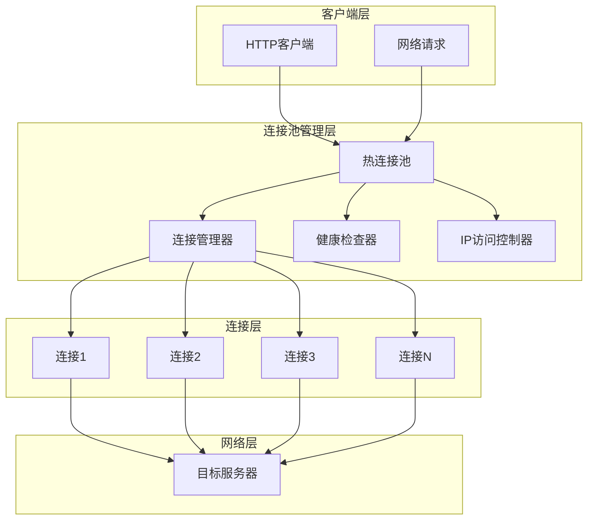
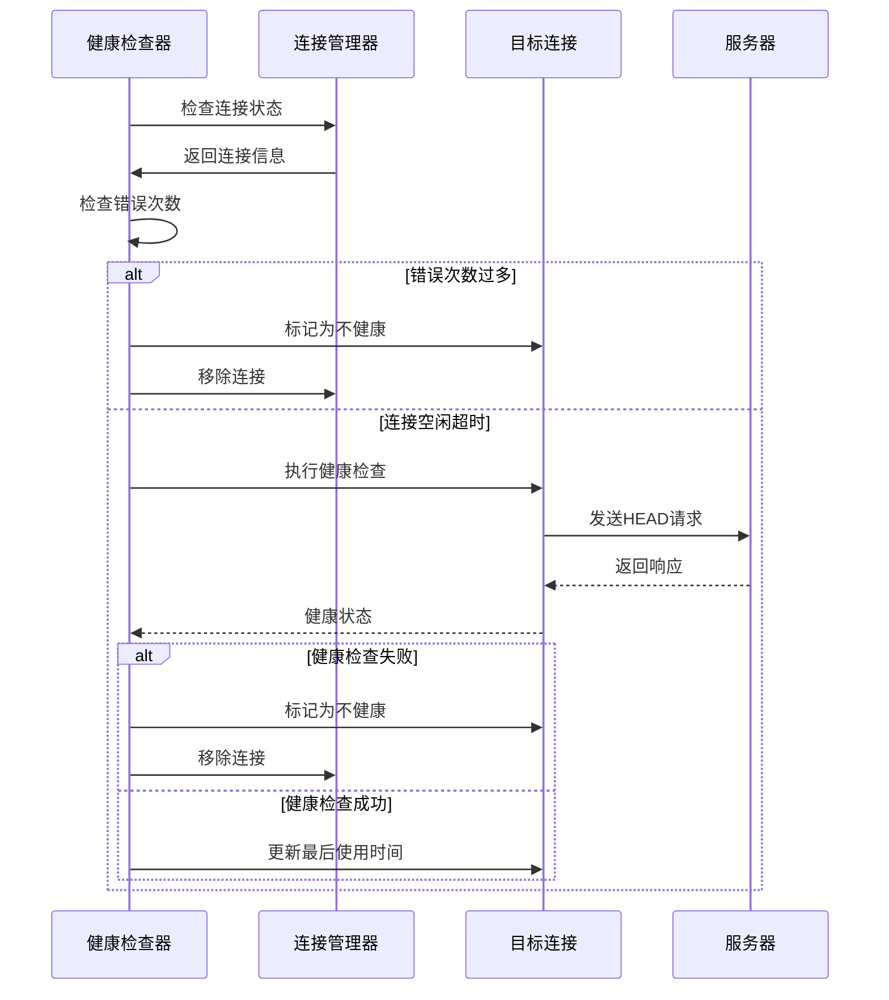
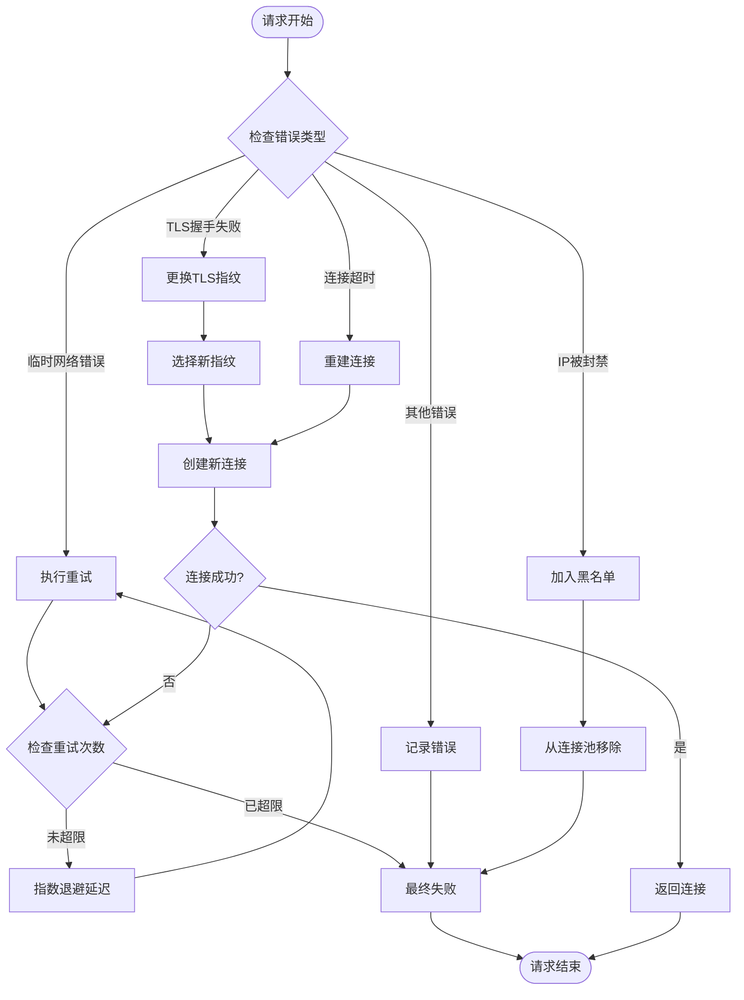
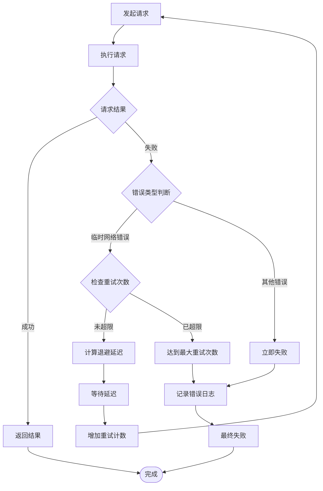
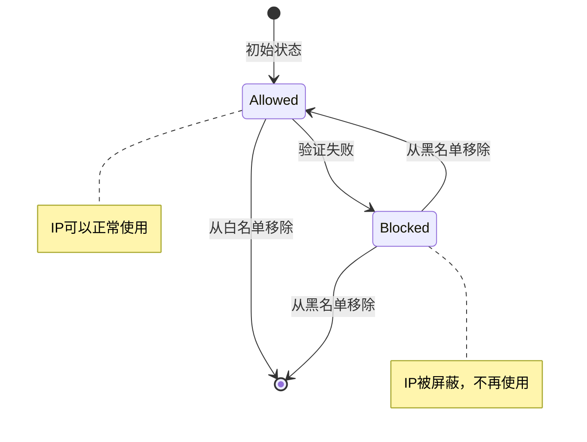
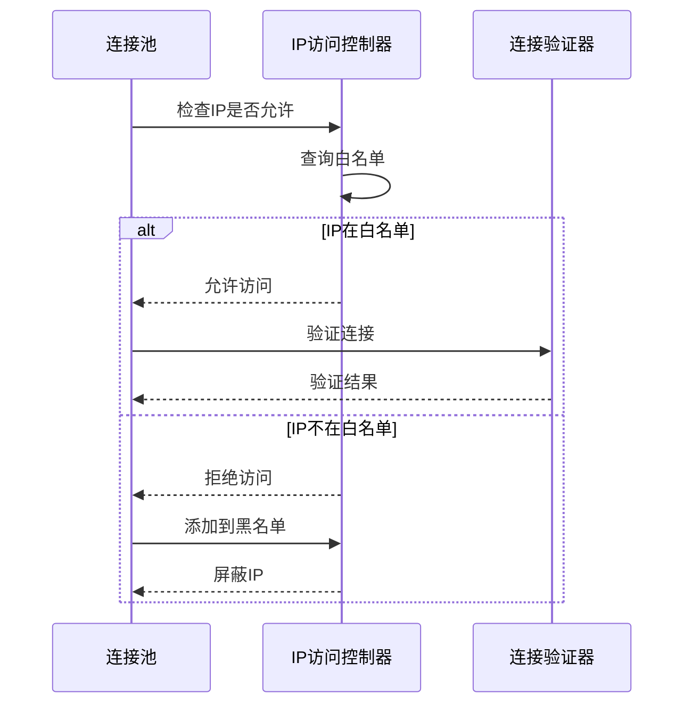
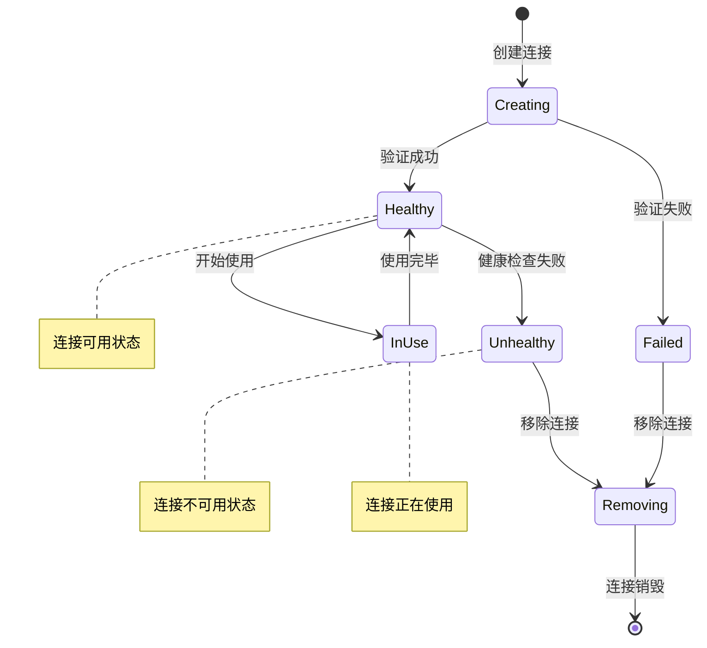

# 错误处理与重试机制

<cite>
**本文档引用的文件**
- [connection_manager.go](file://utlsclient/connection_manager.go)
- [health_checker.go](file://utlsclient/health_checker.go)
- [ip_access_controller.go](file://utlsclient/ip_access_controller.go)
- [utlshotconnpool.go](file://utlsclient/utlshotconnpool.go)
- [connection_validator.go](file://utlsclient/connection_validator.go)
- [constants.go](file://utlsclient/constants.go)
- [interfaces.go](file://utlsclient/interfaces.go)
- [connection_helpers.go](file://utlsclient/connection_helpers.go)
- [utlsclient.go](file://utlsclient/utlsclient.go)
</cite>

## 目录
1. [概述](#概述)
2. [系统架构](#系统架构)
3. [连接健康检查机制](#连接健康检查机制)
4. [错误分类与处理策略](#错误分类与处理策略)
5. [重试策略与算法](#重试策略与算法)
6. [IP访问控制器](#ip访问控制器)
7. [连接池自我修复能力](#连接池自我修复能力)
8. [错误处理代码示例](#错误处理代码示例)
9. [最佳实践建议](#最佳实践建议)
10. [故障排除指南](#故障排除指南)

## 概述

爬虫平台的错误处理与重试机制是一个多层次、智能化的容错系统，旨在确保网络请求的高可用性和稳定性。该系统通过健康检查、智能重试、IP黑白名单管理和连接池自我修复等机制，实现了对各种网络错误的自动处理和恢复。

### 核心特性

- **多层健康检查**：包括连接级别、连接池级别和IP级别健康检查
- **智能重试策略**：基于错误类型的差异化重试机制
- **动态IP管理**：自动屏蔽不可用IP，优化连接质量
- **连接池自我修复**：自动重建失败连接，维持服务连续性
- **指数退避算法**：渐进式重试延迟，避免系统过载

## 系统架构



**图表来源**
- [utlshotconnpool.go](file://utlsclient/utlshotconnpool.go#L236-L258)
- [connection_manager.go](file://utlsclient/connection_manager.go#L9-L14)

**章节来源**
- [utlshotconnpool.go](file://utlsclient/utlshotconnpool.go#L236-L258)
- [connection_manager.go](file://utlsclient/connection_manager.go#L9-L14)
- [health_checker.go](file://utlsclient/health_checker.go#L10-L13)

## 连接健康检查机制

### 健康检查工作流程

健康检查是整个错误处理系统的核心组件，负责监控连接的可用性和稳定性。



**图表来源**
- [health_checker.go](file://utlsclient/health_checker.go#L24-L61)
- [connection_manager.go](file://utlsclient/connection_manager.go#L42-L73)

### 健康检查策略

#### 1. 错误计数监控
系统维护每个连接的错误计数，当错误次数超过阈值（默认10次）时，自动将连接标记为不健康。

#### 2. 时间间隔检查
根据配置的健康检查间隔（默认30秒），定期对空闲连接执行健康检查。

#### 3. 探测请求验证
使用HTTP HEAD请求进行轻量级健康检查，验证连接的基本可用性。

**章节来源**
- [health_checker.go](file://utlsclient/health_checker.go#L24-L61)
- [connection_manager.go](file://utlsclient/connection_manager.go#L142-L218)

## 错误分类与处理策略

### 错误类型分类

系统将网络错误分为以下几类，每类采用不同的处理策略：

| 错误类型 | 错误关键词 | 处理策略 | 示例场景 |
|---------|-----------|---------|---------|
| **临时网络错误** | connection, broken pipe, reset | 自动重试 | 网络抖动、服务器负载过高 |
| **TLS握手失败** | handshake timeout, protocol error | 更换指纹/IP | 证书验证失败、协议不匹配 |
| **IP被封禁** | 403 Forbidden | 加入黑名单 | 访问频率过高、触发防护机制 |
| **连接超时** | timeout, deadline exceeded | 重建连接 | 网络延迟过高、服务器无响应 |
| **认证失败** | 401 Unauthorized | 重新认证 | 凭据过期、权限不足 |

### 错误处理流程



**图表来源**
- [constants.go](file://utlsclient/constants.go#L48-L84)
- [utlshotconnpool.go](file://utlsclient/utlshotconnpool.go#L534-L553)

**章节来源**
- [constants.go](file://utlsclient/constants.go#L48-L84)
- [utlshotconnpool.go](file://utlsclient/utlshotconnpool.go#L534-L553)

## 重试策略与算法

### 指数退避算法实现

系统采用指数退避算法来实现智能重试，避免因频繁重试导致系统过载。

#### 算法公式
```
delay = base_delay * (2^retry_count)
```

其中：
- `base_delay`：基础延迟时间（默认1秒）
- `retry_count`：当前重试次数
- `max_delay`：最大延迟时间（通常为30秒）

#### 重试配置参数

| 参数名称 | 默认值 | 说明 |
|---------|-------|------|
| `MaxRetries` | 3 | 最大重试次数 |
| `DefaultRetryDelay` | 1s | 基础重试延迟 |
| `MinSuccessRate` | 0.5 | 最小成功率阈值 |
| `TestTimeout` | 10s | 测试请求超时时间 |

### 重试决策逻辑



**图表来源**
- [constants.go](file://utlsclient/constants.go#L40-L45)
- [utlshotconnpool.go](file://utlsclient/utlshotconnpool.go#L181-L184)

**章节来源**
- [constants.go](file://utlsclient/constants.go#L40-L45)
- [utlshotconnpool.go](file://utlsclient/utlshotconnpool.go#L181-L184)

## IP访问控制器

### 黑白名单机制

IP访问控制器提供了强大的IP级别的访问控制功能，支持自动屏蔽不可用IP。

#### 核心功能

1. **白名单优先**：只有白名单中的IP才能被使用
2. **黑名单屏蔽**：自动将不可用IP加入黑名单
3. **动态更新**：运行时动态添加/移除IP
4. **统计监控**：提供黑白名单状态统计

#### IP状态流转图



**图表来源**
- [ip_access_controller.go](file://utlsclient/ip_access_controller.go#L23-L42)
- [ip_access_controller.go](file://utlsclient/ip_access_controller.go#L45-L60)

### IP验证流程



**图表来源**
- [ip_access_controller.go](file://utlsclient/ip_access_controller.go#L23-L42)
- [connection_helpers.go](file://utlsclient/connection_helpers.go#L45-L62)

**章节来源**
- [ip_access_controller.go](file://utlsclient/ip_access_controller.go#L8-L184)
- [connection_helpers.go](file://utlsclient/connection_helpers.go#L45-L62)

## 连接池自我修复能力

### 连接生命周期管理

连接池具备完整的连接生命周期管理能力，包括创建、使用、监控和销毁。

#### 连接状态管理



**图表来源**
- [connection_manager.go](file://utlsclient/connection_manager.go#L26-L73)
- [utlshotconnpool.go](file://utlsclient/utlshotconnpool.go#L746-L758)

### 自动重建机制

当连接出现故障时，系统会自动尝试重建连接：

1. **故障检测**：通过健康检查发现连接故障
2. **IP筛选**：排除黑名单中的IP
3. **指纹切换**：尝试不同的TLS指纹
4. **连接重建**：重新建立新的连接
5. **状态更新**：更新连接池状态

### 清理机制

连接池提供多种清理机制以维持性能：

#### 1. 空闲连接清理
定期清理长时间未使用的连接，释放系统资源。

#### 2. 过期连接清理
移除超过最大生命周期的连接。

#### 3. 不健康连接清理
自动移除健康状态不佳的连接。

**章节来源**
- [connection_manager.go](file://utlsclient/connection_manager.go#L142-L218)
- [health_checker.go](file://utlsclient/health_checker.go#L155-L165)

## 错误处理代码示例

### 基础错误处理示例

以下展示了完整的错误处理流程实现：

```go
// 连接获取与错误处理
func GetConnectionWithRetry(pool *UTLSHotConnPool, targetHost string) (*UTLSConnection, error) {
    var lastErr error
    for retry := 0; retry <= pool.config.MaxRetries; retry++ {
        // 计算退避延迟
        delay := calculateBackoffDelay(retry)
        
        // 获取连接
        conn, err := pool.GetConnection(targetHost)
        if err == nil {
            return conn, nil
        }
        
        lastErr = err
        
        // 分析错误类型
        if isTemporaryNetworkError(err) {
            // 临时网络错误，等待后重试
            time.Sleep(delay)
            continue
        } else if isTLSHandshakeError(err) {
            // TLS握手错误，可能需要更换指纹
            pool.switchFingerprint()
            continue
        } else if isIPBlockedError(err) {
            // IP被封禁，加入黑名单
            pool.blockIP(conn.TargetIP())
            continue
        }
        
        // 其他错误，直接返回
        break
    }
    
    return nil, fmt.Errorf("%w: %v", ErrMaxRetriesExceeded, lastErr)
}
```

### 健康检查实现示例

```go
// 健康检查器实现
type HealthChecker struct {
    connManager *ConnectionManager
    config      *PoolConfig
}

func (hc *HealthChecker) PerformHealthCheck(conn *UTLSConnection) error {
    // 检查错误次数
    if conn.ErrorCount() > MaxErrorCount {
        conn.MarkUnhealthy()
        return fmt.Errorf("错误次数过多: %d", conn.ErrorCount())
    }
    
    // 执行探测请求
    err := hc.sendProbeRequest(conn)
    if err != nil {
        conn.MarkUnhealthy()
        return fmt.Errorf("健康检查失败: %v", err)
    }
    
    // 更新最后检查时间
    conn.UpdateLastChecked()
    return nil
}
```

### IP访问控制示例

```go
// IP访问控制器实现
type IPAccessController struct {
    whitelist map[string]bool
    blacklist map[string]bool
    mu        sync.RWMutex
}

func (ac *IPAccessController) ValidateIPAccess(ip string) bool {
    ac.mu.RLock()
    defer ac.mu.RUnlock()
    
    // 检查黑名单
    if ac.blacklist[ip] {
        return false
    }
    
    // 检查白名单
    if len(ac.whitelist) > 0 {
        return ac.whitelist[ip]
    }
    
    // 默认允许
    return true
}
```

**章节来源**
- [utlshotconnpool.go](file://utlsclient/utlshotconnpool.go#L534-L553)
- [health_checker.go](file://utlsclient/health_checker.go#L24-L61)
- [ip_access_controller.go](file://utlsclient/ip_access_controller.go#L23-L42)

## 最佳实践建议

### 配置优化建议

1. **合理的重试次数**
   - 生产环境：`MaxRetries = 3-5`
   - 高可靠性场景：`MaxRetries = 5-10`

2. **适当的超时设置**
   - 连接超时：`ConnTimeout = 10-30s`
   - 健康检查间隔：`HealthCheckInterval = 30-60s`

3. **监控指标设置**
   - 最小成功率：`MinSuccessRate = 0.8-0.9`
   - 错误计数阈值：`MaxErrorCount = 5-10`

### 错误处理最佳实践

1. **分层错误处理**
   - 应用层：业务逻辑错误处理
   - 连接层：网络连接错误处理
   - 网络层：底层网络错误处理

2. **优雅降级**
   - 主连接池故障时，启用备用连接池
   - 降低请求频率以缓解服务器压力
   - 使用缓存减少网络请求

3. **监控与告警**
   - 监控连接池健康状态
   - 设置错误率告警阈值
   - 记录详细的错误日志

### 性能优化建议

1. **连接复用**
   - 启用HTTP/2连接复用
   - 合理设置连接池大小
   - 定期清理空闲连接

2. **智能重试**
   - 根据错误类型调整重试策略
   - 实施指数退避算法
   - 避免同时大量重试

3. **资源管理**
   - 限制并发连接数
   - 设置合理的超时时间
   - 监控内存和CPU使用

## 故障排除指南

### 常见问题诊断

#### 1. 连接池无可用连接

**症状**：请求总是返回连接池耗尽错误

**诊断步骤**：
- 检查连接池配置：`MaxConnections` 和 `MaxConnsPerHost`
- 查看连接使用情况：检查活跃连接数
- 检查连接泄漏：确认连接正确归还

**解决方案**：
```go
// 增加连接池大小
config.MaxConnections = 200
config.MaxConnsPerHost = 20

// 启用连接清理
pool.EnableConnectionCleanup()
```

#### 2. 频繁的TLS握手失败

**症状**：大量TLS握手错误日志

**诊断步骤**：
- 检查TLS指纹配置
- 验证服务器证书有效性
- 检查网络防火墙设置

**解决方案**：
```go
// 切换TLS指纹
pool.SelectRandomFingerprint()

// 更新指纹库
pool.UpdateFingerprintLibrary()
```

#### 3. IP被意外封禁

**症状**：某些IP持续返回403错误

**诊断步骤**：
- 检查IP黑名单状态
- 分析请求模式
- 检查请求频率

**解决方案**：
```go
// 清空黑名单
pool.ClearBlacklist()

// 重新验证IP
pool.RevalidateIPs()
```

### 监控指标

#### 关键性能指标

| 指标名称 | 计算方式 | 正常范围 | 告警阈值 |
|---------|---------|---------|---------|
| 连接成功率 | 成功连接数/总连接数 | 95%以上 | < 90% |
| 平均响应时间 | 总响应时间/请求数 | < 500ms | > 1000ms |
| 连接池利用率 | 使用连接数/总连接数 | 70%-90% | > 95% |
| 错误率 | 错误数/总请求数 | < 5% | > 10% |

#### 健康检查指标

```go
// 获取连接池统计信息
stats := pool.GetStats()
fmt.Printf("总连接数: %d\n", stats.TotalConnections)
fmt.Printf("健康连接数: %d\n", stats.HealthyConnections)
fmt.Printf("成功率: %.2f%%\n", stats.SuccessRate*100)
fmt.Printf("平均响应时间: %v\n", stats.AvgResponseTime)
```

### 调试技巧

1. **启用详细日志**
   ```go
   // 设置调试级别
   logger.SetLevel(logger.DEBUG)
   ```

2. **连接状态检查**
   ```go
   // 检查特定IP的连接状态
   connInfo := pool.GetConnectionInfo(targetIP)
   fmt.Printf("连接状态: %+v\n", connInfo)
   ```

3. **健康检查验证**
   ```go
   // 手动执行健康检查
   pool.healthChecker.CheckAllConnections()
   ```

通过遵循这些最佳实践和故障排除指南，可以显著提高爬虫平台的稳定性和可靠性，确保在网络环境不稳定的情况下仍能保持高效的数据采集能力。