# 架构文档

<cite>
**本文档中引用的文件**
- [README.md](file://README.md)
- [go.mod](file://go.mod)
- [cmd/web-server/main.go](file://cmd/web-server/main.go)
- [cmd/utlsclient/main.go](file://cmd/utlsclient/main.go)
- [config/config.go](file://config/config.go)
- [utlsclient/utlshotconnpool.go](file://utlsclient/utlshotconnpool.go)
- [utlsclient/utlsclient.go](file://utlsclient/utlsclient.go)
- [utlsclient/utlsfingerprint.go](file://utlsclient/utlsfingerprint.go)
- [utlsclient/connection_manager.go](file://utlsclient/connection_manager.go)
- [utlsclient/health_checker.go](file://utlsclient/health_checker.go)
- [utlsclient/ip_access_controller.go](file://utlsclient/ip_access_controller.go)
- [logger/logger.go](file://logger/logger.go)
- [GoogleEarth/quadtree_path.go](file://GoogleEarth/quadtree_path.go)
</cite>

## 目录
1. [简介](#简介)
2. [项目结构](#项目结构)
3. [核心组件](#核心组件)
4. [架构概述](#架构概述)
5. [详细组件分析](#详细组件分析)
6. [依赖分析](#依赖分析)
7. [性能考虑](#性能考虑)
8. [故障排除指南](#故障排除指南)
9. [结论](#结论)

## 简介

本项目是一个基于uTLS的高性能爬虫平台，旨在通过TLS指纹伪装、热连接池和IP池管理技术，实现对Google Earth等服务的高效数据采集。平台支持33种真实浏览器指纹、90种语言组合的Accept-Language随机化，并完整支持HTTP/1.1和HTTP/2协议，以及IPv4和IPv6双栈网络。

平台的核心优势在于其热连接池技术，通过预建立和复用TLS连接，相比每次新建连接可实现3-6倍的性能提升。在大规模测试中，平台成功在21.5秒内预热1611个连接，成功率高达98.8%，并在热连接阶段实现100%的连接复用率。

**本文档引用的文件**
- [README.md](file://README.md)
- [go.mod](file://go.mod)

## 项目结构

项目采用模块化设计，各目录职责明确：

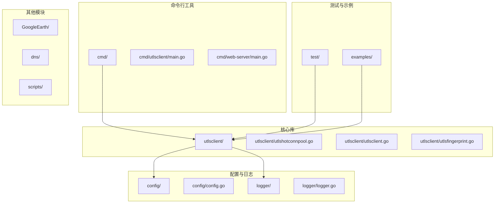

**图表来源**
- [README.md](file://README.md)
- [go.mod](file://go.mod)

**本节来源**
- [README.md](file://README.md)

## 核心组件

平台的核心功能由以下几个关键组件构成：

1. **热连接池 (UTLSHotConnPool)**：通过预建立和复用TLS连接，大幅提升性能
2. **TLS指纹伪装 (utlsfingerprint)**：支持33种真实浏览器指纹配置，模拟Chrome、Firefox、Safari、Edge等浏览器
3. **Accept-Language随机化**：从90种语言中随机组合2-5种语言，生成独特的Accept-Language头
4. **HTTP/2支持**：自动检测协商的协议，支持h2连接复用
5. **IPv6支持**：完整支持IPv6地址连接，使用方括号包裹IPv6地址

这些组件协同工作，使得平台能够高效、隐蔽地进行网络爬取。

**本节来源**
- [README.md](file://README.md)
- [utlsclient/utlshotconnpool.go](file://utlsclient/utlshotconnpool.go)
- [utlsclient/utlsfingerprint.go](file://utlsclient/utlsfingerprint.go)

## 架构概述

平台采用分层架构设计，主要包括以下几个层次：

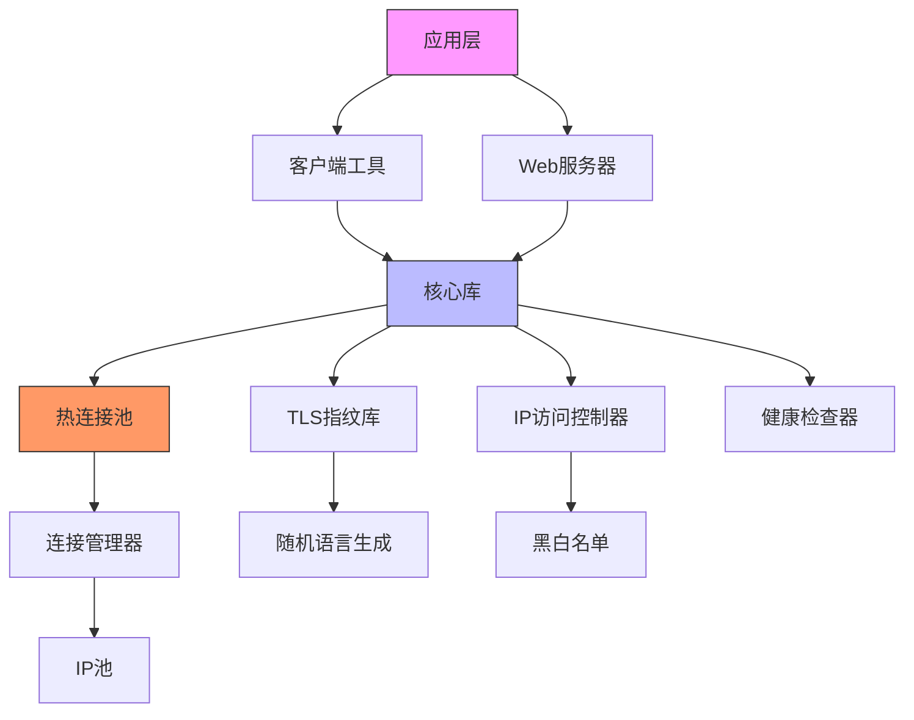

**图表来源**
- [utlsclient/utlshotconnpool.go](file://utlsclient/utlshotconnpool.go)
- [utlsclient/utlsfingerprint.go](file://utlsclient/utlsfingerprint.go)
- [utlsclient/connection_manager.go](file://utlsclient/connection_manager.go)

**本节来源**
- [README.md](file://README.md)
- [utlsclient/utlshotconnpool.go](file://utlsclient/utlshotconnpool.go)

## 详细组件分析

### 热连接池分析

热连接池是平台性能优化的核心组件，通过预建立和复用TLS连接，避免了每次请求都需要进行TLS握手的开销。

#### 热连接池类图
```mermaid
classDiagram
class UTLSHotConnPool {
+config PoolConfig
+connManager ConnectionManager
+healthChecker HealthChecker
+validator ConnectionValidator
+ipAccessCtrl IPAccessController
+fingerprintLib Library
+ipPool IPPoolProvider
+stats PoolStats
+done chan struct{}
+wg sync.WaitGroup
+NewUTLSHotConnPool(config *PoolConfig) *UTLSHotConnPool
+GetConnection(targetHost string) (*UTLSConnection, error)
+GetConnectionWithValidation(fullURL string) (*UTLSConnection, error)
+PutConnection(conn *UTLSConnection)
+GetStats() PoolStats
+IsHealthy() bool
+Close() error
}
class UTLSConnection {
+conn net.Conn
+tlsConn *utls.UConn
+targetIP string
+targetHost string
+fingerprint Profile
+acceptLanguage string
+h2ClientConn interface{}
+h2Mu sync.Mutex
+created time.Time
+lastUsed time.Time
+lastChecked time.Time
+inUse bool
+healthy bool
+requestCount int64
+errorCount int64
+mu sync.Mutex
+cond *sync.Cond
+Close() error
}
class PoolConfig {
+MaxConnections int
+MaxConnsPerHost int
+MaxIdleConns int
+ConnTimeout time.Duration
+IdleTimeout time.Duration
+MaxLifetime time.Duration
+TestTimeout time.Duration
+HealthCheckInterval time.Duration
+CleanupInterval time.Duration
+BlacklistCheckInterval time.Duration
+DNSUpdateInterval time.Duration
+MaxRetries int
}
class PoolStats {
+TotalConnections int
+ActiveConnections int
+IdleConnections int
+HealthyConnections int
+WhitelistIPs int
+BlacklistIPs int
+TotalRequests int64
+SuccessfulRequests int64
+FailedRequests int64
+SuccessRate float64
+AvgResponseTime time.Duration
+ConnReuseRate float64
+WhitelistMoves int64
+NewConnectionsFromDNS int64
+LastUpdateTime time.Time
}
UTLSHotConnPool --> ConnectionManager : "使用"
UTLSHotConnPool --> HealthChecker : "使用"
UTLSHotConnPool --> ConnectionValidator : "使用"
UTLSHotConnPool --> IPAccessController : "使用"
UTLSHotConnPool --> Library : "使用"
UTLSHotConnPool --> IPPoolProvider : "使用"
UTLSHotConnPool --> PoolConfig : "配置"
UTLSHotConnPool --> PoolStats : "统计"
UTLSHotConnPool --> UTLSConnection : "管理"
```

**图表来源**
- [utlsclient/utlshotconnpool.go](file://utlsclient/utlshotconnpool.go)

#### 热连接池工作流程
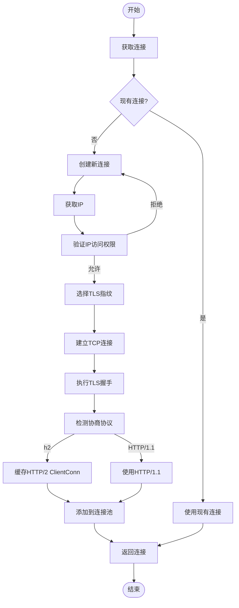

**图表来源**
- [utlsclient/utlshotconnpool.go](file://utlsclient/utlshotconnpool.go)

**本节来源**
- [utlsclient/utlshotconnpool.go](file://utlsclient/utlshotconnpool.go)
- [utlsclient/utlsclient.go](file://utlsclient/utlsclient.go)

### TLS指纹伪装分析

TLS指纹伪装组件通过模拟真实浏览器的TLS握手特征，提高爬虫的隐蔽性。

#### 指纹库类图
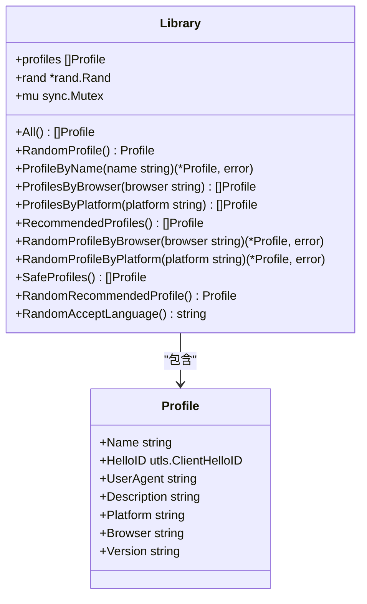

**图表来源**
- [utlsclient/utlsfingerprint.go](file://utlsclient/utlsfingerprint.go)

#### 指纹选择流程
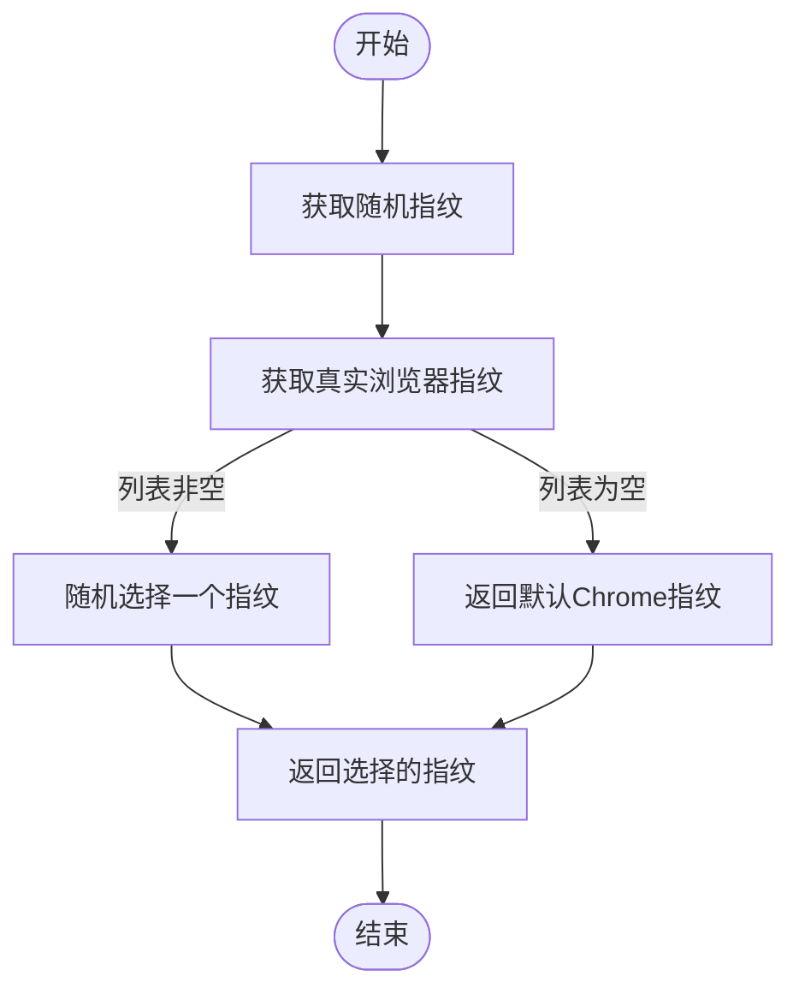

**图表来源**
- [utlsclient/utlsfingerprint.go](file://utlsclient/utlsfingerprint.go)

**本节来源**
- [utlsclient/utlsfingerprint.go](file://utlsclient/utlsfingerprint.go)

### HTTP客户端分析

HTTP客户端组件负责在已建立的TLS连接上执行HTTP请求。

#### HTTP客户端类图
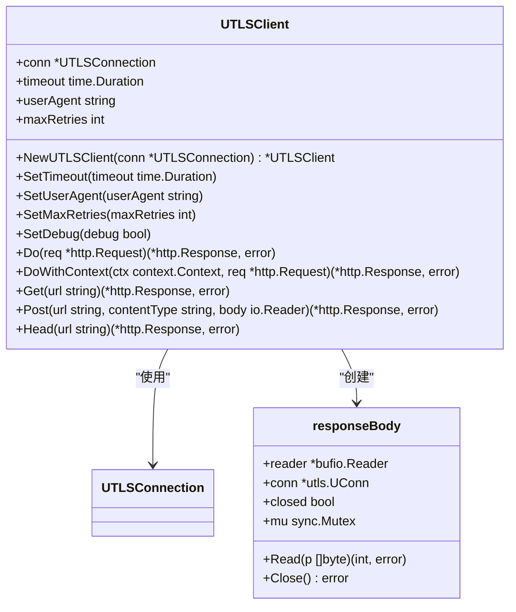

**图表来源**
- [utlsclient/utlsclient.go](file://utlsclient/utlsclient.go)

#### HTTP请求流程
```mermaid
sequenceDiagram
participant Client as "UTLSClient"
participant Conn as "UTLSConnection"
participant TLS as "uTLS连接"
participant Server as "服务器"
Client->>Client : 设置请求头
Client->>Client : User-Agent和Accept-Language
loop 重试机制
Client->>Client : 执行请求
Client->>Conn : 检测协商协议
Conn-->>Client : h2或HTTP/1.1
alt h2协议
Client->>Client : 使用HTTP/2 Transport
Client->>TLS : 创建HTTP/2 ClientConn
TLS-->>Client : ClientConn
Client->>Server : 发送HTTP/2请求
else HTTP/1.1协议
Client->>Client : 构建原始HTTP请求
Client->>TLS : 发送原始请求
TLS-->>Client : 响应流
Client->>Client : 解析响应
end
Client-->>Client : 处理响应
break 成功
Client->>Client : 等待重试延迟
end
Client-->>Client : 返回响应
```

**图表来源**
- [utlsclient/utlsclient.go](file://utlsclient/utlsclient.go)

**本节来源**
- [utlsclient/utlsclient.go](file://utlsclient/utlsclient.go)

### 连接管理器分析

连接管理器负责连接的生命周期管理，包括添加、获取、移除和清理连接。

#### 连接管理器类图
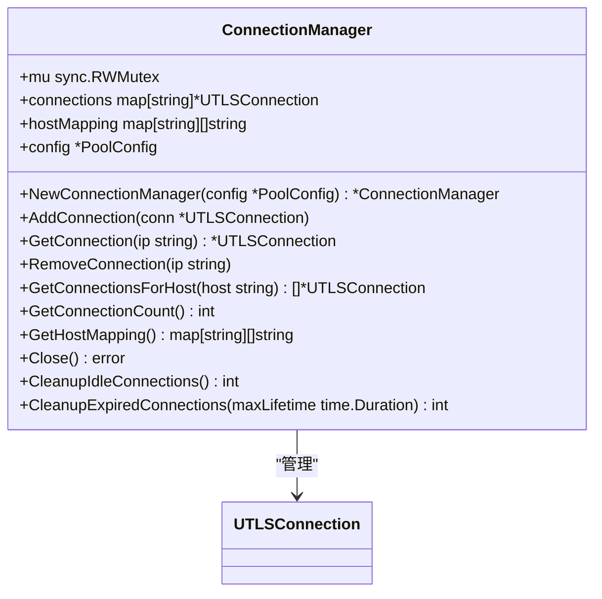

**图表来源**
- [utlsclient/connection_manager.go](file://utlsclient/connection_manager.go)

**本节来源**
- [utlsclient/connection_manager.go](file://utlsclient/connection_manager.go)

### 健康检查器分析

健康检查器负责检查连接的健康状态，并清理不健康的连接。

#### 健康检查器类图
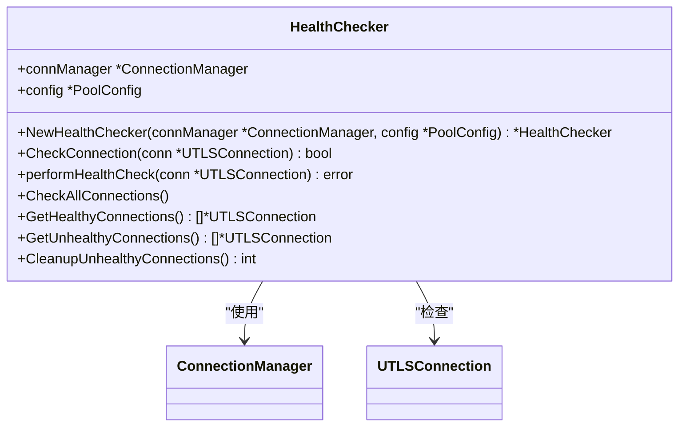

**图表来源**
- [utlsclient/health_checker.go](file://utlsclient/health_checker.go)

**本节来源**
- [utlsclient/health_checker.go](file://utlsclient/health_checker.go)

### IP访问控制器分析

IP访问控制器负责管理IP白名单和黑名单，控制IP的访问权限。

#### IP访问控制器类图
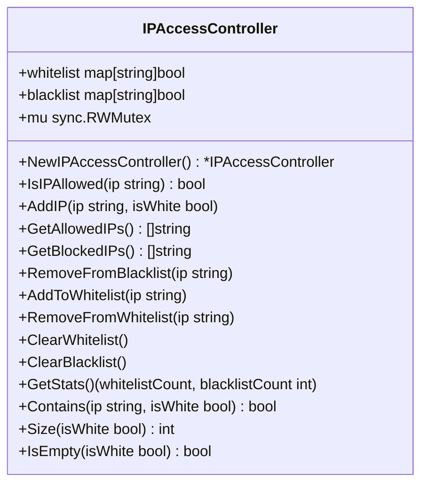

**图表来源**
- [utlsclient/ip_access_controller.go](file://utlsclient/ip_access_controller.go)

**本节来源**
- [utlsclient/ip_access_controller.go](file://utlsclient/ip_access_controller.go)

## 依赖分析

平台依赖于多个外部库和标准库，主要依赖关系如下：

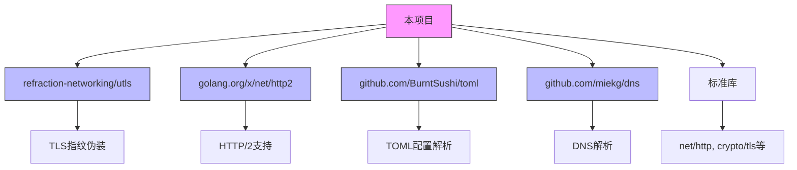

**图表来源**
- [go.mod](file://go.mod)
- [README.md](file://README.md)

**本节来源**
- [go.mod](file://go.mod)
- [README.md](file://README.md)

## 性能考虑

平台在设计时充分考虑了性能优化，主要体现在以下几个方面：

1. **连接复用**：通过热连接池技术，避免了TLS握手的开销，性能提升3-6倍
2. **并发安全**：使用多级锁机制和双重检查模式，确保并发安全的同时避免死锁
3. **资源管理**：通过健康检查和连接清理机制，及时释放无效连接，避免资源浪费
4. **协议优化**：支持HTTP/2协议，充分利用h2连接复用特性
5. **内存优化**：使用64位整数压缩存储四叉树路径，减少内存占用

这些优化措施使得平台能够在大规模并发场景下保持高性能和稳定性。

**本节来源**
- [README.md](file://README.md)
- [utlsclient/utlshotconnpool.go](file://utlsclient/utlshotconnpool.go)

## 故障排除指南

### 常见问题及解决方案

| 问题 | 可能原因 | 解决方案 |
|------|---------|---------|
| 获取连接失败 | IP在黑名单中 | 检查IP访问控制器的黑名单 |
| TLS握手失败 | 指纹配置错误 | 检查TLS指纹库配置 |
| HTTP/2连接无法复用 | ClientConn未缓存 | 确保HTTP/2 ClientConn被正确缓存 |
| IPv6连接失败 | 地址格式错误 | 使用方括号包裹IPv6地址 |
| 死锁问题 | 锁顺序不当 | 使用双重检查模式 |

### 日志系统使用

平台提供了灵活的日志系统，支持控制台、文件和多目标输出：

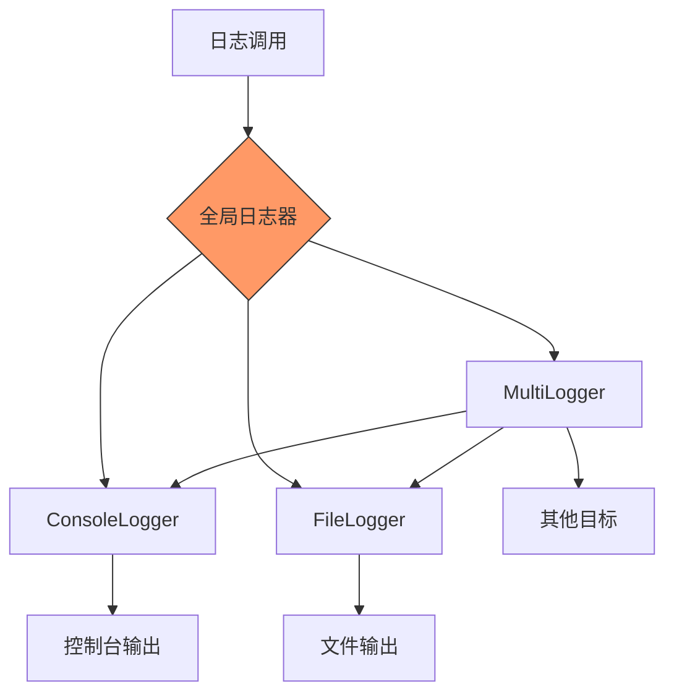

**图表来源**
- [logger/logger.go](file://logger/logger.go)

**本节来源**
- [logger/logger.go](file://logger/logger.go)
- [README.md](file://README.md)

## 结论

本爬虫平台通过创新的热连接池技术、全面的TLS指纹伪装和智能的IP管理策略，实现了高性能、高隐蔽性的网络爬取能力。平台架构清晰，组件职责明确，具有良好的可扩展性和维护性。

核心优势包括：
- **性能卓越**：通过连接复用，性能提升3-6倍
- **隐蔽性强**：支持33种浏览器指纹和90种语言组合
- **协议完整**：支持HTTP/1.1和HTTP/2，以及IPv4和IPv6双栈
- **安全可靠**：具备健康检查、死锁预防和自动重试机制

未来可进一步优化的方向包括：
1. 增强IP池的动态更新能力
2. 支持更多类型的TLS指纹
3. 优化HTTP/2连接的复用策略
4. 增加更精细的流量控制机制