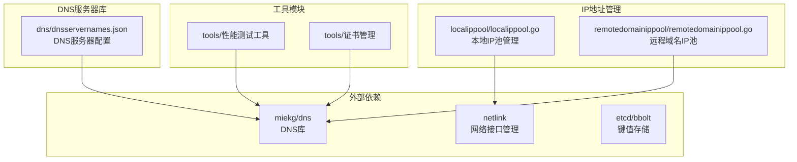
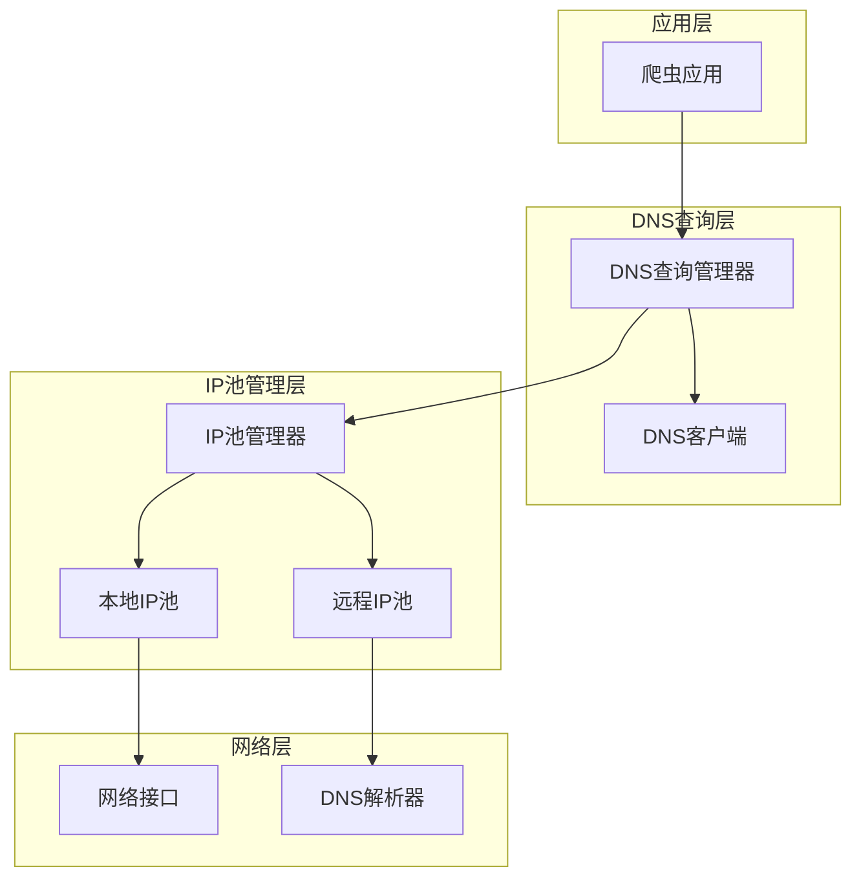
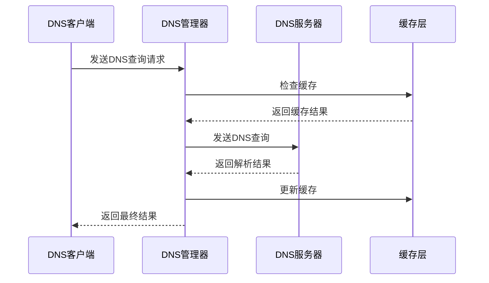
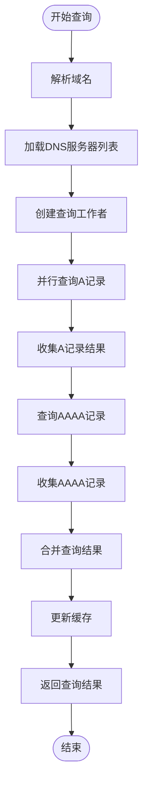
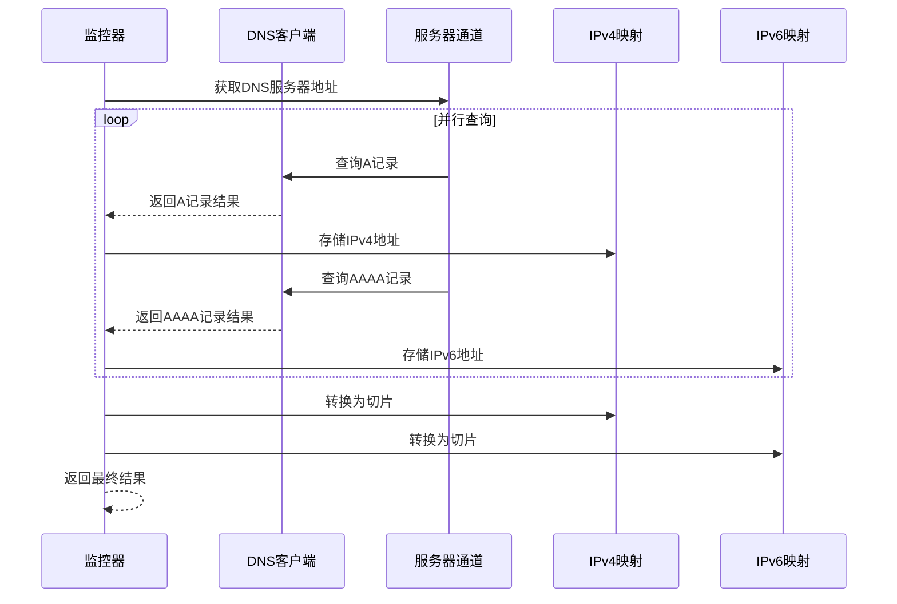
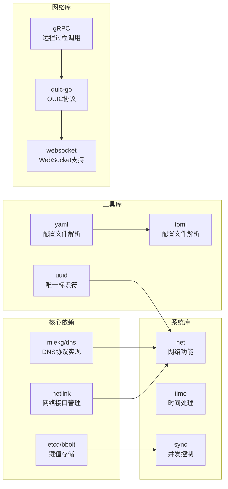
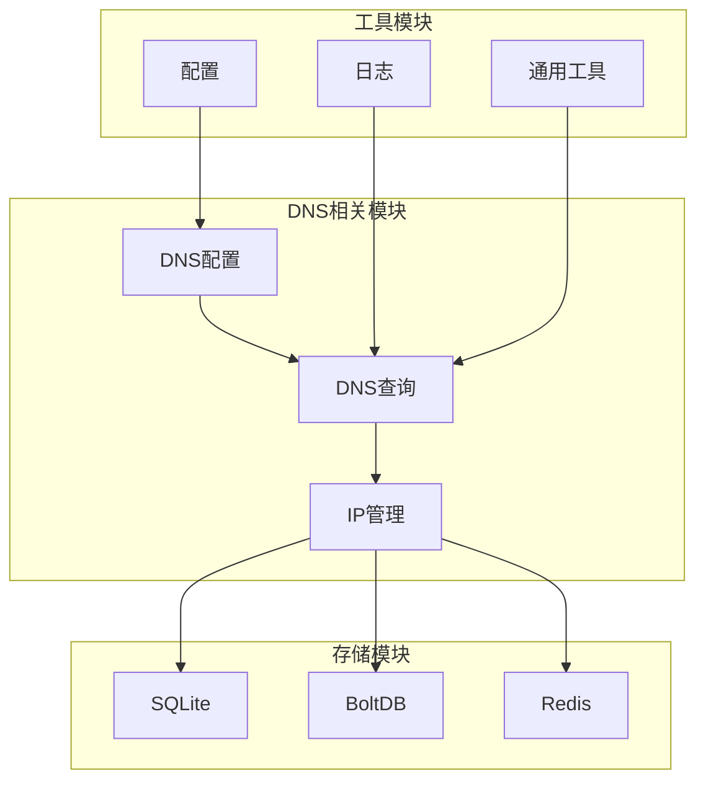

# DNS服务器库

<cite>
**本文档引用的文件**
- [dnsservernames.json](file://dns/dnsservernames.json)
- [README.md](file://README.md)
- [go.mod](file://go.mod)
- [remotedomainippool.go](file://remotedomainippool/remotedomainippool.go)
- [localippool.go](file://localippool/localippool.go)
</cite>

## 目录
1. [简介](#简介)
2. [项目结构](#项目结构)
3. [核心组件](#核心组件)
4. [架构概览](#架构概览)
5. [详细组件分析](#详细组件分析)
6. [依赖关系分析](#依赖关系分析)
7. [性能考虑](#性能考虑)
8. [故障排除指南](#故障排除指南)
9. [结论](#结论)

## 简介

这是一个基于Go语言开发的高性能DNS服务器库，专门为爬虫平台设计。该库提供了完整的DNS查询功能，支持IPv4和IPv6地址解析，包含丰富的公共DNS服务器配置和智能的IP地址池管理机制。

该项目的核心特点是：
- 基于miekg/dns库构建的高效DNS查询引擎
- 支持全球541个公共DNS服务器的配置
- 智能的IPv4/IPv6地址池管理
- 并发安全的DNS查询实现
- 自动化的IP地址轮换和负载均衡

## 项目结构

项目采用模块化设计，主要包含以下核心模块：



**图表来源**
- [dnsservernames.json:1-541](file://dns/dnsservernames.json#L1-L541)
- [localippool.go:1-800](file://localippool/localippool.go#L1-L800)
- [remotedomainippool.go:1-361](file://remotedomainippool/remotedomainippool.go#L1-L361)

**章节来源**
- [README.md:1-121](file://README.md#L1-L121)
- [go.mod:1-142](file://go.mod#L1-L142)

## 核心组件

### DNS服务器配置管理

系统内置了541个全球公共DNS服务器的完整配置，涵盖各大运营商和地区的服务商：

- **主流提供商**：Google Public DNS、Cloudflare、OpenDNS、Quad9
- **地区性服务**：支持中国、美国、欧洲、亚洲、南美洲等地区的本地DNS服务器
- **隐私保护**：包含多个隐私友好的DNS服务提供商
- **IPv4/IPv6双栈**：同时支持IPv4和IPv6地址格式

### IP地址池管理系统

提供两种类型的IP地址池管理策略：

#### 本地IP池 (LocalIPPool)
- 支持静态IPv4地址和动态IPv6地址管理
- 智能的IPv6地址生成和回收机制
- 支持隧道模式和真实接口绑定
- 引用计数机制实现地址复用

#### 远程域名IP池 (RemoteDomainIPPool)
- 基于DNS查询的动态IP地址收集
- 并发安全的多服务器查询机制
- 支持A记录和AAAA记录的并行查询
- 实时更新的IP地址缓存

**章节来源**
- [dnsservernames.json:1-541](file://dns/dnsservernames.json#L1-L541)
- [localippool.go:1-800](file://localippool/localippool.go#L1-L800)
- [remotedomainippool.go:1-361](file://remotedomainippool/remotedomainippool.go#L1-L361)

## 架构概览

系统采用分层架构设计，确保高可用性和可扩展性：



**图表来源**
- [localippool.go:44-78](file://localippool/localippool.go#L44-L78)
- [remotedomainippool.go:23-34](file://remotedomainippool/remotedomainippool.go#L23-L34)

## 详细组件分析

### DNS查询组件

#### DNS消息处理流程



**图表来源**
- [remotedomainippool.go:310-355](file://remotedomainippool/remotedomainippool.go#L310-L355)

#### 并发查询实现

系统采用goroutine池化的方式实现高效的并发DNS查询：



**图表来源**
- [remotedomainippool.go:310-355](file://remotedomainippool/remotedomainippool.go#L310-L355)

**章节来源**
- [remotedomainippool.go:310-355](file://remotedomainippool/remotedomainippool.go#L310-L355)

### IP地址池管理组件

#### 本地IP池架构

```mermaid
classDiagram
class LocalIPPool {
-staticIPv4s : []net.IP
-hasIPv6Support : bool
-ipv6Subnet : *net.IPNet
-ipv6Queue : chan net.IP
-stopChan : chan struct{}
-ipv6Interface : string
+GetIP() net.IP
+ReleaseIP(ip net.IP)
+SetTargetIPCount(count int)
+producer()
+generateRandomIPInSubnet() net.IP
}
class IPPool {
<<interface>>
+GetIP() net.IP
+ReleaseIP(ip net.IP)
+MarkIPUnused(ip net.IP)
+SetTargetIPCount(count int)
+SupportsDynamicPool() bool
+GetActiveIPv6Addresses() []string
+GetIPv4Addresses() []string
+Close() error
}
LocalIPPool ..|> IPPool : 实现
```

**图表来源**
- [localippool.go:22-78](file://localippool/localippool.go#L22-L78)

#### 远程IP池查询流程



**图表来源**
- [remotedomainippool.go:310-355](file://remotedomainippool/remotedomainippool.go#L310-L355)

**章节来源**
- [localippool.go:44-229](file://localippool/localippool.go#L44-L229)
- [remotedomainippool.go:23-355](file://remotedomainippool/remotedomainippool.go#L23-L355)

## 依赖关系分析

### 外部依赖库

项目使用了多个高质量的Go语言库来实现核心功能：



**图表来源**
- [go.mod:5-20](file://go.mod#L5-L20)

### 内部模块依赖



**图表来源**
- [go.mod:1-142](file://go.mod#L1-L142)

**章节来源**
- [go.mod:1-142](file://go.mod#L1-L142)

## 性能考虑

### 查询性能优化

系统采用了多项性能优化策略：

1. **并发查询**：使用goroutine池化实现并行DNS查询
2. **缓存机制**：智能的缓存策略减少重复查询
3. **连接复用**：复用DNS连接提高效率
4. **负载均衡**：智能选择最佳DNS服务器

### 内存管理

- 使用通道(Channels)进行goroutine间通信
- 采用原子操作保证并发安全
- 智能的内存回收机制
- 避免内存泄漏的设计模式

### 网络优化

- 支持IPv4/IPv6双栈查询
- 自动选择最优的DNS服务器
- 智能的超时和重试机制
- 连接池管理减少连接开销

## 故障排除指南

### 常见问题及解决方案

#### DNS查询失败

**问题症状**：DNS查询返回超时或失败

**可能原因**：
1. DNS服务器不可达
2. 网络连接问题
3. 防火墙阻止
4. DNS服务器限制

**解决步骤**：
1. 检查网络连接状态
2. 验证DNS服务器配置
3. 查看防火墙设置
4. 尝试备用DNS服务器

#### IP地址池问题

**问题症状**：IP地址池无法获取或使用异常

**可能原因**：
1. IPv6子网配置错误
2. 系统权限不足
3. 网络接口不可用
4. 地址冲突

**解决步骤**：
1. 检查IPv6子网配置
2. 验证系统权限
3. 确认网络接口状态
4. 检查地址冲突情况

#### 性能问题

**问题症状**：查询响应缓慢或资源占用过高

**可能原因**：
1. 并发查询过多
2. 缓存配置不当
3. 网络延迟高
4. 系统资源不足

**解决步骤**：
1. 调整并发查询参数
2. 优化缓存策略
3. 检查网络状况
4. 监控系统资源使用

**章节来源**
- [remotedomainippool.go:310-355](file://remotedomainippool/remotedomainippool.go#L310-L355)
- [localippool.go:444-464](file://localippool/localippool.go#L444-L464)

## 结论

这个DNS服务器库是一个功能完整、性能优异的Go语言实现，具有以下显著特点：

1. **全面的DNS服务器支持**：内置541个公共DNS服务器配置，覆盖全球主要地区
2. **智能的IP地址管理**：提供灵活的IPv4/IPv6地址池管理机制
3. **高性能设计**：采用并发安全的架构，支持高并发查询
4. **易于集成**：清晰的API设计，便于集成到各种应用场景
5. **良好的可维护性**：模块化设计，代码结构清晰

该库特别适合需要高性能DNS查询和IP地址管理的爬虫平台、网络监控工具和其他网络应用。通过合理的配置和使用，可以显著提升网络应用的性能和可靠性。