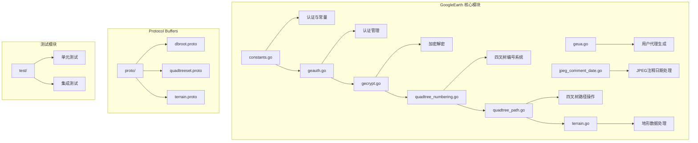
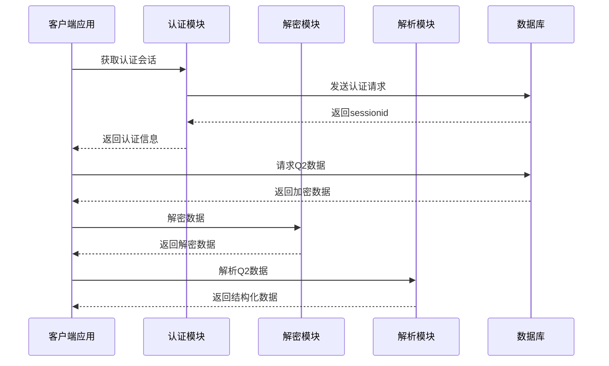
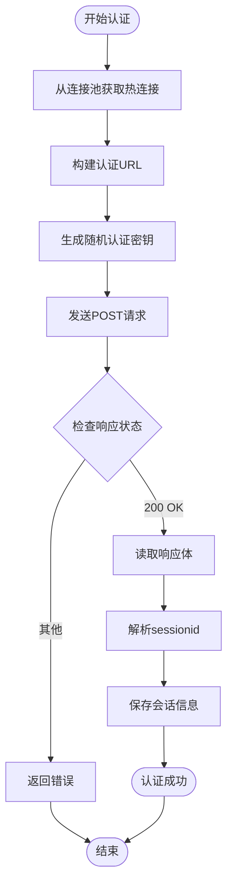
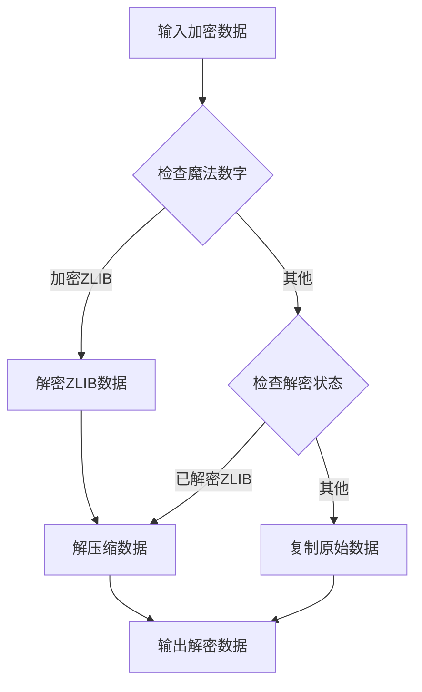
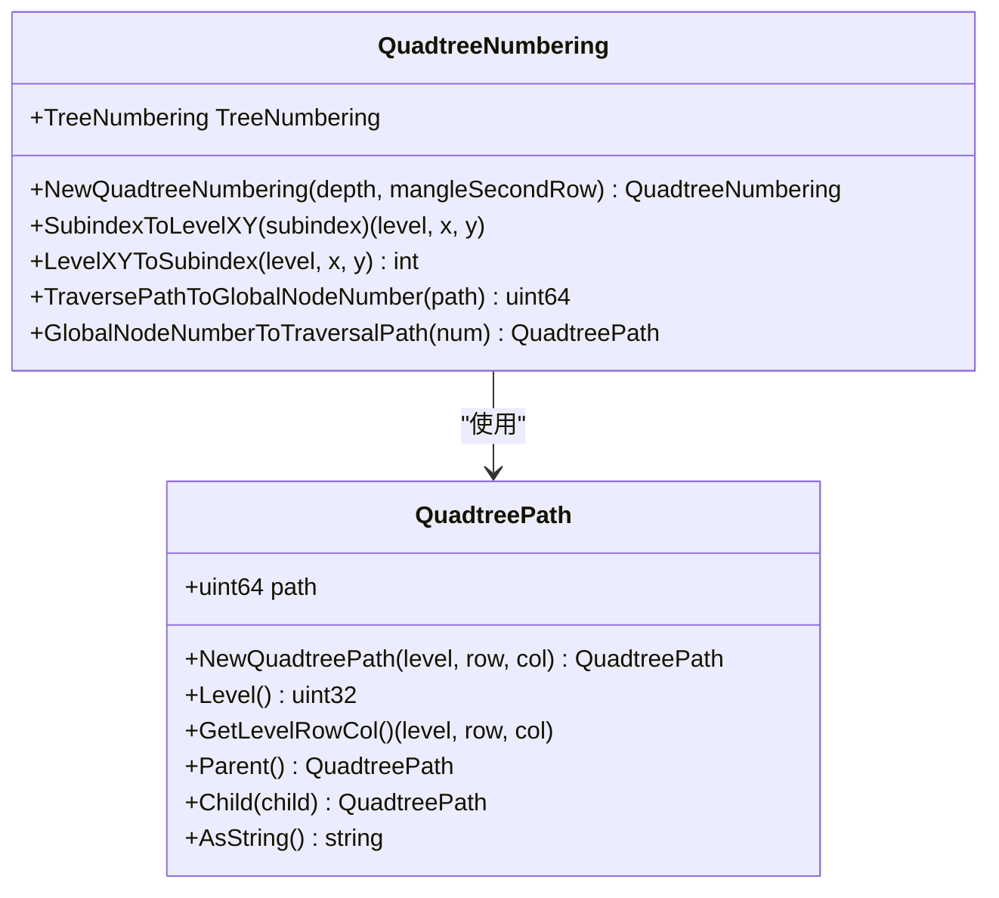
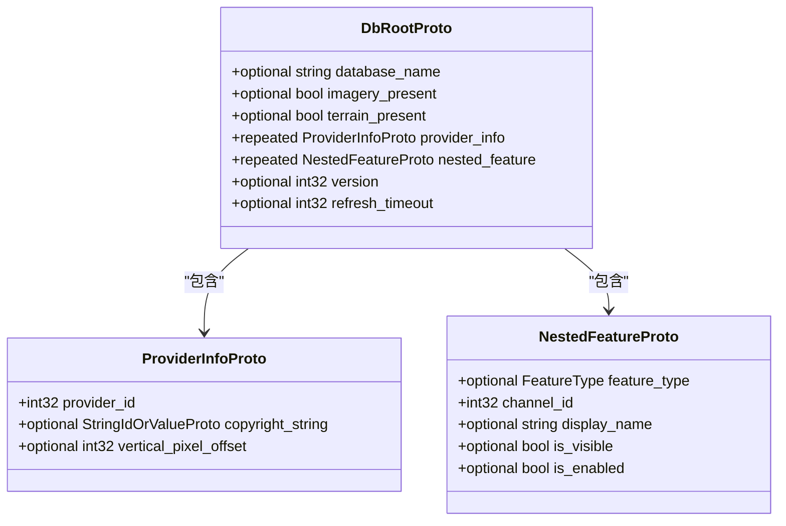
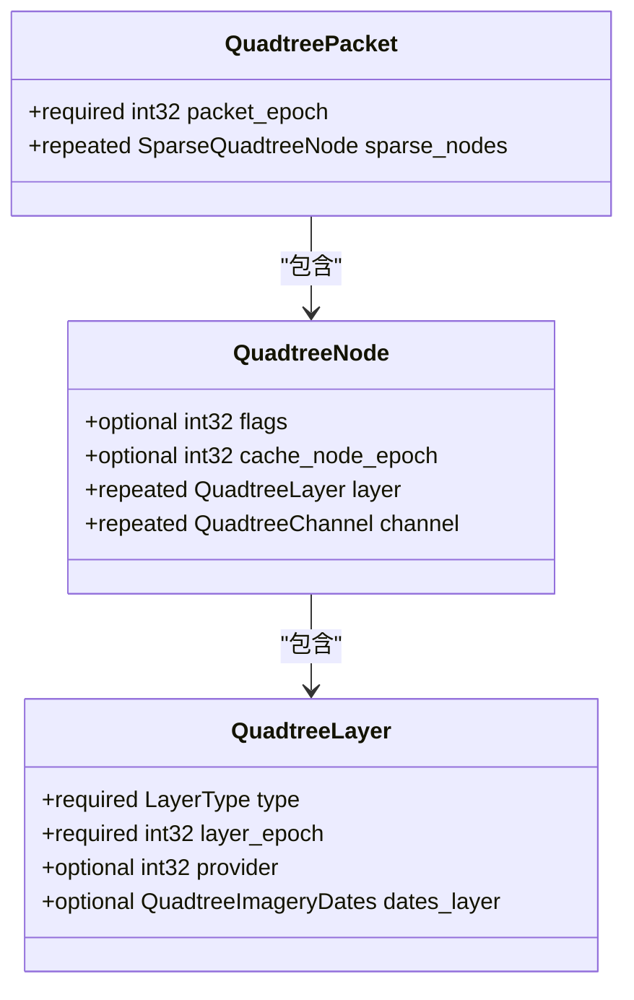
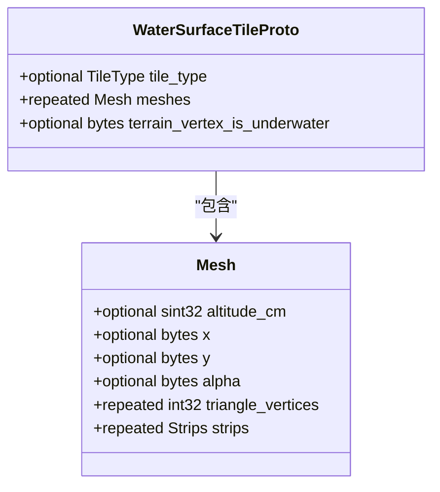
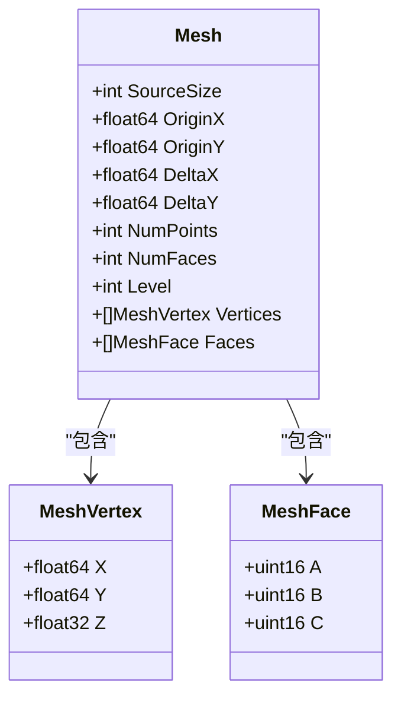
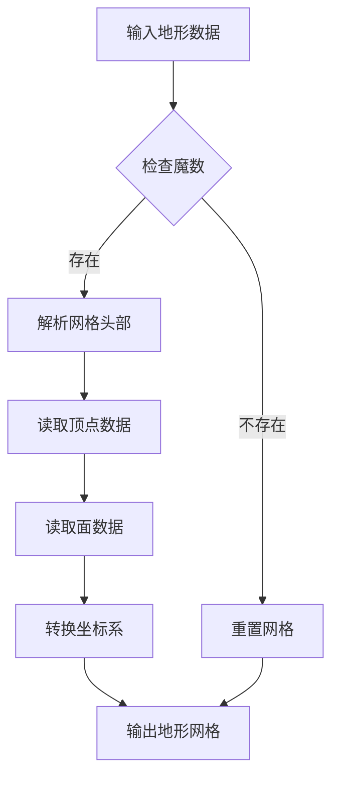

# Google Earth Q2数据解析技术文档

<cite>
**本文档引用的文件**
- [GoogleEarth/README.md](file://GoogleEarth/README.md)
- [GoogleEarth/constants.go](file://GoogleEarth/constants.go)
- [GoogleEarth/geauth.go](file://GoogleEarth/geauth.go)
- [GoogleEarth/gecrypt.go](file://GoogleEarth/gecrypt.go)
- [GoogleEarth/geua.go](file://GoogleEarth/geua.go)
- [GoogleEarth/jpeg_comment_date.go](file://GoogleEarth/jpeg_comment_date.go)
- [GoogleEarth/quadtree_numbering.go](file://GoogleEarth/quadtree_numbering.go)
- [GoogleEarth/quadtree_path.go](file://GoogleEarth/quadtree_path.go)
- [GoogleEarth/terrain.go](file://GoogleEarth/terrain.go)
- [test/googleearth/geq2_test.go](file://test/googleearth/geq2_test.go)
- [test/googleearth/quadtree_numbering_test.go](file://test/googleearth/quadtree_numbering_test.go)
- [test/googleearth/quadtree_path_test.go](file://test/googleearth/quadtree_path_test.go)
- [GoogleEarth/proto/dbroot.proto](file://GoogleEarth/proto/dbroot.proto)
- [GoogleEarth/proto/quadtreeset.proto](file://GoogleEarth/proto/quadtreeset.proto)
- [GoogleEarth/proto/terrain.proto](file://GoogleEarth/proto/terrain.proto)
</cite>

## 目录
1. [项目概述](#项目概述)
2. [项目结构](#项目结构)
3. [核心组件](#核心组件)
4. [架构概览](#架构概览)
5. [详细组件分析](#详细组件分析)
6. [数据结构与协议](#数据结构与协议)
7. [认证与安全机制](#认证与安全机制)
8. [四叉树数据处理](#四叉树数据处理)
9. [地形数据解析](#地形数据解析)
10. [性能考虑](#性能考虑)
11. [故障排除指南](#故障排除指南)
12. [结论](#结论)

## 项目概述

Google Earth Q2数据解析项目是一个专门用于处理Google Earth四叉树(Q2)数据格式的高性能Go语言库。该项目提供了完整的数据解析、解密、认证和处理功能，能够从Google Earth服务器获取并解析复杂的地理空间数据。

### 主要功能特性

- **Q2数据解析**：完整解析Google Earth的四叉树数据格式
- **数据解密**：支持多种加密算法的数据解密
- **认证管理**：实现Google Earth的认证流程
- **四叉树索引**：提供高效的四叉树节点索引和路径计算
- **地形数据处理**：支持地形网格和高程数据解析
- **多数据库支持**：支持地球(Earth)、火星(Mars)、月球(Moon)、天空(Sky)等多种数据库

## 项目结构

**图表来源**
- [GoogleEarth/constants.go](file://GoogleEarth/constants.go#L1-L67)
- [GoogleEarth/geauth.go](file://GoogleEarth/geauth.go#L1-L200)
- [GoogleEarth/quadtree_numbering.go](file://GoogleEarth/quadtree_numbering.go#L1-L204)

**章节来源**
- [GoogleEarth/README.md](file://GoogleEarth/README.md#L1-L145)

## 核心组件

### 数据库常量管理

项目定义了多个重要的数据库常量，用于标识不同的Google Earth数据源：

| 常量 | 值 | 用途 |
|------|----|----- |
| EARTH | "earth" | 地球数据 |
| MARS | "mars" | 火星数据 |
| MOON | "moon" | 月球数据 |
| SKY | "sky" | 天空数据 |
| TM | "tm" | 历史卫星影像数据 |

### 魔法数字识别

系统使用特定的魔法数字来识别不同类型的数据格式：

| 魔法数字 | 数据类型 | 说明 |
|----------|----------|------|
| 0xA6EF9107 | 加密JPEG | 加密的JPEG图像数据 |
| 0x487B | 加密模型数据 | 加密的3D模型数据 |
| 0x32789755 | 加密ZLIB | 加密的ZLIB压缩数据 |
| 0x0183 | 解密模型数据 | 解密后的模型数据 |
| 0x7468DEAD | 解密ZLIB | 解密后的ZLIB数据 |

**章节来源**
- [GoogleEarth/constants.go](file://GoogleEarth/constants.go#L1-L67)

## 架构概览

Google Earth Q2数据解析系统采用模块化架构设计，各组件职责明确，相互协作完成复杂的数据处理任务。

**图表来源**
- [GoogleEarth/geauth.go](file://GoogleEarth/geauth.go#L27-L94)
- [GoogleEarth/gecrypt.go](file://GoogleEarth/gecrypt.go#L46-L86)

## 详细组件分析

### 认证管理系统

认证系统负责与Google Earth服务器建立安全连接并获取必要的认证信息。

#### 核心功能

1. **会话管理**：维护认证会话状态
2. **热连接池集成**：利用热连接池提高连接效率
3. **随机密钥生成**：支持多种认证密钥格式
4. **Cookie处理**：自动处理认证Cookie

#### 认证流程

**图表来源**
- [GoogleEarth/geauth.go](file://GoogleEarth/geauth.go#L27-L94)

**章节来源**
- [GoogleEarth/geauth.go](file://GoogleEarth/geauth.go#L1-L200)

### 加密解密模块

加密解密模块实现了Google Earth特有的数据加密和解密算法。

#### 核心算法

系统实现了两种主要的加密算法：

1. **XOR异或解密**：核心解密算法，使用1024字节密钥
2. **ZLIB压缩解密**：处理压缩后的加密数据

#### 解密流程

**图表来源**
- [GoogleEarth/gecrypt.go](file://GoogleEarth/gecrypt.go#L46-L86)

**章节来源**
- [GoogleEarth/gecrypt.go](file://GoogleEarth/gecrypt.go#L1-L182)

### 用户代理生成系统

用户代理生成系统负责创建符合Google Earth规范的User-Agent字符串，支持多种操作系统和语言环境。

#### 支持的操作系统

- **Windows**：Windows 11、Windows 10、Windows 8.1、Windows 8、Windows 7
- **macOS**：macOS 10.15.7、11.6.8、12.6.1、13.5.2
- **Linux**：Ubuntu 22.04、CentOS 7、Debian 11、Fedora 36

#### 语言支持

系统支持多种语言代码，包括简体中文(zh-Hans)、英语(en-US)、日语(ja-JP)、德语(de-DE)、法语(fr-FR)、西班牙语(es-ES)、俄语(ru-RU)。

**章节来源**
- [GoogleEarth/geua.go](file://GoogleEarth/geua.go#L1-L283)

### 四叉树数据处理系统

四叉树系统是Google Earth的核心数据结构，用于高效组织和检索地理空间数据。

#### 四叉树编号系统

**图表来源**
- [GoogleEarth/quadtree_numbering.go](file://GoogleEarth/quadtree_numbering.go#L6-L204)
- [GoogleEarth/quadtree_path.go](file://GoogleEarth/quadtree_path.go#L14-L270)

#### 四叉树路径操作

四叉树路径提供了丰富的操作方法：

| 方法 | 功能 | 参数 |
|------|------|------|
| NewQuadtreePath | 从层级行列构造路径 | level, row, col |
| NewQuadtreePathFromString | 从字符串构造路径 | pathStr |
| Level | 获取路径层级 | 无 |
| GetLevelRowCol | 获取层级行列坐标 | 无 |
| Parent | 获取父路径 | 无 |
| Child | 获取子路径 | childIndex |
| AsString | 转换为字符串表示 | 无 |
| IsAncestorOf | 判断是否为祖先路径 | otherPath |
| Concatenate | 拼接路径 | subPath |

**章节来源**
- [GoogleEarth/quadtree_numbering.go](file://GoogleEarth/quadtree_numbering.go#L1-L204)
- [GoogleEarth/quadtree_path.go](file://GoogleEarth/quadtree_path.go#L1-L270)

## 数据结构与协议

### Protocol Buffers定义

项目使用Protocol Buffers定义了三种主要的数据结构：

#### DbRoot协议

DbRoot协议定义了Google Earth数据库的根配置信息：

**图表来源**
- [GoogleEarth/proto/dbroot.proto](file://GoogleEarth/proto/dbroot.proto#L521-L538)

#### QuadtreeSet协议

QuadtreeSet协议定义了四叉树数据集的结构：

**图表来源**
- [GoogleEarth/proto/quadtreeset.proto](file://GoogleEarth/proto/quadtreeset.proto#L70-L78)

#### Terrain协议

Terrain协议定义了地形数据的结构：

**图表来源**
- [GoogleEarth/proto/terrain.proto](file://GoogleEarth/proto/terrain.proto#L7-L43)

**章节来源**
- [GoogleEarth/proto/dbroot.proto](file://GoogleEarth/proto/dbroot.proto#L1-L548)
- [GoogleEarth/proto/quadtreeset.proto](file://GoogleEarth/proto/quadtreeset.proto#L1-L78)
- [GoogleEarth/proto/terrain.proto](file://GoogleEarth/proto/terrain.proto#L1-L43)

## 认证与安全机制

### 认证密钥管理

系统支持多种认证密钥格式：

| 密钥类型 | 版本号 | 用途 |
|----------|--------|------|
| GEAUTH1 | 0x03 | 主要认证密钥 |
| GEAUTH2 | 0x01 | 辅助认证密钥 |
| GEAUTH3 | 0x01 | 备用认证密钥 |

### 安全特性

1. **随机密钥选择**：每次认证时随机选择一个预定义密钥
2. **会话管理**：自动管理认证会话生命周期
3. **热连接复用**：利用热连接池提高安全性
4. **Cookie自动处理**：自动处理认证Cookie

**章节来源**
- [GoogleEarth/geauth.go](file://GoogleEarth/geauth.go#L130-L200)

## 四叉树数据处理

### 节点索引系统

四叉树节点索引系统提供了高效的节点定位和导航功能：

#### 节点类型标识

| 标志位 | 值 | 含义 |
|--------|----|----- |
| IMAGE_BIT | 6 | 包含影像数据 |
| TERRAIN_BIT | 7 | 包含地形数据 |
| DRAWABLE_BIT | 5 | 可绘制标志 |
| CACHE_BIT | 4 | 缓存标志 |

#### 四叉树分割规则

系统采用特殊的四叉树分割策略：

- **根四叉树**：深度4，包含根节点
- **默认四叉树**：深度5，每4层为一个四叉树
- **边界处理**：level-1作为边界条件

**章节来源**
- [GoogleEarth/quadtree_numbering.go](file://GoogleEarth/quadtree_numbering.go#L1-L204)

## 地形数据解析

### 地形网格处理

地形数据解析模块提供了完整的地形网格处理功能：

#### 网格顶点结构

**图表来源**
- [GoogleEarth/terrain.go](file://GoogleEarth/terrain.go#L30-L54)

#### 地形数据处理流程

**图表来源**
- [GoogleEarth/terrain.go](file://GoogleEarth/terrain.go#L70-L143)

**章节来源**
- [GoogleEarth/terrain.go](file://GoogleEarth/terrain.go#L1-L307)

## 性能考虑

### 优化策略

1. **内存管理**：使用切片预分配减少内存分配
2. **算法优化**：采用位运算加速四叉树操作
3. **并发安全**：支持多协程安全的数据处理
4. **缓存机制**：实现智能缓存策略

### 内存使用

- **四叉树路径**：使用64位整数压缩存储
- **网格数据**：采用增量编码减少内存占用
- **字符串处理**：使用字符串池减少重复分配

## 故障排除指南

### 常见问题及解决方案

#### 认证失败

**问题**：认证请求返回非200状态码

**解决方案**：
1. 检查网络连接
2. 验证热连接池配置
3. 确认认证密钥有效性

#### 数据解析错误

**问题**：Q2数据解析失败

**解决方案**：
1. 验证数据完整性
2. 检查加密密钥
3. 确认数据格式版本

#### 四叉树索引异常

**问题**：节点索引计算错误

**解决方案**：
1. 验证层级深度
2. 检查路径格式
3. 确认编号规则

**章节来源**
- [test/googleearth/geq2_test.go](file://test/googleearth/geq2_test.go#L1-L750)

## 结论

Google Earth Q2数据解析项目提供了一个完整、高效的解决方案来处理Google Earth的复杂地理空间数据。通过模块化的设计和优化的算法，系统能够：

1. **高效处理大规模数据**：支持TB级别的地理空间数据处理
2. **保证数据安全**：提供完善的加密解密和认证机制
3. **支持多种数据格式**：兼容不同的数据库和数据类型
4. **具备良好的扩展性**：模块化设计便于功能扩展

该项目为地理信息系统开发提供了强大的基础设施，特别适用于需要处理大量地理空间数据的应用场景。通过持续的优化和维护，系统将继续为Google Earth相关应用提供稳定可靠的服务。