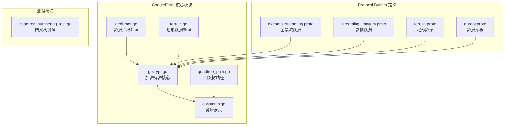
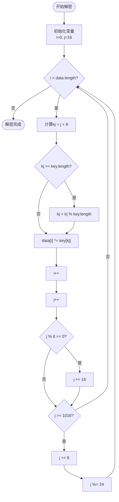
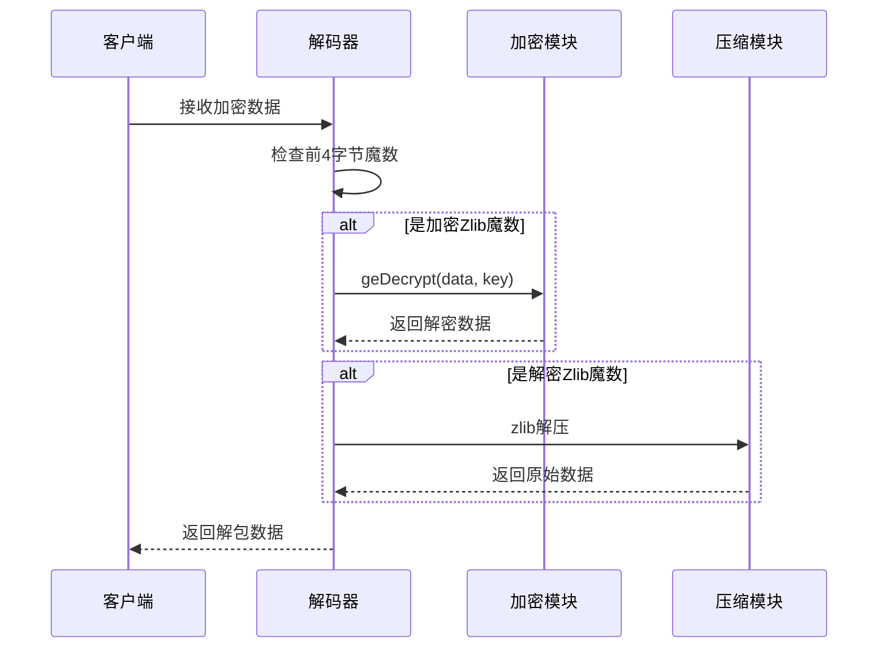
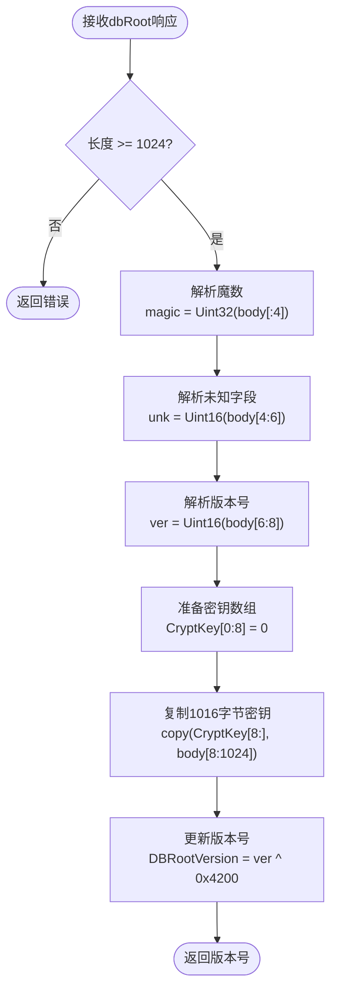
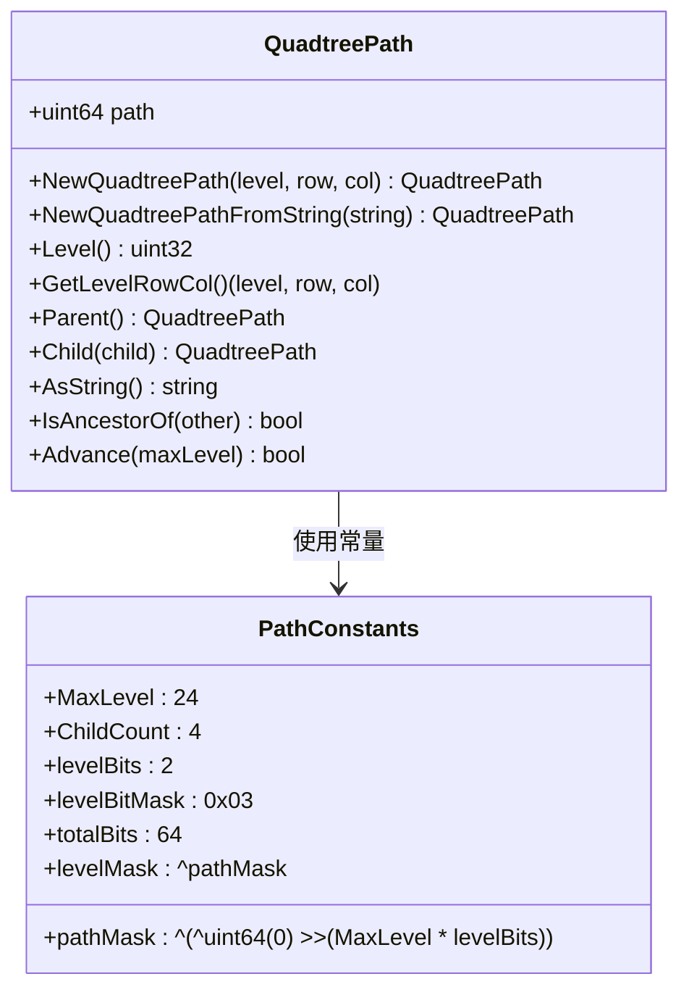
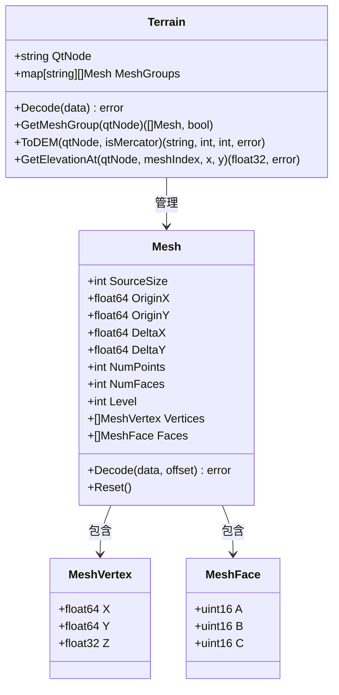
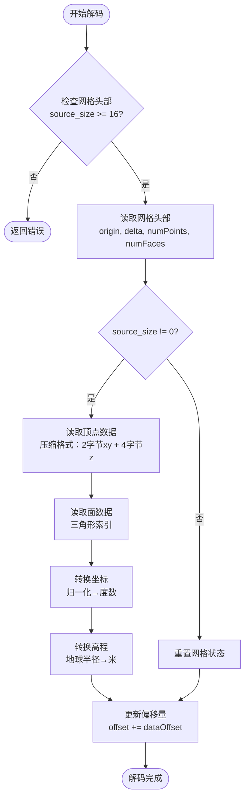
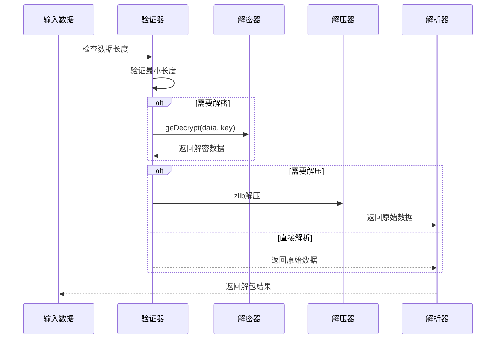

# Google Earth 加密解密技术文档

<cite>
**本文档引用的文件**
- [gecrypt.go](file://GoogleEarth/gecrypt.go)
- [constants.go](file://GoogleEarth/constants.go)
- [gedbroot.go](file://GoogleEarth/gedbroot.go)
- [quadtree_path.go](file://GoogleEarth/quadtree_path.go)
- [terrain.go](file://GoogleEarth/terrain.go)
- [README.md](file://GoogleEarth/README.md)
- [diorama_streaming.proto](file://GoogleEarth/proto/diorama_streaming.proto)
- [streaming_imagery.proto](file://GoogleEarth/proto/streaming_imagery.proto)
- [terrain.proto](file://GoogleEarth/proto/terrain.proto)
- [dbroot.proto](file://GoogleEarth/proto/dbroot.proto)
- [quadtree_numbering_test.go](file://test/googleearth/quadtree_numbering_test.go)
</cite>

## 目录
1. [简介](#简介)
2. [项目结构](#项目结构)
3. [核心加密算法](#核心加密算法)
4. [数据格式与魔数](#数据格式与魔数)
5. [数据库根密钥管理](#数据库根密钥管理)
6. [四叉树路径处理](#四叉树路径处理)
7. [地形数据处理](#地形数据处理)
8. [Protocol Buffers 协议](#protocol-buffers-协议)
9. [解包与解压流程](#解包与解压流程)
10. [性能考虑](#性能考虑)
11. [故障排除指南](#故障排除指南)
12. [总结](#总结)

## 简介

Google Earth 加密解密系统是一个复杂的地理信息系统，负责处理来自Google Earth服务器的各种加密数据。该系统实现了完整的数据解密、解包和解析功能，支持多种数据格式，包括地形数据、影像数据和全景数据。

本系统的核心功能包括：
- XOR异或加密算法的完整实现
- Zlib压缩数据的解压处理
- Google Earth特有的数据格式解析
- 四叉树空间索引的路径管理
- Protocol Buffers序列化/反序列化

## 项目结构

**图表来源**
- [gecrypt.go](file://GoogleEarth/gecrypt.go#L1-L175)
- [constants.go](file://GoogleEarth/constants.go#L1-L66)
- [gedbroot.go](file://GoogleEarth/gedbroot.go#L1-L35)

**章节来源**
- [README.md](file://GoogleEarth/README.md#L1-L145)

## 核心加密算法

### XOR异或解密算法

系统实现了Google Earth特有的XOR加密算法，该算法具有独特的密钥索引跳转逻辑：

**图表来源**
- [gecrypt.go](file://GoogleEarth/gecrypt.go#L14-L36)

### 解密函数实现

系统提供了两种解密函数：

1. **geDecrypt函数**：传统的XOR解密实现
2. **decryptXOR函数**：优化的解密算法，支持指定偏移和长度

这两种实现都遵循相同的算法逻辑，但decryptXOR提供了更灵活的接口。

**章节来源**
- [gecrypt.go](file://GoogleEarth/gecrypt.go#L14-L175)

## 数据格式与魔数

### 魔法数字常量

系统定义了多个重要的魔法数字，用于识别不同类型的加密数据：

| 魔法数字 | 十六进制值 | 用途 |
|---------|-----------|------|
| CRYPTED_JPEG_MAGIC | 0xA6EF9107 | 加密JPEG图像 |
| CRYPTED_MODEL_DATA_MAGIC | 0x487B | 加密模型数据 |
| CRYPTED_ZLIB_MAGIC | 0x32789755 | 加密Zlib数据 |
| DECRYPTED_MODEL_DATA_MAGIC | 0x0183 | 解密后模型数据 |
| DECRYPTED_ZLIB_MAGIC | 0x7468DEAD | 解密后Zlib数据 |

### 数据包处理流程

**图表来源**
- [gecrypt.go](file://GoogleEarth/gecrypt.go#L39-L78)

**章节来源**
- [constants.go](file://GoogleEarth/constants.go#L13-L18)

## 数据库根密钥管理

### dbRoot数据解析

系统实现了完整的dbRoot.v5数据解析功能，能够从服务器响应中提取动态密钥：

**图表来源**
- [gedbroot.go](file://GoogleEarth/gedbroot.go#L13-L33)

### 密钥更新机制

系统支持动态密钥更新，当接收到新的dbRoot响应时：
1. 验证响应长度
2. 解析版本号并应用异或操作
3. 更新全局CryptKey数组
4. 设置DBRootVersion全局变量

**章节来源**
- [gedbroot.go](file://GoogleEarth/gedbroot.go#L13-L33)

## 四叉树路径处理

### 路径编码与解码

四叉树路径系统使用64位整数进行高效压缩存储：

**图表来源**
- [quadtree_path.go](file://GoogleEarth/quadtree_path.go#L14-L25)

### 路径操作方法

系统提供了丰富的路径操作功能：

| 方法 | 功能 | 时间复杂度 |
|------|------|-----------|
| NewQuadtreePath() | 从层级行列创建路径 | O(n) |
| NewQuadtreePathFromString() | 从字符串创建路径 | O(n) |
| Level() | 获取路径层级 | O(1) |
| GetLevelRowCol() | 获取层级行列坐标 | O(n) |
| Parent() | 获取父路径 | O(1) |
| Child() | 获取子路径 | O(1) |
| AsString() | 转换为字符串表示 | O(n) |
| IsAncestorOf() | 判断祖先关系 | O(1) |

**章节来源**
- [quadtree_path.go](file://GoogleEarth/quadtree_path.go#L27-L265)

## 地形数据处理

### 网格数据结构

地形处理模块实现了完整的网格数据解析：

**图表来源**
- [terrain.go](file://GoogleEarth/terrain.go#L30-L54)

### 地形数据解码流程

**图表来源**
- [terrain.go](file://GoogleEarth/terrain.go#L70-L142)

**章节来源**
- [terrain.go](file://GoogleEarth/terrain.go#L146-L307)

## Protocol Buffers 协议

### 支持的数据格式

系统支持多种Google Earth特有的Protocol Buffers格式：

| 协议文件 | 主要用途 | 数据类型 |
|---------|---------|---------|
| diorama_streaming.proto | 全景流数据 | DioramaMetadata, DioramaDataPacket |
| streaming_imagery.proto | 影像数据 | EarthImageryPacket |
| terrain.proto | 地形数据 | WaterSurfaceTileProto, TerrainPacketExtraDataProto |
| dbroot.proto | 数据库根配置 | DbRootProto, EncryptedDbRootProto |

### 关键消息类型

#### 全景数据包 (DioramaDataPacket)
- 支持多种编解码器：JPEG、PNG、DXT、JP2
- 包含纹理坐标和高度信息
- 支持LOD层次细节

#### 影像数据包 (EarthImageryPacket)
- 支持多种图像格式：JPEG、JPEG2000、DXT1/5、PNG
- 支持独立Alpha通道
- 包含纹理子窗口信息

**章节来源**
- [diorama_streaming.proto](file://GoogleEarth/proto/diorama_streaming.proto#L1-L113)
- [streaming_imagery.proto](file://GoogleEarth/proto/streaming_imagery.proto#L1-L31)
- [terrain.proto](file://GoogleEarth/proto/terrain.proto#L1-L43)
- [dbroot.proto](file://GoogleEarth/proto/dbroot.proto#L1-L548)

## 解包与解压流程

### 完整解包流程

**图表来源**
- [gecrypt.go](file://GoogleEarth/gecrypt.go#L39-L78)

### 错误处理机制

系统实现了完善的错误处理：
- 输入验证：检查数据长度和完整性
- 解密验证：确认解密后的魔数正确性
- 解压验证：确保Zlib解压成功
- 数据验证：检查解析后的数据结构有效性

**章节来源**
- [gecrypt.go](file://GoogleEarth/gecrypt.go#L39-L78)

## 性能考虑

### 内存优化策略

1. **零拷贝设计**：尽可能使用原地修改，减少内存分配
2. **缓冲区复用**：重用临时缓冲区，避免频繁分配
3. **流式处理**：支持大数据的流式解包和解析

### 算法优化

1. **位运算优化**：使用位运算替代乘除法
2. **循环展开**：在关键路径上进行循环展开
3. **分支预测优化**：减少条件分支的使用

### 并发处理

虽然当前实现是单线程的，但架构设计支持并发处理：
- 独立的解密和解压模块
- 无状态的解析函数
- 可并行的数据处理

## 故障排除指南

### 常见问题及解决方案

#### 解密失败
**症状**：geDecrypt函数返回空结果
**原因**：输入数据为空或密钥无效
**解决**：检查输入数据长度和密钥设置

#### 解包错误
**症状**：UnpackGEZlib返回错误
**原因**：数据损坏或魔数不匹配
**解决**：验证数据完整性和魔数

#### 地形数据解析失败
**症状**：地形数据无法正常解析
**原因**：网格数据格式异常
**解决**：检查网格头部和数据结构

### 调试技巧

1. **启用详细日志**：添加中间结果输出
2. **数据验证**：在关键步骤验证数据完整性
3. **单元测试**：使用已知的测试数据验证功能

**章节来源**
- [gecrypt.go](file://GoogleEarth/gecrypt.go#L14-L36)
- [gedbroot.go](file://GoogleEarth/gedbroot.go#L16-L33)

## 总结

Google Earth 加密解密系统是一个功能完整、设计精良的地理信息系统组件。它成功实现了：

1. **完整的加密解密功能**：支持Google Earth特有的XOR加密算法
2. **多样化数据格式处理**：支持地形、影像、全景等多种数据类型
3. **高效的四叉树路径管理**：提供完整的空间索引功能
4. **标准化的Protocol Buffers支持**：符合Google Earth的数据规范
5. **健壮的错误处理机制**：确保系统的稳定性

该系统为Google Earth客户端提供了可靠的数据处理能力，是整个地理信息系统的重要基础设施。其模块化的设计和清晰的接口使得系统易于维护和扩展，为未来的功能增强奠定了良好的基础。