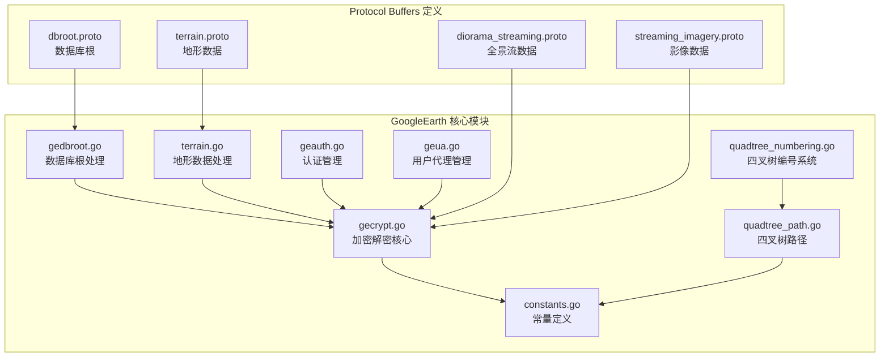
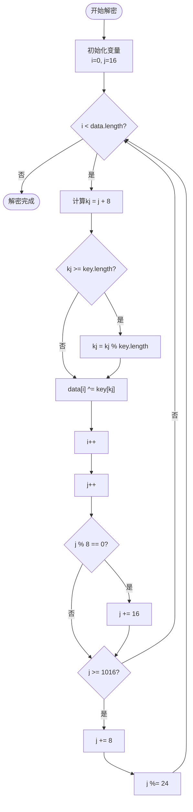
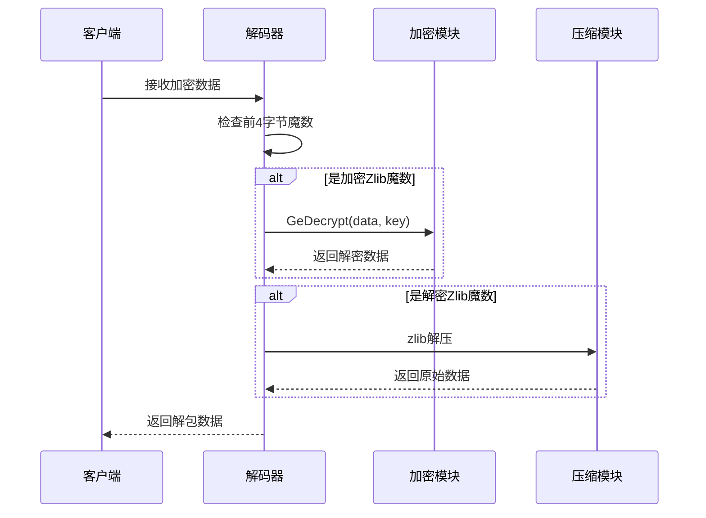
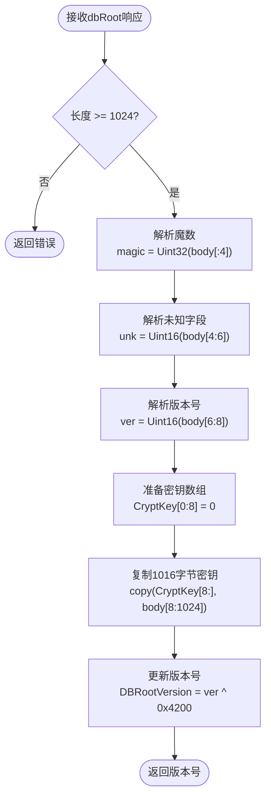
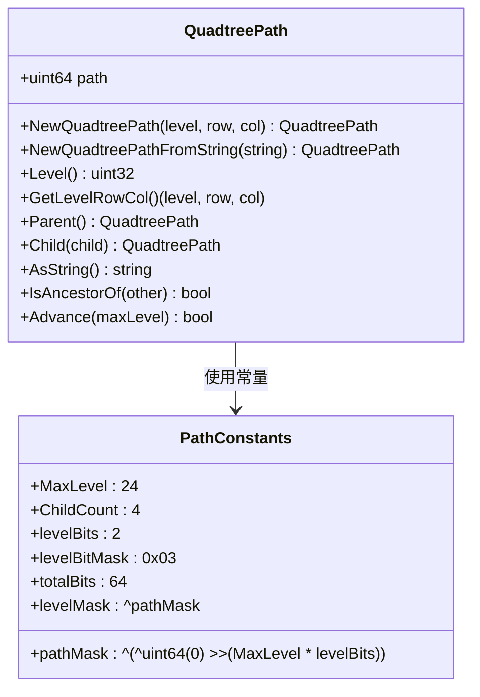
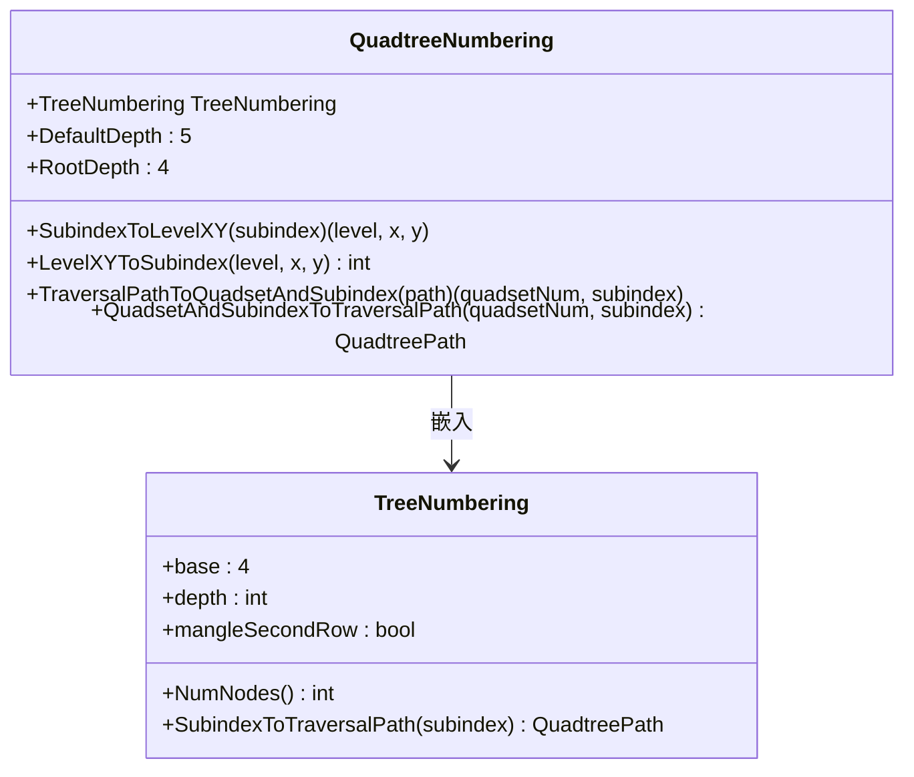
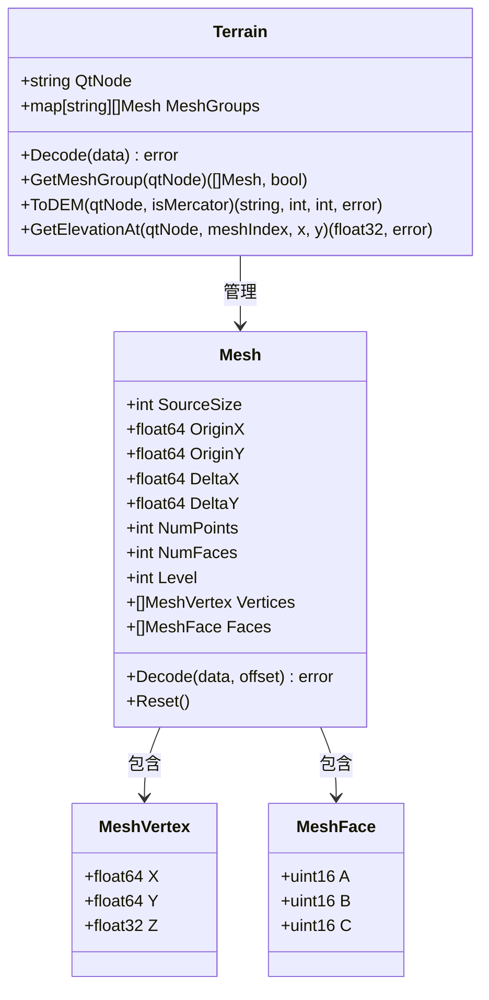
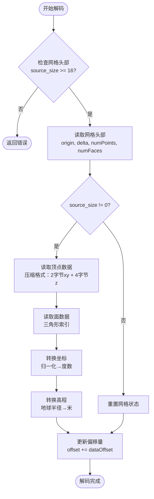
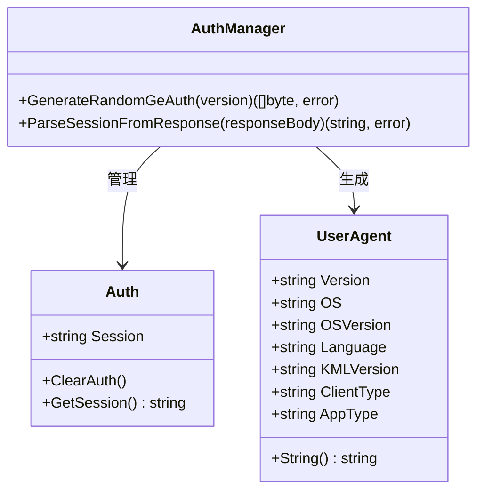
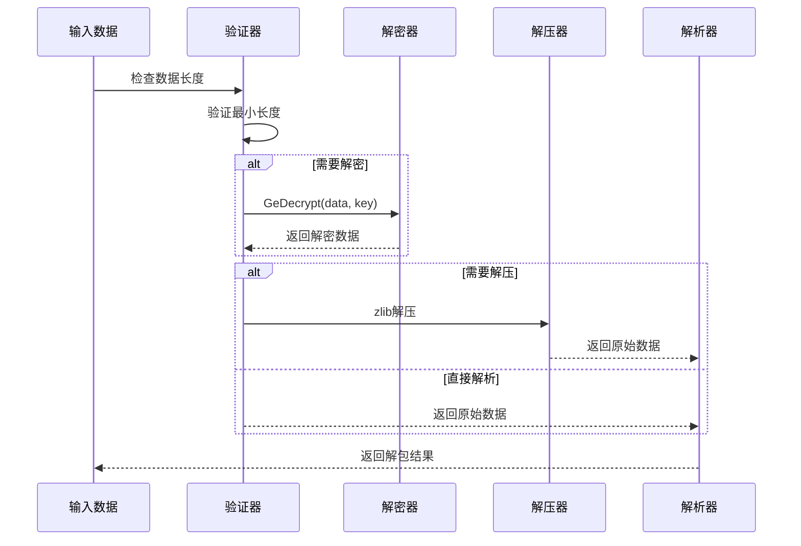

# Google Earth 加密解密技术文档

<cite>
**本文档引用的文件**
- [gecrypt.go](file://GoogleEarth/gecrypt.go)
- [constants.go](file://GoogleEarth/constants.go)
- [gedbroot.go](file://GoogleEarth/gedbroot.go)
- [quadtree_path.go](file://GoogleEarth/quadtree_path.go)
- [terrain.go](file://GoogleEarth/terrain.go)
- [README.md](file://GoogleEarth/README.md)
- [diorama_streaming.proto](file://GoogleEarth/proto/diorama_streaming.proto)
- [streaming_imagery.proto](file://GoogleEarth/proto/streaming_imagery.proto)
- [terrain.proto](file://GoogleEarth/proto/terrain.proto)
- [dbroot.proto](file://GoogleEarth/proto/dbroot.proto)
- [geauth.go](file://GoogleEarth/geauth.go)
- [geua.go](file://GoogleEarth/geua.go)
- [quadtree_numbering.go](file://GoogleEarth/quadtree_numbering.go)
</cite>

## 更新摘要
**所做更改**
- 更新了项目结构图，反映了当前存在的Google Earth相关模块
- 新增了认证管理和用户代理相关章节
- 更新了四叉树编号系统的说明
- 完善了Protocol Buffers协议支持的描述
- 修正了部分过时的技术细节

## 目录
1. [简介](#简介)
2. [项目结构](#项目结构)
3. [核心加密算法](#核心加密算法)
4. [数据格式与魔数](#数据格式与魔数)
5. [数据库根密钥管理](#数据库根密钥管理)
6. [四叉树路径处理](#四叉树路径处理)
7. [四叉树编号系统](#四叉树编号系统)
8. [地形数据处理](#地形数据处理)
9. [认证与用户代理管理](#认证与用户代理管理)
10. [Protocol Buffers 协议](#protocol-buffers-协议)
11. [解包与解压流程](#解包与解压流程)
12. [性能考虑](#性能考虑)
13. [故障排除指南](#故障排除指南)
14. [总结](#总结)

## 简介

Google Earth 加密解密系统是一个完整的地理信息系统处理库，负责处理来自Google Earth服务器的各种加密数据。该系统实现了完整的数据解密、解包和解析功能，支持多种数据格式，包括地形数据、影像数据、全景数据和认证管理。

本系统的核心功能包括：
- XOR异或加密算法的完整实现
- Zlib压缩数据的解压处理
- Google Earth特有的数据格式解析
- 四叉树空间索引的路径管理
- Protocol Buffers序列化/反序列化
- 用户认证和会话管理
- 多平台用户代理生成

## 项目结构

```mermaid
graph TB
subgraph "GoogleEarth 核心模块"
A[gecrypt.go<br/>加密解密核心]
B[constants.go<br/>常量定义]
C[gedbroot.go<br/>数据库根处理]
D[quadtree_path.go<br/>四叉树路径]
E[terrain.go<br/>地形数据处理]
F[geauth.go<br/>认证管理]
G[geua.go<br/>用户代理管理]
H[quadtree_numbering.go<br/>四叉树编号系统]
end
subgraph "Protocol Buffers 定义"
I[diorama_streaming.proto<br/>全景流数据]
J[streaming_imagery.proto<br/>影像数据]
K[terrain.proto<br/>地形数据]
L[dbroot.proto<br/>数据库根]
end
A --> B
C --> A
D --> B
E --> A
F --> A
G --> A
H --> D
I --> A
J --> A
K --> E
L --> C
```

**图表来源**
- [gecrypt.go:1-182](file://GoogleEarth/gecrypt.go#L1-L182)
- [constants.go:1-67](file://GoogleEarth/constants.go#L1-L67)
- [gedbroot.go:1-380](file://GoogleEarth/gedbroot.go#L1-L380)
- [quadtree_path.go:1-270](file://GoogleEarth/quadtree_path.go#L1-L270)
- [terrain.go:1-352](file://GoogleEarth/terrain.go#L1-L352)
- [geauth.go:1-116](file://GoogleEarth/geauth.go#L1-L116)
- [geua.go:1-283](file://GoogleEarth/geua.go#L1-L283)
- [quadtree_numbering.go:1-204](file://GoogleEarth/quadtree_numbering.go#L1-L204)

**章节来源**
- [README.md:1-145](file://GoogleEarth/README.md#L1-L145)

## 核心加密算法

### XOR异或解密算法

系统实现了Google Earth特有的XOR加密算法，该算法具有独特的密钥索引跳转逻辑：

```mermaid
flowchart TD
Start([开始解密]) --> InitVars["初始化变量<br/>i=0, j=16"]
InitVars --> LoopCheck{"i < data.length?"}
LoopCheck --> |否| End([解密完成])
LoopCheck --> |是| CalcKJ["计算kj = j + 8"]
CalcKJ --> CheckKJ{"kj >= key.length?"}
CheckKJ --> |是| ModKJ["kj = kj % key.length"]
CheckKJ --> |否| UseKey["data[i] ^= key[kj]"]
ModKJ --> UseKey
UseKey --> IncI["i++"]
IncI --> IncJ["j++"]
IncJ --> CheckJMod{"j % 8 == 0?"}
CheckJMod --> |是| Add16["j += 16"]
CheckJMod --> |否| CheckJ1016{"j >= 1016?"}
Add16 --> CheckJ1016
CheckJ1016 --> |是| Add8["j += 8"]
CheckJ1016 --> |否| LoopCheck
Add8 --> Mod24["j %= 24"]
Mod24 --> LoopCheck
```

**图表来源**
- [gecrypt.go:16-39](file://GoogleEarth/gecrypt.go#L16-L39)

### 解密函数实现

系统提供了三种解密函数：

1. **GeDecrypt函数**：标准的XOR解密实现
2. **geDecrypt函数**：内部私有包装函数，保持向后兼容
3. **decryptXOR函数**：优化的解密算法，支持指定偏移和长度

这三种实现都遵循相同的算法逻辑，但decryptXOR提供了更灵活的接口。

**章节来源**
- [gecrypt.go:13-182](file://GoogleEarth/gecrypt.go#L13-L182)

## 数据格式与魔数

### 魔法数字常量

系统定义了多个重要的魔法数字，用于识别不同类型的加密数据：

| 魔法数字 | 十六进制值 | 用途 |
|---------|-----------|------|
| CRYPTED_JPEG_MAGIC | 0xA6EF9107 | 加密JPEG图像 |
| CRYPTED_MODEL_DATA_MAGIC | 0x487B | 加密模型数据 |
| CRYPTED_ZLIB_MAGIC | 0x32789755 | 加密Zlib数据 |
| DECRYPTED_MODEL_DATA_MAGIC | 0x0183 | 解密后模型数据 |
| DECRYPTED_ZLIB_MAGIC | 0x7468DEAD | 解密后Zlib数据 |

### 数据包处理流程

```mermaid
sequenceDiagram
participant Client as 客户端
participant Decoder as 解码器
participant Crypto as 加密模块
participant Compress as 压缩模块
Client->>Decoder : 接收加密数据
Decoder->>Decoder : 检查前4字节魔数
alt 是加密Zlib魔数
Decoder->>Crypto : GeDecrypt(data, key)
Crypto-->>Decoder : 返回解密数据
end
alt 是解密Zlib魔数
Decoder->>Compress : zlib解压
Compress-->>Decoder : 返回原始数据
end
Decoder-->>Client : 返回解包数据
```

**图表来源**
- [gecrypt.go:50-86](file://GoogleEarth/gecrypt.go#L50-L86)

**章节来源**
- [constants.go:12-19](file://GoogleEarth/constants.go#L12-L19)

## 数据库根密钥管理

### dbRoot数据解析

系统实现了完整的dbRoot.v5数据解析功能，能够从服务器响应中提取动态密钥：

```mermaid
flowchart TD
Start([接收dbRoot响应]) --> CheckLength{"长度 >= 1024?"}
CheckLength --> |否| Error([返回错误])
CheckLength --> |是| ParseMagic["解析魔数<br/>magic = Uint32(body[:4])"]
ParseMagic --> ParseUnknown["解析未知字段<br/>unk = Uint16(body[4:6])"]
ParseUnknown --> ParseVersion["解析版本号<br/>ver = Uint16(body[6:8])"]
ParseVersion --> PrepareKey["准备密钥数组<br/>CryptKey[0:8] = 0"]
PrepareKey --> CopyKey["复制1016字节密钥<br/>copy(CryptKey[8:], body[8:1024])"]
CopyKey --> UpdateVersion["更新版本号<br/>DBRootVersion = ver ^ 0x4200"]
UpdateVersion --> Return([返回版本号])
```

**图表来源**
- [gedbroot.go:46-68](file://GoogleEarth/gedbroot.go#L46-L68)

### 密钥更新机制

系统支持动态密钥更新，当接收到新的dbRoot响应时：
1. 验证响应长度
2. 解析版本号并应用异或操作
3. 更新全局CryptKey数组
4. 设置DBRootVersion全局变量

**章节来源**
- [gedbroot.go:46-68](file://GoogleEarth/gedbroot.go#L46-L68)

## 四叉树路径处理

### 路径编码与解码

四叉树路径系统使用64位整数进行高效压缩存储：

```mermaid
classDiagram
class QuadtreePath {
+uint64 path
+NewQuadtreePath(level, row, col) QuadtreePath
+NewQuadtreePathFromString(string) QuadtreePath
+Level() uint32
+GetLevelRowCol() (level, row, col)
+Parent() QuadtreePath
+Child(child) QuadtreePath
+AsString() string
+IsAncestorOf(other) bool
+Advance(maxLevel) bool
}
class PathConstants {
+MaxLevel : 24
+ChildCount : 4
+levelBits : 2
+levelBitMask : 0x03
+totalBits : 64
+pathMask : ^(^uint64(0) >> (MaxLevel * levelBits))
+levelMask : ^pathMask
}
QuadtreePath --> PathConstants : 使用常量
```

**图表来源**
- [quadtree_path.go:13-25](file://GoogleEarth/quadtree_path.go#L13-L25)

### 路径操作方法

系统提供了丰富的路径操作功能：

| 方法 | 功能 | 时间复杂度 |
|------|------|-----------|
| NewQuadtreePath() | 从层级行列创建路径 | O(n) |
| NewQuadtreePathFromString() | 从字符串创建路径 | O(n) |
| Level() | 获取路径层级 | O(1) |
| GetLevelRowCol() | 获取层级行列坐标 | O(n) |
| Parent() | 获取父路径 | O(1) |
| Child() | 获取子路径 | O(1) |
| AsString() | 转换为字符串表示 | O(n) |
| IsAncestorOf() | 判断祖先关系 | O(1) |

**章节来源**
- [quadtree_path.go:27-270](file://GoogleEarth/quadtree_path.go#L27-L270)

## 四叉树编号系统

### 编号系统概述

Google Earth实现了独特的四叉树编号系统，支持多种编号模式：

```mermaid
classDiagram
class QuadtreeNumbering {
+TreeNumbering TreeNumbering
+DefaultDepth : 5
+RootDepth : 4
+SubindexToLevelXY(subindex) (level, x, y)
+LevelXYToSubindex(level, x, y) int
+TraversalPathToQuadsetAndSubindex(path) (quadsetNum, subindex)
+QuadsetAndSubindexToTraversalPath(quadsetNum, subindex) QuadtreePath
}
class TreeNumbering {
+base : 4
+depth : int
+mangleSecondRow : bool
+NumNodes() int
+SubindexToTraversalPath(subindex) QuadtreePath
}
QuadtreeNumbering --> TreeNumbering : 嵌入
```

**图表来源**
- [quadtree_numbering.go:5-34](file://GoogleEarth/quadtree_numbering.go#L5-L34)

### Quadset分割机制

系统实现了智能的quadset分割策略：
- 根quadset：深度4，包含层级0-3
- 默认quadset：每4层为一个单元，深度5
- 特殊第二行排序：在某些情况下对第二行进行特殊排序

**章节来源**
- [quadtree_numbering.go:29-204](file://GoogleEarth/quadtree_numbering.go#L29-L204)

## 地形数据处理

### 网格数据结构

地形处理模块实现了完整的网格数据解析：

```mermaid
classDiagram
class MeshVertex {
+float64 X
+float64 Y
+float32 Z
}
class MeshFace {
+uint16 A
+uint16 B
+uint16 C
}
class Mesh {
+int SourceSize
+float64 OriginX
+float64 OriginY
+float64 DeltaX
+float64 DeltaY
+int NumPoints
+int NumFaces
+int Level
+[]MeshVertex Vertices
+[]MeshFace Faces
+Decode(data, offset) error
+Reset()
}
class Terrain {
+string QtNode
+map[string][]Mesh MeshGroups
+Decode(data) error
+GetMeshGroup(qtNode) ([]Mesh, bool)
+ToDEM(qtNode, isMercator) (string, int, int, error)
+GetElevationAt(qtNode, meshIndex, x, y) (float32, error)
}
Mesh --> MeshVertex : 包含
Mesh --> MeshFace : 包含
Terrain --> Mesh : 管理
```

**图表来源**
- [terrain.go:30-54](file://GoogleEarth/terrain.go#L30-L54)

### 地形数据解码流程

```mermaid
flowchart TD
Start([开始解码]) --> CheckHeader{"检查网格头部<br/>source_size >= 16?"}
CheckHeader --> |否| Error([返回错误])
CheckHeader --> |是| ReadHeader["读取网格头部<br/>origin, delta, numPoints, numFaces"]
ReadHeader --> CheckSize{"source_size != 0?"}
CheckSize --> |否| Reset["重置网格状态"]
CheckSize --> |是| ReadVertices["读取顶点数据<br/>压缩格式：2字节xy + 4字节z"]
ReadVertices --> ReadFaces["读取面数据<br/>三角形索引"]
ReadFaces --> ConvertCoords["转换坐标<br/>归一化→度数"]
ConvertCoords --> ConvertElev["转换高程<br/>地球半径→米"]
ConvertElev --> UpdateOffset["更新偏移量<br/>offset += dataOffset"]
Reset --> UpdateOffset
UpdateOffset --> End([解码完成])
```

**图表来源**
- [terrain.go:70-143](file://GoogleEarth/terrain.go#L70-L143)

**章节来源**
- [terrain.go:145-352](file://GoogleEarth/terrain.go#L145-L352)

## 认证与用户代理管理

### 认证管理系统

系统提供了完整的Google Earth认证管理功能：

```mermaid
classDiagram
class Auth {
+string Session
+ClearAuth()
+GetSession() string
}
class UserAgent {
+string Version
+string OS
+string OSVersion
+string Language
+string KMLVersion
+string ClientType
+string AppType
+String() string
}
class AuthManager {
+GenerateRandomGeAuth(version) ([]byte, error)
+ParseSessionFromResponse(responseBody) (string, error)
}
AuthManager --> Auth : 管理
AuthManager --> UserAgent : 生成
```

**图表来源**
- [geauth.go:8-45](file://GoogleEarth/geauth.go#L8-L45)
- [geua.go:9-141](file://GoogleEarth/geua.go#L9-L141)

### 用户代理生成

系统支持多平台用户代理生成，包括：
- Windows平台：支持Windows 7-11的不同版本
- macOS平台：支持多个版本的Mac OS X
- Linux平台：支持Ubuntu、CentOS、Debian等主流发行版

**章节来源**
- [geauth.go:1-116](file://GoogleEarth/geauth.go#L1-L116)
- [geua.go:1-283](file://GoogleEarth/geua.go#L1-L283)

## Protocol Buffers 协议

### 支持的数据格式

系统支持多种Google Earth特有的Protocol Buffers格式：

| 协议文件 | 主要用途 | 数据类型 |
|---------|---------|---------|
| diorama_streaming.proto | 全景流数据 | DioramaMetadata, DioramaDataPacket |
| streaming_imagery.proto | 影像数据 | EarthImageryPacket |
| terrain.proto | 地形数据 | WaterSurfaceTileProto, TerrainPacketExtraDataProto |
| dbroot.proto | 数据库根配置 | DbRootProto, EncryptedDbRootProto |

### 关键消息类型

#### 全景数据包 (DioramaDataPacket)
- 支持多种编解码器：JPEG、PNG、DXT、JP2
- 包含纹理坐标和高度信息
- 支持LOD层次细节

#### 影像数据包 (EarthImageryPacket)
- 支持多种图像格式：JPEG、JPEG2000、DXT1/5、PNG
- 支持独立Alpha通道
- 包含纹理子窗口信息

**章节来源**
- [diorama_streaming.proto:1-113](file://GoogleEarth/proto/diorama_streaming.proto#L1-L113)
- [streaming_imagery.proto:1-31](file://GoogleEarth/proto/streaming_imagery.proto#L1-L31)
- [terrain.proto:1-43](file://GoogleEarth/proto/terrain.proto#L1-L43)
- [dbroot.proto](file://GoogleEarth/proto/dbroot.proto)

## 解包与解压流程

### 完整解包流程

```mermaid
sequenceDiagram
participant Input as 输入数据
participant Validator as 验证器
participant Decryptor as 解密器
participant Decompressor as 解压器
participant Parser as 解析器
Input->>Validator : 检查数据长度
Validator->>Validator : 验证最小长度
alt 需要解密
Validator->>Decryptor : GeDecrypt(data, key)
Decryptor-->>Validator : 返回解密数据
end
alt 需要解压
Validator->>Decompressor : zlib解压
Decompressor-->>Parser : 返回原始数据
else 直接解析
Validator-->>Parser : 返回原始数据
end
Parser-->>Input : 返回解包结果
```

**图表来源**
- [gecrypt.go:50-86](file://GoogleEarth/gecrypt.go#L50-L86)

### 错误处理机制

系统实现了完善的错误处理：
- 输入验证：检查数据长度和完整性
- 解密验证：确认解密后的魔数正确性
- 解压验证：确保Zlib解压成功
- 数据验证：检查解析后的数据结构有效性

**章节来源**
- [gecrypt.go:50-86](file://GoogleEarth/gecrypt.go#L50-L86)

## 性能考虑

### 内存优化策略

1. **零拷贝设计**：尽可能使用原地修改，减少内存分配
2. **缓冲区复用**：重用临时缓冲区，避免频繁分配
3. **流式处理**：支持大数据的流式解包和解析

### 算法优化

1. **位运算优化**：使用位运算替代乘除法
2. **循环展开**：在关键路径上进行循环展开
3. **分支预测优化**：减少条件分支的使用

### 并发处理

虽然当前实现是单线程的，但架构设计支持并发处理：
- 独立的解密和解压模块
- 无状态的解析函数
- 可并行的数据处理

## 故障排除指南

### 常见问题及解决方案

#### 解密失败
**症状**：GeDecrypt函数返回空结果
**原因**：输入数据为空或密钥无效
**解决**：检查输入数据长度和密钥设置

#### 解包错误
**症状**：UnpackGEZlib返回错误
**原因**：数据损坏或魔数不匹配
**解决**：验证数据完整性和魔数

#### 地形数据解析失败
**症状**：地形数据无法正常解析
**原因**：网格数据格式异常
**解决**：检查网格头部和数据结构

### 调试技巧

1. **启用详细日志**：添加中间结果输出
2. **数据验证**：在关键步骤验证数据完整性
3. **单元测试**：使用已知的测试数据验证功能

**章节来源**
- [gecrypt.go:16-39](file://GoogleEarth/gecrypt.go#L16-L39)
- [gedbroot.go:46-68](file://GoogleEarth/gedbroot.go#L46-L68)

## 总结

Google Earth 加密解密系统是一个功能完整、设计精良的地理信息系统处理库。它成功实现了：

1. **完整的加密解密功能**：支持Google Earth特有的XOR加密算法
2. **多样化数据格式处理**：支持地形、影像、全景等多种数据类型
3. **高效的四叉树路径管理**：提供完整的空间索引功能
4. **标准化的Protocol Buffers支持**：符合Google Earth的数据规范
5. **健壮的错误处理机制**：确保系统的稳定性
6. **认证和用户代理管理**：提供完整的客户端模拟功能

该系统为Google Earth客户端提供了可靠的数据处理能力，是整个地理信息系统的重要基础设施。其模块化的设计和清晰的接口使得系统易于维护和扩展，为未来的功能增强奠定了良好的基础。

**更新** 本版本文档反映了当前代码库中仍然存在的Google Earth相关功能，包括加密解密、数据解析、认证管理等核心模块。文档内容已更新以准确反映这些功能的当前状态和实现细节。