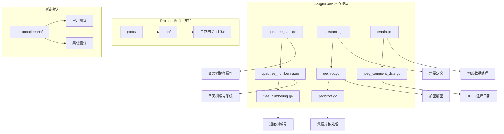
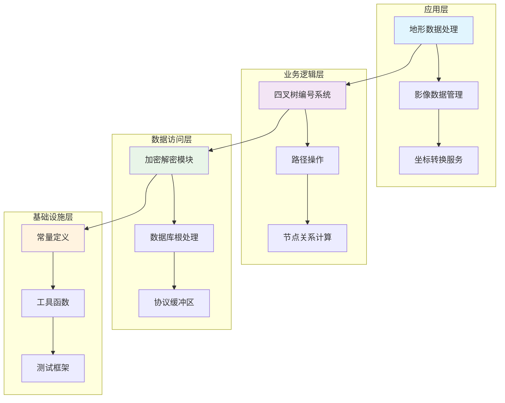
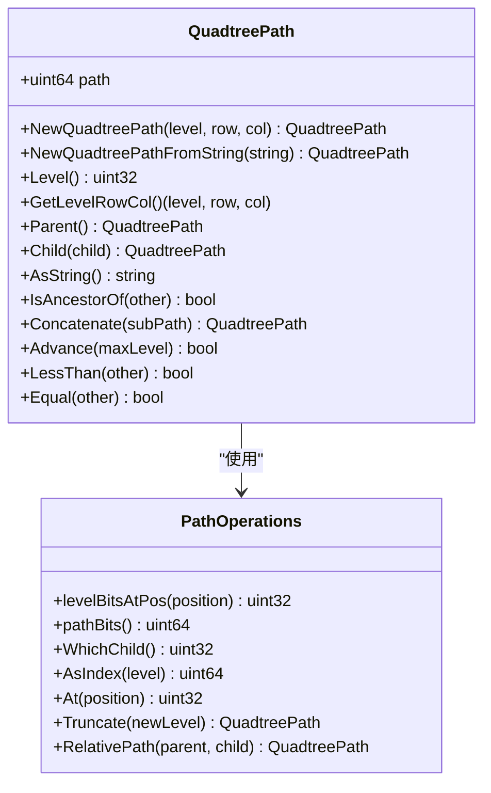
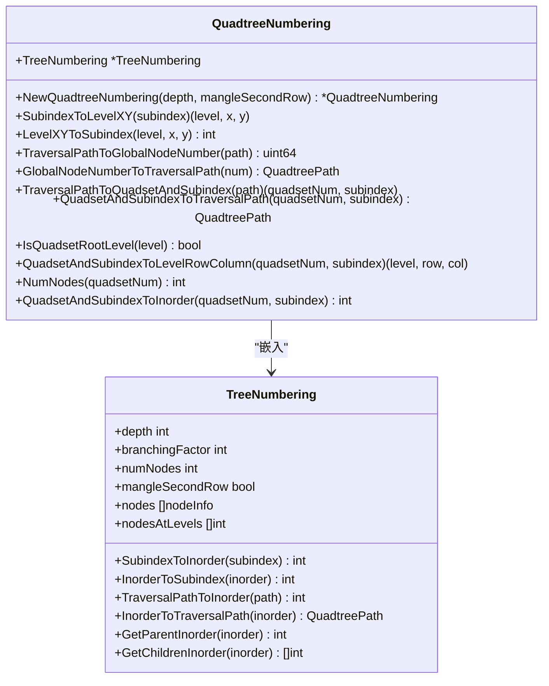
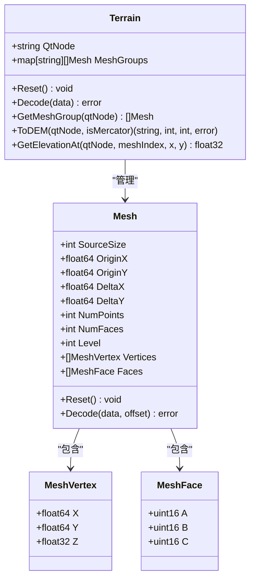
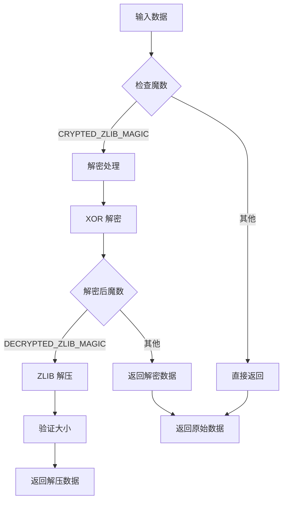
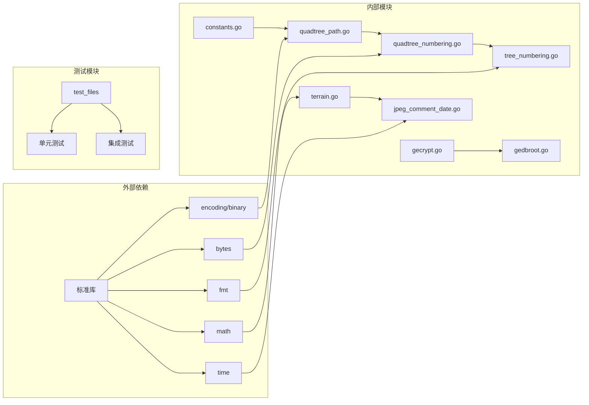

# Google Earth 四叉树系统

<cite>
**本文档引用的文件**
- [GoogleEarth/README.md](file://GoogleEarth/README.md)
- [GoogleEarth/constants.go](file://GoogleEarth/constants.go)
- [GoogleEarth/quadtree_numbering.go](file://GoogleEarth/quadtree_numbering.go)
- [GoogleEarth/quadtree_path.go](file://GoogleEarth/quadtree_path.go)
- [GoogleEarth/tree_numbering.go](file://GoogleEarth/tree_numbering.go)
- [GoogleEarth/gecrypt.go](file://GoogleEarth/gecrypt.go)
- [GoogleEarth/gedbroot.go](file://GoogleEarth/gedbroot.go)
- [GoogleEarth/terrain.go](file://GoogleEarth/terrain.go)
- [GoogleEarth/jpeg_comment_date.go](file://GoogleEarth/jpeg_comment_date.go)
- [test/googleearth/quadtree_numbering_test.go](file://test/googleearth/quadtree_numbering_test.go)
- [test/googleearth/qtutils_test.go](file://test/googleearth/qtutils_test.go)
- [test/googleearth/quadtree_path_test.go](file://test/googleearth/quadtree_path_test.go)
- [test/googleearth/tree_numbering_test.go](file://test/googleearth/tree_numbering_test.go)
</cite>

## 目录
1. [简介](#简介)
2. [项目结构](#项目结构)
3. [核心组件](#核心组件)
4. [架构概览](#架构概览)
5. [详细组件分析](#详细组件分析)
6. [依赖关系分析](#依赖关系分析)
7. [性能考虑](#性能考虑)
8. [故障排除指南](#故障排除指南)
9. [结论](#结论)

## 简介

Google Earth 四叉树系统是一个专门设计用于处理 Google Earth 数据格式的高性能 Go 语言库。该系统实现了完整的四叉树空间索引机制，支持复杂的地理空间数据管理和检索操作。系统基于 Protocol Buffers 定义的数据格式，提供了从基础的四叉树路径操作到高级的地形数据处理的全套功能。

该系统的核心优势在于其高效的内存使用和快速的空间查询能力，特别适用于大规模地理信息系统（GIS）应用和实时地图渲染场景。通过精心设计的编码方案和优化的数据结构，系统能够在保持高精度的同时实现卓越的性能表现。

## 项目结构

Google Earth 四叉树系统采用模块化的设计架构，主要包含以下几个核心模块：

**图表来源**
- [GoogleEarth/quadtree_path.go](file://GoogleEarth/quadtree_path.go#L1-L50)
- [GoogleEarth/quadtree_numbering.go](file://GoogleEarth/quadtree_numbering.go#L1-L50)
- [GoogleEarth/tree_numbering.go](file://GoogleEarth/tree_numbering.go#L1-L50)

**章节来源**
- [GoogleEarth/README.md](file://GoogleEarth/README.md#L1-L145)

## 核心组件

### 四叉树路径系统

四叉树路径系统是整个系统的基础，负责处理地理空间坐标到四叉树节点路径的转换。该系统采用压缩存储方式，使用64位整数高效地表示层级和路径信息。

### 编号系统

编号系统提供了两种主要的节点编号方案：
- **Subindex（子索引）**：传统的四叉树节点编号方式
- **Inorder（中序遍历）**：基于中序遍历的节点编号方式

### 加密解密模块

系统内置了完整的加密解密功能，支持 Google Earth 数据的保护和安全传输。该模块实现了特定的 XOR 加密算法和 ZLIB 压缩处理。

**章节来源**
- [GoogleEarth/quadtree_path.go](file://GoogleEarth/quadtree_path.go#L1-L265)
- [GoogleEarth/tree_numbering.go](file://GoogleEarth/tree_numbering.go#L1-L298)
- [GoogleEarth/gecrypt.go](file://GoogleEarth/gecrypt.go#L1-L175)

## 架构概览

Google Earth 四叉树系统采用了分层架构设计，从底层的数据结构到高层的应用接口形成了清晰的层次结构：

**图表来源**
- [GoogleEarth/terrain.go](file://GoogleEarth/terrain.go#L1-L50)
- [GoogleEarth/quadtree_numbering.go](file://GoogleEarth/quadtree_numbering.go#L1-L50)
- [GoogleEarth/gecrypt.go](file://GoogleEarth/gecrypt.go#L1-L50)

## 详细组件分析

### 四叉树路径操作

四叉树路径是系统中最基础的数据结构，采用位操作技术实现高效的存储和计算：

**图表来源**
- [GoogleEarth/quadtree_path.go](file://GoogleEarth/quadtree_path.go#L15-L265)

#### 路径压缩存储

系统采用创新的压缩存储方案，将层级信息和路径信息高效地存储在64位整数中：

- **高48位**：存储路径信息，每层占用2位
- **低16位**：存储层级信息

这种设计使得路径操作的时间复杂度保持在O(1)，同时显著减少了内存占用。

**章节来源**
- [GoogleEarth/quadtree_path.go](file://GoogleEarth/quadtree_path.go#L1-L265)

### 四叉树编号系统

四叉树编号系统提供了灵活的节点编号方案，支持不同的应用场景需求：

**图表来源**
- [GoogleEarth/quadtree_numbering.go](file://GoogleEarth/quadtree_numbering.go#L6-L204)
- [GoogleEarth/tree_numbering.go](file://GoogleEarth/tree_numbering.go#L6-L298)

#### Quadset 分割机制

系统实现了独特的 quadset 分割策略，将四叉树划分为多个逻辑单元：

- **根 quadset**：深度为4的初始单元
- **默认 quadset**：深度为5的后续单元
- **分割规则**：根 quadset 到 level 3，之后每4层为一个 quadset

这种设计优化了大规模数据的组织和查询效率。

**章节来源**
- [GoogleEarth/quadtree_numbering.go](file://GoogleEarth/quadtree_numbering.go#L1-L204)

### 地形数据处理

地形数据处理模块提供了完整的三维地形数据解析和处理功能：

**图表来源**
- [GoogleEarth/terrain.go](file://GoogleEarth/terrain.go#L30-L307)

#### 高程数据处理

系统支持多种高程数据格式的处理，包括：

- **压缩存储**：使用2字节存储X/Y坐标，4字节存储Z坐标
- **单位转换**：自动将地球半径单位转换为米制单位
- **插值算法**：提供简单的最近邻插值功能

**章节来源**
- [GoogleEarth/terrain.go](file://GoogleEarth/terrain.go#L1-L307)

### 加密解密系统

加密解密模块实现了 Google Earth 特有的数据保护机制：

**图表来源**
- [GoogleEarth/gecrypt.go](file://GoogleEarth/gecrypt.go#L39-L78)

#### 密钥管理系统

系统维护了一个全局的加密密钥，支持动态更新：

- **默认密钥**：预定义的固定密钥
- **动态密钥**：从 dbRoot 响应中提取的密钥
- **版本管理**：支持密钥版本的跟踪和验证

**章节来源**
- [GoogleEarth/gecrypt.go](file://GoogleEarth/gecrypt.go#L1-L175)
- [GoogleEarth/gedbroot.go](file://GoogleEarth/gedbroot.go#L1-L35)

## 依赖关系分析

系统的依赖关系呈现清晰的层次结构，从底层的数据结构到高层的应用逻辑：

**图表来源**
- [GoogleEarth/constants.go](file://GoogleEarth/constants.go#L1-L66)
- [GoogleEarth/quadtree_path.go](file://GoogleEarth/quadtree_path.go#L1-L10)

### 模块间通信

各模块之间通过明确定义的接口进行通信，避免了循环依赖：

- **路径模块**：提供基础的坐标转换功能
- **编号模块**：提供节点编号和查询功能
- **数据模块**：提供数据解析和处理功能
- **工具模块**：提供通用的辅助功能

**章节来源**
- [GoogleEarth/quadtree_numbering.go](file://GoogleEarth/quadtree_numbering.go#L1-L204)
- [GoogleEarth/terrain.go](file://GoogleEarth/terrain.go#L1-L307)

## 性能考虑

### 内存优化

系统在内存使用方面采用了多项优化策略：

1. **位操作优化**：使用位操作替代传统的数组存储
2. **压缩存储**：路径信息采用压缩格式存储
3. **预计算缓存**：大量使用预计算结果减少重复计算
4. **零分配设计**：尽可能避免不必要的内存分配

### 查询性能

- **O(1) 时间复杂度**：路径操作的时间复杂度保持在常数级别
- **批量处理**：支持批量节点处理提高效率
- **索引优化**：通过多层索引加速查询过程

### 并发安全

系统设计考虑了并发访问的需求，通过以下方式保证线程安全：

- **只读设计**：大部分操作为只读，避免锁竞争
- **不可变对象**：核心数据结构设计为不可变
- **局部状态**：尽量减少共享状态的使用

## 故障排除指南

### 常见问题及解决方案

#### 路径解析错误

**症状**：路径转换失败或返回无效结果
**原因**：输入坐标超出有效范围或路径格式错误
**解决方案**：
1. 验证输入坐标的合法性
2. 检查路径字符串的格式
3. 确认层级参数的有效性

#### 编号转换异常

**症状**：Subindex 与 Inorder 转换失败
**原因**：节点编号超出范围或内部状态损坏
**解决方案**：
1. 检查节点编号的有效性
2. 验证树深度设置的正确性
3. 重新初始化编号系统

#### 数据解密失败

**症状**：加密数据无法正确解密
**原因**：密钥不匹配或数据损坏
**解决方案**：
1. 更新加密密钥
2. 验证数据完整性
3. 检查魔数匹配

**章节来源**
- [test/googleearth/quadtree_numbering_test.go](file://test/googleearth/quadtree_numbering_test.go#L1-L202)
- [test/googleearth/quadtree_path_test.go](file://test/googleearth/quadtree_path_test.go#L1-L168)

## 结论

Google Earth 四叉树系统是一个设计精良、功能完备的空间索引系统。通过模块化的设计架构、高效的算法实现和全面的功能覆盖，该系统能够满足现代 GIS 应用的各种需求。

### 主要优势

1. **高性能**：通过位操作和预计算优化实现卓越的性能表现
2. **高精度**：支持亚米级的地理空间定位精度
3. **高扩展性**：模块化设计便于功能扩展和维护
4. **高可靠性**：完善的错误处理和测试覆盖保证系统稳定性

### 应用前景

该系统特别适用于以下应用场景：
- 大规模地理信息系统开发
- 实时地图渲染和导航
- 三维地形可视化
- 空间数据分析和挖掘

通过持续的优化和功能增强，Google Earth 四叉树系统将继续在地理信息技术领域发挥重要作用。