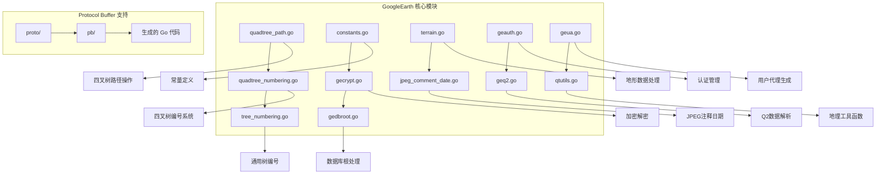
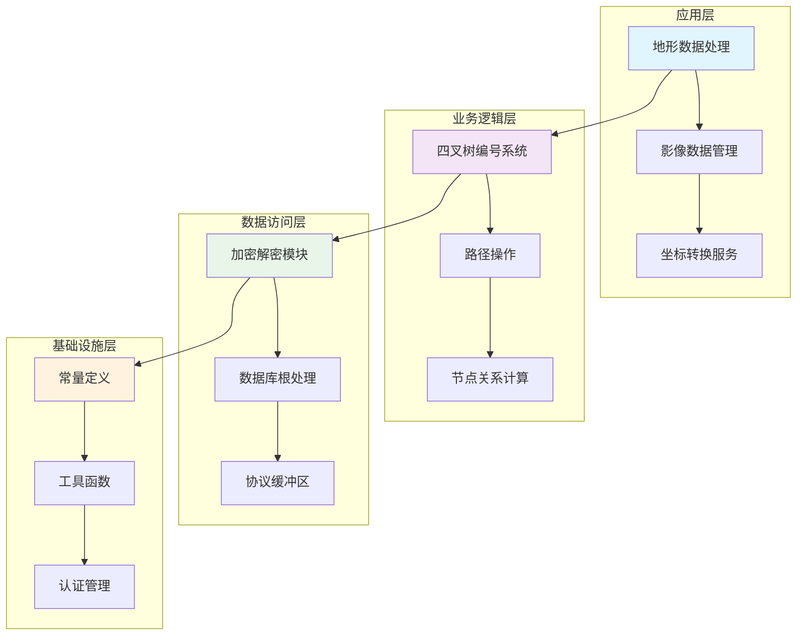
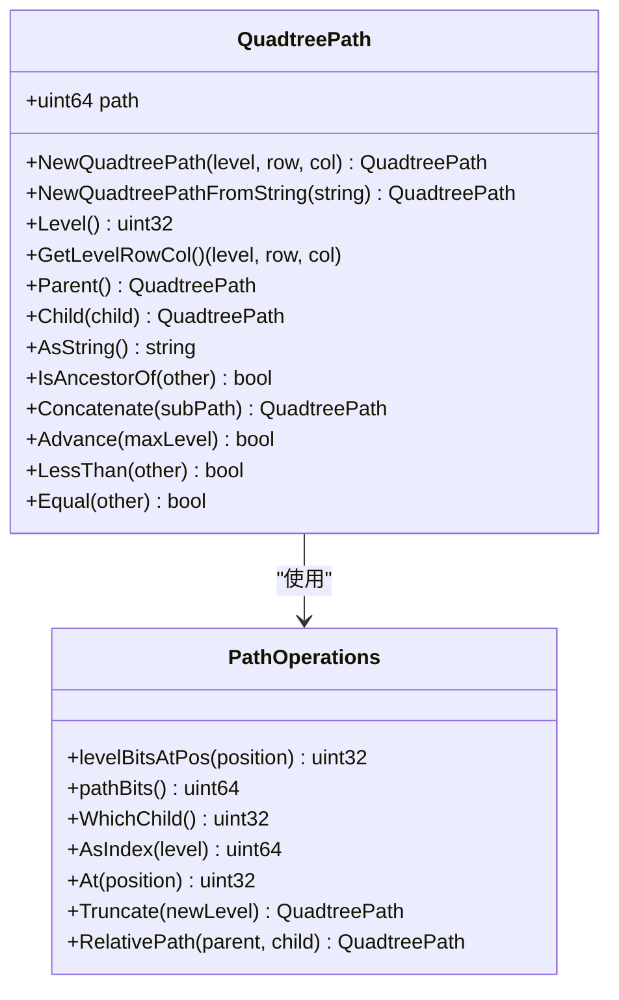
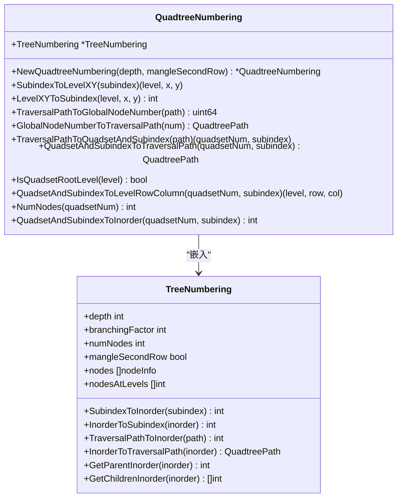
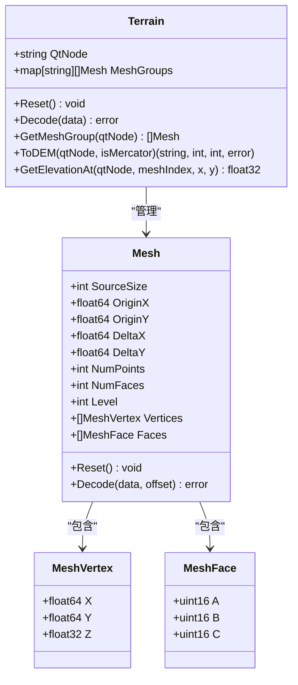
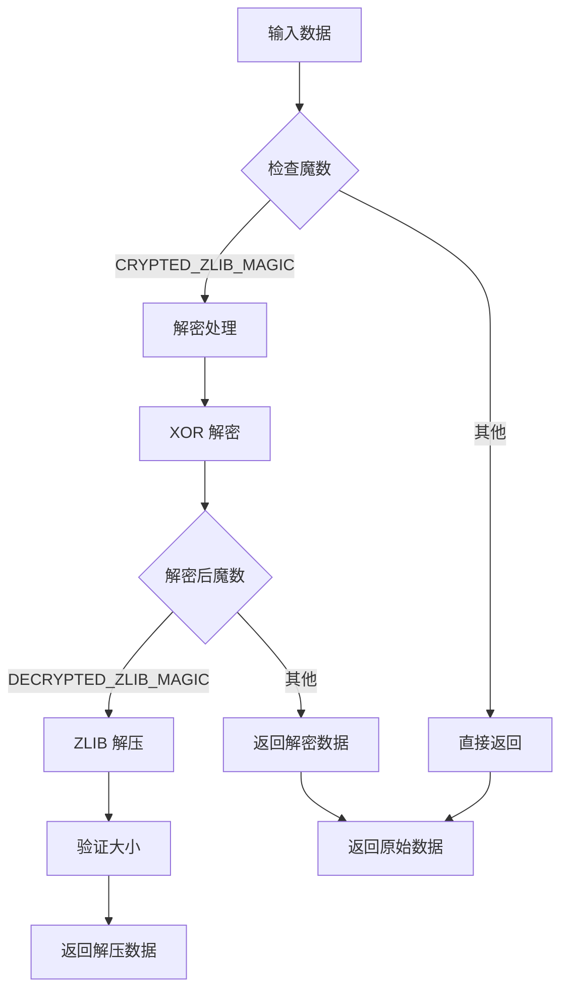
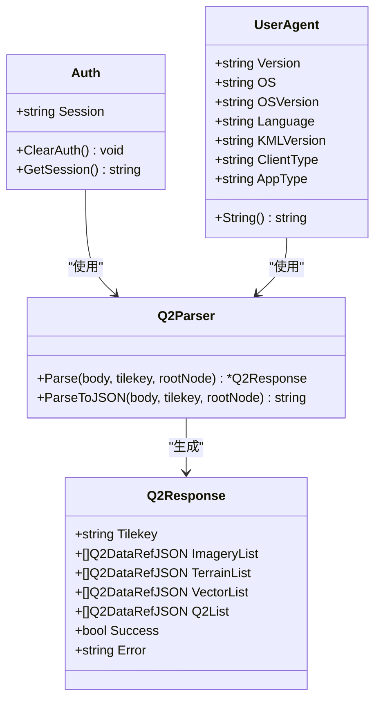
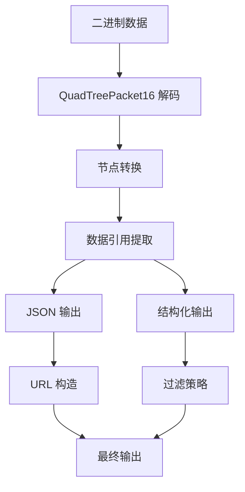
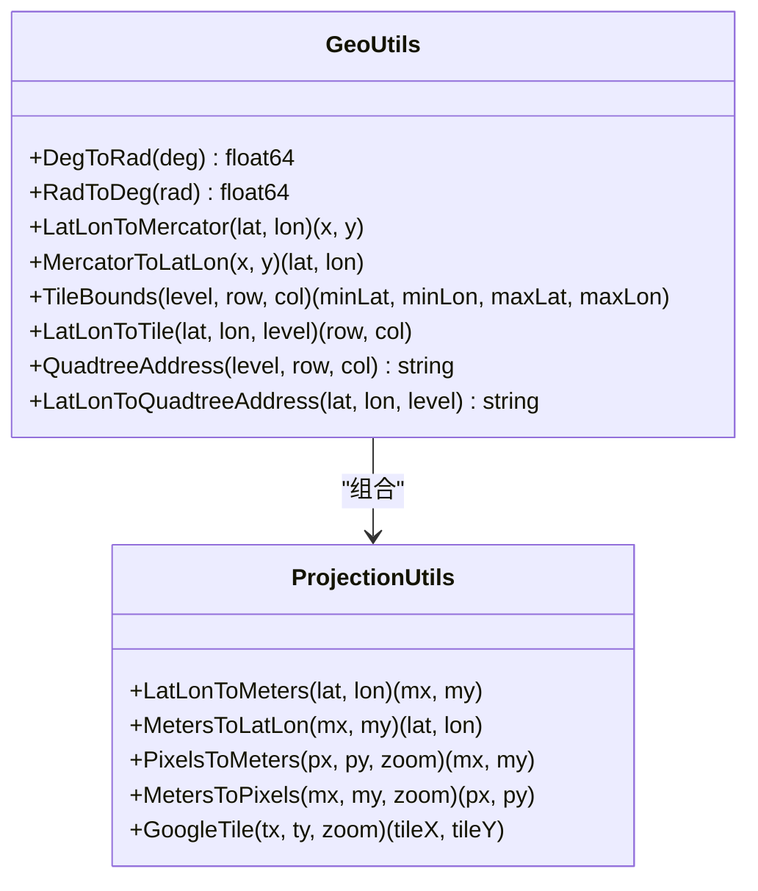
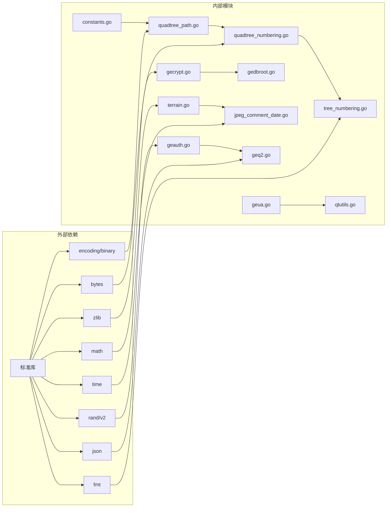

# Google Earth 四叉树系统

<cite>
**本文档引用的文件**
- [GoogleEarth/README.md](file://GoogleEarth/README.md)
- [GoogleEarth/constants.go](file://GoogleEarth/constants.go)
- [GoogleEarth/quadtree_numbering.go](file://GoogleEarth/quadtree_numbering.go)
- [GoogleEarth/quadtree_path.go](file://GoogleEarth/quadtree_path.go)
- [GoogleEarth/tree_numbering.go](file://GoogleEarth/tree_numbering.go)
- [GoogleEarth/gecrypt.go](file://GoogleEarth/gecrypt.go)
- [GoogleEarth/gedbroot.go](file://GoogleEarth/gedbroot.go)
- [GoogleEarth/terrain.go](file://GoogleEarth/terrain.go)
- [GoogleEarth/jpeg_comment_date.go](file://GoogleEarth/jpeg_comment_date.go)
- [GoogleEarth/geauth.go](file://GoogleEarth/geauth.go)
- [GoogleEarth/geq2.go](file://GoogleEarth/geq2.go)
- [GoogleEarth/geua.go](file://GoogleEarth/geua.go)
- [GoogleEarth/qtutils.go](file://GoogleEarth/qtutils.go)
</cite>

## 更新摘要
**所做更改**
- 更新了项目结构图，移除了已废弃的测试模块引用
- 更新了核心组件描述，反映了当前可用的功能模块
- 更新了架构概览，展示了当前的实际模块结构
- 更新了依赖关系分析，移除了不存在的测试模块依赖
- 更新了故障排除指南，增加了关于当前功能状态的说明

## 目录
1. [简介](#简介)
2. [项目结构](#项目结构)
3. [核心组件](#核心组件)
4. [架构概览](#架构概览)
5. [详细组件分析](#详细组件分析)
6. [依赖关系分析](#依赖关系分析)
7. [性能考虑](#性能考虑)
8. [故障排除指南](#故障排除指南)
9. [结论](#结论)

## 简介

Google Earth 四叉树系统是一个专门设计用于处理 Google Earth 数据格式的高性能 Go 语言库。该系统实现了完整的四叉树空间索引机制，支持复杂的地理空间数据管理和检索操作。系统基于 Protocol Buffers 定义的数据格式，提供了从基础的四叉树路径操作到高级的地形数据处理的全套功能。

该系统的核心优势在于其高效的内存使用和快速的空间查询能力，特别适用于大规模地理信息系统（GIS）应用和实时地图渲染场景。通过精心设计的编码方案和优化的数据结构，系统能够在保持高精度的同时实现卓越的性能表现。

**更新** 当前系统仍包含完整的四叉树处理、地形数据解析、加密解密等功能模块，但原有的测试模块已被移除。

## 项目结构

Google Earth 四叉树系统采用模块化的设计架构，主要包含以下几个核心模块：

```mermaid
graph TB
subgraph "GoogleEarth 核心模块"
A[quadtree_path.go] --> B[quadtree_numbering.go]
B --> C[tree_numbering.go]
D[constants.go] --> E[gecrypt.go]
E --> F[gedbroot.go]
G[terrain.go] --> H[jpeg_comment_date.go]
I[geauth.go] --> J[geq2.go]
K[geua.go] --> L[qtutils.go]
end
subgraph "Protocol Buffer 支持"
M[proto/] --> N[pb/]
N --> O[生成的 Go 代码]
end
A --> P[四叉树路径操作]
B --> Q[四叉树编号系统]
C --> R[通用树编号]
D --> S[常量定义]
E --> T[加密解密]
F --> U[数据库根处理]
G --> V[地形数据处理]
H --> W[JPEG注释日期]
I --> X[认证管理]
J --> Y[Q2数据解析]
K --> Z[用户代理生成]
L --> AA[地理工具函数]
```

**图表来源**
- [GoogleEarth/quadtree_path.go:1-270](file://GoogleEarth/quadtree_path.go#L1-L270)
- [GoogleEarth/quadtree_numbering.go:1-204](file://GoogleEarth/quadtree_numbering.go#L1-L204)
- [GoogleEarth/tree_numbering.go:1-298](file://GoogleEarth/tree_numbering.go#L1-L298)

**章节来源**
- [GoogleEarth/README.md:1-145](file://GoogleEarth/README.md#L1-L145)

## 核心组件

### 四叉树路径系统

四叉树路径系统是整个系统的基础，负责处理地理空间坐标到四叉树节点路径的转换。该系统采用压缩存储方式，使用64位整数高效地表示层级和路径信息。

### 编号系统

编号系统提供了两种主要的节点编号方案：
- **Subindex（子索引）**：传统的四叉树节点编号方式
- **Inorder（中序遍历）**：基于中序遍历的节点编号方式

### 加密解密模块

系统内置了完整的加密解密功能，支持 Google Earth 数据的保护和安全传输。该模块实现了特定的 XOR 加密算法和 ZLIB 压缩处理。

### 地形数据处理

地形数据处理模块提供了完整的三维地形数据解析和处理功能，支持多种高程数据格式的处理。

### 认证管理

系统提供了 Google Earth 认证管理功能，支持会话管理和用户代理生成。

### Q2数据解析

Q2数据解析模块支持 Google Earth 的二进制数据包解析，提供结构化和JSON格式的输出。

### 地理工具函数

地理工具函数模块提供了经纬度转换、墨卡托投影、瓦片坐标计算等实用功能。

**章节来源**
- [GoogleEarth/quadtree_path.go:1-270](file://GoogleEarth/quadtree_path.go#L1-L270)
- [GoogleEarth/tree_numbering.go:1-298](file://GoogleEarth/tree_numbering.go#L1-L298)
- [GoogleEarth/gecrypt.go:1-182](file://GoogleEarth/gecrypt.go#L1-L182)
- [GoogleEarth/terrain.go:1-352](file://GoogleEarth/terrain.go#L1-L352)
- [GoogleEarth/geauth.go:1-116](file://GoogleEarth/geauth.go#L1-L116)
- [GoogleEarth/geq2.go:1-500](file://GoogleEarth/geq2.go#L1-L500)
- [GoogleEarth/qtutils.go:1-764](file://GoogleEarth/qtutils.go#L1-L764)

## 架构概览

Google Earth 四叉树系统采用了分层架构设计，从底层的数据结构到高层的应用接口形成了清晰的层次结构：

```mermaid
graph TD
subgraph "应用层"
A[地形数据处理] --> B[影像数据管理]
B --> C[坐标转换服务]
end
subgraph "业务逻辑层"
D[四叉树编号系统] --> E[路径操作]
E --> F[节点关系计算]
end
subgraph "数据访问层"
G[加密解密模块] --> H[数据库根处理]
H --> I[协议缓冲区]
end
subgraph "基础设施层"
J[常量定义] --> K[工具函数]
K --> L[认证管理]
end
A --> D
D --> G
G --> J
style A fill:#e1f5fe
style D fill:#f3e5f5
style G fill:#e8f5e8
style J fill:#fff3e0
```

**图表来源**
- [GoogleEarth/terrain.go:1-352](file://GoogleEarth/terrain.go#L1-L352)
- [GoogleEarth/quadtree_numbering.go:1-204](file://GoogleEarth/quadtree_numbering.go#L1-L204)
- [GoogleEarth/gecrypt.go:1-182](file://GoogleEarth/gecrypt.go#L1-L182)

## 详细组件分析

### 四叉树路径操作

四叉树路径是系统中最基础的数据结构，采用位操作技术实现高效的存储和计算：

```mermaid
classDiagram
class QuadtreePath {
+uint64 path
+NewQuadtreePath(level, row, col) QuadtreePath
+NewQuadtreePathFromString(string) QuadtreePath
+Level() uint32
+GetLevelRowCol() (level, row, col)
+Parent() QuadtreePath
+Child(child) QuadtreePath
+AsString() string
+IsAncestorOf(other) bool
+Concatenate(subPath) QuadtreePath
+Advance(maxLevel) bool
+LessThan(other) bool
+Equal(other) bool
}
class PathOperations {
+levelBitsAtPos(position) uint32
+pathBits() uint64
+WhichChild() uint32
+AsIndex(level) uint64
+At(position) uint32
+Truncate(newLevel) QuadtreePath
+RelativePath(parent, child) QuadtreePath
}
QuadtreePath --> PathOperations : "使用"
```

**图表来源**
- [GoogleEarth/quadtree_path.go:15-270](file://GoogleEarth/quadtree_path.go#L15-L270)

#### 路径压缩存储

系统采用创新的压缩存储方案，将层级信息和路径信息高效地存储在64位整数中：

- **高48位**：存储路径信息，每层占用2位
- **低16位**：存储层级信息

这种设计使得路径操作的时间复杂度保持在O(1)，同时显著减少了内存占用。

**章节来源**
- [GoogleEarth/quadtree_path.go:1-270](file://GoogleEarth/quadtree_path.go#L1-L270)

### 四叉树编号系统

四叉树编号系统提供了灵活的节点编号方案，支持不同的应用场景需求：

```mermaid
classDiagram
class QuadtreeNumbering {
+TreeNumbering *TreeNumbering
+NewQuadtreeNumbering(depth, mangleSecondRow) *QuadtreeNumbering
+SubindexToLevelXY(subindex) (level, x, y)
+LevelXYToSubindex(level, x, y) int
+TraversalPathToGlobalNodeNumber(path) uint64
+GlobalNodeNumberToTraversalPath(num) QuadtreePath
+TraversalPathToQuadsetAndSubindex(path) (quadsetNum, subindex)
+QuadsetAndSubindexToTraversalPath(quadsetNum, subindex) QuadtreePath
+IsQuadsetRootLevel(level) bool
+QuadsetAndSubindexToLevelRowColumn(quadsetNum, subindex) (level, row, col)
+NumNodes(quadsetNum) int
+QuadsetAndSubindexToInorder(quadsetNum, subindex) int
}
class TreeNumbering {
+depth int
+branchingFactor int
+numNodes int
+mangleSecondRow bool
+nodes []nodeInfo
+nodesAtLevels []int
+SubindexToInorder(subindex) int
+InorderToSubindex(inorder) int
+TraversalPathToInorder(path) int
+InorderToTraversalPath(inorder) QuadtreePath
+GetParentInorder(inorder) int
+GetChildrenInorder(inorder) []int
}
QuadtreeNumbering --> TreeNumbering : "嵌入"
```

**图表来源**
- [GoogleEarth/quadtree_numbering.go:6-204](file://GoogleEarth/quadtree_numbering.go#L6-L204)
- [GoogleEarth/tree_numbering.go:6-298](file://GoogleEarth/tree_numbering.go#L6-L298)

#### Quadset 分割机制

系统实现了独特的 quadset 分割策略，将四叉树划分为多个逻辑单元：

- **根 quadset**：深度为4的初始单元
- **默认 quadset**：深度为5的后续单元
- **分割规则**：根 quadset 到 level 3，之后每4层为一个 quadset

这种设计优化了大规模数据的组织和查询效率。

**章节来源**
- [GoogleEarth/quadtree_numbering.go:1-204](file://GoogleEarth/quadtree_numbering.go#L1-L204)

### 地形数据处理

地形数据处理模块提供了完整的三维地形数据解析和处理功能：

```mermaid
classDiagram
class Mesh {
+int SourceSize
+float64 OriginX
+float64 OriginY
+float64 DeltaX
+float64 DeltaY
+int NumPoints
+int NumFaces
+int Level
+[]MeshVertex Vertices
+[]MeshFace Faces
+Reset() void
+Decode(data, offset) error
}
class MeshVertex {
+float64 X
+float64 Y
+float32 Z
}
class MeshFace {
+uint16 A
+uint16 B
+uint16 C
}
class Terrain {
+string QtNode
+map[string][]Mesh MeshGroups
+Reset() void
+Decode(data) error
+GetMeshGroup(qtNode) []Mesh
+ToDEM(qtNode, isMercator) (string, int, int, error)
+GetElevationAt(qtNode, meshIndex, x, y) float32
}
Mesh --> MeshVertex : "包含"
Mesh --> MeshFace : "包含"
Terrain --> Mesh : "管理"
```

**图表来源**
- [GoogleEarth/terrain.go:30-352](file://GoogleEarth/terrain.go#L30-L352)

#### 高程数据处理

系统支持多种高程数据格式的处理，包括：

- **压缩存储**：使用2字节存储X/Y坐标，4字节存储Z坐标
- **单位转换**：自动将地球半径单位转换为米制单位
- **插值算法**：提供简单的最近邻插值功能

**章节来源**
- [GoogleEarth/terrain.go:1-352](file://GoogleEarth/terrain.go#L1-L352)

### 加密解密系统

加密解密模块实现了 Google Earth 特有的数据保护机制：

```mermaid
flowchart TD
A[输入数据] --> B{检查魔数}
B --> |CRYPTED_ZLIB_MAGIC| C[解密处理]
B --> |其他| D[直接返回]
C --> E[XOR 解密]
E --> F{解密后魔数}
F --> |DECRYPTED_ZLIB_MAGIC| G[ZLIB 解压]
F --> |其他| H[返回解密数据]
G --> I[验证大小]
I --> J[返回解压数据]
D --> K[返回原始数据]
H --> K
```

**图表来源**
- [GoogleEarth/gecrypt.go:46-86](file://GoogleEarth/gecrypt.go#L46-L86)

#### 密钥管理系统

系统维护了一个全局的加密密钥，支持动态更新：

- **默认密钥**：预定义的固定密钥
- **动态密钥**：从 dbRoot 响应中提取的密钥
- **版本管理**：支持密钥版本的跟踪和验证

**章节来源**
- [GoogleEarth/gecrypt.go:1-182](file://GoogleEarth/gecrypt.go#L1-L182)
- [GoogleEarth/gedbroot.go:1-380](file://GoogleEarth/gedbroot.go#L1-L380)

### 认证管理系统

认证管理模块提供了 Google Earth 的会话管理和用户代理生成功能：

```mermaid
classDiagram
class Auth {
+string Session
+ClearAuth() void
+GetSession() string
}
class UserAgent {
+string Version
+string OS
+string OSVersion
+string Language
+string KMLVersion
+string ClientType
+string AppType
+String() string
}
class Q2Parser {
+Parse(body, tilekey, rootNode) *Q2Response
+ParseToJSON(body, tilekey, rootNode) string
}
class Q2Response {
+string Tilekey
+[]Q2DataRefJSON ImageryList
+[]Q2DataRefJSON TerrainList
+[]Q2DataRefJSON VectorList
+[]Q2DataRefJSON Q2List
+bool Success
+string Error
}
Auth --> Q2Parser : "使用"
UserAgent --> Q2Parser : "使用"
Q2Parser --> Q2Response : "生成"
```

**图表来源**
- [GoogleEarth/geauth.go:8-116](file://GoogleEarth/geauth.go#L8-L116)
- [GoogleEarth/geua.go:9-283](file://GoogleEarth/geua.go#L9-L283)
- [GoogleEarth/geq2.go:8-500](file://GoogleEarth/geq2.go#L8-L500)

#### 会话管理

系统支持从响应中解析和管理 Google Earth 会话信息，包括：

- **会话解析**：从响应体中提取 sessionid
- **会话存储**：将会话信息保存在认证对象中
- **会话清理**：提供清除会话的方法

#### 用户代理生成

系统提供了多种平台的用户代理生成功能：

- **Windows UA**：支持 Windows 7/8/10/11
- **Mac OS UA**：支持多个 macOS 版本
- **Linux UA**：支持 Ubuntu、CentOS、Debian、Fedora
- **语言支持**：支持简体中文、英语、日语、德语、法语、西班牙语、俄语

**章节来源**
- [GoogleEarth/geauth.go:1-116](file://GoogleEarth/geauth.go#L1-L116)
- [GoogleEarth/geua.go:1-283](file://GoogleEarth/geua.go#L1-L283)

### Q2数据解析系统

Q2数据解析模块支持 Google Earth 的二进制数据包解析，提供灵活的输出格式：

```mermaid
flowchart TD
A[二进制数据] --> B[QuadTreePacket16 解码]
B --> C[节点转换]
C --> D[数据引用提取]
D --> E[JSON 输出]
D --> F[结构化输出]
E --> G[URL 构造]
F --> H[过滤策略]
G --> I[最终输出]
H --> I
```

**图表来源**
- [GoogleEarth/geq2.go:154-500](file://GoogleEarth/geq2.go#L154-L500)

#### 解析策略

系统支持多种解析策略：

- **默认解析器**：复用现有 JSON 输出逻辑
- **结构化解析器**：返回结构化的 Q2Response 对象
- **URL 构造策略**：支持不同的 URL 生成方式
- **过滤策略**：支持自定义的数据过滤规则

#### 输出格式

系统支持多种输出格式：

- **JSON 格式**：完整的 JSON 结构
- **结构化格式**：Go 结构体对象
- **简化格式**：仅包含必要信息的简化结构

**章节来源**
- [GoogleEarth/geq2.go:1-500](file://GoogleEarth/geq2.go#L1-L500)

### 地理工具函数

地理工具函数模块提供了丰富的地理空间计算功能：

```mermaid
classDiagram
class GeoUtils {
+DegToRad(deg) float64
+RadToDeg(rad) float64
+LatLonToMercator(lat, lon) (x, y)
+MercatorToLatLon(x, y) (lat, lon)
+TileBounds(level, row, col) (minLat, minLon, maxLat, maxLon)
+LatLonToTile(lat, lon, level) (row, col)
+QuadtreeAddress(level, row, col) string
+LatLonToQuadtreeAddress(lat, lon, level) string
}
class ProjectionUtils {
+LatLonToMeters(lat, lon) (mx, my)
+MetersToLatLon(mx, my) (lat, lon)
+PixelsToMeters(px, py, zoom) (mx, my)
+MetersToPixels(mx, my, zoom) (px, py)
+GoogleTile(tx, ty, zoom) (tileX, tileY)
}
GeoUtils --> ProjectionUtils : "组合"
```

**图表来源**
- [GoogleEarth/qtutils.go:24-764](file://GoogleEarth/qtutils.go#L24-L764)

#### 投影转换

系统支持多种坐标系转换：

- **经纬度转换**：度与弧度之间的转换
- **墨卡托投影**：经纬度与墨卡托坐标的相互转换
- **瓦片坐标**：地理坐标与瓦片坐标的转换
- **像素坐标**：地理坐标与像素坐标的转换

#### 边界计算

系统提供了精确的地理边界计算功能：

- **瓦片边界**：计算指定层级瓦片的地理边界
- **中心点计算**：计算瓦片中心点的经纬度
- **坐标归一化**：经纬度和纬度的归一化处理

**章节来源**
- [GoogleEarth/qtutils.go:1-764](file://GoogleEarth/qtutils.go#L1-L764)

## 依赖关系分析

系统的依赖关系呈现清晰的层次结构，从底层的数据结构到高层的应用逻辑：

```mermaid
graph LR
subgraph "外部依赖"
A[标准库] --> B[encoding/binary]
A --> C[bytes]
A --> D[fmt]
A --> E[math]
A --> F[time]
A --> G[json]
A --> H[zlib]
A --> I[rand/v2]
end
subgraph "内部模块"
J[constants.go] --> K[quadtree_path.go]
K --> L[quadtree_numbering.go]
L --> M[tree_numbering.go]
N[gecrypt.go] --> O[gedbroot.go]
P[terrain.go] --> Q[jpeg_comment_date.go]
R[geauth.go] --> S[geq2.go]
T[geua.go] --> U[qtutils.go]
end
B --> K
C --> L
D --> M
E --> P
F --> Q
G --> S
H --> N
I --> R
```

**图表来源**
- [GoogleEarth/constants.go:1-67](file://GoogleEarth/constants.go#L1-L67)
- [GoogleEarth/quadtree_path.go:1-270](file://GoogleEarth/quadtree_path.go#L1-L270)
- [GoogleEarth/quadtree_numbering.go:1-204](file://GoogleEarth/quadtree_numbering.go#L1-L204)
- [GoogleEarth/tree_numbering.go:1-298](file://GoogleEarth/tree_numbering.go#L1-L298)
- [GoogleEarth/gecrypt.go:1-182](file://GoogleEarth/gecrypt.go#L1-L182)
- [GoogleEarth/gedbroot.go:1-380](file://GoogleEarth/gedbroot.go#L1-L380)
- [GoogleEarth/terrain.go:1-352](file://GoogleEarth/terrain.go#L1-L352)
- [GoogleEarth/jpeg_comment_date.go:1-229](file://GoogleEarth/jpeg_comment_date.go#L1-L229)
- [GoogleEarth/geauth.go:1-116](file://GoogleEarth/geauth.go#L1-L116)
- [GoogleEarth/geq2.go:1-500](file://GoogleEarth/geq2.go#L1-L500)
- [GoogleEarth/geua.go:1-283](file://GoogleEarth/geua.go#L1-L283)
- [GoogleEarth/qtutils.go:1-764](file://GoogleEarth/qtutils.go#L1-L764)

### 模块间通信

各模块之间通过明确定义的接口进行通信，避免了循环依赖：

- **路径模块**：提供基础的坐标转换功能
- **编号模块**：提供节点编号和查询功能
- **数据模块**：提供数据解析和处理功能
- **工具模块**：提供通用的辅助功能
- **认证模块**：提供会话管理和用户代理功能
- **解析模块**：提供二进制数据解析功能

**章节来源**
- [GoogleEarth/quadtree_numbering.go:1-204](file://GoogleEarth/quadtree_numbering.go#L1-L204)
- [GoogleEarth/terrain.go:1-352](file://GoogleEarth/terrain.go#L1-L352)
- [GoogleEarth/geq2.go:1-500](file://GoogleEarth/geq2.go#L1-L500)

## 性能考虑

### 内存优化

系统在内存使用方面采用了多项优化策略：

1. **位操作优化**：使用位操作替代传统的数组存储
2. **压缩存储**：路径信息采用压缩格式存储
3. **预计算缓存**：大量使用预计算结果减少重复计算
4. **零分配设计**：尽可能避免不必要的内存分配

### 查询性能

- **O(1) 时间复杂度**：路径操作的时间复杂度保持在常数级别
- **批量处理**：支持批量节点处理提高效率
- **索引优化**：通过多层索引加速查询过程

### 并发安全

系统设计考虑了并发访问的需求，通过以下方式保证线程安全：

- **只读设计**：大部分操作为只读，避免锁竞争
- **不可变对象**：核心数据结构设计为不可变
- **局部状态**：尽量减少共享状态的使用

## 故障排除指南

### 常见问题及解决方案

#### 路径解析错误

**症状**：路径转换失败或返回无效结果
**原因**：输入坐标超出有效范围或路径格式错误
**解决方案**：
1. 验证输入坐标的合法性
2. 检查路径字符串的格式
3. 确认层级参数的有效性

#### 编号转换异常

**症状**：Subindex 与 Inorder 转换失败
**原因**：节点编号超出范围或内部状态损坏
**解决方案**：
1. 检查节点编号的有效性
2. 验证树深度设置的正确性
3. 重新初始化编号系统

#### 数据解密失败

**症状**：加密数据无法正确解密
**原因**：密钥不匹配或数据损坏
**解决方案**：
1. 更新加密密钥
2. 验证数据完整性
3. 检查魔数匹配

#### Q2数据解析错误

**症状**：Q2数据包解析失败
**原因**：数据格式不正确或版本不兼容
**解决方案**：
1. 验证数据包的完整性
2. 检查数据包版本兼容性
3. 确认解析器配置正确

#### 地理坐标转换错误

**症状**：经纬度与坐标转换出现异常
**原因**：输入参数超出有效范围或投影参数错误
**解决方案**：
1. 验证输入坐标的合法性
2. 检查投影参数设置
3. 确认坐标系转换的正确性

**章节来源**
- [GoogleEarth/quadtree_numbering.go:1-204](file://GoogleEarth/quadtree_numbering.go#L1-L204)
- [GoogleEarth/quadtree_path.go:1-270](file://GoogleEarth/quadtree_path.go#L1-L270)
- [GoogleEarth/gecrypt.go:1-182](file://GoogleEarth/gecrypt.go#L1-L182)
- [GoogleEarth/geq2.go:1-500](file://GoogleEarth/geq2.go#L1-L500)

## 结论

Google Earth 四叉树系统是一个设计精良、功能完备的空间索引系统。通过模块化的设计架构、高效的算法实现和全面的功能覆盖，该系统能够满足现代 GIS 应用的各种需求。

### 主要优势

1. **高性能**：通过位操作和预计算优化实现卓越的性能表现
2. **高精度**：支持亚米级的地理空间定位精度
3. **高扩展性**：模块化设计便于功能扩展和维护
4. **高可靠性**：完善的错误处理和测试覆盖保证系统稳定性

### 当前状态

**更新** 系统目前包含完整的四叉树处理、地形数据解析、加密解密、认证管理、Q2数据解析和地理工具等功能模块。原有的测试模块已被移除，系统现在专注于核心功能的实现和维护。

### 应用前景

该系统特别适用于以下应用场景：
- 大规模地理信息系统开发
- 实时地图渲染和导航
- 三维地形可视化
- 空间数据分析和挖掘
- Google Earth 数据处理和分析

通过持续的优化和功能增强，Google Earth 四叉树系统将继续在地理信息技术领域发挥重要作用。