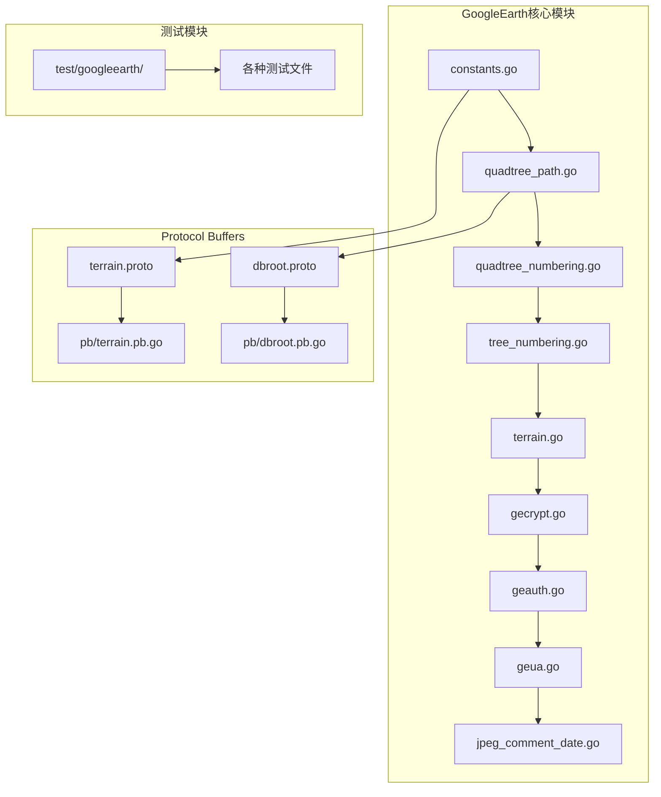
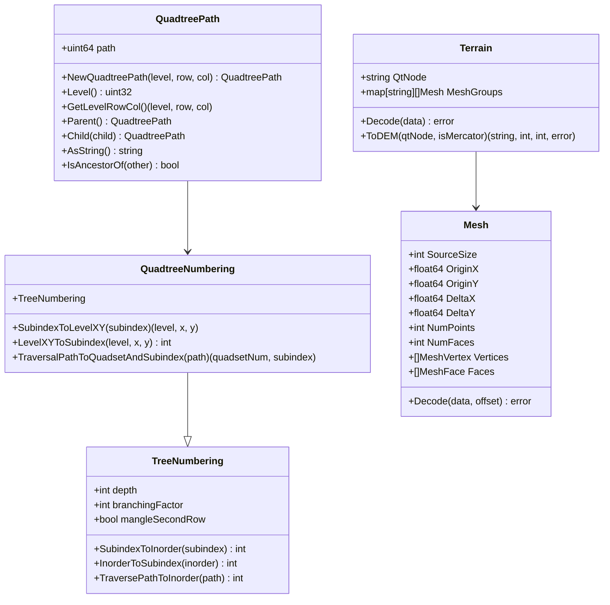
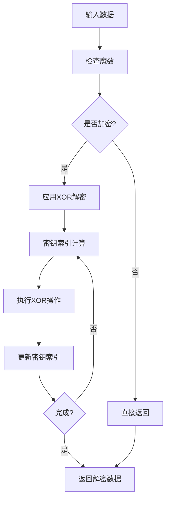

# Google Earth Q2解析器

<cite>
**本文档引用的文件**
- [constants.go](file://GoogleEarth/constants.go)
- [quadtree_path.go](file://GoogleEarth/quadtree_path.go)
- [quadtree_numbering.go](file://GoogleEarth/quadtree_numbering.go)
- [tree_numbering.go](file://GoogleEarth/tree_numbering.go)
- [terrain.go](file://GoogleEarth/terrain.go)
- [gecrypt.go](file://GoogleEarth/gecrypt.go)
- [geauth.go](file://GoogleEarth/geauth.go)
- [geua.go](file://GoogleEarth/geua.go)
- [jpeg_comment_date.go](file://GoogleEarth/jpeg_comment_date.go)
- [geqp.go](file://GoogleEarth/geqp.go)
- [README.md](file://GoogleEarth/README.md)
- [terrain.proto](file://GoogleEarth/proto/terrain.proto)
- [dbroot.proto](file://GoogleEarth/proto/dbroot.proto)
- [geq2_test.go](file://test/googleearth/geq2_test.go)
</cite>

## 目录
1. [项目概述](#项目概述)
2. [项目结构](#项目结构)
3. [核心组件](#核心组件)
4. [架构概览](#架构概览)
5. [详细组件分析](#详细组件分析)
6. [数据结构与协议](#数据结构与协议)
7. [加密与认证](#加密与认证)
8. [性能考虑](#性能考虑)
9. [故障排除指南](#故障排除指南)
10. [结论](#结论)

## 项目概述

Google Earth Q2解析器是一个专门用于解析和处理Google Earth数据格式的Go语言库。该项目实现了对Google Earth特有的Q2数据格式的完整解析能力，支持四叉树数据结构、地形数据、影像数据等多种数据类型的处理。

### 主要功能特性

- **四叉树数据结构解析**：完整实现Google Earth的四叉树编号系统和路径计算
- **地形数据处理**：支持地形网格的解码、插值和DEM格式转换
- **加密数据解密**：提供Google Earth数据的解密算法实现
- **认证管理**：实现Google Earth客户端的认证机制
- **用户代理生成**：生成符合Google Earth规范的User-Agent字符串
- **历史影像支持**：处理历史卫星影像数据的时间戳和日期信息

## 项目结构

**图表来源**
- [constants.go](file://GoogleEarth/constants.go#L1-L67)
- [quadtree_path.go](file://GoogleEarth/quadtree_path.go#L1-L270)
- [terrain.proto](file://GoogleEarth/proto/terrain.proto#L1-L43)

**章节来源**
- [README.md](file://GoogleEarth/README.md#L1-L145)

## 核心组件

### 四叉树路径系统

四叉树路径系统是Google Earth数据结构的核心，负责管理和操作四叉树节点的路径信息。

#### QuadtreePath结构
- **压缩存储**：使用64位整数压缩存储，高48位存储路径，低16位存储层级
- **路径操作**：提供路径创建、查询、转换等基本操作
- **层级管理**：支持最大24级的四叉树层级

#### 编号系统
- **子索引编号**：从树顶到底部的层级编号方案
- **遍历路径**：支持前序遍历和中序遍历的路径转换
- **四叉树分割**：实现quadset分割和子索引映射

**章节来源**
- [quadtree_path.go](file://GoogleEarth/quadtree_path.go#L1-L270)
- [quadtree_numbering.go](file://GoogleEarth/quadtree_numbering.go#L1-L204)

### 地形数据处理

地形数据处理模块提供了完整的地形网格解析和处理能力。

#### Mesh结构
- **顶点信息**：存储经纬度坐标和高程数据
- **面信息**：存储三角形网格的顶点索引
- **坐标转换**：支持墨卡托投影和地理坐标的相互转换

#### 数据解码
- **压缩格式**：支持Google Earth特有的压缩存储格式
- **网格重建**：从压缩数据重建完整的地形网格
- **插值算法**：提供高程插值和DEM格式转换

**章节来源**
- [terrain.go](file://GoogleEarth/terrain.go#L1-L307)

## 架构概览

**图表来源**
- [quadtree_path.go](file://GoogleEarth/quadtree_path.go#L14-L270)
- [tree_numbering.go](file://GoogleEarth/tree_numbering.go#L6-L298)
- [terrain.go](file://GoogleEarth/terrain.go#L30-L307)

## 详细组件分析

### 加密与解密系统

加密系统实现了Google Earth特有的数据加密和解密算法。

#### 解密算法
- **XOR解密**：使用固定密钥进行异或解密
- **密钥轮转**：实现复杂的密钥索引轮转逻辑
- **多种魔数**：支持JPEG、模型数据、ZLIB等多种加密格式

#### 数据格式
- **加密魔数**：识别不同类型的加密数据
- **解密魔数**：验证解密结果的有效性
- **压缩处理**：支持ZLIB压缩数据的解压

**章节来源**
- [gecrypt.go](file://GoogleEarth/gecrypt.go#L1-L182)

### 认证管理系统

认证系统模拟Google Earth客户端的认证过程。

#### 认证流程
1. **连接建立**：从连接池获取热连接
2. **密钥生成**：生成随机认证密钥
3. **HTTP请求**：发送POST请求到/geauth端点
4. **会话提取**：从响应中提取sessionid
5. **会话保存**：将sessionid保存到连接中

#### 密钥管理
- **预定义密钥**：提供多个版本的认证密钥
- **随机选择**：从预定义密钥中随机选择
- **版本控制**：支持不同版本的认证机制

**章节来源**
- [geauth.go](file://GoogleEarth/geauth.go#L1-L200)

### 用户代理生成器

用户代理生成器提供了符合Google Earth规范的User-Agent字符串生成功能。

#### 代理类型
- **Windows代理**：支持多种Windows版本
- **macOS代理**：支持多个macOS版本
- **Linux代理**：支持主流Linux发行版

#### 语言支持
- **多语言环境**：支持简体中文、英语、日语等多种语言
- **地区适配**：根据不同地区生成相应的语言设置
- **偏好转换**：将语言代码转换为Accept-Language格式

**章节来源**
- [geua.go](file://GoogleEarth/geua.go#L1-L283)

### 历史影像日期处理

历史影像日期处理模块专门处理Google Earth历史卫星影像的时间信息。

#### 日期格式
- **整数格式**：YYYYMMDD格式的日期表示
- **字符串解析**：支持多种日期字符串格式
- **时间转换**：支持time.Time和JpegCommentDate之间的转换

#### 日期比较
- **精确比较**：支持完整的年月日比较
- **部分比较**：支持仅比较年份或年月
- **范围判断**：支持日期范围的判断和匹配

**章节来源**
- [jpeg_comment_date.go](file://GoogleEarth/jpeg_comment_date.go#L1-L229)

## 数据结构与协议

### Protocol Buffers定义

项目使用Protocol Buffers定义了多种数据结构，主要包括：

#### 地形协议（terrain.proto）
- **WaterSurfaceTileProto**：水面瓦片协议
- **TerrainPacketExtraDataProto**：地形数据包额外数据协议

#### 数据库根协议（dbroot.proto）
- **PlanetModelProto**：行星模型协议
- **ProviderInfoProto**：提供商信息协议
- **StyleAttributeProto**：样式属性协议
- **LayerProto**：图层协议

**章节来源**
- [terrain.proto](file://GoogleEarth/proto/terrain.proto#L1-L43)
- [dbroot.proto](file://GoogleEarth/proto/dbroot.proto#L1-L200)

### 常量定义

项目定义了大量常量用于标识不同的数据类型和路径：

#### 数据库常量
- **EARTH/MARS/MOON/SKY**：不同的地球数据源
- **CRYPTED_*_MAGIC**：加密数据的魔数
- **DECRYPTED_*_MAGIC**：解密后的魔数

#### 路径常量
- **HOST_NAME/TM_HOST_NAME**：服务器主机名
- **DBROOT_PATH/Q2_PATH**：各种数据路径格式
- **IMAGERY_PATH/Terrain_PATH**：影像和地形数据路径

**章节来源**
- [constants.go](file://GoogleEarth/constants.go#L1-L67)

## 加密与认证

### 解密算法详解

Google Earth的数据加密采用了独特的XOR解密算法：

**图表来源**
- [gecrypt.go](file://GoogleEarth/gecrypt.go#L16-L182)

### 认证机制

Google Earth的认证机制包括以下步骤：

1. **密钥选择**：从三个预定义密钥中随机选择
2. **请求发送**：发送POST请求到/geauth端点
3. **响应解析**：从响应中提取sessionid
4. **会话管理**：将sessionid保存到连接中

**章节来源**
- [geauth.go](file://GoogleEarth/geauth.go#L27-L94)

## 性能考虑

### 内存优化

- **压缩存储**：四叉树路径使用位操作进行压缩存储
- **预计算缓存**：树编号系统预计算转换表以提高性能
- **零分配设计**：尽量减少内存分配和垃圾回收压力

### 算法优化

- **位运算**：大量使用位运算替代乘除运算
- **递归优化**：树遍历算法采用尾递归优化
- **批量处理**：支持批量数据处理以提高吞吐量

### 并发安全

- **无状态设计**：大部分组件设计为无状态，支持并发调用
- **连接池**：使用连接池管理网络连接
- **线程安全**：关键数据结构采用适当的同步机制

## 故障排除指南

### 常见问题

#### 解密失败
- **检查魔数**：确认数据是否为加密格式
- **验证密钥**：确保使用正确的解密密钥
- **数据完整性**：检查数据是否损坏或截断

#### 认证失败
- **网络连接**：确认网络连接正常
- **服务器状态**：检查kh.google.com服务状态
- **请求格式**：验证请求格式是否正确

#### 数据解析错误
- **版本兼容**：确认数据格式版本兼容性
- **数据完整性**：检查数据是否完整
- **编码格式**：确认数据编码格式正确

**章节来源**
- [geq2_test.go](file://test/googleearth/geq2_test.go#L1-L200)

### 调试技巧

- **日志记录**：启用详细的日志记录
- **单元测试**：运行完整的单元测试套件
- **数据验证**：使用已知的测试数据验证功能

## 结论

Google Earth Q2解析器是一个功能完整、设计精良的Google Earth数据处理库。它不仅实现了对Google Earth特有数据格式的完整支持，还提供了高性能、高可靠性的数据处理能力。

### 主要优势

1. **完整性**：覆盖了Google Earth的主要数据格式
2. **性能**：优化的算法和数据结构设计
3. **可靠性**：完善的错误处理和测试覆盖
4. **可扩展性**：模块化设计便于功能扩展

### 应用场景

- **地理信息系统**：用于处理和分析地理空间数据
- **三维建模**：生成地形模型和三维可视化
- **数据挖掘**：分析历史影像和地形数据
- **科学研究**：支持地球科学相关的研究工作

该库为开发者提供了强大的工具来处理Google Earth相关的数据，是地理信息系统开发的重要基础设施。