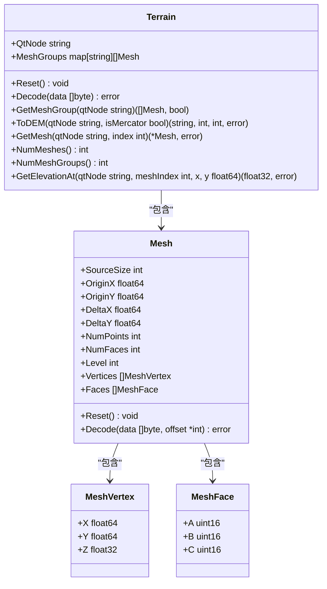
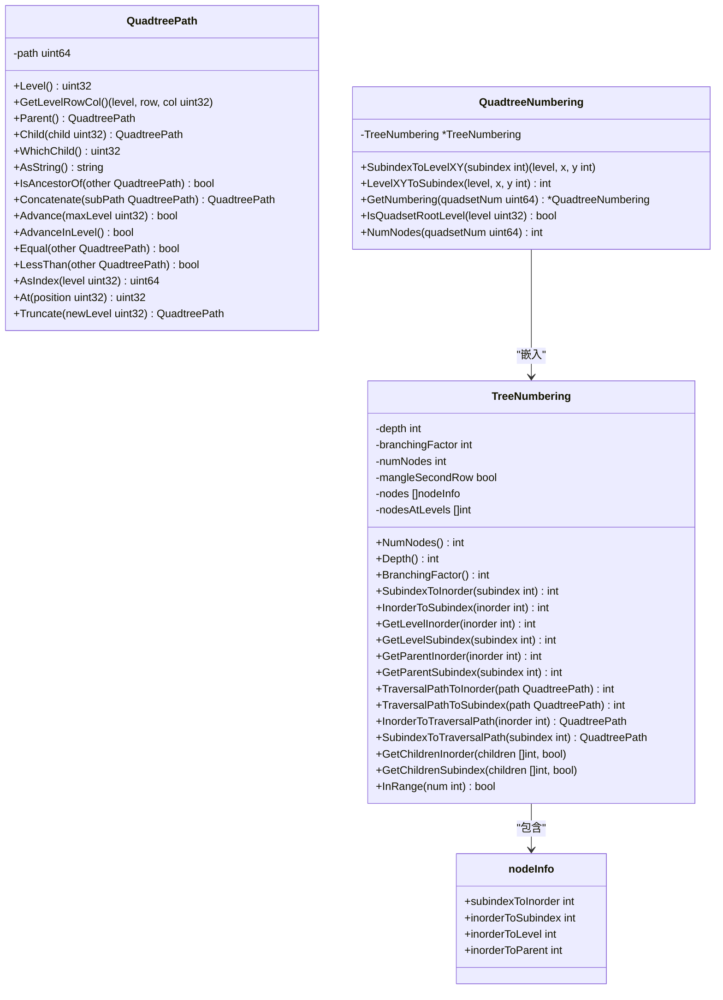
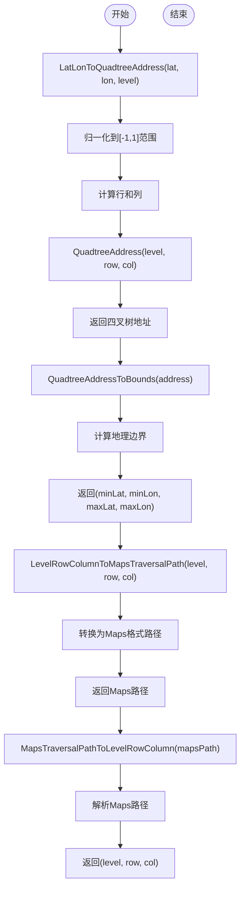
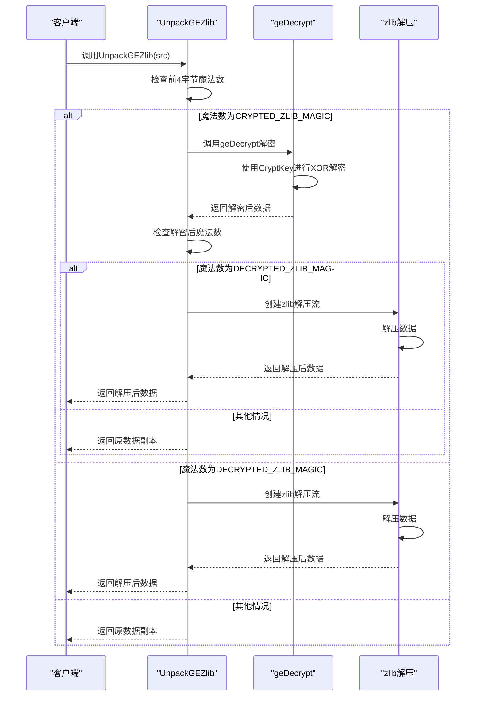
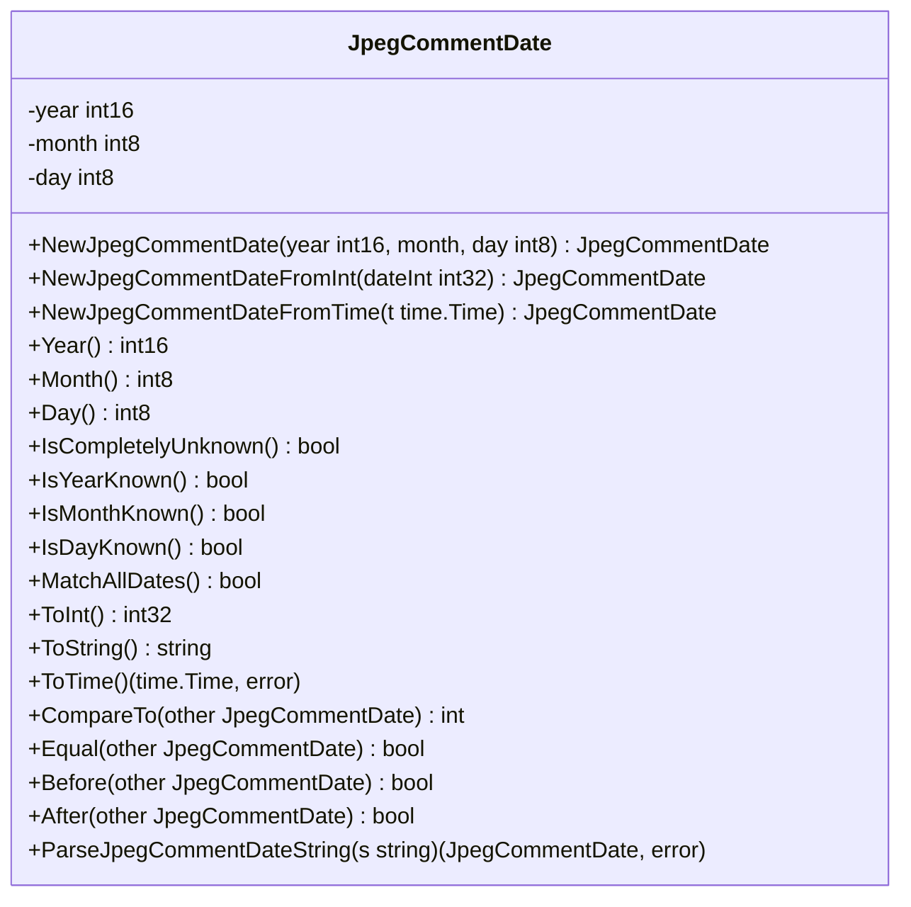
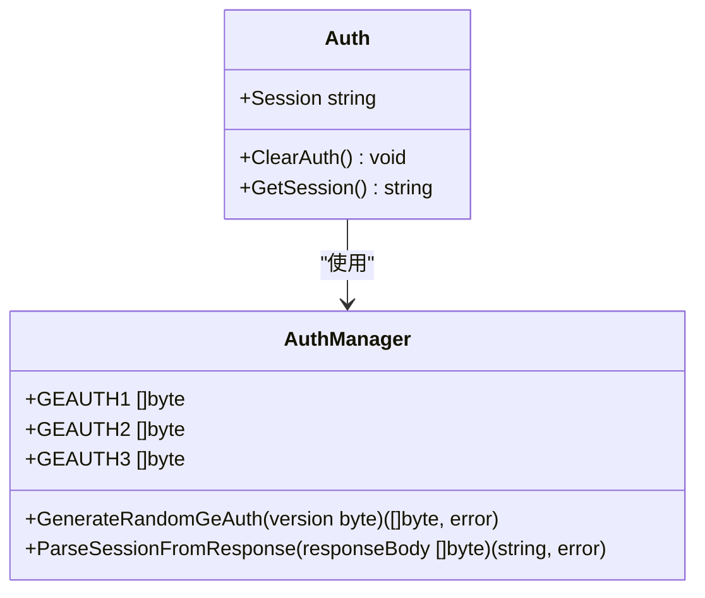
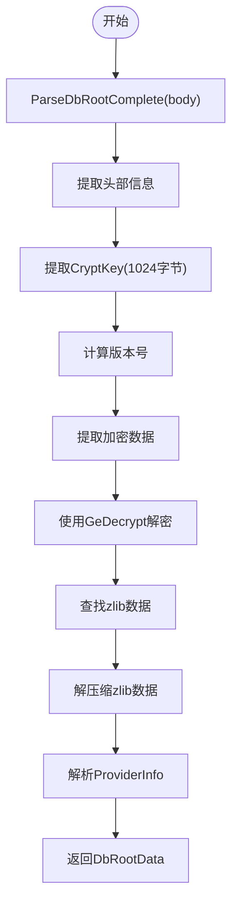
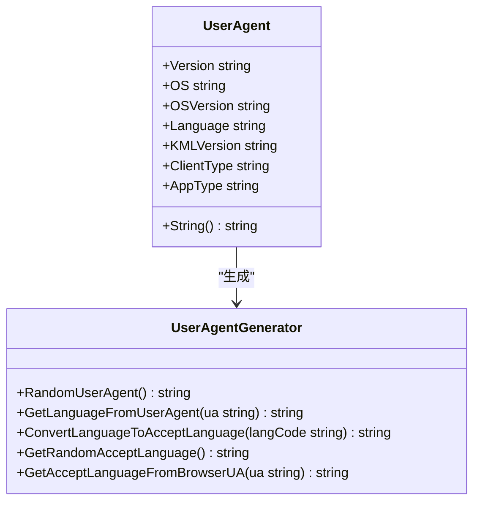
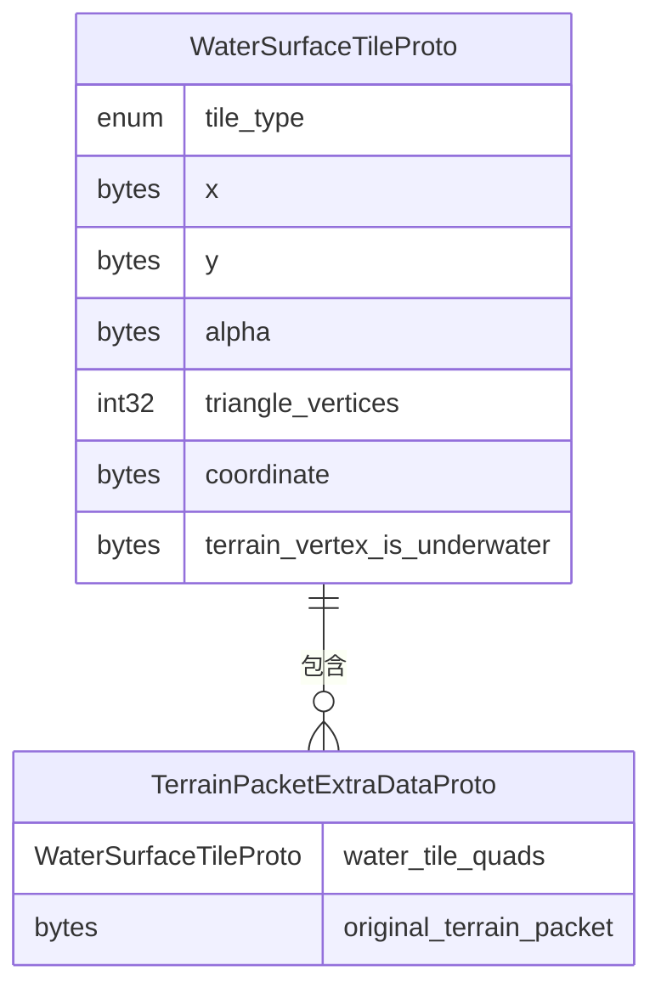
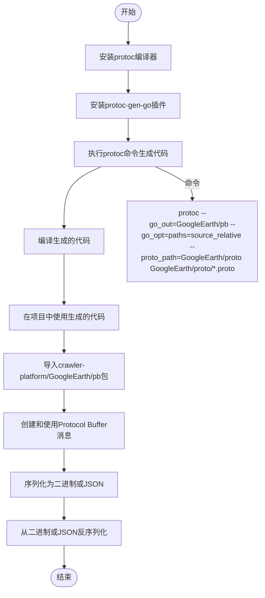

# Google Earth 地形处理

<cite>
**本文档引用的文件**   
- [terrain.go](file://GoogleEarth/terrain.go)
- [quadtree_path.go](file://GoogleEarth/quadtree_path.go)
- [quadtree_numbering.go](file://GoogleEarth/quadtree_numbering.go)
- [tree_numbering.go](file://GoogleEarth/tree_numbering.go)
- [constants.go](file://GoogleEarth/constants.go)
- [gecrypt.go](file://GoogleEarth/gecrypt.go)
- [jpeg_comment_date.go](file://GoogleEarth/jpeg_comment_date.go)
- [proto/terrain.proto](file://GoogleEarth/proto/terrain.proto)
- [README.md](file://GoogleEarth/README.md)
- [geauth.go](file://GoogleEarth/geauth.go)
- [gedbroot.go](file://GoogleEarth/gedbroot.go)
- [geq2.go](file://GoogleEarth/geq2.go)
- [geua.go](file://GoogleEarth/geua.go)
- [qtutils.go](file://GoogleEarth/qtutils.go)
- [quadtree_packet.go](file://GoogleEarth/quadtree_packet.go)
- [geqp.go](file://GoogleEarth/geqp.go)
</cite>

## 更新摘要
**所做更改**   
- 更新了项目结构图，反映了当前存在的文件结构
- 新增了认证管理、DbRoot解析、用户代理管理等新功能章节
- 更新了地形处理、四叉树管理、数据解密等核心功能的描述
- 增加了协议缓冲区定义和依赖生成的相关内容
- 完善了历史影像日期处理和坐标转换功能的说明

## 目录
1. [简介](#简介)
2. [项目结构](#项目结构)
3. [核心组件](#核心组件)
4. [地形数据处理](#地形数据处理)
5. [四叉树路径与编号](#四叉树路径与编号)
6. [坐标转换与地理编码](#坐标转换与地理编码)
7. [数据解密与解压](#数据解密与解压)
8. [历史影像日期处理](#历史影像日期处理)
9. [认证管理](#认证管理)
10. [DbRoot解析](#dbroot解析)
11. [用户代理管理](#用户代理管理)
12. [协议缓冲区定义](#协议缓冲区定义)
13. [依赖与生成](#依赖与生成)
14. [结论](#结论)

## 简介
本项目是一个用于处理 Google Earth 数据的 Go 语言库，专注于地形数据的解析、四叉树空间索引管理、数据解密和坐标转换。该库提供了完整的地形网格解析功能，支持从原始二进制数据中提取高程信息，并将其转换为标准的数字高程模型（DEM）格式。同时，库中实现了复杂的四叉树编号系统，用于处理 Google Earth 特有的空间数据组织方式。

**更新** 项目现已扩展为包含认证管理、DbRoot解析、用户代理管理等多个功能模块的完整解决方案。

## 项目结构
项目结构清晰地组织了 Google Earth 相关的功能模块，主要分为核心处理、协议定义、工具函数和测试代码。

```mermaid
graph TD
GoogleEarth[GoogleEarth]
proto[proto]
pb[pb]
README[README.md]
constants[constants.go]
gecrypt[gecrypt.go]
gedbroot[gedbroot.go]
jpeg_comment_date[jpeg_comment_date.go]
quadtree_numbering[quadtree_numbering.go]
quadtree_path[quadtree_path.go]
terrain[terrain.go]
tree_numbering[tree_numbering.go]
geauth[geauth.go]
geua[geua.go]
qtutils[qtutils.go]
quadtree_packet[quadtree_packet.go]
geqp[geqp.go]
GoogleEarth --> proto
GoogleEarth --> pb
GoogleEarth --> README
GoogleEarth --> constants
GoogleEarth --> gecrypt
GoogleEarth --> gedbroot
GoogleEarth --> jpeg_comment_date
GoogleEarth --> quadtree_numbering
GoogleEarth --> quadtree_path
GoogleEarth --> terrain
GoogleEarth --> tree_numbering
GoogleEarth --> geauth
GoogleEarth --> geua
GoogleEarth --> qtutils
GoogleEarth --> quadtree_packet
GoogleEarth --> geqp
proto --> diorama_streaming[dorama_streaming.proto]
proto --> quadtreeset[quadtreeset.proto]
proto --> streaming_imagery[streaming_imagery.proto]
proto --> terrain_proto[terrain.proto]
```

**Diagram sources**
- [GoogleEarth/README.md](file://GoogleEarth/README.md)
- [GoogleEarth/terrain.go](file://GoogleEarth/terrain.go)
- [GoogleEarth/quadtree_path.go](file://GoogleEarth/quadtree_path.go)
- [GoogleEarth/quadtree_numbering.go](file://GoogleEarth/quadtree_numbering.go)
- [GoogleEarth/tree_numbering.go](file://GoogleEarth/tree_numbering.go)
- [GoogleEarth/constants.go](file://GoogleEarth/constants.go)
- [GoogleEarth/gecrypt.go](file://GoogleEarth/gecrypt.go)
- [GoogleEarth/jpeg_comment_date.go](file://GoogleEarth/jpeg_comment_date.go)
- [GoogleEarth/proto/terrain.proto](file://GoogleEarth/proto/terrain.proto)

**Section sources**
- [GoogleEarth/README.md](file://GoogleEarth/README.md)

## 核心组件
该库的核心组件围绕地形数据处理、四叉树管理和数据解密展开，现已扩展为包含多个功能模块的完整系统。

**Section sources**
- [GoogleEarth/terrain.go](file://GoogleEarth/terrain.go)
- [GoogleEarth/quadtree_path.go](file://GoogleEarth/quadtree_path.go)
- [GoogleEarth/gecrypt.go](file://GoogleEarth/gecrypt.go)

## 地形数据处理
地形处理模块提供了完整的地形网格解析和管理功能。

```mermaid
classDiagram
class Mesh {
+SourceSize int
+OriginX float64
+OriginY float64
+DeltaX float64
+DeltaY float64
+NumPoints int
+NumFaces int
+Level int
+Vertices []MeshVertex
+Faces []MeshFace
+Reset() void
+Decode(data []byte, offset *int) error
}
class MeshVertex {
+X float64
+Y float64
+Z float32
}
class MeshFace {
+A uint16
+B uint16
+C uint16
}
class Terrain {
+QtNode string
+MeshGroups map[string][]Mesh
+Reset() void
+Decode(data []byte) error
+GetMeshGroup(qtNode string) ([]Mesh, bool)
+ToDEM(qtNode string, isMercator bool) (string, int, int, error)
+GetMesh(qtNode string, index int) (*Mesh, error)
+NumMeshes() int
+NumMeshGroups() int
+GetElevationAt(qtNode string, meshIndex int, x, y float64) (float32, error)
}
Mesh --> MeshVertex : "包含"
Mesh --> MeshFace : "包含"
Terrain --> Mesh : "包含"
```

**Diagram sources**
- [GoogleEarth/terrain.go:30-352](file://GoogleEarth/terrain.go#L30-L352)

**Section sources**
- [GoogleEarth/terrain.go:30-352](file://GoogleEarth/terrain.go#L30-L352)

## 四叉树路径与编号
四叉树路径和编号系统是处理 Google Earth 空间数据的核心。

```mermaid
classDiagram
class QuadtreePath {
-path uint64
+Level() uint32
+GetLevelRowCol() (level, row, col uint32)
+Parent() QuadtreePath
+Child(child uint32) QuadtreePath
+WhichChild() uint32
+AsString() string
+IsAncestorOf(other QuadtreePath) bool
+Concatenate(subPath QuadtreePath) QuadtreePath
+Advance(maxLevel uint32) bool
+AdvanceInLevel() bool
+Equal(other QuadtreePath) bool
+LessThan(other QuadtreePath) bool
+AsIndex(level uint32) uint64
+At(position uint32) uint32
+Truncate(newLevel uint32) QuadtreePath
}
class QuadtreeNumbering {
-TreeNumbering *TreeNumbering
+SubindexToLevelXY(subindex int) (level, x, y int)
+LevelXYToSubindex(level, x, y int) int
+GetNumbering(quadsetNum uint64) *QuadtreeNumbering
+IsQuadsetRootLevel(level uint32) bool
+NumNodes(quadsetNum uint64) int
}
class TreeNumbering {
-depth int
-branchingFactor int
-numNodes int
-mangleSecondRow bool
-nodes []nodeInfo
-nodesAtLevels []int
+NumNodes() int
+Depth() int
+BranchingFactor() int
+SubindexToInorder(subindex int) int
+InorderToSubindex(inorder int) int
+GetLevelInorder(inorder int) int
+GetLevelSubindex(subindex int) int
+GetParentInorder(inorder int) int
+GetParentSubindex(subindex int) int
+TraversalPathToInorder(path QuadtreePath) int
+TraversalPathToSubindex(path QuadtreePath) int
+InorderToTraversalPath(inorder int) QuadtreePath
+SubindexToTraversalPath(subindex int) QuadtreePath
+GetChildrenInorder(children []int, bool)
+GetChildrenSubindex(children []int, bool)
+InRange(num int) bool
}
class nodeInfo {
+subindexToInorder int
+inorderToSubindex int
+inorderToLevel int
+inorderToParent int
}
QuadtreeNumbering --> TreeNumbering : "嵌入"
TreeNumbering --> nodeInfo : "包含"
```

**Diagram sources**
- [GoogleEarth/quadtree_path.go:1-270](file://GoogleEarth/quadtree_path.go#L1-L270)
- [GoogleEarth/quadtree_numbering.go:1-204](file://GoogleEarth/quadtree_numbering.go#L1-L204)
- [GoogleEarth/tree_numbering.go:1-298](file://GoogleEarth/tree_numbering.go#L1-L298)

**Section sources**
- [GoogleEarth/quadtree_path.go:1-270](file://GoogleEarth/quadtree_path.go#L1-L270)
- [GoogleEarth/quadtree_numbering.go:1-204](file://GoogleEarth/quadtree_numbering.go#L1-L204)
- [GoogleEarth/tree_numbering.go:1-298](file://GoogleEarth/tree_numbering.go#L1-L298)

## 坐标转换与地理编码
坐标转换功能实现了经纬度与四叉树地址之间的相互转换。

```mermaid
flowchart TD
Start([开始]) --> LatLonToQuadtreeAddress["LatLonToQuadtreeAddress(lat, lon, level)"]
LatLonToQuadtreeAddress --> Normalize["归一化到[-1,1]范围"]
Normalize --> CalculateRowCol["计算行和列"]
CalculateRowCol --> QuadtreeAddress["QuadtreeAddress(level, row, col)"]
QuadtreeAddress --> ReturnAddress["返回四叉树地址"]
ReturnAddress --> QuadtreeAddressToBounds["QuadtreeAddressToBounds(address)"]
QuadtreeAddressToBounds --> CalculateBounds["计算地理边界"]
CalculateBounds --> ReturnBounds["返回(minLat, minLon, maxLat, maxLon)"]
ReturnBounds --> LevelRowColumnToMapsTraversalPath["LevelRowColumnToMapsTraversalPath(level, row, col)"]
LevelRowColumnToMapsTraversalPath --> ConvertToMaps["转换为Maps格式路径"]
ConvertToMaps --> ReturnMapsPath["返回Maps路径"]
ReturnMapsPath --> MapsTraversalPathToLevelRowColumn["MapsTraversalPathToLevelRowColumn(mapsPath)"]
MapsTraversalPathToLevelRowColumn --> ParseMapsPath["解析Maps路径"]
ParseMapsPath --> ReturnLevelRowCol["返回(level, row, col)"]
End([结束])
```

**Diagram sources**
- [GoogleEarth/quadtree_path.go:1-270](file://GoogleEarth/quadtree_path.go#L1-L270)
- [GoogleEarth/quadtree_numbering.go:1-204](file://GoogleEarth/quadtree_numbering.go#L1-L204)

**Section sources**
- [GoogleEarth/quadtree_path.go:1-270](file://GoogleEarth/quadtree_path.go#L1-L270)
- [GoogleEarth/quadtree_numbering.go:1-204](file://GoogleEarth/quadtree_numbering.go#L1-L204)

## 数据解密与解压
数据解密模块提供了对 Google Earth 加密数据的解密和解压功能。

```mermaid
sequenceDiagram
participant Client as "客户端"
participant UnpackGEZlib as "UnpackGEZlib"
participant geDecrypt as "geDecrypt"
participant zlib as "zlib解压"
Client->>UnpackGEZlib : 调用UnpackGEZlib(src)
UnpackGEZlib->>UnpackGEZlib : 检查前4字节魔法数
alt 魔法数为CRYPTED_ZLIB_MAGIC
UnpackGEZlib->>geDecrypt : 调用geDecrypt解密
geDecrypt->>geDecrypt : 使用CryptKey进行XOR解密
geDecrypt-->>UnpackGEZlib : 返回解密后数据
UnpackGEZlib->>UnpackGEZlib : 检查解密后魔法数
alt 魔法数为DECRYPTED_ZLIB_MAGIC
UnpackGEZlib->>zlib : 创建zlib解压流
zlib->>zlib : 解压数据
zlib-->>UnpackGEZlib : 返回解压后数据
UnpackGEZlib-->>Client : 返回解压后数据
else 其他情况
UnpackGEZlib-->>Client : 返回原数据副本
end
else 魔法数为DECRYPTED_ZLIB_MAGIC
UnpackGEZlib->>zlib : 创建zlib解压流
zlib->>zlib : 解压数据
zlib-->>UnpackGEZlib : 返回解压后数据
UnpackGEZlib-->>Client : 返回解压后数据
else 其他情况
UnpackGEZlib-->>Client : 返回原数据副本
end
```

**Diagram sources**
- [GoogleEarth/gecrypt.go:1-182](file://GoogleEarth/gecrypt.go#L1-L182)

**Section sources**
- [GoogleEarth/gecrypt.go:1-182](file://GoogleEarth/gecrypt.go#L1-L182)

## 历史影像日期处理
历史影像日期处理模块提供了对 JPEG 注释中日期信息的解析和管理。

```mermaid
classDiagram
class JpegCommentDate {
-year int16
-month int8
-day int8
+NewJpegCommentDate(year int16, month, day int8) JpegCommentDate
+NewJpegCommentDateFromInt(dateInt int32) JpegCommentDate
+NewJpegCommentDateFromTime(t time.Time) JpegCommentDate
+Year() int16
+Month() int8
+Day() int8
+IsCompletelyUnknown() bool
+IsYearKnown() bool
+IsMonthKnown() bool
+IsDayKnown() bool
+MatchAllDates() bool
+ToInt() int32
+ToString() string
+ToTime() (time.Time, error)
+CompareTo(other JpegCommentDate) int
+Equal(other JpegCommentDate) bool
+Before(other JpegCommentDate) bool
+After(other JpegCommentDate) bool
+ParseJpegCommentDateString(s string) (JpegCommentDate, error)
}
```

**Diagram sources**
- [GoogleEarth/jpeg_comment_date.go:1-229](file://GoogleEarth/jpeg_comment_date.go#L1-L229)

**Section sources**
- [GoogleEarth/jpeg_comment_date.go:1-229](file://GoogleEarth/jpeg_comment_date.go#L1-L229)

## 认证管理
认证管理模块提供了 Google Earth 客户端认证功能，包括会话管理和认证密钥生成。

```mermaid
classDiagram
class Auth {
+Session string
+ClearAuth() void
+GetSession() string
}
class AuthManager {
+GenerateRandomGeAuth(version byte) ([]byte, error)
+ParseSessionFromResponse(responseBody []byte) (string, error)
+GEAUTH1 []byte
+GEAUTH2 []byte
+GEAUTH3 []byte
}
Auth --> AuthManager : "使用"
```

**Diagram sources**
- [GoogleEarth/geauth.go:1-116](file://GoogleEarth/geauth.go#L1-L116)

**Section sources**
- [GoogleEarth/geauth.go:1-116](file://GoogleEarth/geauth.go#L1-L116)

## DbRoot解析
DbRoot解析模块负责解析 Google Earth 的数据库根配置，提取加密密钥和提供商标识。

```mermaid
flowchart TD
Start([开始]) --> ParseDbRootComplete["ParseDbRootComplete(body)"]
ParseDbRootComplete --> ExtractHeader["提取头部信息"]
ExtractHeader --> ExtractCryptKey["提取CryptKey(1024字节)"]
ExtractCryptKey --> CalcVersion["计算版本号"]
CalcVersion --> ExtractEncryptedData["提取加密数据"]
ExtractEncryptedData --> DecryptData["使用GeDecrypt解密"]
DecryptData --> FindZlib["查找zlib数据"]
FindZlib --> Decompress["解压缩zlib数据"]
Decompress --> ParseProviderInfo["解析ProviderInfo"]
ParseProviderInfo --> ReturnResult["返回DbRootData"]
```

**Diagram sources**
- [GoogleEarth/gedbroot.go:145-219](file://GoogleEarth/gedbroot.go#L145-L219)

**Section sources**
- [GoogleEarth/gedbroot.go:1-380](file://GoogleEarth/gedbroot.go#L1-L380)

## 用户代理管理
用户代理管理模块提供了随机生成符合 Google Earth 客户端规范的 User-Agent 字符串。

```mermaid
classDiagram
class UserAgent {
+Version string
+OS string
+OSVersion string
+Language string
+KMLVersion string
+ClientType string
+AppType string
+String() string
}
class UserAgentGenerator {
+RandomUserAgent() string
+GetLanguageFromUserAgent(ua string) string
+ConvertLanguageToAcceptLanguage(langCode string) string
+GetRandomAcceptLanguage() string
+GetAcceptLanguageFromBrowserUA(ua string) string
}
UserAgent --> UserAgentGenerator : "生成"
```

**Diagram sources**
- [GoogleEarth/geua.go:1-283](file://GoogleEarth/geua.go#L1-L283)

**Section sources**
- [GoogleEarth/geua.go:1-283](file://GoogleEarth/geua.go#L1-L283)

## 协议缓冲区定义
协议缓冲区定义了地形数据的结构化格式。

```mermaid
erDiagram
WaterSurfaceTileProto {
enum tile_type
bytes x
bytes y
bytes alpha
int32 triangle_vertices
bytes coordinate
bytes terrain_vertex_is_underwater
}
TerrainPacketExtraDataProto {
WaterSurfaceTileProto water_tile_quads
bytes original_terrain_packet
}
WaterSurfaceTileProto ||--o{ TerrainPacketExtraDataProto : "包含"
```

**Diagram sources**
- [GoogleEarth/proto/terrain.proto:1-43](file://GoogleEarth/proto/terrain.proto#L1-L43)

**Section sources**
- [GoogleEarth/proto/terrain.proto:1-43](file://GoogleEarth/proto/terrain.proto#L1-L43)

## 依赖与生成
项目依赖于 Protocol Buffers 运行时库，并提供了代码生成的说明。

```mermaid
flowchart TD
Start([开始]) --> InstallProtoc["安装protoc编译器"]
InstallProtoc --> InstallProtocGenGo["安装protoc-gen-go插件"]
InstallProtocGenGo --> GenerateCode["执行protoc命令生成代码"]
GenerateCode --> CompileCode["编译生成的代码"]
CompileCode --> UseInProject["在项目中使用生成的代码"]
GenerateCode --> |命令| ProtocCommand["protoc --go_out=GoogleEarth/pb --go_opt=paths=source_relative --proto_path=GoogleEarth/proto GoogleEarth/proto/*.proto"]
UseInProject --> ImportPackage["导入crawler-platform/GoogleEarth/pb包"]
ImportPackage --> CreateMessages["创建和使用Protocol Buffer消息"]
CreateMessages --> Serialize["序列化为二进制或JSON"]
Serialize --> Deserialize["从二进制或JSON反序列化"]
Deserialize --> End([结束])
```

**Diagram sources**
- [GoogleEarth/README.md:100-115](file://GoogleEarth/README.md#L100-L115)

**Section sources**
- [GoogleEarth/README.md:92-145](file://GoogleEarth/README.md#L92-L145)

## 结论
本项目提供了一个完整的 Google Earth 地形数据处理解决方案，涵盖了从数据解密、四叉树空间索引管理到地形网格解析的各个方面。通过精心设计的 Go 语言接口，开发者可以方便地处理 Google Earth 的地形数据，实现高程信息的提取和分析。库中的四叉树编号系统准确地实现了 Google Earth 特有的空间数据组织方式，确保了与原始数据格式的兼容性。

**更新** 项目现已扩展为包含认证管理、DbRoot解析、用户代理管理等多个功能模块的完整生态系统，为 Google Earth 数据的全面处理提供了强有力的支持。