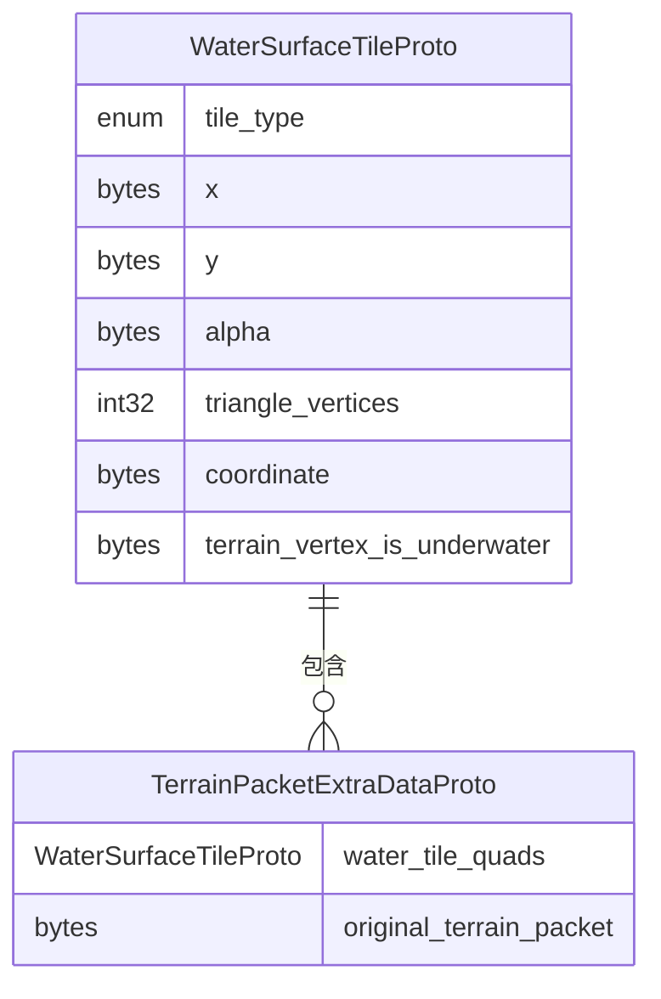

# Google Earth 地形处理

<cite>
**本文档引用的文件**   
- [terrain.go](file://GoogleEarth/terrain.go) - *更新了DEM插值算法，新增三角形重心坐标插值和最近邻插值回退机制*
- [quadtree_path.go](file://GoogleEarth/quadtree_path.go)
- [quadtree_numbering.go](file://GoogleEarth/quadtree_numbering.go)
- [tree_numbering.go](file://GoogleEarth/tree_numbering.go)
- [constants.go](file://GoogleEarth/constants.go)
- [gecrypt.go](file://GoogleEarth/gecrypt.go)
- [jpeg_comment_date.go](file://GoogleEarth/jpeg_comment_date.go)
- [proto/terrain.proto](file://GoogleEarth/proto/terrain.proto)
- [README.md](file://GoogleEarth/README.md)
</cite>

## 更新摘要
**变更内容**   
- 更新了地形数据处理模块的插值算法，实现了完整的DEM插值功能
- 新增三角形重心坐标插值作为主要方法
- 增加最近邻插值作为回退机制
- 更新了相关文档说明和代码注释

## 目录
1. [简介](#简介)
2. [项目结构](#项目结构)
3. [核心组件](#核心组件)
4. [地形数据处理](#地形数据处理)
5. [四叉树路径与编号](#四叉树路径与编号)
6. [坐标转换与地理编码](#坐标转换与地理编码)
7. [数据解密与解压](#数据解密与解压)
8. [历史影像日期处理](#历史影像日期处理)
9. [协议缓冲区定义](#协议缓冲区定义)
10. [依赖与生成](#依赖与生成)
11. [结论](#结论)

## 简介
本项目是一个用于处理 Google Earth 数据的 Go 语言库，专注于地形数据的解析、四叉树空间索引管理、数据解密和坐标转换。该库提供了完整的地形网格解析功能，支持从原始二进制数据中提取高程信息，并将其转换为标准的数字高程模型（DEM）格式。同时，库中实现了复杂的四叉树编号系统，用于处理 Google Earth 特有的空间数据组织方式。

## 项目结构
项目结构清晰地组织了 Google Earth 相关的功能模块，主要分为核心处理、协议定义、工具函数和测试代码。

**图示来源**
- [GoogleEarth/README.md](file://GoogleEarth/README.md)

**章节来源**
- [GoogleEarth/README.md](file://GoogleEarth/README.md)

## 核心组件
该库的核心组件围绕地形数据处理、四叉树管理和数据解密展开。

**章节来源**
- [GoogleEarth/terrain.go](file://GoogleEarth/terrain.go)
- [GoogleEarth/quadtree_path.go](file://GoogleEarth/quadtree_path.go)
- [GoogleEarth/gecrypt.go](file://GoogleEarth/gecrypt.go)

## 地形数据处理
地形处理模块提供了完整的地形网格解析和管理功能，现已更新为包含完整的DEM插值算法。

**图示来源**
- [GoogleEarth/terrain.go](file://GoogleEarth/terrain.go#L30-L307)

**章节来源**
- [GoogleEarth/terrain.go](file://GoogleEarth/terrain.go#L30-L307)

### DEM插值算法更新
地形处理模块已更新实现完整的DEM插值算法，采用三角形重心坐标插值作为主要方法，通过计算查询点在三角形面内的重心坐标权重，使用顶点高程的加权和来确定栅格单元的高程值。同时增加了最近邻插值作为回退机制，确保在查询点不落在任何三角形内时仍能获取有效高程值，提高了数据处理的完整性和可靠性。

**章节来源**
- [terrain.go](file://GoogleEarth/terrain.go#L219-L294) - *更新了DEM插值算法，新增三角形重心坐标插值和最近邻插值回退机制*

## 四叉树路径与编号
四叉树路径和编号系统是处理 Google Earth 空间数据的核心。

**图示来源**
- [GoogleEarth/quadtree_path.go](file://GoogleEarth/quadtree_path.go#L1-L265)
- [GoogleEarth/quadtree_numbering.go](file://GoogleEarth/quadtree_numbering.go#L1-L204)
- [GoogleEarth/tree_numbering.go](file://GoogleEarth/tree_numbering.go#L1-L298)

**章节来源**
- [GoogleEarth/quadtree_path.go](file://GoogleEarth/quadtree_path.go#L1-L265)
- [GoogleEarth/quadtree_numbering.go](file://GoogleEarth/quadtree_numbering.go#L1-L204)
- [GoogleEarth/tree_numbering.go](file://GoogleEarth/tree_numbering.go#L1-L298)

## 坐标转换与地理编码
坐标转换功能实现了经纬度与四叉树地址之间的相互转换。

**图示来源**
- [GoogleEarth/quadtree_path.go](file://GoogleEarth/quadtree_path.go#L1-L265)
- [GoogleEarth/quadtree_numbering.go](file://GoogleEarth/quadtree_numbering.go#L1-L204)

**章节来源**
- [GoogleEarth/quadtree_path.go](file://GoogleEarth/quadtree_path.go#L1-L265)
- [GoogleEarth/quadtree_numbering.go](file://GoogleEarth/quadtree_numbering.go#L1-L204)

## 数据解密与解压
数据解密模块提供了对 Google Earth 加密数据的解密和解压功能。

**图示来源**
- [GoogleEarth/gecrypt.go](file://GoogleEarth/gecrypt.go#L1-L175)

**章节来源**
- [GoogleEarth/gecrypt.go](file://GoogleEarth/gecrypt.go#L1-L175)

## 历史影像日期处理
历史影像日期处理模块提供了对 JPEG 注释中日期信息的解析和管理。

**图示来源**
- [GoogleEarth/jpeg_comment_date.go](file://GoogleEarth/jpeg_comment_date.go#L1-L229)

**章节来源**
- [GoogleEarth/jpeg_comment_date.go](file://GoogleEarth/jpeg_comment_date.go#L1-L229)

## 协议缓冲区定义
协议缓冲区定义了地形数据的结构化格式。

**图示来源**
- [GoogleEarth/proto/terrain.proto](file://GoogleEarth/proto/terrain.proto#L1-L43)

**章节来源**
- [GoogleEarth/proto/terrain.proto](file://GoogleEarth/proto/terrain.proto#L1-L43)

## 依赖与生成
项目依赖于 Protocol Buffers 运行时库，并提供了代码生成的说明。

**图示来源**
- [GoogleEarth/README.md](file://GoogleEarth/README.md#L100-L115)

**章节来源**
- [GoogleEarth/README.md](file://GoogleEarth/README.md#L92-L145)

## 结论
本项目提供了一个完整的 Google Earth 地形数据处理解决方案，涵盖了从数据解密、四叉树空间索引管理到地形网格解析的各个方面。通过精心设计的 Go 语言接口，开发者可以方便地处理 Google Earth 的地形数据，实现高程信息的提取和分析。库中的四叉树编号系统准确地实现了 Google Earth 特有的空间数据组织方式，确保了与原始数据格式的兼容性。最新更新实现了完整的DEM插值算法，采用三角形重心坐标插值作为主要方法，并增加了最近邻插值作为回退机制，显著提高了数据处理的完整性和可靠性。