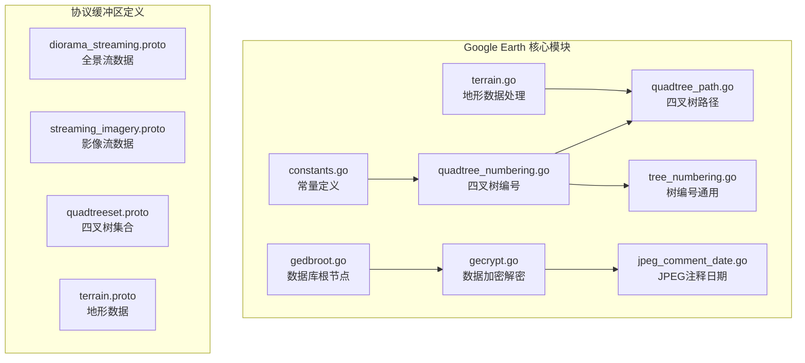
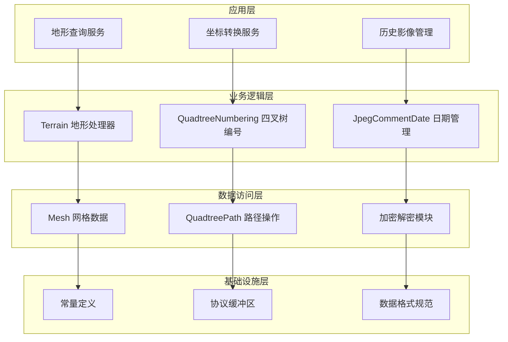
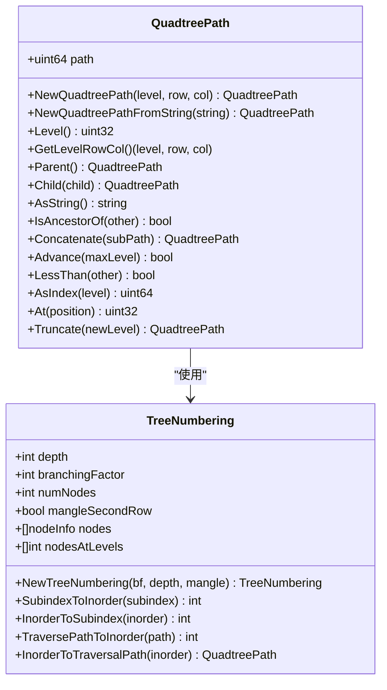
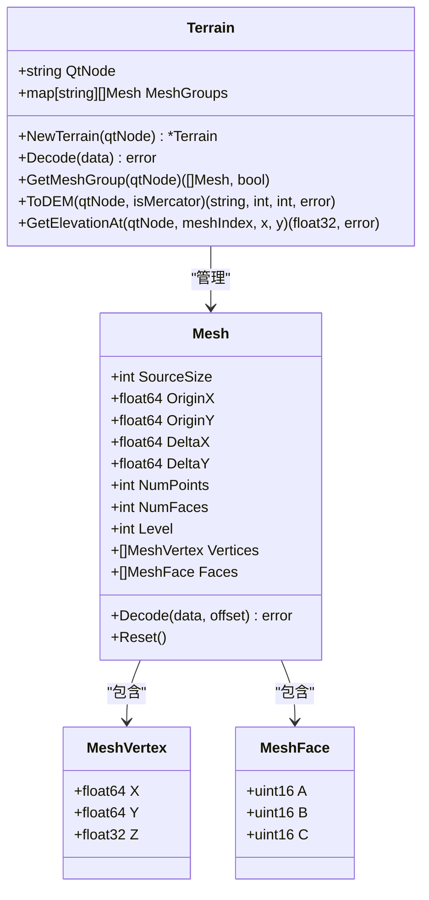
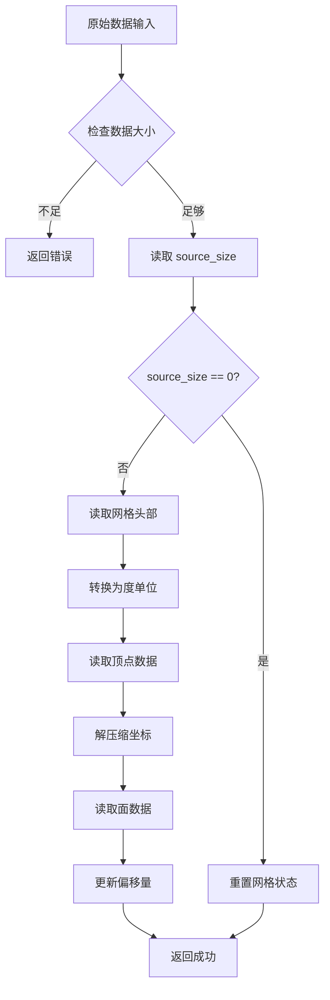
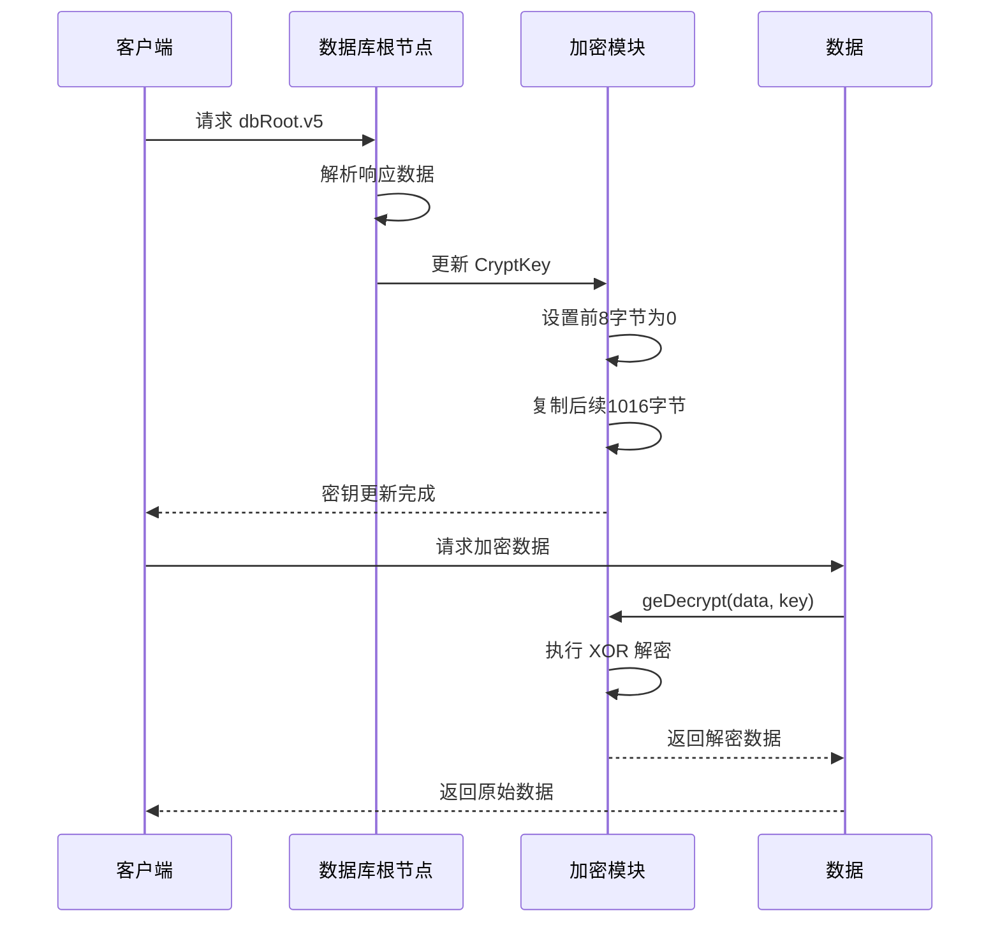
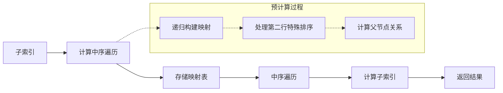
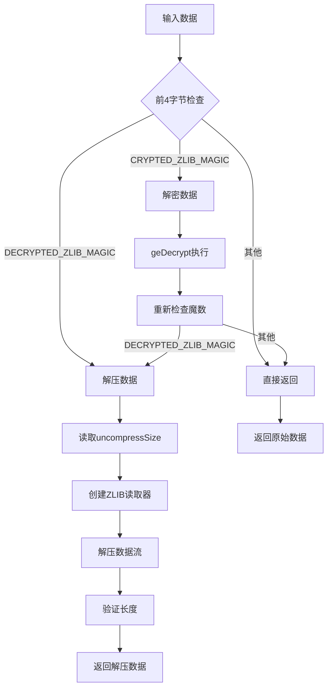

# Google Earth 坐标转换系统

<cite>
**本文档中引用的文件**
- [constants.go](file://GoogleEarth/constants.go)
- [quadtree_numbering.go](file://GoogleEarth/quadtree_numbering.go)
- [quadtree_path.go](file://GoogleEarth/quadtree_path.go)
- [tree_numbering.go](file://GoogleEarth/tree_numbering.go)
- [terrain.go](file://GoogleEarth/terrain.go)
- [gecrypt.go](file://GoogleEarth/gecrypt.go)
- [gedbroot.go](file://GoogleEarth/gedbroot.go)
- [jpeg_comment_date.go](file://GoogleEarth/jpeg_comment_date.go)
- [diorama_streaming.proto](file://GoogleEarth/proto/diorama_streaming.proto)
- [streaming_imagery.proto](file://GoogleEarth/proto/streaming_imagery.proto)
- [quadtree_numbering_test.go](file://test/googleearth/quadtree_numbering_test.go)
- [quadtree_path_test.go](file://test/googleearth/quadtree_path_test.go)
- [packet_terrain_test.go](file://test/googleearth/packet_terrain_test.go)
</cite>

## 目录
1. [简介](#简介)
2. [项目结构](#项目结构)
3. [核心组件](#核心组件)
4. [架构概览](#架构概览)
5. [详细组件分析](#详细组件分析)
6. [坐标转换算法](#坐标转换算法)
7. [数据加密与解密](#数据加密与解密)
8. [性能考虑](#性能考虑)
9. [故障排除指南](#故障排除指南)
10. [结论](#结论)

## 简介

Google Earth 坐标转换系统是一个专门设计用于处理 Google Earth 数据格式的高性能 Go 语言库。该系统提供了完整的四叉树坐标转换、地形数据处理、数据加密解密以及历史影像日期管理等功能。

该库的核心目标是：
- 提供精确的地理坐标转换服务
- 支持多种 Google Earth 数据格式
- 实现高效的数据压缩和解压缩
- 处理复杂的四叉树结构和编号系统
- 支持历史影像数据的时间轴管理

## 项目结构

Google Earth 坐标转换系统采用模块化设计，主要包含以下核心模块：



**图表来源**
- [constants.go](file://GoogleEarth/constants.go#L1-L66)
- [quadtree_numbering.go](file://GoogleEarth/quadtree_numbering.go#L1-L204)
- [quadtree_path.go](file://GoogleEarth/quadtree_path.go#L1-L265)
- [tree_numbering.go](file://GoogleEarth/tree_numbering.go#L1-L298)

**章节来源**
- [constants.go](file://GoogleEarth/constants.go#L1-L66)
- [quadtree_numbering.go](file://GoogleEarth/quadtree_numbering.go#L1-L204)

## 核心组件

### 四叉树编号系统

四叉树编号系统是整个坐标转换系统的核心，负责将地理坐标转换为高效的内部表示形式。

#### 主要特性：
- 支持深度可配置的四叉树结构
- 提供子索引（Subindex）与中序遍历（Inorder）之间的双向转换
- 实现根四叉树与默认四叉树的不同编号策略
- 支持 quadset 分割和全局节点编号

#### 关键常量：
- `DefaultDepth = 5`: 默认 quadset 深度
- `RootDepth = 4`: 根 quadset 深度
- `MaxLevel = 24`: 最大层级限制

### 地形数据处理

地形数据处理模块负责解析和处理 Google Earth 的地形数据，支持多种数据格式和投影方式。

#### 核心功能：
- 解码压缩的地形网格数据
- 支持墨卡托投影和经纬度坐标
- 实现三角形网格的高程插值
- 提供 DEM（数字高程模型）格式输出

**章节来源**
- [quadtree_numbering.go](file://GoogleEarth/quadtree_numbering.go#L6-L204)
- [terrain.go](file://GoogleEarth/terrain.go#L1-L307)

## 架构概览

Google Earth 坐标转换系统采用分层架构设计，从底层的数据格式处理到上层的应用接口：



**图表来源**
- [terrain.go](file://GoogleEarth/terrain.go#L145-L307)
- [quadtree_numbering.go](file://GoogleEarth/quadtree_numbering.go#L44-L204)
- [jpeg_comment_date.go](file://GoogleEarth/jpeg_comment_date.go#L10-L229)

## 详细组件分析

### 四叉树路径系统

四叉树路径系统是坐标转换的基础，采用位压缩技术实现高效的路径存储和操作。

#### 路径结构设计



**图表来源**
- [quadtree_path.go](file://GoogleEarth/quadtree_path.go#L14-L265)
- [tree_numbering.go](file://GoogleEarth/tree_numbering.go#L6-L298)

#### 路径压缩算法

路径采用 64 位整数压缩存储，其中：
- 高 48 位存储路径信息（每层 2 位）
- 低 16 位存储层级信息
- 使用位运算实现高效的路径操作

#### 编码规则

四叉树的编码遵循特定的行列对应关系：
```
c0  c1
r1 [3] [2]
r0 [0] [1]
```

**章节来源**
- [quadtree_path.go](file://GoogleEarth/quadtree_path.go#L27-L265)
- [tree_numbering.go](file://GoogleEarth/tree_numbering.go#L28-L298)

### 地形网格处理

地形网格处理模块实现了复杂的三维地形数据处理能力。

#### 网格数据结构



**图表来源**
- [terrain.go](file://GoogleEarth/terrain.go#L30-L307)

#### 数据解码流程

地形数据解码采用分层处理方式：



**图表来源**
- [terrain.go](file://GoogleEarth/terrain.go#L70-L143)

**章节来源**
- [terrain.go](file://GoogleEarth/terrain.go#L30-L307)

### 数据加密解密系统

数据加密解密系统提供了完整的 Google Earth 数据保护机制。

#### 加密算法

系统实现了两种主要的加密方式：

1. **XOR 加密**：核心解密算法，使用循环密钥
2. **ZLIB 压缩**：支持加密后的数据压缩

#### 密钥管理



**图表来源**
- [gecrypt.go](file://GoogleEarth/gecrypt.go#L14-L175)
- [gedbroot.go](file://GoogleEarth/gedbroot.go#L12-L35)

**章节来源**
- [gecrypt.go](file://GoogleEarth/gecrypt.go#L1-L175)
- [gedbroot.go](file://GoogleEarth/gedbroot.go#L1-L35)

## 坐标转换算法

### 四叉树坐标转换

坐标转换是系统的核心功能，涉及多个层次的转换：

#### 子索引 ↔ 中序遍历转换



**图表来源**
- [tree_numbering.go](file://GoogleEarth/tree_numbering.go#L102-L140)

#### 四叉树分割算法

系统实现了智能的 quadset 分割策略：

```mermaid
flowchart TD
A[输入路径] --> B{层级 < 根深度?}
B --> |是| C[使用根 quadset]
B --> |否| D[计算分割点]
D --> E[split = 4*(level/4) - 1]
E --> F[截取 quadset 路径]
F --> G[计算相对路径]
G --> H[查找默认编号]
C --> I[返回 quadset=0]
H --> J[返回 quadset, subindex]
I --> K[组合结果]
J --> K
```

**图表来源**
- [quadtree_numbering.go](file://GoogleEarth/quadtree_numbering.go#L87-L116)

### 高程插值算法

地形数据提供了简单的最近邻插值算法：

```mermaid
flowchart TD
A[输入坐标 (x,y)] --> B[遍历所有顶点]
B --> C[计算距离]
C --> D{距离更小?}
D --> |是| E[更新最小距离]
D --> |否| F[保持当前值]
E --> G[更新高程值]
F --> H[继续下一个]
G --> H
H --> I{还有顶点?}
I --> |是| B
I --> |否| J[返回高程值]
```

**图表来源**
- [terrain.go](file://GoogleEarth/terrain.go#L278-L306)

**章节来源**
- [quadtree_numbering.go](file://GoogleEarth/quadtree_numbering.go#L44-L204)
- [tree_numbering.go](file://GoogleEarth/tree_numbering.go#L157-L298)

## 数据加密与解密

### 加密流程详解

系统支持多种数据类型的加密和解密：

#### ZLIB 数据解包



**图表来源**
- [gecrypt.go](file://GoogleEarth/gecrypt.go#L42-L78)

#### XOR 解密算法

核心解密算法具有以下特点：
- 密钥长度：1024 字节（前8字节为0，后1016字节为实际密钥）
- 循环索引：j += 16（8的倍数时跳过16字节）
- 特殊回绕：j >= 1016 时执行特殊处理

**章节来源**
- [gecrypt.go](file://GoogleEarth/gecrypt.go#L14-L175)

## 性能考虑

### 内存优化

系统采用了多种内存优化策略：

1. **位压缩存储**：QuadtreePath 使用 64 位整数压缩存储
2. **预计算映射**：TreeNumbering 预计算所有转换映射
3. **切片重用**：Mesh 结构支持切片重用机制
4. **延迟初始化**：按需创建复杂对象

### 时间复杂度分析

| 操作 | 时间复杂度 | 说明 |
|------|------------|------|
| 路径转换 | O(1) | 位运算直接访问 |
| 坐标转换 | O(level) | 遍历层级深度 |
| 四叉树分割 | O(level) | 计算分割点 |
| 高程插值 | O(n) | 遍历所有顶点 |
| 数据解密 | O(n) | XOR 操作线性扫描 |

### 并发安全性

系统在以下方面确保并发安全：
- TreeNumbering 使用预计算映射，只读操作
- QuadtreePath 提供不可变接口
- 加密解密操作使用本地变量
- 地形数据处理支持并发访问

## 故障排除指南

### 常见问题及解决方案

#### 坐标转换错误

**问题**：坐标转换结果不正确
**可能原因**：
- 四叉树深度配置错误
- 路径字符串格式不正确
- 层级超出最大限制

**解决方案**：
1. 验证输入坐标的范围
2. 检查四叉树深度设置
3. 使用调试接口验证中间结果

#### 数据解密失败

**问题**：地形数据解密返回错误
**可能原因**：
- 密钥未正确更新
- 数据损坏或截断
- 魔数不匹配

**解决方案**：
1. 确保先调用 UpdateCryptKeyFromDBRoot
2. 验证数据完整性
3. 检查数据格式是否符合预期

#### 性能问题

**问题**：坐标转换性能低下
**可能原因**：
- 频繁的重复计算
- 不合理的深度设置
- 内存分配过多

**解决方案**：
1. 使用缓存机制
2. 优化四叉树深度
3. 减少不必要的对象创建

**章节来源**
- [quadtree_numbering_test.go](file://test/googleearth/quadtree_numbering_test.go#L1-L202)
- [quadtree_path_test.go](file://test/googleearth/quadtree_path_test.go#L1-L168)
- [packet_terrain_test.go](file://test/googleearth/packet_terrain_test.go#L1-L222)

## 结论

Google Earth 坐标转换系统是一个功能完整、性能优异的地理信息系统核心组件。该系统的主要优势包括：

### 技术优势

1. **高效的数据结构**：采用位压缩和预计算映射，实现 O(1) 级别的查询性能
2. **灵活的坐标系统**：支持多种投影方式和坐标格式
3. **完整的数据处理**：从原始数据到最终输出的全流程支持
4. **强大的加密机制**：提供完整的数据保护能力

### 应用价值

该系统在以下场景中具有重要价值：
- 地理信息系统开发
- 三维地形可视化
- 历史影像数据分析
- 空间数据挖掘研究

### 发展前景

随着地理信息技术的发展，该系统可以在以下方面进一步扩展：
- 支持更多数据格式
- 实现更复杂的插值算法
- 增强并发处理能力
- 优化内存使用效率

通过持续的技术创新和性能优化，Google Earth 坐标转换系统将继续为地理信息处理领域提供强有力的技术支撑。