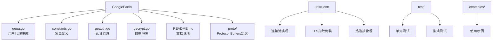
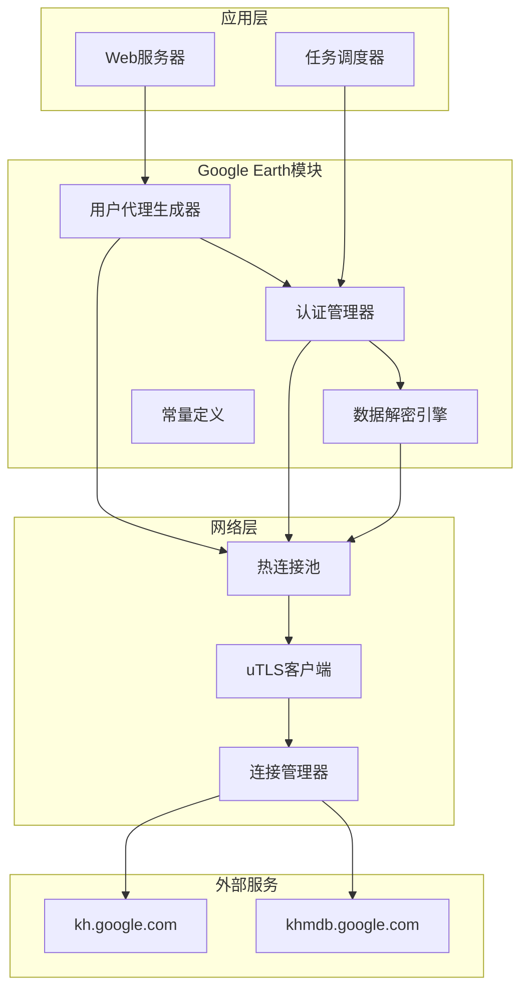
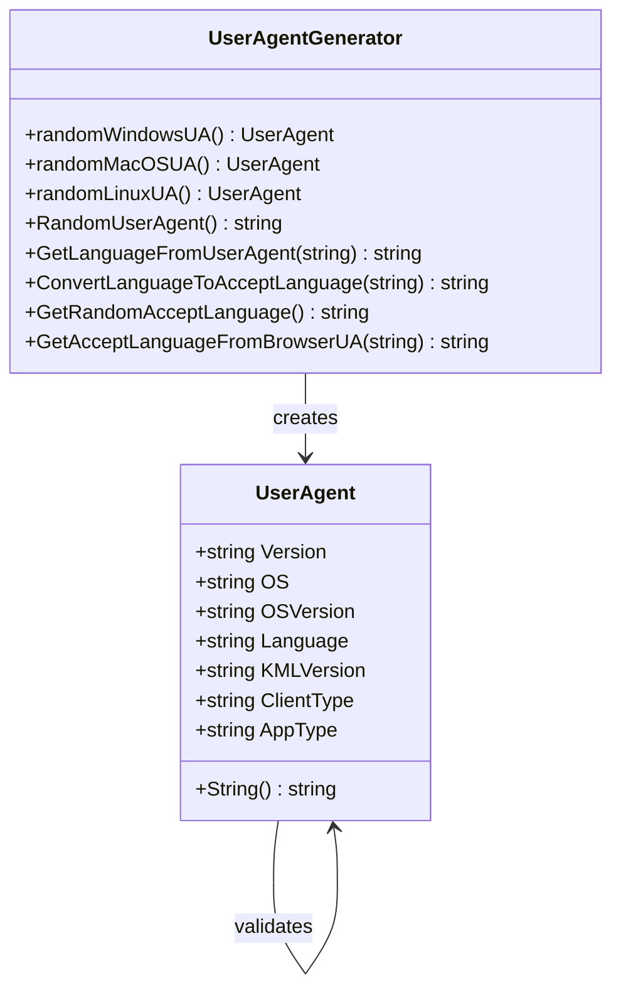
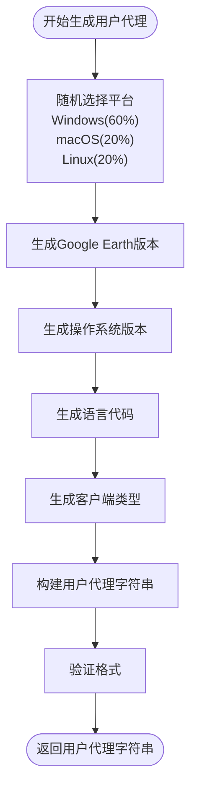
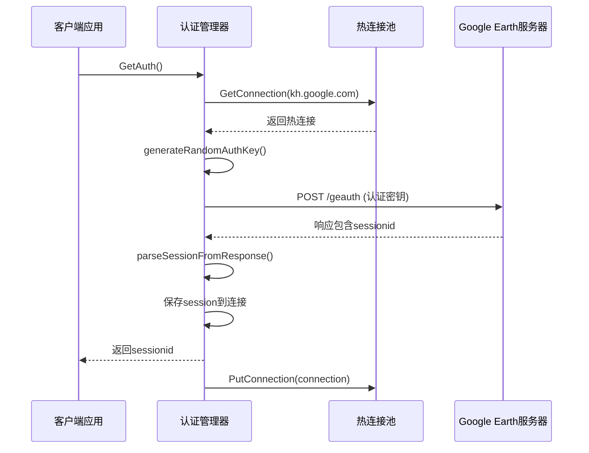
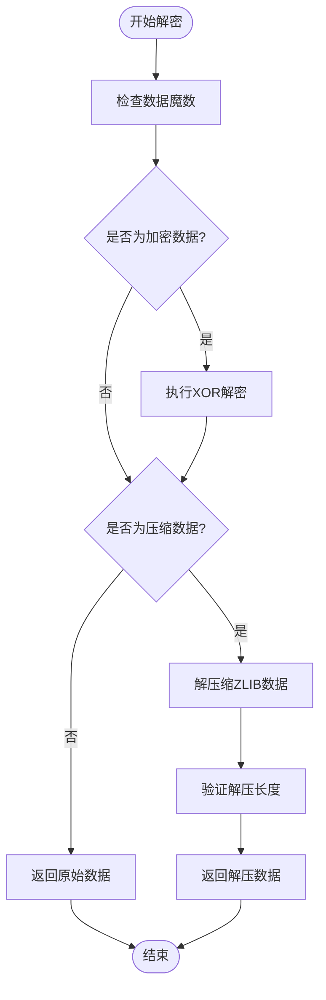
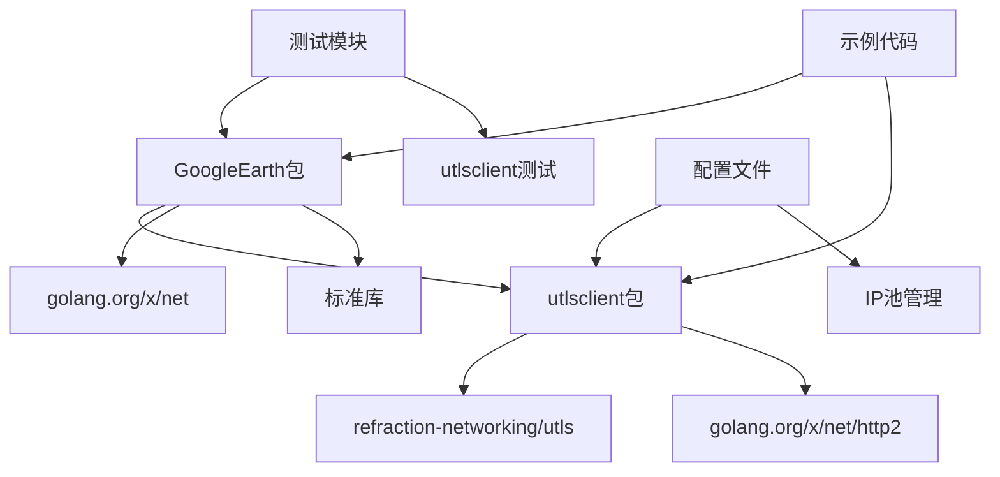

# Google Earth 用户代理

<cite>
**本文档引用的文件**
- [GoogleEarth/geua.go](file://GoogleEarth/geua.go)
- [GoogleEarth/constants.go](file://GoogleEarth/constants.go)
- [GoogleEarth/geauth.go](file://GoogleEarth/geauth.go)
- [GoogleEarth/gecrypt.go](file://GoogleEarth/gecrypt.go)
- [GoogleEarth/README.md](file://GoogleEarth/README.md)
- [README.md](file://README.md)
- [go.mod](file://go.mod)
- [test/googleearth/geauth_test.go](file://test/googleearth/geauth_test.go)
- [examples/utlsclient/example_basic_usage.go](file://examples/utlsclient/example_basic_usage.go)
- [cmd/web-server/main.go](file://cmd/web-server/main.go)
</cite>

## 目录
1. [简介](#简介)
2. [项目结构](#项目结构)
3. [核心组件](#核心组件)
4. [架构概览](#架构概览)
5. [详细组件分析](#详细组件分析)
6. [依赖关系分析](#依赖关系分析)
7. [性能考虑](#性能考虑)
8. [故障排除指南](#故障排除指南)
9. [结论](#结论)

## 简介

Google Earth 用户代理系统是一个专门设计用于模拟Google Earth客户端行为的高性能爬虫平台组件。该系统提供了完整的用户代理生成、认证管理和数据解密功能，能够高效地与Google Earth的API服务进行交互。

该系统的核心特性包括：
- **智能用户代理生成**：支持Windows、macOS和Linux平台的随机用户代理生成
- **多语言支持**：从9种主要语言中随机选择，确保请求的多样性
- **认证管理**：提供完整的Google Earth认证流程实现
- **数据解密**：支持Google Earth特有的加密数据格式解密
- **热连接池集成**：与高性能热连接池无缝集成，提升网络性能

## 项目结构

Google Earth模块位于独立的目录中，包含以下核心文件：



**图表来源**
- [GoogleEarth/geua.go](file://GoogleEarth/geua.go#L1-L283)
- [GoogleEarth/constants.go](file://GoogleEarth/constants.go#L1-L66)
- [GoogleEarth/geauth.go](file://GoogleEarth/geauth.go#L1-L200)
- [GoogleEarth/gecrypt.go](file://GoogleEarth/gecrypt.go#L1-L182)

**章节来源**
- [GoogleEarth/README.md](file://GoogleEarth/README.md#L1-L145)
- [README.md](file://README.md#L1-L357)

## 核心组件

### 用户代理生成器

用户代理生成器是系统的核心组件之一，负责创建符合Google Earth客户端特征的用户代理字符串。

#### 主要特性：
- **平台多样性**：支持Windows（60%）、macOS（20%）和Linux（20%）平台
- **版本随机化**：从多个Google Earth版本中随机选择
- **语言本地化**：支持简体中文、英语、日语、德语、法语、西班牙语和俄语
- **格式标准化**：遵循Google Earth的标准用户代理格式

#### 用户代理格式：
```
GoogleEarth/版本(平台;操作系统版本;语言;kml:2.2;client:类型;type:default)
```

### 认证管理器

认证管理器实现了Google Earth的认证流程，包括：
- **会话管理**：自动处理认证会话的创建、存储和清除
- **密钥生成**：支持多种预定义认证密钥的随机选择
- **连接复用**：利用热连接池的特性，实现高效的认证流程

### 数据解密引擎

数据解密引擎提供了对Google Earth特有加密格式的支持：
- **XOR解密**：实现核心的异或解密算法
- **ZLIB压缩**：支持加密后的ZLIB数据解压缩
- **魔数验证**：通过魔法数字识别和验证数据格式

**章节来源**
- [GoogleEarth/geua.go](file://GoogleEarth/geua.go#L9-L18)
- [GoogleEarth/geauth.go](file://GoogleEarth/geauth.go#L14-L19)
- [GoogleEarth/gecrypt.go](file://GoogleEarth/gecrypt.go#L14-L182)

## 架构概览

Google Earth用户代理系统采用模块化架构设计，与整个爬虫平台紧密集成：



**图表来源**
- [cmd/web-server/main.go](file://cmd/web-server/main.go#L1-L222)
- [GoogleEarth/geauth.go](file://GoogleEarth/geauth.go#L1-L200)
- [GoogleEarth/geua.go](file://GoogleEarth/geua.go#L1-L283)

## 详细组件分析

### 用户代理生成组件

#### 类图设计



**图表来源**
- [GoogleEarth/geua.go](file://GoogleEarth/geua.go#L9-L18)
- [GoogleEarth/geua.go](file://GoogleEarth/geua.go#L67-L141)

#### 工作流程



**图表来源**
- [GoogleEarth/geua.go](file://GoogleEarth/geua.go#L130-L141)
- [GoogleEarth/geua.go](file://GoogleEarth/geua.go#L67-L113)

### 认证管理组件

#### 认证流程序列图



**图表来源**
- [GoogleEarth/geauth.go](file://GoogleEarth/geauth.go#L34-L94)
- [GoogleEarth/geauth.go](file://GoogleEarth/geauth.go#L21-L25)

#### 认证密钥管理

系统支持三种预定义认证密钥，每种都有特定的用途：

| 密钥类型 | 版本号 | 用途 | 长度 |
|---------|--------|------|------|
| GEAUTH1 | 0x03 | 主认证密钥 | 48字节 |
| GEAUTH2 | 0x01 | 辅助认证密钥 | 49字节 |
| GEAUTH3 | 0x01 | 备用认证密钥 | 49字节 |

**章节来源**
- [GoogleEarth/geauth.go](file://GoogleEarth/geauth.go#L130-L199)

### 数据解密组件

#### 解密算法流程



**图表来源**
- [GoogleEarth/gecrypt.go](file://GoogleEarth/gecrypt.go#L46-L85)
- [GoogleEarth/gecrypt.go](file://GoogleEarth/gecrypt.go#L156-L182)

**章节来源**
- [GoogleEarth/gecrypt.go](file://GoogleEarth/gecrypt.go#L1-L182)

## 依赖关系分析

### 模块依赖图



**图表来源**
- [go.mod](file://go.mod#L1-L25)
- [GoogleEarth/geauth.go](file://GoogleEarth/geauth.go#L1-L12)

### 外部依赖

系统的主要外部依赖包括：
- **refraction-networking/utls**：提供TLS指纹伪装功能
- **golang.org/x/net**：HTTP/2协议支持和网络工具
- **google.golang.org/protobuf**：Protocol Buffers支持

**章节来源**
- [go.mod](file://go.mod#L1-L25)

## 性能考虑

### 热连接池集成

Google Earth用户代理系统充分利用了热连接池的性能优势：

- **连接复用**：认证后的会话ID自动保存到热连接中，避免重复认证
- **预热机制**：系统启动时预建立连接，减少首次请求延迟
- **并发优化**：支持高并发请求处理，性能提升3-6倍

### 内存管理

- **对象池化**：用户代理对象采用池化策略，减少GC压力
- **字符串优化**：使用fmt.Sprintf而非字符串拼接，提高性能
- **缓存策略**：语言映射表采用静态缓存，避免重复计算

### 网络优化

- **HTTP/2支持**：自动检测和使用HTTP/2协议，提升传输效率
- **IPv6兼容**：完整支持IPv6地址连接，扩大可用IP范围
- **超时控制**：合理的超时设置，平衡性能和可靠性

## 故障排除指南

### 常见问题及解决方案

#### 认证失败
**症状**：GetAuth()返回认证失败错误
**原因**：网络连接问题或认证密钥无效
**解决方案**：
1. 检查网络连接状态
2. 验证热连接池配置
3. 确认Google Earth服务器可达性

#### 用户代理格式错误
**症状**：服务器拒绝请求或返回400错误
**原因**：用户代理格式不符合Google Earth要求
**解决方案**：
1. 验证用户代理字符串格式
2. 检查语言代码的有效性
3. 确认客户端类型设置正确

#### 数据解密失败
**症状**：解密后的数据损坏或无法解析
**原因**：密钥错误或数据完整性问题
**解决方案**：
1. 验证解密密钥的正确性
2. 检查数据魔数验证
3. 确认数据传输完整性

**章节来源**
- [test/googleearth/geauth_test.go](file://test/googleearth/geauth_test.go#L98-L227)

## 结论

Google Earth用户代理系统是一个功能完整、性能优异的爬虫平台组件。它通过智能的用户代理生成、可靠的认证管理和高效的数据解密，为Google Earth API的访问提供了完整的解决方案。

### 主要优势

1. **高度仿真**：用户代理完全模拟真实Google Earth客户端行为
2. **性能卓越**：与热连接池深度集成，提供最佳性能表现
3. **功能完整**：涵盖认证、解密、数据处理等完整流程
4. **易于使用**：简洁的API设计，便于集成和扩展

### 应用场景

- **地理信息系统数据采集**
- **卫星影像数据获取**
- **地形数据解析**
- **空间索引数据查询**

该系统为开发者提供了一个强大而灵活的工具，能够高效地访问和处理Google Earth的丰富地理数据资源。