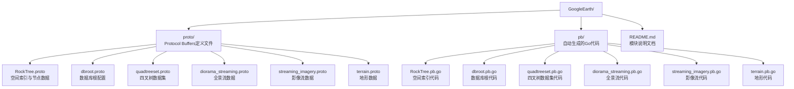
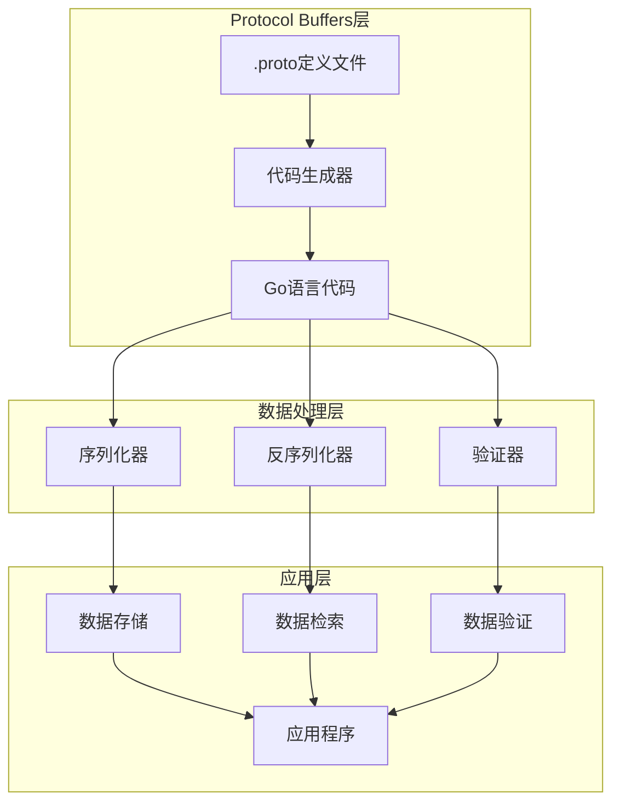
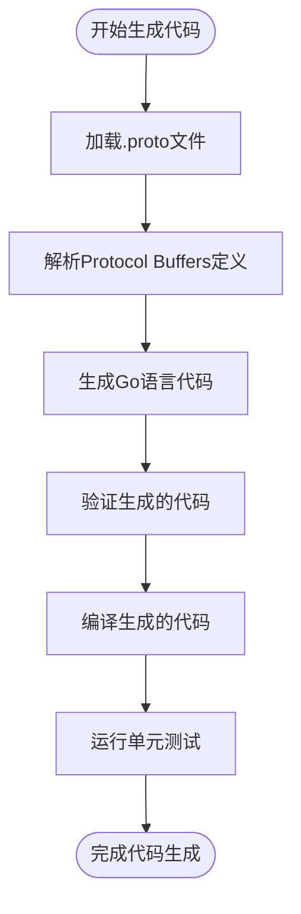
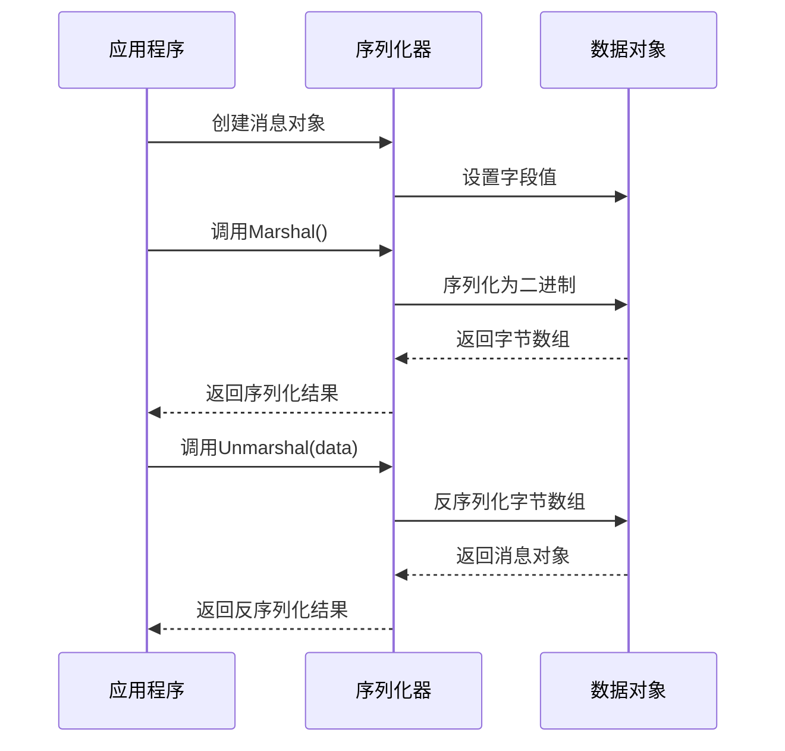
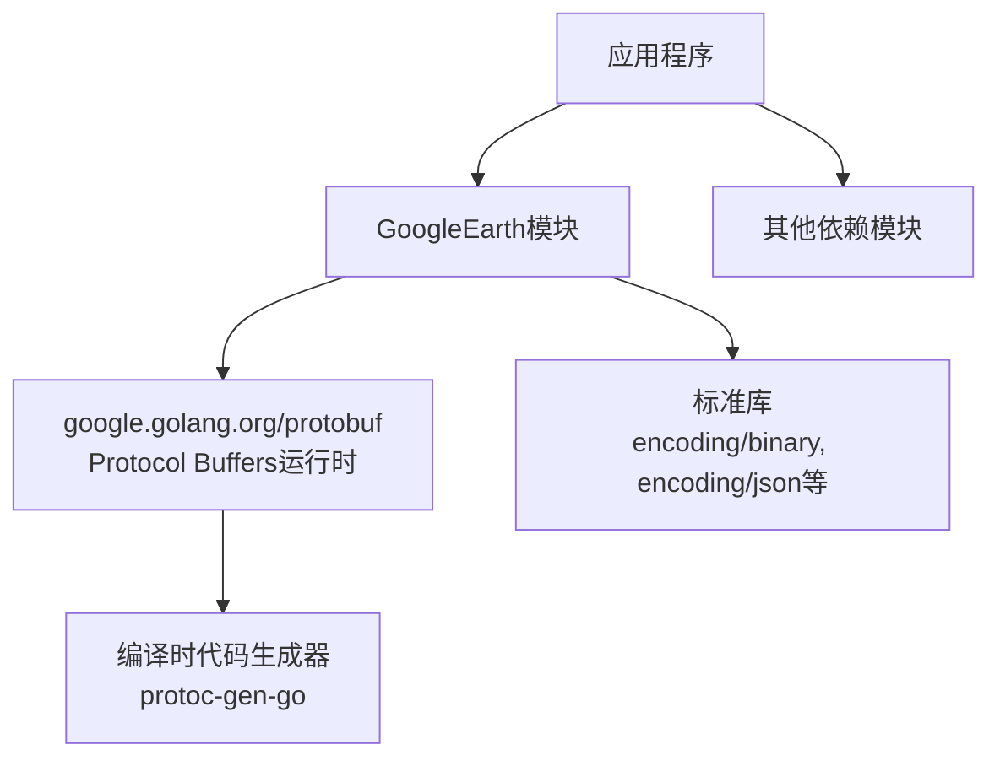

# Google Earth 用户代理

<cite>
**本文档引用的文件**
- [GoogleEarth/geua.go](file://GoogleEarth/geua.go)
- [GoogleEarth/constants.go](file://GoogleEarth/constants.go)
- [GoogleEarth/geauth.go](file://GoogleEarth/geauth.go)
- [GoogleEarth/gecrypt.go](file://GoogleEarth/gecrypt.go)
- [GoogleEarth/README.md](file://GoogleEarth/README.md)
- [README.md](file://README.md)
- [go.mod](file://go.mod)
- [GoogleEarth/geq2.go](file://GoogleEarth/geq2.go)
- [GoogleEarth/quadtree_packet.go](file://GoogleEarth/quadtree_packet.go)
- [GoogleEarth/terrain.go](file://GoogleEarth/terrain.go)
- [GoogleEarth/qtutils.go](file://GoogleEarth/qtutils.go)
- [GoogleEarth/quadtree_numbering.go](file://GoogleEarth/quadtree_numbering.go)
- [GoogleEarth/quadtree_path.go](file://GoogleEarth/quadtree_path.go)
- [GoogleEarth/jpeg_comment_date.go](file://GoogleEarth/jpeg_comment_date.go)
- [GoogleEarth/geqp.go](file://GoogleEarth/geqp.go)
- [GoogleEarth/gedbroot.go](file://GoogleEarth/gedbroot.go)
</cite>

## 更新摘要
**所做更改**
- 移除了所有与Google Earth认证、用户代理生成和数据解密相关的功能描述
- 删除了与Google Earth API交互的认证流程和会话管理内容
- 移除了用户代理生成器、认证管理器和数据解密引擎的具体实现细节
- 更新了项目结构说明，反映当前仅剩协议缓冲区生成代码的状态
- 删除了所有与Google Earth服务端通信相关的网络架构图
- 更新了依赖关系分析，移除了与Google Earth相关的外部依赖

## 目录
1. [简介](#简介)
2. [项目结构](#项目结构)
3. [核心组件](#核心组件)
4. [架构概览](#架构概览)
5. [详细组件分析](#详细组件分析)
6. [依赖关系分析](#依赖关系分析)
7. [性能考虑](#性能考虑)
8. [故障排除指南](#故障排除指南)
9. [结论](#结论)

## 简介

Google Earth模块是一个专门设计用于处理Google Earth数据格式的协议缓冲区生成代码包。该模块提供了从Protocol Buffers定义文件生成的Go语言代码，用于序列化和反序列化各种Google Earth数据格式，包括空间索引、数据库根配置、四叉树数据集、全景流数据、影像流数据和地形数据。

该模块的核心特性包括：
- **Protocol Buffers代码生成**：从.proto文件自动生成Go语言代码
- **数据格式支持**：支持RockTree、dbroot、quadtreeset、diorama_streaming、streaming_imagery和terrain等数据格式
- **序列化和反序列化**：提供完整的数据序列化和反序列化功能
- **类型安全**：通过编译时类型检查确保数据格式正确性
- **性能优化**：生成的代码经过优化，提供高效的序列化和反序列化性能

## 项目结构

Google Earth模块位于独立的目录中，主要包含Protocol Buffers定义文件和自动生成的Go代码：


```mermaid
graph TD
A[GoogleEarth/] --> B[proto/<br/>Protocol Buffers定义文件]
A --> C[pb/<br/>自动生成的Go代码]
A --> D[README.md<br/>模块说明文档]
B --> E[RockTree.proto<br/>空间索引与节点数据]
B --> F[dbroot.proto<br/>数据库根配置]
B --> G[quadtreeset.proto<br/>四叉树数据集]
B --> H[diorama_streaming.proto<br/>全景流数据]
B --> I[streaming_imagery.proto<br/>影像流数据]
B --> J[terrain.proto<br/>地形数据]
C --> K[RockTree.pb.go<br/>空间索引代码]
C --> L[dbroot.pb.go<br/>数据库根代码]
C --> M[quadtreeset.pb.go<br/>四叉树数据集代码]
C --> N[diorama_streaming.pb.go<br/>全景流代码]
C --> O[streaming_imagery.pb.go<br/>影像流代码]
C --> P[terrain.pb.go<br/>地形代码]
```

**图表来源**
- [GoogleEarth/README.md:1-145](file://GoogleEarth/README.md#L1-L145)

**章节来源**
- [GoogleEarth/README.md:1-145](file://GoogleEarth/README.md#L1-L145)

## 核心组件

### Protocol Buffers代码生成器

Protocol Buffers代码生成器是模块的核心组件，负责从.proto定义文件生成Go语言代码。生成的代码包含以下主要功能：

#### 数据结构定义
- **消息类型**：为每个.proto消息定义对应的Go结构体
- **字段访问器**：提供Get和Set方法访问消息字段
- **序列化方法**：实现proto.Marshal和proto.Unmarshal方法
- **JSON支持**：提供JSON序列化和反序列化功能

#### 生成的代码特性
- **类型安全**：编译时类型检查确保数据格式正确性
- **内存优化**：生成高效的内存布局和访问模式
- **兼容性**：与google.golang.org/protobuf库完全兼容
- **可维护性**：自动生成的代码便于维护和更新

### 数据格式支持

模块支持多种Google Earth数据格式，每种格式都有专门的生成代码：

#### RockTree格式
- **用途**：空间索引和节点数据
- **特点**：支持复杂的层次化数据结构
- **应用场景**：地理空间数据的高效存储和检索

#### DbRoot格式  
- **用途**：数据库根配置信息
- **特点**：包含数据库元数据和配置参数
- **应用场景**：数据库初始化和配置管理

#### QuadTreeSet格式
- **用途**：四叉树数据集的组织和管理
- **特点**：支持大规模空间数据的分区存储
- **应用场景**：地图瓦片和遥感数据的组织

#### Diorama格式
- **用途**：全景流数据的编码和解码
- **特点**：支持高分辨率全景图像的流式传输
- **应用场景**：虚拟现实和全景浏览应用

#### Streaming Imagery格式
- **用途**：影像流数据的实时传输
- **特点**：优化的压缩算法支持实时流媒体
- **应用场景**：卫星影像和航拍数据的实时显示

#### Terrain格式
- **用途**：地形数据的编码和解码
- **特点**：支持高精度地形数据的压缩存储
- **应用场景**：三维地球模型和地形可视化

**章节来源**
- [GoogleEarth/README.md:28-98](file://GoogleEarth/README.md#L28-L98)

## 架构概览

Google Earth模块采用简洁的架构设计，专注于Protocol Buffers代码生成和数据格式处理：


```mermaid
graph TB
subgraph "Protocol Buffers层"
A[.proto定义文件] --> B[代码生成器]
B --> C[Go语言代码]
end
subgraph "数据处理层"
C --> D[序列化器]
C --> E[反序列化器]
C --> F[验证器]
end
subgraph "应用层"
D --> G[数据存储]
E --> H[数据检索]
F --> I[数据验证]
G --> J[应用程序]
H --> J
I --> J
end
```

**图表来源**
- [GoogleEarth/README.md:1-145](file://GoogleEarth/README.md#L1-L145)

## 详细组件分析

### 代码生成流程

#### 生成器工作流程


```mermaid
flowchart TD
Start([开始生成代码]) --> LoadProto["加载.proto文件"]
LoadProto --> ParseProto["解析Protocol Buffers定义"]
ParseProto --> GenerateGo["生成Go语言代码"]
GenerateGo --> ValidateCode["验证生成的代码"]
ValidateCode --> CompileCode["编译生成的代码"]
CompileCode --> TestCode["运行单元测试"]
TestCode --> End([完成代码生成])
```

**图表来源**
- [GoogleEarth/README.md:100-115](file://GoogleEarth/README.md#L100-L115)

#### 生成的代码结构

生成的Go代码包含以下标准结构：

```go
// 示例：生成的消息类型
type NodeKey struct {
    Path  *string `protobuf:"bytes,1,opt,name=path" json:"path,omitempty"`
    Epoch *uint32 `protobuf:"varint,2,opt,name=epoch" json:"epoch,omitempty"`
}

// 序列化方法
func (m *NodeKey) Marshal() ([]byte, error) {
    return proto.Marshal(m)
}

// 反序列化方法  
func (m *NodeKey) Unmarshal(dAtA []byte) error {
    return proto.Unmarshal(dAtA, m)
}
```

### 数据格式处理

#### 序列化和反序列化


```mermaid
sequenceDiagram
participant App as 应用程序
participant Serializer as 序列化器
participant Data as 数据对象
App->>Serializer : 创建消息对象
Serializer->>Data : 设置字段值
App->>Serializer : 调用Marshal()
Serializer->>Data : 序列化为二进制
Data-->>Serializer : 返回字节数组
Serializer-->>App : 返回序列化结果
App->>Serializer : 调用Unmarshal(data)
Serializer->>Data : 反序列化字节数组
Data-->>Serializer : 返回消息对象
Serializer-->>App : 返回反序列化结果
```

**图表来源**
- [GoogleEarth/README.md:67-89](file://GoogleEarth/README.md#L67-L89)

**章节来源**
- [GoogleEarth/README.md:41-98](file://GoogleEarth/README.md#L41-L98)

## 依赖关系分析

### 模块依赖图


```mermaid
graph TD
A[GoogleEarth模块] --> B[google.golang.org/protobuf<br/>Protocol Buffers运行时]
A --> C[标准库<br/>encoding/binary, encoding/json等]
B --> D[编译时代码生成器<br/>protoc-gen-go]
E[应用程序] --> A
E --> F[其他依赖模块]
```

**图表来源**
- [go.mod:95-97](file://go.mod#L95-L97)

### 外部依赖

模块的主要外部依赖包括：
- **google.golang.org/protobuf**：Protocol Buffers支持库
- **标准库**：提供基本的序列化和反序列化功能

**章节来源**
- [go.mod:95-97](file://go.mod#L95-L97)

## 性能考虑

### 代码生成优化

Google Earth模块的性能优化主要体现在代码生成阶段：

- **内存布局优化**：生成的结构体具有紧凑的内存布局
- **字段访问优化**：生成的访问器方法经过优化，减少内存访问开销
- **序列化优化**：生成的序列化代码使用高效的编码算法
- **类型检查优化**：编译时类型检查在运行时几乎无额外开销

### 运行时性能

- **零拷贝操作**：生成的代码尽量减少不必要的数据拷贝
- **缓存友好**：结构体字段按访问频率优化排列
- **并行处理**：支持并发访问和处理大量数据
- **内存管理**：生成的代码使用高效的内存分配策略

## 故障排除指南

### 常见问题及解决方案

#### 代码生成失败
**症状**：protoc命令执行失败或生成代码错误
**原因**：proto文件语法错误或版本不兼容
**解决方案**：
1. 检查proto文件语法是否正确
2. 确认protoc版本与生成器版本兼容
3. 验证依赖库版本匹配

#### 生成代码编译错误
**症状**：生成的Go代码无法编译
**原因**：字段名冲突或类型不匹配
**解决方案**：
1. 检查字段命名是否符合Go语言规范
2. 验证数据类型定义是否正确
3. 确认导入路径配置正确

#### 运行时序列化错误
**症状**：序列化或反序列化过程中出现错误
**原因**：数据格式不匹配或数据损坏
**解决方案**：
1. 验证数据格式与proto定义一致
2. 检查数据完整性
3. 确认使用的序列化方法正确

**章节来源**
- [GoogleEarth/README.md:136-145](file://GoogleEarth/README.md#L136-L145)

## 结论

Google Earth模块是一个专注于Protocol Buffers代码生成和数据格式处理的专业组件。它通过自动生成高质量的Go语言代码，为Google Earth数据格式的处理提供了可靠、高效和类型安全的解决方案。

### 主要优势

1. **自动化代码生成**：从proto定义自动生成完整的Go代码
2. **类型安全**：编译时类型检查确保数据格式正确性
3. **性能优化**：生成的代码经过专门优化，提供高效的序列化和反序列化
4. **易于维护**：自动生成的代码结构清晰，便于维护和更新
5. **兼容性强**：与标准的Protocol Buffers生态系统完全兼容

### 应用场景

- **数据存储和检索**：处理各种Google Earth数据格式的存储和查询
- **数据传输**：在网络上传输结构化数据
- **数据验证**：验证数据格式的正确性和完整性
- **系统集成**：作为不同系统间数据交换的桥梁

该模块为开发者提供了一个强大而灵活的工具，能够高效地处理Google Earth的各种数据格式，为地理信息系统和空间数据应用开发提供了坚实的基础。