# Google Earth 认证系统技术文档

<cite>
**本文档中引用的文件**
- [geauth.go](file://GoogleEarth/geauth.go)
- [constants.go](file://GoogleEarth/constants.go)
- [gecrypt.go](file://GoogleEarth/gecrypt.go)
- [quadtree_path.go](file://GoogleEarth/quadtree_path.go)
- [terrain.go](file://GoogleEarth/terrain.go)
- [README.md](file://GoogleEarth/README.md)
- [geauth_test.go](file://test/googleearth/geauth_test.go)
- [dbroot.proto](file://GoogleEarth/proto/dbroot.proto)
- [terrain.proto](file://GoogleEarth/proto/terrain.proto)
- [utlshotconnpool.go](file://utlsclient/utlshotconnpool.go)
- [config.go](file://config/config.go)
- [go.mod](file://go.mod)
</cite>

## 目录
1. [简介](#简介)
2. [项目结构](#项目结构)
3. [核心组件](#核心组件)
4. [架构概览](#架构概览)
5. [详细组件分析](#详细组件分析)
6. [认证流程](#认证流程)
7. [数据加密与解密](#数据加密与解解密)
8. [四叉树路径系统](#四叉树路径系统)
9. [地形数据处理](#地形数据处理)
10. [性能考虑](#性能考虑)
11. [故障排除指南](#故障排除指南)
12. [结论](#结论)

## 简介

Google Earth 认证系统是一个专门设计用于与Google Earth Web服务进行交互的高性能认证框架。该系统基于uTLS技术，提供了热连接池、TLS指纹伪装、以及针对Google Earth特定协议的数据处理能力。

### 主要特性

- **高性能热连接池**：预建立和复用TLS连接，性能提升3-6倍
- **TLS指纹伪装**：支持33种真实浏览器TLS指纹配置
- **Google Earth专用认证**：实现Google Earth特有的认证协议
- **数据加密解密**：支持Google Earth数据的加密和解密
- **四叉树路径系统**：处理Google Earth的四叉树瓦片系统
- **地形数据处理**：解析和处理Google Earth地形数据

## 项目结构

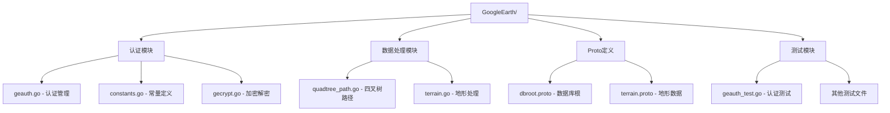

**图表来源**
- [geauth.go](file://GoogleEarth/geauth.go#L1-L200)
- [constants.go](file://GoogleEarth/constants.go#L1-L66)
- [quadtree_path.go](file://GoogleEarth/quadtree_path.go#L1-L265)

**章节来源**
- [README.md](file://GoogleEarth/README.md#L1-L145)
- [go.mod](file://go.mod#L1-L25)

## 核心组件

### 认证管理器 (Auth)

认证管理器是整个系统的核心组件，负责与Google Earth服务器建立认证连接并管理认证会话。

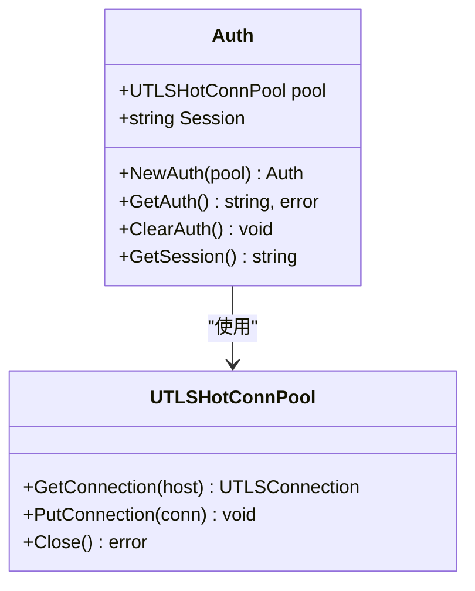

**图表来源**
- [geauth.go](file://GoogleEarth/geauth.go#L14-L25)
- [utlshotconnpool.go](file://utlsclient/utlshotconnpool.go#L24-L50)

### 数据加密解密模块

提供Google Earth特有的数据加密和解密功能，支持多种加密算法和数据格式。

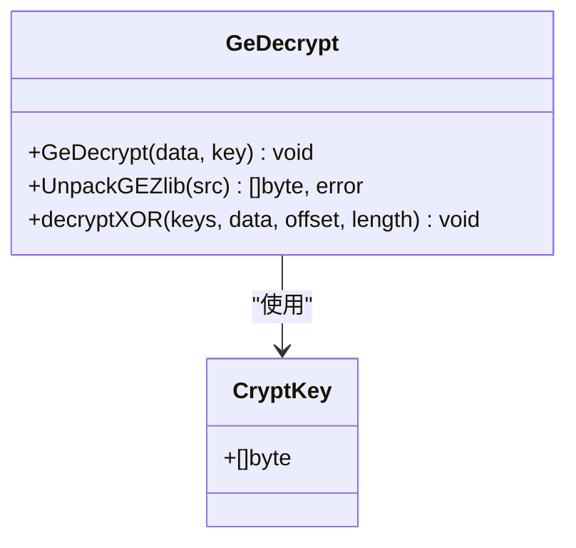

**图表来源**
- [gecrypt.go](file://GoogleEarth/gecrypt.go#L13-L182)

**章节来源**
- [geauth.go](file://GoogleEarth/geauth.go#L1-L200)
- [gecrypt.go](file://GoogleEarth/gecrypt.go#L1-L182)

## 架构概览

Google Earth认证系统采用分层架构设计，从底层的网络连接到顶层的应用接口，形成了完整的数据处理链路。

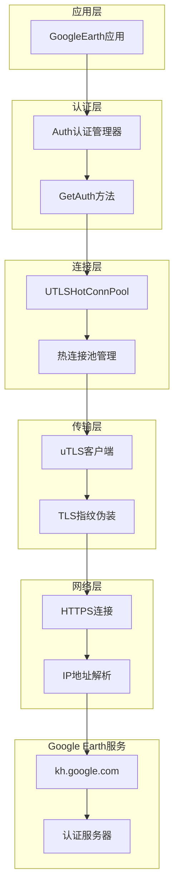

**图表来源**
- [geauth.go](file://GoogleEarth/geauth.go#L27-L94)
- [utlshotconnpool.go](file://utlsclient/utlshotconnpool.go#L1-L200)

## 详细组件分析

### 认证流程组件

认证流程是系统的核心功能，实现了Google Earth特有的认证协议。

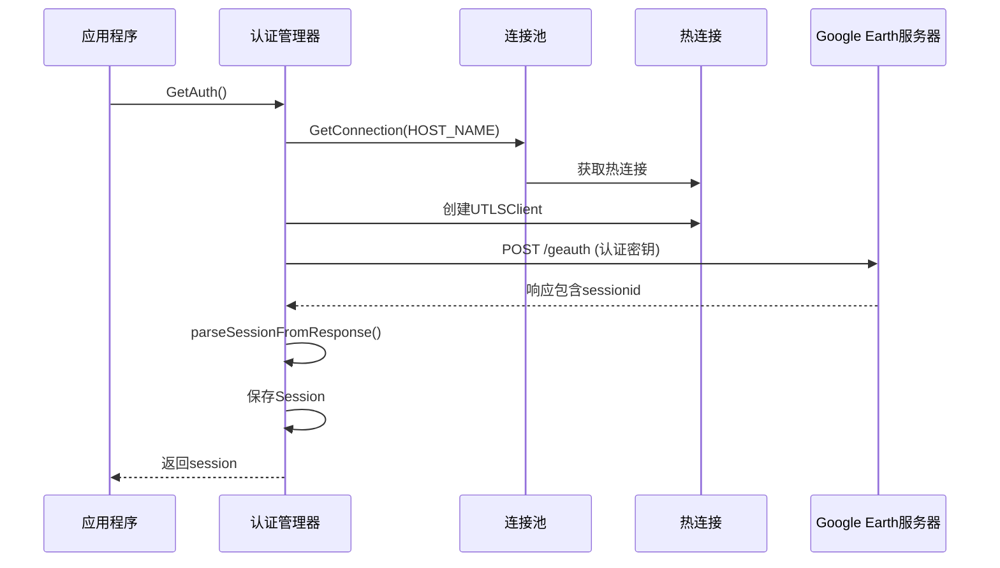

**图表来源**
- [geauth.go](file://GoogleEarth/geauth.go#L27-L94)

#### 认证密钥生成

系统支持多种认证密钥生成策略：

| 密钥类型 | 版本号 | 长度 | 用途 |
|---------|--------|------|------|
| GEAUTH1 | 0x03 | 48字节 | 主认证密钥 |
| GEAUTH2 | 0x01 | 49字节 | 辅助认证密钥 |
| GEAUTH3 | 0x01 | 49字节 | 备用认证密钥 |

**章节来源**
- [geauth.go](file://GoogleEarth/geauth.go#L106-L128)
- [geauth.go](file://GoogleEarth/geauth.go#L156-L200)

### 四叉树路径系统

四叉树路径系统是Google Earth瓦片系统的核心，用于精确定位和管理空间数据。

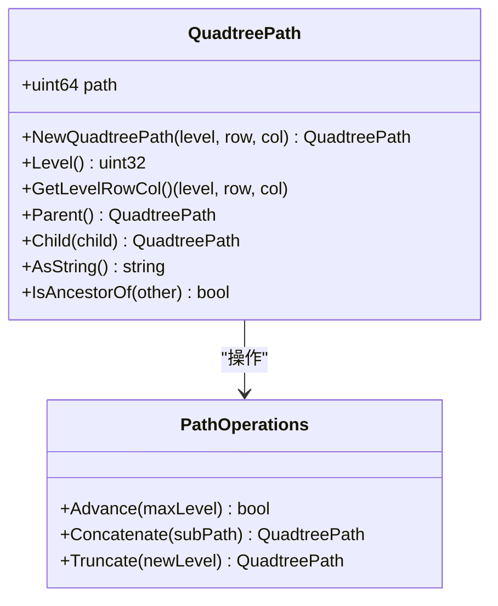

**图表来源**
- [quadtree_path.go](file://GoogleEarth/quadtree_path.go#L13-L265)

#### 四叉树编号规则

Google Earth使用特殊的四叉树编号系统：

```
    c0    c1
  |-----|-----|
r1 |  3  |  2  |
  |-----|-----|
r0 |  0  |  1  |
  |-----|-----|
```

**章节来源**
- [quadtree_path.go](file://GoogleEarth/quadtree_path.go#L27-L146)

### 地形数据处理

地形数据处理模块负责解析和处理Google Earth的地形数据，支持多种数据格式和投影方式。

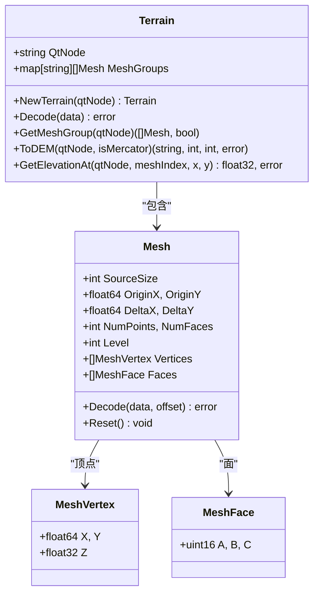

**图表来源**
- [terrain.go](file://GoogleEarth/terrain.go#L145-L307)

**章节来源**
- [terrain.go](file://GoogleEarth/terrain.go#L1-L307)

## 认证流程

### 认证步骤详解

Google Earth认证流程包含以下关键步骤：

1. **连接建立**：从热连接池获取到kh.google.com的热连接
2. **密钥生成**：生成随机认证密钥（49字节）
3. **请求发送**：发送POST请求到/geauth端点
4. **响应解析**：从响应中提取sessionid
5. **会话保存**：将sessionid保存到认证管理器中

### 认证密钥格式

认证密钥遵循Google Earth特定的格式规范：

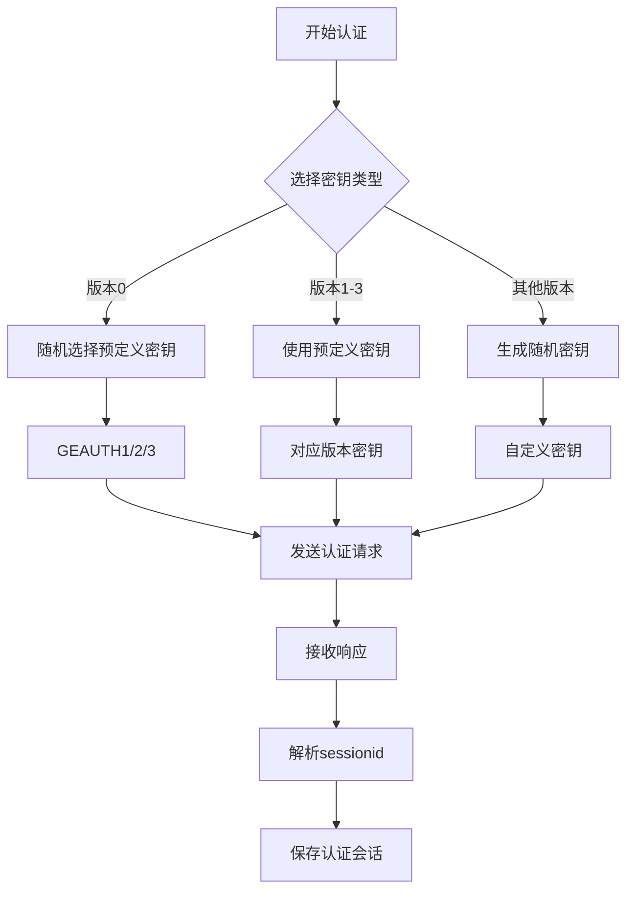

**图表来源**
- [geauth.go](file://GoogleEarth/geauth.go#L164-L200)

**章节来源**
- [geauth.go](file://GoogleEarth/geauth.go#L27-L94)

## 数据加密与解密

### 加密算法

系统实现了Google Earth特有的XOR加密算法，支持多种加密场景：

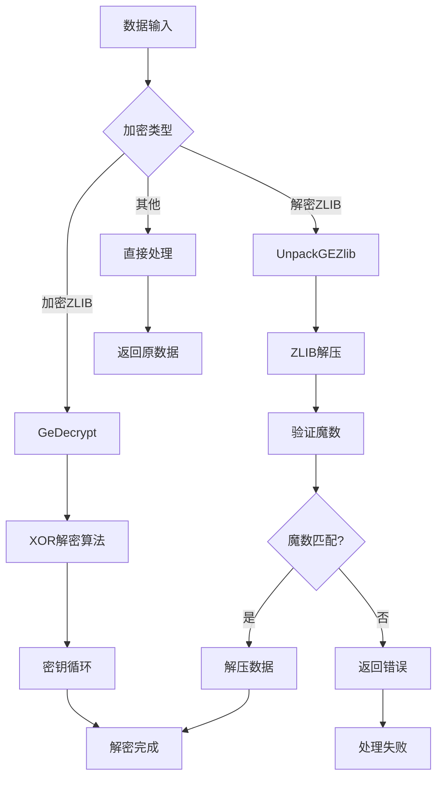

**图表来源**
- [gecrypt.go](file://GoogleEarth/gecrypt.go#L13-L182)

### 加密密钥管理

系统维护了一个固定的加密密钥，用于解密Google Earth数据：

| 密钥用途 | 密钥长度 | 位置 |
|---------|----------|------|
| 默认解密 | 1024字节 | CryptKey变量 |
| 数据解密 | 可变 | 参数传递 |

**章节来源**
- [gecrypt.go](file://GoogleEarth/gecrypt.go#L1-L182)

## 四叉树路径系统

### 路径编码

四叉树路径采用压缩存储方式，使用64位整数高效存储路径信息：

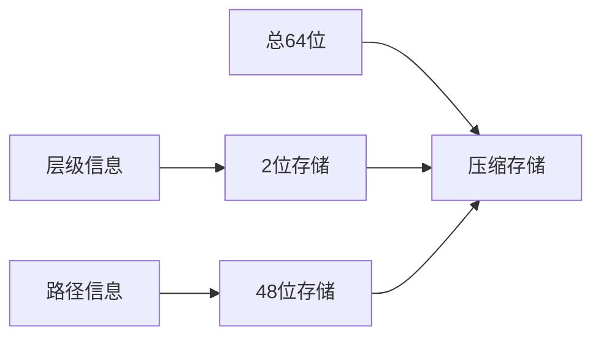

**图表来源**
- [quadtree_path.go](file://GoogleEarth/quadtree_path.go#L13-L265)

### 路径操作

系统提供了丰富的路径操作功能：

| 操作类型 | 功能描述 | 时间复杂度 |
|---------|----------|-----------|
| NewQuadtreePath | 从层级行列创建路径 | O(n) |
| GetLevelRowCol | 获取层级和行列坐标 | O(1) |
| Parent | 获取父节点路径 | O(1) |
| Child | 获取子节点路径 | O(1) |
| Advance | 前序遍历下一个节点 | O(1) |

**章节来源**
- [quadtree_path.go](file://GoogleEarth/quadtree_path.go#L1-L265)

## 地形数据处理

### 数据格式

地形数据采用Google Earth特有的格式，支持多种投影方式：

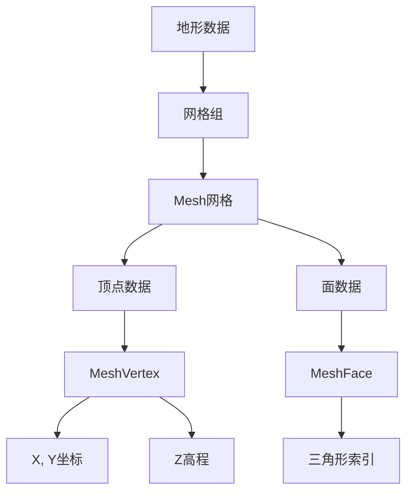

**图表来源**
- [terrain.go](file://GoogleEarth/terrain.go#L145-L307)

### DEM转换

系统支持将地形数据转换为标准的DEM格式：

| 输出格式 | 描述 | 用途 |
|---------|------|------|
| XYZ格式 | 标准DEM格式 | GIS软件兼容 |
| 网格尺寸 | 基于网格数量计算 | 空间分辨率 |
| 坐标系统 | WGS84地理坐标系 | 地理参考 |

**章节来源**
- [terrain.go](file://GoogleEarth/terrain.go#L1-L307)

## 性能考虑

### 连接池优化

系统采用了多层次的性能优化策略：

1. **预热机制**：预先建立连接，减少首次访问延迟
2. **连接复用**：HTTP/2协议支持连接复用
3. **健康检查**：定期检查连接可用性
4. **负载均衡**：智能选择最佳连接

### 内存管理

- **零拷贝设计**：尽量避免不必要的数据复制
- **缓冲区复用**：重用I/O缓冲区
- **垃圾回收优化**：减少GC压力

## 故障排除指南

### 常见问题及解决方案

| 问题类型 | 症状 | 可能原因 | 解决方案 |
|---------|------|----------|----------|
| 认证失败 | GetAuth返回错误 | 网络连接问题 | 检查网络连接和防火墙设置 |
| 解密失败 | 数据解析错误 | 密钥不匹配 | 验证加密密钥配置 |
| 路径错误 | 四叉树操作异常 | 路径格式错误 | 检查路径编码和解码逻辑 |
| 性能问题 | 响应缓慢 | 连接池配置不当 | 调整连接池参数 |

### 调试技巧

1. **启用详细日志**：设置适当的日志级别
2. **监控连接状态**：观察连接池统计信息
3. **验证数据完整性**：检查加密和解密过程
4. **测试网络连通性**：确保目标服务器可达

**章节来源**
- [geauth_test.go](file://test/googleearth/geauth_test.go#L1-L227)

## 结论

Google Earth认证系统是一个功能完整、性能优异的专用认证框架。它成功地解决了与Google Earth Web服务交互的技术挑战，提供了稳定可靠的认证服务。

### 主要优势

1. **高性能**：通过热连接池和连接复用实现显著的性能提升
2. **稳定性**：完善的错误处理和重试机制
3. **可扩展性**：模块化设计便于功能扩展
4. **安全性**：TLS指纹伪装和数据加密保护

### 应用前景

该系统不仅适用于Google Earth数据的获取和处理，还可以作为其他类似Web服务认证的参考实现，具有广泛的适用性和推广价值。