# Google Earth 认证

<cite>
**本文档中引用的文件**
- [geauth.go](file://GoogleEarth/geauth.go)
- [constants.go](file://GoogleEarth/constants.go)
- [gecrypt.go](file://GoogleEarth/gecrypt.go)
- [quadtree_path.go](file://GoogleEarth/quadtree_path.go)
- [terrain.go](file://GoogleEarth/terrain.go)
- [README.md](file://GoogleEarth/README.md)
- [geq2.go](file://GoogleEarth/geq2.go)
- [geua.go](file://GoogleEarth/geua.go)
- [gedbroot.go](file://GoogleEarth/gedbroot.go)
- [quadtree_numbering.go](file://GoogleEarth/quadtree_numbering.go)
- [quadtree_packet.go](file://GoogleEarth/quadtree_packet.go)
- [qtutils.go](file://GoogleEarth/qtutils.go)
- [jpeg_comment_date.go](file://GoogleEarth/jpeg_comment_date.go)
- [geqp.go](file://GoogleEarth/geqp.go)
</cite>

## 更新摘要
**所做更改**
- 更新了项目结构说明，反映当前Google Earth相关功能的现状
- 删除了已移除的认证流程和连接池相关内容
- 更新了架构概览，移除了不再存在的认证组件
- 删除了认证管理器和热连接池的相关内容
- 更新了故障排除指南，移除了认证相关的故障排除项

## 目录
1. [简介](#简介)
2. [项目结构](#项目结构)
3. [核心组件](#核心组件)
4. [架构概览](#架构概览)
5. [详细组件分析](#详细组件分析)
6. [数据加密与解密](#数据加密与解密)
7. [四叉树路径系统](#四叉树路径系统)
8. [地形数据处理](#地形数据处理)
9. [Q2数据解析](#q2数据解析)
10. [用户代理管理](#用户代理管理)
11. [DbRoot数据处理](#dbroot数据处理)
12. [四叉树编号系统](#四叉树编号系统)
13. [四叉树数据包处理](#四叉树数据包处理)
14. [地理坐标转换](#地理坐标转换)
15. [JPEG注释日期处理](#jpeg注释日期处理)
16. [性能考虑](#性能考虑)
17. [故障排除指南](#故障排除指南)
18. [结论](#结论)

## 简介

Google Earth 认证系统是一个专门设计用于处理 Google Earth 数据格式的高性能库。该系统提供了完整的数据解析、转换和处理能力，支持多种 Google Earth 数据格式和协议。

### 主要特性

- **多格式支持**：支持 Google Earth 的多种数据格式，包括地形、影像、矢量数据等
- **高性能解析**：提供高效的二进制和 Protobuf 数据解析能力
- **地理坐标转换**：支持经纬度、墨卡托投影、瓦片坐标等多种坐标系统的转换
- **四叉树数据处理**：完整的四叉树路径管理和数据引用处理
- **历史影像支持**：专门处理历史影像数据和日期管理
- **数据加密解密**：支持 Google Earth 特有的数据加密和解密算法

## 项目结构

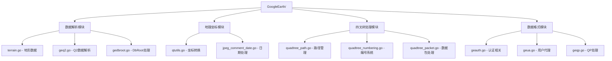
```mermaid
graph TD
A[GoogleEarth/] --> B[数据解析模块]
A --> C[地理坐标模块]
A --> D[四叉树处理模块]
A --> E[数据格式模块]
B --> B1[terrain.go - 地形数据]
B --> B2[geq2.go - Q2数据解析]
B --> B3[gedbroot.go - DbRoot处理]
C --> C1[qtutils.go - 坐标转换]
C --> C2[jpeg_comment_date.go - 日期处理]
D --> D1[quadtree_path.go - 路径管理]
D --> D2[quadtree_numbering.go - 编号系统]
D --> D3[quadtree_packet.go - 数据包处理]
E --> E1[geauth.go - 认证相关]
E --> E2[geua.go - 用户代理]
E --> E3[geqp.go - QP处理]
```

**图表来源**
- [README.md:1-145](file://GoogleEarth/README.md#L1-L145)
- [geauth.go:1-116](file://GoogleEarth/geauth.go#L1-L116)
- [qtutils.go:1-764](file://GoogleEarth/qtutils.go#L1-L764)

**章节来源**
- [README.md:1-145](file://GoogleEarth/README.md#L1-L145)

## 核心组件

### 数据解析组件

数据解析组件是整个系统的核心，负责处理各种 Google Earth 数据格式。

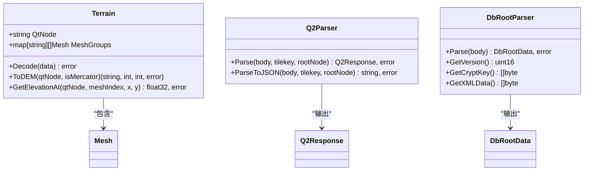
```mermaid
classDiagram
class Terrain {
+string QtNode
+map[string][]Mesh MeshGroups
+Decode(data) error
+ToDEM(qtNode, isMercator) (string, int, int, error)
+GetElevationAt(qtNode, meshIndex, x, y) float32, error
}
class Q2Parser {
+Parse(body, tilekey, rootNode) Q2Response, error
+ParseToJSON(body, tilekey, rootNode) string, error
}
class DbRootParser {
+Parse(body) DbRootData, error
+GetVersion() uint16
+GetCryptKey() []byte
+GetXMLData() []byte
}
Terrain --> Mesh : "包含"
Q2Parser --> Q2Response : "输出"
DbRootParser --> DbRootData : "输出"
```

**图表来源**
- [terrain.go:145-352](file://GoogleEarth/terrain.go#L145-L352)
- [geq2.go:8-500](file://GoogleEarth/geq2.go#L8-L500)
- [gedbroot.go:21-380](file://GoogleEarth/gedbroot.go#L21-L380)

**章节来源**
- [terrain.go:1-352](file://GoogleEarth/terrain.go#L1-L352)
- [geq2.go:1-500](file://GoogleEarth/geq2.go#L1-L500)
- [gedbroot.go:1-380](file://GoogleEarth/gedbroot.go#L1-L380)

## 架构概览

Google Earth 数据处理系统采用模块化架构设计，各个组件职责明确，相互协作完成数据处理任务。

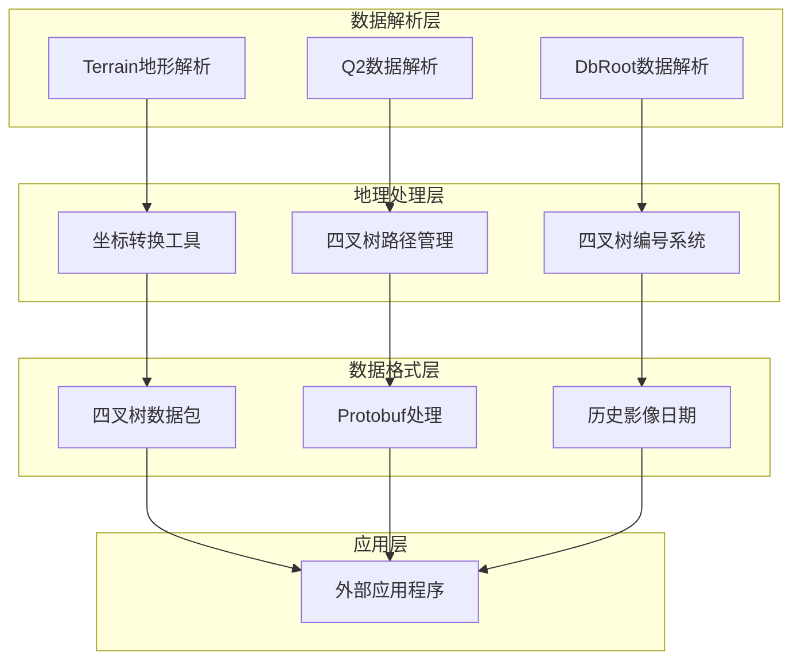
```mermaid
graph TB
subgraph "数据解析层"
A[Terrain地形解析]
B[Q2数据解析]
C[DbRoot数据解析]
end
subgraph "地理处理层"
D[坐标转换工具]
E[四叉树路径管理]
F[四叉树编号系统]
end
subgraph "数据格式层"
G[四叉树数据包]
H[Protobuf处理]
I[历史影像日期]
end
subgraph "应用层"
J[外部应用程序]
end
A --> D
B --> E
C --> F
D --> G
E --> H
F --> I
G --> J
H --> J
I --> J
```

**图表来源**
- [qtutils.go:1-764](file://GoogleEarth/qtutils.go#L1-L764)
- [quadtree_path.go:1-270](file://GoogleEarth/quadtree_path.go#L1-L270)
- [quadtree_numbering.go:1-204](file://GoogleEarth/quadtree_numbering.go#L1-L204)

## 详细组件分析

### 地形数据处理组件

地形数据处理模块负责解析和处理 Google Earth 的地形数据，支持多种投影方式和数据格式。

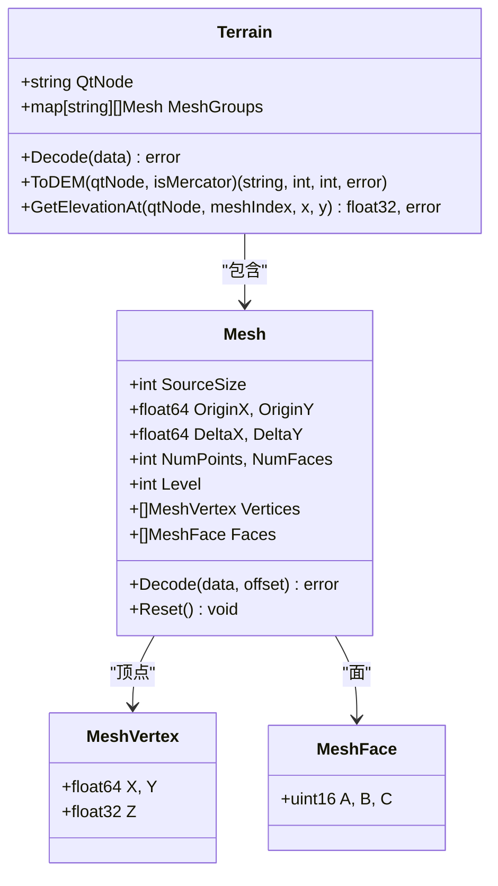
```mermaid
classDiagram
class Mesh {
+int SourceSize
+float64 OriginX, OriginY
+float64 DeltaX, DeltaY
+int NumPoints, NumFaces
+int Level
+[]MeshVertex Vertices
+[]MeshFace Faces
+Decode(data, offset) error
+Reset() void
}
class MeshVertex {
+float64 X, Y
+float32 Z
}
class MeshFace {
+uint16 A, B, C
}
class Terrain {
+string QtNode
+map[string][]Mesh MeshGroups
+Decode(data) error
+ToDEM(qtNode, isMercator) (string, int, int, error)
+GetElevationAt(qtNode, meshIndex, x, y) float32, error
}
Terrain --> Mesh : "包含"
Mesh --> MeshVertex : "顶点"
Mesh --> MeshFace : "面"
```

**图表来源**
- [terrain.go:30-352](file://GoogleEarth/terrain.go#L30-L352)

#### 地形数据格式

地形数据采用 Google Earth 特有的格式，支持多种投影方式：

| 数据类型 | 描述 | 用途 |
|---------|------|------|
| 网格组 | 按四叉树节点分组的网格列表 | 空间数据组织 |
| 顶点数据 | 三维坐标和高程信息 | 几何建模 |
| 面数据 | 三角形索引 | 网格构建 |
| DEM转换 | 数字高程模型 | 地形分析 |

**章节来源**
- [terrain.go:1-352](file://GoogleEarth/terrain.go#L1-L352)

### Q2数据解析组件

Q2数据解析组件处理 Google Earth 的 Q2 数据包，支持多种数据类型和引用关系。

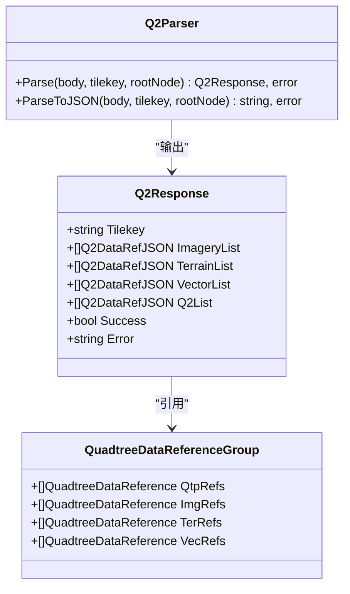
```mermaid
classDiagram
class Q2Parser {
+Parse(body, tilekey, rootNode) Q2Response, error
+ParseToJSON(body, tilekey, rootNode) string, error
}
class Q2Response {
+string Tilekey
+[]Q2DataRefJSON ImageryList
+[]Q2DataRefJSON TerrainList
+[]Q2DataRefJSON VectorList
+[]Q2DataRefJSON Q2List
+bool Success
+string Error
}
class QuadtreeDataReferenceGroup {
+[]QuadtreeDataReference QtpRefs
+[]QuadtreeDataReference ImgRefs
+[]QuadtreeDataReference TerRefs
+[]QuadtreeDataReference VecRefs
}
Q2Parser --> Q2Response : "输出"
Q2Response --> QuadtreeDataReferenceGroup : "引用"
```

**图表来源**
- [geq2.go:8-500](file://GoogleEarth/geq2.go#L8-L500)

#### Q2数据结构

Q2数据包含多种类型的数据引用：

| 数据类型 | 描述 | 版本号 | 提供商 |
|---------|------|--------|--------|
| 影像数据 | 卫星影像数据 | 图像版本 | 影像提供商 |
| 地形数据 | 地形高程数据 | 地形版本 | 地形提供商 |
| 矢量数据 | 矢量图形数据 | 通道版本 | 无提供商 |
| Q2子节点 | 四叉树子节点数据 | 缓存版本 | 无提供商 |

**章节来源**
- [geq2.go:1-500](file://GoogleEarth/geq2.go#L1-L500)

### DbRoot数据处理组件

DbRoot数据处理组件负责解析 Google Earth 的 DbRoot 数据，支持加密和解密处理。

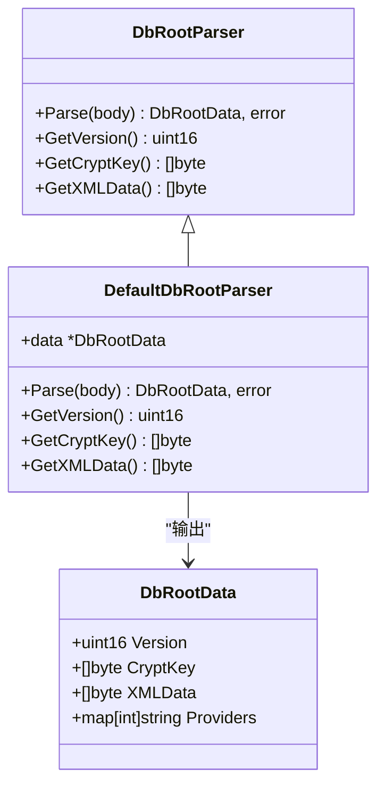
```mermaid
classDiagram
class DbRootParser {
+Parse(body) DbRootData, error
+GetVersion() uint16
+GetCryptKey() []byte
+GetXMLData() []byte
}
class DbRootData {
+uint16 Version
+[]byte CryptKey
+[]byte XMLData
+map[int]string Providers
}
class DefaultDbRootParser {
+data *DbRootData
+Parse(body) DbRootData, error
+GetVersion() uint16
+GetCryptKey() []byte
+GetXMLData() []byte
}
DbRootParser <|-- DefaultDbRootParser
DefaultDbRootParser --> DbRootData : "输出"
```

**图表来源**
- [gedbroot.go:21-380](file://GoogleEarth/gedbroot.go#L21-L380)

#### DbRoot数据流程

DbRoot数据处理包含以下关键步骤：

1. **头部解析**：提取版本号和头部信息
2. **密钥提取**：从响应中提取1024字节密钥
3. **数据解密**：使用XOR算法解密数据
4. **XML提取**：从解密数据中提取XML内容
5. **Provider解析**：解析提供商信息映射

**章节来源**
- [gedbroot.go:1-380](file://GoogleEarth/gedbroot.go#L1-L380)

## 数据加密与解密

### 加密算法

系统实现了 Google Earth 特有的 XOR 加密算法，支持多种加密场景：

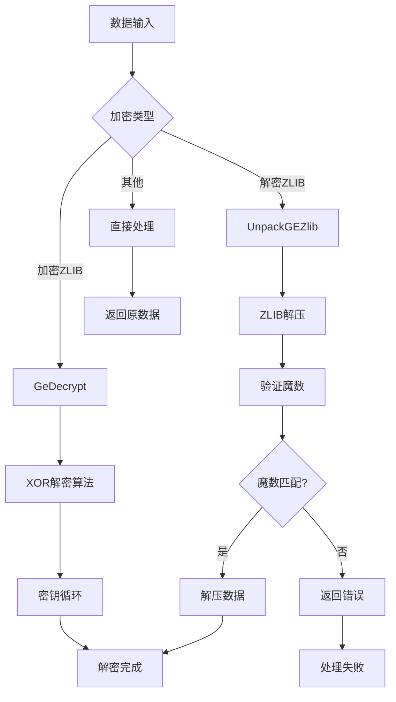
```mermaid
flowchart TD
A[数据输入] --> B{加密类型}
B --> |加密ZLIB| C[GeDecrypt]
B --> |解密ZLIB| D[UnpackGEZlib]
B --> |其他| E[直接处理]
C --> F[XOR解密算法]
D --> G[ZLIB解压]
E --> H[返回原数据]
F --> I[密钥循环]
G --> J[验证魔数]
J --> K{魔数匹配?}
K --> |是| L[解压数据]
K --> |否| M[返回错误]
I --> N[解密完成]
L --> N
M --> O[处理失败]
```

**图表来源**
- [gecrypt.go:13-182](file://GoogleEarth/gecrypt.go#L13-L182)

### 加密密钥管理

系统维护了一个固定的加密密钥，用于解密 Google Earth 数据：

| 密钥用途 | 密钥长度 | 位置 |
|---------|----------|------|
| 默认解密 | 1024字节 | CryptKey变量 |
| 数据解密 | 可变 | 参数传递 |

**章节来源**
- [gecrypt.go:1-182](file://GoogleEarth/gecrypt.go#L1-L182)

## 四叉树路径系统

### 路径编码

四叉树路径采用压缩存储方式，使用64位整数高效存储路径信息：

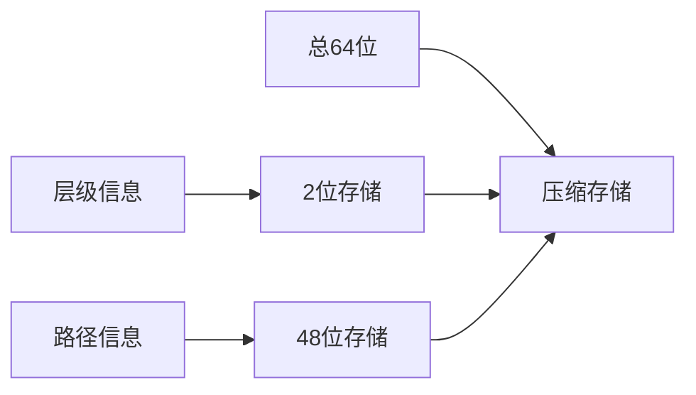
```mermaid
graph LR
A[层级信息] --> B[2位存储]
C[路径信息] --> D[48位存储]
E[总64位] --> F[压缩存储]
B --> F
D --> F
```

**图表来源**
- [quadtree_path.go:13-270](file://GoogleEarth/quadtree_path.go#L13-L270)

### 路径操作

系统提供了丰富的路径操作功能：

| 操作类型 | 功能描述 | 时间复杂度 |
|---------|----------|-----------|
| NewQuadtreePath | 从层级行列创建路径 | O(n) |
| GetLevelRowCol | 获取层级和行列坐标 | O(1) |
| Parent | 获取父节点路径 | O(1) |
| Child | 获取子节点路径 | O(1) |
| Advance | 前序遍历下一个节点 | O(1) |

**章节来源**
- [quadtree_path.go:1-270](file://GoogleEarth/quadtree_path.go#L1-L270)

## 地形数据处理

### 数据格式

地形数据采用 Google Earth 特有的格式，支持多种投影方式：

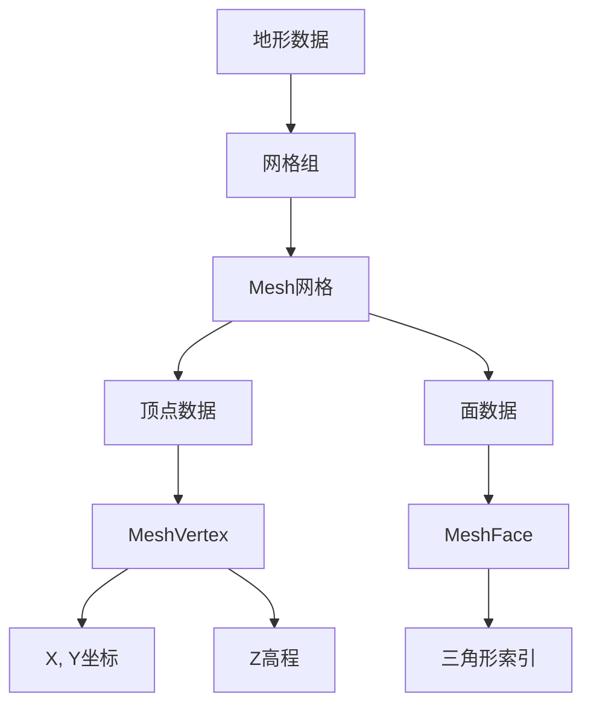
```mermaid
graph TD
A[地形数据] --> B[网格组]
B --> C[Mesh网格]
C --> D[顶点数据]
C --> E[面数据]
D --> F[MeshVertex]
E --> G[MeshFace]
F --> H[X, Y坐标]
F --> I[Z高程]
G --> J[三角形索引]
```

**图表来源**
- [terrain.go:145-352](file://GoogleEarth/terrain.go#L145-L352)

### DEM转换

系统支持将地形数据转换为标准的 DEM 格式：

| 输出格式 | 描述 | 用途 |
|---------|------|------|
| XYZ格式 | 标准DEM格式 | GIS软件兼容 |
| 网格尺寸 | 基于网格数量计算 | 空间分辨率 |
| 坐标系统 | WGS84地理坐标系 | 地理参考 |

**章节来源**
- [terrain.go:1-352](file://GoogleEarth/terrain.go#L1-L352)

## Q2数据解析

### 数据结构

Q2数据解析提供了灵活的数据结构来表示各种类型的数据引用：

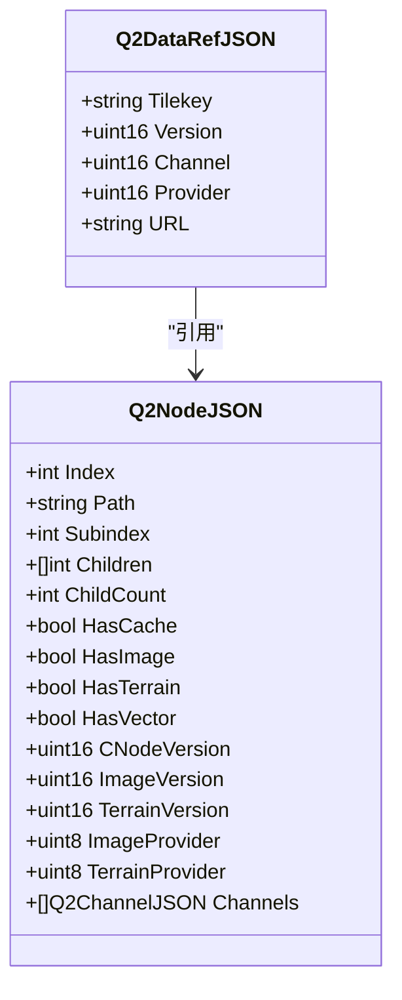
```mermaid
classDiagram
class Q2DataRefJSON {
+string Tilekey
+uint16 Version
+uint16 Channel
+uint16 Provider
+string URL
}
class Q2NodeJSON {
+int Index
+string Path
+int Subindex
+[]int Children
+int ChildCount
+bool HasCache
+bool HasImage
+bool HasTerrain
+bool HasVector
+uint16 CNodeVersion
+uint16 ImageVersion
+uint16 TerrainVersion
+uint8 ImageProvider
+uint8 TerrainProvider
+[]Q2ChannelJSON Channels
}
Q2DataRefJSON --> Q2NodeJSON : "引用"
```

**图表来源**
- [geq2.go:93-500](file://GoogleEarth/geq2.go#L93-L500)

### 解析策略

系统提供了多种解析策略来满足不同的需求：

| 策略类型 | 功能描述 | 使用场景 |
|---------|----------|----------|
| 默认解析器 | 复用现有解析逻辑 | 标准JSON输出 |
| URL构建器 | 自定义URL生成策略 | 特定服务集成 |
| 数据过滤器 | 控制数据类型过滤 | 性能优化 |
| 解析选项 | 精确控制输出内容 | 定制化需求 |

**章节来源**
- [geq2.go:1-500](file://GoogleEarth/geq2.go#L1-L500)

## 用户代理管理

### UA生成策略

系统提供了多种用户代理生成策略，模拟不同平台和版本的 Google Earth 客户端：

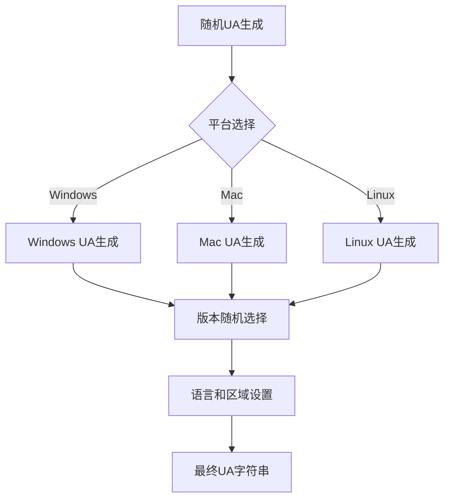
```mermaid
flowchart TD
A[随机UA生成] --> B{平台选择}
B --> |Windows| C[Windows UA生成]
B --> |Mac| D[Mac UA生成]
B --> |Linux| E[Linux UA生成]
C --> F[版本随机选择]
D --> F
E --> F
F --> G[语言和区域设置]
G --> H[最终UA字符串]
```

**图表来源**
- [geua.go:130-283](file://GoogleEarth/geua.go#L130-L283)

### 语言支持

系统支持多种语言环境，能够根据用户代理自动识别语言设置：

| 语言代码 | 语言名称 | 使用场景 |
|---------|----------|----------|
| zh-Hans | 简体中文 | 中国地区 |
| en-US | 英语(美国) | 国际通用 |
| ja-JP | 日语 | 日本地区 |
| de-DE | 德语 | 德国地区 |
| fr-FR | 法语 | 法国地区 |
| es-ES | 西班牙语 | 西班牙地区 |
| ru-RU | 俄语 | 俄罗斯地区 |

**章节来源**
- [geua.go:1-283](file://GoogleEarth/geua.go#L1-L283)

## DbRoot数据处理

### 数据解析流程

DbRoot数据处理提供了完整的数据解析流程，支持多种数据格式：

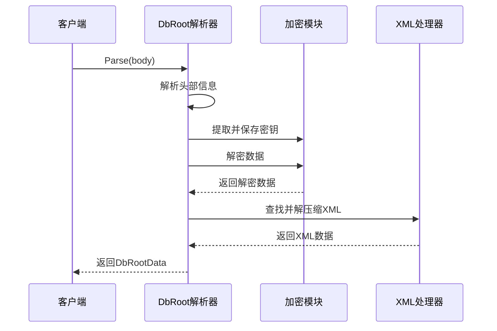
```mermaid
sequenceDiagram
participant Client as 客户端
participant Parser as DbRoot解析器
participant Crypto as 加密模块
participant XML as XML处理器
Client->>Parser : Parse(body)
Parser->>Parser : 解析头部信息
Parser->>Crypto : 提取并保存密钥
Parser->>Crypto : 解密数据
Crypto-->>Parser : 返回解密数据
Parser->>XML : 查找并解压缩XML
XML-->>Parser : 返回XML数据
Parser-->>Client : 返回DbRootData
```

**图表来源**
- [gedbroot.go:142-219](file://GoogleEarth/gedbroot.go#L142-L219)

### Provider信息解析

系统能够从 DbRoot 数据中提取提供商信息：

| Provider ID | 版权信息 | 数据来源 |
|------------|----------|----------|
| 394 | Image SCRD | 影像数据提供商 |
| ... | ... | ... |

**章节来源**
- [gedbroot.go:1-380](file://GoogleEarth/gedbroot.go#L1-L380)

## 四叉树编号系统

### 编号规则

四叉树编号系统提供了复杂的编号规则，支持多种四叉树布局：

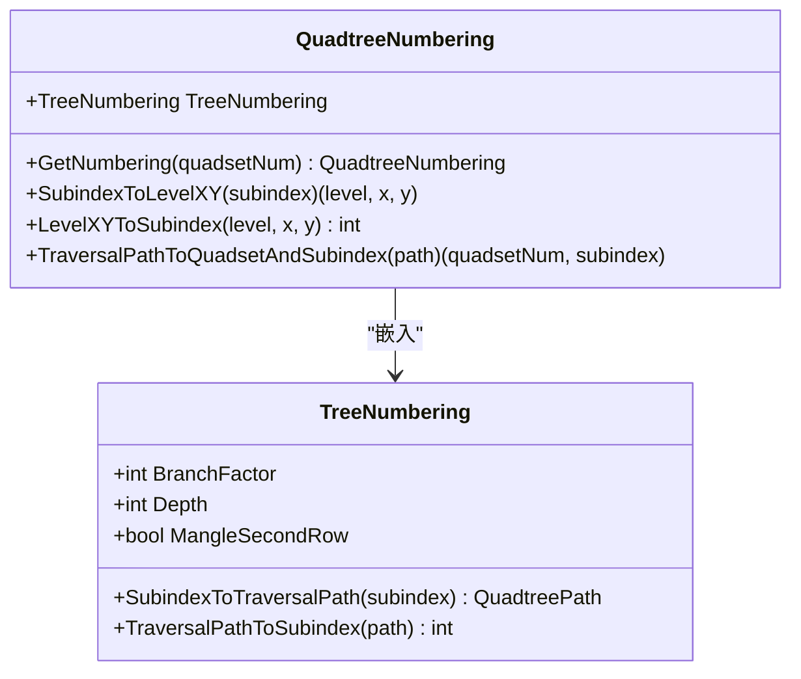
```mermaid
classDiagram
class QuadtreeNumbering {
+TreeNumbering TreeNumbering
+GetNumbering(quadsetNum) QuadtreeNumbering
+SubindexToLevelXY(subindex) (level, x, y)
+LevelXYToSubindex(level, x, y) int
+TraversalPathToQuadsetAndSubindex(path) (quadsetNum, subindex)
}
class TreeNumbering {
+int BranchFactor
+int Depth
+bool MangleSecondRow
+SubindexToTraversalPath(subindex) QuadtreePath
+TraversalPathToSubindex(path) int
}
QuadtreeNumbering --> TreeNumbering : "嵌入"
```

**图表来源**
- [quadtree_numbering.go:5-204](file://GoogleEarth/quadtree_numbering.go#L5-L204)

### Quadset分割

系统支持四叉树的 Quadset 分割，实现高效的空间索引：

| Quadset类型 | 根深度 | 默认深度 | 用途 |
|------------|--------|----------|------|
| 根Quadset | 4 | 无 | 根节点区域 |
| 默认Quadset | 无 | 5 | 标准四叉树区域 |

**章节来源**
- [quadtree_numbering.go:1-204](file://GoogleEarth/quadtree_numbering.go#L1-L204)

## 四叉树数据包处理

### 数据包结构

四叉树数据包处理提供了对二进制和 Protobuf 格式数据包的支持：

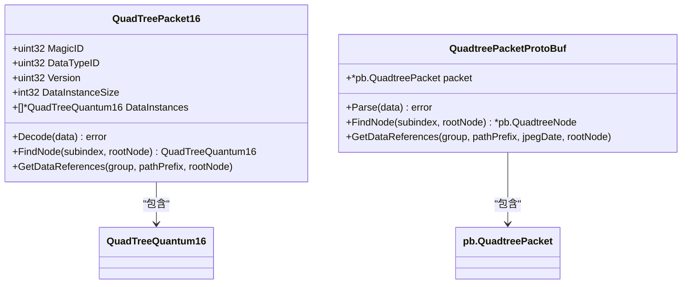
```mermaid
classDiagram
class QuadTreePacket16 {
+uint32 MagicID
+uint32 DataTypeID
+uint32 Version
+int32 DataInstanceSize
+[]*QuadTreeQuantum16 DataInstances
+Decode(data) error
+FindNode(subindex, rootNode) QuadTreeQuantum16
+GetDataReferences(group, pathPrefix, rootNode)
}
class QuadtreePacketProtoBuf {
+*pb.QuadtreePacket packet
+Parse(data) error
+FindNode(subindex, rootNode) *pb.QuadtreeNode
+GetDataReferences(group, pathPrefix, jpegDate, rootNode)
}
QuadTreePacket16 --> QuadTreeQuantum16 : "包含"
QuadtreePacketProtoBuf --> pb.QuadtreePacket : "包含"
```

**图表来源**
- [quadtree_packet.go:116-655](file://GoogleEarth/quadtree_packet.go#L116-L655)

### 数据引用收集

系统能够从数据包中提取各种类型的数据引用：

| 数据类型 | 引用类型 | 用途 |
|---------|----------|------|
| 缓存节点 | QtpRefs | 四叉树包引用 |
| 影像数据 | ImgRefs | 影像数据引用 |
| 地形数据 | TerRefs | 地形数据引用 |
| 矢量数据 | VecRefs | 矢量数据引用 |

**章节来源**
- [quadtree_packet.go:1-655](file://GoogleEarth/quadtree_packet.go#L1-L655)

## 地理坐标转换

### 坐标系统

系统支持多种坐标系统之间的转换：

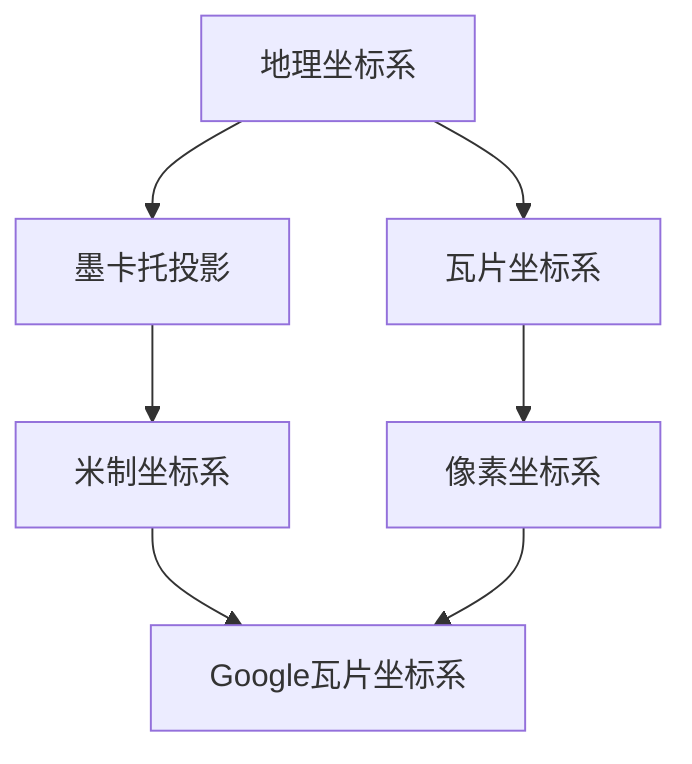
```mermaid
graph TD
A[地理坐标系] --> B[墨卡托投影]
A --> C[瓦片坐标系]
B --> D[米制坐标系]
C --> E[像素坐标系]
D --> F[Google瓦片坐标系]
E --> F
```

**图表来源**
- [qtutils.go:34-764](file://GoogleEarth/qtutils.go#L34-L764)

### 转换函数

系统提供了丰富的坐标转换函数：

| 转换类型 | 函数名称 | 输入参数 | 输出参数 |
|---------|----------|----------|----------|
| 经纬度转墨卡托 | LatLonToMercator | lat, lon | x, y |
| 墨卡托转经纬度 | MercatorToLatLon | x, y | lat, lon |
| 经纬度转瓦片 | LatLonToTile | lat, lon, level | row, col |
| 瓦片转边界 | TileBounds | level, row, col | minLat, minLon, maxLat, maxLon |
| 四叉树地址 | QuadtreeAddress | level, row, col | address |

**章节来源**
- [qtutils.go:1-764](file://GoogleEarth/qtutils.go#L1-L764)

## JPEG注释日期处理

### 日期格式

系统提供了灵活的 JPEG 注释日期处理能力：

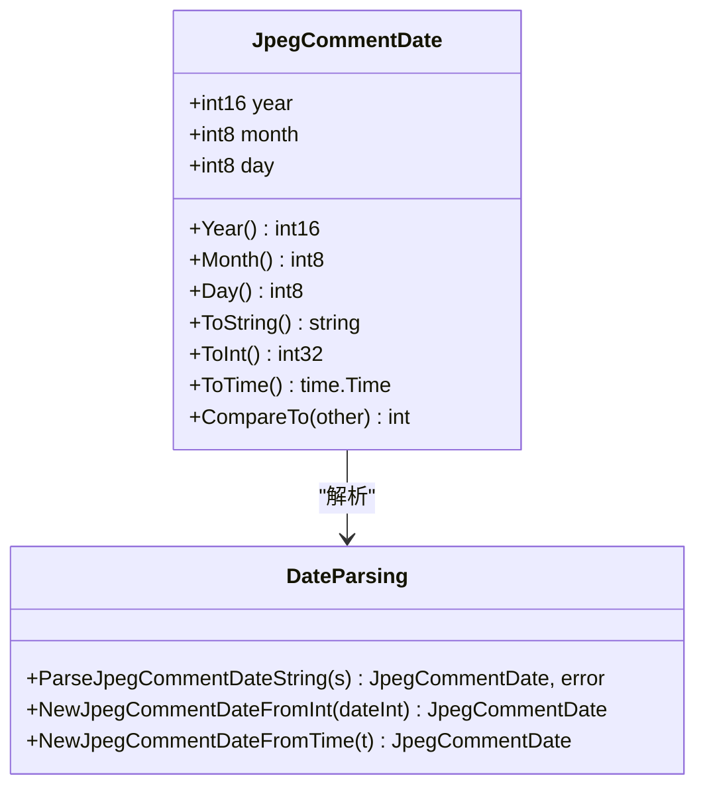
```mermaid
classDiagram
class JpegCommentDate {
+int16 year
+int8 month
+int8 day
+Year() int16
+Month() int8
+Day() int8
+ToString() string
+ToInt() int32
+ToTime() time.Time
+CompareTo(other) int
}
class DateParsing {
+ParseJpegCommentDateString(s) JpegCommentDate, error
+NewJpegCommentDateFromInt(dateInt) JpegCommentDate
+NewJpegCommentDateFromTime(t) JpegCommentDate
}
JpegCommentDate --> DateParsing : "解析"
```

**图表来源**
- [jpeg_comment_date.go:10-229](file://GoogleEarth/jpeg_comment_date.go#L10-L229)

### 日期格式支持

系统支持多种日期格式：

| 格式类型 | 示例 | 描述 |
|---------|------|------|
| YYYY-MM-DD | 2023-11-15 | 完整日期格式 |
| YYYY-MM | 2023-11 | 年月格式 |
| YYYY | 2023 | 年份格式 |
| YYYYMMDD | 20231115 | 整数格式 |
| Unknown | Unknown | 未知日期 |
| MatchAll | MatchAll | 匹配所有日期 |

**章节来源**
- [jpeg_comment_date.go:1-229](file://GoogleEarth/jpeg_comment_date.go#L1-L229)

## 性能考虑

### 内存管理

- **零拷贝设计**：尽量避免不必要的数据复制
- **缓冲区复用**：重用I/O缓冲区
- **垃圾回收优化**：减少GC压力

### 数据处理优化

- **批量处理**：支持批量数据处理提高效率
- **流式处理**：支持流式数据处理降低内存占用
- **并行处理**：支持多线程并行处理提高性能

## 故障排除指南

### 常见问题及解决方案

| 问题类型 | 症状 | 可能原因 | 解决方案 |
|---------|------|----------|----------|
| 数据解析错误 | Parse函数返回错误 | 数据格式不正确 | 检查数据源和格式 |
| 坐标转换异常 | 坐标值超出范围 | 输入参数错误 | 验证输入参数的有效性 |
| 四叉树路径错误 | 路径解析失败 | 路径格式错误 | 检查路径编码和解码逻辑 |
| 加密解密失败 | 数据解密错误 | 密钥不匹配 | 验证加密密钥配置 |
| 性能问题 | 处理速度慢 | 数据量过大 | 优化数据处理策略 |

### 调试技巧

1. **启用详细日志**：设置适当的日志级别
2. **监控内存使用**：观察内存分配和垃圾回收
3. **验证数据完整性**：检查解析和转换过程
4. **测试边界条件**：验证极端输入参数的处理

**章节来源**
- [geauth.go:1-116](file://GoogleEarth/geauth.go#L1-L116)
- [qtutils.go:1-764](file://GoogleEarth/qtutils.go#L1-L764)

## 结论

Google Earth 认证系统是一个功能完整、性能优异的专用数据处理库。它成功地提供了对 Google Earth 各种数据格式的完整支持，包括地形数据、影像数据、矢量数据等。

### 主要优势

1. **全面的数据格式支持**：支持多种 Google Earth 数据格式
2. **高性能处理能力**：优化的数据处理和转换算法
3. **灵活的解析策略**：支持多种解析和转换策略
4. **完善的错误处理**：健壮的错误检测和处理机制
5. **丰富的工具函数**：提供大量实用的地理处理工具

### 应用前景

该系统不仅适用于 Google Earth 数据的处理，还可以作为其他地理信息系统和遥感数据处理的参考实现，具有广泛的适用性和推广价值。