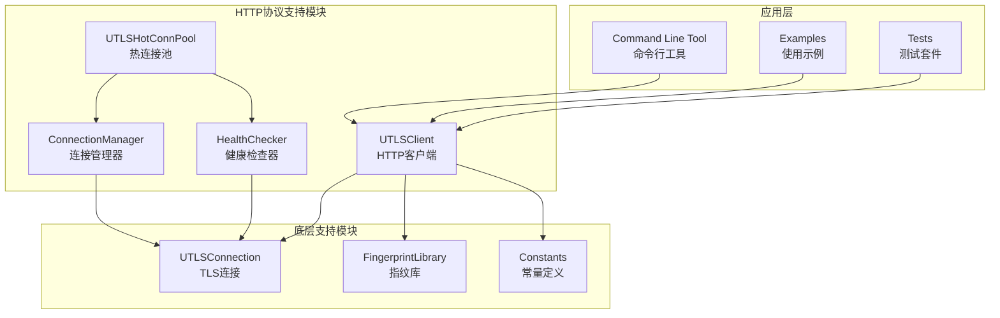
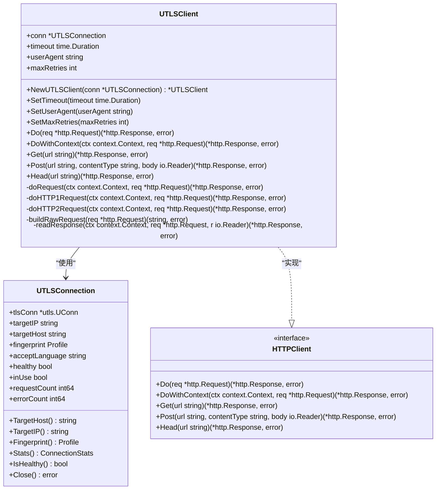
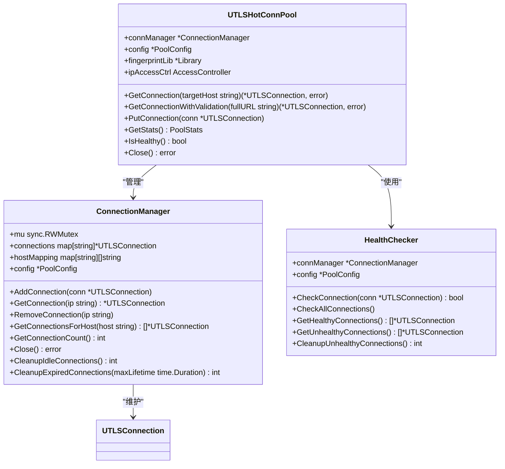
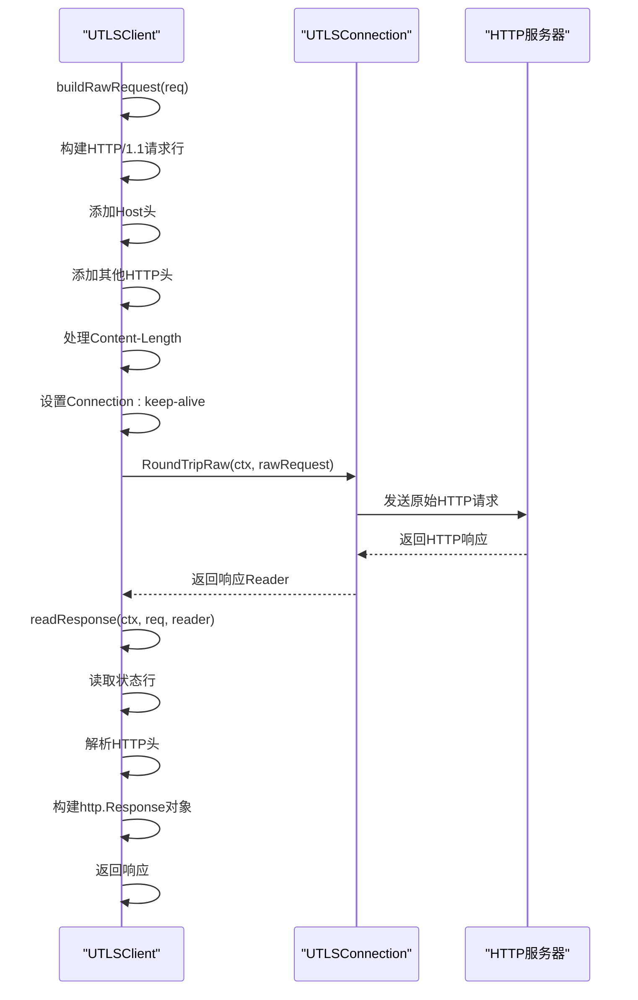
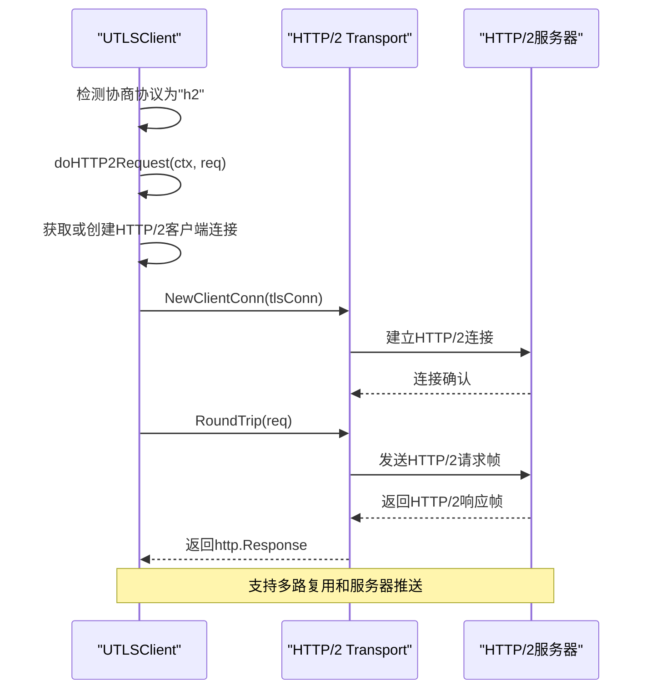
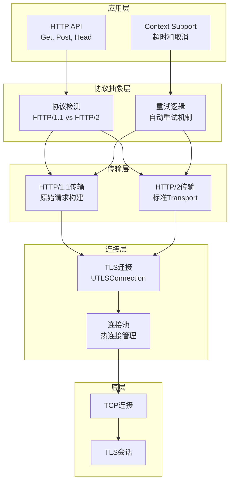
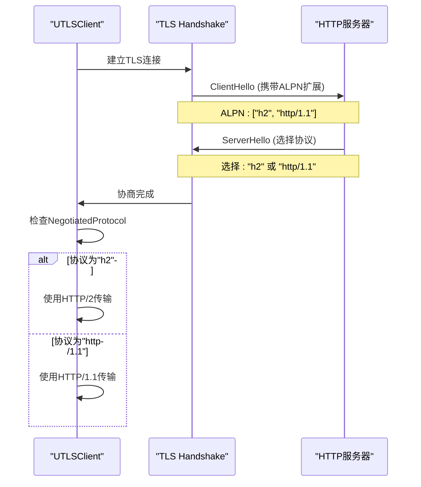
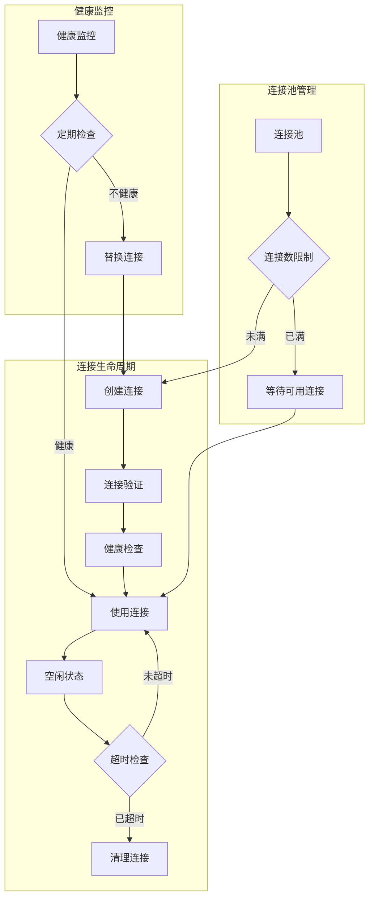
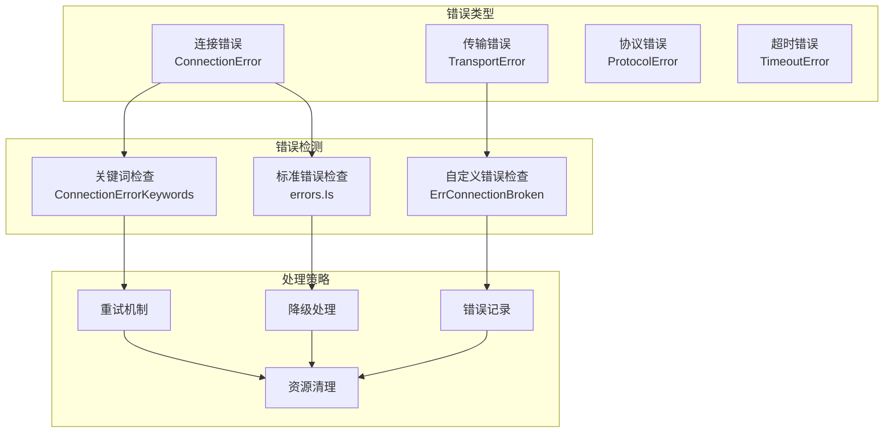
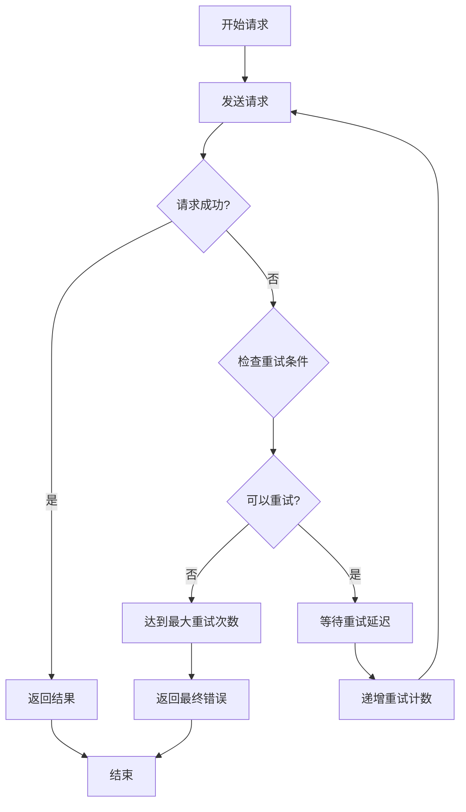

# HTTP协议支持

<cite>
**本文档引用的文件**
- [utlsclient.go](file://utlsclient/utlsclient.go)
- [connection_manager.go](file://utlsclient/connection_manager.go)
- [interfaces.go](file://utlsclient/interfaces.go)
- [constants.go](file://utlsclient/constants.go)
- [utlsfingerprint.go](file://utlsclient/utlsfingerprint.go)
- [health_checker.go](file://utlsclient/health_checker.go)
- [utlshotconnpool.go](file://utlsclient/utlshotconnpool.go)
- [main.go](file://cmd/utlsclient/main.go)
- [example_utlsclient_usage.go](file://examples/utlsclient/example_utlsclient_usage.go)
- [utlsclient_test.go](file://test/utlsclient/utlsclient_test.go)
- [connection_helpers.go](file://utlsclient/connection_helpers.go)
</cite>

## 目录
1. [简介](#简介)
2. [项目结构概览](#项目结构概览)
3. [核心组件分析](#核心组件分析)
4. [HTTP协议实现详解](#http协议实现详解)
5. [UTLSClient架构设计](#utlsclient架构设计)
6. [协议自动检测机制](#协议自动检测机制)
7. [性能优化策略](#性能优化策略)
8. [错误处理与重试机制](#错误处理与重试机制)
9. [最佳实践指南](#最佳实践指南)
10. [故障排除](#故障排除)
11. [总结](#总结)

## 简介

本文档详细介绍了一个基于uTLS的高级HTTP客户端实现，该系统提供了完整的HTTP/1.1和HTTP/2协议支持，并具备智能协议协商能力。系统通过UTLSClient封装底层连接，为开发者提供标准化的HTTP请求接口，同时实现了完善的连接管理和性能优化机制。

该HTTP协议支持系统的核心特性包括：
- 自动协议检测和协商（HTTP/1.1 vs HTTP/2）
- 多种浏览器指纹伪装
- 智能连接池管理
- 健康检查和故障恢复
- 重试机制和错误处理
- 性能监控和统计

## 项目结构概览

该项目采用模块化架构设计，主要包含以下核心模块：



**图表来源**
- [utlsclient.go](file://utlsclient/utlsclient.go#L1-L50)
- [connection_manager.go](file://utlsclient/connection_manager.go#L1-L30)
- [utlshotconnpool.go](file://utlshotconnpool.go#L1-L50)

**章节来源**
- [utlsclient.go](file://utlsclient/utlsclient.go#L1-L100)
- [connection_manager.go](file://utlsclient/connection_manager.go#L1-L50)

## 核心组件分析

### UTLSClient - HTTP客户端核心

UTLSClient是整个HTTP协议支持系统的核心组件，它封装了底层TLS连接并提供了标准化的HTTP请求接口。



**图表来源**
- [utlsclient.go](file://utlsclient/utlsclient.go#L37-L52)
- [interfaces.go](file://utlsclient/interfaces.go#L51-L81)

### 连接管理架构

连接管理系统负责维护和管理所有活跃的TLS连接，提供高效的连接复用和生命周期管理。



**图表来源**
- [connection_manager.go](file://utlsclient/connection_manager.go#L8-L23)
- [utlshotconnpool.go](file://utlsclient/utlshotconnpool.go#L25-L50)
- [health_checker.go](file://utlsclient/health_checker.go#L9-L15)

**章节来源**
- [utlsclient.go](file://utlsclient/utlsclient.go#L37-L100)
- [connection_manager.go](file://utlsclient/connection_manager.go#L8-L50)
- [utlshotconnpool.go](file://utlsclient/utlshotconnpool.go#L25-L100)

## HTTP协议实现详解

### HTTP/1.1协议支持

HTTP/1.1协议通过手动构建原始HTTP请求来实现，这种方式提供了最大的灵活性和控制力。



**图表来源**
- [utlsclient.go](file://utlsclient/utlsclient.go#L191-L214)
- [utlsclient.go](file://utlsclient/utlsclient.go#L216-L331)

HTTP/1.1实现的关键特点：
- **手动请求构建**：通过`buildRawRequest`方法构建完整的HTTP/1.1请求
- **keep-alive连接**：默认使用持久连接以提高性能
- **灵活的头部处理**：支持自定义HTTP头部
- **流式响应处理**：使用`responseBody`包装器实现流式读取

### HTTP/2协议支持

HTTP/2协议通过标准的`http2.Transport`实现，利用二进制分帧和多路复用技术提供更高的性能。



**图表来源**
- [utlsclient.go](file://utlsclient/utlsclient.go#L143-L189)

HTTP/2实现的关键特性：
- **自动协议检测**：通过`NegotiatedProtocol`字段检测协商的协议
- **连接复用**：支持在同一TCP连接上并发处理多个请求
- **流控制**：内置流量控制机制防止拥塞
- **头部压缩**：使用HPACK算法压缩HTTP头部

**章节来源**
- [utlsclient.go](file://utlsclient/utlsclient.go#L121-L141)
- [utlsclient.go](file://utlsclient/utlsclient.go#L143-L189)

## UTLSClient架构设计

### 核心设计理念

UTLSClient采用分层架构设计，每一层都有明确的职责和边界：



**图表来源**
- [utlsclient.go](file://utlsclient/utlsclient.go#L80-L120)
- [interfaces.go](file://utlsclient/interfaces.go#L51-L81)

### 接口设计模式

系统采用接口驱动的设计模式，提供了清晰的抽象层：

| 接口 | 用途 | 实现 |
|------|------|------|
| `HTTPClient` | HTTP客户端标准接口 | `UTLSClient` |
| `IPPoolProvider` | IP池提供者 | `UTLSHotConnPool` |
| `AccessController` | 访问控制 | `IPAccessController` |

这种设计使得系统具有良好的可测试性和可扩展性。

**章节来源**
- [interfaces.go](file://utlsclient/interfaces.go#L1-L81)
- [utlsclient.go](file://utlsclient/utlsclient.go#L80-L120)

## 协议自动检测机制

### TLS握手和ALPN协商

系统通过TLS握手过程中的ALPN（Application-Layer Protocol Negotiation）扩展来自动检测支持的协议：



**图表来源**
- [utlsclient.go](file://utlsclient/utlsclient.go#L130-L141)
- [connection_helpers.go](file://utlsclient/connection_helpers.go#L586-L627)

### 协议选择策略

系统根据多种因素自动选择最优的协议：

| 选择因素 | HTTP/2 | HTTP/1.1 |
|----------|--------|----------|
| 服务器支持 | ✅ | ✅ |
| 连接质量 | ⚠️ | ✅ |
| 请求复杂度 | ⚠️ | ✅ |
| 并发需求 | ✅ | ❌ |
| 延迟要求 | ⚠️ | ✅ |

**章节来源**
- [utlsclient.go](file://utlsclient/utlsclient.go#L130-L141)
- [connection_helpers.go](file://utlsclient/connection_helpers.go#L586-L627)

## 性能优化策略

### 连接复用机制

系统实现了多层次的连接复用策略：



**图表来源**
- [health_checker.go](file://utlsclient/health_checker.go#L23-L60)
- [connection_manager.go](file://utlsclient/connection_manager.go#L141-L178)

### 性能指标监控

系统提供详细的性能监控和统计功能：

| 指标类别 | 监控项目 | 用途 |
|----------|----------|------|
| 连接状态 | 连接数、健康状态 | 资源管理 |
| 请求性能 | 响应时间、成功率 | 性能优化 |
| 错误统计 | 错误类型、频率 | 故障诊断 |
| 资源使用 | 内存、CPU占用 | 资源监控 |

**章节来源**
- [health_checker.go](file://utlsclient/health_checker.go#L23-L90)
- [connection_manager.go](file://utlsclient/connection_manager.go#L93-L110)

## 错误处理与重试机制

### 错误分类体系

系统建立了完善的错误分类和处理体系：



**图表来源**
- [utlsclient.go](file://utlsclient/utlsclient.go#L22-L35)
- [constants.go](file://utlsclient/constants.go#L47-L86)

### 重试策略

系统实现了智能的重试机制：



**图表来源**
- [utlsclient.go](file://utlsclient/utlsclient.go#L104-L119)

重试机制的关键特性：
- **指数退避**：重试延迟随次数递增
- **最大重试次数**：防止无限重试
- **错误过滤**：只对可恢复的错误进行重试
- **上下文支持**：支持请求取消和超时

**章节来源**
- [utlsclient.go](file://utlsclient/utlsclient.go#L22-L35)
- [utlsclient.go](file://utlsclient/utlsclient.go#L104-L119)
- [constants.go](file://utlsclient/constants.go#L47-L86)

## 最佳实践指南

### 协议选择建议

根据不同的使用场景选择合适的协议：

| 使用场景 | 推荐协议 | 原因 |
|----------|----------|------|
| 单请求场景 | HTTP/1.1 | 简单高效 |
| 高并发场景 | HTTP/2 | 多路复用 |
| 长连接场景 | HTTP/2 | 持久连接 |
| 低延迟场景 | HTTP/2 | 减少握手开销 |
| 兼容性要求 | HTTP/1.1 | 更广泛的服务器支持 |

### 性能优化建议

1. **连接池配置**
   - 合理设置最大连接数
   - 配置适当的空闲超时
   - 启用健康检查

2. **重试策略**
   - 根据业务需求调整重试次数
   - 实现指数退避算法
   - 区分可重试和不可重试错误

3. **监控和告警**
   - 监控连接健康状态
   - 跟踪请求成功率
   - 设置性能基准线

### 安全考虑

- **TLS配置**：使用强加密套件
- **证书验证**：启用严格的证书验证
- **指纹伪装**：合理选择浏览器指纹
- **访问控制**：实施IP黑白名单

**章节来源**
- [utlsclient.go](file://utlsclient/utlsclient.go#L46-L67)
- [health_checker.go](file://utlsclient/health_checker.go#L23-L60)

## 故障排除

### 常见问题诊断

| 问题症状 | 可能原因 | 解决方案 |
|----------|----------|----------|
| 连接超时 | 网络问题或服务器负载 | 检查网络连通性，调整超时设置 |
| 协议协商失败 | 服务器不支持HTTP/2 | 降级到HTTP/1.1 |
| 连接泄漏 | 未正确释放连接 | 检查连接池使用，确保正确归还 |
| 性能下降 | 连接池配置不当 | 优化连接池参数 |
| 频繁重试 | 网络不稳定 | 调整重试策略，增加错误过滤 |

### 调试技巧

1. **启用调试日志**
   ```go
   client.SetDebug(true)
   ```

2. **监控连接状态**
   ```go
   stats := conn.Stats()
   fmt.Printf("请求次数: %d, 错误次数: %d\n", 
              stats.RequestCount, stats.ErrorCount)
   ```

3. **检查协议协商**
   ```go
   negotiatedProto := conn.tlsConn.ConnectionState().NegotiatedProtocol
   fmt.Printf("协商协议: %s\n", negotiatedProto)
   ```

### 性能调优

- **连接池大小**：根据并发需求调整
- **健康检查间隔**：平衡资源消耗和可靠性
- **重试策略**：避免过度重试影响性能

**章节来源**
- [utlsclient.go](file://utlsclient/utlsclient.go#L70-L78)
- [health_checker.go](file://utlsclient/health_checker.go#L23-L60)

## 总结

该HTTP协议支持系统通过精心设计的架构和完善的机制，提供了高性能、高可靠性的HTTP客户端解决方案。系统的主要优势包括：

1. **协议智能协商**：自动检测和选择最优协议
2. **连接池管理**：高效的连接复用和生命周期管理
3. **健壮的错误处理**：完善的重试机制和故障恢复
4. **性能监控**：全面的统计和监控功能
5. **安全特性**：TLS伪装和访问控制

通过遵循本文档提供的最佳实践和指导原则，开发者可以充分利用系统的各项功能，构建稳定可靠的HTTP应用程序。系统的模块化设计也为未来的功能扩展和性能优化奠定了坚实的基础。