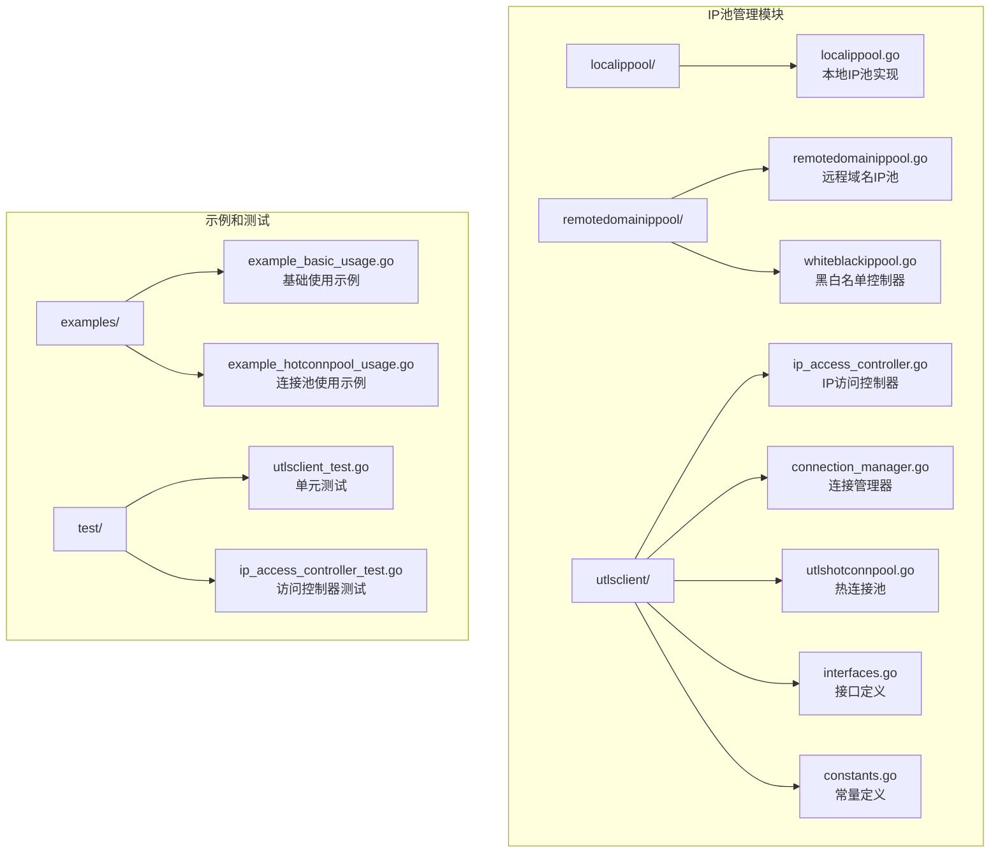
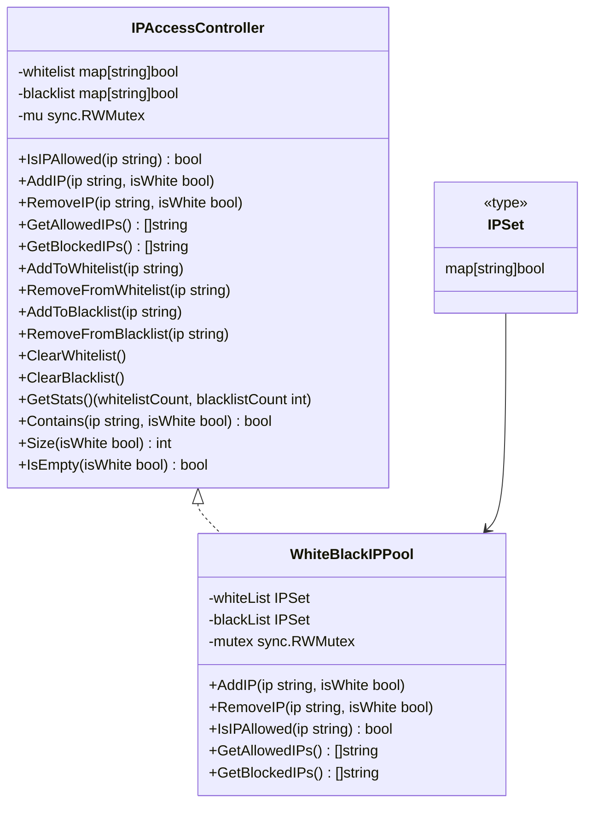
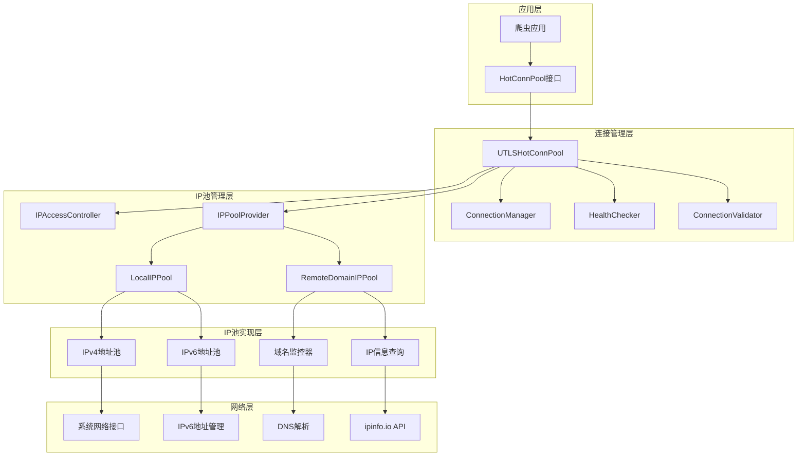
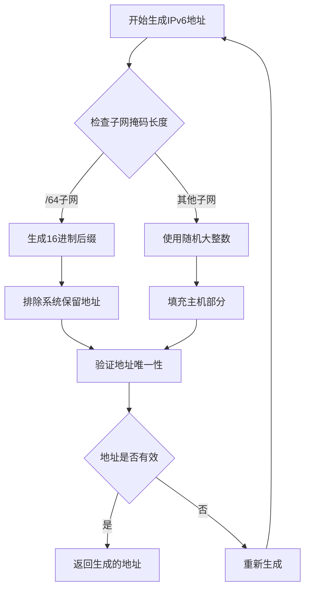
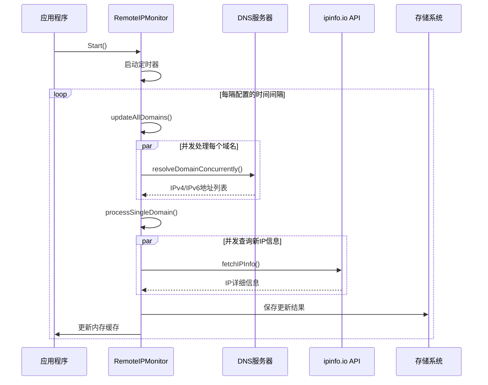
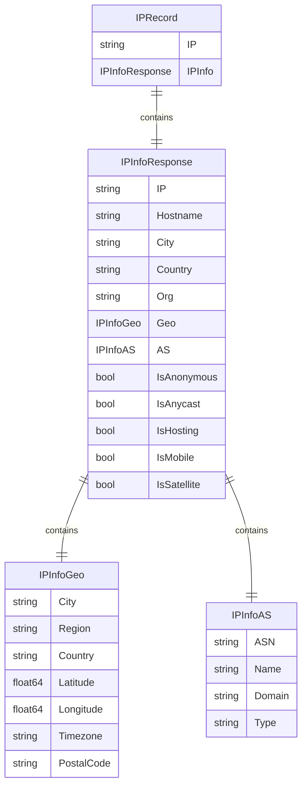
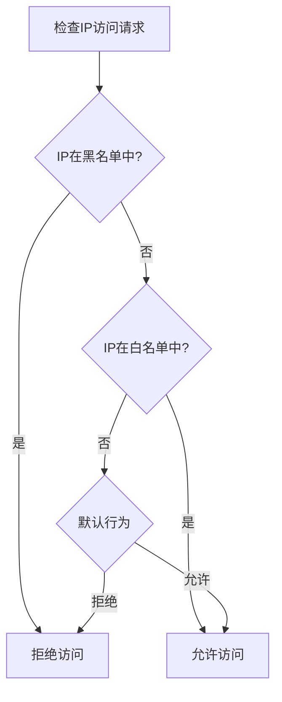
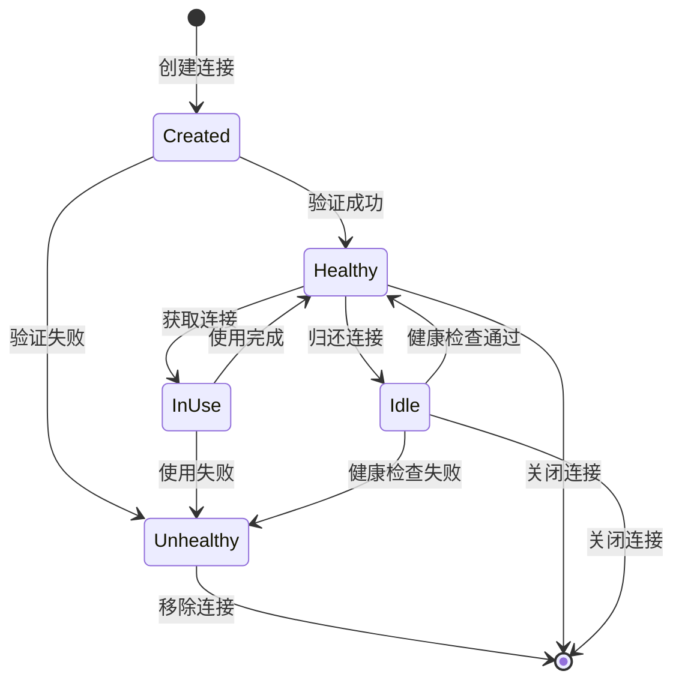
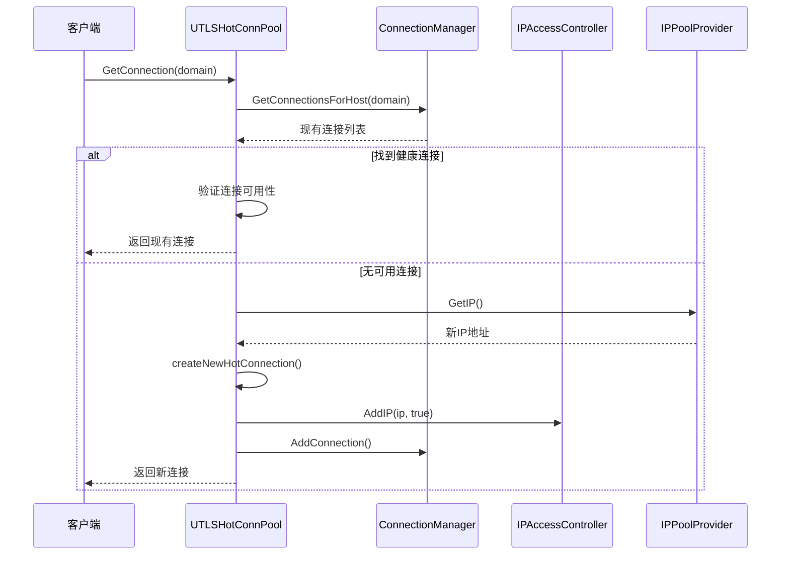
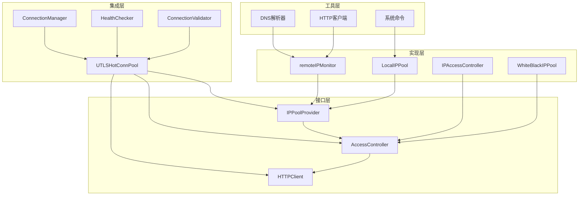

# IP池管理

<cite>
**本文档中引用的文件**
- [localippool.go](file://localippool/localippool.go)
- [remotedomainippool.go](file://remotedomainippool/remotedomainippool.go)
- [whiteblackippool.go](file://remotedomainippool/whiteblackippool.go)
- [ip_access_controller.go](file://utlsclient/ip_access_controller.go)
- [connection_manager.go](file://utlsclient/connection_manager.go)
- [utlshotconnpool.go](file://utlsclient/utlshotconnpool.go)
- [interfaces.go](file://utlsclient/interfaces.go)
- [constants.go](file://utlsclient/constants.go)
- [example_basic_usage.go](file://examples/utlsclient/example_basic_usage.go)
- [example_hotconnpool_usage.go](file://examples/utlsclient/example_hotconnpool_usage.go)
</cite>

## 目录
1. [简介](#简介)
2. [项目结构](#项目结构)
3. [核心组件](#核心组件)
4. [架构概览](#架构概览)
5. [详细组件分析](#详细组件分析)
6. [依赖关系分析](#依赖关系分析)
7. [性能考虑](#性能考虑)
8. [故障排查指南](#故障排查指南)
9. [最佳实践](#最佳实践)
10. [结论](#结论)

## 简介

IP池管理系统是爬虫平台的核心基础设施，负责智能管理和分配IP地址资源，以实现高效的网络爬取和访问控制。该系统采用分层架构设计，包含本地IP池、远程域名IP池和IP访问控制器三大核心组件，支持IPv4和IPv6双栈协议，并具备智能轮换、黑白名单管理、自动更新等高级功能。

系统的主要特点包括：
- **智能IP池管理**：支持本地IPv4和动态IPv6地址池
- **远程域名监控**：实时监控域名IP变化并自动更新
- **访问控制机制**：基于黑白名单的精细化访问控制
- **连接池集成**：与热连接池无缝集成，实现IP轮换
- **自动维护机制**：定期清理、健康检查和状态恢复
- **高并发支持**：基于goroutine的异步处理和读写锁保护

## 项目结构

IP池管理系统的文件组织结构清晰，按照功能模块进行划分：



**图表来源**
- [localippool.go](file://localippool/localippool.go#L1-L50)
- [remotedomainippool.go](file://remotedomainippool/remotedomainippool.go#L1-L50)
- [utlshotconnpool.go](file://utlsclient/utlshotconnpool.go#L1-L50)

**章节来源**
- [localippool.go](file://localippool/localippool.go#L1-L100)
- [remotedomainippool.go](file://remotedomainippool/remotedomainippool.go#L1-L100)
- [utlshotconnpool.go](file://utlsclient/utlshotconnpool.go#L1-L100)

## 核心组件

### IP池接口定义

系统定义了统一的IP池接口，确保不同实现之间的兼容性：

```mermaid
classDiagram
class IPPool {
<<interface>>
+GetIP() net.IP
+ReleaseIP(ip net.IP)
+MarkIPUnused(ip net.IP)
+SetTargetIPCount(count int)
+Close() error
}
class LocalIPPool {
-mu sync.RWMutex
-staticIPv4s []net.IP
-rand *mrand.Rand
-hasIPv6Support bool
-ipv6Subnet *net.IPNet
-ipv6Queue chan net.IP
-stopChan chan struct{}
-createdIPv6Addrs map[string]bool
-usedIPv6Addrs map[string]bool
-activeIPv6Addrs map[string]bool
+GetIP() net.IP
+ReleaseIP(ip net.IP)
+MarkIPUnused(ip net.IP)
+SetTargetIPCount(count int)
+Close() error
-generateRandomIPInSubnet() net.IP
-producer()
-manageIPv6Addresses()
}
class DomainMonitor {
<<interface>>
+Start()
+Stop()
+GetDomainPool(domain string) map[string][]IPRecord
}
class remoteIPMonitor {
-config MonitorConfig
-ticker *time.Ticker
-stopChan chan struct{}
-httpClient *http.Client
-latestData map[string]map[string][]IPRecord
+Start()
+Stop()
+GetDomainPool(domain string) map[string][]IPRecord
-run()
-updateAllDomains()
-processSingleDomain(domain string)
-resolveDomainConcurrently(domain string) ([]string, []string, error)
}
IPPool <|.. LocalIPPool
DomainMonitor <|.. remoteIPMonitor
```

**图表来源**
- [localippool.go](file://localippool/localippool.go#L16-L30)
- [remotedomainippool.go](file://remotedomainippool/remotedomainippool.go#L22-L35)

### IP访问控制器

访问控制器提供黑白名单管理功能，支持并发安全的操作：



**图表来源**
- [ip_access_controller.go](file://utlsclient/ip_access_controller.go#L8-L12)
- [whiteblackippool.go](file://remotedomainippool/whiteblackippool.go#L6-L25)

**章节来源**
- [localippool.go](file://localippool/localippool.go#L16-L80)
- [remotedomainippool.go](file://remotedomainippool/remotedomainippool.go#L22-L100)
- [ip_access_controller.go](file://utlsclient/ip_access_controller.go#L8-L50)
- [whiteblackippool.go](file://remotedomainippool/whiteblackippool.go#L6-L50)

## 架构概览

IP池管理系统采用分层架构，各组件职责明确，相互协作：



**图表来源**
- [utlshotconnpool.go](file://utlsclient/utlshotconnpool.go#L227-L277)
- [connection_manager.go](file://utlsclient/connection_manager.go#L8-L15)
- [interfaces.go](file://utlsclient/interfaces.go#L9-L49)

## 详细组件分析

### 本地IP池（LocalIPPool）

本地IP池是最核心的IP管理组件，支持IPv4和IPv6双栈协议，具备智能地址生成和管理能力。

#### 核心特性

1. **环境自适应**：自动检测系统网络环境，决定是否启用IPv6支持
2. **混合地址池**：同时维护IPv4静态地址和IPv6动态地址
3. **智能轮换**：支持IP地址的智能轮换和复用
4. **热加载机制**：后台异步管理地址池大小

#### IPv6地址生成算法



**图表来源**
- [localippool.go](file://localippool/localippool.go#L453-L508)

#### 地址池管理策略

本地IP池采用多种策略来优化地址池的使用效率：

| 策略类型 | 描述 | 实现方式 |
|---------|------|----------|
| **地址复用** | 优先复用未使用的活跃地址 | `GetIP()` 方法优先查找未使用地址 |
| **批量创建** | 批量创建IPv6地址以提高效率 | `batchCreateIPv6Addresses()` 方法 |
| **定期清理** | 定期清理未使用的地址 | `cleanupUnusedIPv6Addresses()` 方法 |
| **目标对齐** | 与远程IP池保持目标数量对等 | `SetTargetIPCount()` 方法 |

**章节来源**
- [localippool.go](file://localippool/localippool.go#L190-L400)
- [localippool.go](file://localippool/localippool.go#L1090-L1385)

### 远程域名IP池（RemoteDomainIPPool）

远程域名IP池负责监控特定域名的IP地址变化，提供实时的IP信息查询和管理功能。

#### 核心功能

1. **域名监控**：持续监控指定域名的IP地址变化
2. **IP信息查询**：通过ipinfo.io API获取详细的IP信息
3. **并发DNS解析**：使用多个DNS服务器并发解析以获得多样化结果
4. **增量更新**：只处理新增和变化的IP，提高效率

#### 监控流程



**图表来源**
- [remotedomainippool.go](file://remotedomainippool/remotedomainippool.go#L187-L215)
- [remotedomainippool.go](file://remotedomainippool/remotedomainippool.go#L216-L285)

#### 数据结构设计

远程IP池使用多层数据结构来组织和管理IP信息：



**图表来源**
- [remotedomainippool.go](file://remotedomainippool/remotedomainippool.go#L38-L87)

**章节来源**
- [remotedomainippool.go](file://remotedomainippool/remotedomainippool.go#L90-L200)
- [remotedomainippool.go](file://remotedomainippool/remotedomainippool.go#L286-L472)

### IP访问控制器

IP访问控制器提供细粒度的访问控制功能，支持黑白名单管理。

#### 访问控制策略

访问控制器采用"黑名单优先，白名单其次，默认拒绝"的策略：



**图表来源**
- [ip_access_controller.go](file://utlsclient/ip_access_controller.go#L22-L41)
- [whiteblackippool.go](file://remotedomainippool/whiteblackippool.go#L76-L99)

#### 并发安全设计

访问控制器使用读写锁来保证并发安全：

| 操作类型 | 锁类型 | 用途 |
|---------|--------|------|
| **读操作** | 读锁 | `IsIPAllowed()`, `GetAllowedIPs()`, `GetBlockedIPs()` |
| **写操作** | 写锁 | `AddIP()`, `RemoveIP()`, `ClearWhitelist()`, `ClearBlacklist()` |
| **统计操作** | 读锁 | `GetStats()`, `Size()`, `IsEmpty()` |

**章节来源**
- [ip_access_controller.go](file://utlsclient/ip_access_controller.go#L22-L184)
- [whiteblackippool.go](file://remotedomainippool/whiteblackippool.go#L76-L127)

### 连接管理器

连接管理器负责管理所有活跃的连接，提供连接的生命周期管理功能。

#### 连接状态管理



**图表来源**
- [connection_manager.go](file://utlsclient/connection_manager.go#L42-L74)

#### 清理策略

连接管理器实现了多种清理策略来维护连接池的健康状态：

| 清理类型 | 触发条件 | 清理动作 |
|---------|----------|----------|
| **空闲连接清理** | 连接空闲时间超过 `IdleTimeout` | 关闭连接并移除 |
| **过期连接清理** | 连接生命周期超过 `MaxLifetime` | 关闭连接并移除 |
| **健康检查清理** | 连接健康状态异常 | 标记为不健康并移除 |

**章节来源**
- [connection_manager.go](file://utlsclient/connection_manager.go#L141-L218)

### 热连接池

热连接池是整个IP池管理系统的顶层协调者，整合所有组件的功能。

#### 核心功能

1. **连接获取**：提供智能的连接获取机制
2. **IP轮换**：支持基于IP的连接轮换
3. **健康监控**：实时监控连接健康状态
4. **自动维护**：后台自动执行各种维护任务

#### 连接获取流程



**图表来源**
- [utlshotconnpool.go](file://utlsclient/utlshotconnpool.go#L370-L413)
- [utlshotconnpool.go](file://utlsclient/utlshotconnpool.go#L455-L508)

**章节来源**
- [utlshotconnpool.go](file://utlsclient/utlshotconnpool.go#L227-L329)
- [utlshotconnpool.go](file://utlsclient/utlshotconnpool.go#L725-L850)

## 依赖关系分析

IP池管理系统的组件间存在复杂的依赖关系，形成了清晰的层次结构：



**图表来源**
- [interfaces.go](file://utlsclient/interfaces.go#L9-L49)
- [utlshotconnpool.go](file://utlsclient/utlshotconnpool.go#L279-L329)

### 循环依赖处理

系统通过接口抽象避免了循环依赖问题：

1. **接口分离**：定义清晰的接口边界
2. **依赖注入**：通过构造函数注入依赖
3. **回调机制**：使用回调函数解耦组件

**章节来源**
- [interfaces.go](file://utlsclient/interfaces.go#L1-L81)
- [utlshotconnpool.go](file://utlsclient/utlshotconnpool.go#L329-L370)

## 性能考虑

### 并发性能优化

系统采用了多种并发优化技术：

1. **读写锁分离**：读密集场景下使用读锁，写操作使用写锁
2. **通道通信**：使用通道进行异步通信，避免阻塞
3. **goroutine池**：限制并发goroutine数量，防止资源耗尽
4. **批量操作**：批量处理IP地址，减少系统调用开销

### 内存优化策略

1. **对象池**：重用连接对象，减少GC压力
2. **懒加载**：按需创建IPv6地址，节省内存
3. **缓存机制**：缓存DNS解析结果和IP信息
4. **及时清理**：定期清理无用的连接和地址

### 网络性能优化

1. **连接复用**：最大化连接复用率
2. **健康检查**：主动检测连接健康状态
3. **超时控制**：合理设置各类超时参数
4. **重试机制**：智能重试失败的连接

## 故障排查指南

### 常见问题及解决方案

#### IP池初始化失败

**症状**：`IP池初始化失败：没有可用的IPv4地址，且IPv6环境不支持`

**原因分析**：
1. 系统缺少公网IPv4地址
2. IPv6子网配置错误
3. 网络接口配置问题

**解决方案**：
```bash
# 检查网络接口状态
ip addr show

# 检查IPv6支持
cat /proc/sys/net/ipv6/conf/all/disable_ipv6

# 检查DNS配置
cat /etc/resolv.conf
```

#### IPv6地址创建失败

**症状**：`警告: 创建IPv6地址失败`

**原因分析**：
1. 权限不足
2. 接口不存在
3. 子网配置错误

**解决方案**：
```bash
# 检查IPv6接口
ip link show | grep -i inet6

# 检查系统权限
sudo ip addr add 2001:db8::1/64 dev eth0

# 检查子网配置
ip -6 route show
```

#### 连接池健康状态异常

**症状**：连接池状态显示不健康

**诊断步骤**：
1. 检查连接池统计信息
2. 分析错误日志
3. 验证IP地址有效性

**解决方案**：
```go
// 获取连接池统计信息
stats := pool.GetStats()
fmt.Printf("总连接数: %d, 健康连接数: %d\n", 
    stats.TotalConnections, stats.HealthyConnections)
```

### 调试技巧

1. **启用调试日志**：设置适当的日志级别
2. **监控指标**：关注关键性能指标
3. **压力测试**：模拟高并发场景
4. **链路追踪**：跟踪请求处理流程

**章节来源**
- [constants.go](file://utlsclient/constants.go#L47-L86)

## 最佳实践

### 配置优化建议

#### 连接池配置

```toml
[pool]
max_connections = 100          # 根据服务器性能调整
max_conns_per_host = 10        # 控制单主机连接数
max_idle_conns = 20          # 空闲连接数
conn_timeout = 30            # 连接超时时间
idle_timeout = 60            # 空闲超时时间
max_lifetime = 300           # 连接最大生命周期
test_timeout = 10            # 测试超时时间
health_check_interval = 30   # 健康检查间隔
cleanup_interval = 60        # 清理间隔
blacklist_check_interval = 300  # 黑名单检查间隔
dns_update_interval = 1800     # DNS更新间隔
max_retries = 3              # 最大重试次数
```

#### IP池配置

```go
// 设置目标IP数量
pool.SetTargetIPCount(50)

// 添加白名单IP
accessCtrl.AddIP("192.168.1.1", true)
accessCtrl.AddIP("2001:db8::1", true)

// 添加黑名单IP
accessCtrl.AddIP("10.0.0.1", false)
accessCtrl.AddIP("2001:db8::2", false)
```

### 扩展开发指南

#### 自定义IP池实现

```go
type CustomIPPool struct {
    // 自定义字段
}

func (p *CustomIPPool) GetIP() net.IP {
    // 实现自定义IP获取逻辑
    return nil
}

func (p *CustomIPPool) ReleaseIP(ip net.IP) {
    // 实现IP释放逻辑
}

func (p *CustomIPPool) MarkIPUnused(ip net.IP) {
    // 实现IP标记为未使用逻辑
}

func (p *CustomIPPool) SetTargetIPCount(count int) {
    // 实现目标IP数量设置逻辑
}

func (p *CustomIPPool) Close() error {
    // 实现资源清理逻辑
    return nil
}
```

#### 自定义访问控制器

```go
type CustomAccessController struct {
    // 自定义字段
}

func (ctrl *CustomAccessController) IsIPAllowed(ip string) bool {
    // 实现自定义访问控制逻辑
    return true
}

func (ctrl *CustomAccessController) AddIP(ip string, isWhite bool) {
    // 实现自定义IP添加逻辑
}

func (ctrl *CustomAccessController) GetAllowedIPs() []string {
    // 实现自定义白名单获取逻辑
    return nil
}
```

### 故障预防措施

1. **监控告警**：设置关键指标的监控告警
2. **备份策略**：定期备份IP池配置和状态
3. **容量规划**：根据业务需求合理规划IP池大小
4. **测试验证**：定期进行功能和性能测试

**章节来源**
- [example_basic_usage.go](file://examples/utlsclient/example_basic_usage.go#L14-L30)
- [example_hotconnpool_usage.go](file://examples/utlsclient/example_hotconnpool_usage.go#L18-L42)

## 结论

IP池管理系统是一个功能完备、设计精良的网络资源管理解决方案。通过本地IP池、远程域名IP池和IP访问控制器的协同工作，系统实现了智能的IP地址管理、精细化的访问控制和高效的连接复用。

### 主要优势

1. **高度可扩展**：模块化设计支持灵活扩展
2. **高性能**：并发优化和智能缓存提升性能
3. **高可用**：多重保护机制确保系统稳定
4. **易维护**：清晰的架构和完善的监控机制

### 技术特色

1. **智能IPv6支持**：自动检测和利用IPv6资源
2. **实时监控**：远程域名IP变化的实时监控
3. **智能轮换**：基于负载和健康状态的智能轮换
4. **自动维护**：后台自动执行各种维护任务

### 应用价值

该系统为爬虫平台提供了强大的网络基础设施支持，能够有效应对现代Web应用的复杂网络环境，确保爬虫任务的高效执行和稳定性。通过合理的配置和使用，可以显著提升爬虫的并发能力和抗风险能力。